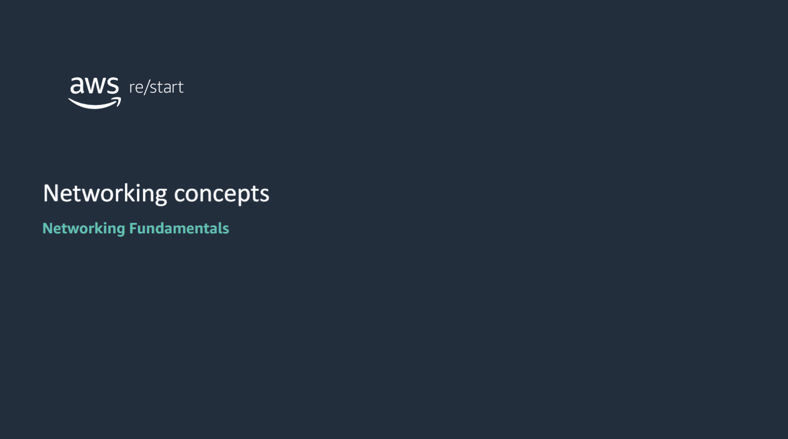

You will learn how to:

- Distinguish between different types of networks
- Describe common network management models and network topologies
- List different types of network protocols

## Types of computer networks

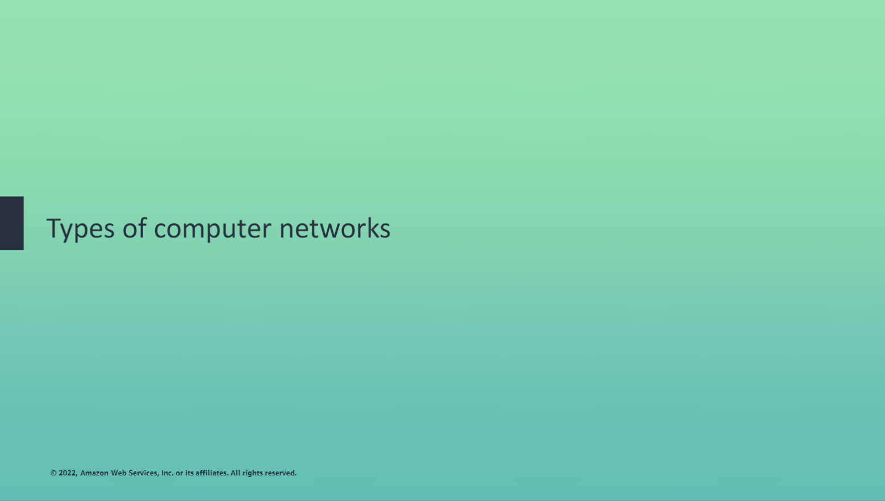

In this section, you will understand basic computer networks.

### Local-area network (LAN)

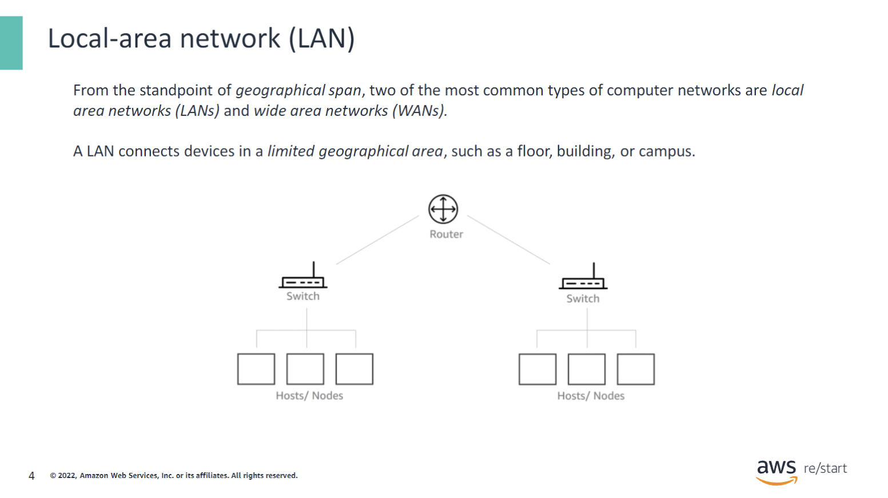

- In the example above, a LAN with one router, two switches, and three nodes under each switch. Each switch or subnet can represent an office floor or building within the same corporate office or school.
- LANs commonly use the Ethernet standard for connecting devices, and they usually have a high data-transfer rate.
- Wireless technology is also commonly used for a LAN.

### Wide-area network (WAN)

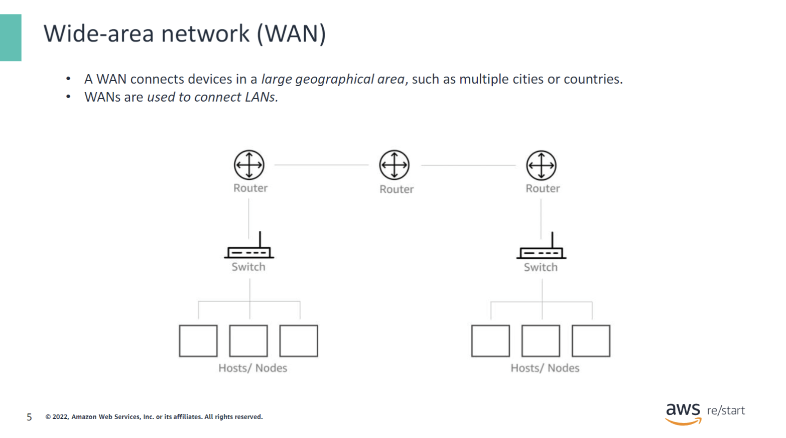

- In the example above, a WAN with three routers, two switches and three nodes under each switch. Examples of WANs are two corporate offices located across the United States connected by a WAN (the internet).
- WANs use technologies such as fiber-optic cables and satellites to transmit data which are used to connect LANs.
- The internet is considered to be the largest WAN.

### LAN vs. WAN

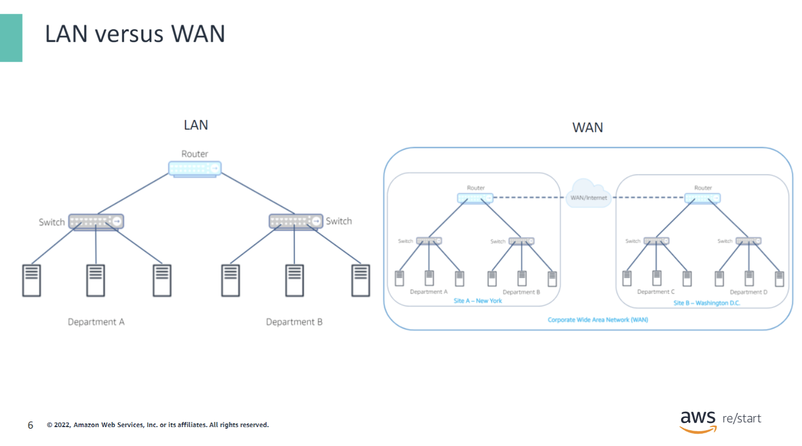

- LAN:
  - Within the same building or floor.

- WAN:
  - Can be geographically different locations; however, they are connected by a corporate WAN.

## Network topologies

In this section, you will understand basic network topologies (physical and logical).

#### What is a network topology

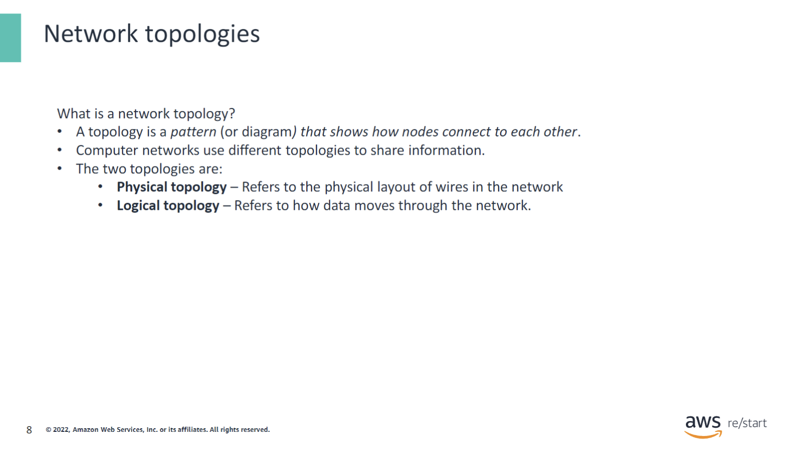

It's important to understand network management models because they define the roles and relationships of the devices in your network.

- Examples of network topologies include:
  - Bus
  - Star
  - Mesh
  - Hybrid

### Physical topologies

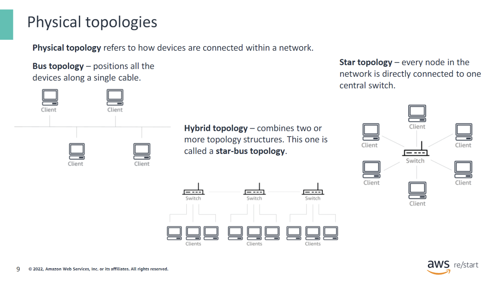

What is a physical topology?

- Refers to how a network is connected.
- Examples of network topologies include: **Bus, Star, Mesh, and Hybrid**.

**Bus** topology:

- The physical topology positions all the devices on a network along a single cable. They run in a single direction from one end of the network to the other.
- Also called a line topology or backbone topology.
- Simple to configure, but only allows one computer to send a signal at a time, which can cause network collisions that will bring down the network.

**Star** topology:

- Every node in the network is directly connected to one central switch by using coaxial, twisted-pair, or fiber-optic cables.

**Mesh** topology:

- A complex structure of connections similar to peer-to-peer, where the nodes are interconnected.
- Can be full mesh or partial mesh.
- In a partial-mesh topology, all devices are connected to at least two other devices.
- In a full-mesh topology, all nodes are interconnected, providing full redundancy for the network.
- Full-mesh is expensive and usually found in WANs.

**Hybrid** topology:

- Combines two or more different topology structures.
- Usually found in large organizations where separate departments have personalized network topologies.
- The star-bus topology is the most common hybrid topology today.

### Logical topologies

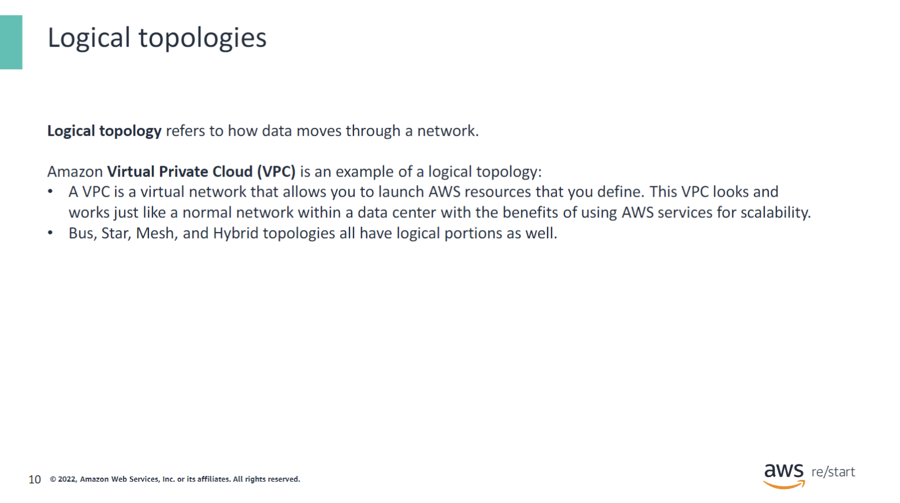

What is a logical topology?

- Refers to how data moves through a network.
- Examples of logical topologies include: **Bus, Star, Mesh, Hybrid, and VPC.**

**Bus** topology:

- Data flow on the network follows the route of the cable, moving in one direction.
- Simple to configure, but only allows one computer to send a signal at a time, which can cause network collisions that will bring down the network.

**Star** topology:

- Central switch manages data transmission.
- Data sent from any node must pass through the central switch to reach its destination.
- The central switch can also function as a repeater to prevent data loss.

**Mesh** topology:

- Complex structure of connections similar to peer-to-peer, where nodes are interconnected.
- Can be full mesh or partial mesh.
- In a partial-mesh topology, all devices are connected to at least two other devices.
- In a full-mesh topology, all nodes are interconnected, providing full redundancy.
- Full-mesh is expensive and usually found in WANs.

**Hybrid** topology:

- Combines two or more different topology structures.
- Usually found in large organizations with personalized network topologies for different departments.
- The star-bus topology is the most common hybrid topology today.

**VPC** topology:

- A virtual network that allows you to launch AWS resources that you define.
- It's a logical network.

### Amazon Virtual Private Cloud (VPC)

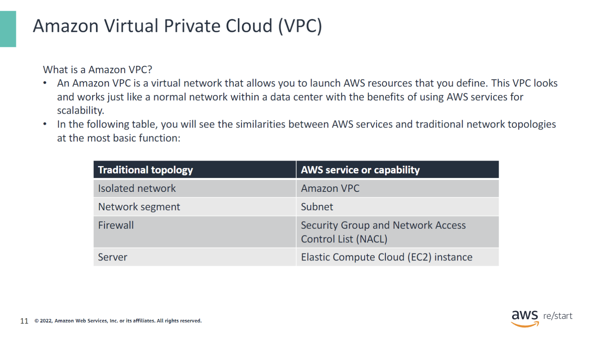

Please note that this is just a simple comparison of services between a traditional topology and AWS services.

- An isolated network most closely resembles the function of a VPC. Within an Amazon VPC, you can launch multiple AWS services and capabilities that are needed to create a working, scalable network. However, within an Amazon VPC, there is no maintenance required, and you can create an isolated architecture within minutes!
- A network segment acts as a subnet and separates a network between offices or buildings. AWS uses subnets in every architecture. Every node (EC2 instance) belongs in a subnet.
- Firewalls block traffic based on a set of rules. AWS has security groups that block traffic at the node (EC2 level) and NACLs that block traffic at the subnet level. These also block traffic based on a set of rules.
- Within a data center, there are servers. Within AWS, you can use an EC2 instance to launch an array of servers.

## Comparing LAN/WAN & Amazon VPC

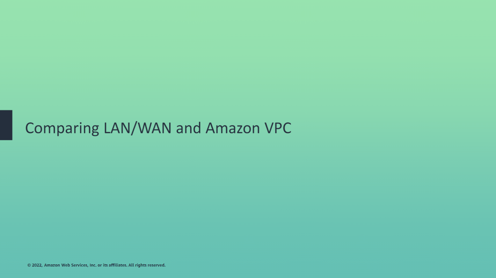

### LAN and AWS VPC

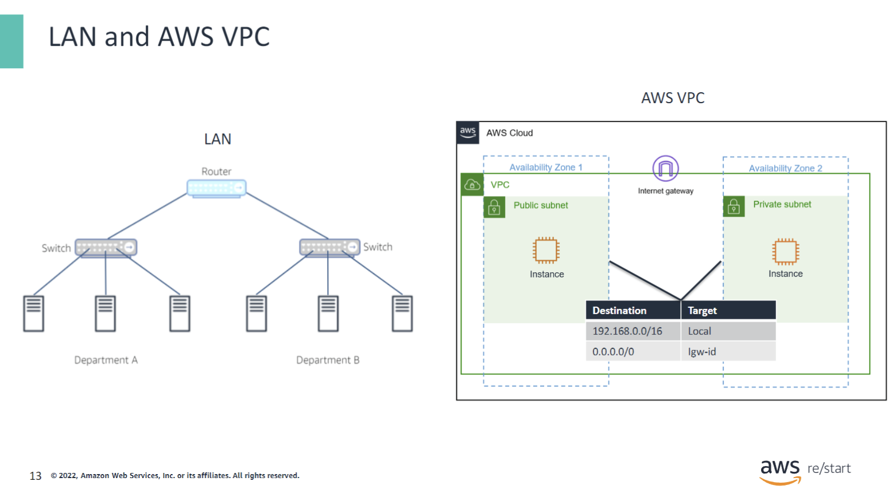

Above is an example of a LAN topology and an AWS VPC network. There are similarities between a LAN and an AWS VPC.

- Starting from the bottom of the LAN and center for the VPC, they both have nodes or instances.
- The next layer in the LAN is a switch or subnet, which is also depicted within the VPC as Public and Private subnets.
- Moving up one layer, there is a router in the LAN directing traffic. The table within the VPC that states the Destination and Target represents the routes that route traffic within and out of the VPC.

### WAN and AWS VPC

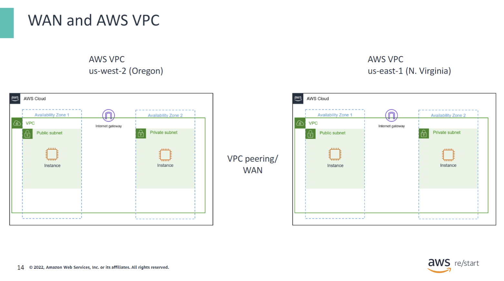

An example of a WAN where a city on the West coast can communicate to a city on the East coast from the same company within AWS is called VPC peering. This is beyond the scope of this course; however, this is an example of how this is achieved.

- When a VPC is created, it is created in a region which is like a state. These are located across the United States for high availability and redundancy. There are multiple regions in the world; however, for this example, two of the four regions of the United States were used (Oregon and N. Virginia).
- In order for these two VPCs to communicate and share resources together, just like a corporate WAN, a connection is needed. This connection is called VPC peering, which enables traffic to be routed privately between the two VPCs.

## Network management models

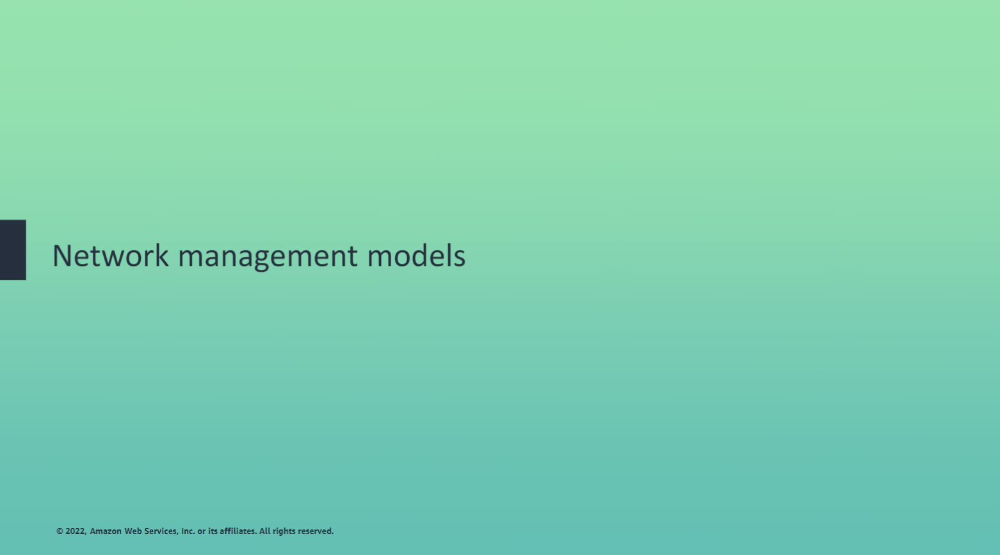

In this section, you will cover the different network management models.

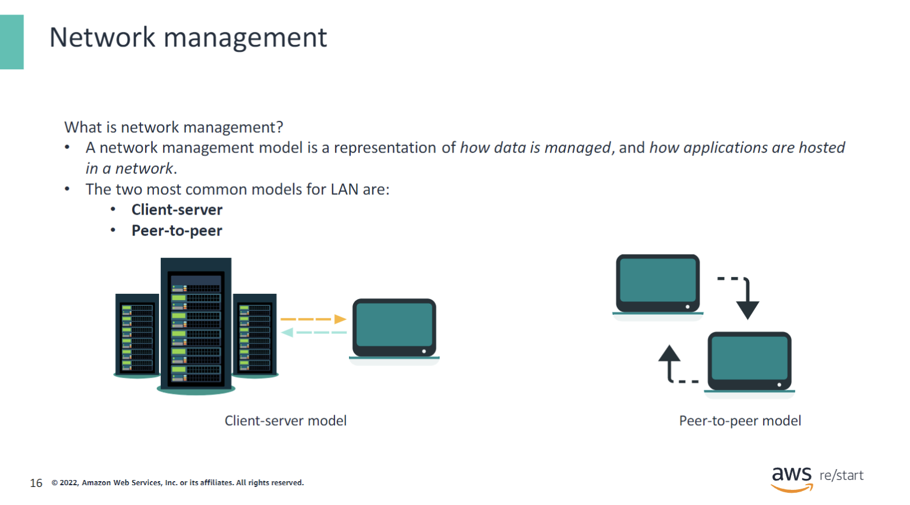

Why is it important?

- It's important to understand network management models because they define the roles and relationships of the devices in your network.
- The two most common for LAN are:
  - Client-server
  - Peer-to-peer

### Client-server model

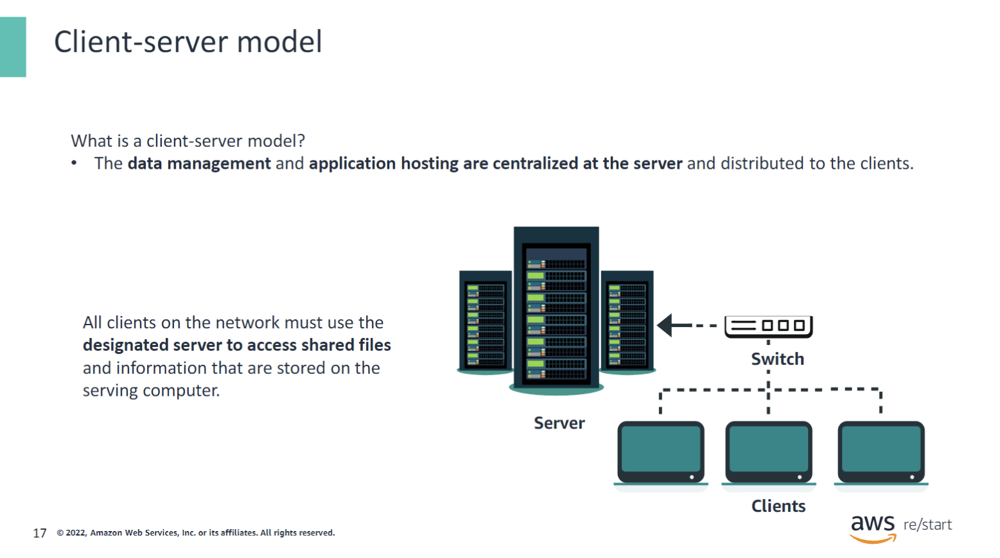

- In a client-server network model, the data management and application hosting are centralized at the server, and distributed to the clients.
- If the server goes down, no client can access the network until the server is restored.
- Examples of client-server models are:
  - File server and desktop clients
  - Print server and desktop clients

### Peer-to-peer model

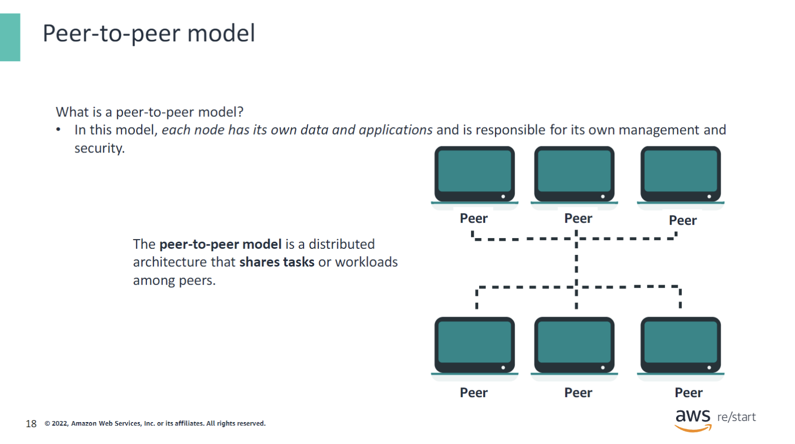

- In a peer-to-peer model, each node has its own data and applications and is responsible for its own management and security.
- Peers are equally privileged participants in the architecture.
- For example, files can be shared directly between systems on the network without a central server.
- This model might be considered under the following conditions:
  - Users are responsible for backing up each node.
  - Security requirements are not restrictive.
  - A limited number of peers are used.

## Network protocols

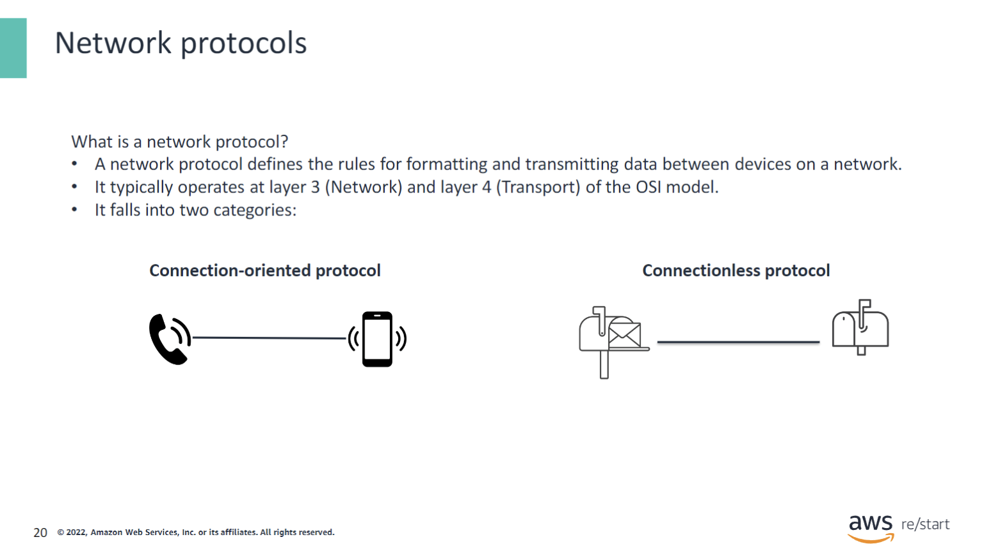

- An example of a connection-oriented protocol is a phone call between two people. One person calls and the other answers and therefore a connection is established.
- An example of a connectionless protocol is sending a package through the mail to another person. Once it leaves your hands, the package can get to its destination or it can get lost. It doesn’t require a connection to be established.

### Connection-oriented protocol

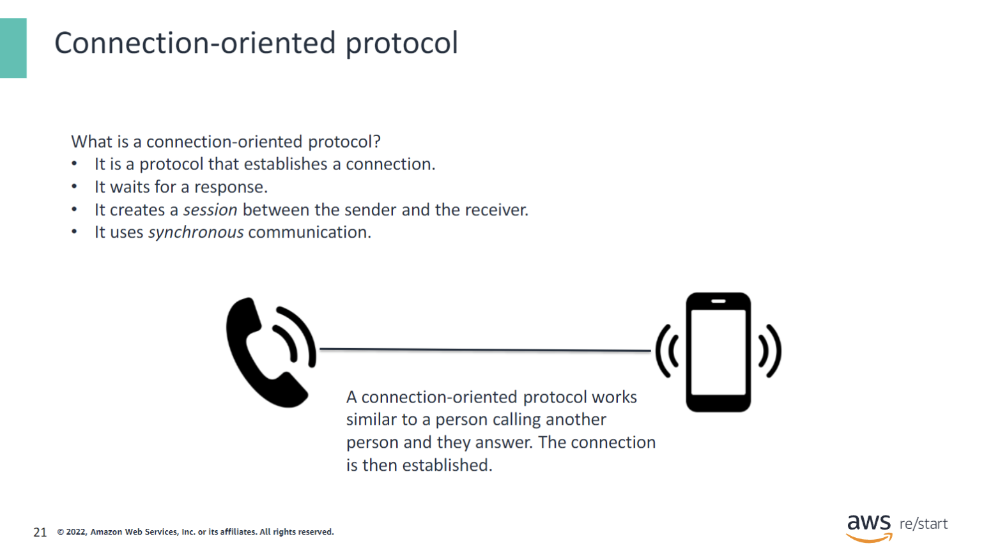

- With a connection-oriented protocol, there is typically a larger overhead because it ensures that a connection is established.
- It checks if the message was received or not received. If the message was received, a session is then established. If an error occurs or the message is not received, it sends the message again.
- It uses synchronous communication which means it happens in real time. For example, it requires two parties to establish a connection like a phone call between two people.

### Connectionless protocol

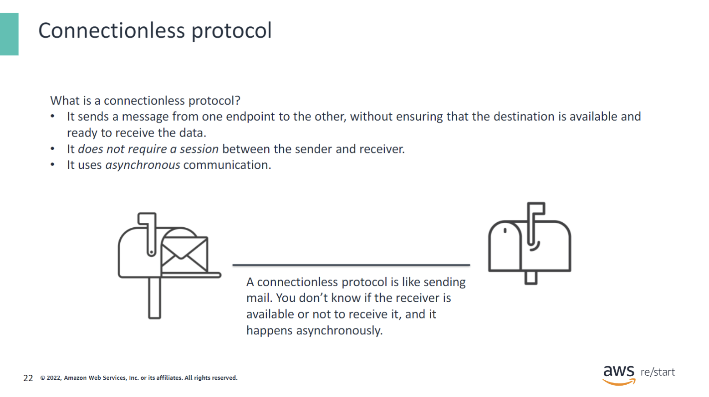

- With a connectionless protocol, there is typically little overhead because it doesn’t care if there is a session established.
- This is faster than a connection-oriented protocol and uses asynchronous communication which means that one of the parties does not have to be available for data to be sent.
- As far as a connectionless protocol is concerned, it just sends the data and doesn’t care if the receiving end gets the data or not.
- An example of this is like sending mail. You mail a letter or package and once it leaves your mailbox or post office it is asynchronous between the sender and receiver. The party isn’t readily available to receive the package and you won’t know exactly when they will be, you just send the mail hoping they will get it.

### Examples of network protocols

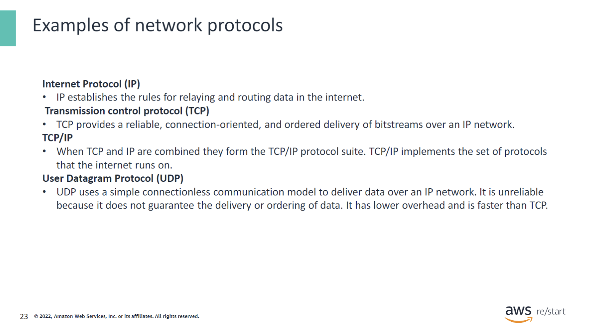

- **TCP/IP** is a connection-oriented protocol. It defines how to establish and maintain network communication in which application programs can exchange data. Data sent via this protocol is broken down into smaller chunks called packets. The goal of TCP/IP was to support an interconnection of networks (internet).
  - **TCP** is great for transferring important files since there is a guarantee of connection, even though there is a larger overhead (time).
  - With TCP, there is something called the TCP handshake. This handshake is comprised of three messages:
    - Synchronize (SYN)
    - Synchronize/Acknowledge (SYN/ACK)
    - Acknowledge (ACK)
  - During this handshake, the protocol establishes parameters that support the data transfer between two hosts. For example:
    - Host A sends a SYN packet to Host B.
    - Host B sends the SYN with an ACK attached to acknowledge that they received it with the message back to Host A.
    - Host A sends the last message with ACK to Host B letting them know they received the SYN/ACK message.
- **UDP** uses connectionless communication and there is no guarantee of the delivery or ordering of data. The best example and use case of UDP is media. When streaming services such as a movie, UDP is used because it is fast; however, there are times when you might see buffering and things may seem off or out of order, like the words do not match up to the picture. That is UDP delivering the data and the streaming service trying to order the data as UDP doesn’t guarantee the order or delivery.

### Transmission control protocol (TCP) handshake

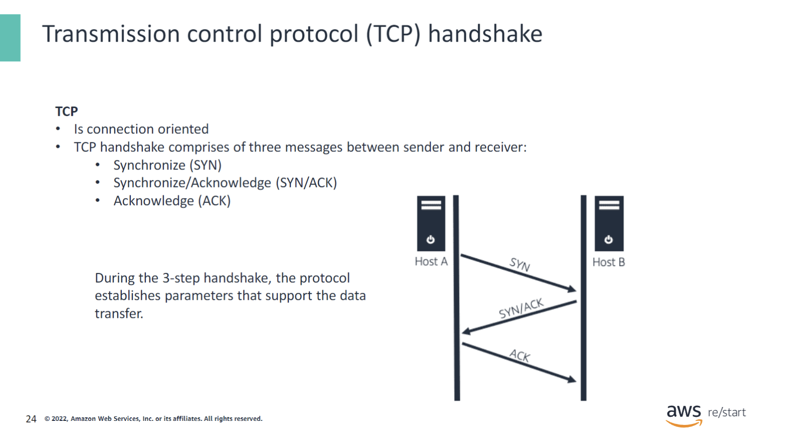

Why is this all important?

- When troubleshooting, you can use tools like Wireshark or tcpdump on a Linux machine to understand where your packets are getting lost in communication. By understanding the flags, and where they stand in each process, this will allow you to troubleshoot the issue of where the issue may lie.
- **TCP** is great for transferring important files since there is a guarantee of connection, even though there is a larger overhead (time).
  - It is connection-oriented.
  - With TCP, there is something called the TCP handshake. This handshake is comprised of three messages:
    - Synchronize (SYN)
    - Synchronize/Acknowledge (SYN/ACK)
    - Acknowledge (ACK)
  - During this handshake, the protocol establishes parameters that support the data transfer between two hosts. For example:
    - Host A sends a SYN packet to Host B.
    - Host B sends the SYN with an ACK attached to acknowledge that they received it with the message back to Host A.
    - Host A sends the last message with ACK to Host B letting them know they received the SYN/ACK message.
  - There is also a process where it gracefully closes the communication between sender and receiver (similar to saying good-bye to someone) with three messages:
    - Finish (FIN)
    - Finish/Acknowledge (FIN/ACK)
    - Acknowledge (ACK)
  - There are also something called reset (RST) flags when a connection closes abruptly and causes an error.

### User Datagram Protocol (UDP)

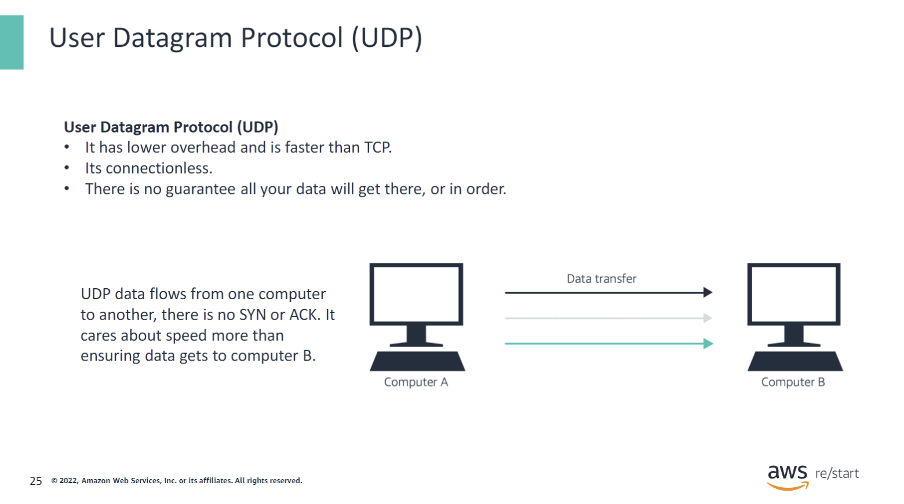

- **UDP** uses connectionless communication and there is no guarantee of the delivery or ordering of data. The best example and use case of UDP is media. When streaming services such as a movie, UDP is used because it is fast; however, there are times when you might see buffering and things may seem off or out of order like the words do not match up to the picture. That is UDP delivering the data and the streaming service trying to order the data as UDP doesn’t guarantee the order or delivery.
- It is about speed and doesn’t provide a three-way handshake to ensure data is delivered.
- UDP has a minimum set of functions and is considered unreliable compared to TCP.

## Checkpoint questions

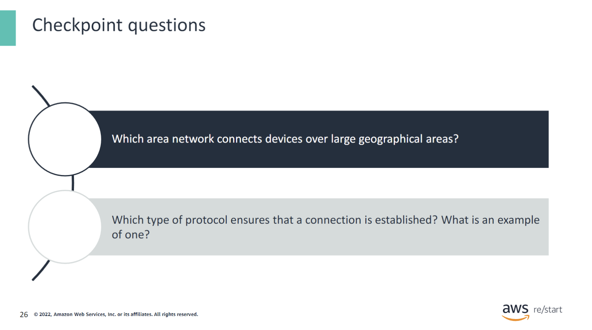

Q1: Which area network connects devices over large geographical areas?

-

Q2: Which type of protocol ensures that a connection is established? What is an example of one?

- Connection-oriented protocol
- TCP

## Key Takeaways

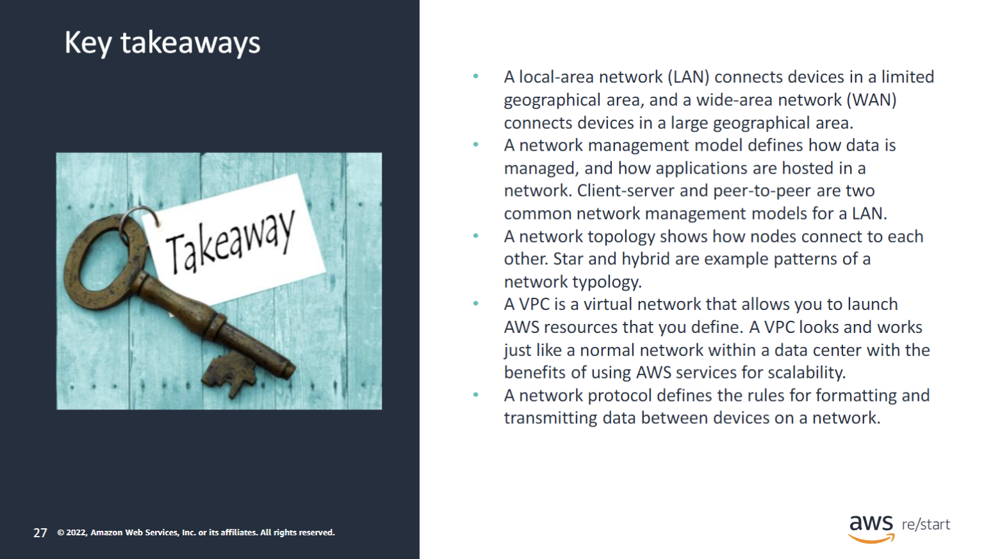
:::tip[Recap]

- A local-area network (LAN) connects devices in a limited geographical area, and a wide-area network (WAN) connects devices in a large geographical area.
- A network management model defines how data is managed, and how applications are hosted in a network. Client-server and peer-to-peer are two common network management models for a LAN.
- A network topology shows how nodes connect to each other. Star and hybrid are example patterns of a network typology.
- A VPC is a virtual network that allows you to launch AWS resources that you define. A VPC looks and works just like a normal network within a data center with the benefits of using AWS services for scalability.
- A network protocol defines the rules for formatting and transmitting data between devices on a network.

:::
