You will learn:

- Describe the Internet Protocol (IP) and its features
- Explain the purpose of an IP address and its notation
- Distinguish between different classes of IP addresses
- Convert an IP address to binary
- Describe port numbering and its use

## What is IP

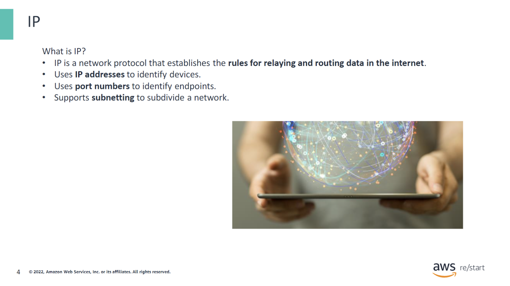

IP is a critical standard within the larger TCP/IP protocol suite when combined with the connection-oriented Transmission Control Protocol (TCP). TCP/IP implements a set of protocols that provide crucial services for the internet by enabling the successful routing of network traffic among devices on a network.

### IP addresses

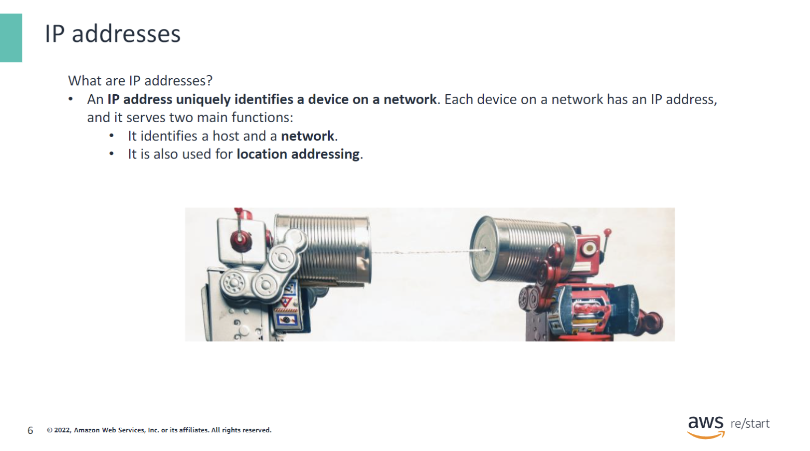

IP addresses:

- Work at layer 3 of the OSI model and are used to identify a host and a network.
- Can be assigned in a dynamic or static way:
  - Dynamic is when an assigned IP address can change.
  - Static is when an assigned IP address does not change.
- Can be made public or private:
  - A public IP address can be accessed over the internet.
  - A private IP address cannot be accessed over the internet.

### Private and public IP addresses – OSI model

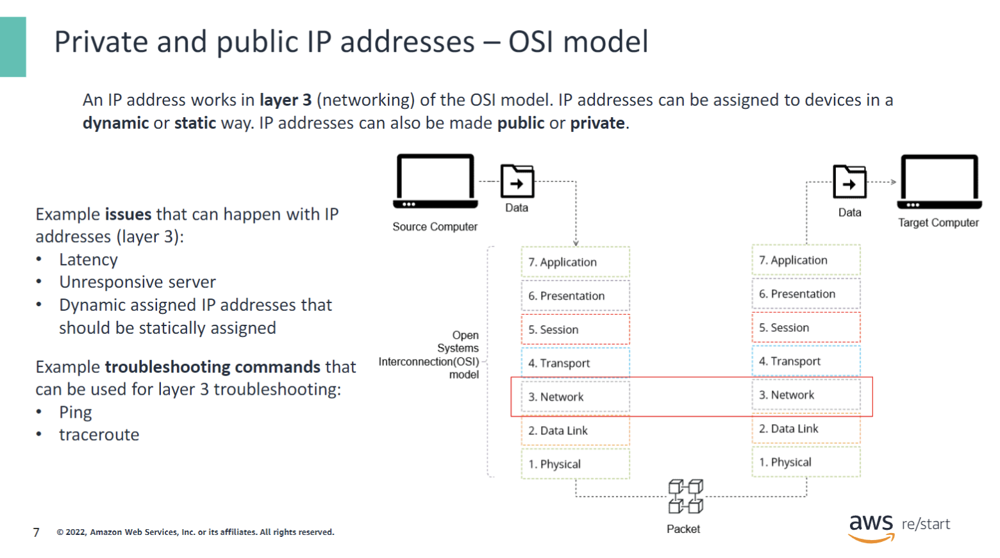

IP addresses:

- Work at layer 3 of the OSI model and are used to identify a host and a network.

- RFC 1918 provides a guide to private address space ([RFC 1918](https://datatracker.ietf.org/doc/html/rfc1918)):
  - 10.0.0.0 – 10.255.255.255
  - 172.16.0.0 – 172.31.255.255
  - 192.168.0.0 – 192.168.255.255
- **Why is this important for issues and troubleshooting?**
  - You might experience latency, where a site or application is taking a long time to load, possibly to the point that it times out. In corporate settings, latency is significant, and identifying its cause can save time and money. When troubleshooting latency at layer 3, you can use a command called traceroute, which provides a report on the path the packet takes from source to destination, checking for packet loss at each server hop. This will be covered in more detail in a later module.
  - You might encounter issues where a server is not responding to requests. Is it related to layer 3 or layer 4? Starting at the bottom and working your way up can help in troubleshooting. Checking the physical aspects first at layer 1 if possible, understanding layer 2 operations, and then layer 3 IP addresses are essential steps. For example, a server may not respond because it was assigned a dynamic IP address, even though layers 1 and 2 are functioning correctly. However, you cannot reach layer 3 due to an issue detected by a troubleshooting command called ping. This will be discussed further in another module.
  - Understanding how each layer works and where potential issues may occur will assist in troubleshooting basic networking problems.

### Layer 3 of the OSI model

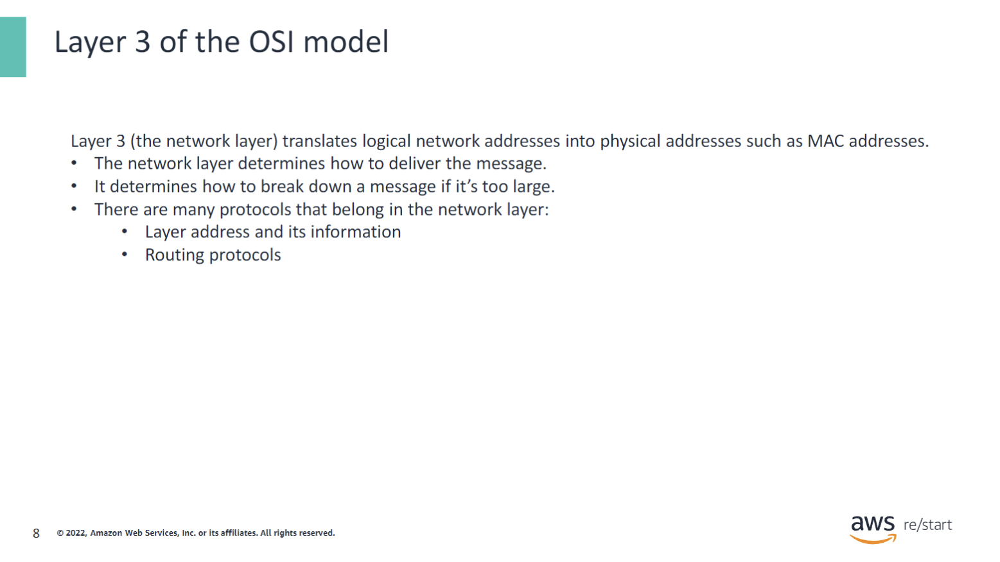

- **Why is it important?**
  - Layer 2 (data link) establishes the connection between two nodes. These nodes have physical components that use a MAC address, which needs to be translated to a logical address. At layer 3 (network), this translation between logical and physical addresses occurs.
  - Understanding the distinctions between where MAC and IP addresses reside and function is crucial when troubleshooting issues in the future.

### Private and public IP addresses

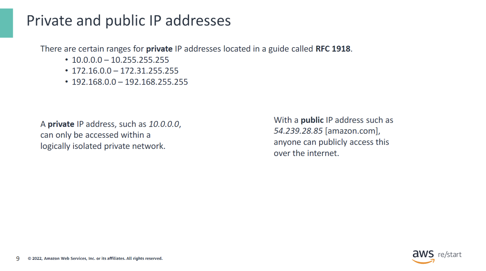

IP addresses:

- Work at layer 3 of the OSI model and are used to identify a host and a network.
- RFC 1918 provides a guide to private address space ([RFC 1918](https://datatracker.ietf.org/doc/html/rfc1918)):
  - 10.0.0.0 – 10.255.255.255
  - 172.16.0.0 – 172.31.255.255
  - 192.168.0.0 – 192.168.255.255

### IP addresses – IPv4

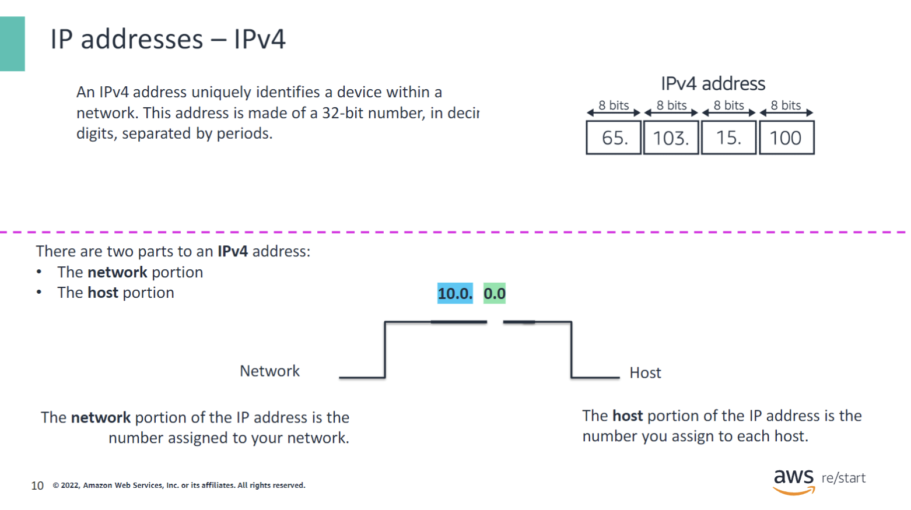

IPv4 addresses:

- An IP address consists of four numbers from 0 to 255 separated by a period, also known as a dotted quad (for example, 10.15.200.0). This format follows the IPv4 standard. The numbers in the IP address identify both the network and the device on the network.
- An IP address is made of a 32-bit number, where each of the numbers between the dots is an 8-bit binary number. Thus, the entire address is a 32-bit binary number. For example:
  - An IP address of 10.100.20.5: the 10 is 8-bits, the 100 is 8-bits, the 20 is 8-bits, and the 5 is 8-bits totaling 32-bits (8x4).
- Each binary digit, or bit, has the value of zero or one, and has a separate decimal value.
- The network portion of the IP address is the number assigned to your network.
- The host portion of the IP address is the number you assign to each host.

### IP addresses – IPv6

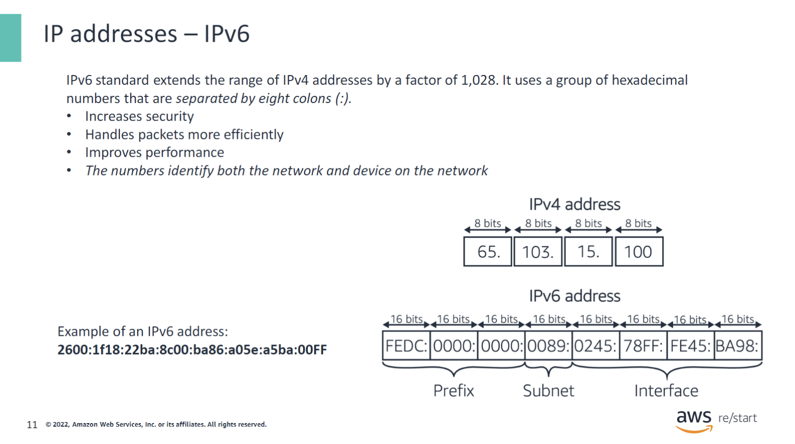

IPv6 addresses:

- The extra digits in IPv6 allow an expanded number of available addresses.
- Each decimal value now allows for 16 bits instead of the 8 bits that IPv4 provided.
- IPv4 provided an estimated 4.2 billion addresses, while IPv6 provides around 340 trillion, trillion, trillion addresses to keep up with today’s growing list of Internet of Things (IoT) devices.

### IP addresses – dynamic and static

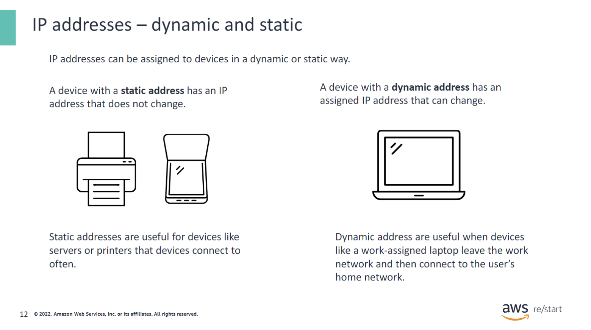

Dynamic and static IP addresses:

- **Dynamic IP addresses** can change. Useful for devices that leave and come back to a network.
- **Static IP addresses** do not change. Useful for devices that are connected to often, like printers.

### IP addresses - EC2 instances

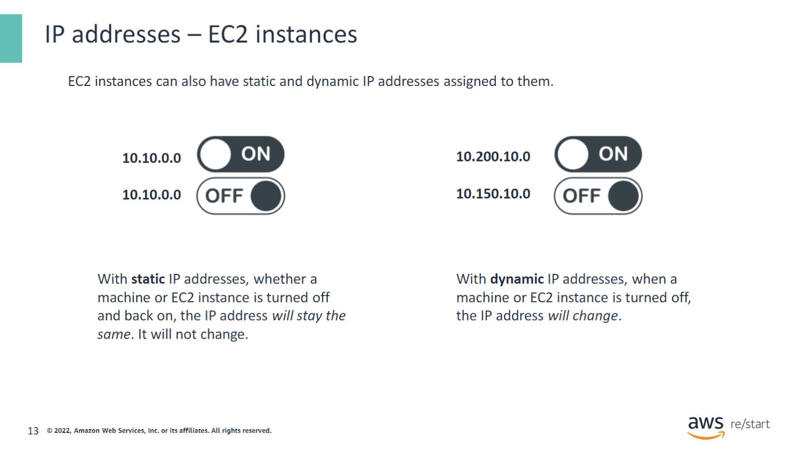

EC2 instances can be assigned a static or dynamic IP address depending on the use case. If the instance is used as a server, the best address to assign it is a static IP address, also known as an Elastic IP address (EIP). Otherwise, it will be assigned a dynamic IP address, when the instance is stopped and restarted, the IP address will change.

### IP addresses – summary

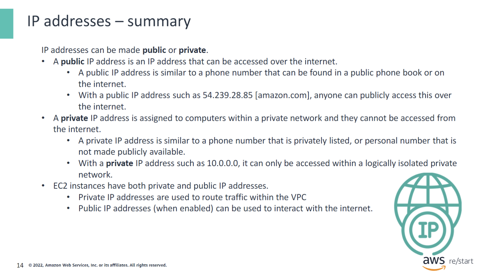

Public or private IP addresses:

- **Public IP address** can be accessed over the internet. It is a globally unique IP address assigned to a computing device that must access the internet.
- **Private IP address** cannot be accessed from the internet. Example: the application and database servers in your data center are assigned private IP addresses because you might not want other devices to know about these servers.

### IP addresses – special purpose

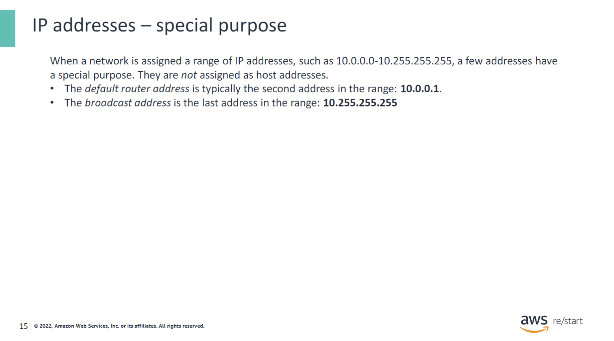

Special purpose IP addresses:

- **Default router address** is typically the second address in the range. For example, in the range of 10.0.0.0-10.255.255.255, 10.0.0.1 is the default router address.
  - Also known as the gateway address.
  - It’s the IP address of the network router.
- **Broadcast address** is the last address in the range: 10.255.255.255.
  - The broadcast address is used to transmit messages to all devices that are connected to a network. If a message is sent to a broadcast address, then all nodes on the network can receive it.

### Converting an IP address into binary

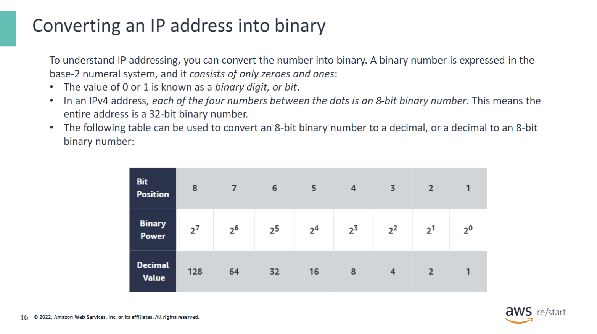

IPv4 addresses:

- An IP address consists of four numbers from 0 to 255 separated by a period, which is also known as a dotted quad (for example, 10.15.200.0). This format follows the IPv4 standard. It is important to note that the numbers in the IP address identify both the network and the device on the network.
- IP address identifies both the network and the device on the network.
- The value of 0 or 1 is known as a binary digit or bit.
- Each of the four numbers between the dots are 8-bit binary numbers, equaling 32-bits in total.
- This is the traditional theory to do so, however, there are many webtools available to use in order to convert IP to binary and vice versa. Many professionals use webtools today, but it is important to understand the basic theory as well. In your free time, explore the available webtools that can be found on the internet.

### Port numbers

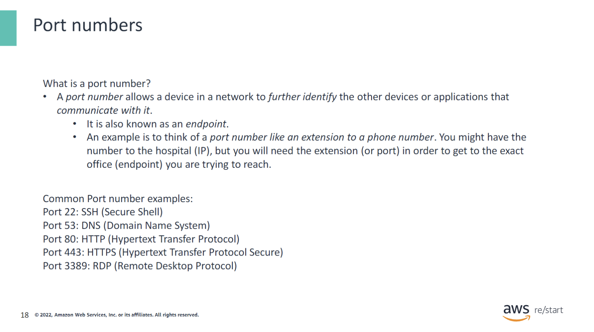

- **Purpose**: A device might send or receive data from multiple devices simultaneously. A port number, in combination with an IP address, enables the device to determine the exact source or destination of the data, which is also known as the endpoint.
- **Functionality**: A computer can receive and send information in multiple ways simultaneously. For example, it can download a file over File Transfer Protocol (FTP) from an Amazon Simple Storage Service (Amazon S3) bucket, stream a live video from Twitch, and receive email messages—all at the same time.

#### Common Port Number Examples

- **Port 22**: SSH – Used to create a secure network connection.
- **Port 53**: DNS – Used for the modern internet and Amazon's Route53 service.
- **Port 80**: HTTP – Protocol used to connect to a webpage, such as http://www.amazon.com.
- **Port 443**: HTTPS – A secure version of HTTP, used for secure sites, such as https://www.amazon.com.
- **Port 3389**: RDP – Protocol that allows users to remotely connect to their desktop from another computer.

#### Port number example

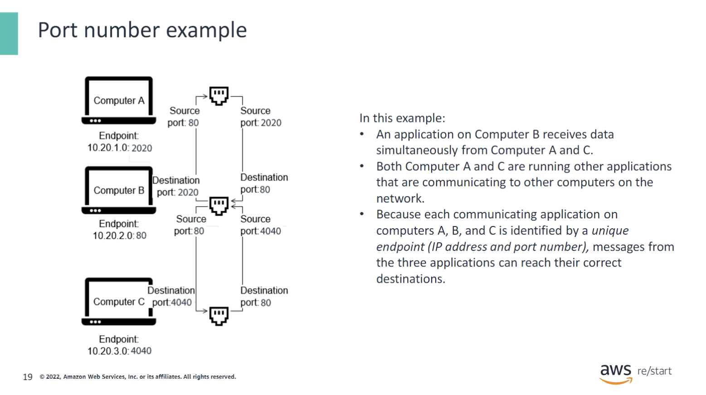

- **Example**: Port numbers and IP addresses work together to ensure that messages reach their correct destination.

#### Why is this important?

- **Security**: Ports can be blocked or allowed to certain traffic for security reasons. When a port is blocked by a firewall, or by an AWS service like a Security Group or Network Access Control List in a VPC, the source will not be able to send or receive traffic depending on the rules.
- **Troubleshooting**: Commands such as `netstat`, `ss`, and `telnet` can be used at layer 4 of the OSI model (and some at layer 7) to troubleshoot issues.
  - **netstat**: Confirms established connections. If a port is blocked, it will not show as an established connection.
  - **telnet**: Confirms TCP connections to a web server. This can also be used at layer 7 in the OSI model.
  - **ss**: Similar to netstat, but confirms IPv4 connections only.

### Checkpoint questions

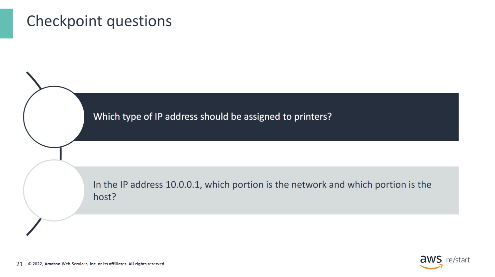

Q1: **Which type of IP address should be assigned to printers?**

- Static

Q2: **In the IP address 10.0.0.1, which portion is the network and which portion is the host?**

- 10.0. is the network and 0.1 is the host.

### Key takeaways

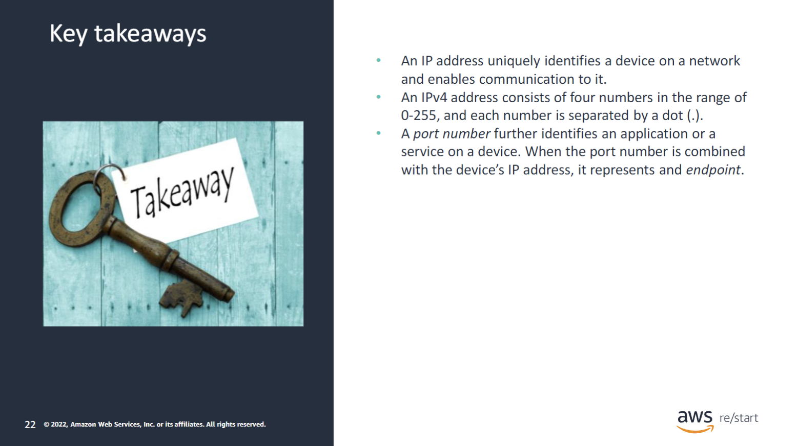
:::tip[Recap]

- **An IP address** uniquely identifies a device on a network and enables communication to it.
- **An IPv4 address** consists of four numbers in the range of 0-255, with each number separated by a dot (.).
- **A port number** further identifies an application or a service on a device. When the port number is combined with the device’s IP address, it represents an endpoint.

:::
