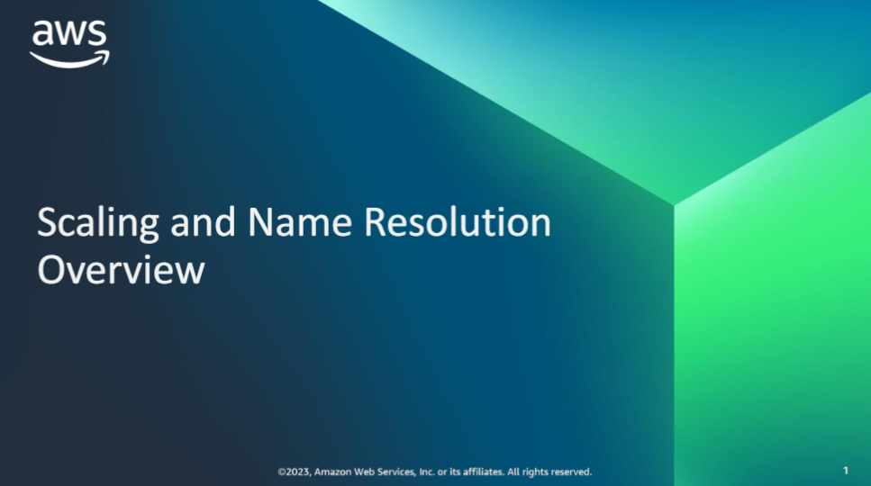
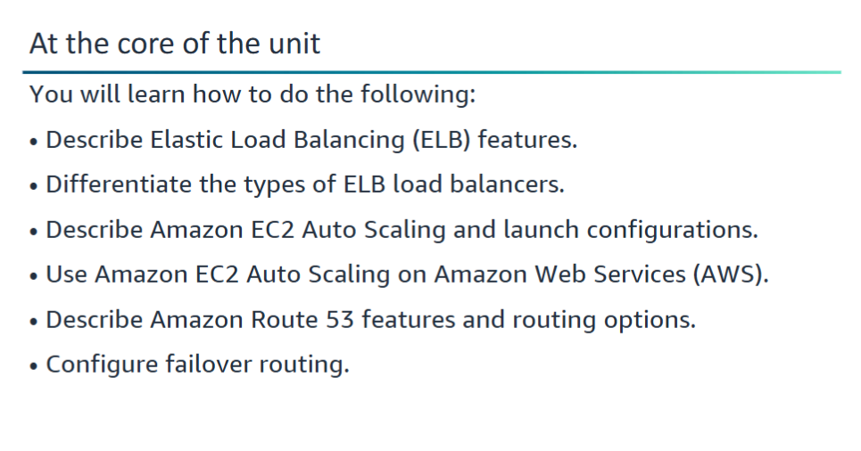
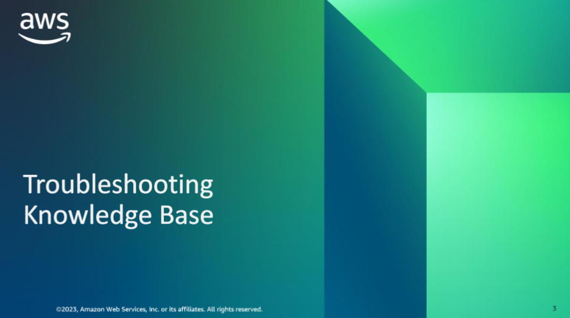
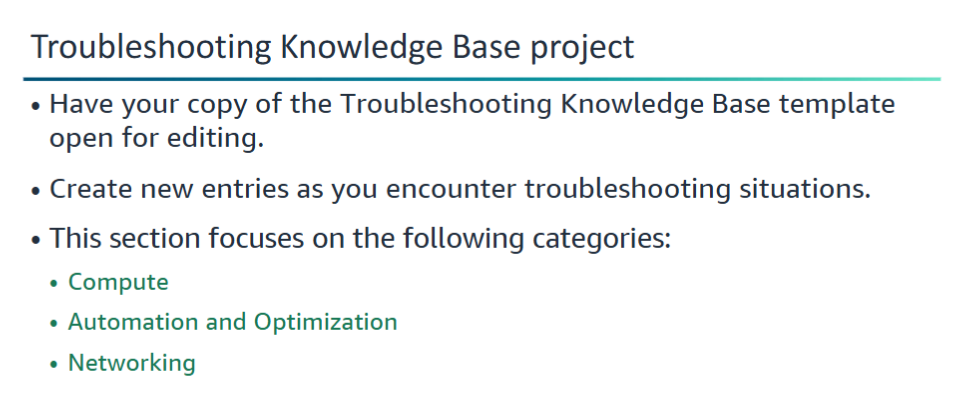

Be ready to create some entries in your Troubleshooting Knowledge Base document based on the Scaling and Name Resolution topics. 

Two of the key topics of this unit are ELB and Amazon EC2 Auto Scaling. For these topics, add to entries in the Compute category and the Automation and Optimization category of your knowledge base. The unit also discusses Amazon Route 53, which will provide opportunities for you to add Networking category entries your knowledge base.
