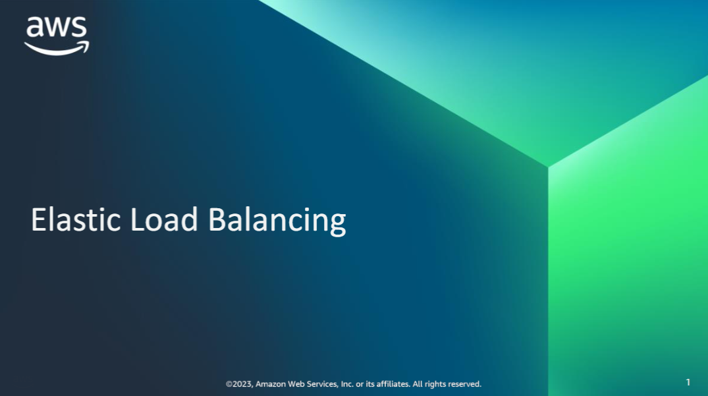
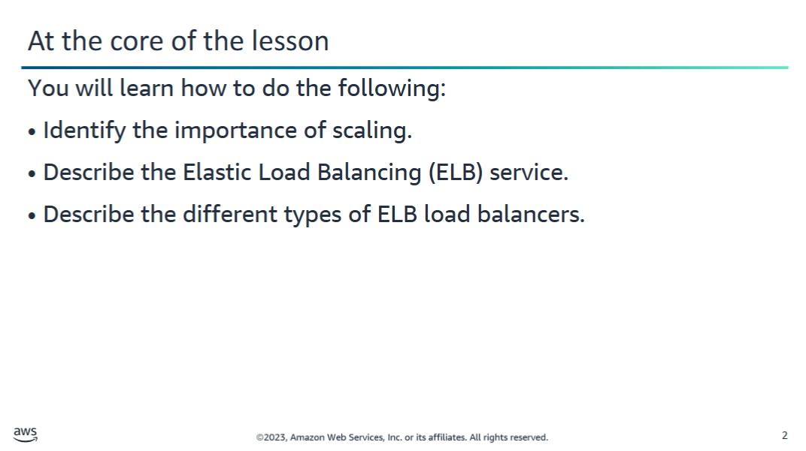
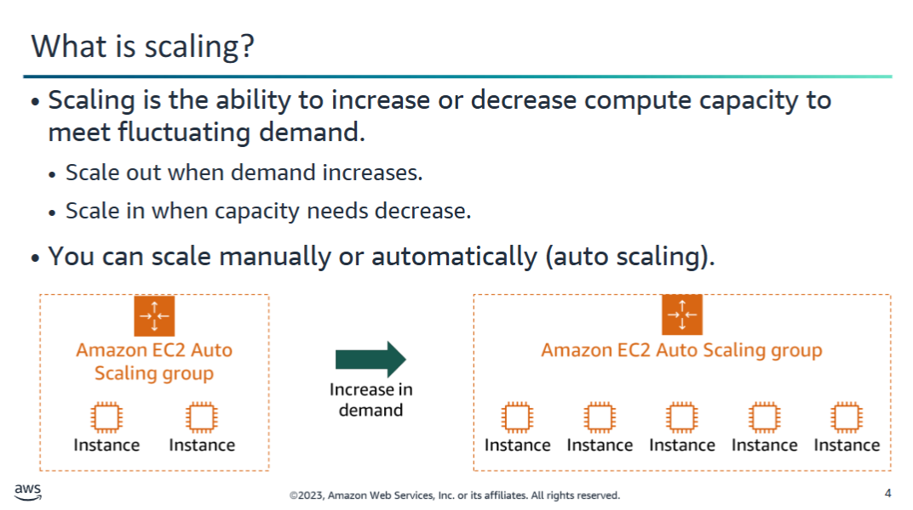
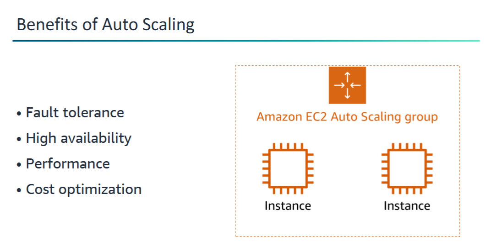
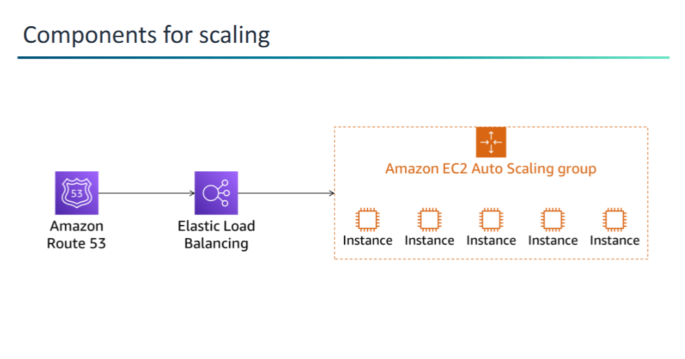
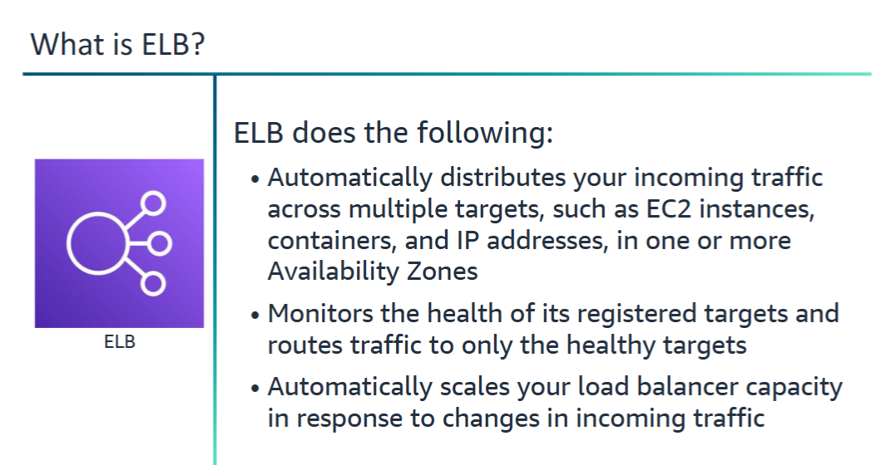

## What is scaling?

### Traditional Data Center Limitations

In a traditional data center:

- **Scalability is limited** by physical hardware.
- Example: A tax preparation business in the U.S. sees:
  - A **steady traffic increase** from mid-January.
  - A **peak in traffic** by April 15 (tax deadline).
- In preparation, companies must **provision extra servers** to handle this load.
- After April 15, these servers often remain **underutilized** or **idle** for months.

---

### Flexible Scaling in the Cloud

In the cloud, **computing power is a programmatic resource**, which allows:

- **Creating new EC2 instances** ahead of known peaks.
- Using **monitoring and automated scaling** to respond to metrics like CPU usage.
- **Scaling in/out automatically**, based on real-time demand.

---

### Benefits of Amazon EC2 Auto Scaling

**Amazon EC2 Auto Scaling** ensures the right number of instances are available:

- Define thresholds such as:
  - **Maximum**
  - **Minimum**
  - **Desired capacity**
- Helps balance **cost and performance**.
- You **pay only for what you use**, when you use it.

## Benefits of Using Amazon EC2 Auto Scaling

Adding **Amazon EC2 Auto Scaling** to your application architecture helps you maximize the benefits of the AWS Cloud. Key benefits include:

### • Better Fault Tolerance
- Automatically detects unhealthy instances.
- Terminates and replaces them as needed.
- Supports **multiple Availability Zones**:
  - If one zone becomes unavailable, EC2 Auto Scaling can launch instances in another to maintain service continuity.

### • Better Availability
- Maintains the **right amount of capacity** to handle current traffic demand at all times.

### • Better Performance
- Automatically increases instance count during traffic spikes.
- **Distributes workload**, improving response times and overall application performance.

### • Better Cost Management
- **Dynamically adjusts capacity** to meet demand.
- You **only pay** for EC2 instances when they are actually needed.
- Helps **reduce cost** by terminating idle or unnecessary instances.

## Components for scaling

To implement a **scalable, on-demand architecture**, you can combine several AWS services. The main components are:

### 1. Amazon Route 53
- **Highly available and scalable** cloud Domain Name System (DNS) web service.
- Translates domain names (e.g., `www.example.com`) into numeric IP addresses (e.g., `192.0.2.1`).
- Often used to **route traffic to an ELB** load balancer.

### 2. Elastic Load Balancing (ELB)
- Automatically **distributes incoming traffic** across multiple targets:
  - EC2 instances
  - Containers
  - IP addresses
- Load balancers are usually configured to point to **Amazon EC2 Auto Scaling groups**.

### 3. Amazon EC2 Auto Scaling Groups
- Contain a collection of EC2 instances with similar characteristics.
- Treated as a **logical grouping** for:
  - Scaling
  - Management
- Help maintain application availability.
- Dynamically **scale capacity up or down** based on defined conditions.
- Instances are **automatically registered** with the load balancer when launched or terminated.

One of the services that you use to implement scaling in the AWS Cloud is ELB.

