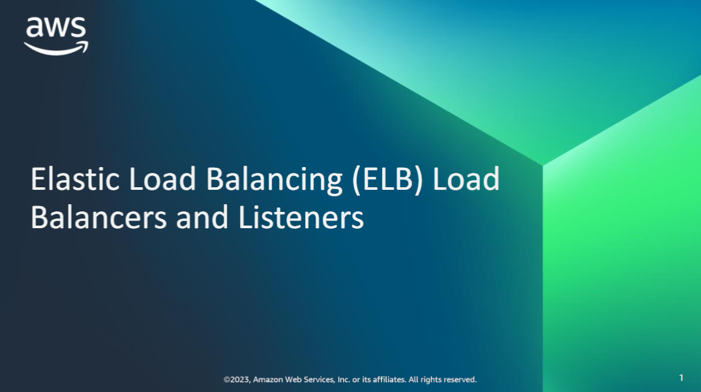

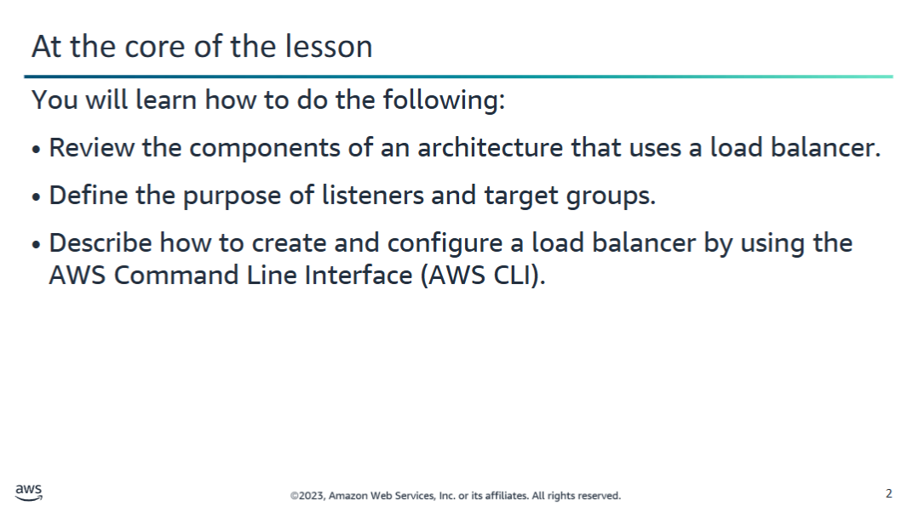

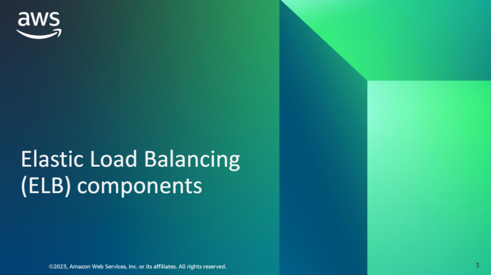

## Elastic Load Balancer (ELB) Overview

Recall the following information from the ELB presentation:

- A **load balancer** acts as the **single point of contact** for clients.
- It serves as a **traffic flag** in front of your servers.
- It **distributes incoming application traffic** across multiple targets, such as **Amazon EC2 instances**.
- The load balancer **maximizes speed** by monitoring:
  - **Capacity performance**
  - **Health status** of targets in multiple **Availability Zones**

### Before using a load balancer:
To benefit from its features, you must:

1. **Add listeners**  
2. **Register your targets** (or **target groups**)

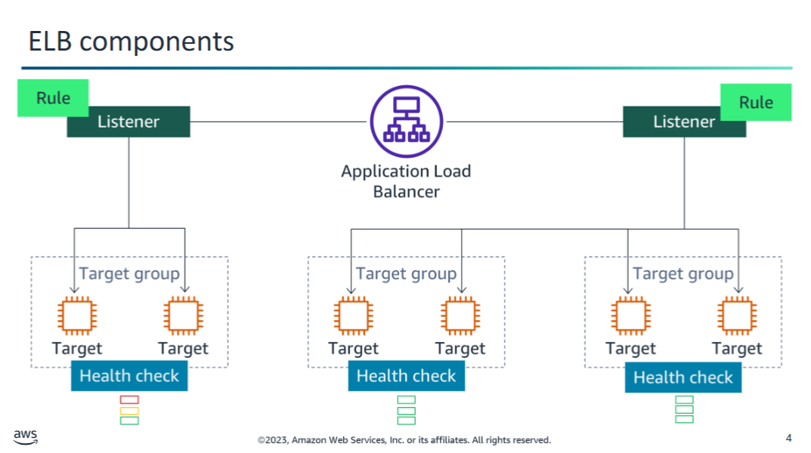

## Components of Elastic Load Balancing (ELB)

To describe the components of Elastic Load Balancing (ELB), this example shows an **Application Load Balancer** for a website.

- The **load balancer** serves as the **single point of contact** for all clients.
- It **distributes incoming application traffic** across multiple targets.

### Listeners

Load balancers can have **more than one listener**. This example shows two listeners:

- Each **listener**:
  - Checks for **connection requests** from clients.
  - Uses the **protocol and port** that were configured.
  - **Forwards requests** to one or more **target groups**, based on **defined rules**.

### Listener Rules

- **Rules** are attached to each listener.
- Each rule specifies:
  - A **target group**
  - A **condition**
  - A **priority**

#### Behavior

- When the **condition is met**, the traffic is forwarded to the specified **target group**.
- You **must define a default rule** for each listener.
- You can add additional rules to specify **different target groups** based on the **content of the request**.
- This setup is known as **content-based routing**.

### Target Groups

- Each **target group** routes requests to one or more **registered targets** (e.g., EC2 instances).
- Routing is done using the **protocol and port** you specify.
- You can:
  - **Register a target with multiple target groups**
  - **Configure health checks** for each target group

### Health Checks

- Performed on all targets registered to a target group that is specified in a listener rule.
- Help ensure only healthy targets receive traffic.

> Note: Each listener contains a **default rule**, and one listener contains an additional rule that routes requests to a different target group.

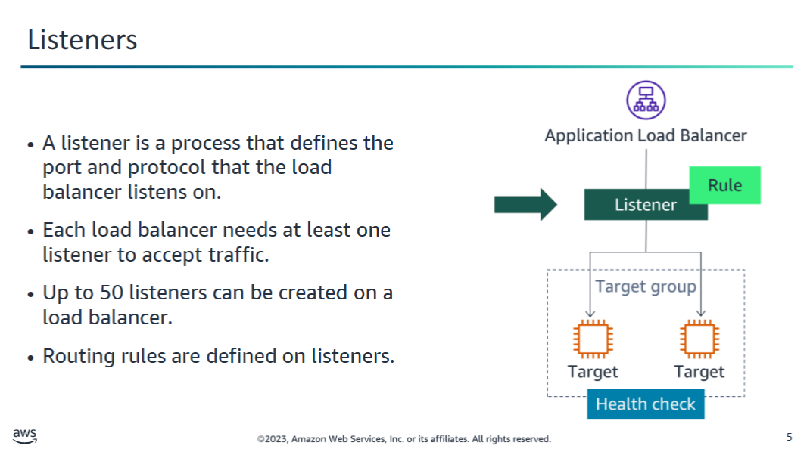

## Using an Application Load Balancer

Before you can use an **Application Load Balancer**, you must add one or more **listeners**.

### Listener

A **listener** is a process that:

- Checks for **connection requests** from a client to an instance.
- Uses the **protocol** and **port** that you specify.

### Listener Rules

- The **rules** you define for the listener determine:
  - **How the load balancer routes traffic** from connecting clients
  - To **one or more targets** or **target groups**

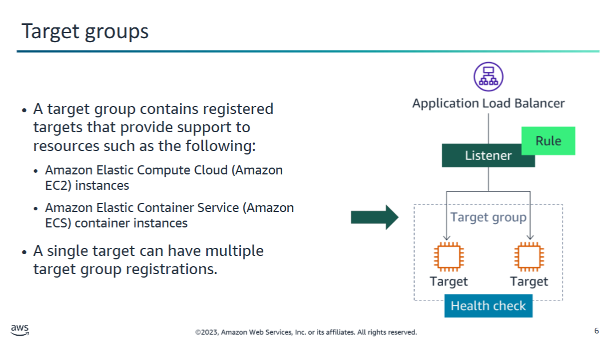

## Application Load Balancer: Target Groups and Health Checks

As mentioned previously, a **load balancer** serves as the single point of contact for clients.

### Listener Rules

- When you create each listener rule, you specify:
  - A **target group**
  - One or more **conditions**

### Target Groups

- **Targets** (such as EC2 instances or Amazon ECS container instances) are organized into **target groups**.
- Each **target group** is used to route requests to one or more **registered targets**.
- The load balancer can distribute incoming application traffic across multiple targets.

### Health Checks

- You can configure **health checks** for each target group.
- When the rule for your load balancer specifies a target group:
  - Health checks are performed on **all targets** that are registered to that target group.

🔗 [What is an Application Load Balancer? (AWS Documentation)](https://docs.aws.amazon.com/elasticloadbalancing/latest/application/introduction.html)

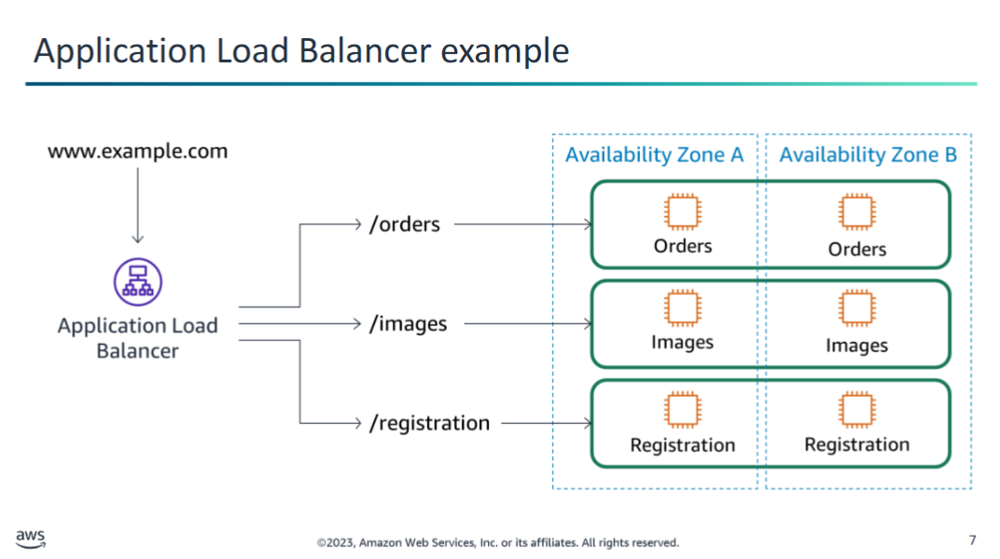

## Example: URL-Based Routing with Application Load Balancer

This diagram shows a single **Application Load Balancer** that is configured with **three rules**. The design illustrates how traffic is routed based on the **URL** that the client requests.

### Routing Behavior

- Clients that request the `/orders` page (e.g., `www.example.com/orders`) are routed to **one set of EC2 instances**.
- Clients that request the `/images` page are routed to **another set of EC2 instances**.
- Requests to the **registration** area (e.g., `/register`) are routed to **a different set of instances**.

This setup demonstrates **content-based routing** using **URL paths** to distribute incoming traffic efficiently.

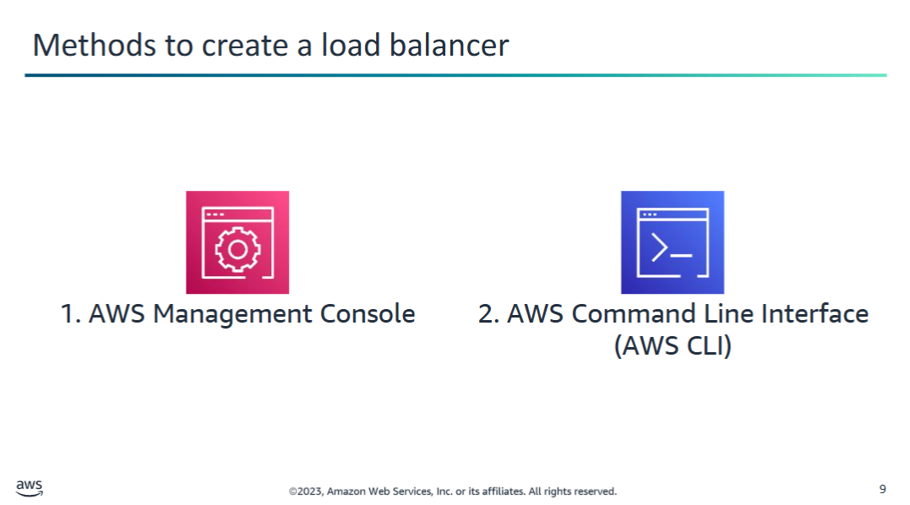

## Creating Load Balancers in AWS

After you select the type of load balancer that best suits your needs, you can choose to create it with the **AWS Management Console** or the **AWS Command Line Interface (AWS CLI)**.

Below are links to the AWS documentation for each load balancer type:

---

### Application Load Balancer

- **Console:** [Getting Started with Application Load Balancers](https://docs.aws.amazon.com/elasticloadbalancing/latest/application/application-load-balancer-getting-started.html)  
- **AWS CLI:** [Tutorial: Create an Application Load Balancer Using the AWS CLI](https://docs.aws.amazon.com/elasticloadbalancing/latest/application/tutorial-application-load-balancer-cli.html)

---

### Network Load Balancer

- **Console:** [Getting Started with Network Load Balancers](https://docs.aws.amazon.com/elasticloadbalancing/latest/network/network-load-balancer-getting-started.html)  
- **AWS CLI:** [Tutorial: Create a Network Load Balancer Using the AWS CLI](https://docs.aws.amazon.com/elasticloadbalancing/latest/network/network-load-balancer-cli.html)

---

### Gateway Load Balancer

- **Console:** [Getting Started with Gateway Load Balancers](https://docs.aws.amazon.com/elasticloadbalancing/latest/gateway/getting-started.html)  
- **AWS CLI:** [Getting Started with Gateway Load Balancers Using the AWS CLI](https://docs.aws.amazon.com/elasticloadbalancing/latest/gateway/getting-started-cli.html)

---

### Classic Load Balancer

> ⚠️ **Note:** AWS has retired the EC2-Classic network.  
> Accounts created after **December 4, 2013** are **VPC-only** and **cannot create** this type of load balancer.

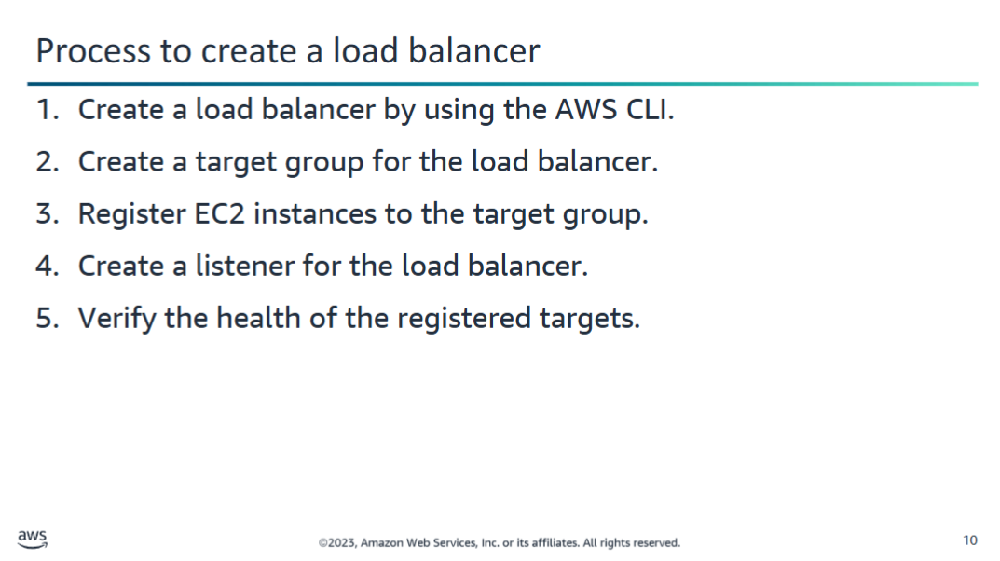

## Creating a Load Balancer in 5 Steps

There are **five steps** to create a load balancer. Over the next several slides, you will move through each step of creating an **Application Load Balancer** by using the **AWS CLI**.

For demonstrations of common load balancer configurations, see:  
👉 [AWS Elastic Load Balancer Demos](https://exampleloadbalancer.com)

---

### 🧭 Process Overview

**Diagram (Accessible Description):**  
Steps to create a load balancer:

1. **Create a load balancer** using the AWS CLI.  
2. **Create a target group** for the load balancer.  
3. **Register EC2 instances** to the target group.  
4. **Create a listener** for the load balancer.  
5. **Verify the health** of the registered targets.


## Create an Application Load Balancer

### ✅ 1. Verify AWS CLI Version

Run the following command to check if your version of the AWS CLI supports Application Load Balancers:

```bash
aws elbv2 help
```

If you receive an error indicating that `elbv2` is not a valid choice, you need to update your AWS CLI.

🔗 [Getting started with the AWS CLI – User Guide](https://docs.aws.amazon.com/cli/latest/userguide/cli-chap-getting-started.html)

---

### ✅ 2. Launch EC2 Instances in a VPC

- Make sure the EC2 instances are launched in a **Virtual Private Cloud (VPC)**.
- Ensure that the **security groups** for the instances allow access on:
  - the **listener port** (e.g., 80 or 443)
  - the **health check port**

🔗 [Target Security Groups – Application Load Balancer](https://docs.aws.amazon.com/elasticloadbalancing/latest/application/target-group-register-targets.html#target-security-groups)

---

### ▶️ Create the Application Load Balancer

To complete this step, run the following AWS CLI command:

```bash
aws elbv2 create-load-balancer \
  --name my-load-balancer \
  --subnets subnet-abc123 subnet-def456 \
  --security-groups sg-0123456789abcdef0 \
  --scheme internet-facing \
  --tags Key=Environment,Value=Production \
  --type application \
  --ip-address-type ipv4
```

📘 More info:  
🔗 [create-load-balancer – AWS CLI Command Reference](https://docs.aws.amazon.com/cli/latest/reference/elbv2/create-load-balancer.html)

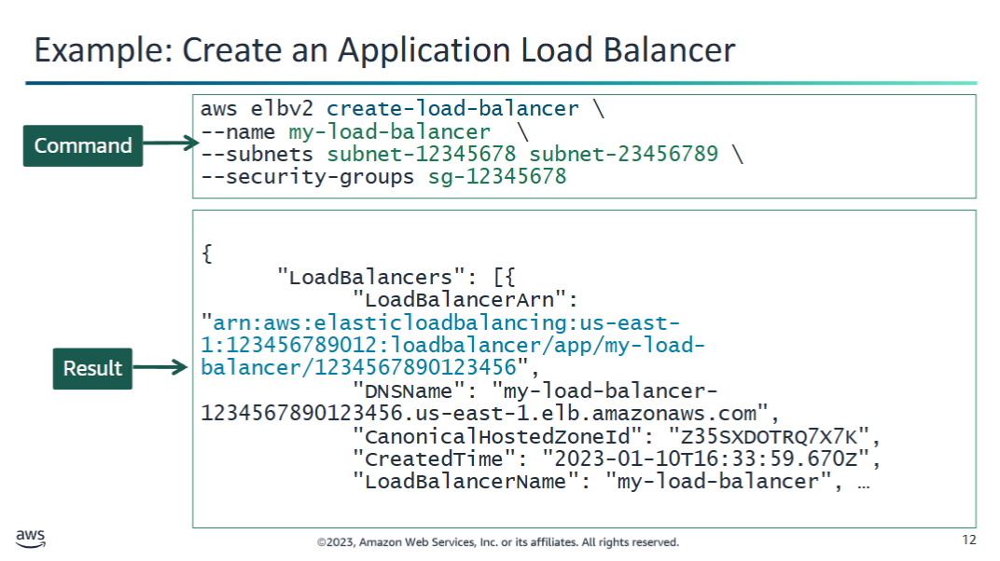

## Example: Create an Application Load Balancer

After running the `create-load-balancer` command, the output will include details of the newly created load balancer.

One key piece of information is the **Amazon Resource Name (ARN)**, which uniquely identifies the load balancer.

### Example ARN Output:

```text
arn:aws:elasticloadbalancing:us-east-1:123456789012:loadbalancer/app/my-load-balancer/1234567890123456
```

Make sure to copy and save this ARN, as it will be needed in subsequent steps.

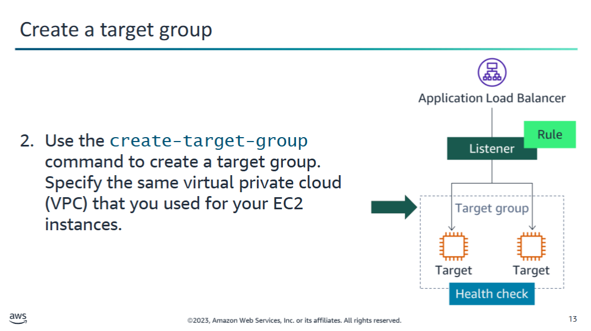

## Create a Target Group

To complete the second step, run the `create-target-group` command to create a target group.

👉 For more information, refer to the AWS CLI Command Reference:  
[create-target-group](https://docs.aws.amazon.com/cli/latest/reference/elbv2/create-target-group.html)

### Target Group Options

- You can create **IPv4** and **IPv6** target groups to associate with load balancers.
- The target group's **IP address type** determines the IP version that the load balancer will use to communicate with and check the health of your backend targets.
- **IPv4** target groups support:
  - IP targets
  - Instance type targets
- **IPv6** target groups support:
  - Only IP targets

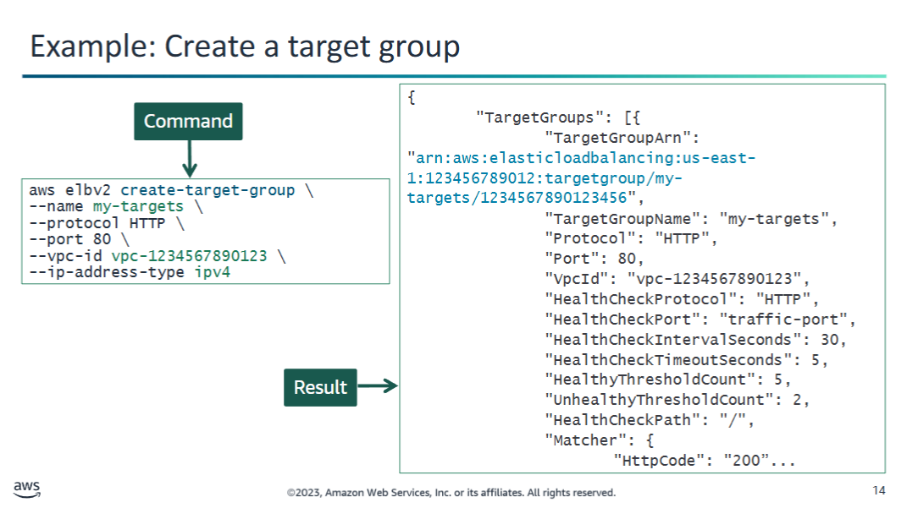

## Example: Create a target group

The result from issuing the command is similar to the example on the slide.

The output includes the **ARN** of the target group, in the following format:

```
arn:aws:elasticloadbalancing:us-east-1:123456789012:targetgroup/my-targets/1234567890123456
```

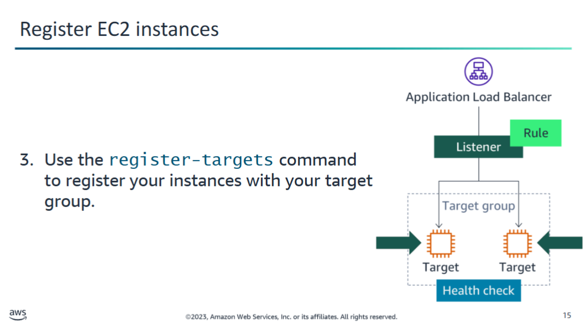

## Register EC2 instances

To complete the third step, run the `register-targets` command to register your instances with your target group.

For the `--target-group-arn` parameter, enter the ARN of the target group that you created in the previous step.

> **Note:** This command does not have output.

For more information about the command, see [register-targets – AWS CLI Command Reference](https://docs.aws.amazon.com/cli/latest/reference/elbv2/register-targets.html).

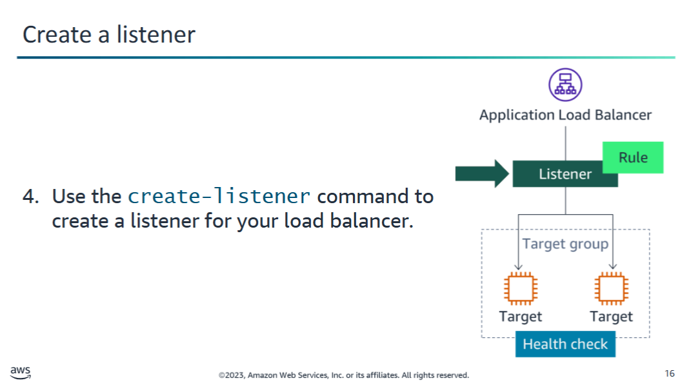

## Create Listener

To complete the fourth step, use the `create-listener` command to create a listener for your load balancer with a default rule that forwards requests to your target group.

For more information about the command, see [create-listener – AWS CLI Command Reference](https://docs.aws.amazon.com/cli/latest/reference/elbv2/create-listener.html).

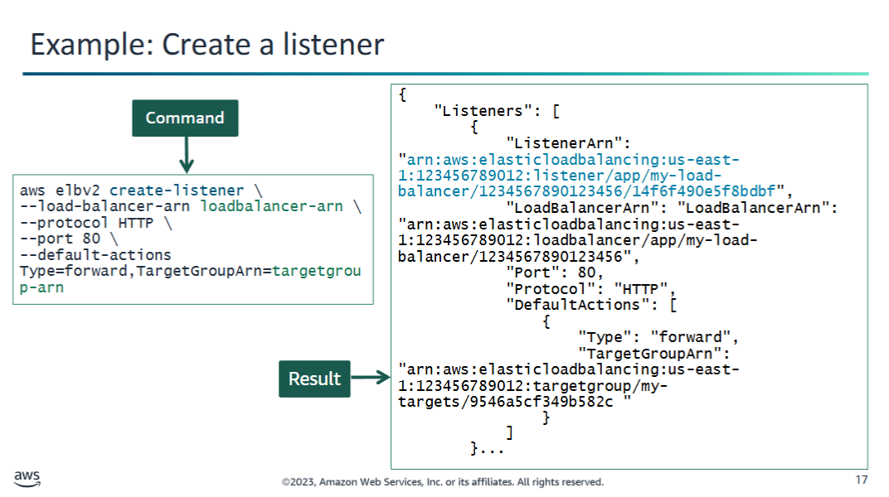

## Example: Create a listener

The result from issuing the command is similar to the example below.  
The output includes the Amazon Resource Name (ARN) of the listener, in a format similar to:

```
arn:aws:elasticloadbalancing:us-east-1:123456789012:listener/app/my-load-balancer/1234567890123456/14f6f490e5f8bdbf
```


## Verify Target Health (Optional)

To verify the health of the target instances, run the following command:

```
aws elbv2 describe-target-health --target-group-arn <your-target-group-arn>
```

For more information about this command, see the [describe-target-health documentation](https://docs.aws.amazon.com/cli/latest/reference/elbv2/describe-target-health.html).

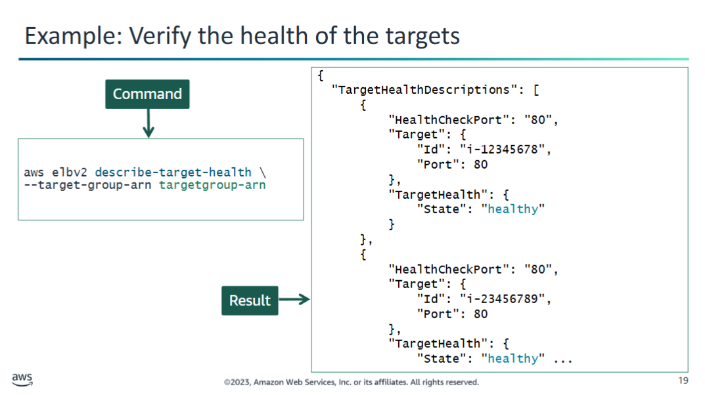

The result from issuing the command is similar to the example on the slide. Note that the status of each instance in this example is healthy.

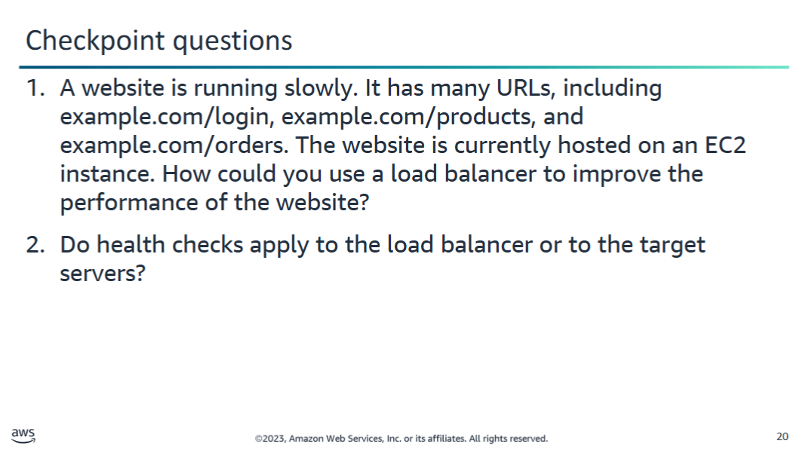

<details>
  <summary>1. A website is running slowly. It has many URLs, including example.com/login, example.com/products, and example.com/orders. The website is currently hosted on an EC2 instance. How could you use a load balancer to improve the performance of the website?</summary>
  
  Each URL could be handled by a different group of EC2 servers. Rules on an Application Load Balancer could then be used to route traffic to the different groups of EC2 servers. If a specific URL needs to scale to meet demand, only the group of servers for that URL would need to scale instead of the entire footprint. This could reduce costs.
</details>

<details>
  <summary>2. Do health checks apply to the load balancer or to the target servers?</summary>
  
  Health checks are used to monitor target servers that load balancers route traffic to. If a health check fails, the load balancer can deregister the unhealthy server.
</details>

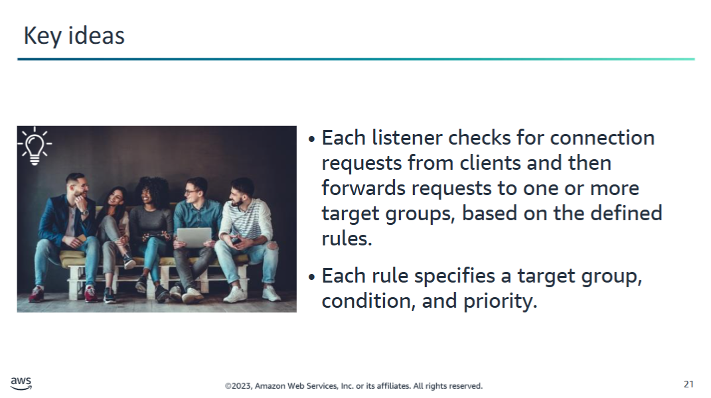
