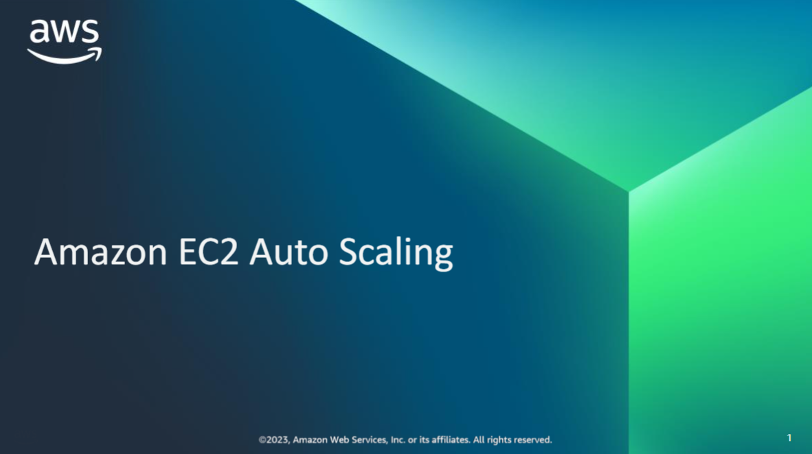

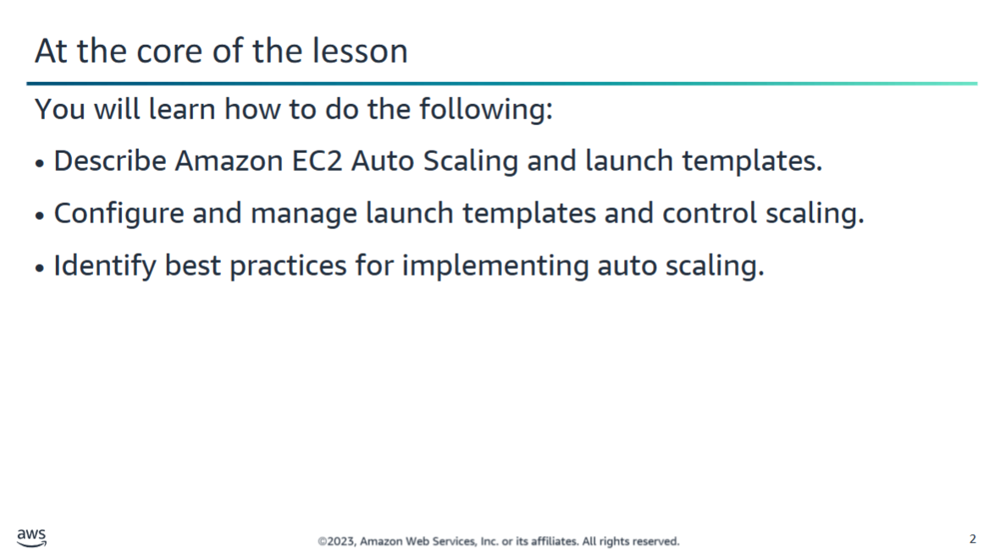

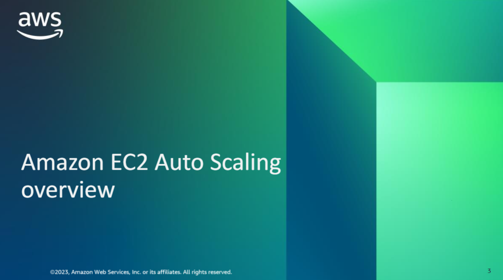

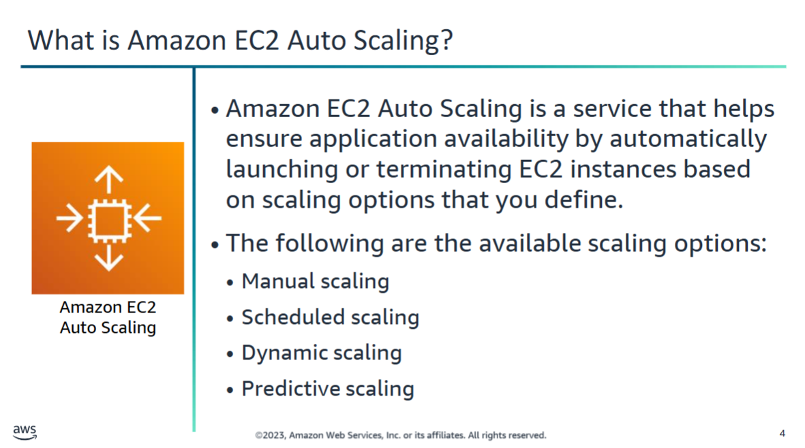

You can use **Amazon EC2 Auto Scaling** to maintain application availability. This service helps ensure that you have the correct number of Amazon Elastic Compute Cloud (Amazon EC2) instances available to handle the load of the application.

You can use Amazon EC2 Auto Scaling to automatically add or remove EC2 instances according to conditions that you define. For example, you can configure Amazon EC2 Auto Scaling to:

- Terminate EC2 instances that fail health status checks
- Launch new EC2 instances to replace the terminated ones

You can create user-defined policies that use **Amazon CloudWatch** to initiate when to add or remove EC2 instances. These policies would be based on conditions such as the average CPU utilization of your Amazon EC2 fleet.

The most basic scaling option is **manual scaling**. You specify the change in the maximum, minimum, or desired capacity of your auto scaling group, and Amazon EC2 Auto Scaling implements the change.

If you have predictable load changes, you can set a **schedule** through Amazon EC2 Auto Scaling to plan your scaling activities.

The features of Amazon EC2 Auto Scaling give you the ability to:

- **Scale out** to meet demand
- **Scale in** to reduce costs

You will look at the following scaling options in more detail in the subsequent slides:

- Scheduled
- Dynamic
- Predictive

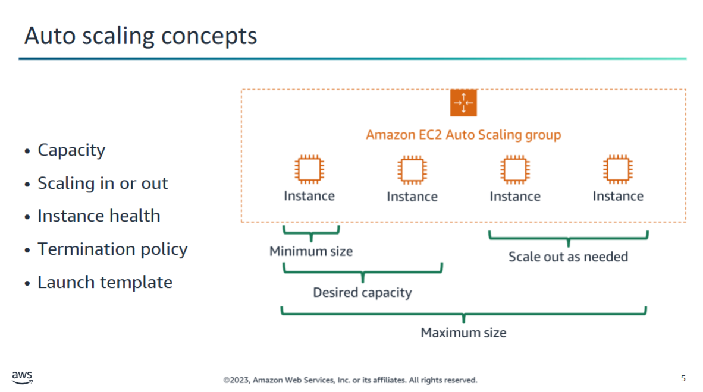

## Key Concepts in Auto Scaling

### Capacity
Capacity limits represent the **minimum and maximum group size** that you want for your auto scaling group. The group's **desired capacity** represents the initial capacity of the auto scaling group at the time of creation.

**Example:**
- Minimum size: 1 instance  
- Desired capacity: 2 instances  
- Maximum size: 4 instances  

The **scaling policies** you define adjust the number of instances within your minimum and maximum range.

---

### Scaling In and Out
An increase in **CPU utilization** outside the desired range could cause the auto scaling group to **scale out** (e.g., by adding two instances).  
When CPU utilization decreases, the group **scales in**, potentially returning to the minimum desired capacity by terminating instances.

---

### Instance Health
The **health status** of an auto scaling instance indicates whether it is healthy or unhealthy.

Health notifications can come from:
- Amazon EC2
- Elastic Load Balancing (ELB)
- Custom health checks

When Amazon EC2 Auto Scaling detects an **unhealthy** instance, it **terminates** the instance and launches a **new** one.

---

### Termination Policy
**Termination policies** define which instances Amazon EC2 Auto Scaling terminates first during scale-in events.

---

### Launch Template
A **launch template** specifies instance configuration details:
- AMI ID
- Instance type
- Key pair
- Security groups
- Other launch parameters

When auto scaling groups **scale out**, new instances are launched using the latest version of the launch template.

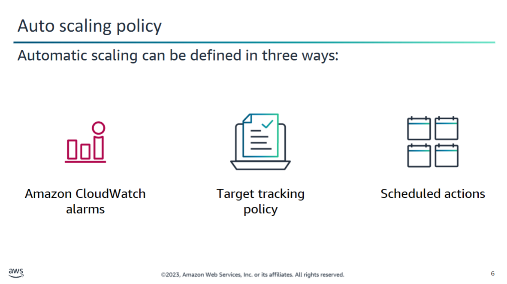

## Automatic Scaling policy

Automatic scaling can be defined in **three ways**:

---

### 1. Scaling Policy Based on CloudWatch Alarm
You can define a **scaling policy** that triggers based on an **Amazon CloudWatch alarm**.

**Example alarm:**  
*Average CPU Utilization > 50% for 2 minutes*

The alarm triggers an **Amazon EC2 Auto Scaling policy**, which can be one of two types:

- **Simple scaling**: Add or remove a **fixed number** of instances.
- **Step scaling**: Adjust the number of instances **as a percentage** of the desired capacity. The scaling response varies depending on how much the metric deviates from the threshold.

---

### 2. Target Tracking Policy
You define a **target tracking policy**, where a metric (e.g., average CPU utilization) is evaluated against a **target value**.

**Example:**  
*Keep average CPU utilization at 50%*

The auto scaling system automatically adjusts the number of instances to maintain this target.

---

### 3. Scheduled Action
You define a **scheduled action** that sets a new desired capacity **at a specific time**.

You can:
- Specify a **start time and date**
- Set **recurring actions** (e.g., every Monday at 8 AM)

**Use case:** Prewarm capacity before known traffic spikes (e.g., product launches, campaign events).

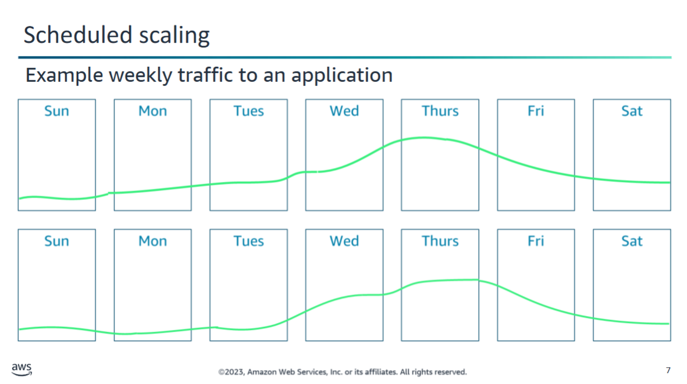

## Scheduled Scaling

By scaling based on a **schedule**, you can scale your application in response to **predictable load changes**.

### Example Scenario
Suppose that every week:
- Traffic increases on **Wednesday**
- Remains partially high on **Thursday**
- Decreases by **Friday**

You can plan your scaling activities based on this predictable pattern.

---

### Steps to Configure Scheduled Scaling

1. **Create a scheduled action**  
   Define the specific scaling activity Amazon EC2 Auto Scaling should perform at a particular time.

2. **Specify timing and capacity settings**  
   Define:
   - **Start time** of the action
   - New **minimum**, **maximum**, and **desired** instance counts

3. **Scaling occurs automatically**  
   At the specified time, Amazon EC2 Auto Scaling updates the group to match the provided capacity values.

---

For more information, see:  
[Scheduled Scaling for Amazon EC2 Auto Scaling](https://docs.aws.amazon.com/autoscaling/ec2/userguide/ec2-auto-scaling-scheduled-scaling.html)

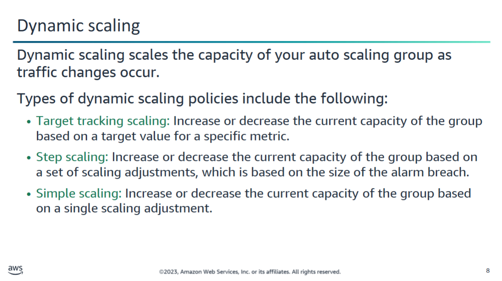

## Dynamic Scaling

Automatic scaling can be configured to be **dynamic**.

### Example Scenario
You have a web application running on **three instances**.  
You want to ensure that **CPU utilization does not exceed 70% for more than 2 minutes**.  
You can configure an auto scaling group with the appropriate policy type to meet this need.

---

### Amazon EC2 Auto Scaling supports the following policy types:

#### ✅ Target Tracking Scaling
- Adjusts the current capacity based on a **target value for a specific metric**.
- Analogy: Like a thermostat — you set the temperature (metric), and it automatically adjusts.
- Amazon EC2 Auto Scaling **monitors the metric and adjusts capacity automatically**.

#### 📈 Step Scaling
- Adjusts capacity using a **set of step adjustments** based on the **size of the alarm breach**.
- ⚠️ Does **not** support cooldown periods.
- The default cooldown of the group **does not apply** to step scaling.

#### ➕ Simple Scaling
- Adjusts capacity based on a **single scaling adjustment**.
- ✅ Supports a **cooldown period** between scaling actions.

---

### Recommendation

- If your scaling is based on a **utilization metric that changes proportionally** to the number of instances,  
  → Use **Target Tracking Scaling**.
- Otherwise,  
  → Use **Step Scaling**.

---

🔗 For more information:  
[Dynamic Scaling for Amazon EC2 Auto Scaling](https://docs.aws.amazon.com/autoscaling/ec2/userguide/as-scale-based-on-demand.html)

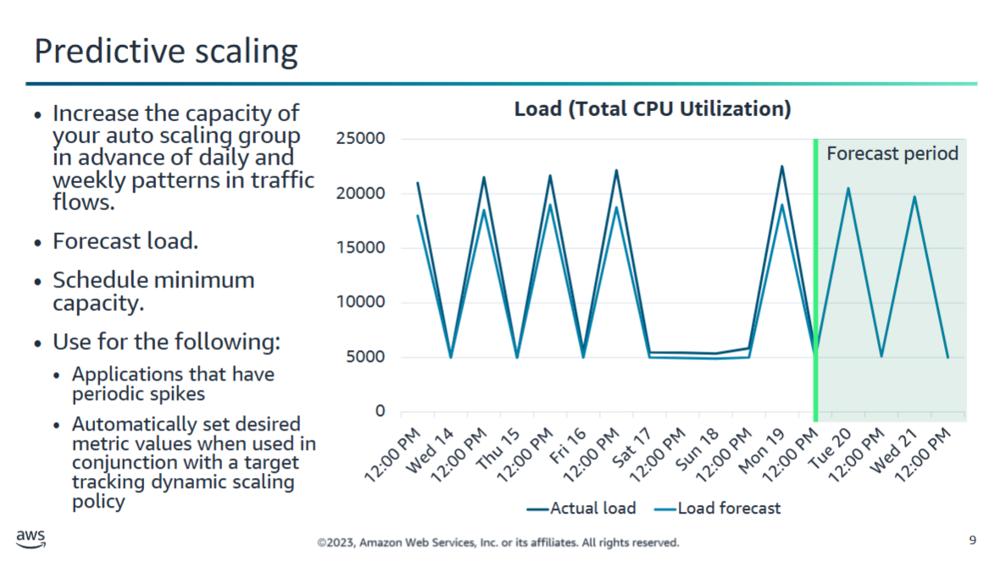

## Predictive Scaling in AWS

**Predictive scaling** uses **machine learning** to forecast your expected traffic and EC2 usage. This includes **daily** and **weekly** patterns based on historical data.

---

### 🔍 How It Works
- Uses **ML models** trained on:
  - Your actual EC2 usage
  - Your own observations (data points)
- Requires **at least 1 day of historical data** to begin predictions.
- Model is **re-evaluated every 24 hours**.
- Creates a forecast for the **next 48 hours**.

---

### ✅ Benefits
- **No manual adjustments** needed.
- Reduces complexity in auto scaling configuration.
- Can be **combined with dynamic scaling**:
  - Predictive scaling sets **scheduled minimum capacity**.
  - Dynamic scaling handles **real-time traffic fluctuations** via CloudWatch metrics.

---

### 🚀 How to Get Started
1. Go to the **AWS Management Console**.
2. Choose **Services > Management & Governance > AWS Auto Scaling**.
3. Create a **scaling plan** for EC2 resources.
4. Enable **Predictive Scaling**.
5. Visualize:
   - Forecasted traffic
   - Generated scaling actions

---

### ⚠️ Use Case Recommendations
- **Best for:** Applications with **periodic traffic spikes** (e.g., regular business hours, seasonal demand).
- **Not suitable for:** Random, non-cyclic spikes in traffic.

---

### 📘 Learn More
- [Predictive Scaling Settings](https://docs.aws.amazon.com/autoscaling/plans/userguide/gs-specify-custom-settings.html#gs-customize-predictive-scaling)  
- [Monitoring and Evaluating Forecasts](https://docs.aws.amazon.com/autoscaling/plans/userguide/gs-create-scaling-plan.html#gs-monitoring-forecasts)

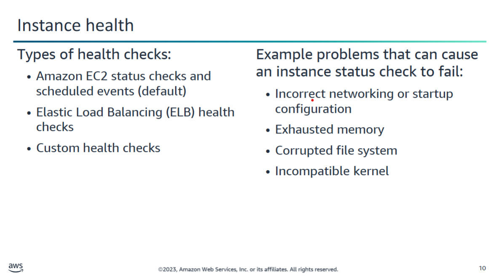

## Instance Health

Amazon EC2 Auto Scaling **periodically checks the health status** of all instances within an Auto Scaling group to ensure they are running and healthy.

---

### 🔄 What Happens When an Instance Is Unhealthy?
- If an instance is **not in the `running` state**, it is:
  - Marked as **unhealthy**
  - **Replaced** by a new instance

---

### ✅ Types of Health Checks

1. **Amazon EC2 Status Checks & Scheduled Events**
   - Verifies that the instance is running
   - Detects hardware or software issues on the instance

2. **ELB (Elastic Load Balancing) Health Checks**
   - Checks if the load balancer reports the instance as healthy
   - Ensures the instance can **handle traffic**

3. **Custom Health Checks**
   - You define custom logic to monitor application or system health

---

### 📌 Default Behavior
- By default, **EC2 status checks** are used.
- If the Auto Scaling group is behind a load balancer:
  - EC2 status checks **or**
  - Load balancer instance checks are used
  - Depends on which option is **enabled**

---

### 📚 Learn More
- [Health Checks for Auto Scaling Instances](https://docs.aws.amazon.com/autoscaling/ec2/userguide/ec2-auto-scaling-health-checks.html)
- [Status Checks for Your Instances](https://docs.aws.amazon.com/AWSEC2/latest/UserGuide/monitoring-system-instance-status-check.html)

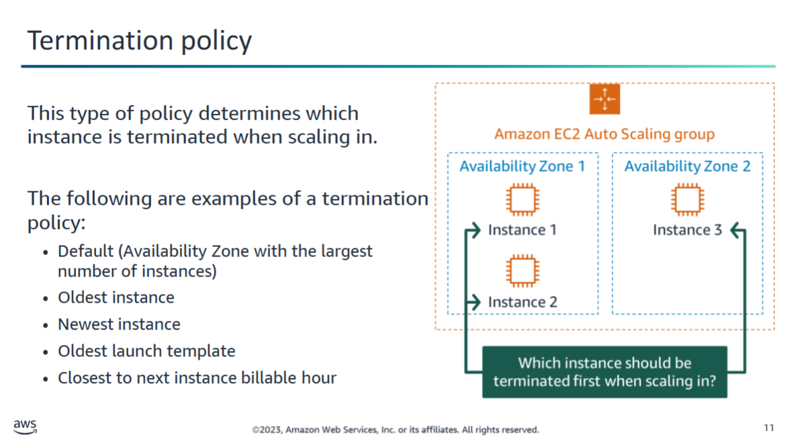

## Termination Policy

A **termination policy** defines how Amazon EC2 Auto Scaling chooses which instance to terminate during scale-in events.

---

### ✅ Default Termination Policy

- **Goal**: Maintain balanced instance distribution across Availability Zones (AZs).
- **How it works**:
  1. Determines which AZ has the most instances.
  2. Selects an instance in that AZ that is **not protected from scale-in**.
  3. Terminates one eligible instance.

> 📌 **Example**:  
> AZ1 has 2 instances, AZ2 has 1 → EC2 Auto Scaling terminates 1 instance from **AZ1**.

---

### 🛠️ Other Predefined Termination Policies

| Policy Name               | Description                                                                 |
|---------------------------|-----------------------------------------------------------------------------|
| `OldestInstance`          | Terminates the **oldest instance** in the group. Helpful for rolling upgrades. |
| `NewestInstance`          | Terminates the **newest instance**. Useful for testing launch templates.     |
| `OldestLaunchTemplate`    | Terminates instances with the **oldest launch template**. Ideal for phased rollouts. |
| `ClosestToNextInstanceHour` | Terminates instance **closest to the next billing hour** to reduce cost.     |

---

### 📚 Weitere Informationen

- [Controlling Which Auto Scaling Instances Terminate During Scale In](https://docs.aws.amazon.com/autoscaling/ec2/userguide/as-instance-termination.html)  
- [Termination Policies in EC2 Auto Scaling](https://docs.aws.amazon.com/autoscaling/ec2/userguide/ec2-auto-scaling-termination-policies.html)

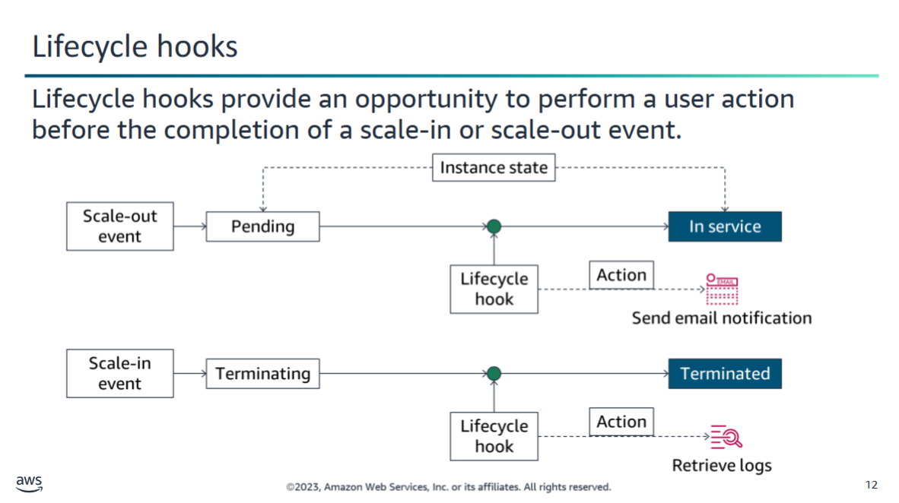

## Lifecycle Hooks

**Lifecycle Hooks** allow you to intervene at specific points in the instance launch or termination process within an Auto Scaling group.

---

### 🚀 Scale-Out Scenario (Launching New Instance)

- EC2 Auto Scaling launches a new instance → Enters **`Pending`** state.
- A **lifecycle hook** can:
  - Trigger an action (e.g., send email to admin).
  - Allow time to install security software or configure the instance.
- After the action is completed → Instance enters **`InService`** state.

---

### 🧹 Scale-In Scenario (Terminating Instance)

- EC2 Auto Scaling starts terminating an instance → Enters **`Terminating`** state.
- A **lifecycle hook** can:
  - Run a script to back up logs.
  - Perform cleanup tasks or audit.
- After the action is completed → Instance enters **`Terminated`** state.

---

### 🧠 Use Cases

- Custom scripts (e.g., backup, config).
- Notifications before lifecycle transitions.
- Extra security/compliance steps.

---

### 🔗 Weitere Informationen

👉 [How Lifecycle Hooks Work – AWS Docs](https://docs.aws.amazon.com/autoscaling/ec2/userguide/lifecycle-hooks-overview.html)


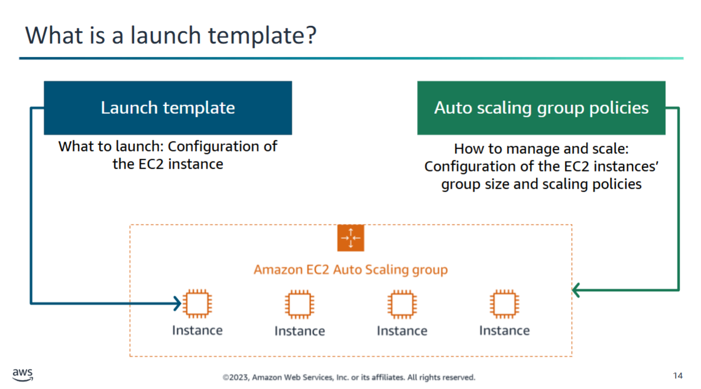

## Launch Template

A **launch template** specifies the configuration for EC2 instances and provides the flexibility of version control. It includes:

- **AMI ID** (Amazon Machine Image)
- **Instance type**
- **Key pair**
- **Security groups**
- Other optional parameters

---

### 🔄 Relationship to Auto Scaling Groups

- The **Amazon EC2 Auto Scaling group** uses the launch template to maintain the correct number of EC2 instances based on demand.
- **Launch template + Auto Scaling policies** define:
  - What kind of instances to launch
  - How to scale and manage them

---

### ⚠️ AWS Recommendation

> Although you can still use a **launch configuration**, **AWS strongly recommends** using a **launch template** instead.

Launch templates offer:
- Versioning
- Better support for new features
- More flexibility and control

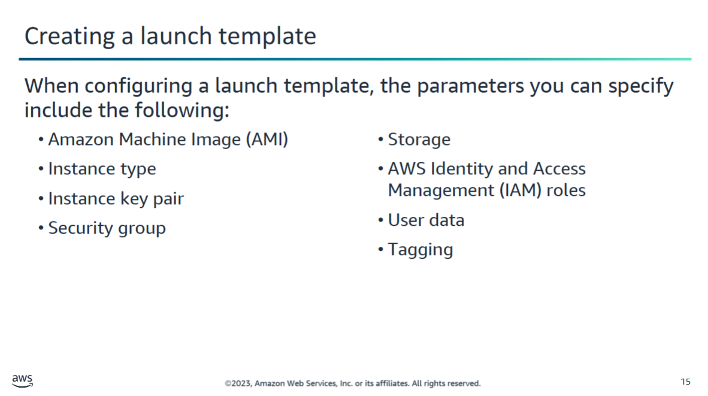

### Steps to Configure a Launch Template

To configure your **launch template**, follow these steps:

1. **Specify the AMI** from which to launch the instances.
2. **Choose an instance type** compatible with the selected AMI.
3. **Specify a key pair** for connecting to instances (e.g., via SSH).
4. **Add security groups** to define allowed network access.
5. **Specify additional volumes** to attach to each instance (optional).
6. **Add custom tags** (key-value pairs) to the instances and volumes.

---

### ✅ Required Parameters for Auto Scaling

When creating a launch template for an **Auto Scaling group**, the following are **required**:

- **AMI ID**
- **Instance type**

> ⚠️ If your launch template does not include an AMI, you **cannot specify one later** when creating the Auto Scaling group.

---

### 🔁 Template Versioning

You can create **multiple versions** of a launch template, for example:

- **Version 1**: Base configuration, no AMI or user data.
- **Version 2**: Same base + AMI + user data with the latest app version.

This enables testing or staged deployment with version control.

---

📘 **Further documentation**:  
[Create a Launch Template for an Auto Scaling Group](https://docs.aws.amazon.com/autoscaling/ec2/userguide/create-launch-template.html)

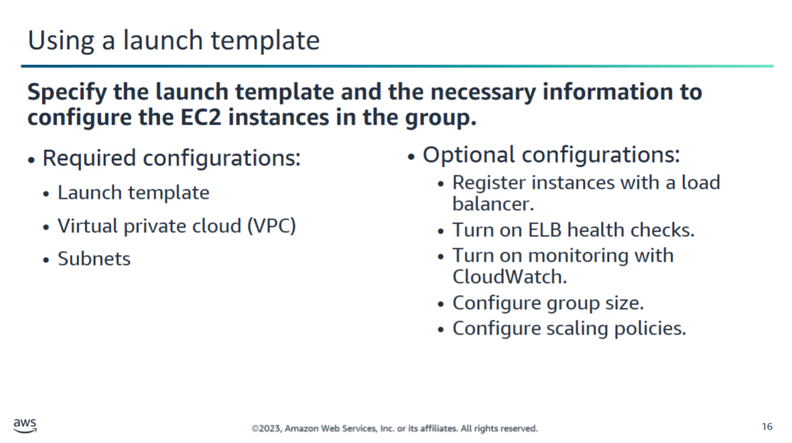

### Using a Launch Template

Once you've created the launch template, you can use it to configure an **Auto Scaling group**.

### 🔧 Steps to Create the Auto Scaling Group

1. **Choose the launch template**  
   - Specify version preferences.

2. **Choose instance launch options**  
   - The Auto Scaling group must be created in the **same VPC** as the security group defined in the launch template.

3. **Select subnets in the specified VPC**  
   - For **high availability**, choose subnets across multiple **Availability Zones**.

---

### ⚙️ Optional Advanced Settings

- **Register with a load balancer**  
  Enables traffic distribution across EC2 instances depending on workload and health.

- **Enable ELB health checks**  
  Ensures traffic is routed only to healthy instances.

- **Enable CloudWatch group metrics**  
  Improves visibility into instance behavior (e.g., pending/terminating counts).

- **Configure group size policies**  
  - Set **minimum** and **maximum** capacity.
  - The group scales out/in based on demand.

- **Set scaling policies**  
  - Use **target tracking** scaling.
  - Define how instance health is checked (EC2, ELB, or custom).

---

### 🔁 Updating the Configuration

To update EC2 configuration:
- **Create a new version** of the launch template.
- **New instances** will use the updated config.
- **Existing instances** remain unaffected.

---

📘 **Further reading**:  
[Create an Auto Scaling Group Using a Launch Template](https://docs.aws.amazon.com/autoscaling/ec2/userguide/create-asg-launch-template.html)

## Best practices


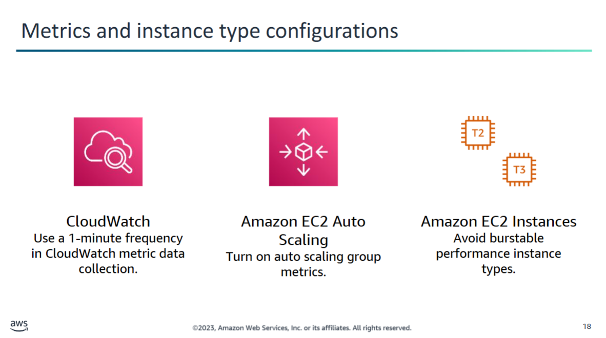

### Metrics and instance type configurations

#### 📊 Use 1-Minute Frequency for CloudWatch Metrics

- Turn on **detailed monitoring** when creating a launch template or launch configuration.
- This enables CloudWatch to collect EC2 instance metrics at a **1-minute frequency**.
- 1-minute granularity helps ensure a **faster response to load changes**.
- **Avoid** scaling on 5-minute metrics, as they can result in **slower responses** and **stale data**.

📘 More info: [Configure Monitoring for Auto Scaling Instances](https://docs.aws.amazon.com/autoscaling/ec2/userguide/enable-as-instance-metrics.html)

---

#### 📈 Turn On Auto Scaling Group Metrics

- Without this, **actual capacity data** is not shown in **capacity forecast graphs** after creating a scaling plan.

📘 More info: [Monitor CloudWatch Metrics for Auto Scaling](https://docs.aws.amazon.com/autoscaling/ec2/userguide/ec2-auto-scaling-cloudwatch-monitoring.html)

---

#### ⚠️ Avoid Burstable Performance Instance Types

- Be cautious when using **T2/T3 burstable performance** instance types.
- These instances provide **baseline CPU performance** with burst capability.
- If your **target utilization exceeds the baseline**, you **may run out of CPU credits**, which **limits performance**.

📘 More info:
- [Burstable Performance Instances – Concepts](https://docs.aws.amazon.com/AWSEC2/latest/UserGuide/burstable-credits-baseline-concepts.html)
- [Best Practices for Scaling Plans](https://docs.aws.amazon.com/autoscaling/plans/userguide/best-practices-for-scaling-plans.html)

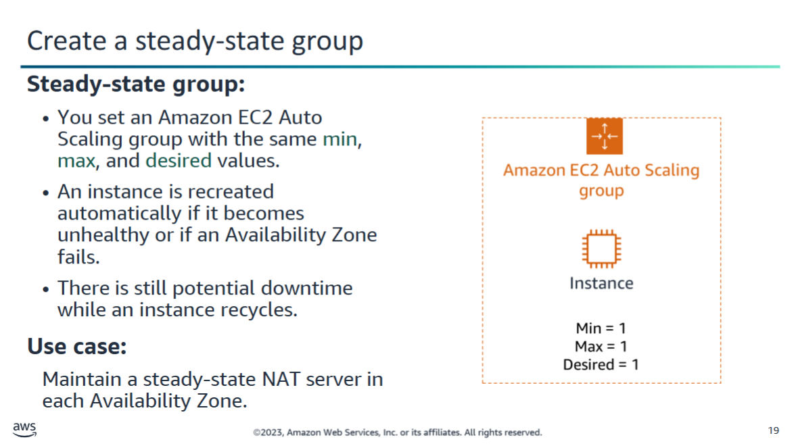

### Create a steady-state group

With **Amazon EC2 Auto Scaling health checks**, you can maintain a **steady-state group** to help ensure that at least one instance is always running.

### 🧠 Use Case
For example, if you have a **NAT server** in a standard public-private subnet architecture, you don’t want it to become a **single point of failure**. A steady-state group helps mitigate that risk (though not eliminate it entirely).

---

#### ⚙️ Steps to Create a Steady-State Group

1. **Create a launch template** that defines the instance configuration.
2. **Create an EC2 Auto Scaling group** with:
   - Minimum size: `1`
   - Maximum size: `1`
   - Desired size: `1`
3. If the single instance fails:
   - It might be marked as **unhealthy** due to an **EC2 status check** failure.
   - Or an **external script** could mark it as unhealthy manually using the CLI:

     ```bash
     aws autoscaling set-instance-health --instance-id <instance-id> --health-status Unhealthy
     ```

4. The **Auto Scaling group** terminates the failed instance and **launches a new one** based on the **launch template**.

---

#### ⚠️ Note on NAT Downtime
Even with this setup, a **NAT instance** can still be a single point of failure. During the time it takes to detect and recycle the failed instance, **significant downtime** may occur.

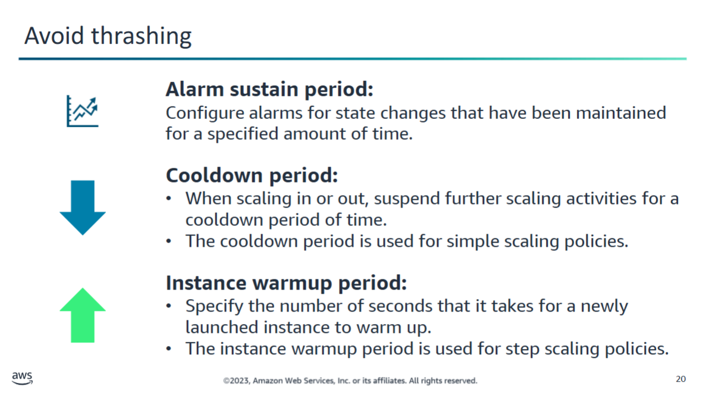

### Avoid Thrashing in Auto Scaling

**Thrashing** occurs when a system excessively uses virtual memory and fails to meet application demands due to constant scaling actions. In the context of **Amazon EC2 Auto Scaling**, this means **instances are launched and terminated in rapid succession**, degrading performance and stability.

---

#### 🚫 What is Thrashing?

> **Thrashing** is the condition in which there is excessive use of a computer’s virtual memory, and the system can no longer serve the needs of running applications.

This often happens when auto scaling **adds and removes instances too frequently**, leading to inefficiencies.

---

#### ✅ Best Practices to Avoid Thrashing

- **Use sustained state change alarms**:
  - Example: Only trigger scaling **if CPU utilization is 90% for 10 minutes**.
  
- **Configure cooldown periods** to avoid overlapping scaling activities:
  - Example: **Suspend scaling for 5 minutes** after a scale-out action.
  - Prevents new actions until the previous ones have taken full effect.

---

#### 🕒 Cooldown Periods in Auto Scaling

- **Default cooldown period** applies to **simple scaling policies**.
- **Custom cooldown periods** can be defined **per policy**.
- Cooldown **is ignored** in:
  - **Target tracking policies**
  - **Step scaling policies**
  - **Scheduled scaling**

> ⚠️ If an instance becomes **unhealthy**, EC2 Auto Scaling **bypasses cooldown** and immediately replaces it.

---

#### 🔥 Instance Warm-up (Step Scaling)

- With **step scaling**, you can define **instance warm-up time**:
  - Example: `300 seconds (5 minutes)`
- During warm-up:
  - Instance **does not count toward aggregated metrics**.
  - Prevents premature scaling actions based on metrics from not-yet-ready instances.

> ✅ Multiple alarm breaches in the same range only trigger **one** scaling action during warm-up.

---

#### 📌 Summary

- Use **sustained metric thresholds** to avoid false positives.
- Apply **cooldown periods** to stabilize scaling behavior.
- For **step scaling**, configure **warm-up times** to avoid over-scaling.

---

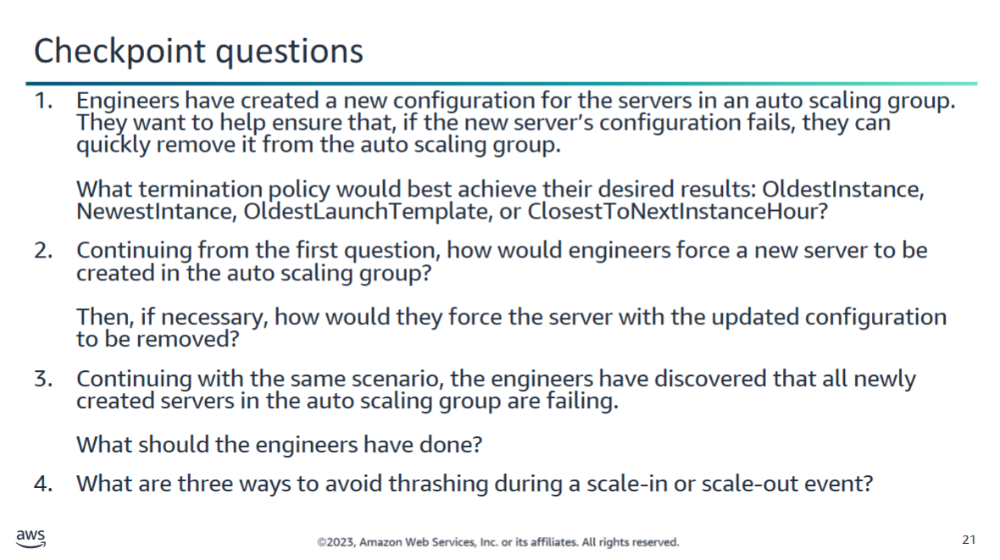

<details>
<summary>1. What termination policy would best achieve the goal of quickly removing a new configuration if it fails?</summary>

The engineers should use the **NewestInstance** policy. Any newly launched EC2 servers would have the latest configuration. Because those servers would also be the newest instances, they would be the first removed during a scale-in event.
</details>

<details>
<summary>2. How would engineers force a new server to be created and, if necessary, remove the server with the updated configuration?</summary>

The engineers could force new servers to be created by adjusting the **minimum number of instances** configuration attribute on the auto scaling group. When the value is increased, the group launches new instances.

To remove EC2 instances, they would adjust the minimum value to a lower number. Since the termination policy is set to **NewestInstance**, the most recently launched EC2 instance would be shut down and removed from the group.
</details>

<details>
<summary>3. What should the engineers have done after discovering that all newly created servers are failing?</summary>

The engineers should have updated the **launch template** with the previous values. The current configuration is still using the failed AMI. They needed to roll back the launch template to use the **older, stable AMI**.
</details>

<details>
<summary>4. What are three ways to avoid thrashing during a scale-in or scale-out event?</summary>

The following are three strategies to avoid thrashing:

- **Alarm sustain period**: Requires the alarm condition to persist for a set period before triggering scaling. Helps prevent scaling on short-lived spikes.
- **Cooldown period**: Ensures time between scaling actions so that the system stabilizes before further actions are taken.
- **Warmup period**: Gives new EC2 instances time to initialize and begin handling workloads before triggering new scaling evaluations.
</details>

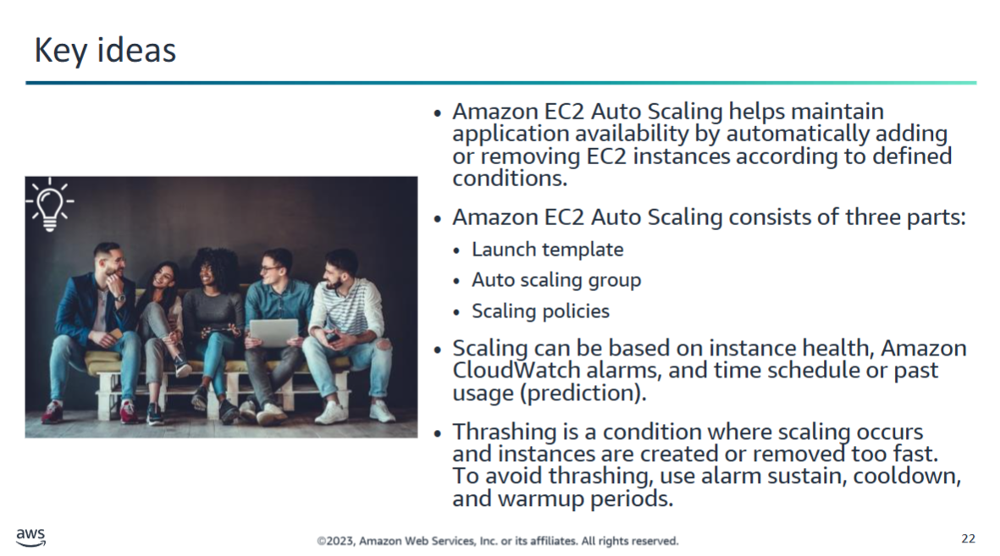
