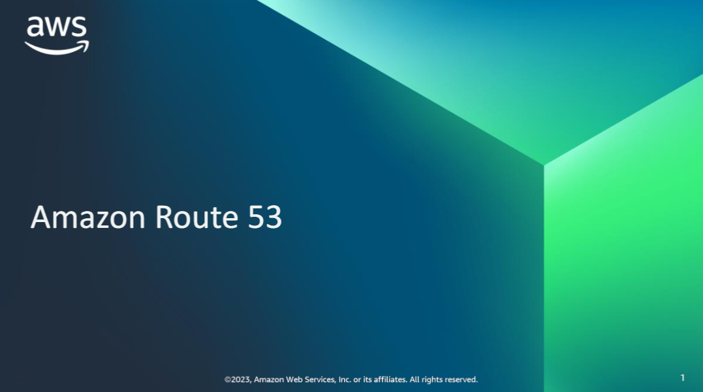
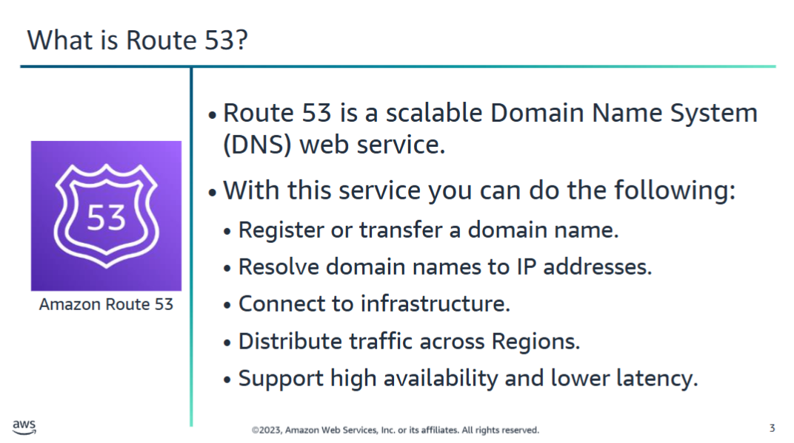
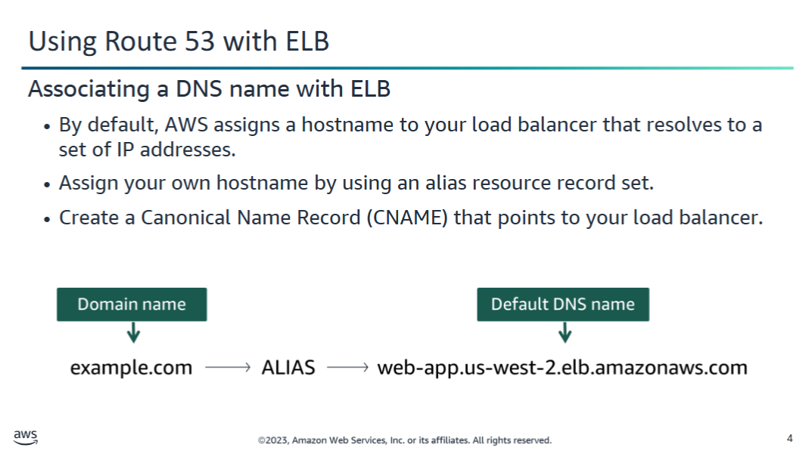
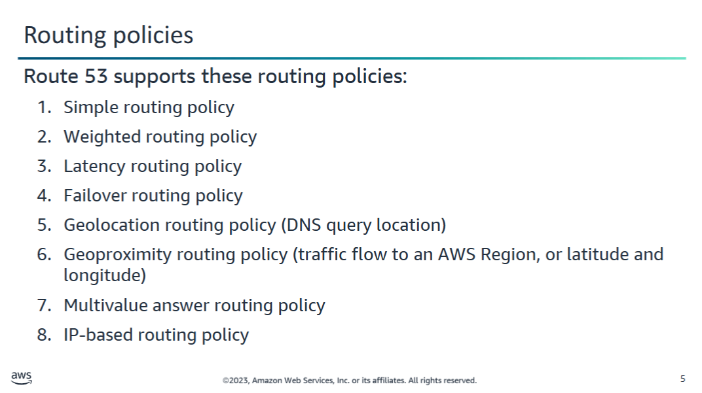
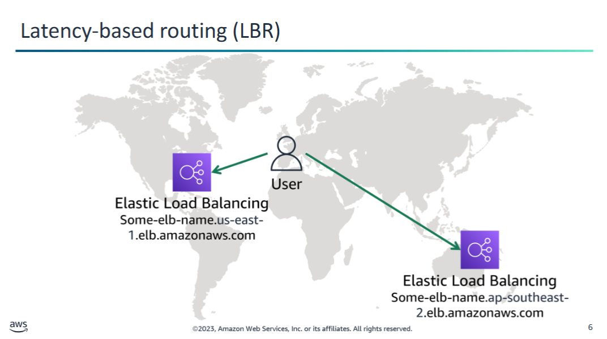
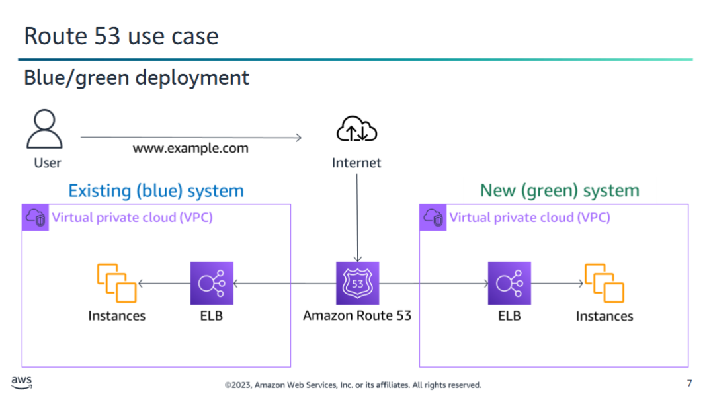
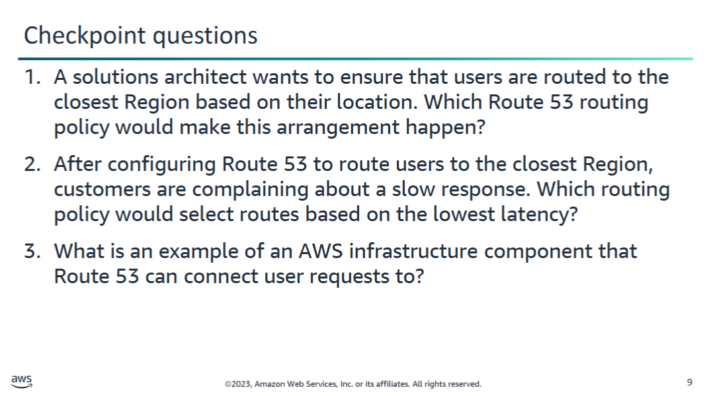
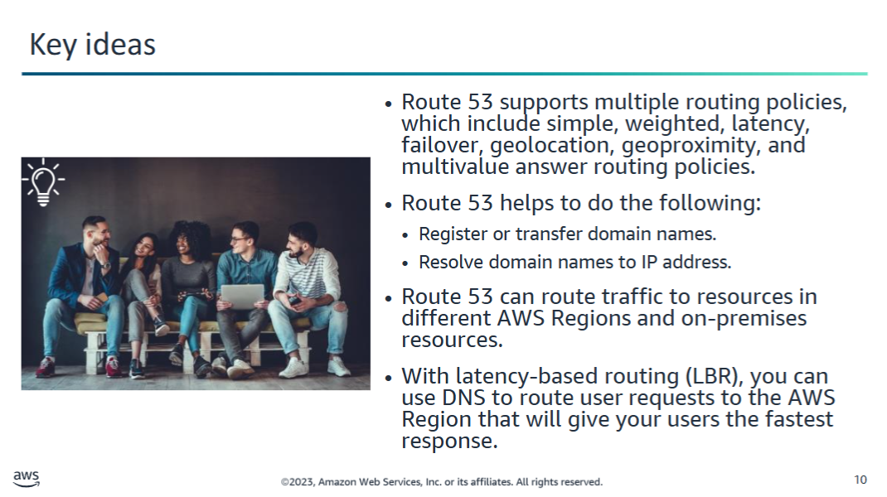

You can use **Elastic Load Balancing (ELB)** and **Amazon EC2 Auto Scaling** to achieve highly flexible, scalable, and resilient architectural designs.

But what if you want to distribute traffic across **Amazon Web Services (AWS) Regions**? You might have various reasons for distributing traffic across Regions, including the following:

- **Disaster recovery** for widespread outages  
- **Reduced latency** that provides services closer to where users are located

---

## Amazon Route 53

**Amazon Route 53** provides a highly available and scalable **cloud Domain Name System (DNS)** web service. It is designed to provide a **reliable and cost-effective way to route users to internet applications**.

### Key Features:

- **Translates URLs** (e.g., `www.example.com`) into numeric IP addresses (e.g., `192.0.2.1`) that computers use to connect to each other.
- Connects user requests to **AWS infrastructure**, such as:
  - **Amazon EC2** instances
  - **ELB load balancers**
  - **Amazon S3** buckets
- Can also route users to **infrastructure outside AWS**.
- Supports **DNS health checks**, allowing Route 53 to:
  - Route traffic only to **healthy endpoints**
  - Monitor the **health of applications and their endpoints**

### Global Traffic Management:

You can manage global traffic with **advanced routing types**, including:

- **Latency-based routing**
- **Geoproximity/geolocation-based routing**
- **Weighted round robin**

These routing types can be **combined with DNS failover** to create **low-latency, fault-tolerant architectures**.

### Domain Registration:

Route 53 also supports **domain name registration**. You can:

- Purchase and manage domains (e.g., `example.com`)
- Automatically configure DNS settings for your domains via Route 53

Recall that an **ELB load balancer** distributes workloads across multiple compute resources, such as virtual servers. Using a load balancer **increases the availability and fault tolerance** of your applications.

---

## ELB Load Balancer DNS Configuration

When you create an ELB load balancer, it is assigned a **default DNS name**, for example:

my-load-balancer-1234567890.us-west-2.elb.amazonaws.com

You can either:

- Use the **default DNS name**, **or**
- Associate your **own DNS name**, which you manage through **Amazon Route 53**

---

### Example Scenario

You register a domain name such as `example.com` for your website or web application. You can then **route internet traffic** to the AWS resources that serve your site.

---

## DNS Redirection Options

### Canonical Name Record (CNAME)

- **Redirects DNS queries to any DNS record**
- Example: Redirect `apex.example.com` → `acme.example.com` or `acme.example.org`

### Alias Record (Route 53-specific)

- **Redirects DNS queries only to selected AWS resources**, such as:
  - **Amazon S3 buckets**
  - **Amazon CloudFront distributions**
  - **Another record** in the Route 53 hosted zone

> 📝 Use alias records when you want AWS-integrated DNS routing without additional costs (unlike CNAMEs at the root domain/apex level).

# Amazon Route 53 Routing Policies

Amazon Route 53 supports several different **routing policies**, each suited for a specific use case:

---

1. **Simple Routing Policy**
   - 🧩 Use when you want to route traffic to **a single resource** that performs a specific function.
   - ✅ Example: A web server that serves content for `example.com`.

---

2. **Weighted Routing Policy**
   - ⚖️ Use to route traffic to **multiple resources**, with traffic split **by weights you specify**.
   - ✅ Example: Route 70% of traffic to one EC2 instance, and 30% to another.

---

3. **Latency Routing Policy**
   - ⚡ Use when you have resources in **multiple AWS Regions**.
   - ✅ Route traffic to the **Region with the lowest latency** for the user.

---

4. **Failover Routing Policy**
   - 🛡️ Use to implement **active-passive failover**.
   - ✅ Example: If the primary resource is unhealthy, Route 53 routes traffic to the secondary.

---

5. **Geolocation Routing Policy**
   - 🌍 Use when you want to route traffic **based on the user’s geographic location**.
   - ✅ Example: Route users in Europe to a European-based EC2 instance.

---

6. **Geoproximity Routing Policy**
   - 📍 Use to route traffic based on the **location of your resources**, and **optionally shift traffic** from one location to another.
   - ✅ You can use a bias setting to shift more or less traffic to a particular resource.

---

7. **Multivalue Answer Routing Policy**
   - 🎲 Use when you want Route 53 to respond to DNS queries with **up to eight healthy records**, selected **at random**.
   - ✅ Example: Basic form of load balancing with health checks.

---

8. **IP-Based Routing Policy**
   - 🧭 Use to route traffic based on the **IP address range** from which the request originates.
   - ✅ Offers **fine-grained control** based on the user's actual IP, not just location.

---

📚 **Further Reading**: [Choosing a Routing Policy – AWS Docs](https://docs.aws.amazon.com/Route53/latest/DeveloperGuide/routing-policy.html)

## Latency-Based Routing (LBR) with Amazon Route 53

When deploying applications globally, it's important to route user requests to the AWS Region that provides the **lowest latency** (fastest response time). Amazon Route 53 offers **Latency-Based Routing (LBR)** to achieve this.

---

### What is Latency-Based Routing?

Latency-Based Routing (LBR) uses DNS to route users to the AWS Region that provides the **lowest network latency** based on Route 53’s latency measurements.

> 📌 *Note: The region closest geographically is not always the region with the best latency.*

---

### Example Use Case

You have two **load balancers** deployed:

- **US East (N. Virginia) Region**
- **Asia Pacific (Sydney) Region**

You create a **latency record** in Route 53 for each load balancer.

#### Scenario:
A user in **Barcelona, Spain** accesses your domain. Here's what happens:

1. The DNS query reaches a Route 53 **name server**.
2. Route 53 looks up **latency data** across your regions.
3. The user is routed to the AWS Region with the **best latency**.

#### Typical Outcomes:
- Users in **New Zealand** → routed to **Asia Pacific (Sydney)**
- Users in **Canada** → routed to **US East (Virginia)**

---

### Benefits of LBR

- Faster response times for global users
- Improved user experience
- Simple to configure in Route 53

---

📚 **Further Reading**:
- [Latency-Based Routing – AWS Docs](https://docs.aws.amazon.com/Route53/latest/DeveloperGuide/routing-policy.html#routing-policy-latency)

## Route 53 use case

A **blue/green deployment** is a deployment strategy designed to reduce downtime and risk by running **two identical production environments**.

---

### 🔁 What Is It?

- **Blue environment**: The current live environment serving users.
- **Green environment**: The new version of the environment, e.g., with updated code or configurations.

You switch user traffic between these two environments using **Route 53 weighted routing**.

---

### 📊 How It Works

#### Parallel Setup:
- Both blue and green environments have:
  - Their own **ELB load balancer**
  - Their own **Amazon EC2 Auto Scaling** group

#### Step-by-step Traffic Shift:
1. **Start**: All user traffic goes to the **blue** environment.
2. **Deploy green**: Deploy your changes to the **green** environment.
3. **Start routing traffic**: Use **Route 53 weighted routing** to shift a portion of user traffic to the green environment.
4. **Monitor**: Use **Amazon CloudWatch** and **CloudWatch Logs** to monitor for errors.
5. **Rollback if needed**: If issues are found, Route 53 allows you to route users back to blue instantly.
6. **Cut over completely**: Once validated, route 100% of traffic to green and eventually decommission blue.

---

### 🕓 DNS Considerations

DNS changes aren't instant. Depending on TTL (time-to-live) settings, **full DNS propagation** (and blue environment shutdown) might take **1 day to 1 week**.

---

### Benefits

- **Zero downtime deployments**
- **Safe rollback option**
- **Test new environment with real traffic**
- **Reduced deployment risk**

---

📚 **Related AWS Services**:
- [Route 53 Weighted Routing](https://docs.aws.amazon.com/Route53/latest/DeveloperGuide/routing-policy.html#routing-policy-weighted)
- [Amazon CloudWatch](https://docs.aws.amazon.com/cloudwatch/)

For more information about this demonstration, check out [Routing Traffic to an Amazon EC2 Instance](https://docs.aws.amazon.com/Route53/latest/DeveloperGuide/routing-to-ec2-instance.html).

  
1. A solutions architect wants to ensure that users are routed to the closest Region based on their location. Which Route 53 routing policy would make this arrangement happen?

  
Use the <strong>geolocation routing policy</strong>.

  
2. After configuring Route 53 to route users to the closest Region, customers are complaining about a slow response. Which routing policy would select routes based on the lowest latency?

  
Use <strong>latency-based routing</strong>.

  
3. What is an example of an AWS infrastructure component that Route 53 can connect user requests to?

  
<strong>EC2 instances</strong>, <strong>ELB load balancers</strong>, or <strong>S3 buckets</strong>.

