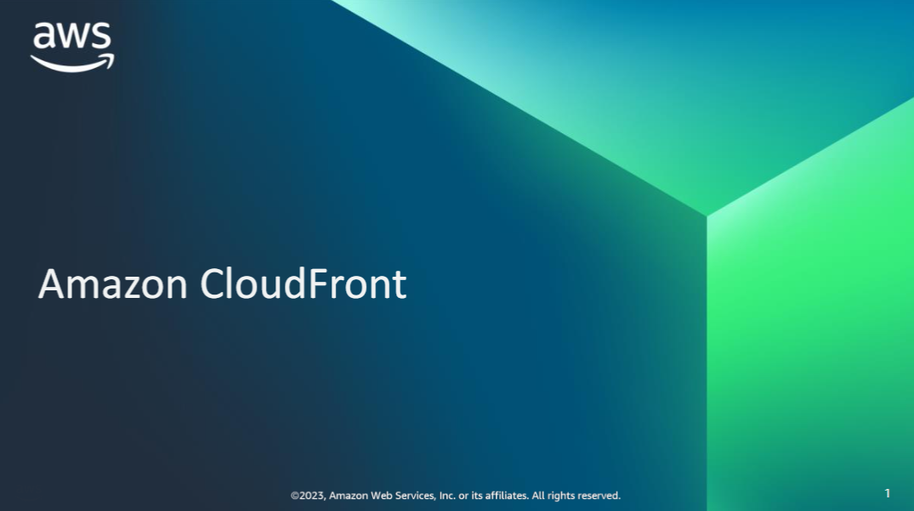
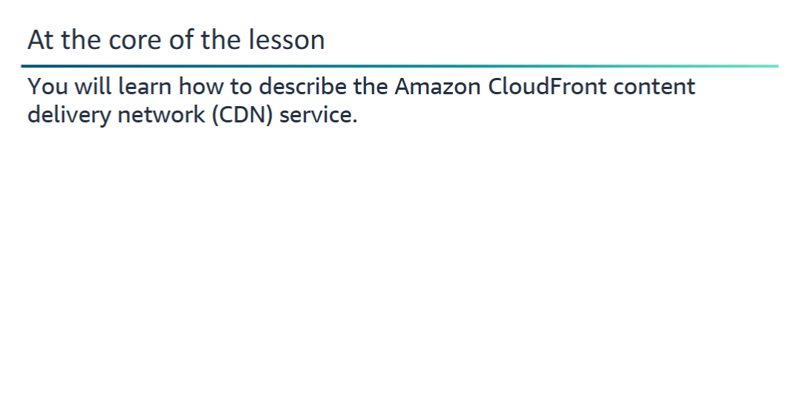
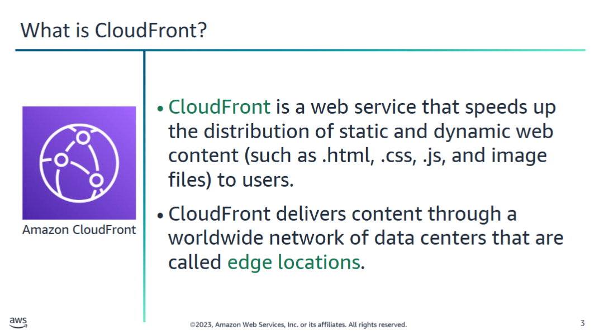
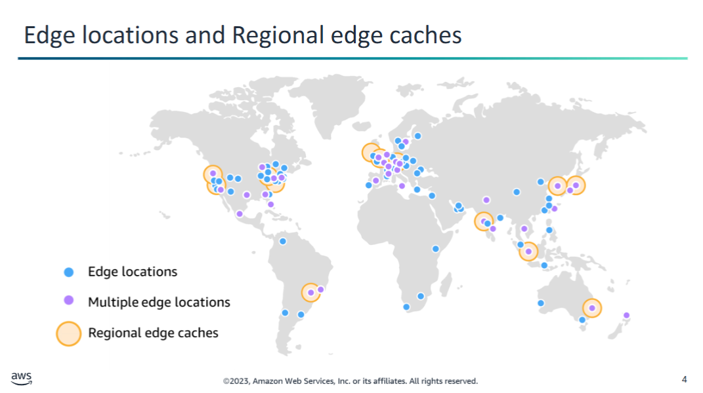
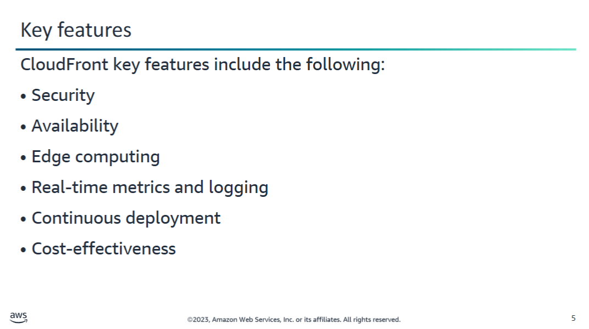
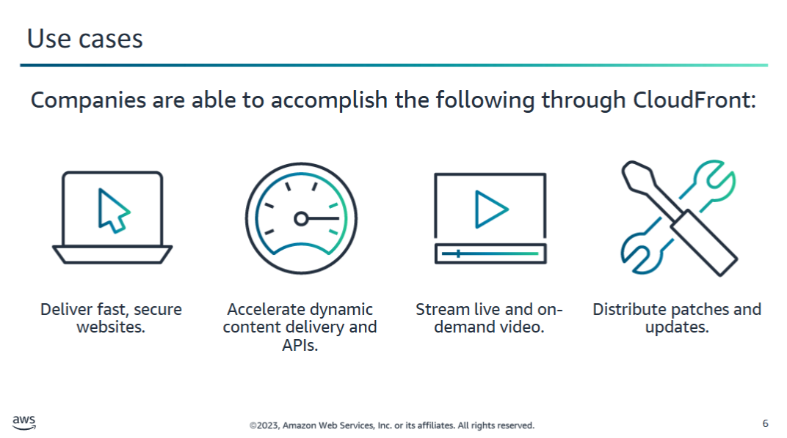
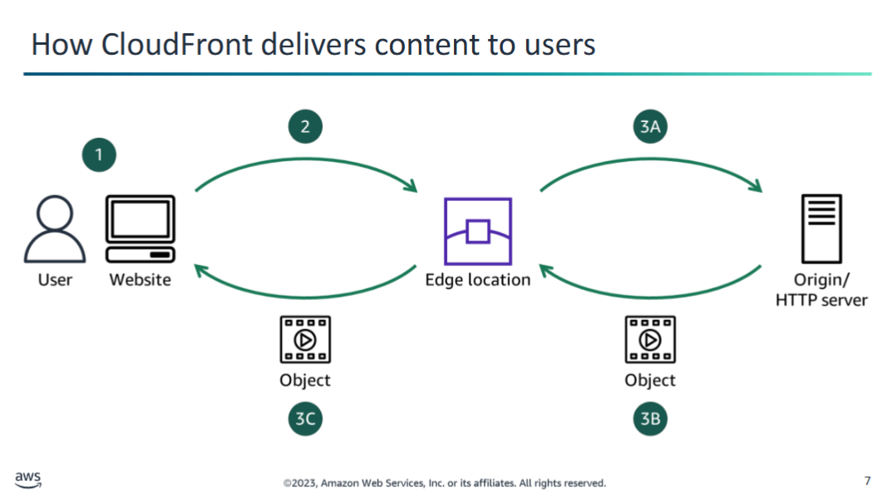
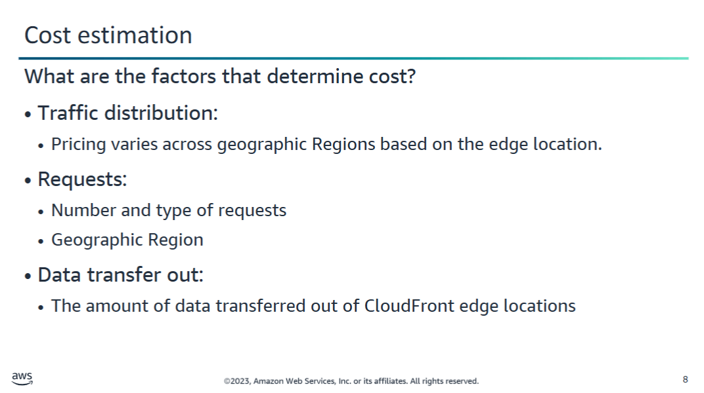
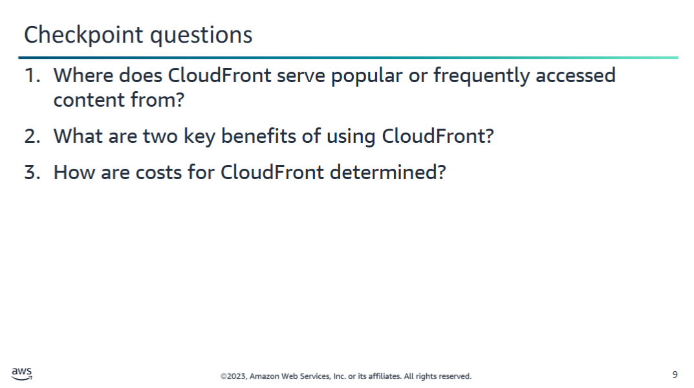
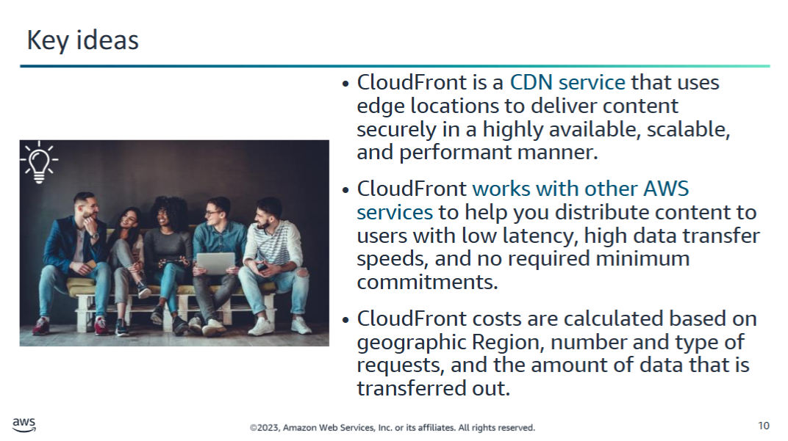

When a user requests content that you're serving with **CloudFront**, the request is routed to the **edge location that provides the lowest latency** (time delay) so that content is delivered with the best possible performance.

- If the content is **already in the edge location**, CloudFront delivers it **immediately**.
- If the content is **not in that edge location**, CloudFront retrieves it from an origin that you've defined, such as:
  - an **Amazon S3** bucket,
  - a **MediaPackage** channel, or
  - an **HTTP server** (e.g., a web server) that you have identified as the **source of truth** for your content.

To deliver content to end users with **lower latency**, **Amazon CloudFront** uses a **global network** of:

- **450+ edge locations** (also called **points of presence**, or **POPs**)
- **13 Regional edge caches**
- Spread across **90+ cities in 48 countries**  
- *(Data current as of February 2023)*

### How it works:

- **Edge locations** serve **popular content quickly** to viewers.
- **Regional edge caches** improve performance even for **less-popular content**, by bringing it closer to the viewer.

### Use cases for Regional edge caches:

- **User-generated content** (e.g., video, photos, artwork)
- **E-commerce assets** (e.g., product photos and videos)
- **News and event content** that may regain popularity

### Connectivity:

CloudFront edge locations are connected to AWS Regions via the **AWS network backbone**:

- Fully redundant, multiple **100 GbE parallel fibers**
- Global coverage
- Linked with **tens of thousands of networks**
- Improves **origin fetch performance** and **dynamic content acceleration**

## Benefits of Amazon CloudFront

### 🔒 Security
- Protects against **network and application layer attacks**
- Delivers content, APIs, or apps over **HTTPS** using **TLSv1.3** (latest version)
- Supports **multiple access control methods**
- Compliant with industry standards:
  - **PCI-DSS**
  - **HIPAA**
  - **ISO/IEC**
- Ensures secure delivery of **sensitive data**

### ☁️ Availability
- Native **origin failover**: Automatically serves content from a **backup origin** if the primary is unavailable

### ⚙️ Edge Computing
- Provides **programmable and secure edge CDN computing**
  - **CloudFront Functions**
  - **Lambda@Edge**

### 📊 Real-Time Metrics and Logging
- Integrated with **Amazon CloudWatch**
- Publishes **6 operational metrics per distribution**
- Metrics are viewable via **graphs in the CloudFront console**

### 🚀 Continuous Deployment
- Supports **blue/green deployment**
- Enables **gradual rollouts** of releases **without DNS changes**

### 💸 Cost-Effectiveness
- **Pay-as-you-go** pricing
- Optional:
  - **CloudFront Security Savings Bundle**
  - **Custom pricing**
- **No upfront fees**, **no fixed platform fees**, **no long-term commitments**
- **No premium charges for dynamic content**
- **No need for professional services**
- **Free data transfer** between AWS Cloud services and CloudFront

## Use cases

Amazon **CloudFront** is a **Content Delivery Network (CDN)** service designed for:

- **High performance**
- **Security**
- **Developer convenience**

---

### ✅ Ideal Use Cases

#### 🌐 Deliver Fast, Secure Websites
- Global reach in **milliseconds**
- Built-in **data compression**
- **Edge compute** capabilities
- **Field-level encryption** for sensitive data

#### ⚡ Accelerate Dynamic Content Delivery and APIs
- Optimize **dynamic web content** delivery
- Uses AWS's **feature-rich global network infrastructure**

#### 📺 Stream Live and On-Demand Video
- Quick stream starts
- **Consistent playback**
- **High-quality video** to any device
- Supports AWS Media Services & AWS Elemental

#### 🛠️ Distribute Patches and Updates
- Scale delivery of:
  - **Software**
  - **Game patches**
  - **IoT over-the-air (OTA) updates**
- High transfer rates for large-scale distribution

## How CloudFront delivers content to users

### 🖼️ Traditional Content Delivery (Without CloudFront)
You might serve an image like this:

https://example.com/sunsetphoto.png

- User requests are routed across many networks
- This increases latency and slows down performance

---

### 🚀 How CloudFront Improves Performance

CloudFront routes requests through the **AWS backbone** to the **nearest edge location (POP)**.

**Benefits:**
- ✅ Lower latency
- ✅ Higher data transfer rates
- ✅ Fewer networks involved

---

### 🔄 CloudFront Request Flow

1. **User Request**  
   A user visits your site and requests an object (e.g., an image or HTML file).

2. **DNS Routing**  
   DNS routes the request to the **nearest CloudFront edge location** based on latency.

3. **Edge Cache Check**  
   - If the object is **in cache**, CloudFront returns it immediately.
   - If the object is **not in cache**:
     1. CloudFront checks your **distribution config**.
     2. It **forwards the request** to the **origin** (e.g., S3 or HTTP server).
     3. The origin server **sends the object** to the edge location.
     4. CloudFront **starts sending** the object to the user as soon as it receives the first byte.
     5. CloudFront **adds the object to the cache** for future requests.

---

💡 **Result**: Users experience faster load times and more consistent performance.

## Cost Estimation for Amazon CloudFront

Amazon CloudFront follows a **pay-as-you-go** model:
- ❌ No upfront fees  
- ❌ No long-term commitments  
- ✅ You pay only for what you use

---

### 🔍 Key Cost Factors

#### 1. **Traffic Distribution**
- Costs vary by **geographic region**
- Based on the **edge location** that serves your content

#### 2. **Requests**
- You are charged per request
- Depends on:
  - Number of requests
  - Type of request (HTTP or HTTPS)
  - Originating geographic region

#### 3. **Data Transfer Out**
- Applies when:
  - Users download data to the internet
  - Data is transferred **to an origin** or **edge function**
- Includes requests like:
  - `DELETE`, `OPTIONS`, `PATCH`, `POST`, `PUT`

---

### 🗂️ Special Case: AWS Origins
If your origin is:
- **Amazon S3**
- **Elastic Load Balancing (ELB)**

Then:
- You pay **only** for:
  - Storage
  - **Internet** data transfer out  
- ✅ **No charge** for data transferred **between CloudFront and these services**

---

📘 [More info on pricing](https://aws.amazon.com/cloudfront/pricing/)

## Checkpoint questions

1. Where does CloudFront serve popular or frequently accessed content from?

From an **edge location** that is geographically closest to the user.

---

2. What are two key benefits of using CloudFront?

Key benefits of Amazon CloudFront include:

- 🔒 **Security**
- 🌍 **Availability**
- 🧠 **Edge computing**
- 📊 **Real-time metrics and logging**
- 🚀 **Continuous deployment**
- 💸 **Cost-effectiveness**

---

3. How are costs for CloudFront determined?

CloudFront costs are based on:

- 🌐 **Geographic region** (edge location from which content is served)
- 📥 **Number and type of requests** (HTTP or HTTPS)
- 📤 **Data transfer out** (to the internet or to origins/edge functions)

