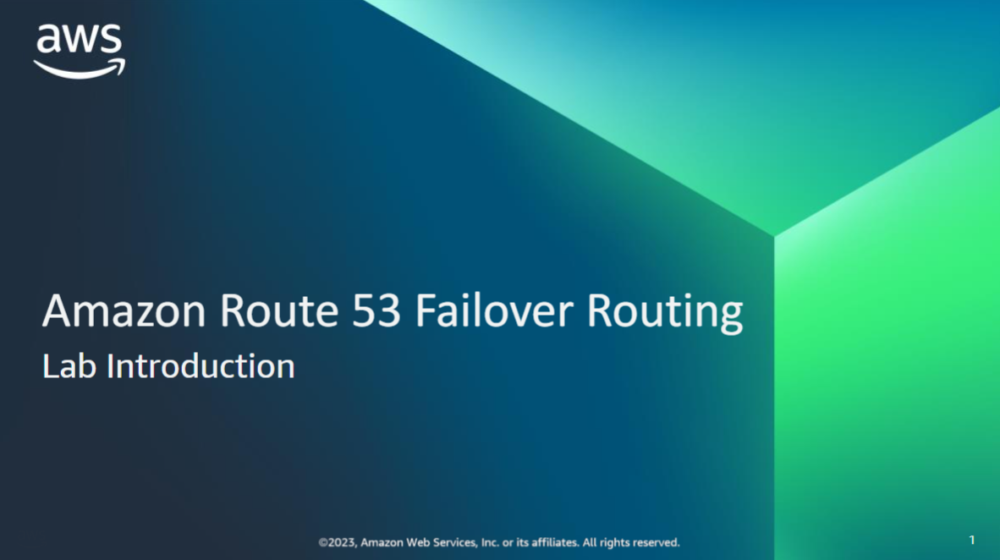
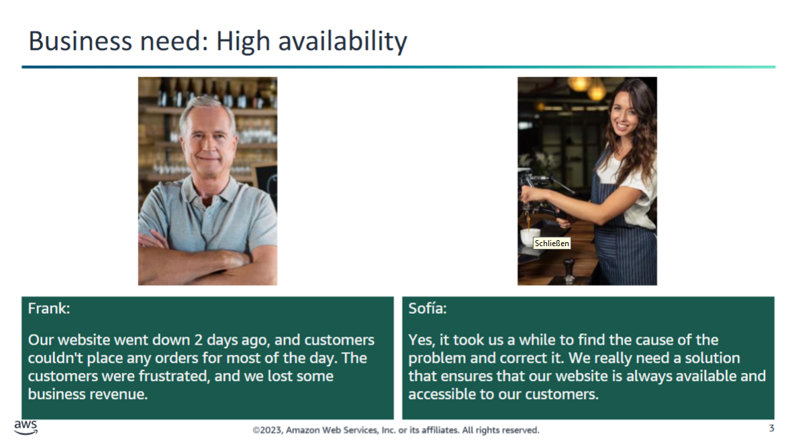
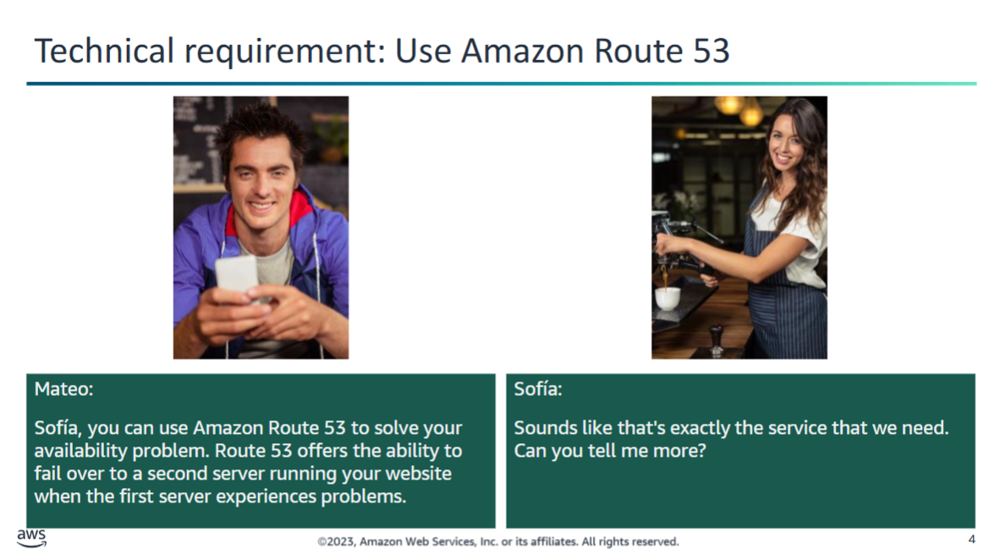
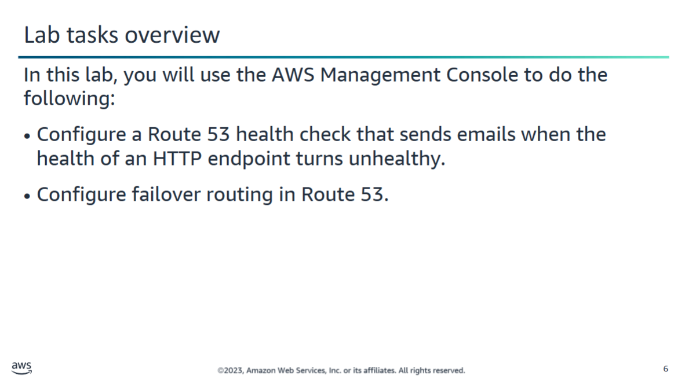
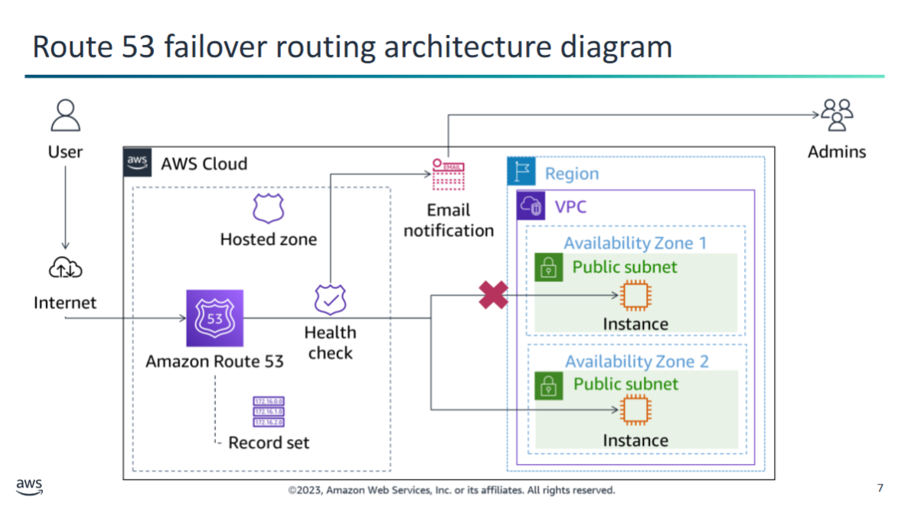

## 📝 Scenario: Website Outage at the Café

There have been many customers who have taken advantage of **online ordering at the café**. They appreciate how placing the order online helps ensure that when they come to the café to pick up their orders, they receive exactly what they want.

However, Frank mentions to Sofía that there was an **incident 2 days ago** when the **website was inaccessible for most of the day**. Customers expressed frustration that they could not place their orders online.

### ❗ Action Required:
As a result, you have now been asked to **make sure that this issue does not happen again**.

Sofíaconsulted Mateo on how to configure a backup deployment of the website so that if the main site goes down, the backup takes over. They would also like to be alerted when the primary site goes down so that they know about it.

Mateo determines that Route 53 would meet the technical requirements for improving the availability of their website.

After you complete this lab, clients will be notified in the event of a failure by Route 53 health checks, and traffic will be rerouted by failover routing configurations in Route 53.

## 🧪 Lab Scenario: High Availability with Route 53 Failover

In this lab, the environment starts with **two Amazon Elastic Compute Cloud (Amazon EC2) instances** already created. Each instance has the full **LAMP stack** installed and the café website deployed and running.

- The EC2 instances are **deployed in different Availability Zones**.  
  - For example: If the web servers are running in the `us-west-2` Region, then:
    - One web server runs in `us-west-2a`
    - The other runs in `us-west-2b`

### 🔧 Goal:
You will **configure your domain** such that:
- If the website in the **primary Availability Zone** becomes **unavailable**,
- **Amazon Route 53** will automatically **failover application traffic** to the instance in the **secondary Availability Zone**.

### ✅ End State:
Your environment will function as shown in the diagram:
- User traffic travels from the **internet to Amazon Route 53**.
- **Route 53 health checks** determine that the instance in **Availability Zone 1** is **unhealthy**.
- Traffic is then automatically **redirected to the healthy instance** in **Availability Zone 2**.
- An **email notification** is sent to administrators, informing them of the failed health check.

The answers to the questions are as follows: 

1.Which Route 53 feature monitors a web server and can send a notification to an administrator when the health status of the server changes?A Route 53 health check

2.Which Route 53 routing policy should you use to configure active-passive failover?A failover routing policy

3.Which type of Domain Name System (DNS) record do you create in Route 53 to route traffic to an IP address?A type A DNS record
10