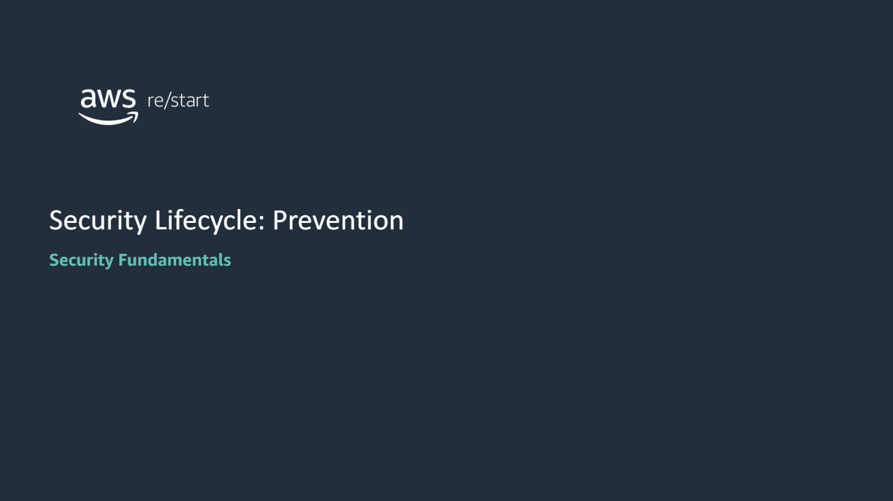

:::tip[In this lesson, you will learn how to:]

- Describe the importance of prevention in the security lifecycle
- Describe security prevention tasks
- Use a layered model to build a security prevention strategy
- List different types of prevention measures

:::

## Introduction to prevention

### Prevention in the security lifecycle

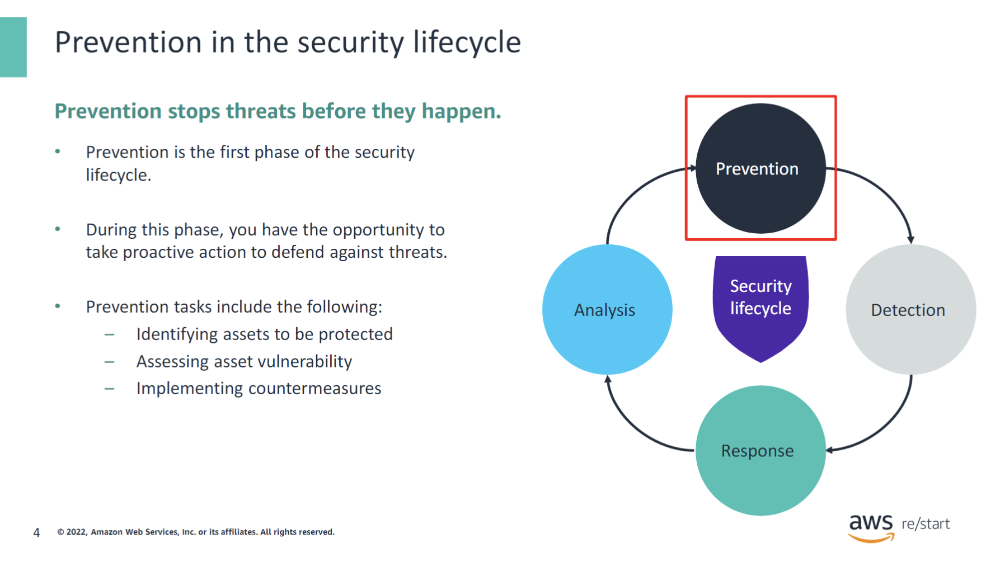

Prevention is the first and arguably the most important phase of the security lifecycle. It offers the opportunity to proactively stop threats from becoming breaches through the implementation of security controls. In the prevention stage, you:

- **Identify the assets to be protected:** You build an inventory of the networking devices, computers, applications, and other physical and digital resources that you must protect.
- **Assess asset vulnerability:** You examine each asset in the inventory and determine the type and level of protection that the asset needs.
- **Implement countermeasures:** For each asset to be protected, you implement security controls to prevent attacks against the asset from being successful.

The next slides examine these tasks in more detail.

### Identifying assets

You must know what resources are in your computing environment so that you can protect them. Therefore, the first step in prevention is to create an inventory of your computing assets. This inventory can be extracted from existing design documents, such as network topology diagrams, architecture diagrams, and other system documentation. The list should provide a clear understanding of what components are in your environment. It also should convey what their key properties are (for example, the IP address of network devices) and how they relate to each other.

Various tools can help you in this task. For example, for network discovery:

- You can use the ping command to determine the IP address of hosts in your environment and their reachability.
- You can use the open-source Nmap utility to discover the available hosts on a network and gather important information such as the services that they’re running.

In the AWS Cloud, the AWS Systems Manager service provides an inventory function that you can use to list the managed instances in your account. For each instance, the service can identify key information, such as the instance’s IP address and operating system and the applications installed on the instance.

### AWS Systems Manager Inventory

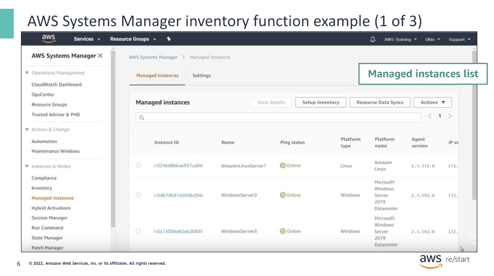

The next three slides show example screen captures of the AWS Systems Manager console. These screen captures illustrate the information that the Systems Manager inventory function provides. The screen capture on this slide shows the **Managed Instances** tab of the Systems Manager console. This tab displays a list of all of the managed Amazon Elastic Compute Cloud (Amazon EC2) instances in the user’s AWS account.

The information displayed for each instance includes its ID, name, ping status (which reflects the instance’s state), platform type, and IP address.

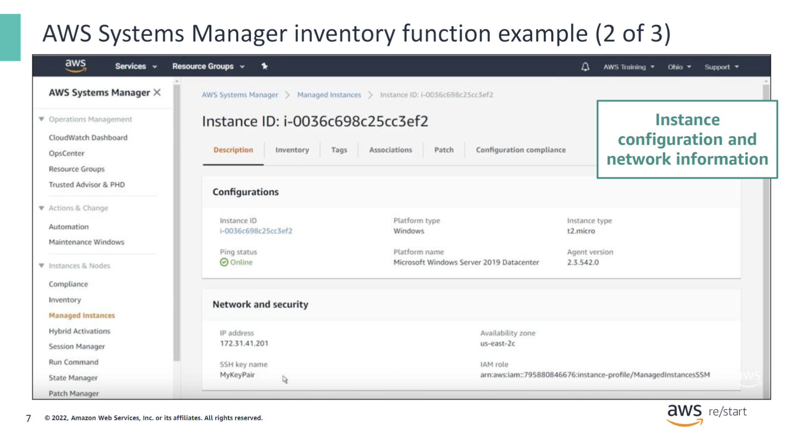

When you select an instance from the **Managed Instances** list, the console shows additional information about the instance through several tabs.

On the **Description** tab, you see more configuration details, including the **Availability Zone** where the instance is running. It also displays security information, such as the **key pair** that is used to remotely log in to the instance. You will learn more about EC2 instance key pairs later in the course.

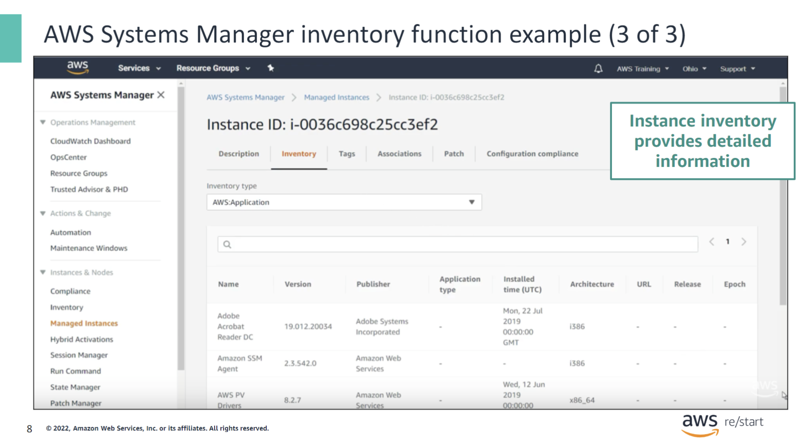

On the **Inventory** tab for a selected EC2 instance, you can see the various types of detailed inventory information that AWS Systems Manager captures. This information includes the following:

- **Installed applications**: Names, version, and publisher
- **Installed AWS components**: Drivers, such as EC2 drivers, and agents, such as the Systems Manager agent
- **Files**: Name, size, version, creation date, modification, and last accessed times
- **Network configuration**: IP address, media access control (MAC) address, subnet mask, and Domain Name System (DNS) servers
- **Windows updates**: Hotfix ID, installed by, and installed date
- **Services**: Name, status, dependent services, service type, and start type
- **Instance details**: System name, operating systems (OS) name, OS version, and OS architecture

The screen capture on this slide shows the list of installed applications on the selected EC2 instance.

### Assessing asset vulnerability

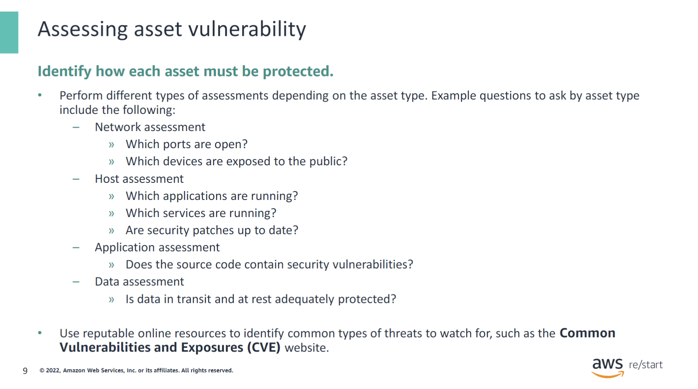

As soon as you have identified your list of assets, you can perform a vulnerability assessment on each one of them. The goal of vulnerability assessment is to search for security weaknesses or potential exposures so that you can implement countermeasures against them. It involves analyzing the asset’s security posture by asking questions relevant to the asset type, its intended use, and its desired level of protection.

Some example questions to evaluate the security posture of an asset are shown in this slide by asset type. In general, its functions include the following:

- **The host assessment** evaluates how vulnerable servers are to attacks.
- **The network assessment** evaluates the accessibility of networks and network devices.
- **The data assessment** examines the level of protection for data traveling through the system (data in transit) and data stored in the system (data at rest). It protects this data from the perspective of the confidentiality, integrity, and availability (CIA) triad.
- **The application assessment** evaluates the security vulnerability in an application’s source code.

As you analyze the security vulnerability of an asset, you should consider the potential threats. It is often useful to know the common types of threats that have been identified in the industry for the asset’s type. One resource that provides such information is the [Common Vulnerabilities and Exposures (CVE) website](https://cve.mitre.org/). The CVE website is an online resource that lists publicly disclosed cybersecurity vulnerabilities. The United States government’s Cyber Security and Infrastructure Agency (CISA) sponsors this website.

Automated tools, such as database scanners and application scanners, are available to help identify both existing and potential security vulnerabilities. When they detect a known vulnerability, some of the scanning tools point to the corresponding CVE entry.

### Common vulnerabilities and exposures example

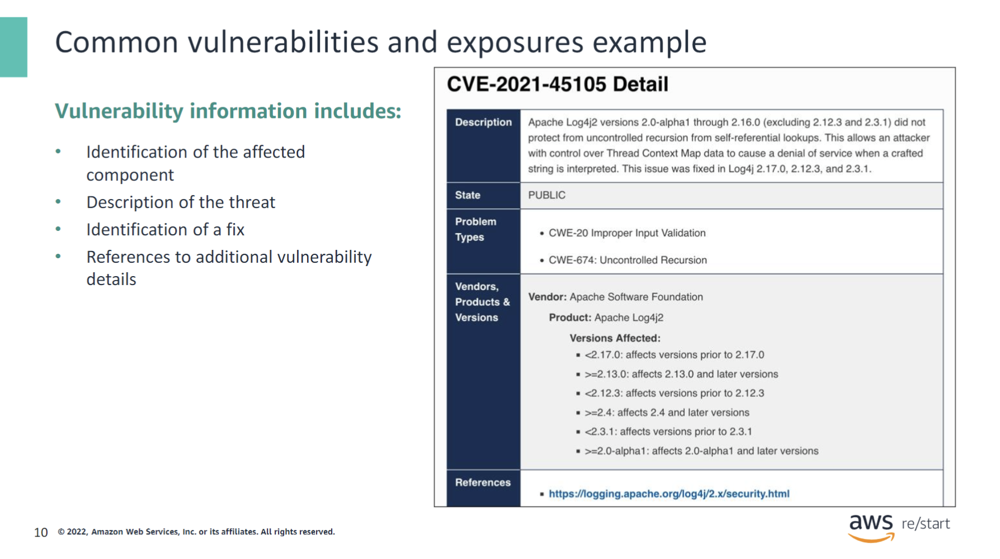

This slide shows an example of a vulnerability that was recorded in the CVE website. It identifies the vulnerability as affecting the **Apache Log4j2** software and describes the threat as potentially causing a **denial of service** attack. It also indicates **that a later version of the software includes a fix**.

### Implementing countermeasures

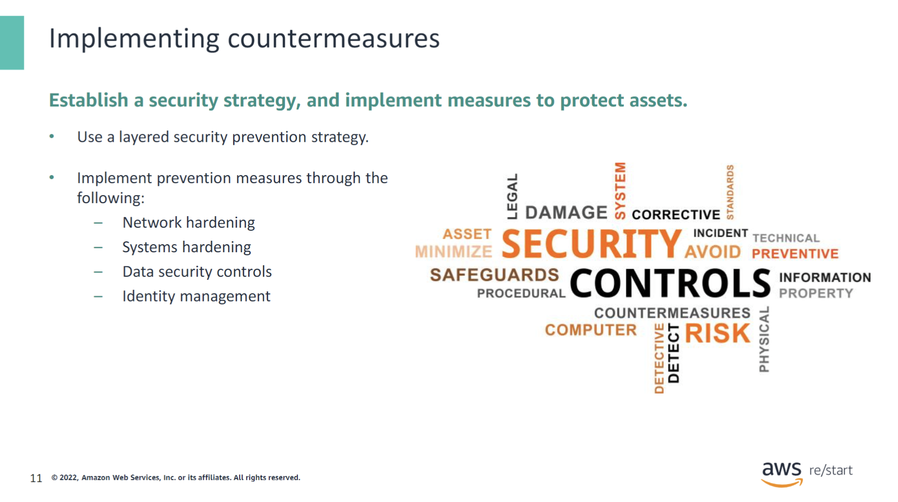

After you have analyzed and determined the security requirements of your assets, establish a security strategy, and implement security controls to protect your assets.

A best practice is to implement a security strategy that uses multiple layers of security. Each layer provides a specific type of protection, including protecting networks, systems, data, and user identity.

You will explore how to design a security strategy and identify different types of prevention measures in more detail in the next sections.

## Prevention strategy

In this section, you will learn the value of using a layered model to build a prevention security strategy.

### Layered security model

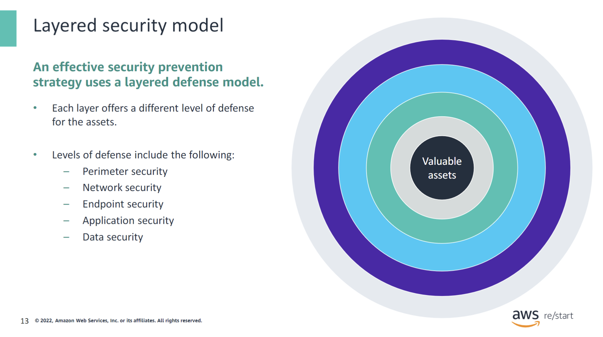

An effective security prevention strategy protects valuable assets by using a layered defense model. By implementing multiple layers of security, an attacker would have to penetrate all of the layers in order to gain access to the protected asset. Some examples of security layers include the following:

- **Perimeter security**: Secures the perimeter networks by using controls such as firewalls or an intrusion prevention system (IPS).
- **Network security**: Prevents unauthorized network access by using network access control lists (network ACLs), for example.
- **Endpoint security**: Uses software such as an antivirus program to protect a host.
- **Application security**: Protects applications with specialized firewalls, and monitoring and scanning tools.
- **Data security**: Protects access to data through identity and access management.

You will learn more about these layers and the tools that they use in the next modules.

#### Layered defense example: Castle

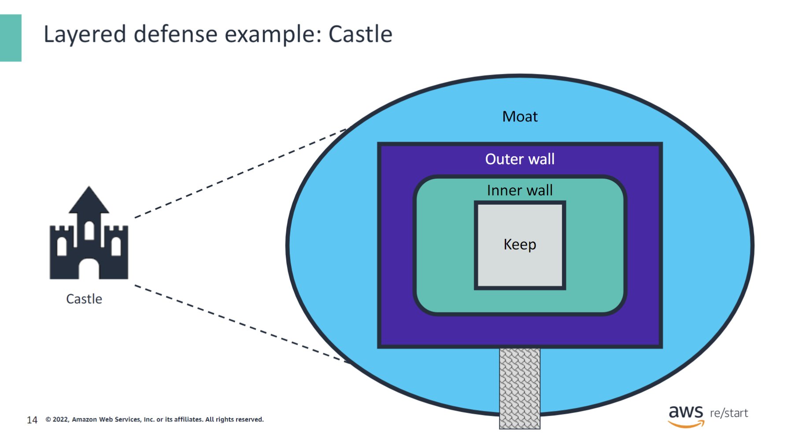

As an example of a layered defense, consider the architecture of a castle. The castle might have a moat as its first level of defense. The castle also includes an outer wall, an inner wall, and finally, the keep, where the protected assets reside. Each layer must be defeated in order for an attacking army to reach the keep and take the castle.

Similarly, companies implement many layers of defense on their systems to make the systems more difficult to breach.

### Layered defense example: OSI model

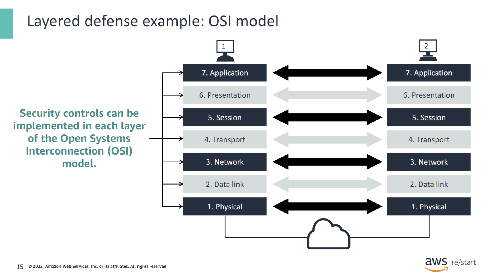

The OSI model provides another example of how security can be implemented in layers. Each of the model’s layers provides an opportunity to implement a security solution:

- **Physical layer:** Network devices and equipment are protected from physical access to keep intruders out.
- **Data link layer:** Filters are applied to network switches to help prevent attacks based on media access control (MAC) addresses.
- **Network and transport layers:** Implementing firewalls and access control lists (ACLs) helps to mitigate unauthorized access to internal systems.
- **Session and presentation layers:** By using authentication and encryption methods, you can prevent unauthorized data accesses.
- **Application layer:** Solutions, such as virus scanners and an IDS, help protect applications.

Protect each layer separately to make it as difficult as possible for an outside party to breach your defenses and gain access to your resources.

## Types of prevention measures

### Network hardening measures

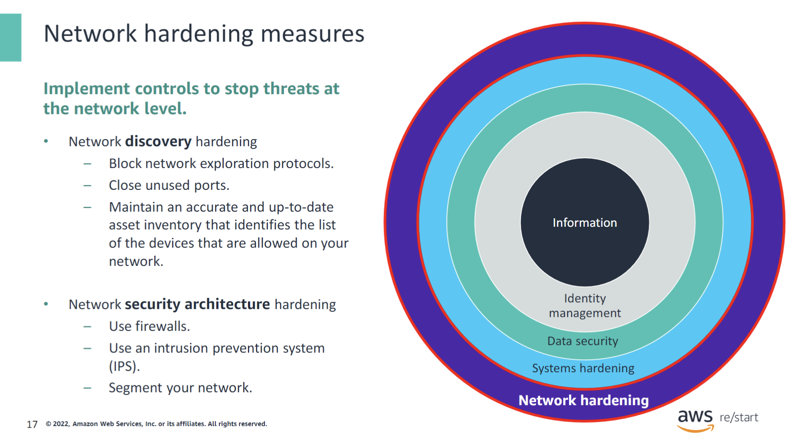

The first layer of security prevention measures focuses on protecting the network. This protection can be achieved through **network discovery hardening** and **network security architecture hardening**. This slide lists some examples of actions for each type of hardening.

The goal of **network discovery hardening** is to prevent an attacker from discovering, exploring, or mapping the network. Unfortunately, the same tools that network administrators use to explore or map networks can compromise network security if malicious entities are allowed to use them. (Examples of these tools include ping and Nmap.) As a result, network discovery tools should be blocked because they can be used to exploit network systems. Another effective network hardening action is to close network ports that are not used because they present open doors for attackers to come in. In addition, you can use your asset inventory list to identify and enforce the list of devices that are allowed on your network. If a device that is not on the allow list appears on your network, you can immediately investigate and take proper action.

**Hardening the security architecture** of your network is another important prevention measure. For example, you can use firewalls in your network topology to protect resources such as web servers and database servers. A firewall permits only a certain type of traffic (based on protocol and source IP address) to come into the protected resource. You can also use segments to break down the network so that critical resources run in their own segment, which gives them additional protection. For example, database servers could be such a critical resource.

You will learn more about network hardening measures in a separate module.

### Systems hardening measures

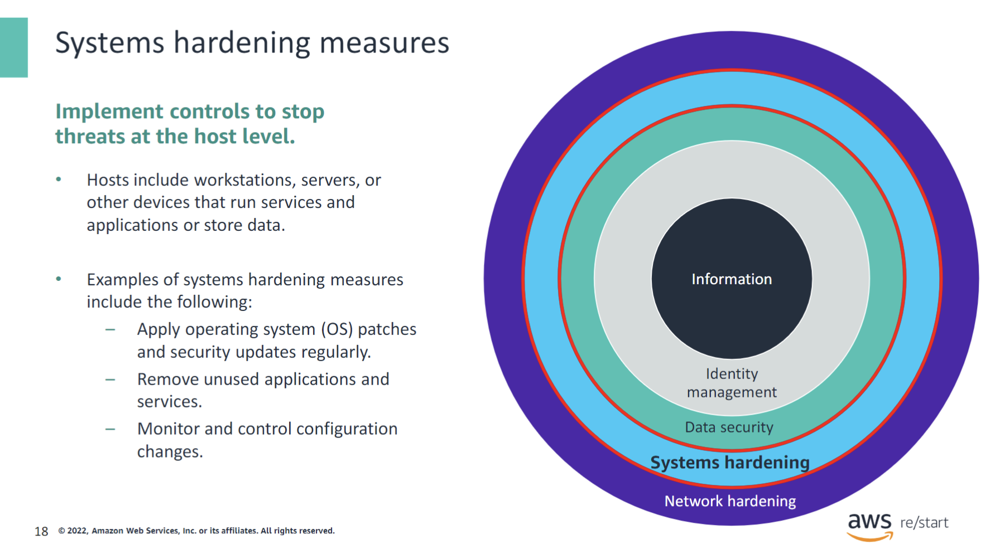

The next layer of security prevention measures addresses protecting the hosts that run your services and applications or that store your data. This security layer is known as systems hardening.

Examples of systems hardening measures include the following:

- **Applying OS patches and security updates on a regular basis:** As OS vendors identify known vulnerabilities, they publish patches to correct them. It is important that you apply these patches when they become available in order to prevent vulnerabilities at the OS level from being exploited.

- **Removing unused applications and services:** Unused or older versions of applications and services might sometimes expose security vulnerabilities that can be maliciously exploited. By uninstalling them, you not only eliminate the potential security exposure but also free up the runtime and storage resources that they consume.

- **Monitoring and controlling configuration changes:** Ideally, all configuration changes that you make to a system are performed using an automated tool that enforces best practice change control policies and procedures. You should also monitor all configuration changes so that you can always answer the important questions of, Who changed what, where, and when?

You will learn more about systems hardening measures in a separate module.

### Data security controls

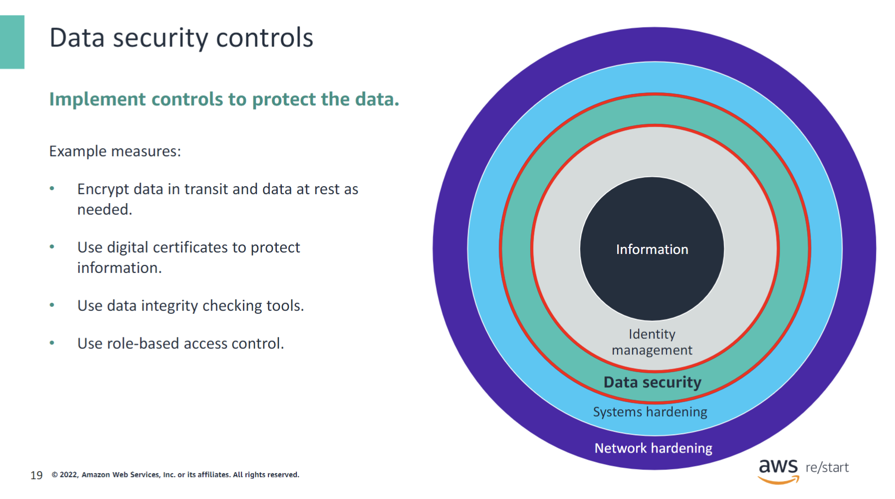

Data security is the next layer of prevention measures in the layered security model. It focuses on protecting data through the use of various control mechanisms, including the following:

- **Encrypting data in transit and data at rest:** Encryption protects the confidentiality of information. For example, a digital certificate can be used to encrypt messages between a sender and a receiver.

- **Using data integrity checking tools:** For example, use a hashing tool to generate a unique value based on the content of a data file before a sender transmits the file. When the receiver receives the file, the same hashing tool is used to generate the value again. If both the before and after transmission values are the same, the data file’s integrity has not been compromised.

- **Using role-based access control:** Access control affects the availability of information. It ensures that data is made available only to users that are authorized to access the data.

You will learn more about data security controls in separate modules.

### Identity management

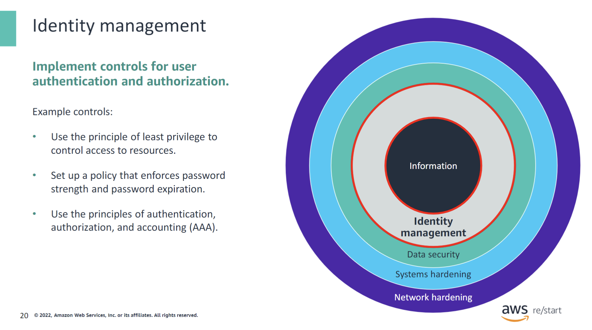

Finally, the last layer of security prevention measures is identity management. Identity management defines rules that specify who has access to specific information (authentication) and what they can do with it (authorization). Examples of identity management controls include the following:

- **Use the principle of least privilege to control access to resources:** You should grant users the permission to access only the resources that they are authorized to.

- **Set up a policy that enforces password strength and password expiration:** Passwords are a mechanism that is used for authentication. A good password policy prevents passwords from being easily guessed and requires them to be changed on a periodic basis.

- **Use the principles of authentication, authorization, and accounting (AAA):** In addition to authentication and authorization controls, auditing measures should also be put in place. These measures are implemented by capturing resource usage information, and they facilitate security auditing.

You will learn more about identity management in a separate module.

## Checkpoint Questions

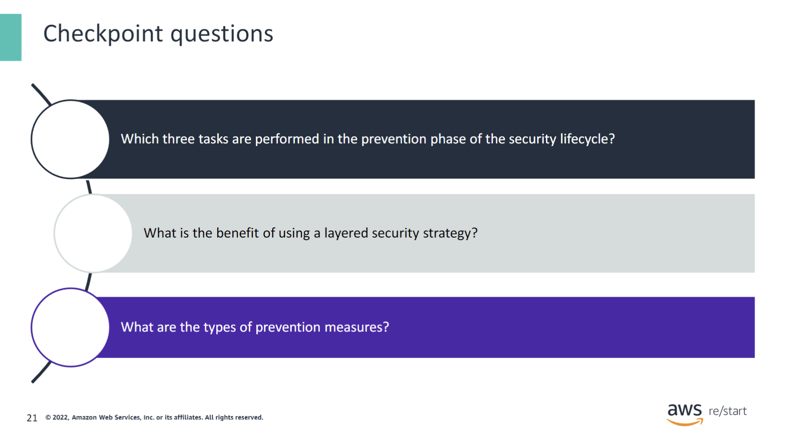

1. What are the tasks performed in the prevention phase of the security lifecycle?

- Identify assets to be protected.
- Assess asset vulnerability.
- Implement countermeasures.

2. What is a layered security strategy?

A layered security strategy establishes multiple layers of defense against attacks. For an attack to succeed, it must overcome each layer, which makes it difficult.

3. What are the types of prevention measures?

- Network hardening measures
- System hardening measures
- Data security controls
- Identity management

## Key Takeaways

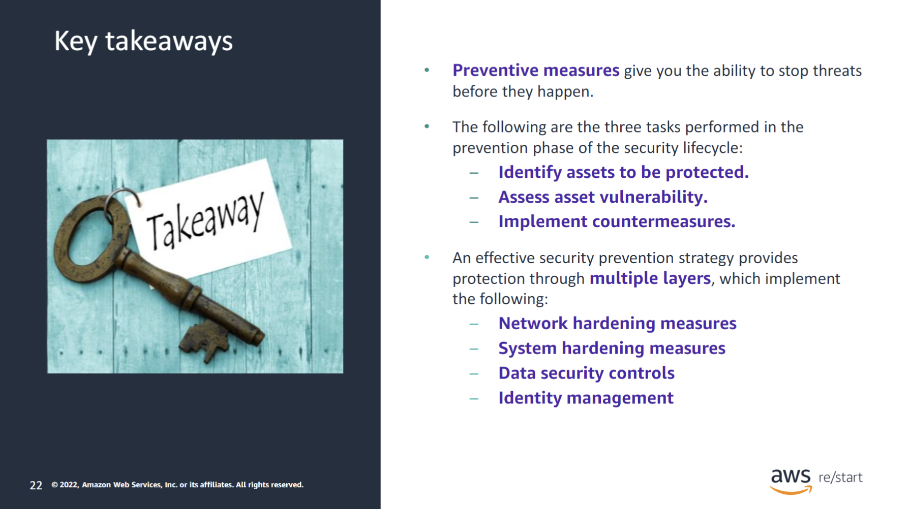

:::tip[Keytakeaways from this lesson include the following:]

- Preventive measures give you the ability to stop threats before they happen.
- The following are the three tasks performed in the prevention phase of the security lifecycle:
  - Identify assets to be protected.
  - Assess asset vulnerability.
  - Implement countermeasures.
- An effective security prevention strategy provides protection through multiple layers, which implement the following:
  - Network hardening measures
  - System hardening measures
  - Data security controls
  - Identity management

:::
