:::tip[In this lesson]
you will learn how reliable authentication is a core component of modern IT security solutions. You will also explore how it works.

:::

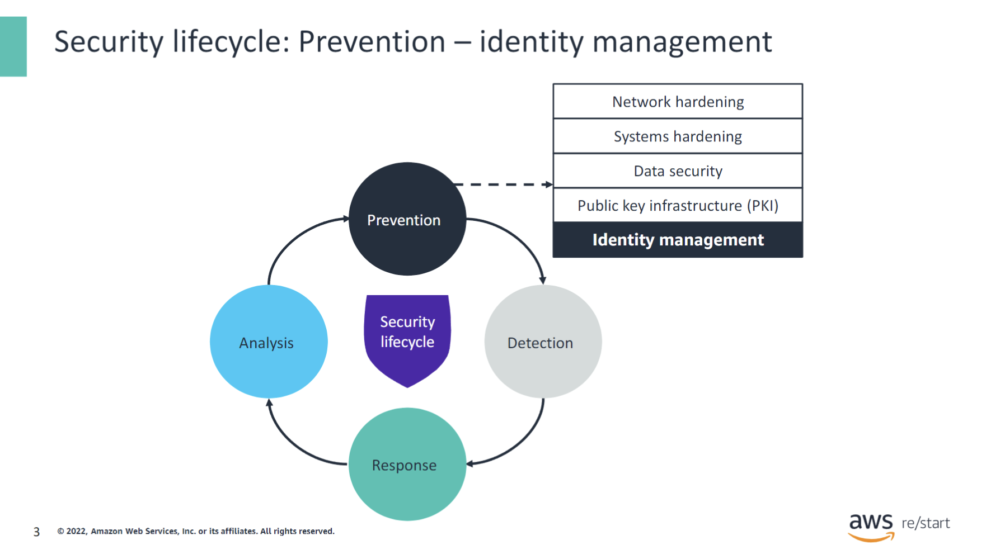

As a review, the security lifecycle consists of the following phases:

- **Prevention**: Serves as the first line of defense
- **Detection**: Occurs when prevention fails
- **Response**: Describes what you do when you detect a security threat
- **Analysis**: Completes the cycle as you identify lessons learned and implement new measures to prevent the issue from occurring again in the future

In this lesson, you will learn how you can use identity management concepts and methods in the prevention phase.

## Introduction to identity management

In this section, you will learn about identity management and recall the confidentiality, integrity, and availability (CIA) triad.

### What is identity management?

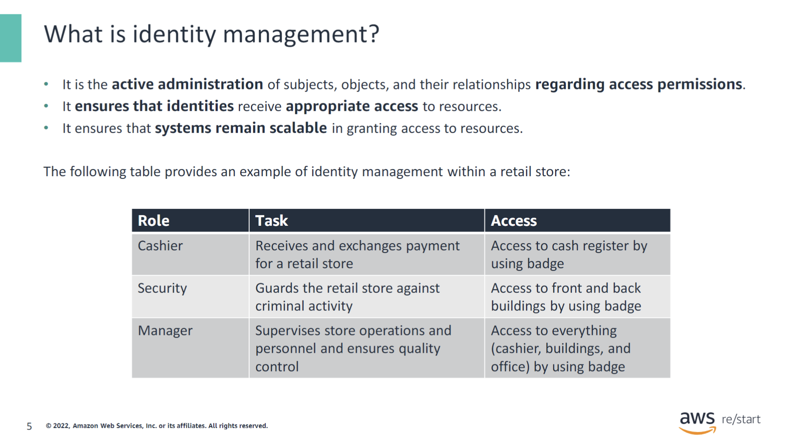

Identity management is the active administration of subjects, objects, and their relationships regarding access permissions.

With identity management, users (or any type of identity) receive appropriate access to the resources that they need at the correct level and appropriate time. By implementing identity management, systems remain scalable as they identify and grant access to resources.

In the example on the slide, a cashier, security guard, and manager are working in a retail store. Their tasks are specific to their roles, and they each have specific access to certain areas or items depending on their roles.

### Identity management principles

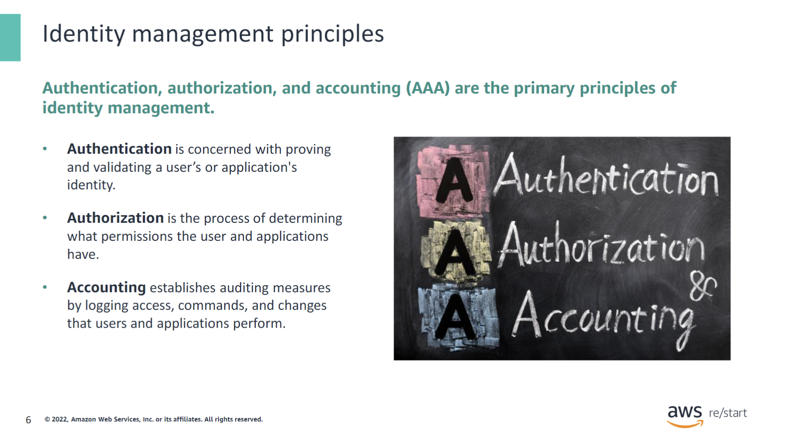

Authentication, authorization, and accounting are the core tasks that are performed in identity management. As an example, consider the case of a visitor who tries to gain physical access to a company’s facilities:

- **Identification:** The visitor must first prove that they are who they say they are by showing a picture identification to the receptionist.
- **Authentication:** The receptionist authenticates the visitor’s identity by comparing the picture to the person who is standing in front of them.
- **Authorization:** To specify that the person is expected and should be allowed into the facilities, the receptionist calls the contact person to grant access to the visitor. The receptionist might also do the following actions:
  - Issue a visitor’s badge
  - Require that the company contact escort the visitor into the facilities as proof to other employees of the visitor’s authorization.
- **Accounting:** The visitor is required to sign a visitors’ log. The visitor provides the following information in the log:
  - Name
  - Date and time they arrived and departed
  - Number of their visitor’s badge
  - Name of their contact
  - Reason for their visit

### AAA example login process

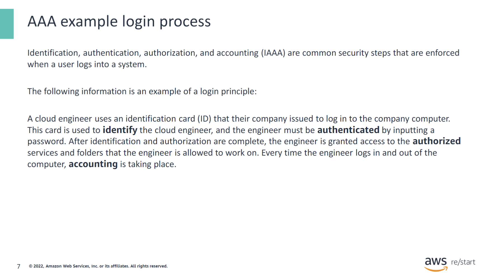

As an analogy, consider the case of a visitor who tries to gain physical access to a company’s facilities. Recall the following:

- **Identification:** Something that the visitor must prove
- **Authentication:** Something that can be verified or validated
- **Authorization:** Specific access according to a role or level
- **Accounting:** A way to track the user or visitor with a log

## Authentication

### Authentication factors

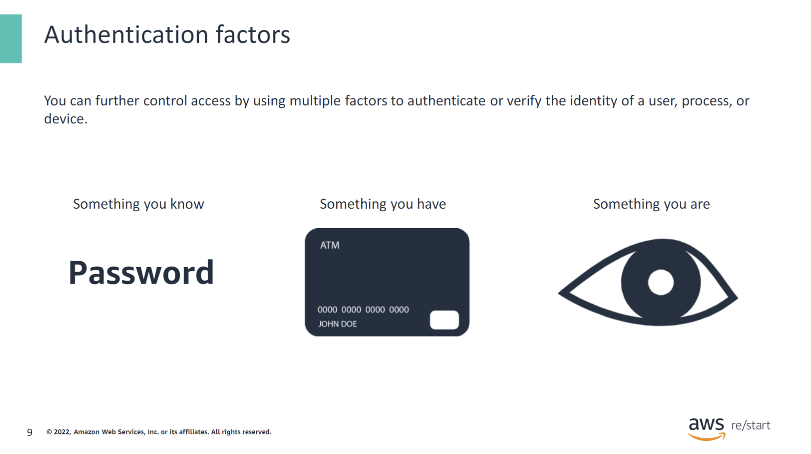

The three types of authentication factors are **something you know**, **something you have**, and **something you are**. Every authenticator has one or more authentication factors.

**Multi-factor authentication (MFA)** is an authentication method that requires multiple methods or ways of authentication. For example, you log into a bank website with your password, and MFA is enabled. It might ask you for something that you have, such as your phone number. MFA is asking you for something that you know and something that you have.

### Authentication factors: Something you know

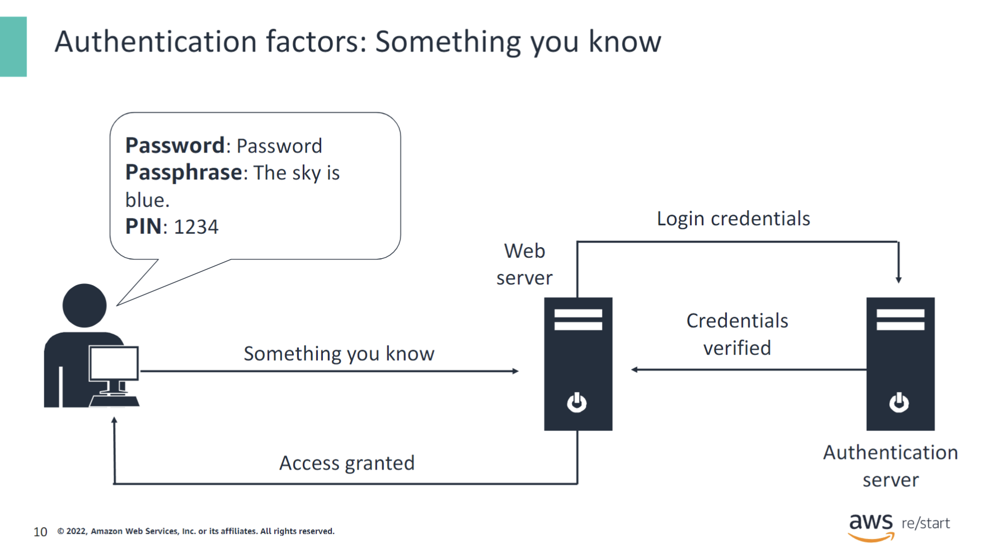

Passwords, passphrases, and personal identification numbers (PINs) are examples of authentication factors. These factors are simpler to implement, but they are also the least secure. In the example on the slide, a diagram shows the authentication factor of something that you know. A user is inputting the following information:

- **A password:** `Password`
- **A passphrase:** `The sky is blue`
- **PIN:** `1234`

By using this process, the web server can send the login credentials to the authentication server for verification. Then, it sends the information back to the web server, and access is granted.

### Authentication factors: Something you have

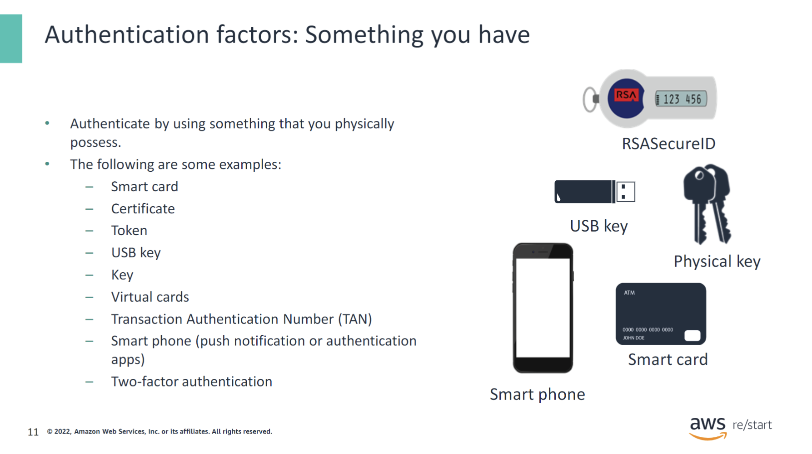

Using something that you have is a more secure way to authenticate. This method is often implemented as a second-factor authentication system after you have provided something that you know.

### Authentication factors: Something you are

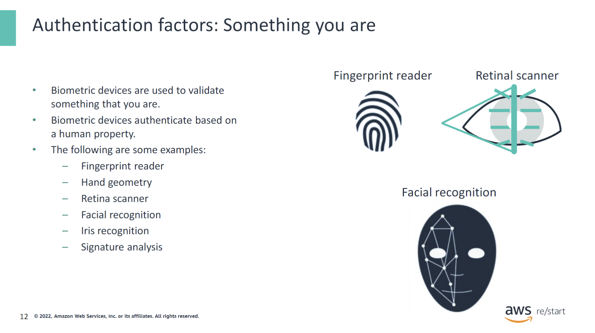

Using an authentication mechanism that validates a unique human property, such as a fingerprint or a retinal pattern, is the most complex and expensive solution. However, the authentication can be highly reliable when it is configured well.

Accuracy in biometrics is the most important factor in this type of authentication.

### Personally identifiable information (PII)

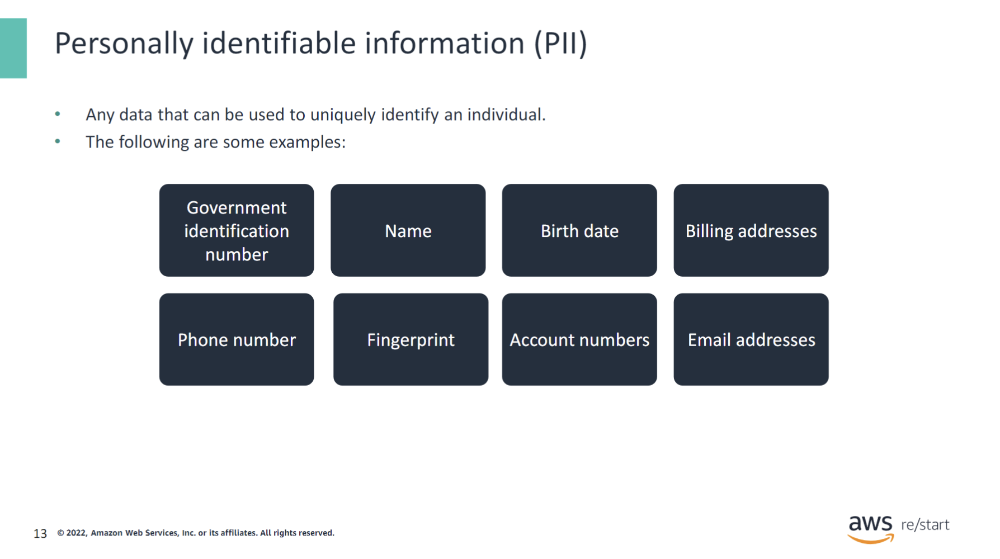

Personally identifiable information (PII) is a type of data that, when used alone or with other relevant data, identifies an individual. PII might contain direct identifiers, such as passport information, race, ethnicity, or date of birth. Even if individuals have the same name and possibly the same birth date, they would not have the same government identification number. In this way, PII can identify something unique about an individual among a group of people.

**Why is PII important?**

PII needs to be protected because it is something that only the individual can uniquely identify. Passwords can be cracked and systems can be hacked, but PII is something that cannot be cracked. Therefore, it is important to keep it in a safe place.

PII can fall under all three authentication factors:

- **Something you know:** Government identification number
- **Something you have:** Bank card
- **Something you are:** Fingerprint

### Authentication: Password policies

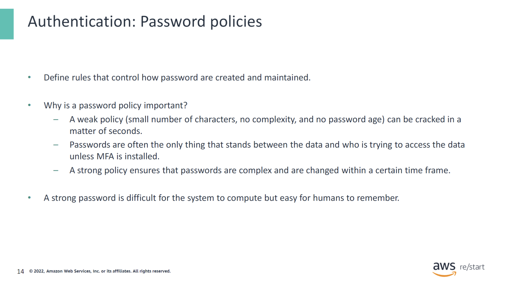

When you use password authentication, controlled password management is critical. The most basic way to manage password authentication is to define a policy with password parameters or rules. A basic or common policy might have the following parameters:

- **Minimum number of characters:** For example, eight
- **Password complexity:** None or at least one capital letter
- **Maximum password age:** None

An example password for this policy is `Password`. This password and policy make this password extremely vulnerable to attacks such as dictionary and rainbow table attacks. A good policy might have the following parameters:

- **Minimum number of characters:** Passwords must be at least 12 characters.
- **Password complexity:** Passwords must contain at least one capital letter, one number, and a symbol.
- **Maximum password age:** After 45 days, passwords expire, and the last 10 passwords cannot be used again.

An example password for this policy is `Pa$$w0rd123!`.

### Dictionary attacks

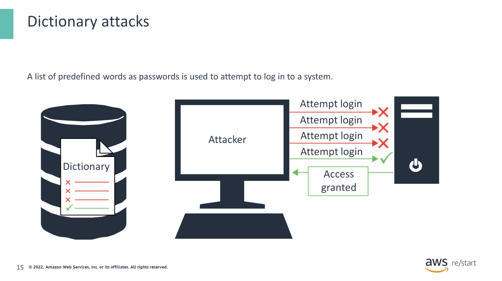

When you define password rules, you must understand the types of attacks that password authentication can be subject to. One type of attack is a **dictionary attack**. A dictionary attack attempts to systematically enter each word in the dictionary as a password until it finds a match. Countermeasures for dictionary attacks include enforcing a strong password policy and locking out access after a fixed number of unsuccessful attempts.

Another type of password authentication attack is a **rainbow table attack**, which uses precomputed hashes of text passwords. These precomputed hashes are compared against stolen hashes to find their corresponding password.

A **password hash** is a unique encrypted value. This password hash is produced by taking the value of the text password and transforming it by using an algorithm. The algorithm always produces the same hashed value for a given input value. The rainbow table lists the plain-text value of encrypted passwords specific to a given hash algorithm. Thus, the text password value of a password can easily be determined when a match on the hash value is found.

## Tools and services

### Password managers

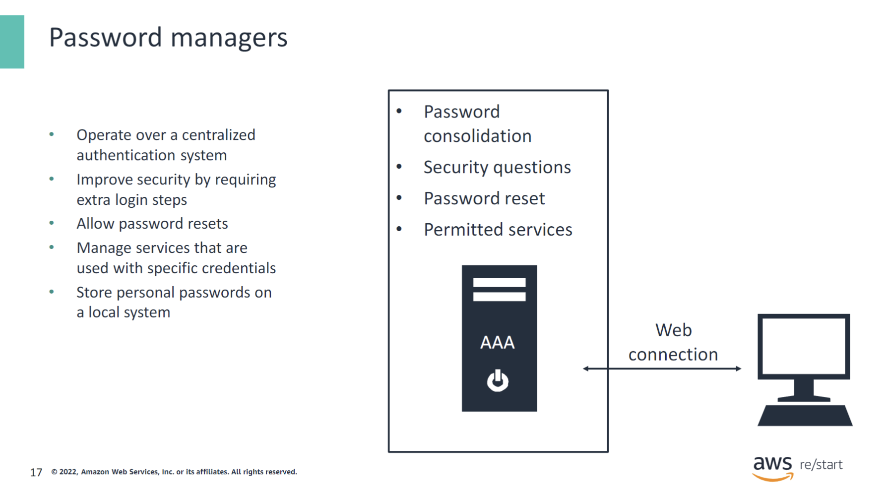

One of the benefits of a password management system is that it gives users more control over managing their credentials.

### Group accounts

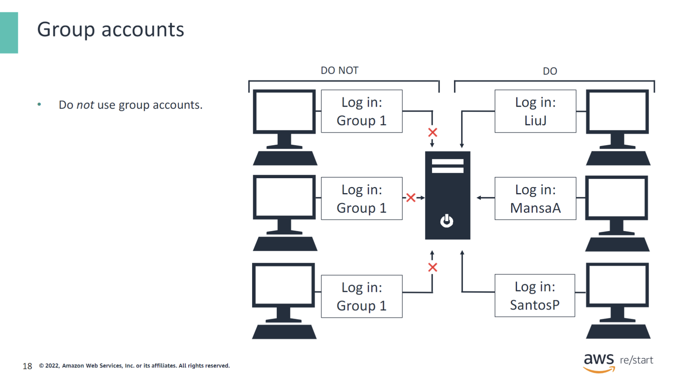

To harden authentication, as a best practice, avoid the use of group accounts because they provide no accountability. With group accounts, multiple groups can authenticate.

### Single sign-on (SSO)

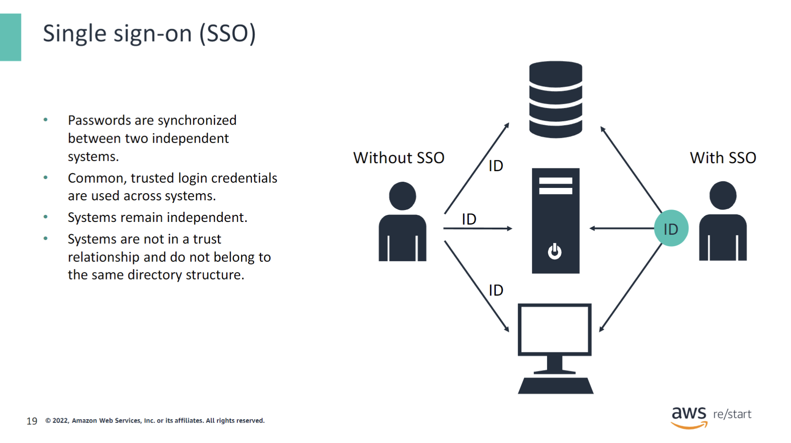

With single sign-on (SSO), users log in once and gain access to different applications without the need to re-enter login credentials for each application.

### AWS Single Sign-On

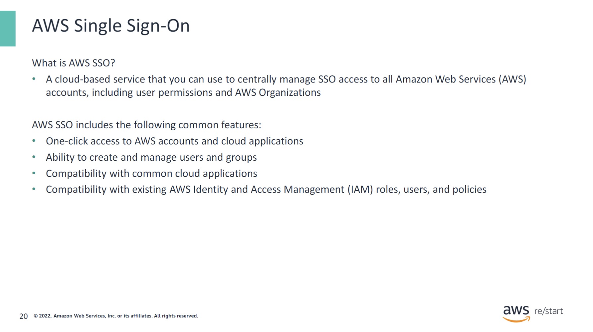

AWS SSO includes the following features:

- **One-click SSO access to AWS accounts:** AWS SSO has integrated applications and custom SAML 2.0 based applications, which gives the AWS SSO console quick one-click access to authorized users.
- **Ability to create and manage users and groups with AWS SSO:** You can create users and groups within AWS SSO in the console for easy access to granting permissions. AWS SSO is also compatible with the AWS Directory Service for Microsoft Active Directory.
- **Compatibility with common cloud applications:** Because AWS SSO is compatible with commonly used cloud applications, cloud administrators don’t need to learn how to administer SSO services to different applications. AWS SSO can be integrated with applications that are noted in the AWS documentation.
- **Compatibility with existing IAM roles, users, and policies:** Using AWS SSO will have no impact on existing IAM roles, users, or policies.

For more information, see [What is AWS Single Sign-On?](https://docs.aws.amazon.com/singlesignon/latest/userguide/what-is.html).

### Federated users

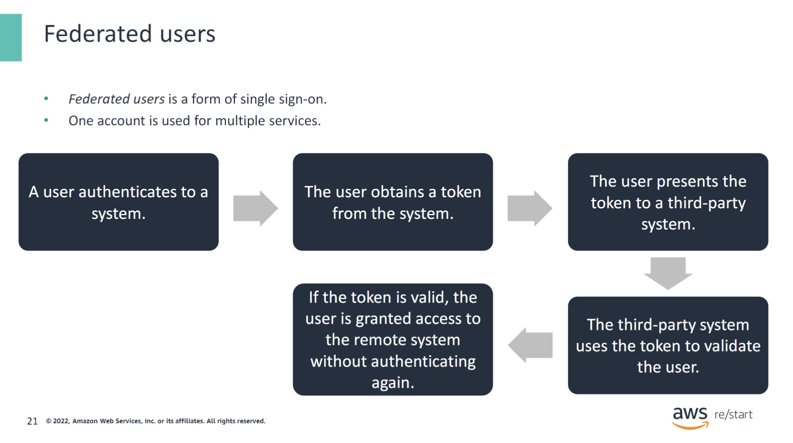

Federated users is a type of SSO implementation that is used between web identities. It uses a token to verify user identity between distinct systems.

With SSO, individuals can sign into different networks or services by using the same group or personal credentials. For example, by using SSO, you can use your Google account credentials to sign into Facebook.

### Amazon Cognito

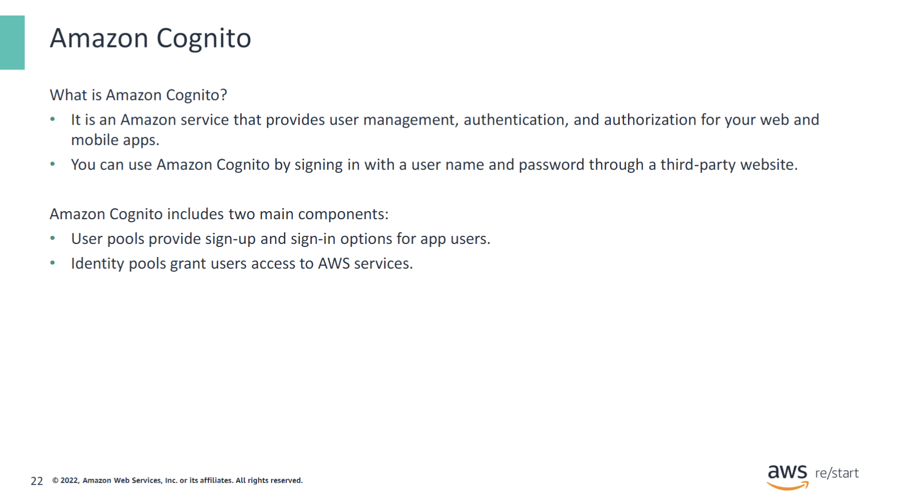

Here is how Amazon Cognito works to authenticate and grant access to an AWS service:

1. First, the user signs in through what is called a user pool and receives a user token after they get authenticated.
2. The application will then exchange the user pool token for an AWS credential through the identity pool.
3. For the final step, the user can now use the AWS credentials to access AWS services.

**User pools have the following characteristics:**

- Can federate through a third-party identity provider
- Function as a user directory for Amazon Cognito
- Give users the ability to sign up or sign in through a web or mobile app by using Amazon Cognito
- Provide SSO, customizable user interface (UI), social sign-in options, user directory management, and MFA

**Identity pools have the following characteristics:**

- Support anonymous guest users
- Give users the ability to obtain temporary AWS credentials to access AWS services
- Provide SSO, social sign-in, OpenID Connect (OIDC) providers, SAML identity providers, and developer-authenticated identities

For more information, see [What is Amazon Cognito?](https://docs.aws.amazon.com/cognito/latest/developerguide/what-is-amazon-cognito.html).

### How IAM works

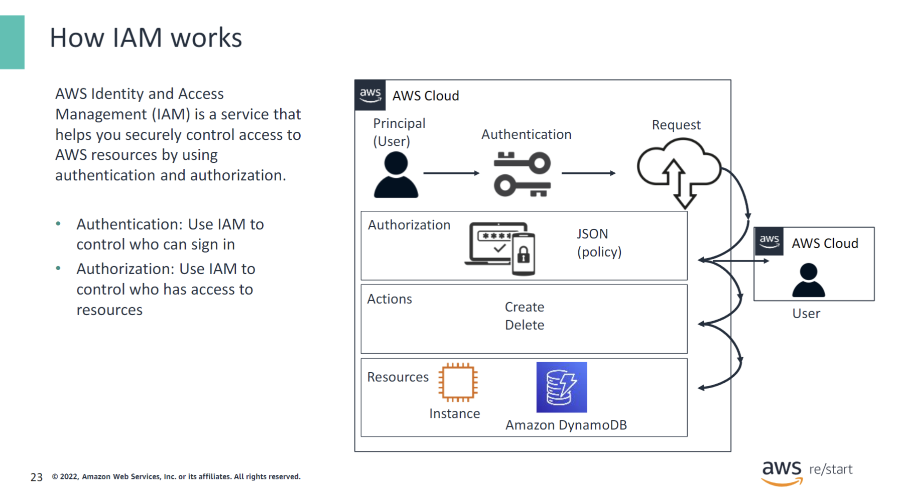

The diagram on the slide illustrates how IAM works:

1. **Authentication**:
   - When the user signs in to the AWS console, the principal is authenticated as the AWS account root user or an IAM entity (user or role).

2. **Request**:
   - The principal then sends a request to AWS, which contains:
     - Information about the principal itself
     - The action it wants to perform
     - Environment data
     - Resources

3. **Authorization**:
   - After the request is sent, AWS uses policies stored as JavaScript Object Notation (JSON) documents to check whether the user is authorized for the request.
   - As soon as the user is authenticated and authorized and AWS approves the request, the user is allowed to create, delete, and edit resources.
   - The policy defines the actions that the principal is allowed to take on the resources.

4. **Components of a Request**:
   - **Resources**: The AWS resource object being accessed
   - **Principal**: The (user or role) sending the request
   - **Environment Data**: IP address, user agent, enabled status, time of day
   - **Resource Data**: Data that pertains to the resource (e.g., a tag on an Amazon Elastic Compute Cloud [Amazon EC2] instance)

5. **Authorization in AWS**:
   - Authorization is stored in AWS as JSON documents.
   - AWS uses these policies to check if the actions requested are allowed or denied.
   - A policy holds what the principal or user is allowed to create, delete, or edit.

## Checkpoint questions

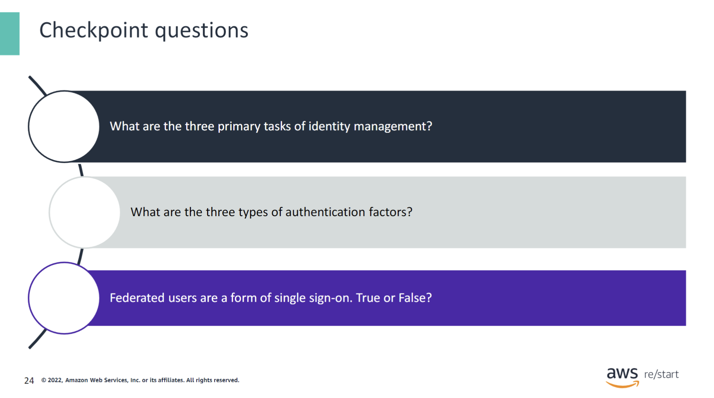

1. The following are the three primary tasks of identity management:

- **Authentication**
- **Authorization**
- **Accounting**

2. The following are the three types of authentication factors:

- **Something you know**
- **Something you have**
- **Something you are**

3. Federated users are a form of single sign-on.

True

## Key takeaways

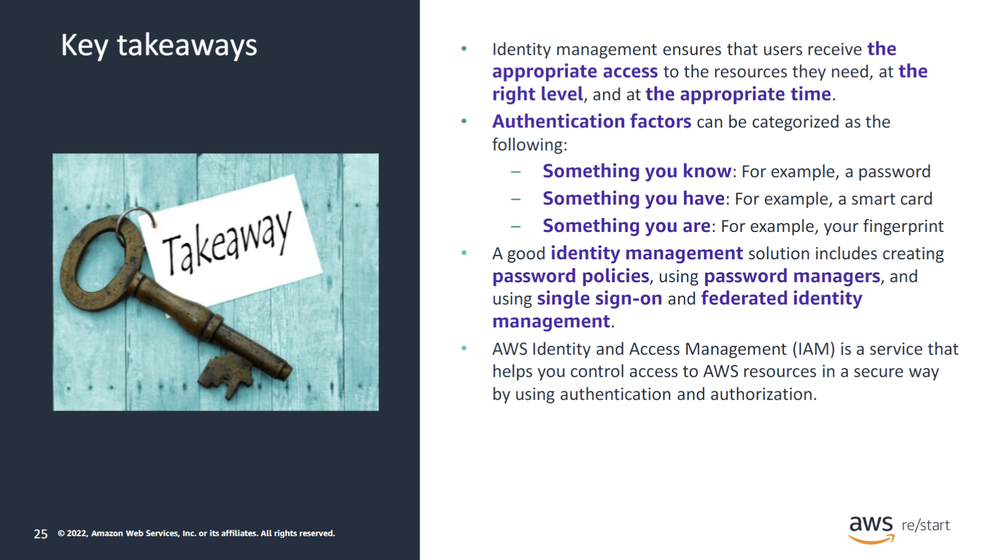

:::tip[The following are some keytakeaways from this lesson:]

- **Identity management** ensures that users receive the appropriate access to the resources that they need, at the right level, and at the appropriate time.

- **Authentication factors** can be categorized as the following:
  - **Something you know:** For example, a password
  - **Something you have:** For example, a smart card
  - **Something you are:** For example, your fingerprint

- A good identity management solution includes creating password policies, using password managers, and appropriately using single sign-on and federated identity management.

- **AWS Identity and Access Management (IAM)** is a service that helps you control access to AWS resources in a secure way by using authentication and authorization.

:::
