:::tip[In this lesson, you will learn how to:]

- Define security analysis and why it is necessary
- Identify tools and processes for security analysis
- Describe how different types of testing, monitoring, and logging support security analysis

:::

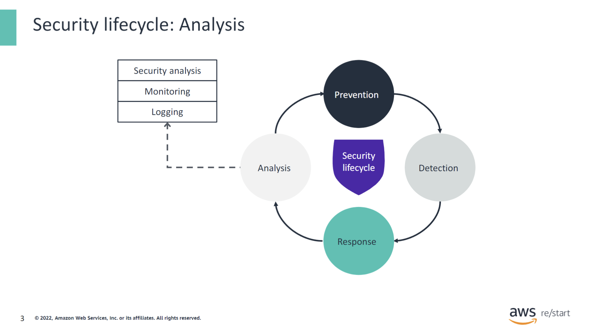

As a review, the phases of the security lifecycle consist of:

- **Prevention** – Is the first line of defense
- **Detection** – Occurs when prevention fails
- **Response** – Describes what you do when you detect a security threat
- **Analysis** – Completes the cycle as you identify lessons learned and implement new measures to prevent the issue from occurring again in the future

In this lesson, you will learn about the analysis phase of the security lifecycle. Specifically, you will discover tools and techniques for doing security monitoring, logging, and analysis.

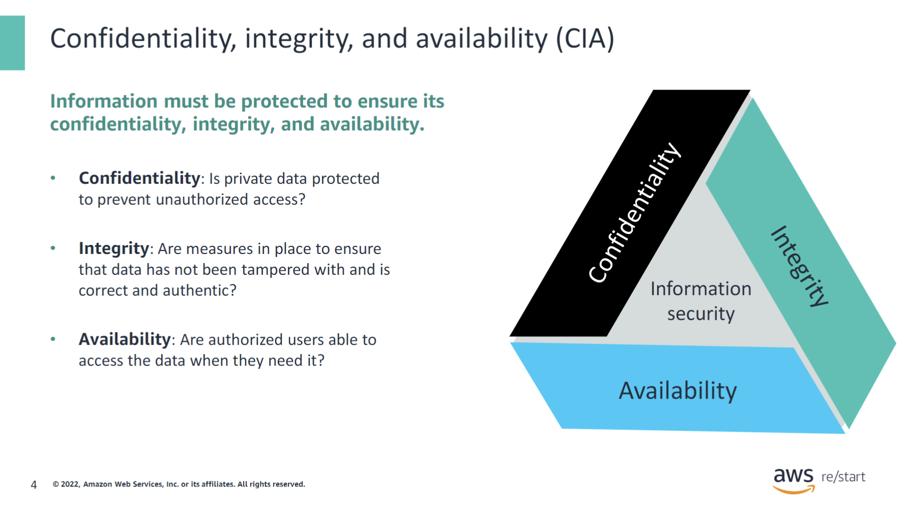

Recall that the CIA triad—confidentiality, integrity, and availability—is a concept that drives data security in enterprises. Confidentiality aims at keeping personal data safe and hidden from non-authorized people. Integrity consists of ensuring that data is not modified or altered throughout the process in which it is used. Finally, availability ensures that data stays available when needed for the right person.

All three of these concepts can be covered during analysis.

## Security analysis

### What is analysis?

Analysis is the final phase of the security lifecycle. In the analysis phase, you review the cause of security incidents and analyze current security controls to determine weaknesses. The objective is to improve and strengthen those controls to better protect your network, facilities, and organization.

For example, when your car has a flat tire, you need to find the origin of the problem. It can be because of a nail or because it is deflated. For both cases, you would not act the same way to fix the issue and prevent it from happening again.

Questions that you might ask during analysis include the following:

- How many security breaches did you experience?
- How did they happen?
- Was the data breach accidental?
- How many people did they affect?
- How could you prevent them from happening again?

The next topic describes some guidelines and techniques that you can apply during the analysis phase to answer these questions.

### General guidelines for analysis

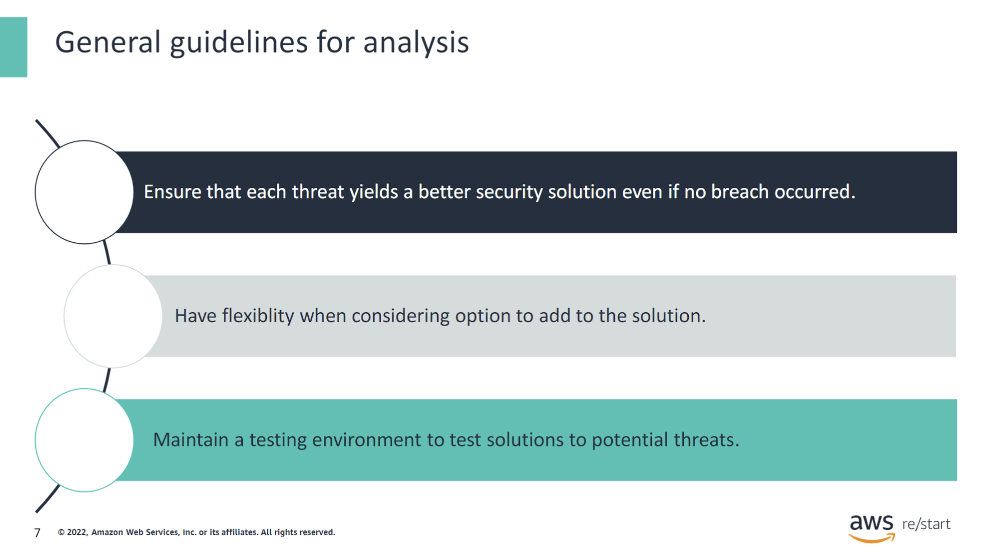

The main goal of analysis is to improve and strengthen the existing security of your environment.

When you test to simulate attacks, do so in a separate test environment that is representative of your production environment. However, be aware that you will probably not be able to do everything to protect your system. Each action that you take to protect your system (for example, limiting access to resources or reducing points of failure) will have impact (for example, slowing the network or increasing costs). You might want to find the right balance for your business instead of implementing everything that is possible.

### Types of security tests

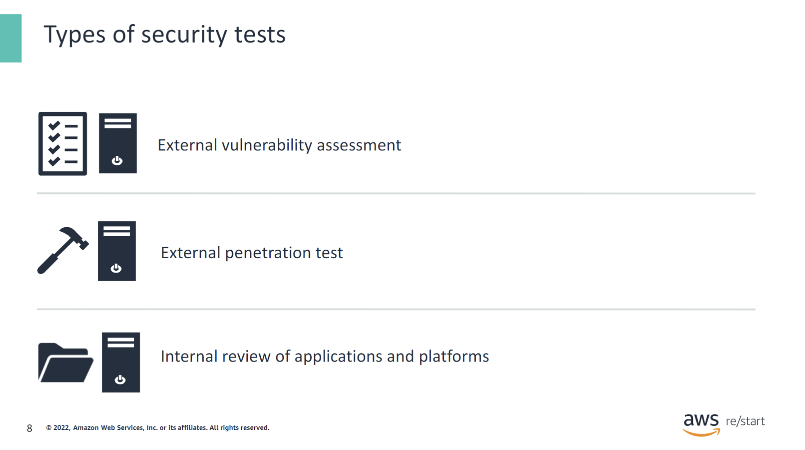

You can conduct security testing during the analysis phase. Doing security tests in the analysis phase is useful in order to mimic what could happen if your system were under attack. Conducting security tests gives you an opportunity to implement solutions to better prepare against these attacks. The types of testing include the following:

- **External vulnerability assessment** – A third party evaluates system vulnerabilities with little knowledge of the infrastructure and components.
- **External penetration test** – A third party with little knowledge of the system actively tries to break into the system in a controlled manner.
- **Internal review of applications and platforms** – A tester with some or full knowledge of the system validates the effectiveness of the following for known susceptibilities:
  - Controls in place
  - Applications and platforms

In the AWS Cloud, Amazon Web Services (AWS) customers are encouraged to conduct security assessments or penetration tests against their AWS infrastructure.

### Root cause analysis (RCA)

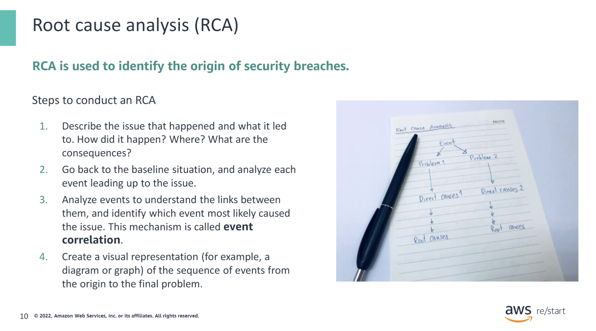

Root cause analysis (RCA) can be used to provide a clear and accurate answer to the following question: How did the breach happen?

You usually perform root cause analysis when your network underwent an attack, for example, or when you perform penetration testing to test your network’s security. As a result of that analysis, you can take actions to prevent that issue from happening again in the future.

Consider the example of a folder in which you are storing important data. One day, you realize that part of this data has disappeared. After performing a root cause analysis, you conclude that the wrong permissions were applied to this folder and that unauthorized users could access it. You must take action and modify the rules to restrict the access to the folder to prevent this from happening again.

### Risk assessment

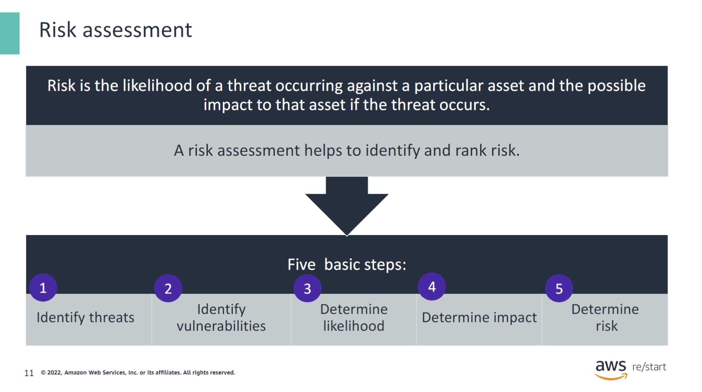

During a risk assessment, ask “What are the most critical assets or critical business processes that need the most protection?”

### Risk response strategies

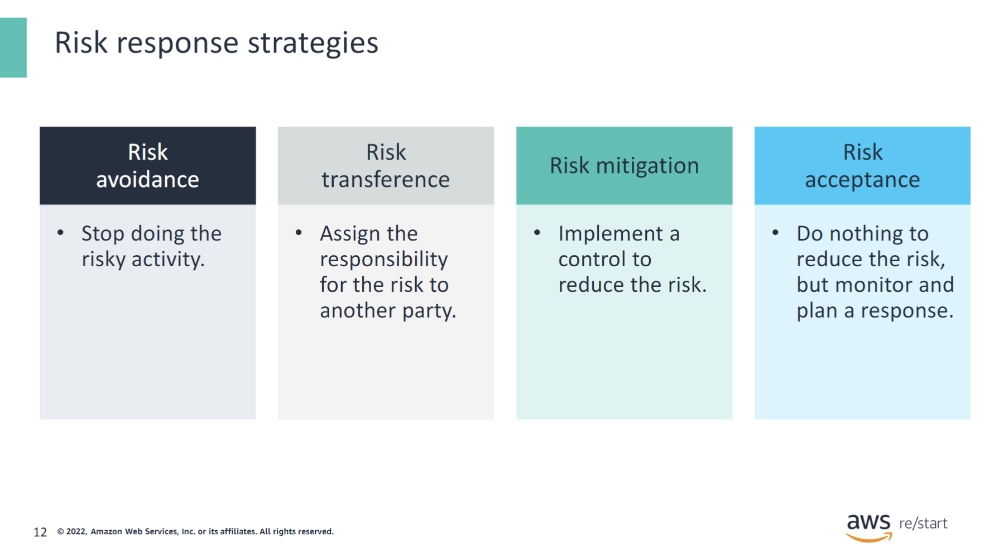

Based on the results of the risk assessment, decide which security response strategy to use for a particular asset or activity.

### Monitoring and logging benefits

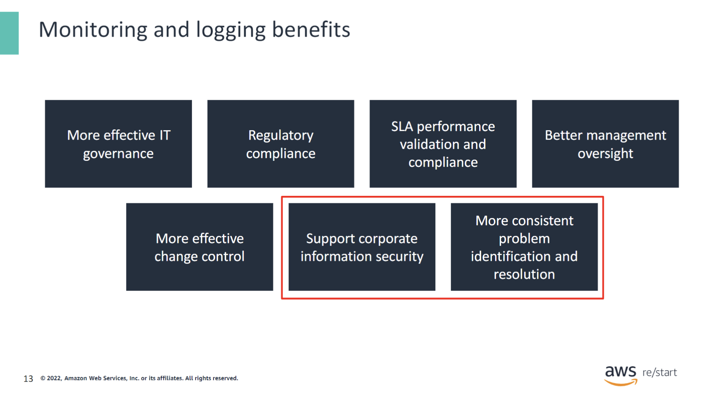

Monitoring and logging also are tools that help in security analysis because they provide the data that is used to identify and resolve security problems. The following are the benefits of monitoring and logging:

- **Governance**: Monitoring and logging can provide an effective way to govern IT.

- **Regulatory Compliance**: Monitoring and logging can aid in ensuring regulatory compliance by adhering to laws, regulations, and specifications relevant to its operations.

- **SLA Performance Validation**: Monitoring and logging can assist service level agreement (SLA) performance validation and help ensure compliance.

- **Management Oversight**: Monitoring and logging can contribute to management oversight and control.

### Monitoring and logging

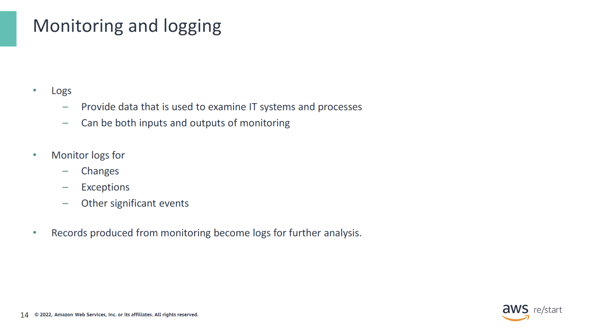

Monitoring and logging complement each other. Log significant events that are monitored in the environment.

### Use metrics

Use metrics to assess and demonstrate the success of your security solution.

## Environment monitoring

### Monitoring

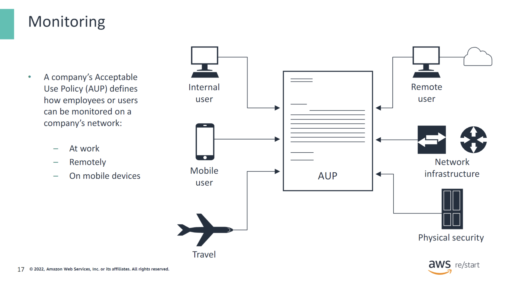

A company can define a set of rules that determinewhat or who is monitored by creating an Acceptable Use Policy (AUP) document.

### Types of monitoring

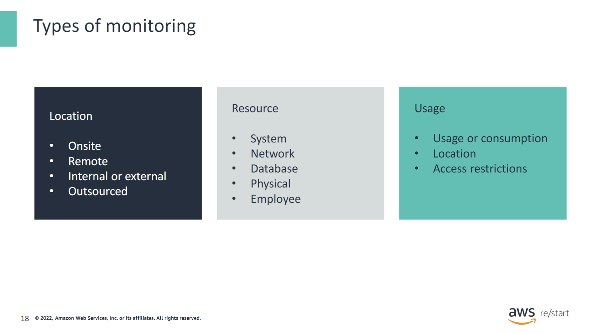

The types of monitoring can vary based on where the monitoring occurs and what type of resource or usage is being monitored.

### AWS monitoring services

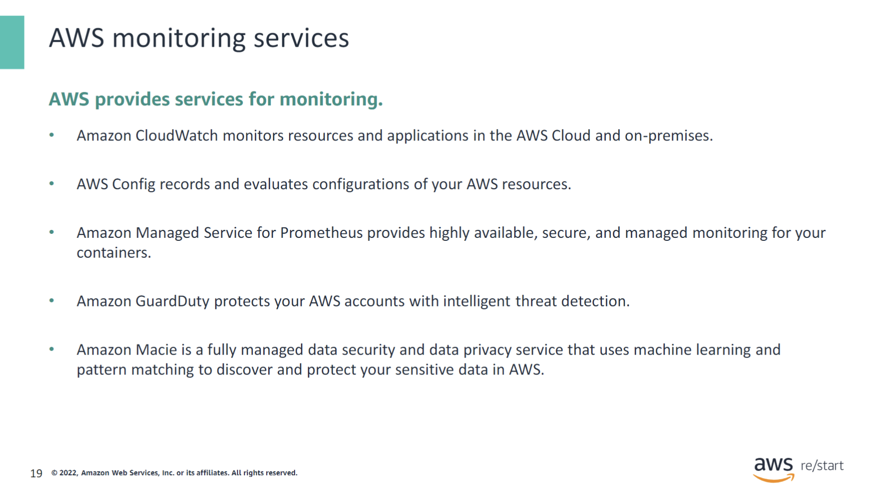

- **Amazon CloudWatch**: A monitoring and observability service built for DevOps engineers, developers, site reliability engineers (SREs), IT managers, and product owners. CloudWatch provides you with data and actionable insights to monitor your applications, respond to system-wide performance changes, and optimize resource utilization.

- **AWS Config**: A service that you can use to assess, audit, and evaluate the configurations of your AWS resources.

- **Amazon Managed Service for Prometheus**: A Prometheus-compatible monitoring and alerting service that makes it easy to monitor containerized applications and infrastructure at scale.

- **Amazon GuardDuty**: A threat detection service that continuously monitors your AWS accounts and workloads for malicious activity. It also delivers detailed security findings for visibility and remediation.

### Monitoring as a service (MaaS)

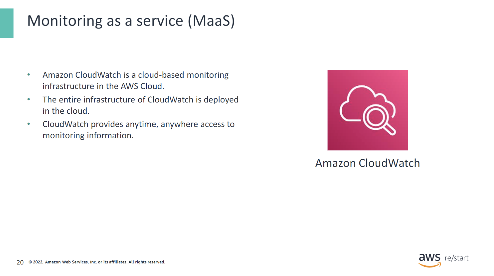

In the AWS Cloud, the Amazon CloudWatch service provides monitoring for AWS Cloud resources and the applications that you run on AWS. CloudWatch Logs is capable of monitoring and storing your logs to help you better understand and operate your systems and applications.

A benefit of monitoring as a service (MaaS) is that these types of services can provide real-time application and system monitoring. For example, CloudWatch Logs can track the number of errors that occur in your application logs. It can then send you a notification whenever the rate of errors exceeds a threshold that you specify.

### Devices that might be monitored

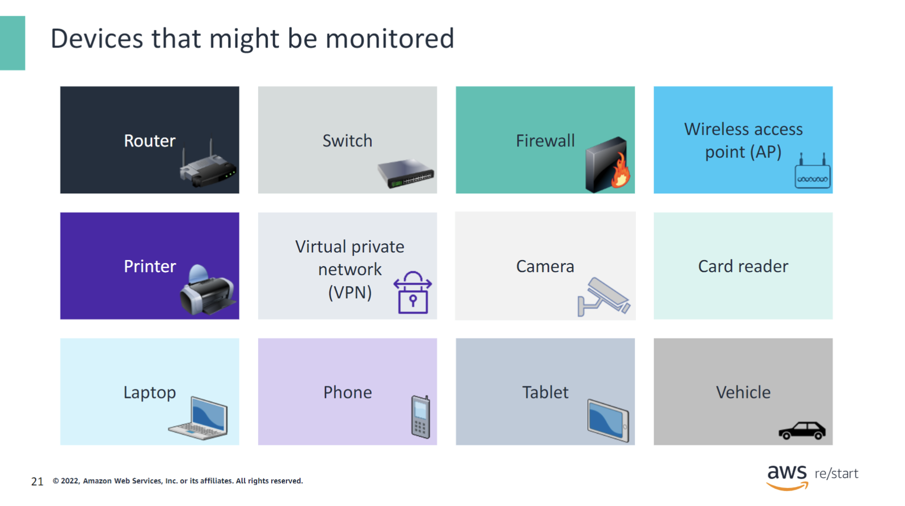

You can monitor almost any type of device that you can connect to a network.

### Monitoring policy

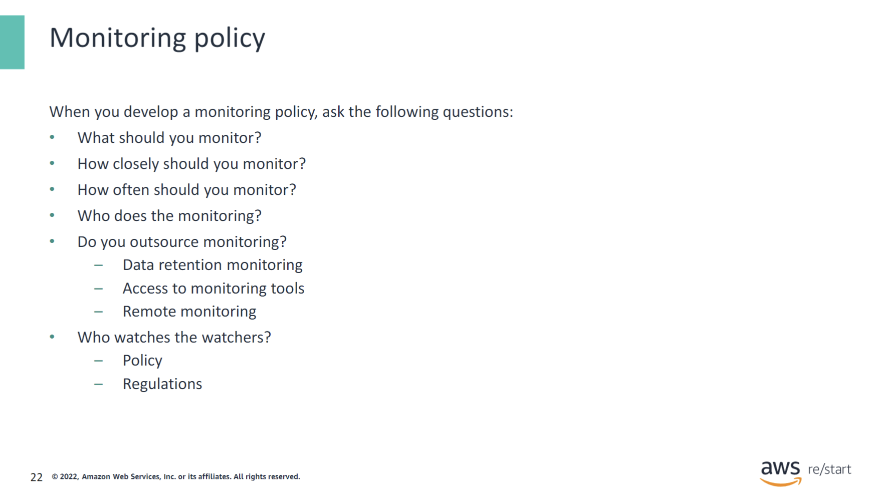

Considerthese factors when you create a monitoring policy.

### Retention policy for monitoring

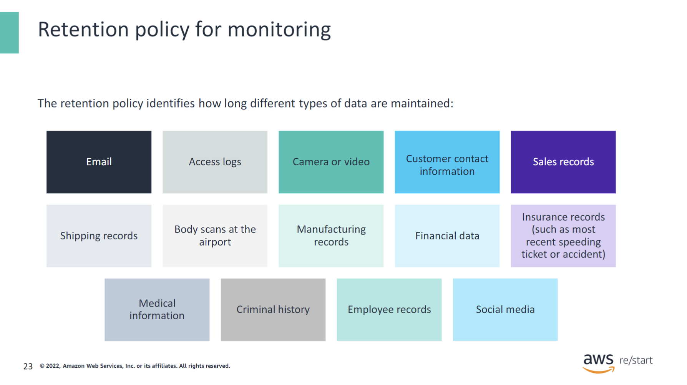

A monitoring policy should also specify how long different types of data are retained.

### Monitoring your data with Amazon Macie

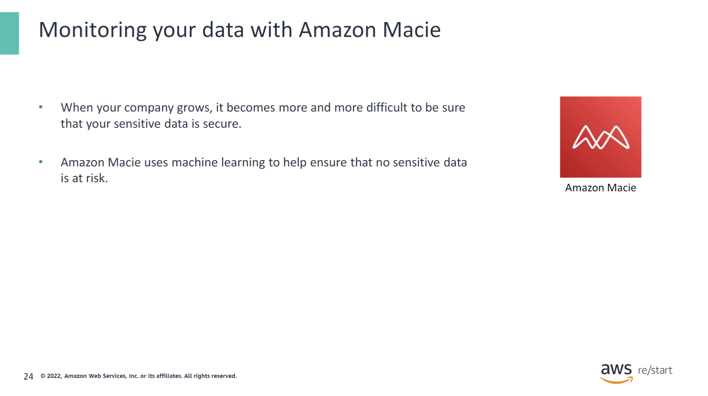

Amazon Macie is a fully managed data security and data privacy service. It uses machine learning and pattern matching to discover and protect your sensitive data in AWS.

As organizations manage growing volumes of data, identifying and protecting their sensitive data at scale can become increasingly complex, expensive, and time-consuming. Amazon Macie automates the discovery of sensitive data at scale and lowers the cost of protecting your data.

## Logging

### Logging policy

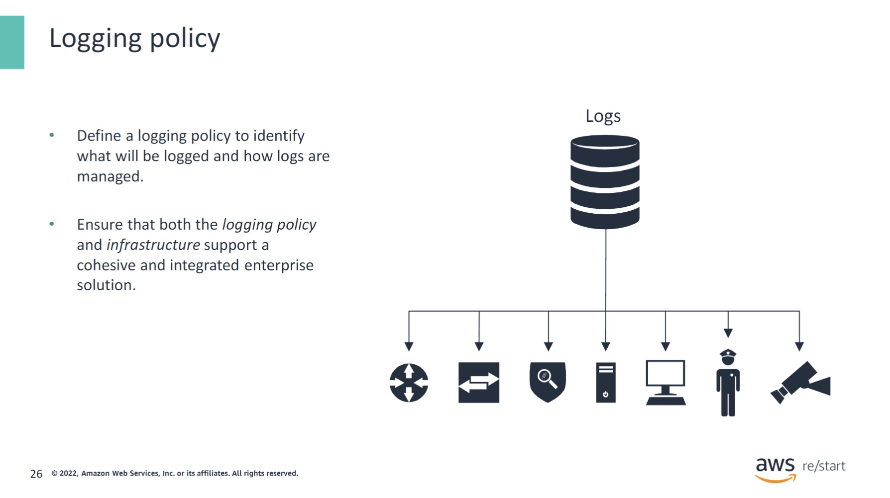

Identify which resources and activities in your enterprise must be logged. Capture this information in a logging policy. Also, define how logs are managed.

### Protection of log information

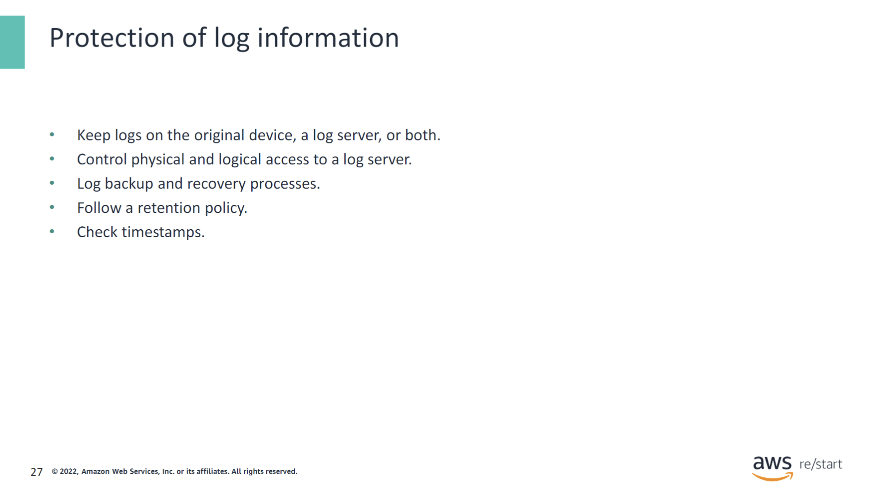

It is important to protect log information from unauthorized access and to back up logs regularly. To ensure that analysis results are correct, keep the clocks on all log servers accurate and synchronized.

### AWS logging services

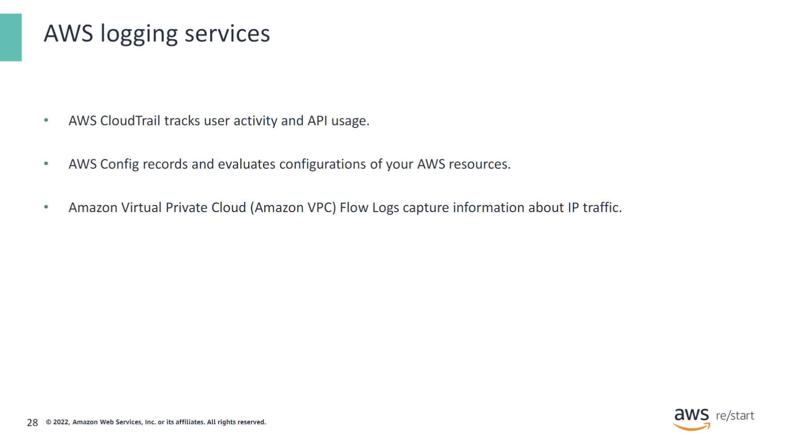

- AWS CloudTrail monitors and records account activity across your AWS infrastructure, which gives you control over storage, analysis, and remediation actions.
- AWS Config is a service that you can use to assess, audit, and evaluate the configurations of your AWS resources
- Amazon Virtual Private Cloud (Amazon VPC) Flow Logs is a feature that you can use to capture information about the IP traffic to and from network interfaces in your VPC.

## Key Takeaways

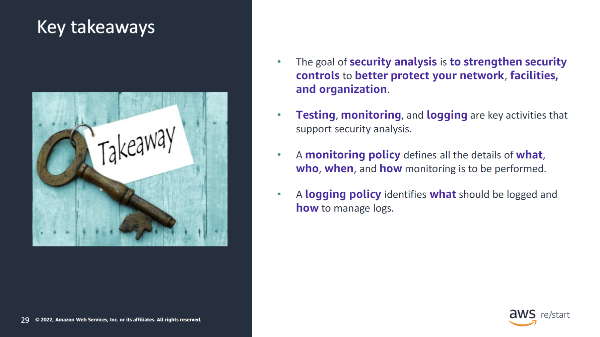

:::tip[This lesson includes the following key takeaways:]

- The goal of security analysis is to strengthen security controls to better protect your network, facilities, and organization.
- Testing, monitoring, and logging are key activities that support security analysis.
- A monitoring policy defines all the details of what, who, when, and how monitoring is to be performed.
- A logging policy identifies what should be logged and how to manage logs.

:::
