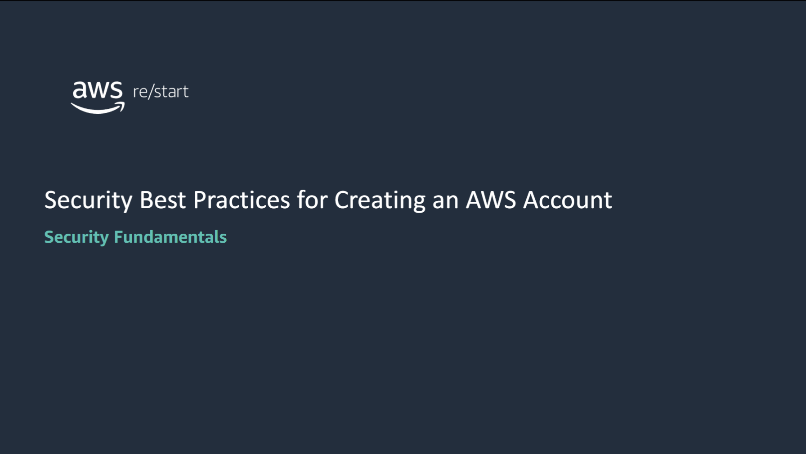
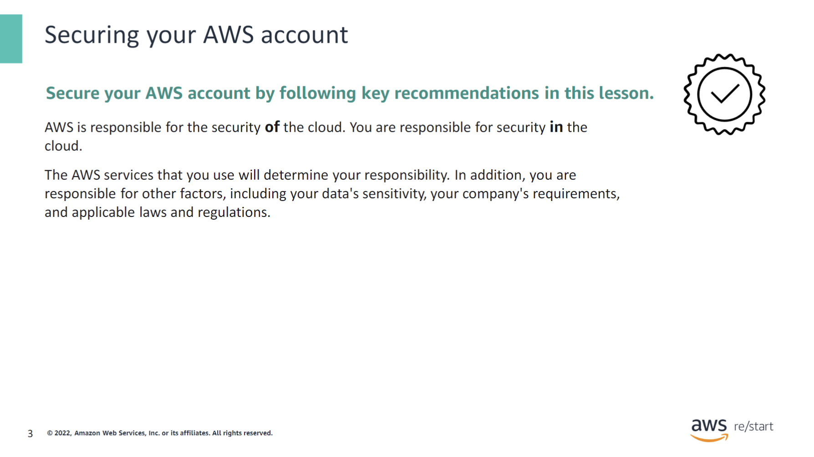
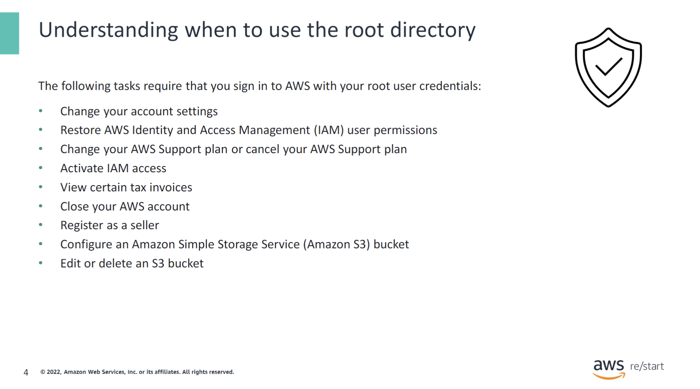
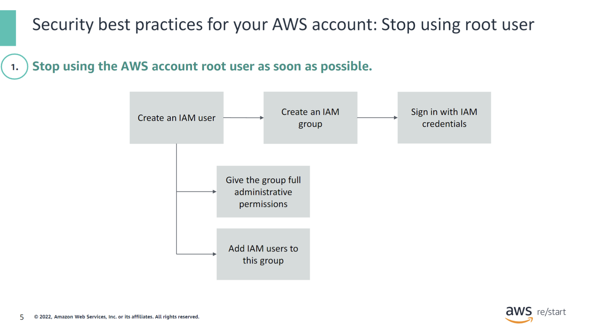
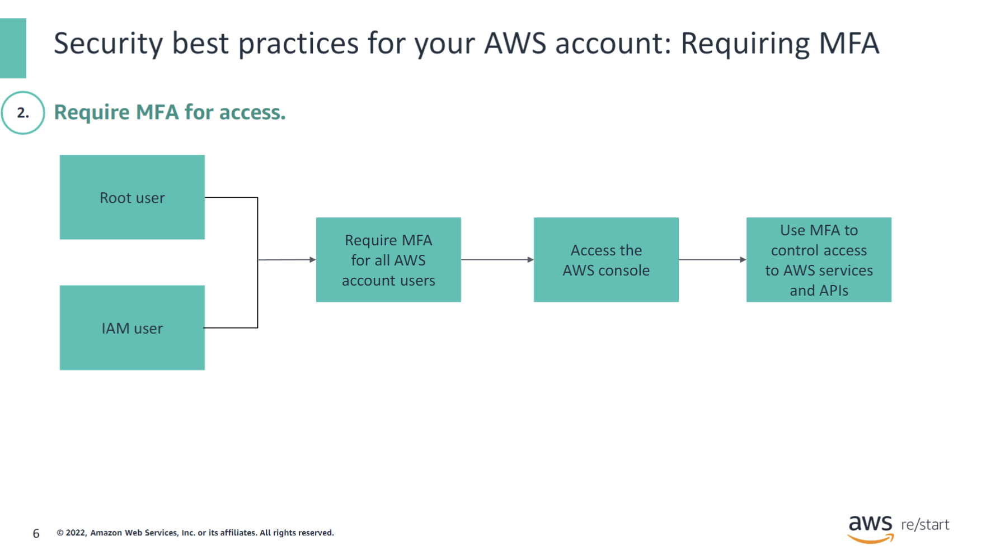
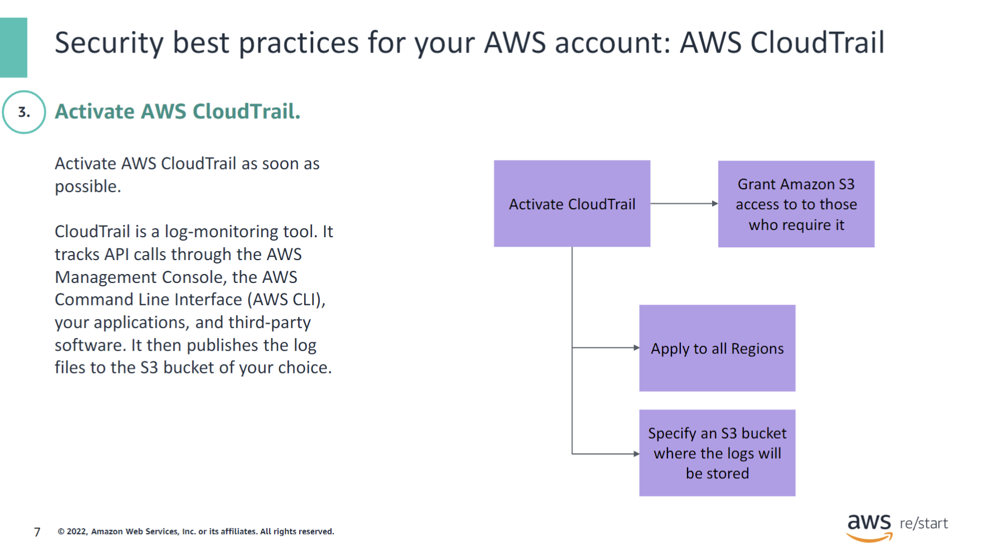
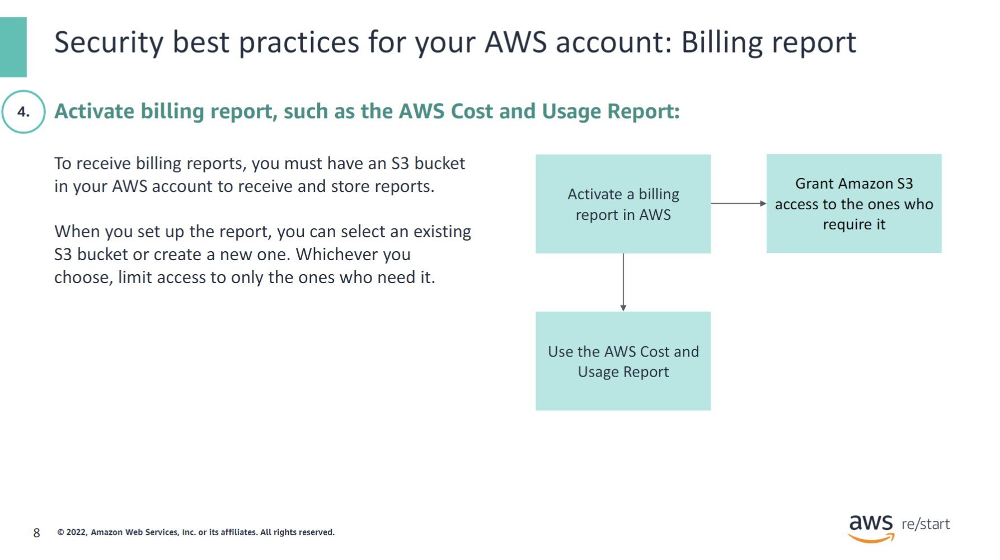
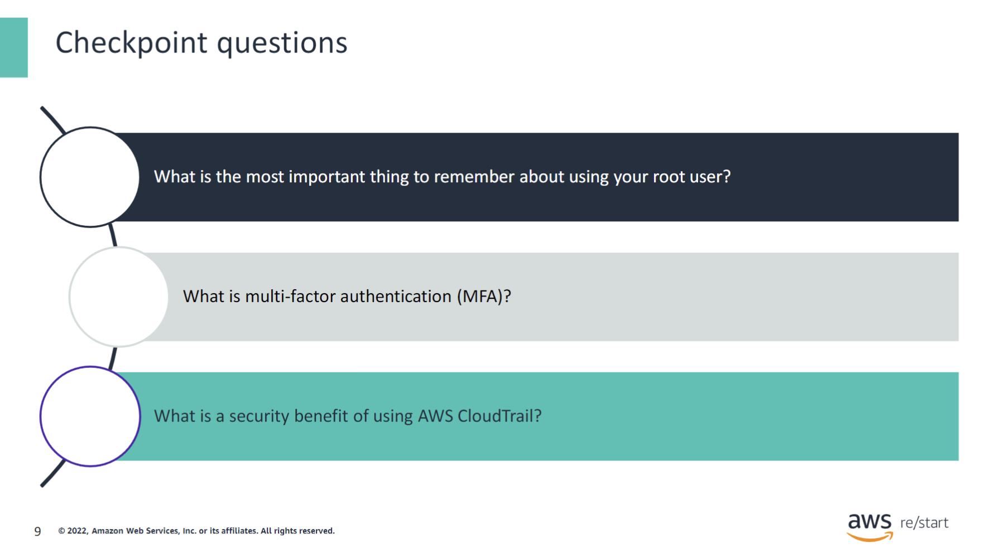
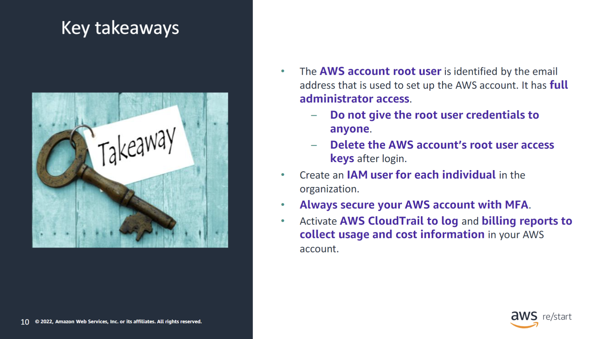

:::tip[In this lesson, you will learn how to:]

- Use best practices when creating an Amazon Web Services (AWS) account

:::

## Securing your AWS account

AWS is responsible for the security *of* the cloud. You are responsible for security *in* the cloud. The AWS service that you use will determine your responsibility. In addition, you are responsible for other factors, including your data's sensitivity, your company's requirements, and applicable laws and regulations.

Customer responsibility varies based on many factors, including the AWS services and Regions that they choose, and the integration of those services into their IT environment. Customers must also know and adhere to the laws and regulations applicable to their organization and workload.

For more information about the AWS Shared Responsibility Model for Cloud Security, see [Shared Responsibility Model](https://aws.amazon.com/compliance/shared-responsibility-model/).

## Understanding when to use the root directory

The root user for the AWS account has access permissions to everything (all AWS services and resources). Therefore, you should protect that access and use it only when necessary. When you first set up your AWS account, you authenticate your root account with the email address that you want associated with your AWS account. Usually, AWS recommends that you use an IAM user account with appropriate permissions to perform tasks and access AWS resources. However, some tasks require root access. Rather than delete your root account, create an IAM user account with the root credentials, and use that account for performing these tasks.

The following tasks do require that you sign in to AWS with your root user credentials:

- **Change your account settings.** These settings include the account name, email address, root user password, and root user access keys. Other account settings, such as contact information, payment currency preference, and Regions, do not require root user credentials.
- **Restore IAM user permissions.** If the only IAM administrator accidentally revokes their own permissions, you can sign in as the root user to edit policies and restore those permissions.
- **Change your AWS Support plan or cancel your AWS Support plan.** For more information, see [“IAM for AWS Support”](https://aws.amazon.com/premiumsupport/iam-access/).
- **Activate IAM access to the Billing and Cost Management console.**
- **View certain tax invoices.** An IAM user with the `aws-portal:ViewBilling` permission can view and download VAT invoices from AWS Europe. However, it cannot access these resources from AWS Inc. or Amazon Internet Services Pvt. Ltd (AISPL).
- **Close your AWS account.**
- **Register as a seller in the Reserved Instance Marketplace.**
- **Configure an S3 bucket to activate multi-factor authentication (MFA).**
- **Edit or delete an Amazon S3 bucket policy that includes an invalid virtual private cloud (VPC) ID or VPC endpoint ID.**

## Security best practices for your AWS account

### Stop using root User

AWS recommends that if you have access keys for your account root user, you remove them as soon as possible. Before you remove the access keys, confirm that they are not being used anywhere in your applications.

Stop using the AWS account root user as soon as possible. To stop using the account root user, take the following steps:

1. **Create an IAM User:**
   - With the account root user, create an IAM user for yourself.

2. **Create an IAM Group:**
   - a) Give the group full administrator permissions.
   - b) Add the IAM user to the group.

3. **Sign in with IAM User Credentials:**
   - Sign in with your IAM user credentials.

4. **Secure Root User Credentials:**
   - Store your account root user credentials in a secure place.

5. **Deactivate and Remove Access Keys:**
   - If you have account root user access keys, deactivate and remove them.

For more information about setting up your first IAM user and administrators group, see [“Creating your first IAM admin user and user group”](https://docs.aws.amazon.com/IAM/latest/UserGuide/getting-started_create-admin-group.html) in the AWS Identity and Access Management User Guide.

### Requiring MFA

Multi-factor authentication (MFA) is an authentication method that requires the user to provide two or more verification factors to gain access to a resource. For example, this resource might be an application, an online account, or a virtual private network (VPN).

MFA is a core component of a strong IAM policy. Rather than asking for only a user name and password, MFA requires one or more additional verification factors, which decreases the likelihood of a successful cyberattack.

For more information about activating and deactivating MFA devices, see [AWS Identity and Access Management](https://aws.amazon.com/iam/).

For more information about forms of MFA, see [“Multi-factor Authentication”](https://aws.amazon.com/iam/features/mfa/?audit=2019q1) in the same online document.

### AWS CloudTrail

Activate AWS CloudTrail as soon as possible after opening your AWS account. CloudTrail is a log-monitoring tool that tracks API calls through the AWS Management Console, the AWS Command Line Interface (AWS CLI), your applications, and third-party software. It then publishes the log files to the S3 bucket of your choice.

CloudTrail includes the following security benefits:

- Creates an ongoing record of all event types that you specify on setup of your trail.
- Creates data logs by Region and for resources.
- Tracks changes and user activity across AWS resources.
- Can create validated logs for forensic and security investigations with the right settings.
- Sends out alerts for specific events.

### Billing report

Billing reports provide information about your usage of AWS resources and estimated costs for that usage. AWS delivers the reports to an S3 bucket that you specify. You can select an existing S3 bucket or create a new one. Whichever you choose, you should limit access to only those who need it.

The AWS Cost and Usage Report tracks your AWS usage. The report provides estimated charges associated with your AWS account by hour or day.

For more information about the AWS Cost and Usage Report, see [“What are AWS Cost and Usage Reports?”](https://docs.aws.amazon.com/cur/latest/userguide/what-is-cur.html) in the Cost and Usage Report User Guide.

## Checkpoint Questions

1. What is the most important thing to remember about using your root account?

AWS strongly recommends that you do not use the root user for your everyday tasks, even the administrative ones. Instead, adhere to the best practice of using the root user only to create your first IAM user. Then, securely lock away the root user credentials and use them to perform only a few account and service management tasks. For more information, see [“AWS account root user”](https://docs.aws.amazon.com/IAM/latest/UserGuide/id_root-user.html).

2. What is multi-factor authentication (MFA)?

MFA is an authentication method that requires the user to provide two or more verification factors to gain access to a resource. For example, such a resource might be an application, an online account, or a VPN. MFA is a core component of a strong identity and access management policy. Rather than asking for only a user name and password, MFA requires one or more additional verification factors, which decreases the likelihood of a successful cyberattack.

3. What is a security benefit of using AWS CloudTrail?

- Creates an ongoing record of all event types that you specify upon setup of your trail
- Creates data logs by Region and for resources
- Tracks changes and user activity across AWS resources
- Can create validated logs for forensic and security investigations with the right settings
- Sends out alerts for specific events

## Key Takeaways

:::tip[The following are key takeaways from this lesson:]

- The AWS account root user is identified by the email address used to set up the AWS account. It has full administrator access.
- Do not give the root user credentials to anyone.
- Delete the AWS account’s root user access keys after login.
- Create an IAM user for each individual in the organization.
- Always secure your AWS account with MFA.
- Activate AWS CloudTrail to log and billing reports to collect usage and cost information in your AWS account.

:::