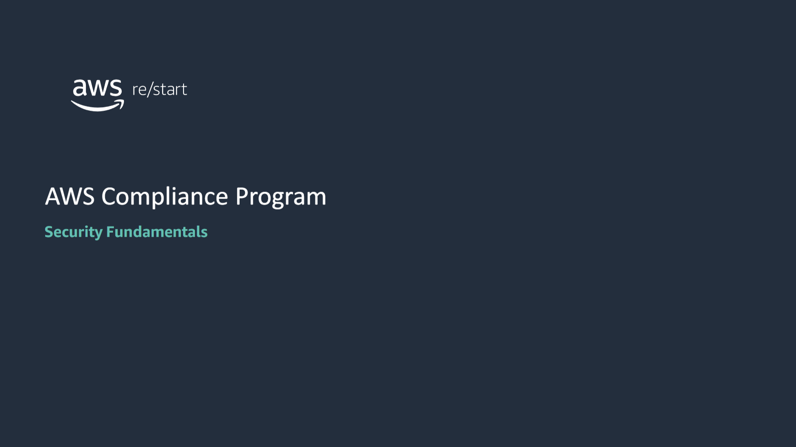

:::tip[In this lesson, you will learn how to:]

- Describe how laws, standards, and regulations impact security
- Identify various regulatory compliance standards
- Describe the AWS compliance program

:::

## Regulatory compliance and standards

### Goal of security compliance

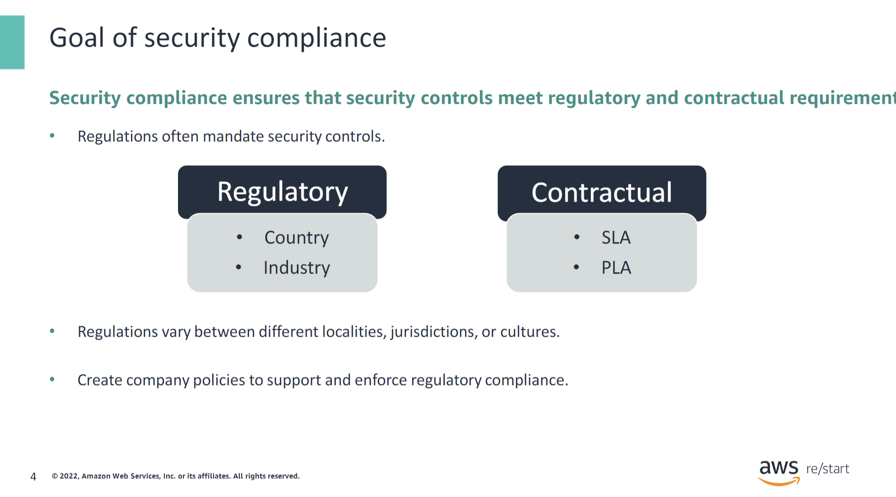

Security compliance ensures that security controls meet regulatory and contractual requirements.

Regulatory requirements can be the following:

- **Country-specific**: For example, most governments have regulations that control the allowed storage location of data related to national security.
- **Industry-specific**: For example, the financial industry has regulations that govern the processing of credit card transactions. The health care industry has regulations to protect the privacy of a patient’s medical records.

Contractual requirements can be in the form of the following:

- **Service level agreement (SLA)**: A contract that defines the quality and performance expectations of the services provided to a customer.
- **Project labor agreement (PLA)**: A contract that defines the source, terms, and conditions of personnel used on a project.

Regulations vary between different localities, jurisdictions, or cultures.

You should establish and enforce company policies to ensure that regulatory requirements are met.

### Compliance levels and noncompliance

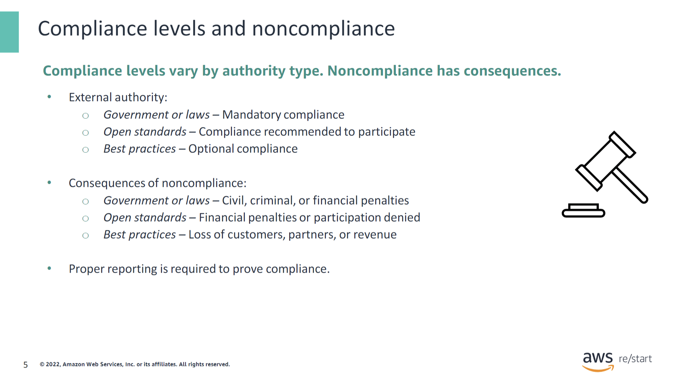

Regulatory and contractual security requirements present different compliance levels. Depending on the authority that issues the requirement, compliance can be mandatory, recommended, or optional. Each level also defines the penalty for noncompliance, which includes financial fees, exclusion from participation, and loss of customers.

The next slides provide examples of regulations based on government and industry requirements. Because they are constantly changing, you should always check with your country’s regulatory agencies for the most up-to-date information.

### National and international cybersecurity standards

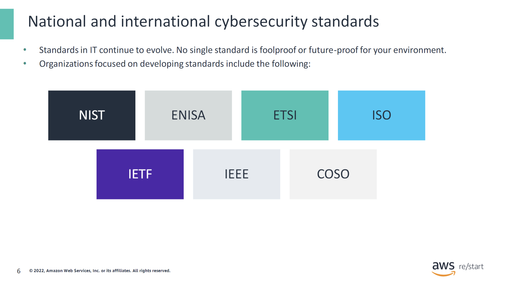

This slide lists some of the organizations focused on developing cybersecurity standards:

- **National Institute of Standards and Technology (NIST)**
- **European Union Agency for Cybersecurity (ENISA)**
- **European Telecommunications Standards Institute (ETSI)**
- **International Organization for Standardization (ISO)**
- **Internet Engineering Task Force (IETF)**
- **Institute of Electrical and Electronics Engineers (IEEE)**
- **Committee of Sponsoring Organizations of the Treadway Commission (COSO)**

### PCI DSS

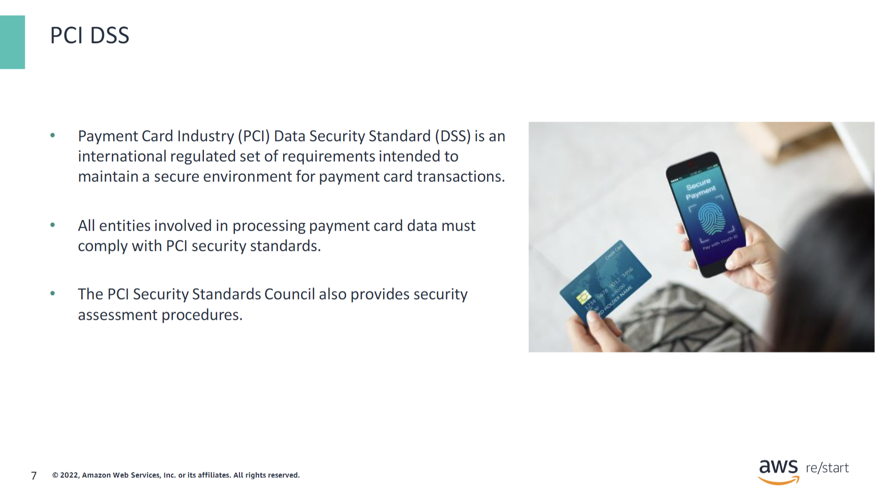

The Payment Card Industry Data Security Standard (PCI DSS) is a regulated set of requirements intended to maintain a secure environment when processing payment card transactions. These transactions include credit card and debit card transactions. The PCI Security Standards Council publishes these requirements, which focus on various aspects of data security. The council also defines procedures to assess the security of payment card transactions.

To ensure security, entities that are involved in processing payment card data must comply with PCI security standards.

For more information about PCI standards, see [https://www.pcisecuritystandards.org/](https://www.pcisecuritystandards.org/).

### HIPAA

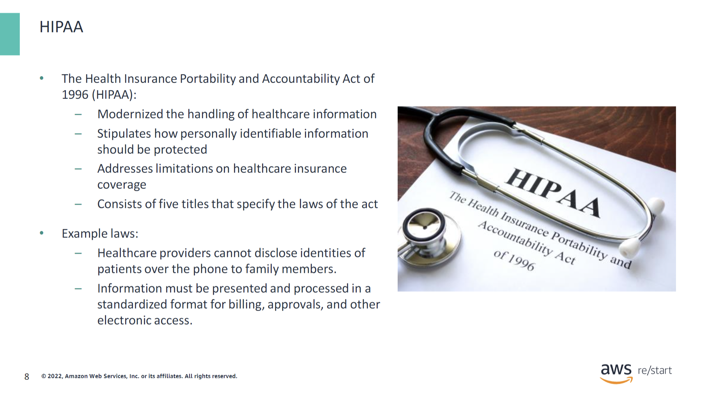

The Health Insurance Portability and Accountability Act (HIPAA) is a US federal law that protects patients’ health information from being disclosed without the patient’s permission. HIPAA was signed into law in 1996 by President Bill Clinton. It is legislation that provides security provisions and data privacy to keep patients’ medical information safe. The act contains five titles:

- **Title I** protects coverage of health insurance for those who have changed or lost their jobs. It prevents group health plans from refusing to cover individuals who have preexisting diseases or conditions and prohibits the plans from setting limits for lifetime coverage.
  
- **Title II** directs the United States Department of Health and Human Services (HHS) to standardize the processing of electronic healthcare transactions nationwide. It requires organizations to implement safe electronic access to patients’ health data to remain in compliance with the privacy regulations that were set by the HHS.
  
- **Title III** relates to provisions that are tax related and general medical care guidelines.
  
- **Title IV** defines a further reform in health insurance, including provisions for those who have preexisting diseases or conditions and individuals who are seeking continued coverage.
  
- **Title V** includes provisions associated with company-owned insurance and treatment of those who lost their citizenship for income tax reasons.

### Compliance standards: European Union

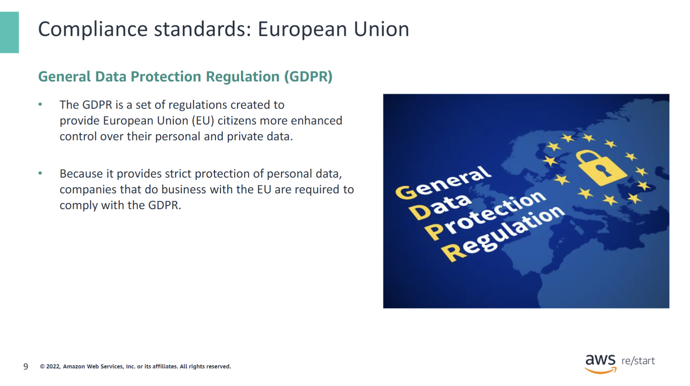

The General Data Protection Regulation (GDPR) is a set of regulations created to provide European Union (EU) citizens with enhanced control over their data privacy and security. GDPR offers a comprehensive approach to protection for EU citizens and establishes accountability principles for compliance.

The GDPR imposes harsh penalties against those who violate privacy and security standards, with some penalties reaching into the tens of millions of euros. The regulations in the GDPR are based on the following principles:

- **Lawfulness, fairness, and transparency**
- **Purpose limitation**
- **Data minimization**
- **Accuracy**
- **Storage limitation**
- **Integrity and confidentiality (security)**
- **Accountability**

### Compliance standards: Canada

The Personal Information Protection and Electronic Documents Act (PIPEDA) is a Canadian law that regulates how the private sector collects, uses, and discloses the personal information of its clients. PIPEDA defines rules and provisions that include the following:

1. **Responsibility for Personal Information**: You are responsible for personal information under your control and must appoint someone to be in charge of your company’s compliance. This person is called the chief privacy officer (CPO).

2. **Limiting Data Collection**: You must limit your collection of personal information to what is needed for the purposes set by your company (for example, analytics or remarketing). You need to ensure that the personal information about your visitors is accurate, complete, and up to date.

3. **Obtaining Consent**: You cannot obtain, use, or disclose personal information without prior consent.

4. **Transparency in Data Collection**: You should clearly communicate the purpose of collecting the data and the ways that you want to process it. You should also disclose what types of data you collect, the third parties that you share it with, and any potential risks for the individual that this process entails. You can provide this information in your privacy policy and while requesting user consent.

5. **Access to Personal Information**: You must inform every interested individual about the collection, use, and disclosure of their personal information and give them access to it. They should also have a chance to review the accuracy and completeness of their data. Finally, they should be able to challenge your organization’s compliance with PIPEDA principles and bring their challenge to your CPO.

6. **Protecting Personal Information**: You must protect personal information using security measures proportional to the sensitivity of the information. In the case of a personal information breach, you need to report it to the Privacy Commissioner of Canada, notify the affected individuals, and keep a record of the breach.

### Compliance standards: Russia

The Russian federal law on personal data was Implemented on July 27, 2006.

Generally, to transfer personal data outside the Russian Federation, the operator must make sure that the personal data will have adequate protection in the destination country.

### Compliance standards: United States

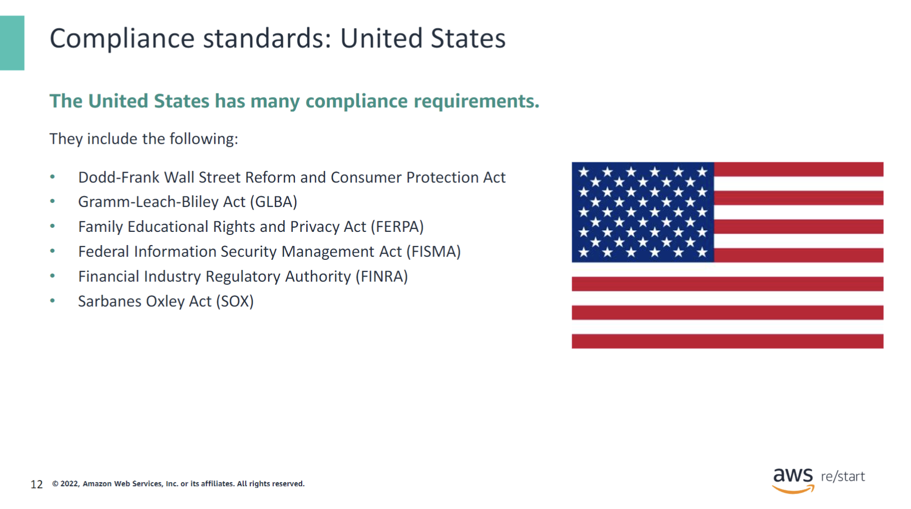

The United States has many compliance standards, including the following:

- **Dodd-Frank Wall Street Reform and Consumer Protection Act**: Includes regulations to prevent financial crises.
- **Gramm-Leach-Bliley Act (GLBA)**: Protects the rights of consumers using financial products and services.
- **Family Educational Rights and Privacy Act (FERPA)**: Protects the privacy of student education records.
- **Federal Information Security Management Act (FISMA)**: Defines laws for information security.
- **Financial Industry Regulatory Authority (FINRA)**: Regulates brokerage firms and exchange markets.
- **Sarbanes-Oxley Act (SOX)**: Defines record-keeping and financial reporting regulations for corporations.

## AWS compliance program

### Compliance in the AWS Cloud security shared responsibility model

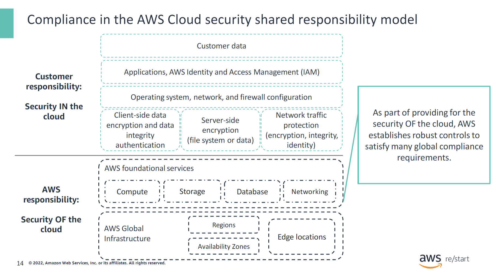

Recall that in the AWS Cloud, security is a shared responsibility between the customer and AWS. AWS is responsible for the security **OF** the cloud, and the customer is responsible for the security **IN** the cloud. Specifically, AWS handles the security of the physical infrastructure that hosts customer resources, and customers are responsible for the security of everything that they put in the cloud.

Similarly, compliance is a shared responsibility between you (the customer) and AWS. To aid your compliance efforts, AWS regularly achieves third-party validation for thousands of global compliance requirements. AWS continually monitors these requirements to help you meet security and compliance standards for finance, retail, healthcare, government, and beyond.

You inherit the latest security controls operated by AWS, strengthening your own compliance and certification programs. You also receive access to tools that you can use to reduce the cost and time to run your own specific security assurance requirements. AWS supports security standards and compliance certifications, including PCI DSS, HIPAA, and GDPR.

The next slides discuss the mechanisms that AWS has implemented to manage risk on the AWS side of the shared responsibility model. They also cover the tools that customers can use to gain assurance that these mechanisms are being implemented effectively.

### AWS risk and compliance program

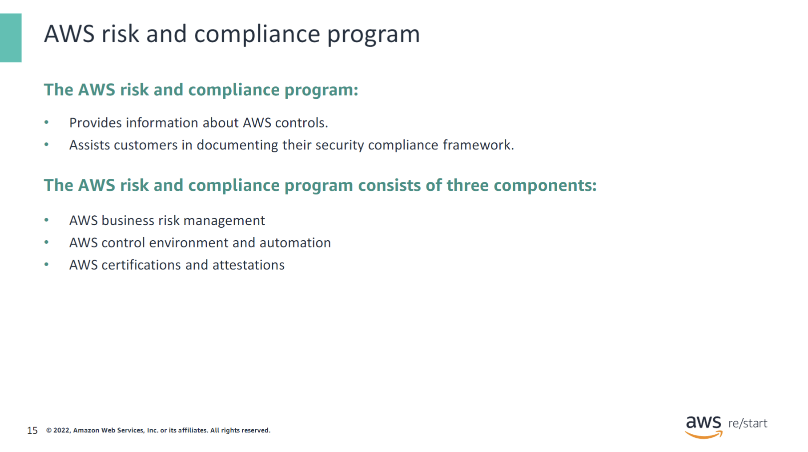

AWS provides information about its risk and compliance program so customers can incorporate AWS controls into their governance framework. This information can assist customers in documenting a complete control and governance framework that has AWS included as an important part of that framework.

The AWS risk and compliance program consists of three components:

- **AWS business risk management**
- **AWS control environment and automation**
- **AWS certifications and attestations**

The next slides explore each of the AWS risk and compliance program components in more detail.

### AWS business risk management

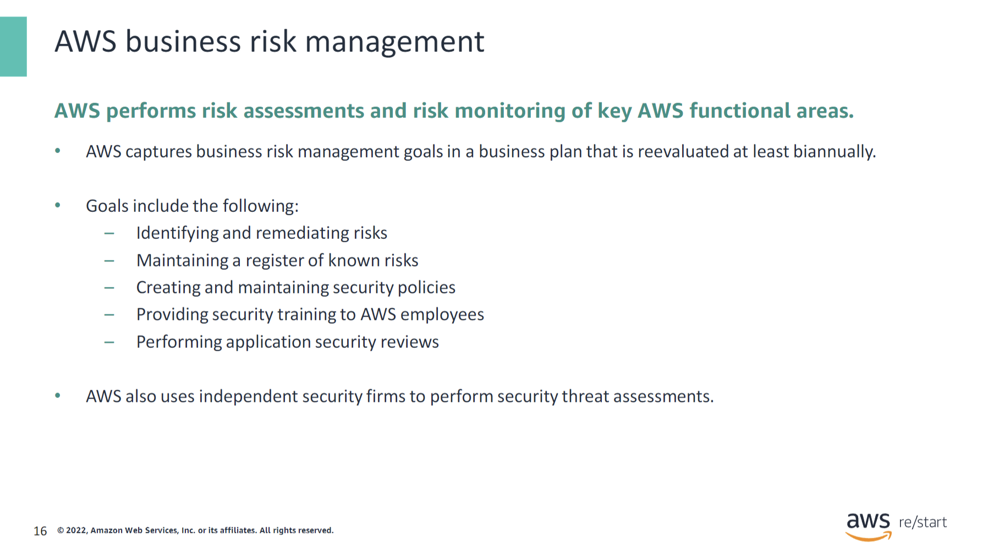

AWS management develops a strategic business plan that includes risk identification and the implementation of controls to mitigate or manage risks. AWS management reevaluates the strategic business plan at least biannually. This process requires management to identify risks within its areas of responsibility and to implement appropriate measures designed to address those risks.

AWS maintains security policies, provides security training to its employees, and performs application security reviews. These reviews assess the confidentiality, integrity, and availability of data in addition to conformance to the information security policy. AWS security regularly scans for vulnerabilities on all public service endpoint IP addresses and notifies the appropriate parties to remediate any identified vulnerabilities.

In addition, independent security firms regularly conduct external vulnerability threat assessments. Findings and recommendations resulting from these assessments are categorized and delivered to AWS leadership. These scans are done to validate the health and viability of the underlying AWS infrastructure. They are not meant to replace the customer’s own vulnerability scans required to meet their specific compliance requirements. Customers can request permission to conduct scans of their cloud infrastructure as long as they are limited to the customer’s instances and do not violate the AWS acceptable use policy.

### AWS control environment and automation

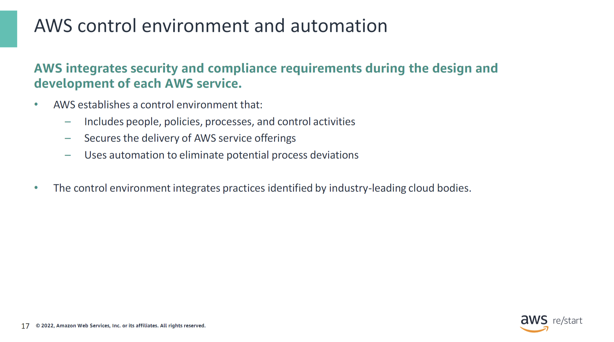

AWS manages a comprehensive control environment that includes policies, processes, and control activities that use various aspects of the Amazon overall control environment. This control environment is in place for the secure delivery of AWS service offerings. The collective control environment encompasses the people, processes, and technology necessary to support the operating effectiveness of the AWS control framework. This environment also uses automation to proactively minimize potential inconsistencies in processes that might arise due to the flawed nature of humans conducting a repetitive process.

AWS integrates applicable cloud-specific controls identified by leading cloud computing industry bodies into the AWS control framework. AWS continues to monitor these industry groups for ideas about which leading practices can be implemented. AWS monitors the groups to assist customers with managing their control environment.

### AWS certifications and attestations

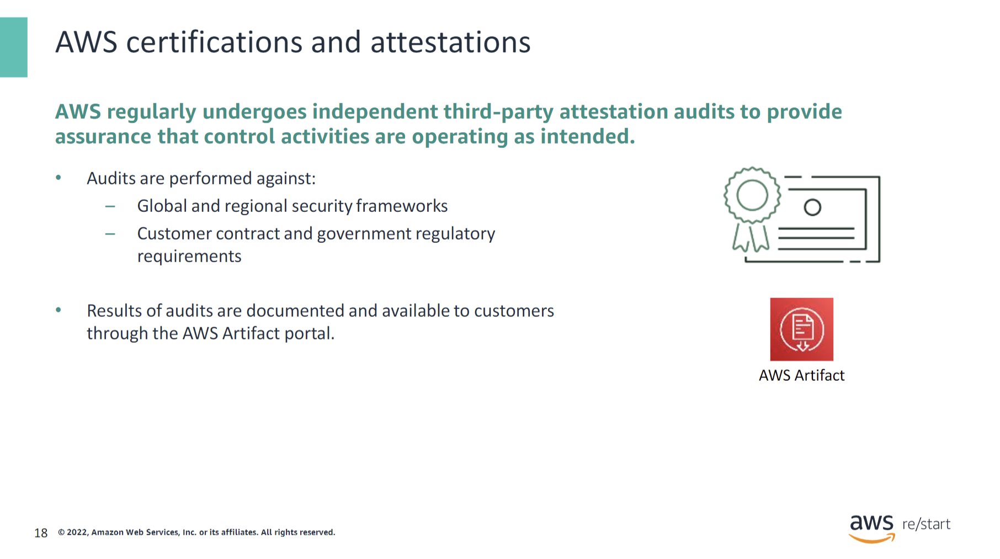

AWS participates in over 50 different audit programs that are based on global and regional security frameworks, or customer contract and government regulatory requirements. AWS also engages with external certifying bodies and independent auditors to provide customers with information about the policies, processes, and controls established and operated by AWS:

- **Certifications and attestations** – Compliance certifications and attestations are assessed by a third-party, independent auditor. They result in a certification, audit report, or attestation of compliance.
- **Laws, regulation, and privacy** – AWS customers remain responsible for complying with applicable compliance laws and regulations. In some cases, AWS offers functionality to support customer compliance. Examples of this functionality include security features, enablers, and legal agreements, such as the AWS Data Processing Agreement and the Business Associate Addendum.
- **Industry alignments and frameworks** – Compliance alignments and frameworks include published security or compliance requirements for a specific purpose, such as a specific industry or function. AWS provides functionality, such as security features, and also offers compliance playbooks, mapping documents, and technical papers for these types of programs.

AWS communicates information about its relevant security and control environment to customers in various ways, including the following:

- Technical papers and website content
- Certificates, reports, and other documentation provided directly to AWS customers under nondisclosure agreements (NDAs) as required
- **AWS Artifact portal** – This portal provides on-demand access to AWS compliance reports. For more information about the AWS Artifact portal, see [https://aws.amazon.com/artifact/](https://aws.amazon.com/artifact/).

### Customer compliance responsibilities

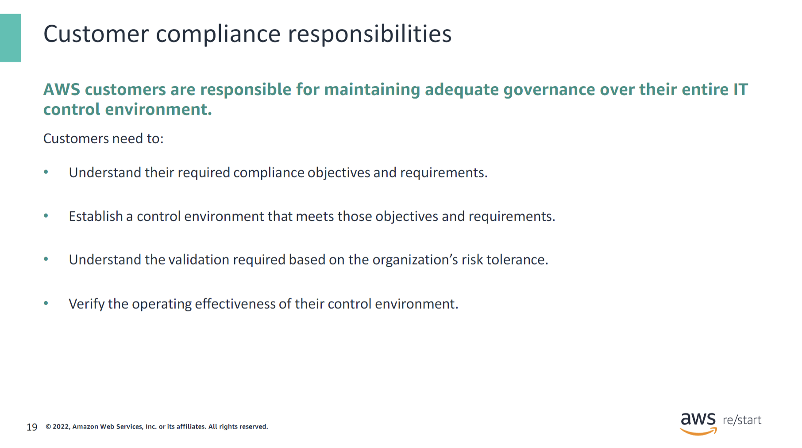

AWS customers must maintain adequate governance over the entire IT control environment, regardless of how IT is deployed. Leading practices include developing an understanding of required compliance objectives and requirements (from relevant sources) and establishing a control environment that meets those objectives and requirements. These practices also include developing an understanding of the validation required based on the organization’s risk tolerance and verifying the operating effectiveness of their control environment.

Deployment in the AWS Cloud gives enterprises different options to apply various types of controls and various verification methods. Strong customer compliance and governance might include the following basic approach:

- **Review AWS information** together with other information to understand as much of the entire IT environment as possible. Then document all compliance requirements.
- **Design and implement control objectives** to meet the enterprise compliance requirements.
- **Identify and document controls** owned by outside parties.
- **Verify** that all control objectives are met and all key controls are designed and operating effectively.

By staying engaged in the compliance and governance process with AWS, customers can ensure that they meet compliance requirements.

## Checkpoint Questions

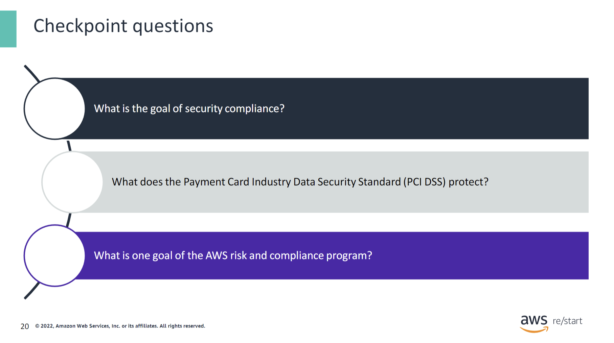

What is the goal of security compliance?

Security compliance ensures that security controls meet regulatory and contractual requirements.

What does the Payment Card Industry Data Security Standard (PCI DSS) protect?

The PCI DSS protects payment card transactions.

What is one goal of the AWS risk and compliance program?

One goal of the AWS risk and compliance program is to provide information about AWS security controls.

## Key takeaways

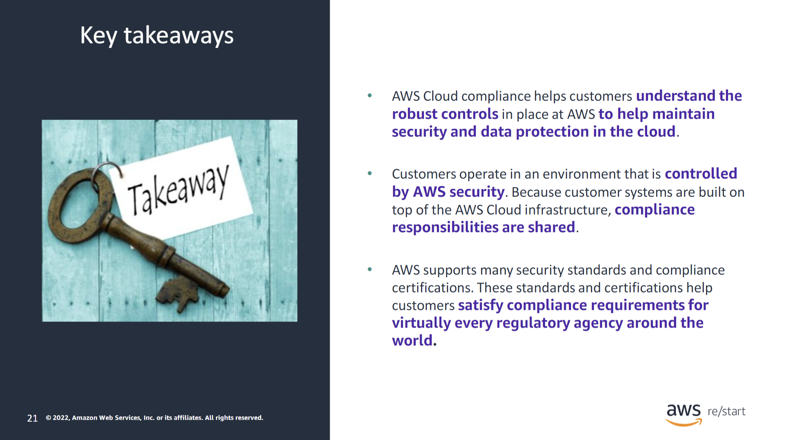

:::tip[This module includes the following key takeaways:]

- **AWS Cloud compliance** helps customers understand the robust controls in place at AWS to help maintain security and data protection in the cloud.
- Customers operate in an environment that is controlled by AWS security. Because customer systems are built on top of the AWS Cloud infrastructure, compliance responsibilities are shared.
- AWS supports many **security standards and compliance certifications**. These standards and certifications help customers satisfy compliance requirements for most regulatory agencies around the world.

:::
