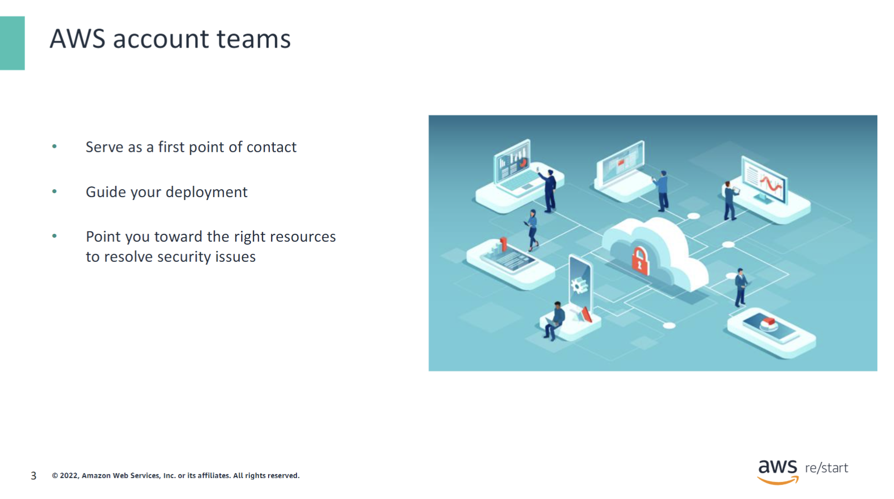
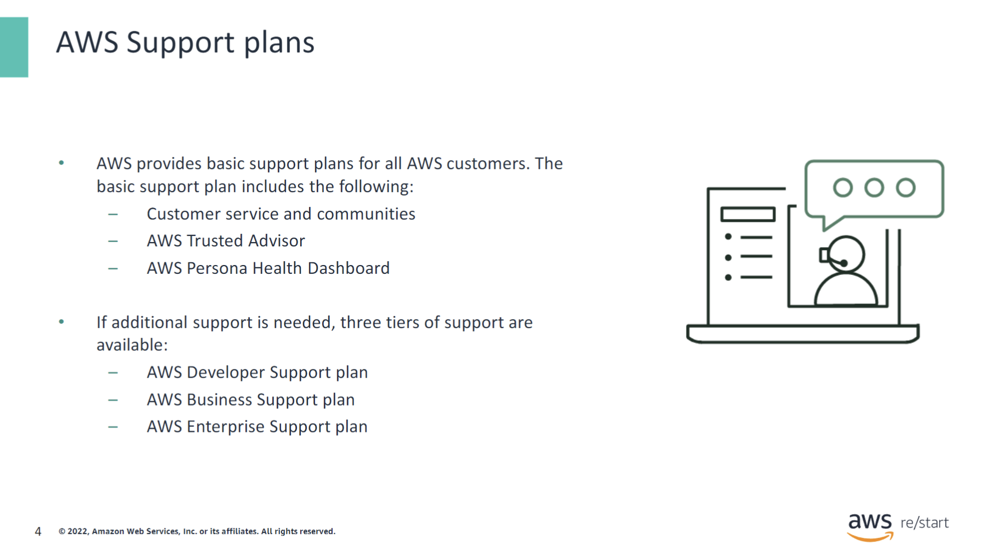
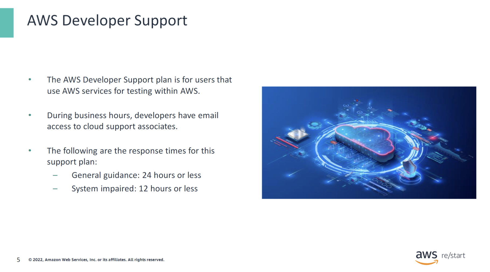
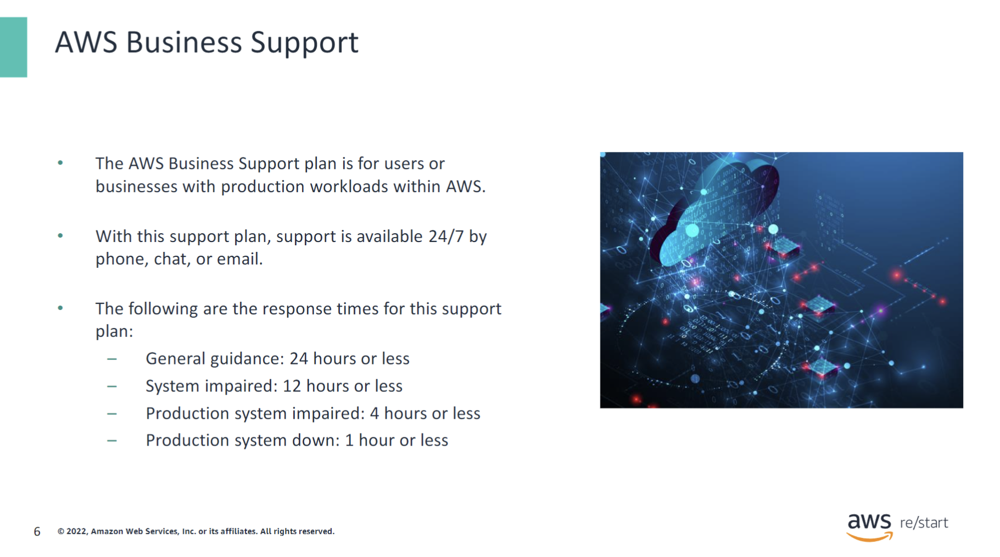
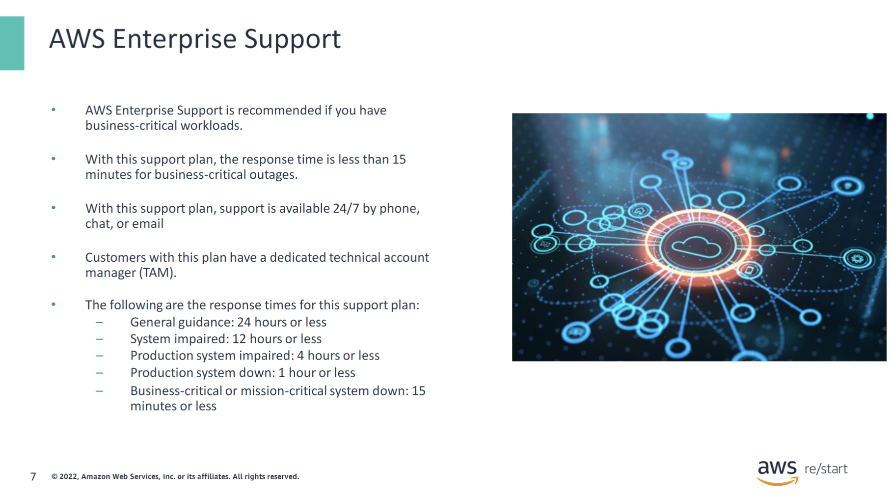
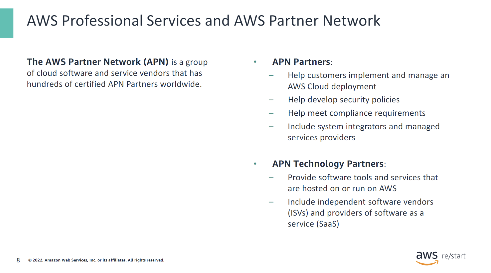
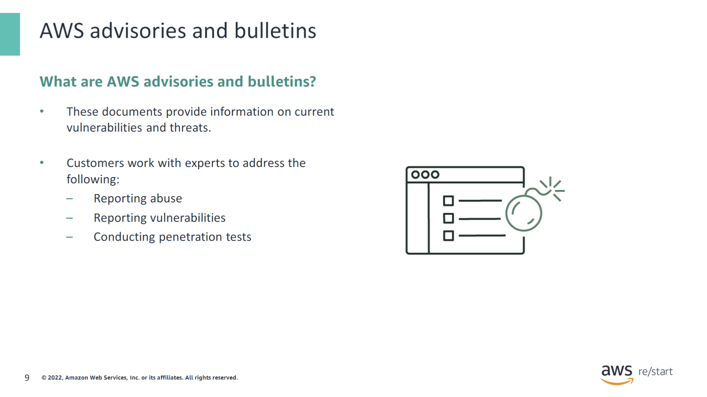
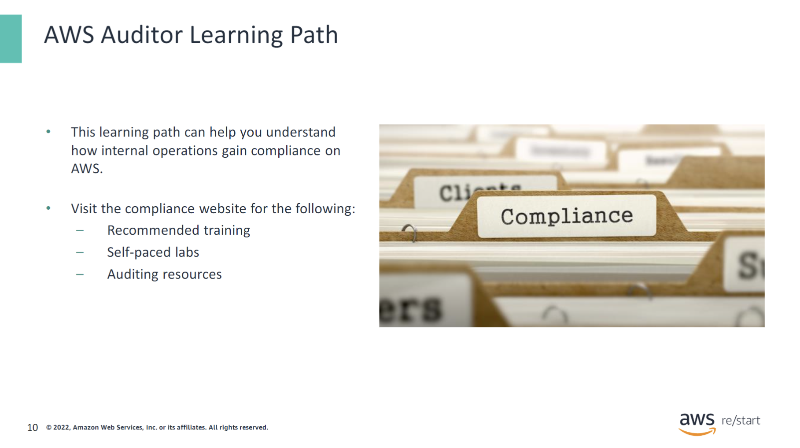
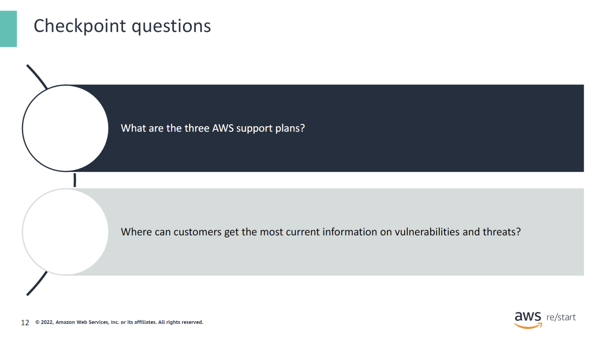
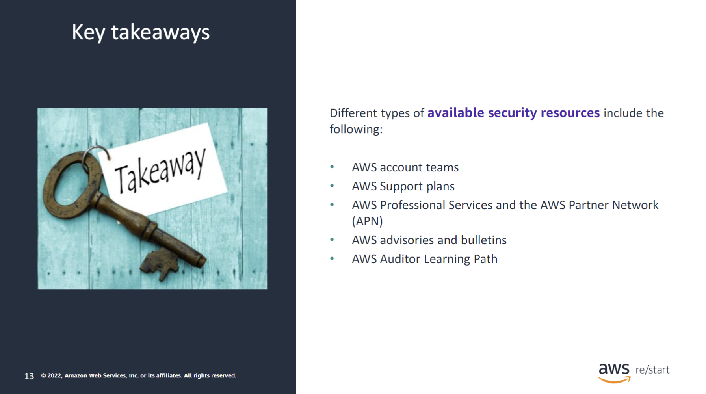

:::tip[What you will learn:]

As a previous module mentioned, Amazon Web Services (AWS) communicates its security and control environment, which is relevant to customers, in the following ways:

- Doing industry certifications and independent third-party attestations
- Providing information about AWS security and control practices in whitepapers and web content
- Providing certificates, reports, and other documentation directly to AWS customers under a nondisclosure agreement (NDA)

In this module, you take a closer look at how AWS provides customers with guidance and expertise. AWS offers this help through online tools, resources, support, and professional services to help customers secure their data in the cloud.

:::

## AWS account teams

AWS account teams serve as a first point of contact to help guide you through your deployment and implementation. These teams point you toward the right resources to resolve security issues that you might encounter.

## AWS Support plans

All support plans provide basic support. However, they are not all the same:

- **AWS Developer Support** provides a support plan for users that use AWS services for experimentation and testing purposes.
- **AWS Business Support** provides a support plan for users or businesses that use AWS services for production workloads.
- **AWS Enterprise Support** provides a response time of less than 15 minutes when a business-critical system is down. Support from cloud support engineers is available 24/7 by phone, chat, or email.

For more information, see [AWS Support Plans](https://aws.amazon.com/premiumsupport/plans/).

## AWS Developer Support

**AWS Developer Support** provides a support plan for users that use AWS services for experimentation and testing purposes. Support is available during business hours, and developers have email access to cloud support associates. The response time for general guidance is 24 hours or less. For system-impaired guidance, the response time is 12 hours or less.

For more information, see [AWS Developer Support](https://aws.amazon.com/premiumsupport/plans/).

## AWS Business Support

**AWS Business Support** provides a support plan for users or businesses that use AWS services for production workloads within AWS. Support from cloud support engineers is available 24/7 by phone, chat, or email. The following are the response times for this support plan:

- **General guidance**: 24 hours or less
- **System impaired**: 12 hours or less
- **Production system impaired**: 4 hours or less
- **Production system down**: 1 hour or less

For more information, see [AWS Business Support](https://aws.amazon.com/premiumsupport/plans/).

## AWS Enterprise Support

**AWS Enterprise Support** provides a response time of less than 15 minutes when a business-critical system is down. Support from cloud support engineers is available 24/7 by phone, chat, or email. This support plan also provides customers with a dedicated technical account manager (TAM). This concierge service helps ensure that customer issues are addressed as swiftly as possible.

The following are the response times for this support plan:

- **General guidance**: 24 hours or less
- **System impaired**: 12 hours or less
- **Production system impaired**: 4 hours or less
- **Production system down**: 1 hour or less
- **Business-critical or mission-critical system down**: 15 minutes or less

For more information, see [AWS Enterprise Support](https://aws.amazon.com/premiumsupport/plans/).

## AWS Professional Services and AWS Partner Network

The AWS Partner Network (APN) is a group of cloud software and service vendors. This network includes hundreds of certified APN Partners worldwide who can assist customers with their security and compliance needs.

AWS Professional Services and APN both help customers develop security policies and procedures based on well-proven designs. They help to ensure that the customer’s security design meets internal and external compliance requirements.

## AWS advisories and bulletins

With AWS advisories and bulletins, AWS provides advisories around current vulnerabilities and threats. Customers can work with AWS security experts to address concerns such as reporting abuse, reporting vulnerabilities, and conducting penetration tests.

For an example of a security bulletin, see [AWS Security Bulletins](https://aws.amazon.com/security/security-bulletins/?card-body.sort-by=item.additionalFields.bulletinId&card-body.sort-order=desc&awsf.bulletins-flag=*all&awsf.bulletins-year=*all).

For an example of a reported security issue, see [AWS-2022-002](https://aws.amazon.com/security/security-bulletins/AWS-2022-002/).

## AWS Auditor Learning Path

If you are in an auditing, compliance, or legal role, check out the AWS Auditor Learning Path. It can help you gain a better understanding of how your internal operations can demonstrate compliance by using AWS.

For more information about recommended training, self-paced labs, and auditing resources, see the compliance website at [AWS Compliance Resources](https://aws.amazon.com/compliance/resources/).

For more information about the Cloud Audit Academy learning path, see [AWS Auditor Learning Path](https://aws.amazon.com/compliance/auditor-learning-path/).

## AWS security benefits

AWS security offers one of the most secure and flexible cloud computing environments today. Therefore, it is the only commercial cloud service that has its services vetted and approved for top-secret workloads. AWS security has the following benefits:

- **Securely scale your infrastructure** – You can control where your data is stored, how it's stored, and who has access to it. For example, resources can be stored through Amazon Simple Storage Service (Amazon S3) or Amazon S3 Glacier, and the process can be controlled and automated. You can use AWS Identity and Access Management (IAM) users and policies to control access to these storage services.

- **Automate security services** – Automation is integrated into many services within AWS and can decrease the risk of human errors. AWS security focuses on the following:
  - **Prevent** – Prevent issues by defining user permissions and identities using services such as IAM.
  - **Detect** – Use logging and monitoring services such as Amazon CloudWatch and AWS CloudTrail.
  - **Respond** – Create an automated response from your security team or program.
  - **Remediate** – Use automation and real-time data to remediate and fix the issue.

For more information, see [AWS Security](https://aws.amazon.com/security/).

## Checkpoint Questions

What are the three AWS support plans?

- AWS Developer Support
- AWS Business Support
- AWS Enterprise Support

Where can customers get the most current information on vulnerabilities and threats?

- AWS advisories and bulletins

## Key Takeaways

:::tip[As a key takeaway from this lesson...]

...remember that different types of available security resources include the following:

- AWS account teams•AWS Support plans
- AWS Professional Services and the AWS Partner Network (APN)•AWS advisories and bulletins
- AWS Auditor Learning Path

:::
