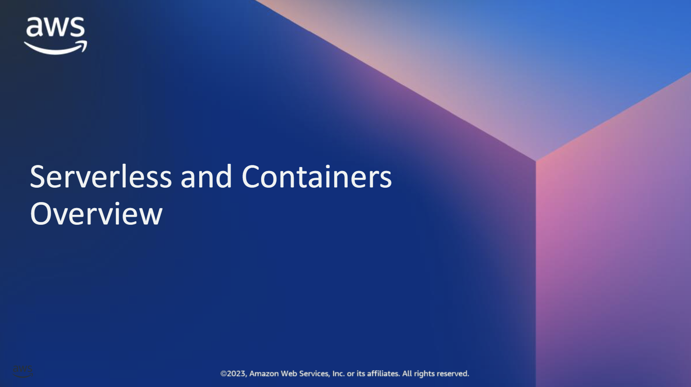
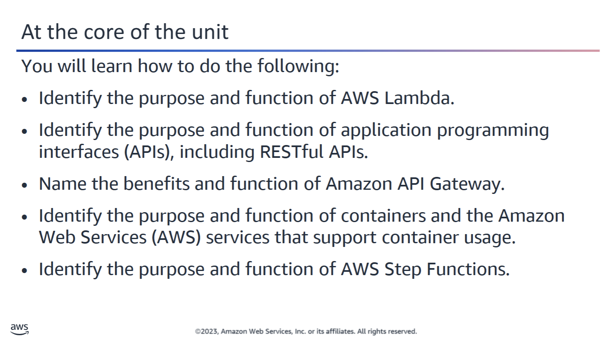
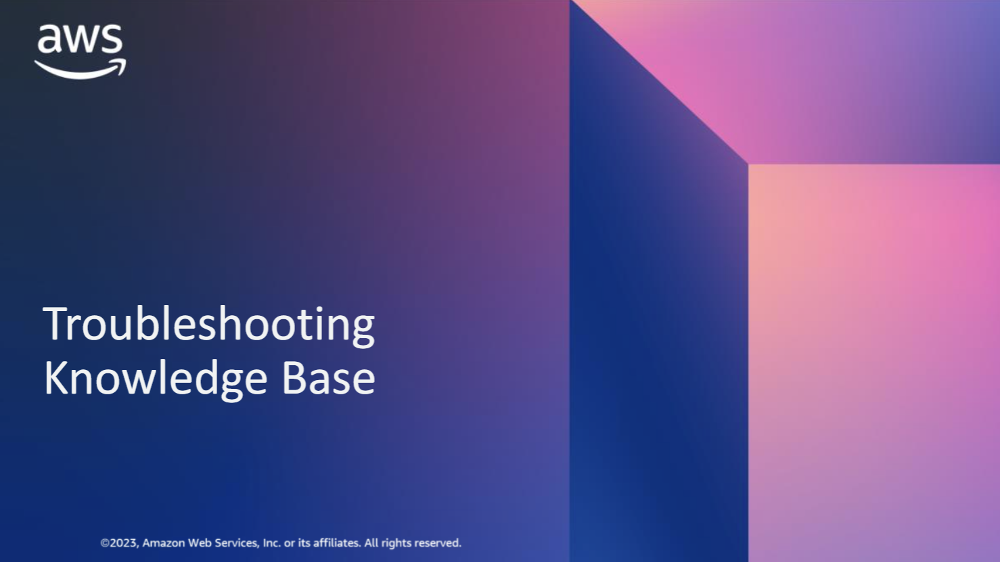
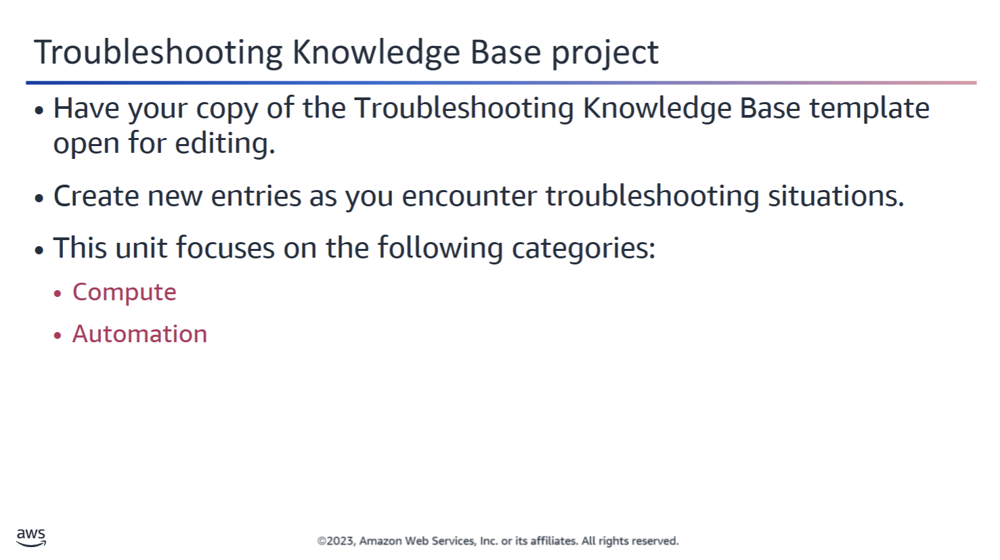

Be ready to create some entries in your Troubleshooting Knowledge Base document based on the Serverless and Containers topics. For these topics add entries in the Compute and Automation categories of your knowledge base.

