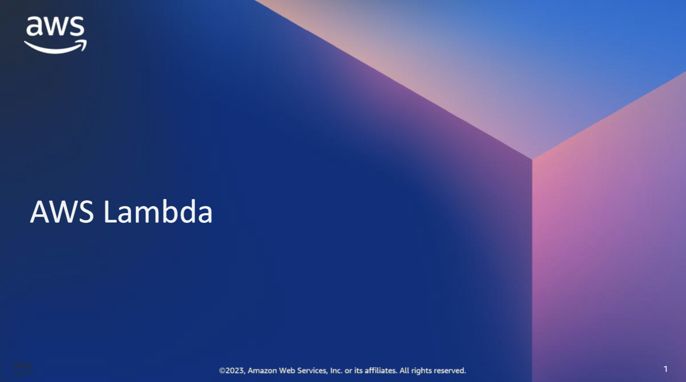

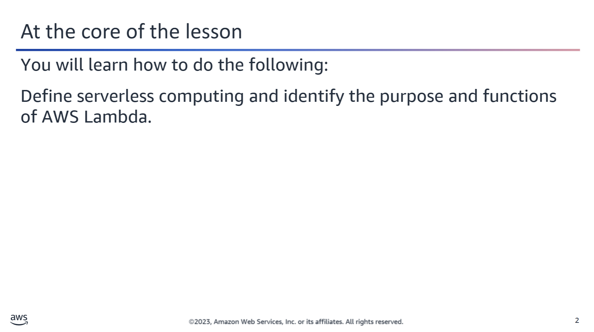

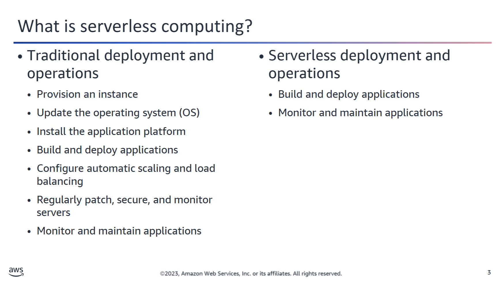

## ☁️ AWS Compute Options Overview

Amazon Web Services (AWS) offers several compute options to suit different application needs:

### 1️⃣ Amazon EC2 (Elastic Compute Cloud)
Provides **virtual machines** that you can configure, launch, and manage.  
Ideal for full control over the operating system and environment.

### 2️⃣ Amazon ECS (Elastic Container Service)
A **container orchestration** service that makes it easy to run and manage Docker containers on a cluster of Amazon EC2 instances or with AWS Fargate.

---

### 3️⃣ Serverless Computing
A **third approach** to compute that allows you to build and run applications **without provisioning or managing servers**.

#### Benefits of Serverless:
- No server provisioning or management
- Automatic scaling
- Built-in high availability
- You pay only for actual usage (not idle time)

With serverless computing, developers can focus solely on their application code, while AWS handles the infrastructure.

✅ **Serverless applications do not require you to provision, scale, or manage any servers.**

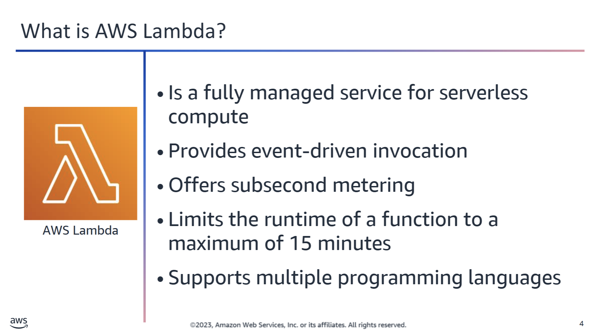

## 🧠 Introduction to AWS Lambda (Serverless Computing)

**AWS Lambda** provides serverless computing through a fully managed service that allows you to run code without provisioning or managing servers.

### 🚀 Key Features:
- **Minimal Administration**: Upload your code, and Lambda handles all the infrastructure, scaling, and availability.
- **Event-Driven Execution**: Your code runs **only when needed**, and **automatically scales** to thousands of requests per second.
- **Flexible Invocation**:
  - Trigger functions from **other AWS services** (e.g., S3, DynamoDB, API Gateway).
  - Invoke **directly from web or mobile apps**.
- **Short-Lived Execution**: Each function has a **maximum runtime of 15 minutes**.
- **No New Languages Needed**: Use your preferred language and familiar tools.

### ✅ Supported Languages:
- **Java**
- **Node.js**
- **C# (.NET Core)**
- **Python**
- **Ruby**
- **Go**
- **PowerShell**

### 🧰 Tooling:
- Use **any third-party library**, including **native binaries**.
- Compatible with **CI/CD pipelines**, **IaC tools** (e.g., CloudFormation, Terraform), and **API integrations**.

Lambda is ideal for building backend services, automation scripts, real-time data processing, API backends, and more—all with **high availability and fault tolerance by design**.

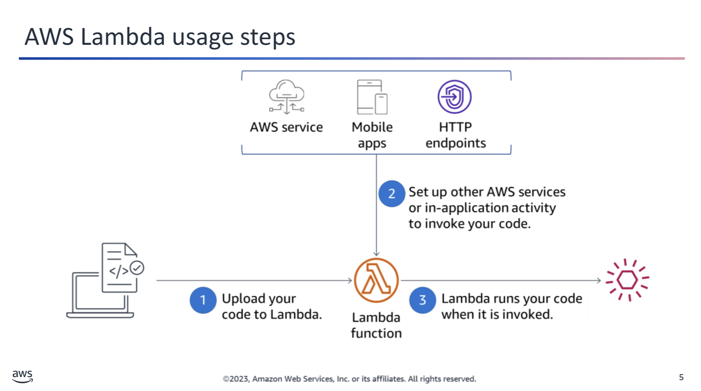

## 🧠 AWS Lambda: Run Code Without Managing Servers

With **AWS Lambda**, you can run code without provisioning or managing servers.

### ✅ Steps to Use Lambda:

1. **Upload your code** to Lambda  
   Lambda handles all the infrastructure required to run and scale your code with high availability.

2. **Set up invocation**  
   - Automatically from other AWS services  
   - Directly from any web or mobile app  
   - Via an HTTP endpoint

3. **Pay only for what you use**  
   - Lambda runs your code **only when it's invoked**  
   - You pay **only for the compute time** used  
   - **No cost when your code is not running**

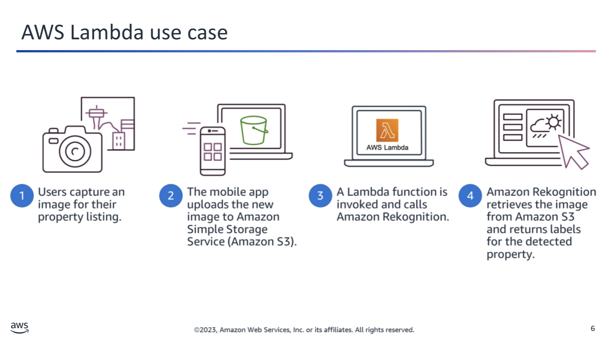

## 📷 Lambda Use Case: Image Processing with Amazon Rekognition

### 🧪 Use Case Example:
An app lets users upload property images. Here's how AWS services interact:

1. 📱 **User uploads an image** via a mobile app.
2. ☁️ **Amazon S3** stores the image.
3. ⚙️ **S3 triggers a Lambda function.**
4. 🧠 **Lambda calls Amazon Rekognition**, which:
   - Retrieves the image from S3
   - Returns **labels** for objects, people, text, scenes, or activities

### 🛠️ Other Lambda Use Cases:
- 🔁 Automated backups
- 🗂️ Processing S3 object uploads
- 📊 Event-driven log analysis
- 🔄 Event-driven data transformations
- 🌐 IoT processing
- 🕸️ Serverless website backends

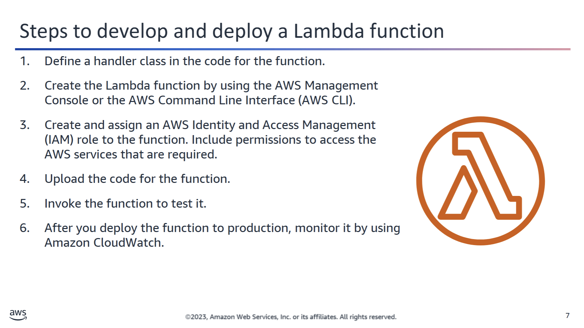

## 🚀 Developing and Deploying an AWS Lambda Function

### 🧭 Step-by-Step Process

1. **Define a Lambda handler class**
   - Specifies where Lambda starts executing your code.
   - 📚 [Lambda Function Handler in Python](https://docs.aws.amazon.com/lambda/latest/dg/python-handler.html)

2. **Create the Lambda function**
   - Package includes:
     - Your code
     - Configuration info
     - Resource requirements

3. **Configure access to resources**
   - Use **IAM roles and permissions** to grant access.
   - Control network access via **security groups** and **network ACLs**.

4. **Upload your code**
   - Can be done via the AWS Console, CLI, or Infrastructure-as-Code (e.g. CloudFormation).

5. **Test the function**
   - Trigger it with test data.
   - Check for correct behavior.

6. **Monitor with CloudWatch**
   - Metrics include:
     - Invocation count
     - Latency
     - Error count

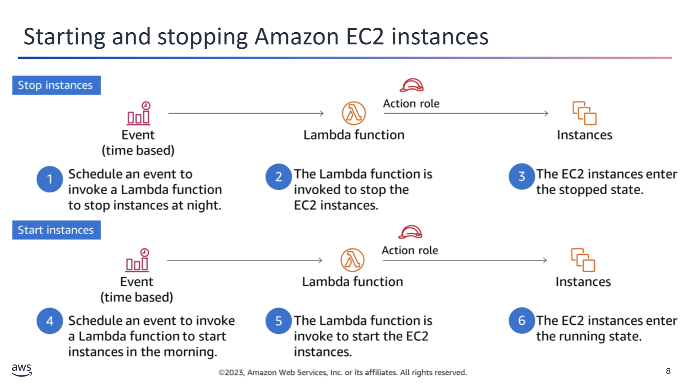

## 🕒 Automating EC2 Instance Start/Stop with Lambda & EventBridge

### 🎯 Goal
Reduce EC2 usage by **automatically stopping instances at night** and **starting them in the morning**.

---

### 🛠️ Tools Used
- **AWS Lambda** (serverless compute to run start/stop scripts)
- **Amazon EventBridge** (schedule triggers)
- **IAM Role** (permissions to control EC2)

---

### 🔄 Example Workflow

1. **02:00 AM UTC**
   - An **EventBridge rule** triggers a **Lambda function** to **stop EC2 instances**.
   - Lambda runs with an **IAM role** that has permission to stop the instances.
   - ✅ EC2 instances enter the `stopped` state.

2. **05:00 AM UTC**
   - Another **EventBridge rule** triggers a different **Lambda function** to **start EC2 instances**.
   - Lambda uses its **IAM role** to start the instances.
   - ✅ EC2 instances enter the `running` state.

---

#### 📚 Reference
[How do I stop and start Amazon EC2 instances at regular intervals using Lambda?  
→ aws.amazon.com/premiumsupport/knowledge-center/start-stop-lambda-eventbridge](https://aws.amazon.com/premiumsupport/knowledge-center/start-stop-lambda-eventbridge/)

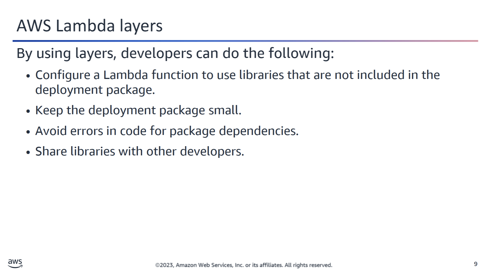

## 🧱 Using Lambda Layers

You can configure your **Lambda function** to pull in additional code and content via **layers**.

### 📦 What is a Lambda Layer?
A Lambda layer is a `.zip` archive that contains:
- Libraries  
- Data  
- Configuration files  
- A custom runtime  

### ✅ Benefits of Using Layers
- Keeps your **deployment package small**
- Simplifies **development and packaging**
- Helps avoid **dependency conflicts**

### 📏 Limits
- You can attach **up to 5 layers** per function
- The total **unzipped size** (function + layers) **must not exceed 250 MB**

### 🛠️ How to Add a Layer
Use the AWS CLI:

```bash
aws lambda update-function-configuration \
  --function-name YourFunctionName \
  --layers LayerARN1 LayerARN2 ...
```

#### 📚 Learn More
👉 [Creating and Sharing Lambda Layers – AWS Documentation](https://docs.aws.amazon.com/lambda/latest/dg/configuration-layers.html)

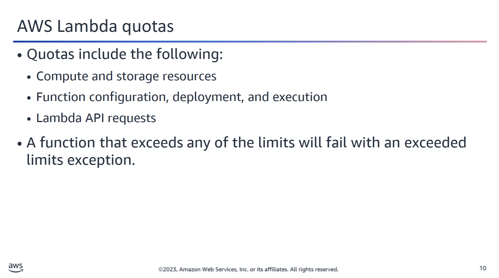

## 🧮 Lambda Resource Quotas

**AWS Lambda** imposes quotas (limits) on compute and storage resources to ensure fair use and optimal performance.

### 🔧 Compute & Storage Limits
- **Max memory per function:** 10 GB  
- **Max unzipped package size:** 250 MB  
- **Max zipped deployment size (via direct upload):** 50 MB  
- **Max function timeout:** 15 minutes  

### 📈 Concurrency
- **Default concurrency quota:** 1,000 concurrent invocations per Region  
- You can request an increase via the AWS Support Center if needed.

### 📌 Troubleshooting Tip
If you're experiencing issues with a Lambda deployment (e.g. timeouts, memory errors), check:
- Your function’s memory and timeout configuration  
- Deployment package size  
- Whether you’ve hit the concurrency quota

---

#### 📚 Learn More
👉 [AWS Lambda Quotas – Official Documentation](https://docs.aws.amazon.com/lambda/latest/dg/gettingstarted-limits.html)

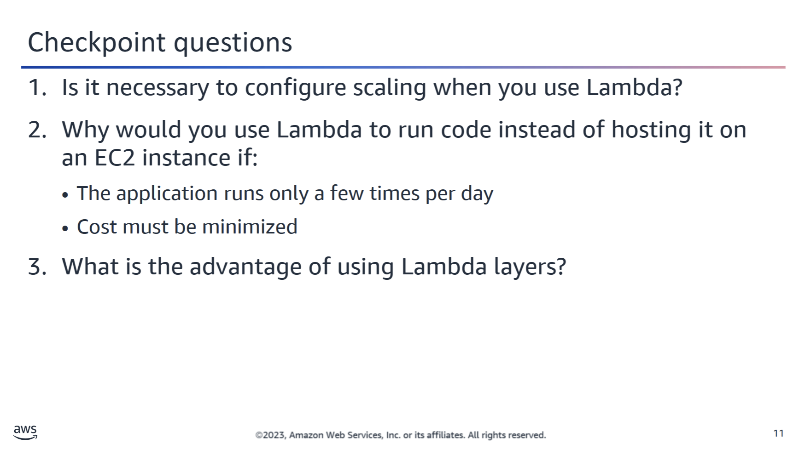

<details>
  <summary>1. Is it necessary to configure scaling when you use Lambda?</summary>
  It is not necessary to configure Lambda for scaling. The service also automatically handles load balancing.
</details>

<details>
  <summary>2. Why would you use Lambda to run code instead of hosting it on an EC2 instance if:
  • The application runs only a few times per day
  • Cost must be minimized</summary>
  You are charged only when Lambda runs. If your application runs only occasionally, it would be less expensive to host on Lambda instead of an EC2 instance that runs continuously.
</details>

<details>
  <summary>3. What is the advantage of using Lambda layers?</summary>
  By using layers, you can keep your deployment package small, which can make deployments easier.
</details>

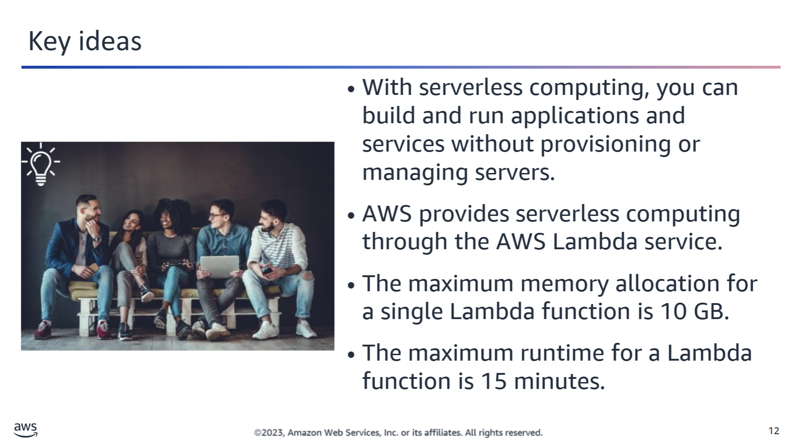
