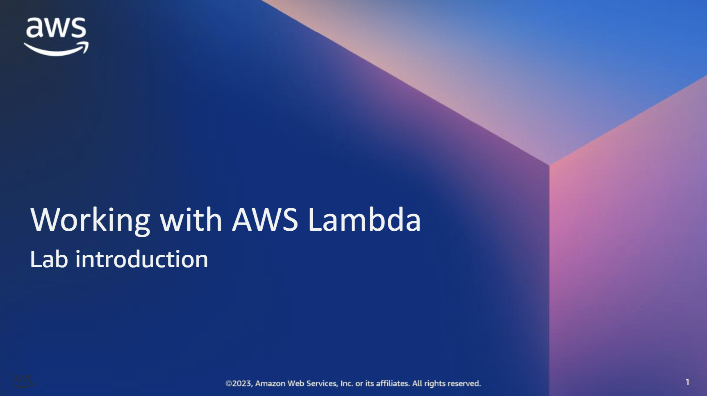
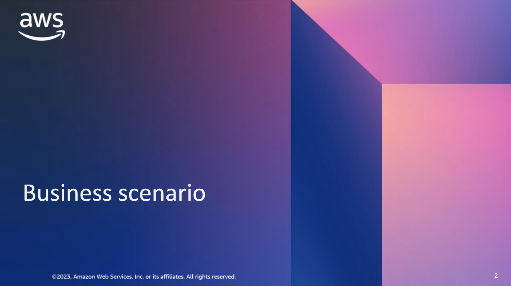
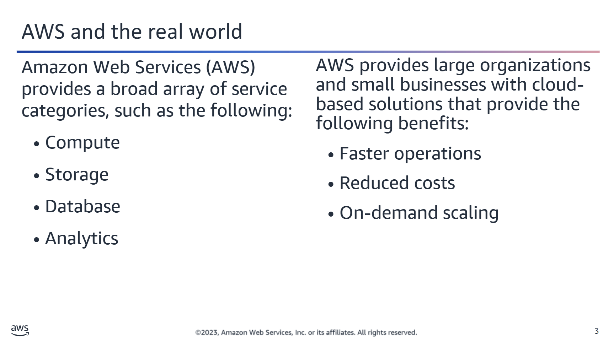
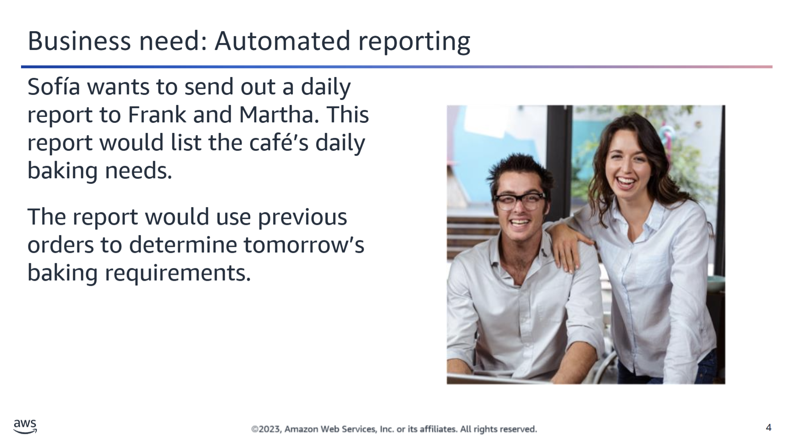
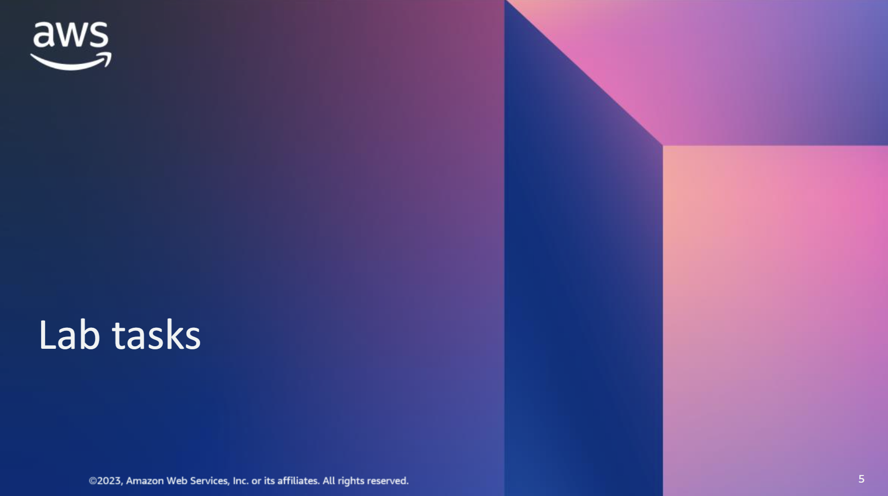
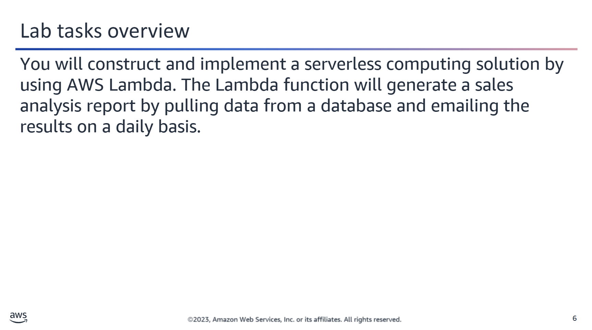
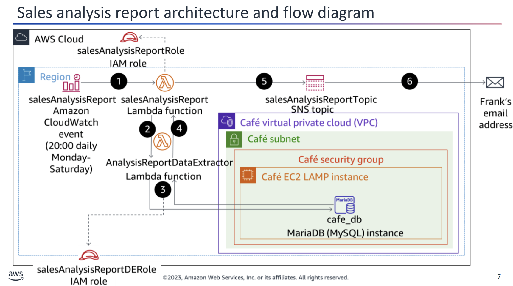
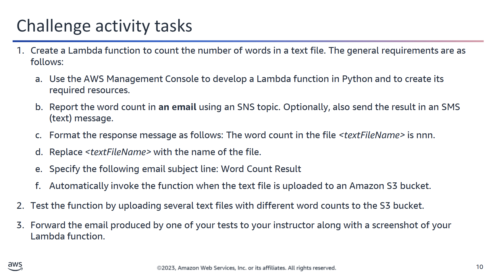
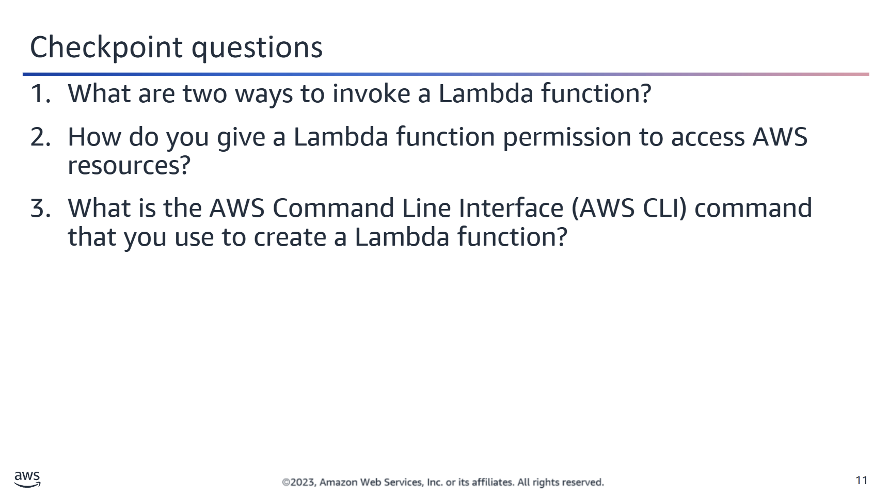

Amazon Web Services (AWS) offers a broad array of service categories—compute, storage, database, and analytics—that help large organizations and small businesses. These services provide businesses with the technology to move their operations forward faster, reduce costs, and scale based on demand.

Sofía: Hello, Nikhil! We would like to send a daily report so that we can plan tomorrow’s baking requirements based on today’s sales. 

Nikhil: You could send a daily report cost effectively with a Lambda function. You can use Lambda functions to automate actions that are based on events, or you can schedule the actions to happen at a specific time. Lambda functions are straightforward to configure, and you could do even more with a Lambda function, such as automating how you order your inventory. If you want to learn more, you can explore the Lambda FAQs. In the meantime, I will show you an architecture that will work for your goal of sending a daily report.

In this activity, you deploy and configure an AWS Lambda based serverless computing solution. The Lambda function will generate a sales analysis report by pulling data from a database and emailing the results on a daily basis. The database connection information is stored in Parameter Store, a capability of AWS Systems Manager. The database itself runs on an EC2 LAMP instance.

## Lambda-Based Serverless Architecture: Sales Analysis Report

This diagram shows the Lambda function-based serverless component architecture of the sales analysis report function of the café application. It also illustrates its flow, which consists of the following steps:

1. **CloudWatch Event Trigger**  
   An Amazon CloudWatch event invokes the `salesAnalysisReport` Lambda function at 20:00 every day, Monday through Saturday.

2. **Function Invocation with IAM Roles**  
   The `salesAnalysisReport` Lambda function invokes another Lambda function, `salesAnalysisReportDataExtractor`, to retrieve the report data.  
   - `salesAnalysisReport` uses the `salesAnalysisReportRole` IAM role.  
   - `salesAnalysisReportDataExtractor` uses the `salesAnalysisReportDERole` IAM role.

3. **Database Query via Lambda**  
   The `salesAnalysisReportDataExtractor` function runs an analytical query against the **Café database (`cafe_db`)** running on a LAMP stack in Amazon EC2.  
   - It uses the **PyMySQL** Python library to access the MySQL database.

4. **Result Handling**  
   The query result is returned to the `salesAnalysisReport` Lambda function.

5. **Message Formatting and Publishing**  
   The `salesAnalysisReport` function formats the report into a message and publishes it to the `salesAnalysisReportTopic` in **Amazon SNS**.

6. **Email Notification**  
   The `salesAnalysisReportTopic` SNS topic sends the message via email to **Frank**, who has an email subscription to this topic.

## Lab Tasks: Word Count with AWS Lambda

The following are the lab tasks:

### 1. Create a Lambda Function to Count Words in a Text File

**General Requirements:**

a. Use the **AWS Management Console** to develop a Lambda function in **Python** and to create its required resources.

b. **Report the word count**:
- Send an email with the result using an **SNS topic**.
- (Optional) Also send the result via **SMS**.

c. **Message Format**: The word count in the file <textFileName> is nnn.

d. Replace `<textFileName>` with the **actual file name**.

e. Use the following **email subject line**: Word Count Result

f. Automatically **invoke the function** when a **text file is uploaded** to an **Amazon S3 bucket**.

---

### 2. Test the Function

Upload **several `.txt` files** with different word counts to the configured S3 bucket.

---

### 3. Submit to Instructor

- **Forward the email** that was produced by one of your tests to your instructor.
- Include a **screenshot of your Lambda function**.

  
1. What are two ways to invoke a Lambda function?

  You can invoke a Lambda function based on a schedule (e.g., at a particular time on a particular day) or based on an event (e.g., when a file is uploaded to an S3 bucket).

  
2. How do you give a Lambda function permission to access AWS resources?

  You create an IAM role with the desired permissions and assign the role to the function.

  
3. What is the AWS Command Line Interface (AWS CLI) command that you use to create a Lambda function?

  <code>aws lambda create-function</code>

