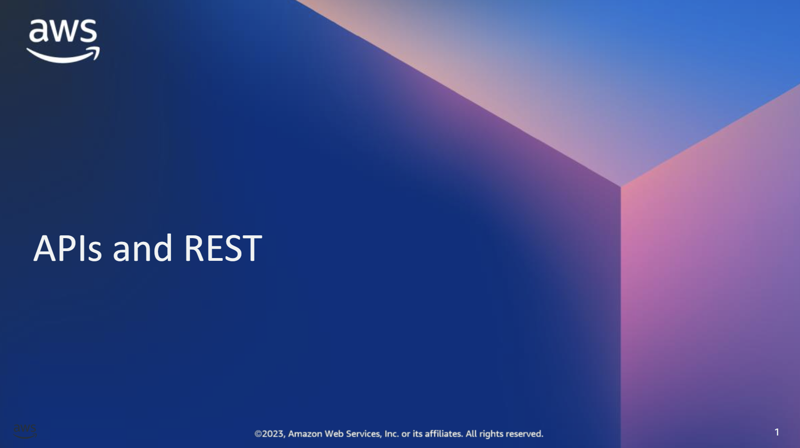

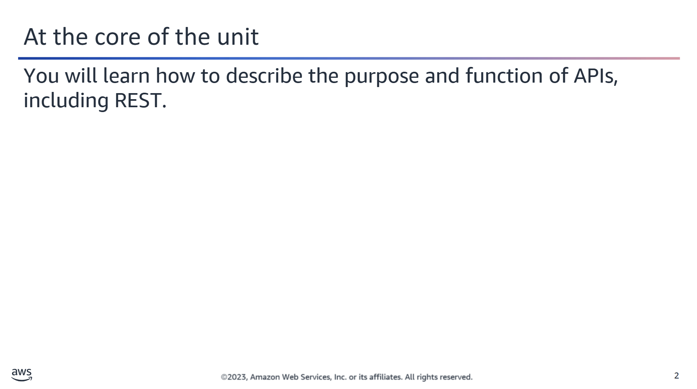

You will learn how to do the following:
- Describe the purpose and function of application programming interfaces (APIs), including Representational State Transfer (REST).

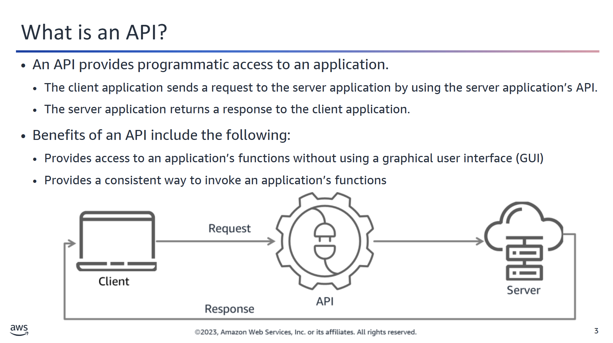

## 🧠 Understanding APIs

Most people interact with software using a **Graphical User Interface (GUI)**.  
🔹 *Example:* The **AWS Management Console** is a GUI that allows users to manage AWS services through point-and-click interactions.

---

### 🔌 APIs: The Programmatic Interface

When **applications** or **services** need to communicate with each other, they use an **Application Programming Interface (API)**.

- APIs expose software functionality through **code**.
- Developers can use APIs to build programs that interact with other applications, services, or platforms.

---

### 📨 How APIs Work

APIs act as **intermediaries** between software systems.  
They enable one system to **request** data or services from another and **receive responses**.

🔁 This communication occurs through **API calls**, which follow this typical flow:

1. **Request:** A message is sent to the API endpoint asking for an operation.
2. **Response:** The API processes the request and sends back data or a confirmation.

---

### 📐 Standardization

APIs provide a **standardized way** to access application functionality:
- They define **what functions** can be invoked.
- They define **how** those functions are invoked (parameters, data format, etc.).
- They help ensure **consistency, reusability, and integration** across systems.

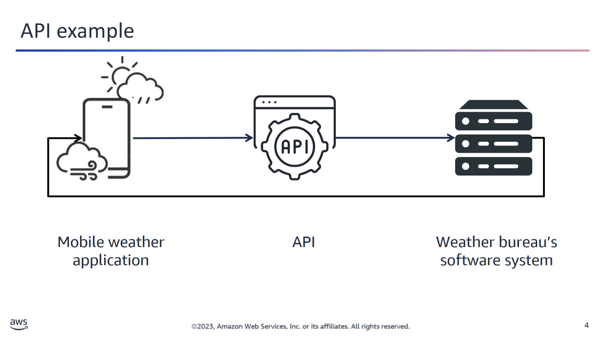

For example, the weather bureau’s software system contains daily weather data. The weather app on your phone communicates with this system via APIs and shows you daily weather updates on your phone.

The public APIs of AWS services are another API example. When you use a tool such as the AWS Command Line Interface (AWS CLI), the tool uses the public APIs exposed by the AWS services to invoke service functions.

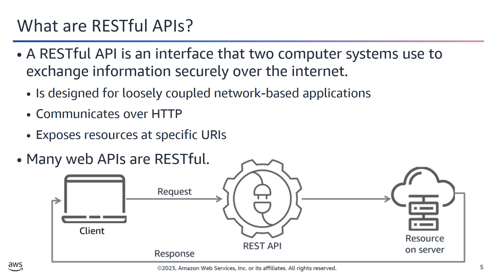

Some APIs follow the principles of REST. REST APIs communicate over HTTP and follow secure, reliable, and efficient software communication standards. REST is a popular API design that has largely replaced Simple Object Access Protocol (SOAP) as the standard for web services. Web-based APIs that adhere to the REST design principles are said to be RESTful.

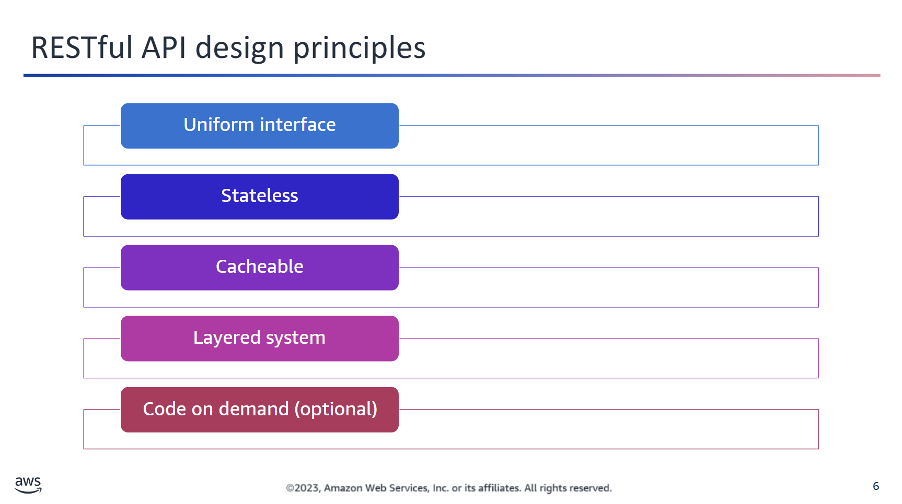

## ⚙️ REST Design Principles

REST (Representational State Transfer) follows five key architectural principles to ensure scalable, reliable, and simple communication between clients and servers.

---

### 🔗 1. Uniform Interface
Clients interact with the server through a **consistent interface**:
- Each resource is accessed via a specific URI.
- The interface does **not** dictate the structure of the returned data.
  
📌 *This simplifies the interaction between different components and improves visibility and decoupling.*

---

### 🚫 2. Statelessness
RESTful services are **stateless**, meaning:
- The server does **not** retain any client context between requests.
- All necessary information must be included in each request by the client.

💡 *This enhances scalability and reliability.*

---

### 🗂️ 3. Caching
Clients should be able to **cache** server responses when appropriate:
- Improves performance
- Reduces server load
- Ensures faster response times

📌 *Responses must explicitly indicate whether they are cacheable or not.*

---

### 🧱 4. Layered System
A REST system can consist of multiple **intermediate layers**, such as:
- Load balancers
- Caching servers
- Security gateways

💡 *Clients do not know whether they are connected directly to the end server or through intermediaries.*

---

### 📦 5. Code on Demand *(Optional)*
Servers can **optionally** send executable code to clients:
- For example, JavaScript to enhance client-side functionality
- Extends the behavior of the client dynamically

⚠️ *This is the **least commonly used** principle and is often excluded for simplicity and security reasons.*


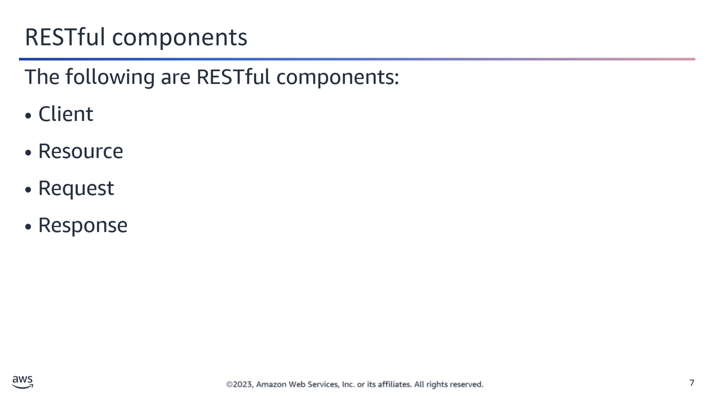

## 🌐 RESTful API Components

RESTful APIs are composed of several key elements that define the interaction between clients and servers.

### 👤 Client
The **client** is the user or software that wants to access resources. It can be:
- A human user accessing a website
- A program (like a mobile app or script) using the API to retrieve data

📌 *Example:* A mobile weather app fetching forecast data from a weather API.

---

### 📦 Resource
A **resource** is the data or service provided by the server. This can include:
- Images
- Videos
- Text
- Numbers
- Any structured or unstructured data

🔐 APIs help control **who** can access **what**, enforcing security and access rules.

---

### 📤 Request
A **request** is a structured message sent by the client to the server. It typically includes:
- An HTTP method (GET, POST, PUT, DELETE)
- A target URI
- Optional headers and body content

📬 The server must understand the request format to respond appropriately.

---

### 📥 Response
The **response** is the server’s reply to the client's request. It contains:
- A status code (e.g., `200 OK`, `404 Not Found`)
- Optional body content (like JSON or HTML)
- Metadata in HTTP headers

📈 Responses include both data and diagnostic information about the operation.

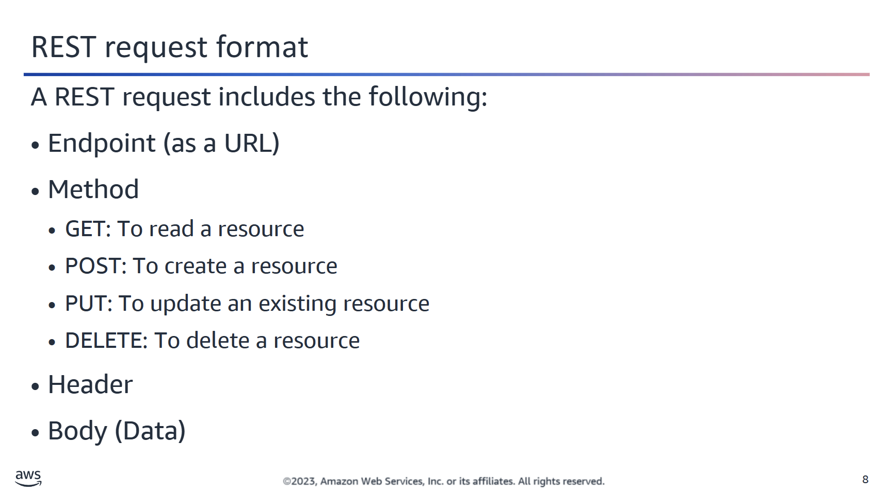

## 🌐 Components of a REST Request

A REST request typically includes the following key components:

---

### 🔗 Endpoint
- The **endpoint** is the URL that identifies the resource you want to interact with.
- It defines *where* the request is sent.
- Example: `https://api.example.com/users/123`

---

### ⚙️ HTTP Methods

Each REST API resource supports one or more **HTTP methods**, which specify the type of action the client wants to perform:

| Method  | Purpose                            |
|---------|-------------------------------------|
| `GET`   | Retrieve a resource                 |
| `POST`  | Create a new resource               |
| `PUT`   | Update or replace an existing resource |
| `DELETE`| Remove a resource                   |

---

### 📨 Header

- Contains **metadata** about the request.
- Examples include:
  - `Content-Type`: Indicates the data format (e.g., `application/json`)
  - `Authorization`: Includes authentication tokens or credentials

---

### 🧾 Request Body

- The **body** includes the data that is sent to the server.
- Typically used with `POST` and `PUT` requests.
- `GET` and `DELETE` requests generally do not include a body.
- Example (JSON format):
  ```json
  {
    "username": "frank.cafe",
    "email": "frank@example.com"
  }
```
```

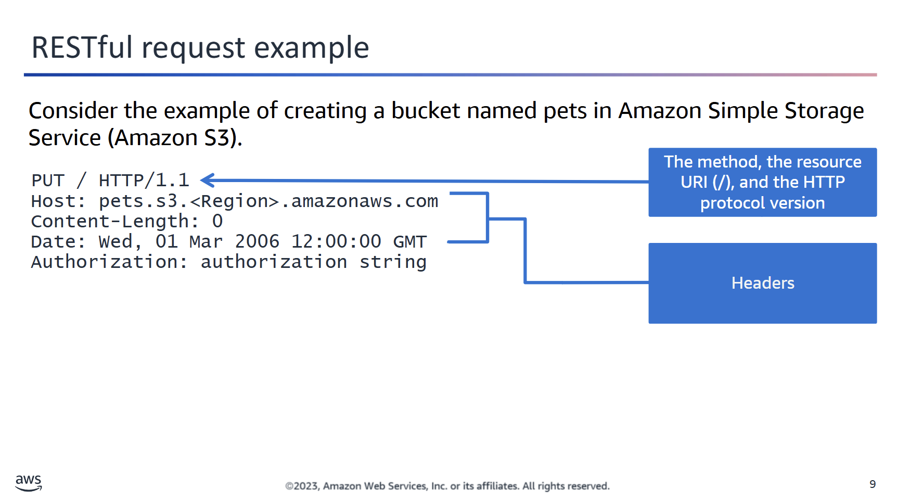

## 🪣 Creating a Bucket in Amazon S3 via API

Let's consider an example where you create a bucket named `pets` in **Amazon Simple Storage Service (Amazon S3)**.

---

### 📌 Key Details

- **Bucket Name**: `pets`
- **Endpoint Structure**:  https://s3.<region>.amazonaws.com

---

### 🧪 API Method

- **HTTP Method**: `PUT`  
- Used to **create** or **update** resources.
- In this case, it's used to create the new S3 bucket.

---

### 🔍 Example Request Components

| Component        | Description                                                                 |
|------------------|-----------------------------------------------------------------------------|
| **Content-Length** | `0` — No message body is sent.                                               |
| **Resource URI**   | `/` — The URI is empty because no object key is specified.                 |
| **Date**           | Timestamp when the request is made.                                        |
| **Authorization**  | AWS credential information used to authenticate the request.              |

---

### ✅ Summary

To create a bucket with this request:
- You send a `PUT` request to the correct **S3 endpoint**.
- The request includes appropriate **headers** like `Date`, `Authorization`, and `Content-Length`.
- The **body is empty**, because you're only creating the bucket — not uploading an object.

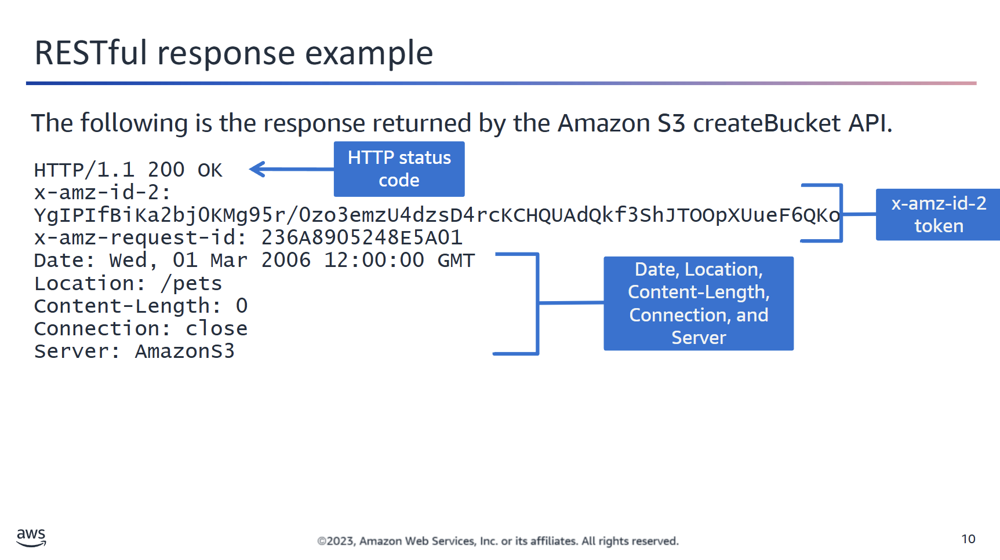

## 📥 Examining the S3 Response Header

When you send a request to Amazon S3 (for example, to create a bucket), the **response header** provides useful metadata about the result of your request.

---

### ✅ Example: Successful Response

Below are the typical fields you might see in a response header from S3:

| Header              | Description                                                                                   |
|---------------------|-----------------------------------------------------------------------------------------------|
| **HTTP Status Code**| `200 OK` – Indicates the request was successful and accepted by the server.                   |
| **x-amz-id-2**       | A special token used with `x-amz-request-id` to help AWS support with troubleshooting.         |
| **Date**             | The timestamp of the response, e.g., `Wed, 01 Mar 2006 12:00:00 GMT`.                         |
| **Location**         | URI of the newly created S3 resource (e.g., the new bucket).                                  |
| **Content-Length**   | Length of the response body in bytes.                                                        |
| **Connection**       | Describes the state of the connection – whether it remains open or is closed.                |
| **Server**           | Identifies the name/type of the server that handled the request.                             |

---

### 🧠 Use Case

This information is especially useful for:
- Debugging API calls
- Validating responses
- Monitoring behavior of S3 operations

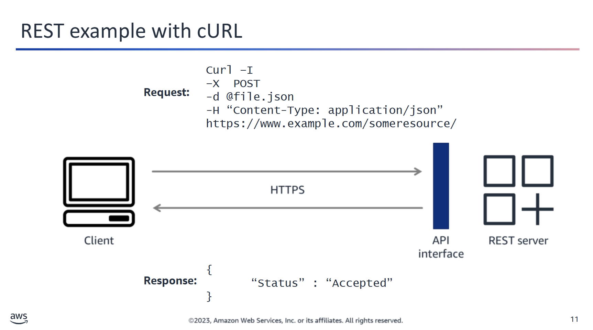

## 🧪 Using `cURL` to Test REST APIs

`cURL` (Client URL) is a popular command-line tool for sending and receiving data over HTTP(S). It’s particularly useful for testing REST API endpoints.

---

### 📤 Example: Creating a File on a Server

A typical `cURL` command to create a file on a server might look like this:

```bash
curl -i -X POST -d @file.json -H "Content-Type: application/json" https://api.example.com/data
```

🔍 Explanation of Flags and Options

-i	Includes the response headers in the output.
-X POST	Specifies the HTTP method to use (POST in this case).
-d @file.json	Sends the contents of file.json as the request body.
-H	Adds a custom header, such as Content-Type: application/json.

ℹ️ In real-world scenarios, authentication credentials (e.g. via -H "Authorization: Bearer <token>") are usually required.

📄 Example Response (in JSON)
```json
{
  "status": "success",
  "id": "12345",
  "message": "File created successfully."
}
```

✅ Use Cases
- Quickly testing API endpoints
- Sending mock data
- Inspecting API responses and headers

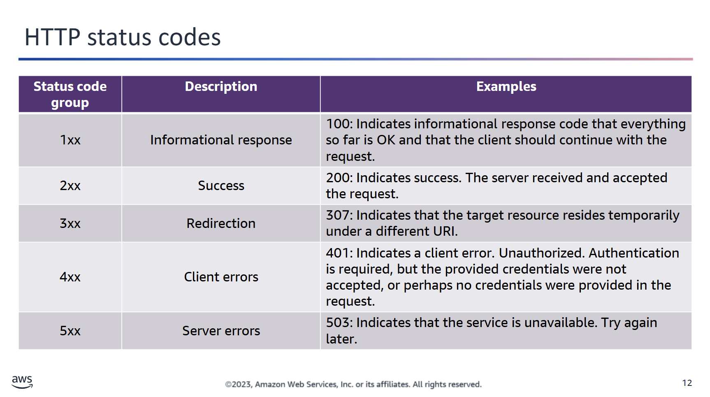

## 🔢 HTTP Status Codes in REST APIs

When interacting with REST APIs, the **HTTP status code** included in the response helps you understand the outcome of your request.

Understanding these codes—especially the error codes—is crucial for troubleshooting issues with API calls.

---

### 📚 Status Code Categories

HTTP status codes are grouped by their **first digit**, which indicates the general type of response:

| Code Range | Meaning                        | Description                                                                 |
|------------|--------------------------------|-----------------------------------------------------------------------------|
| `1xx`      | 🔄 Informational                | Request received, continuing process.                                       |
| `2xx`      | ✅ Success                      | The request was successfully received, understood, and accepted.           |
| `3xx`      | ↪️ Redirection                  | Further action is needed to complete the request (e.g., follow a redirect). |
| `4xx`      | ❌ Client Error                 | The request contains bad syntax or cannot be fulfilled by the server.      |
| `5xx`      | 🚨 Server Error                 | The server failed to fulfill a valid request.                              |

---

### 💡 Why It Matters

- **Debugging:** Helps identify where the problem lies (client vs. server).
- **Automation:** Enables logic in code to react appropriately to different response types.
- **Security:** Prevents exposing sensitive information when handling errors.

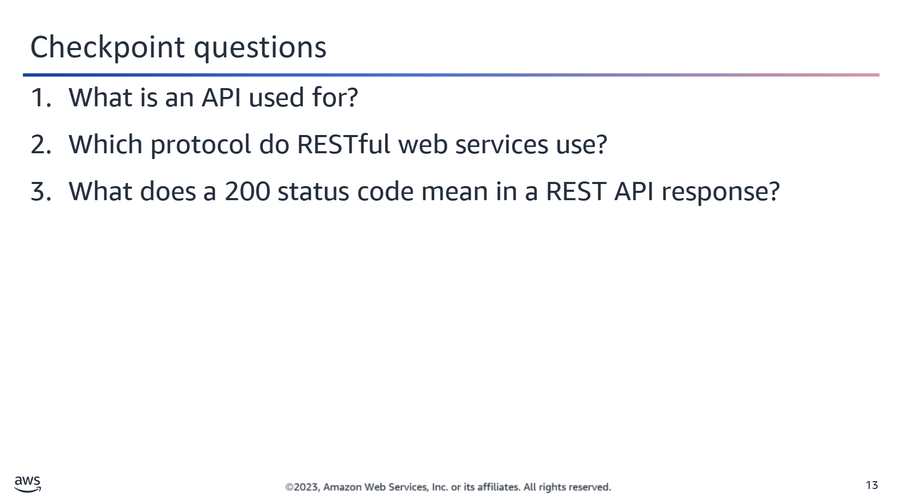

<details>
<summary>❓ What is an API used for?</summary>
You can use APIs to interact programmatically with a separate application or software.
</details>

<details>
<summary>❓ Which protocol do RESTful web services use?</summary>
RESTful web services use the HTTP protocol. HTTP standard methods are used to access resources in a RESTful architecture.
</details>

<details>
<summary>❓ What does a 200 status code mean in a REST API response?</summary>
A 200 status code indicates success. The server received and accepted the request.
</details>

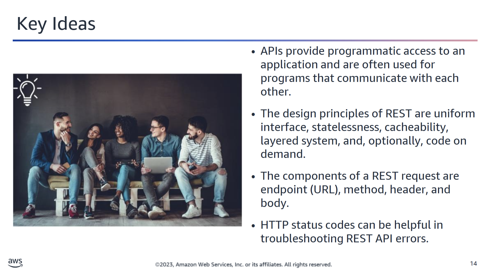
