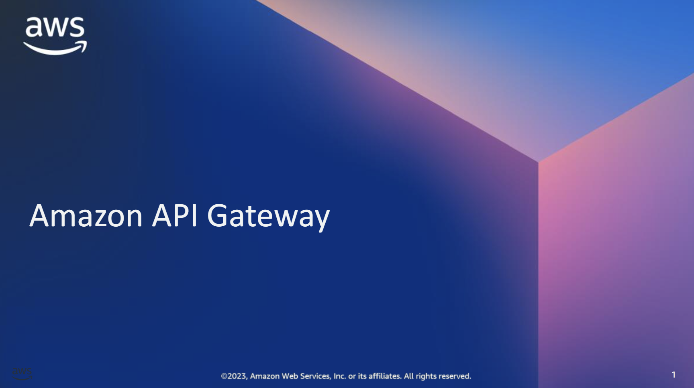
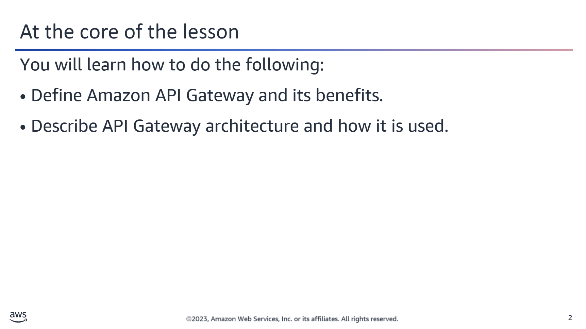
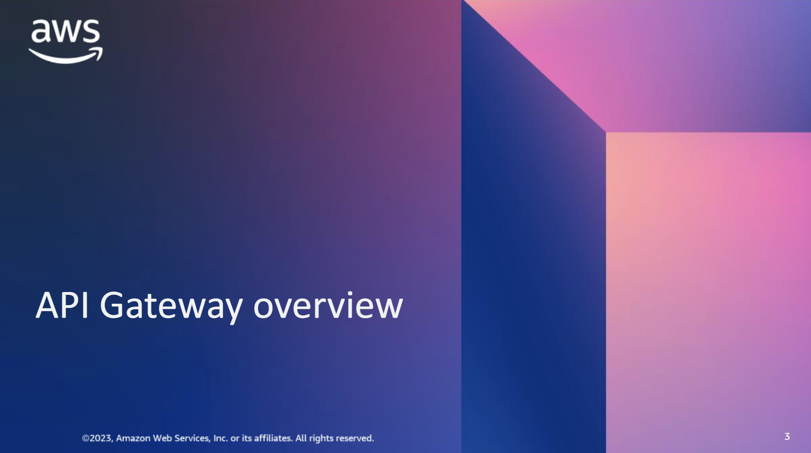
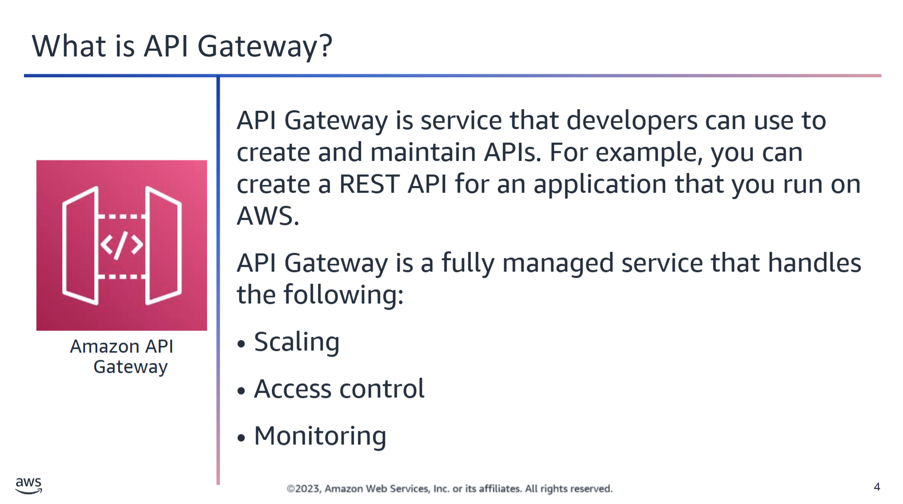
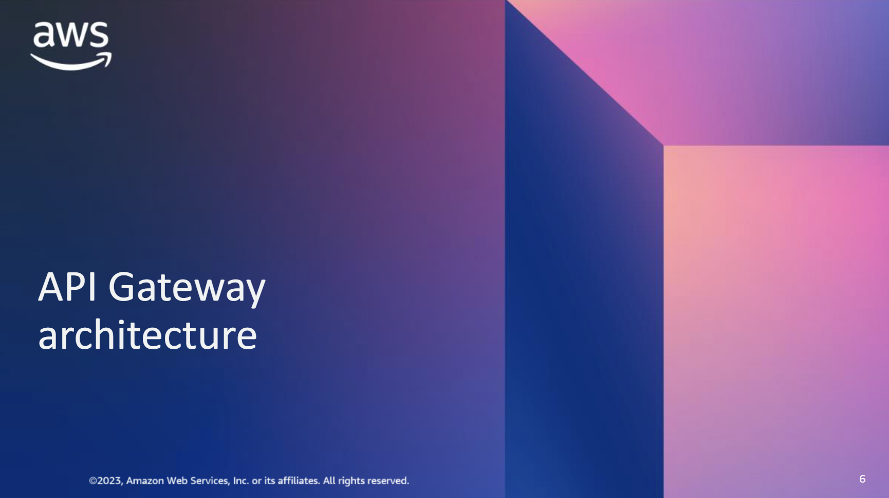
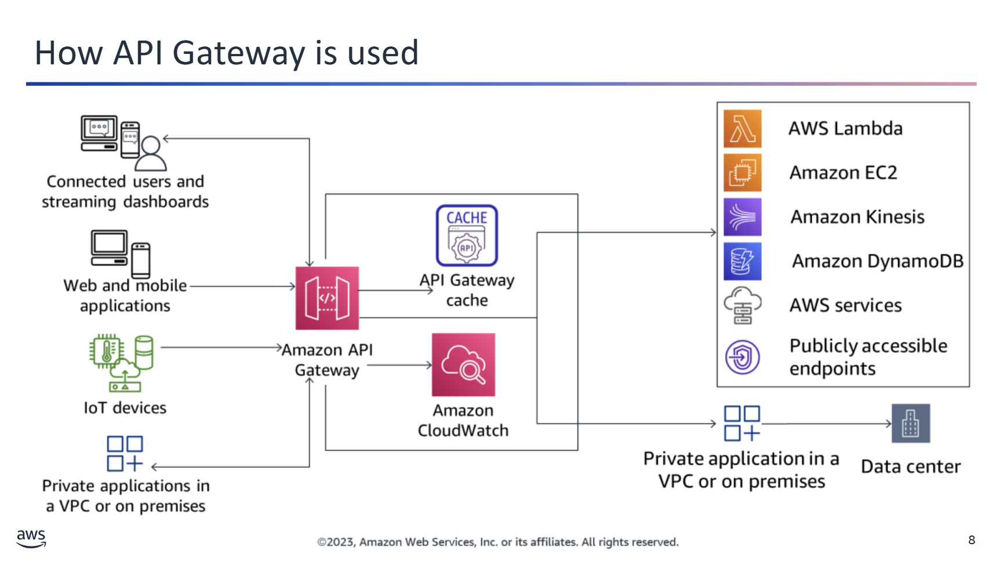
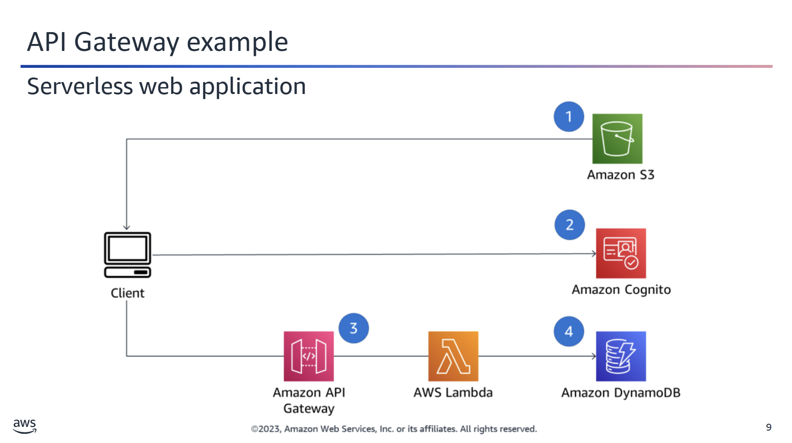
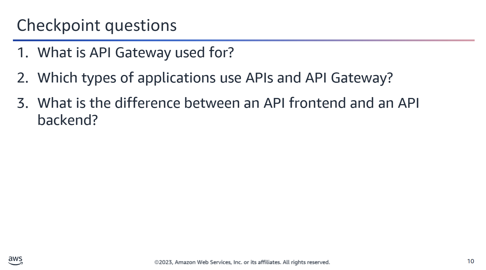
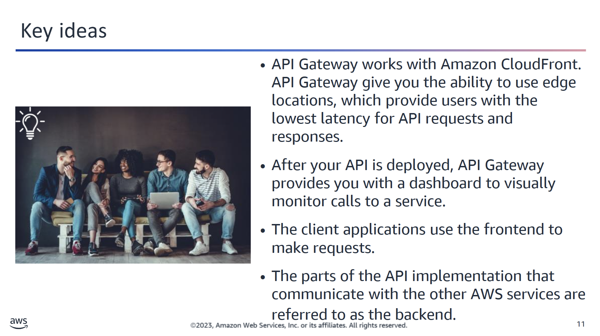

## 🌐 Amazon API Gateway Overview

Amazon **API Gateway** handles all the tasks involved in accepting and processing concurrent API calls at scale. These tasks include:

- 🚦 Traffic management  
- 🔐 Authorization and access control  
- 📈 Monitoring  
- 📚 API version management  

You pay **only** for:
- The API calls you receive  
- The amount of data that is transferred out  

---

## 📊 Monitoring and Insights

API Gateway provides a **dashboard** to visually monitor calls to your services, helping you to observe performance metrics in real-time.

---

## ⚙️ Integration with AWS Lambda

API Gateway works with **AWS Lambda** so that you can build **serverless APIs**:

1. First, you create **REST APIs** with API Gateway.  
2. Then, your mobile and web applications can use these APIs to call publicly available AWS services through the code you run in **Lambda**.

---

## 🔁 Data Transformation

With API Gateway, you can:
- Create **RESTful, resource-based APIs**
- Use **data transformation** capabilities to shape requests in the format that your target services expect.


## 🚀 Benefits of Using Amazon API Gateway

Amazon API Gateway provides a wide range of advantages for developers and businesses:

---

### ⚙️ Efficient API Development
- Run **multiple versions** of the same API simultaneously.
- Quickly **iterate**, **test**, and **release** new API versions.

---

### 🌐 Performance at Any Scale
- Provide users with **low-latency** API requests and responses.
- Leverage the **AWS global network** of edge locations via **Amazon CloudFront**.

---

### 💰 Cost Savings at Scale
- Benefit from **tiered pricing** per Region across AWS accounts.
- Lower your API request costs as usage increases.

---

### 📊 Monitoring
- Track **performance metrics**, API calls, **latency**, and **error rates**.
- Use the **API Gateway dashboard** for centralized visibility.

---

### 🔐 Flexible Security Controls
- Use **AWS Identity and Access Management (IAM)** for fine-grained access.
- Integrate **Amazon Cognito** for user authentication and authorization.

---

### 🔄 RESTful API Options
- **HTTP APIs** are ideal for most use cases.
- They can be **significantly cheaper** than traditional REST APIs.



## 🧭 API Gateway: Frontend and Backend Integration

This diagram illustrates how **client applications** gain **programmatic access** to AWS services—or external websites—via APIs managed by **Amazon API Gateway**.

---

### 🧩 API Structure

The APIs consist of two main components:

#### 🎛️ Frontend (Client-Facing Interface)
- Encapsulated by:
  - **Method Requests**
  - **Method Responses**
- These are the **interfaces** that client applications use to make API calls.

#### 🖧 Backend (AWS Service Integration)
- Encapsulated by:
  - **Integration Requests**
  - **Integration Responses**
- These communicate with AWS services and execute the **underlying logic and actions**.

---

### 🔗 AWS Services in the Architecture

The backend of the API may integrate with various AWS services, such as:

- **Amazon API Gateway** – API management and exposure
- **Amazon DynamoDB** – NoSQL database
- **AWS Lambda** – Serverless compute logic
- **Amazon EC2** – Virtual machine hosting
- **Amazon VPC** – Networking layer for resource isolation

---

This layered architecture allows you to expose controlled functionality to clients while delegating execution to trusted AWS services behind the scenes.



## 🔧 Building APIs for Diverse Applications

The diagram illustrates how APIs can be built and used across various types of applications:

### 📱 Application Types
- **Web Applications**
- **Mobile Applications**
- **Internet of Things (IoT) Devices**
- **Other client applications** that utilize **Amazon API Gateway**

---

### 🚀 API Gateway Capabilities

With **Amazon API Gateway**, you can:

- ✅ **Create** new APIs
- 📢 **Publish** APIs for client access
- 🛠️ **Maintain** and version APIs
- 📊 **Monitor** API usage and performance

---

### 🔗 Integration with AWS Serverless Services

These APIs can seamlessly **integrate** with other **AWS serverless components**, such as:

- AWS Lambda
- Amazon DynamoDB
- Amazon S3
- Amazon SNS / SQS

This architecture enables scalable, flexible, and fully managed **serverless backends** for your applications.



## 🌐 Example: Serverless Web Application with API Gateway

This example illustrates how **Amazon API Gateway** enables a fully **serverless web application** architecture.

---

### 🧩 Components Overview

1. 🗂️ **Amazon S3**  
   Hosts static frontend assets:  
   - `HTML`  
   - `CSS`  
   - `JavaScript`  
   - Images  

2. 🔐 **Amazon Cognito**  
   Manages **user authentication and authorization**, securing access to backend APIs.

3. 🌐 **Client-Side Logic (Browser)**  
   Executes JavaScript to:
   - Communicate with **API Gateway** via **RESTful web services**
   - Send and receive data using the backend API

4. 🧠 **Amazon API Gateway**  
   Exposes a **RESTful API** endpoint, forwarding user requests to:

5. ⚙️ **AWS Lambda Function**  
   - Processes requests
   - Executes application logic
   - Interfaces with the database

6. 🗃️ **Amazon DynamoDB**  
   - Serves as the **persistence layer**
   - Stores and retrieves application data on demand

---

### 🔁 Flow Summary

```plaintext
User (browser)
   ↓
HTML/JS/CSS from S3
   ↓
Authentication via Cognito
   ↓
REST API call to API Gateway
   ↓
API Gateway invokes Lambda
   ↓
Lambda interacts with DynamoDB
   ↓
Response sent back to user
```

This architecture provides high scalability, security, and zero server management.



<details>
<summary>❓ What is API Gateway used for?</summary>

API Gateway is used for creating, publishing, maintaining, and monitoring API calls.

</details>

<details>
<summary>❓ Which types of applications use APIs and API Gateway?</summary>

Web and mobile applications, Internet of Things (IoT), and many others.

</details>

<details>
<summary>❓ What is the difference between an API frontend and an API backend?</summary>

The applications use the frontend to make requests. The parts of the API implementation that communicate with AWS services are referred to as the backend.

</details>


