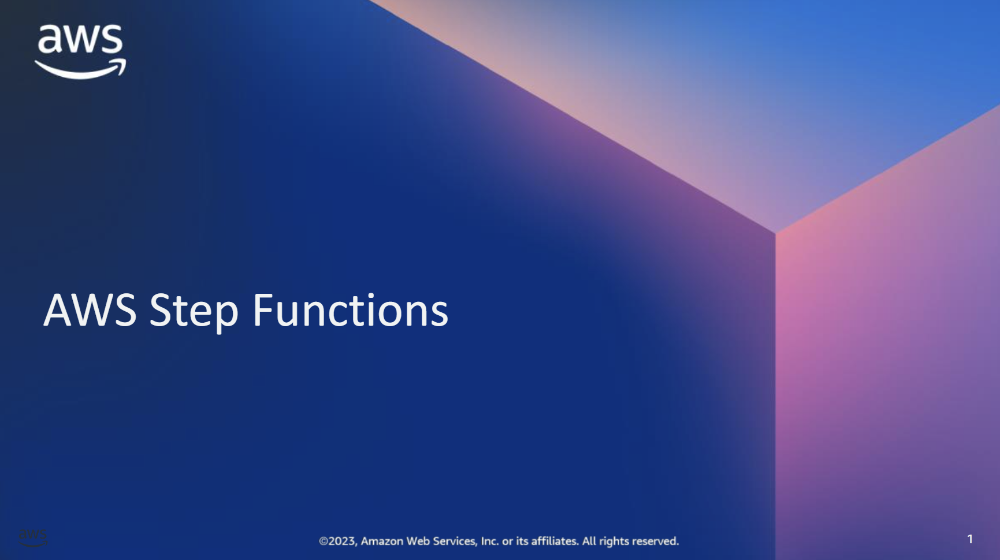
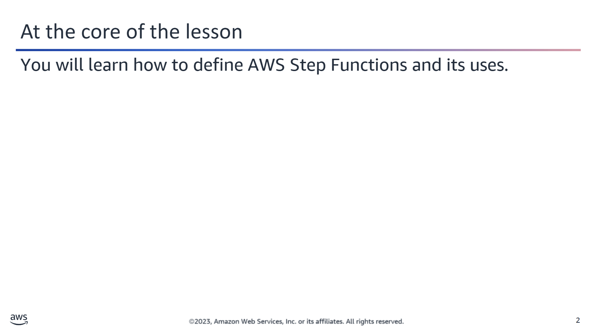
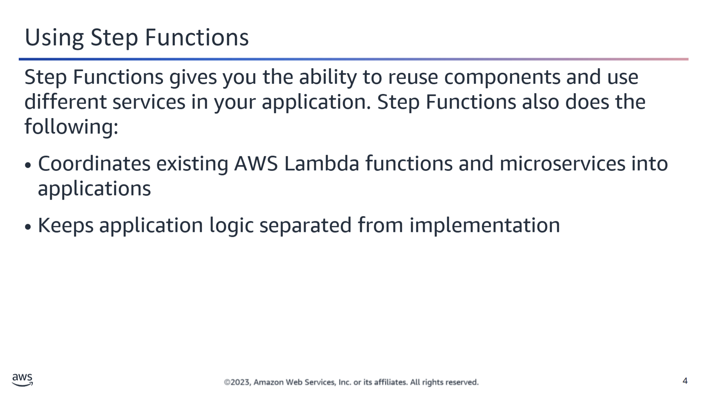
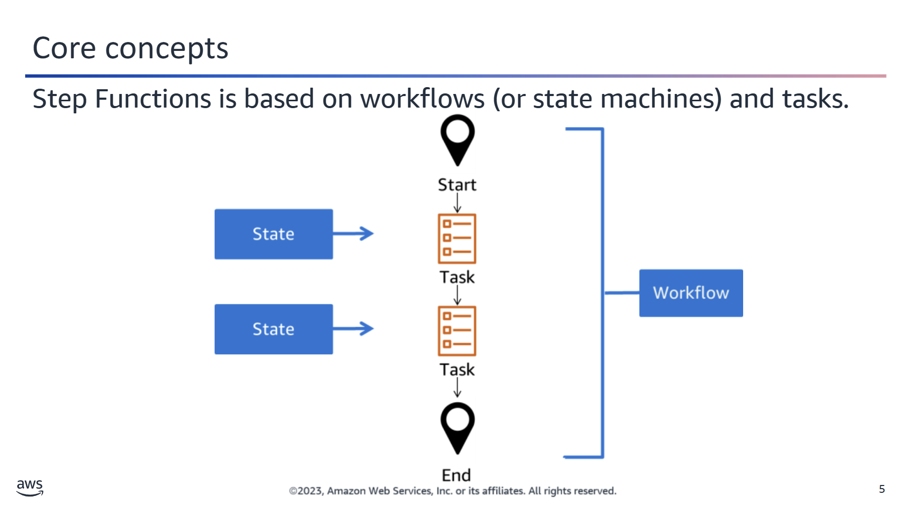
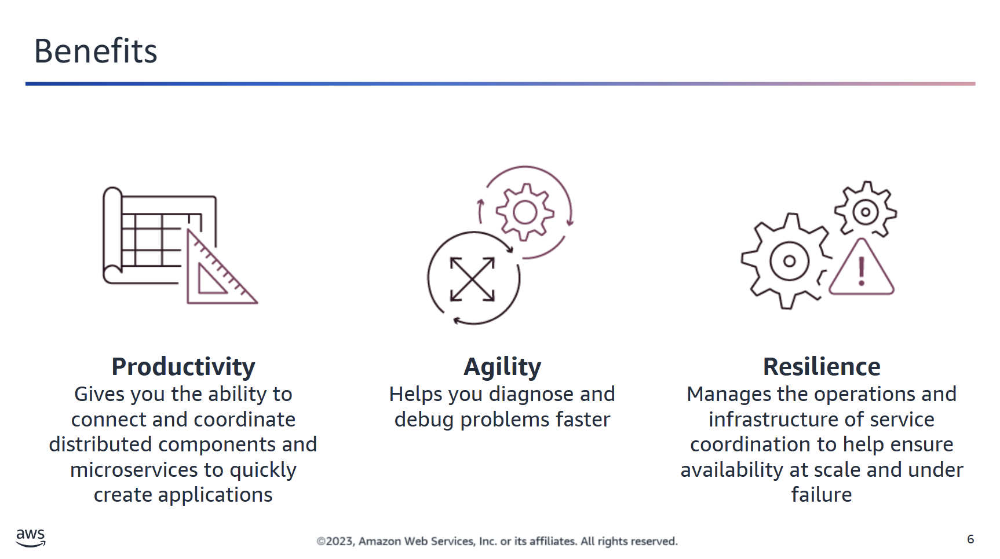
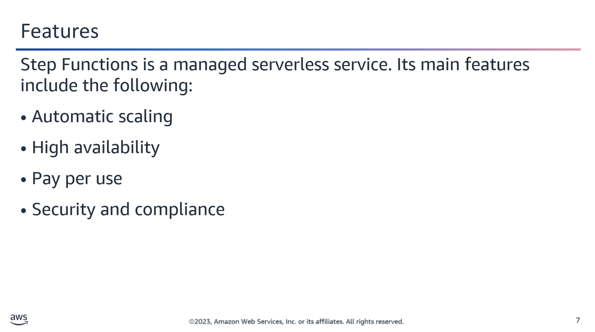
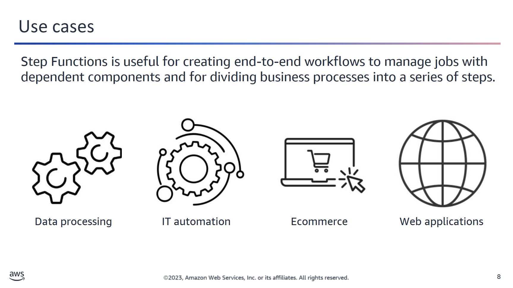
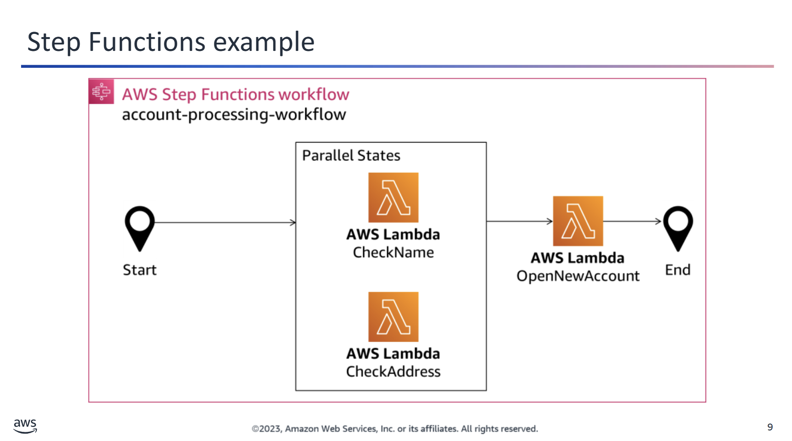
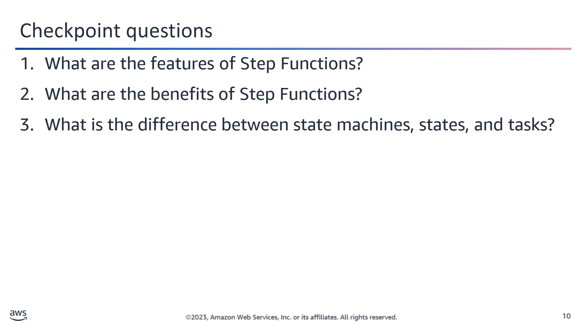
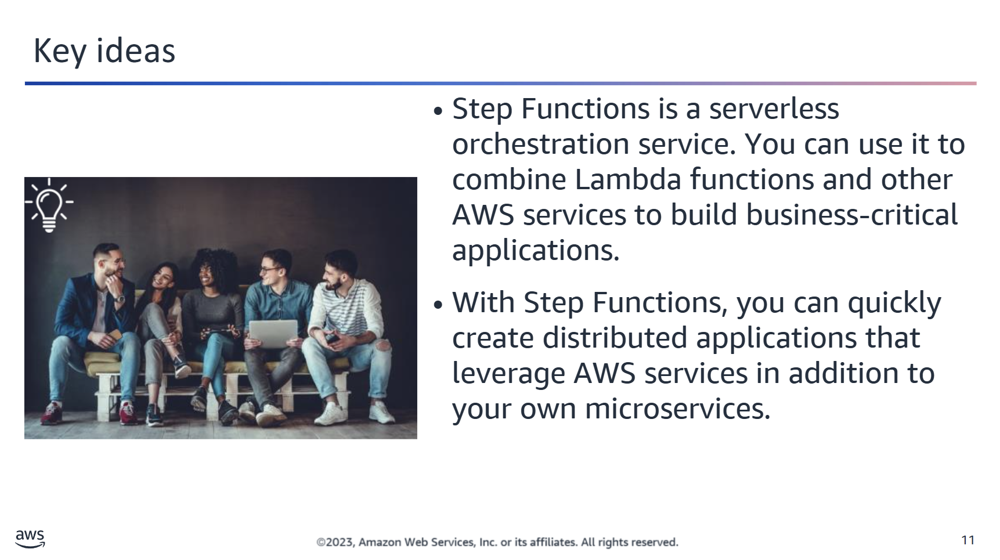

## 🔁 AWS Step Functions Overview

You can use **AWS Step Functions** to coordinate AWS services into serverless workflows.

---

### 🧩 Workflow Basics

- Workflows consist of a **series of steps**.
- The **output of one step becomes the input** to the next.

---

### 🧠 Application State & Execution Tracking

- Step Functions **maintains the application state**, tracking exactly which workflow step your application is in.
- It also **stores an event log** of data that is passed between components.

---

### 🔄 Fault Tolerance

- If the workflow is **interrupted** for any reason, your application can **resume from where it left off**, thanks to built-in state tracking and persistence.

## 🛠️ Building Applications with AWS Step Functions

**AWS Step Functions** coordinates your existing **AWS Lambda functions** and **microservices** into robust applications that you can flexibly rewire and extend.

---

### 🧱 Microservices & Flexibility

- Microservices are **small, independent services** that communicate via well-defined APIs.
- Step Functions enables you to **compose these services**—whether they run on:
  - 💻 EC2 instances  
  - 📦 Containers  
  - ⚙️ Lambda functions  
  - 📱 Mobile devices  

---

### 🔄 Rapid Application Composition

- You can **quickly create distributed applications** that combine:
  - AWS services  
  - Your own microservices  

---

### 🧠 Logic and Implementation Separation

- Step Functions **separates your application logic** from the actual implementation:
  - Easily **add**, **reorder**, or **replace steps**  
  - No changes required in your core business logic  
- This makes maintenance simpler and code:
  - More **modular**  
  - Easily **scalable**  
  - **Reusable** across projects  

## 🔁 AWS Step Functions: State Machines & States

In **AWS Step Functions**, the workflows you build are referred to as **state machines**.  
Each individual step in a workflow is called a **state**.

---

### 🧩 Tasks

- **Tasks** are states that **perform actual work**, either by:
  - 🔗 Coordinating another **AWS service**, or  
  - 🚀 Calling an **application** you host anywhere (e.g., EC2, on-premises, container, etc.)

---

### 🔄 Flexibility & Reusability

With Step Functions, you can:

- ♻️ **Reuse** existing components across workflows  
- ✏️ **Edit the step sequence** as your business logic evolves  
- 🔁 **Swap out the code** called by task states at any time  

This enables you to adapt quickly to changing requirements while keeping your workflow logic consistent.

## ⚙️ Benefits of AWS Step Functions

AWS Step Functions provide significant advantages across productivity, agility, and resilience.

---

### 🚀 Productivity

- 🧩 **Separation of Concerns**  
  Define and manage your application's **workflow independently** from its **business logic**.

- 🏗️ **Accelerated Development**  
  Use **ready-made steps (states)** and **built-in error handling** to write applications faster.

---

### 🔄 Agility

- 📜 **Complete Execution History**  
  Every workflow run is recorded, so you can **review all events in sequence** in one centralized location.

- 📈 **Massive Scalability**  
  Scale seamlessly from **one to thousands of concurrent runtimes**, especially when integrated with:
  - AWS Lambda
  - Amazon S3
  - Amazon DynamoDB

- 💰 **Cost Efficiency**  
  You **only pay** for what you use, **when you use it** — no idle costs.

---

### 🛡️ Resilience

- 🧯 **Automatic Error Handling**  
  Gracefully handle failures without manual intervention.

- ⚙️ **Fully Managed**  
  No need to configure or maintain underlying infrastructure — Step Functions handles it for you.

## 📋 AWS Step Functions – Key Features

Explore some of the core capabilities that make AWS Step Functions a powerful tool for building resilient, scalable workflows.

---

### ⚖️ Automatic Scaling

- 🔄 Step Functions **automatically scales** operations and compute resources based on workload.
- Ensures consistent performance as the **frequency of requests increases**.

---

### 🛡️ Fault Tolerance & High Availability

- ✅ Built-in **fault tolerance** to protect applications from individual machine or data center failures.
- Operates across **multiple Availability Zones** in each AWS Region.
- Ensures **high availability** for both the Step Functions service and the workflows you build.

---

### 💸 Efficient Pricing

- 💵 You are billed per **state transition**, not for idle time.
- 🕒 States can persist for **up to 1 year** without extra cost.
- Cost-effective at any scale — from a few executions to **tens of millions**.

---

### 🔐 Security & Private Access

- 🔐 Integrated with **AWS Identity and Access Management (IAM)**.
  - Supports **least-privileged IAM policies** for securing workflow components.
- 🌐 Use **AWS PrivateLink** to invoke Step Functions securely from VPCs **without crossing the public internet**.

## 🔄 Common Use Cases for AWS Step Functions

AWS Step Functions enable you to build scalable, serverless workflows for a variety of domains. Below are some typical scenarios where Step Functions shine:

---

### 📊 Data Processing

- Consolidate data from **multiple databases**.
- Validate, process, and normalize incoming data streams.
- Refine large datasets into **actionable formats**.
- Orchestrate **multi-step analytics and machine learning workflows**.

---

### 🛠️ IT Automation

- Power **CI/CD pipelines** with automated, reliable steps.
- Synchronize data between **Amazon S3 buckets**.
- React to infrastructure changes and automate **repetitive operational tasks**.

---

### 🛒 Ecommerce Applications

- Implement workflows for **order fulfillment** and **inventory tracking**.
- Visual workflows enable **cross-functional collaboration** and **process optimization**.
- Shorten response times and improve **business agility**.

---

### 🌐 Web Applications

- Chain Lambda functions to build **user-facing web applications**.
- Add **human approval steps** into application logic.
- Handle user registration, sign-in, and **authentication workflows** seamlessly.

## 🏦 Step Functions Example: Banking Workflow

You can use **AWS Step Functions** to implement a business process as a **series of coordinated steps**. Each step in the workflow can invoke a **Lambda function** that performs part of the business logic.

---

### 💡 Use Case: New Bank Account Creation

This example shows a simplified **banking system** that creates a new account after validating customer information.

### 🧩 Workflow Overview: `account-processing-workflow`

1. **Parallel Tasks**:
   - `CheckName` Lambda function (validates the customer's name)
   - `CheckAddress` Lambda function (validates the customer's address)

   ✅ Both tasks run **in parallel** as **task states**.

2. **Sequential Task**:
   - Once both checks are complete, the `OpenNewAccount` Lambda function is invoked.

---

### ⚠️ Error Handling

- Define **`retry`** and **`catch`** clauses directly in your **Step Functions state machine**.
- Handle both:
  - **Predefined system errors**
  - **Custom errors** thrown by your Lambda functions

🧼 This architecture allows **Lambda functions to focus only on business logic**, with minimal code for error management—handled instead by the workflow configuration.

## ❓ AWS Step Functions – Q&A

  
<strong>1. What are the features of Step Functions?</strong>

- Automatic scaling  
- High availability  
- Pay per use  
- Security and compliance  

  
<strong>2. What are the benefits of Step Functions?</strong>

- **Productivity**: Faster application development with built-in steps and error handling  
- **Agility**: Visualized event history, scalable to thousands of runtimes, and cost-efficient  
- **Resilience**: Built-in error handling and managed infrastructure  

  
<strong>3. What is the difference between state machines, states, and tasks?</strong>

- **State Machines**: Entire workflows built with Step Functions  
- **States**: Individual steps within a state machine  
- **Tasks**: States that invoke work (like Lambda functions or services)  

