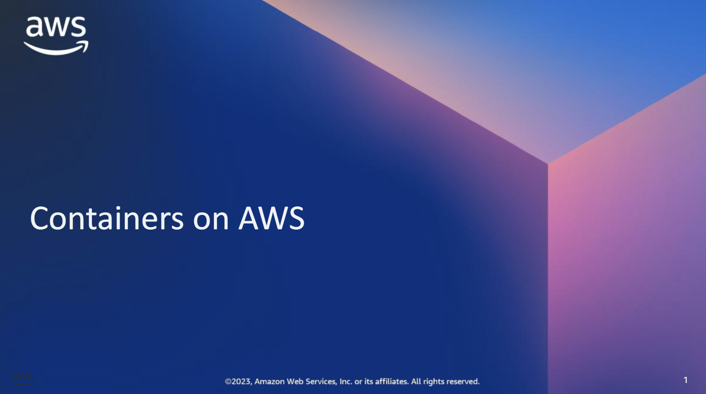

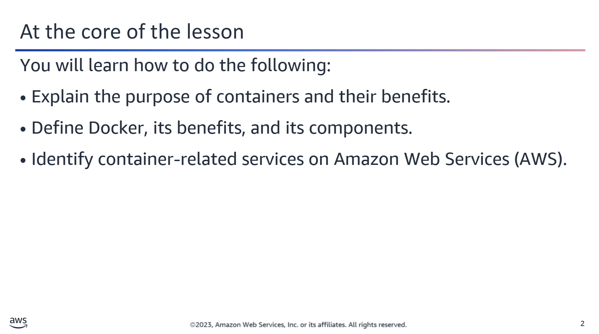

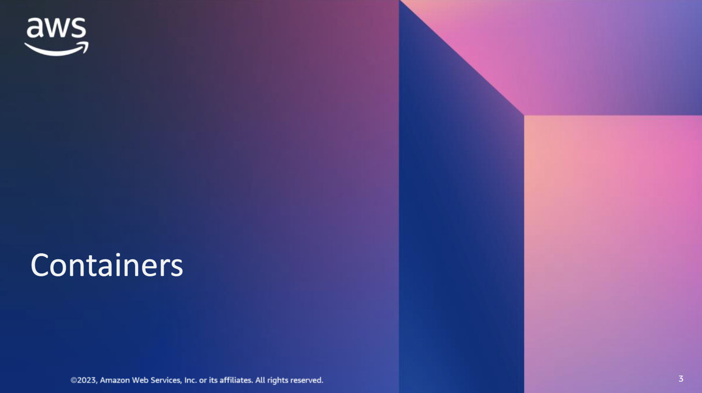

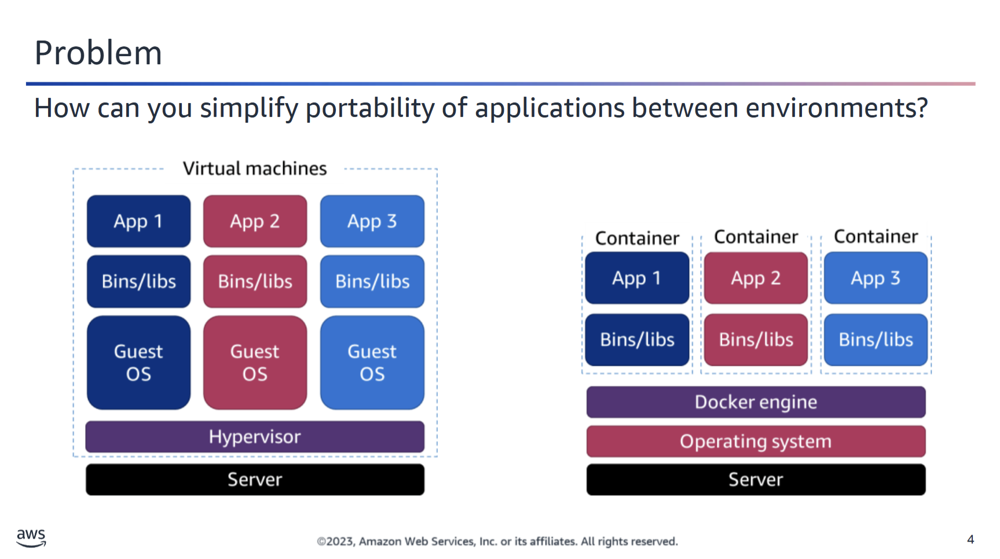

## 🐳 Containers – Before Their Introduction

Prior to the introduction of containers, developers and administrators were often faced with a challenging web of complex compatibility restrictions. Applications or workloads were typically built specifically for their predetermined environments.

If a workload needed to be migrated — for example:
- From bare metal to a virtual machine (VM)
- From a VM to the cloud
- Or between service providers

— the migration usually required **rebuilding the application** to ensure compatibility in the new environment. This process was time-consuming, error-prone, and inefficient.

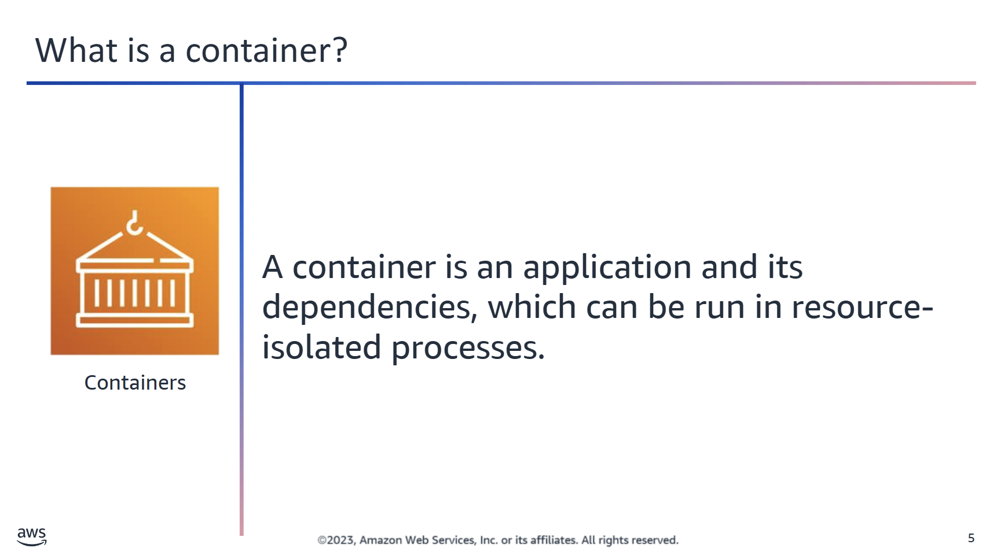

## 🧱 Containers vs. Virtual Machines (VMs)

The capabilities of containers might intuitively seem similar to virtual machines (VMs), but the differences lie in the details:

- **VMs** are isolated environments that include their own operating system (OS), binaries, and libraries. They run on top of a **hypervisor**.
- **Containers** are also isolated environments, but they **share the host OS kernel** and, where appropriate, share binaries and libraries.

### 🔍 Key Differences

- **No Hypervisor**: Containers do not require a hypervisor. Instead, they run directly on any Linux system with the necessary kernel features and the Docker daemon.
- **Portability**: Because of this, containers are highly portable. They can run on:
  - Your laptop
  - A virtual machine
  - An Amazon EC2 instance
  - A bare metal server
- **Performance**: The absence of a hypervisor means containers have almost **no performance overhead**. Processes inside containers communicate directly with the host kernel and are largely unaware that they are in a container.
- **Speed**: Most containers boot in **just a few seconds**, making them ideal for fast deployments.

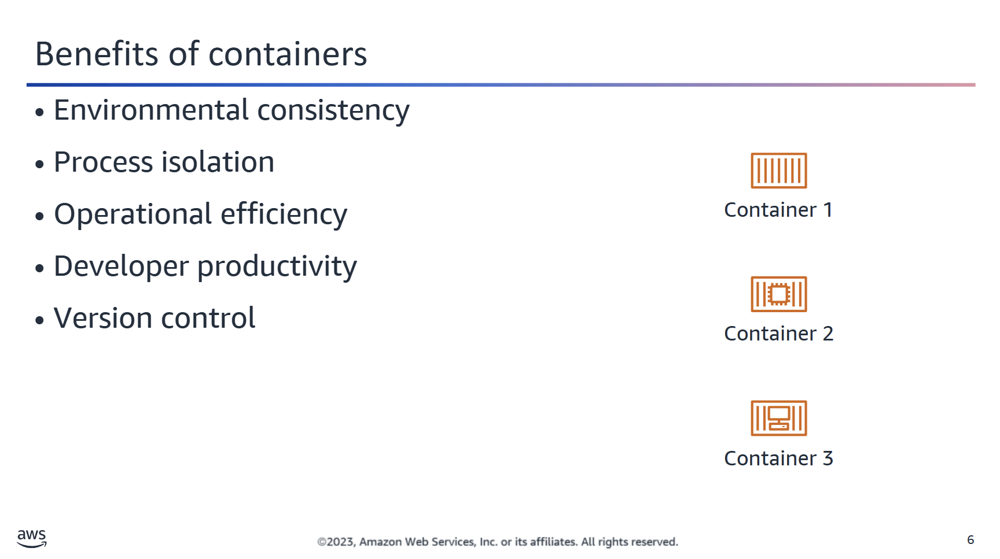

## 📦 Why Use Containers?

Containers deliver **environmental consistency** by packaging an application’s **code**, **configurations**, and **dependencies** into a single object. This design ensures that applications can run reliably across different environments.

### 🛠️ Key Benefits

- **Environment Agnostic**: Containers can be deployed on any compute resource—regardless of software, OS, or hardware configurations.
- **Process Isolation**:
  - Each container is isolated from the others.
  - There are no shared dependencies or incompatibilities.
  - What works locally will work the same in testing and production.

### ⚙️ Operational Efficiency

- You can run **multiple applications** on the same instance.
- Specify **memory**, **disk space**, and **CPU** limits per container.
- Containers **boot quickly**, allowing short-lived tasks or applications to start and stop with minimal delay.
- Scale applications **up or down rapidly** based on demand.

### 👩‍💻 Developer Productivity

- Reduce cross-service dependencies and eliminate conflicts.
- Split applications into multiple containers, each running its own **microservice**.
- Because containers are isolated:
  - Libraries and dependencies are managed independently.
  - Services can be upgraded individually without impacting others.

### 🗂️ Version Control with Docker

Docker containers support version tracking through the **Dockerfile**:

- Maintain and track versions of a container image.
- Inspect differences between versions.
- Easily **roll back** to a previous version if needed.

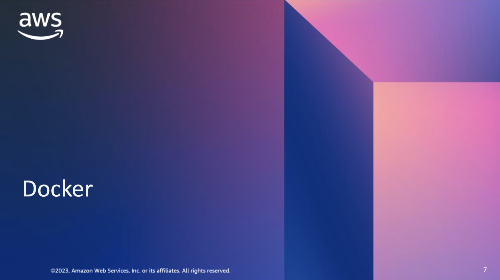

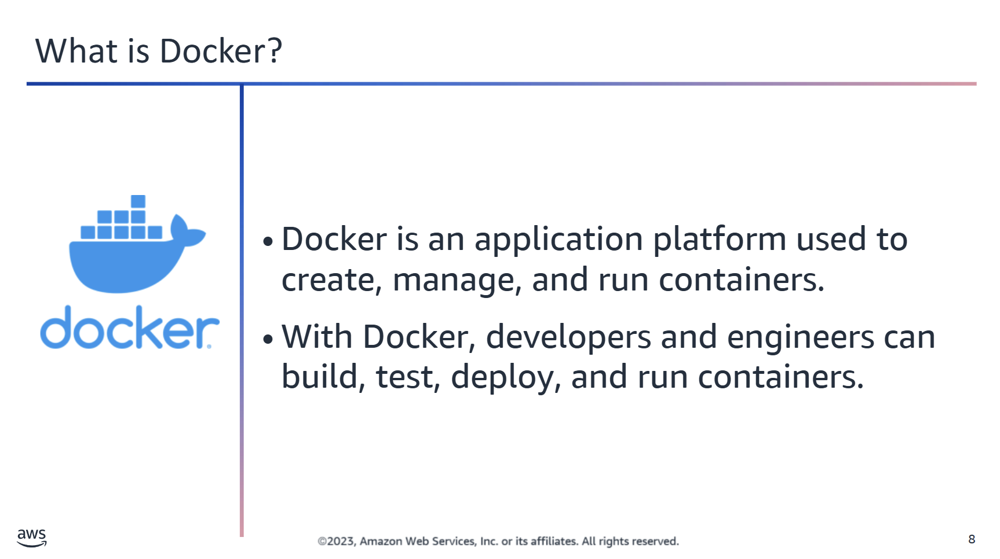

## 🐳 What Is Docker?

**Docker** is a software platform that packages software—such as applications—into **containers**. These containers include everything that the software needs to run: code, runtime, libraries, and system tools.

With Docker, developers and engineers can **build**, **test**, and **deploy** applications efficiently across different environments.

---

### ⚙️ How Docker Works

- Docker is installed on each server that will host containers.
- It provides commands to **build**, **start**, or **stop** containers.
- Docker containers are **lightweight** and **portable**, containing only what’s necessary for the application to run.

---

### 🚀 Use Cases and Benefits

Docker is best used when you need to:

- ✅ **Standardize environments** to ensure consistent behavior across dev, test, and production.
- 🔁 **Reduce conflicts** between language stacks and runtime versions.
- ☁️ Use **containers as a service (CaaS)** for scalable infrastructure.
- 🧱 Run **microservices** using repeatable, standardized deployments.
- 📦 Ensure **portability** of workloads for distributed or hybrid data processing.

---

Docker helps streamline software development and deployment by abstracting away infrastructure-specific dependencies.

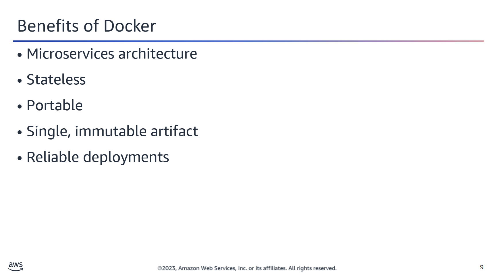

## Benefits of Docker Containers

Docker’s popularity stems from its many **organization-wide benefits**—impacting developers, operations teams, and QA engineers alike. The **primary advantages** are:

- ⚡ **Speed**
- 🔁 **Consistency**
- 📦 **Density**
- 🎯 **Flexibility**

---

### Microservices Architecture

Docker encourages a **one service per container** approach:

- For applications with multiple components (e.g., web server, database, background worker), run **one container per process**.
- This approach supports **granular updates**. You can update the web server container without affecting the database container.
- Ideal for **microservices-based architectures**.

---

### Stateless Design

- Docker containers are considered **stateless**.
- They consist of **read-only layers**, meaning the container image does not change once built.
- This immutability increases reliability and repeatability.

---

### Portability

- Docker containers are **decoupled** from the underlying OS, storage, and networking.
- This makes them highly **portable** across environments: laptop, virtual machine, cloud, or bare metal.
- A container that runs locally will **run the same in production**.

---

### Single, Immutable Artifact

- Docker packages your application and all its **dependencies** into a single artifact.
- This container can be versioned, shared, and redeployed consistently.

---

### Reliable Deployments

- Docker eliminates the classic **"works on my machine"** problem.
- Developers can create containers that **exactly match** the production environment.
- Once tested, the container is **published directly to the cloud**, ensuring consistent runtime behavior.

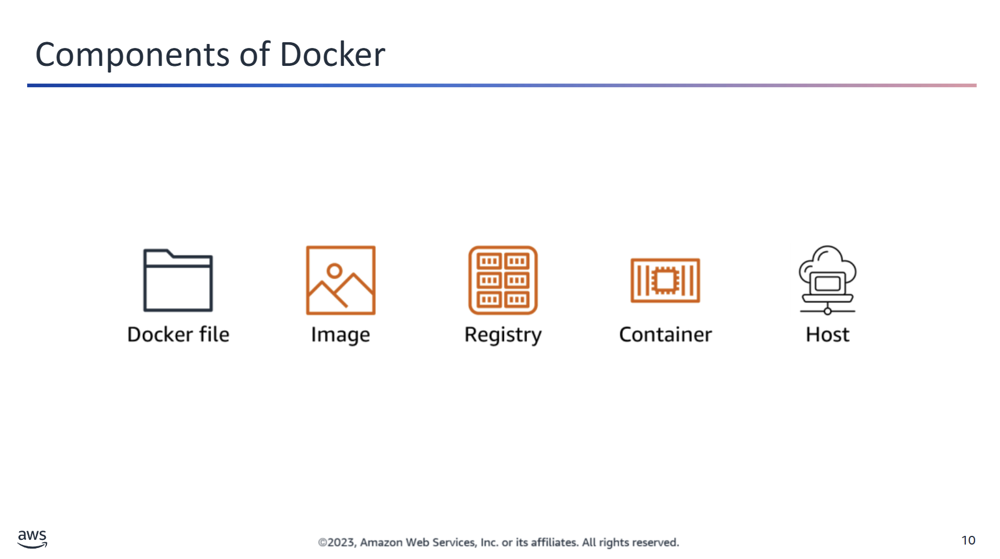

### Key Components of Docker

The following are key components of Docker:

- **Dockerfile**: The blueprint used to build a Docker image
- **Image**: A file for Docker containers at runtime
- **Registry**: The version control system for Docker images (a centralized image repository)
- **Container**: A runnable instance of an image
- **Host**: A machine that runs, or hosts, containers

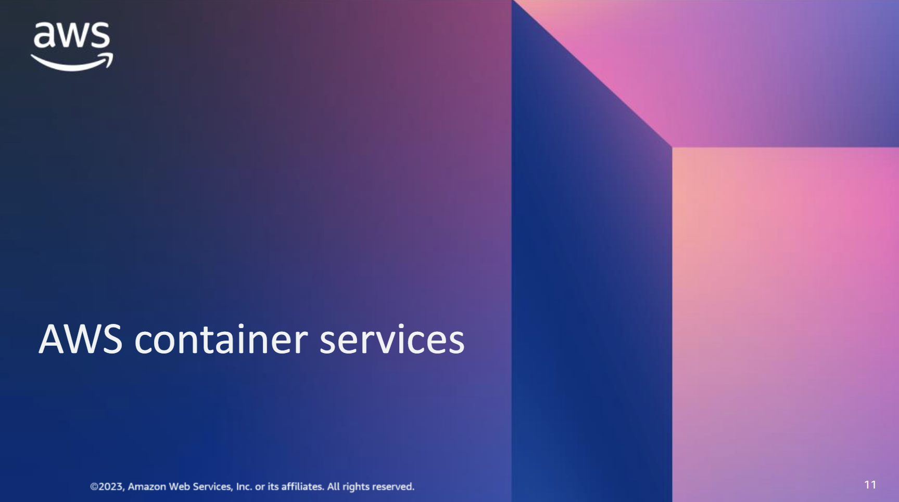

### AWS Container Services Landscape

The current AWS container services landscape covers a broad set of products.

- **Registry**:  
  AWS provides a registry service, **Amazon Elastic Container Registry (Amazon ECR)**, where you can store your container images.

- **Management**:  
  Management involves the deployment, scheduling, and scaling of containerized applications.  
  - **Amazon Elastic Container Service (Amazon ECS)** provisions new application container instances and compute resources.  
  - **Amazon Elastic Kubernetes Service (Amazon EKS)** is used to deploy, manage, and scale containerized applications using Kubernetes on AWS.

- **Hosting**:  
  Hosting refers to where the containers run.  
  - You can run containers on **Amazon ECS** using the **Amazon EC2 launch type**, where you manage the underlying instances.  
  - Alternatively, use the **AWS Fargate launch type** to run containers in a serverless manner.

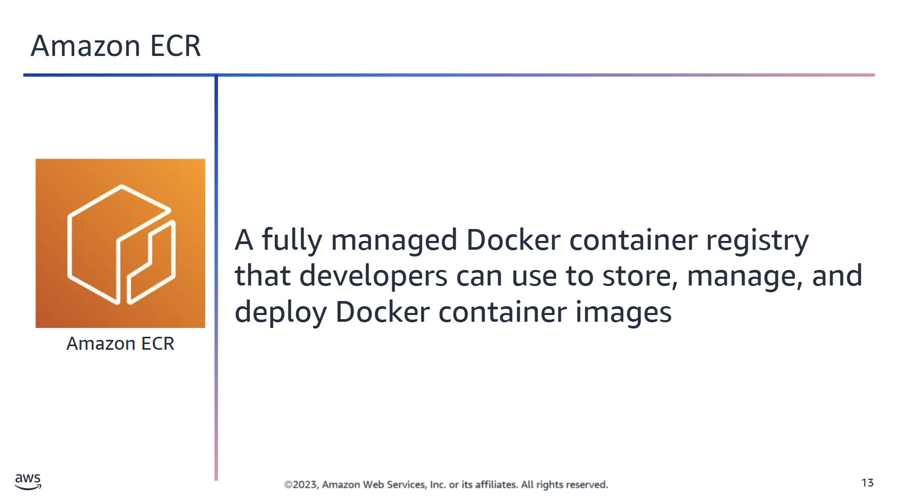

### 🐳 Amazon Elastic Container Registry (Amazon ECR)

Amazon ECR is a fully managed Docker container registry. With Amazon ECR, developers can store, manage, and deploy Docker container images.

Amazon ECR is integrated with **Amazon ECS**, enabling seamless retrieval and use of container images for ECS-based applications. Simply specify the Amazon ECR repository in your ECS task definition.

#### 🔁 Compatibility and Workflow Integration
- Supports **Docker Registry HTTP API v2**, so you can use familiar Docker CLI commands or tools.
- Accessible from any Docker environment: cloud, on-premises, or local development machines.

#### 🗃️ Storage and Availability
- Container images are stored in **Amazon S3**, benefiting from its high durability and availability.

#### 📁 Repository Organization
- Define and organize repositories using **namespaces**.
- Share repositories with users and AWS accounts by controlling API actions per user.

#### 🔐 Access Control and Security
- Integrated with **AWS Identity and Access Management (IAM)** for fine-grained access control.
- Images are transferred via **HTTPS** and encrypted at rest using **Amazon S3 server-side encryption**.

#### 🤝 Extensibility
- Supports **third-party integrations**, allowing flexibility in CI/CD pipelines or external tooling.

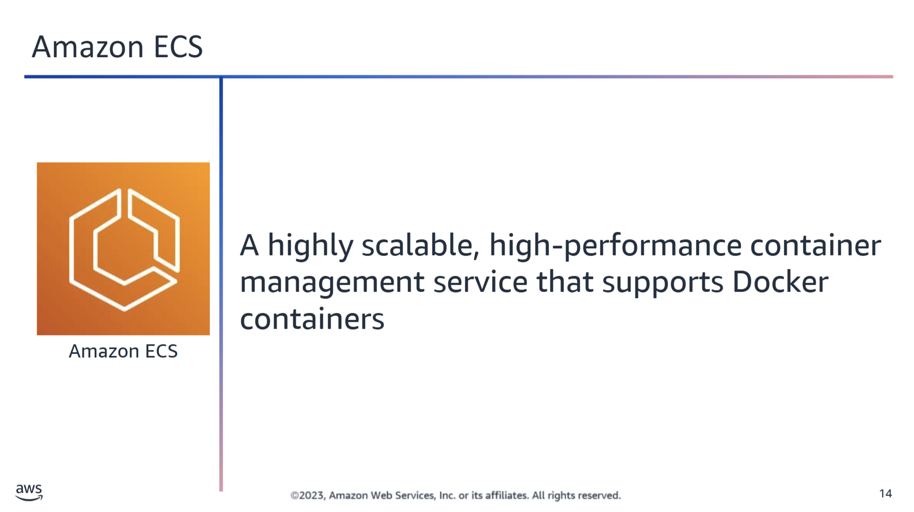

### 🧩 Amazon Elastic Container Service (Amazon ECS)

Amazon ECS provisions new **application container instances** and **compute resources** based on your scaling policies and ECS configurations. Note that **infrastructure resources** like load balancers need to be created outside of ECS.

---

### ☁️ Deployment and Scheduling

- Run applications on a **managed cluster of EC2 instances**.
- Supports **flexible scheduling**:
  - Built-in ECS scheduler
  - Third-party schedulers like **Apache Mesos**
  - Task, service, or daemon scheduling
- ECS APIs enable integration with:
  - Custom schedulers
  - CI/CD and software delivery pipelines

---

### 🔐 Networking and Security

- Containers are launched in your own **Amazon VPC**, allowing the use of:
  - VPC security groups
  - Network ACLs
- **No compute resources are shared** with other customers.
- Use **IAM** for:
  - Granular container-level access control
  - Restricting resources per container or service
- ECS isolation features support **secure and reliable applications**.

---

### ⚙️ Scalability and Performance

- Built on years of experience with **highly scalable AWS services**.
- Launch **tens to tens of thousands** of Docker containers within seconds.
- Minimal complexity for large-scale deployments.

---

### 📝 Task Definitions

Amazon ECS tasks are defined via a **declarative JSON template** called a _task definition_.

A task definition includes:

- Docker repository and image
- Memory and CPU requirements
- Shared data volumes
- Container relationships

You can launch **multiple tasks** from a single task definition after registering it with the service.

### ☸️ Kubernetes & Amazon EKS

**Kubernetes** is an open-source system for automating the deployment, scaling, and management of containerized applications. To use Kubernetes, you need a **cluster** to run your applications.

---

### 🤖 Amazon Elastic Kubernetes Service (Amazon EKS)

**Amazon EKS** manages the Kubernetes control plane for you:

- Runs three Kubernetes managers across **three Availability Zones** for high availability.
- Automatically detects and replaces unhealthy managers.
- Provides automated version upgrades and patching.

---

### 🔗 AWS Service Integrations

Amazon EKS integrates with multiple AWS services to provide scalability and security:

- **Elastic Load Balancing (ELB)** for traffic distribution
- **IAM** for authentication and access control
- **Amazon VPC** for network isolation
- **AWS PrivateLink** for private network access
- **AWS CloudTrail** for auditing and logging

---

### 🧩 Compatibility & Tooling

- EKS runs the **latest open-source Kubernetes version**.
- Fully compatible with standard Kubernetes tools and plugins.
- You can run workloads across on-premises and cloud environments seamlessly.

---

### ⚙️ Operational Flexibility

You can install, manage, and update common operational software for your clusters via:

- **Amazon EKS Console**
- **AWS CLI**
- **Amazon EKS API**

All software is validated by AWS and can be deployed during setup or updated anytime.

---

### ⚠️ Production Challenges

Managing Kubernetes yourself introduces several operational challenges:

- **Control Plane Management**:
  - Choose proper instance types
  - Distribute across multiple Availability Zones
  - Monitor health and replace faulty nodes

- **Security & Upgrades**:
  - Patch and upgrade control plane and nodes manually
  - Requires deep expertise and operational overhead

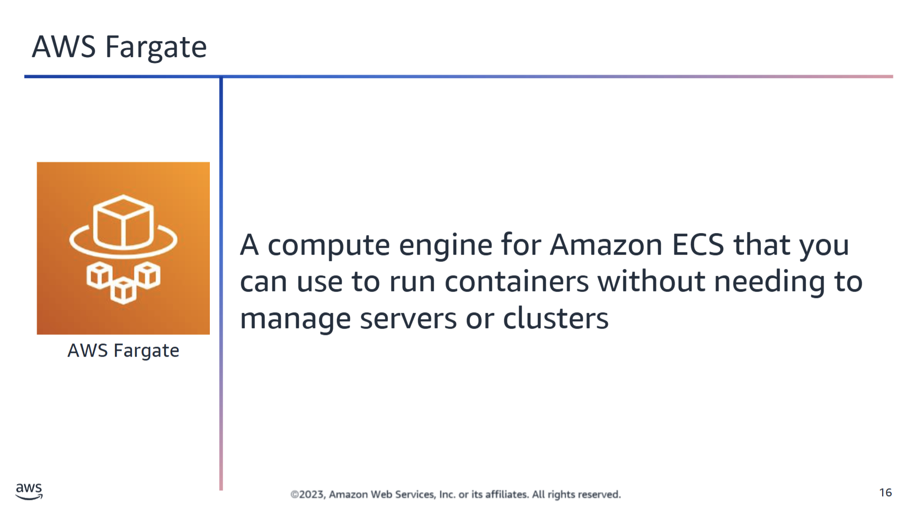

### 🐳 AWS Fargate

**AWS Fargate** is a serverless compute engine for containers. It allows developers to focus on running containers without needing to manage the underlying servers or clusters.

---

### 🚀 Key Benefits

- **No server management**:  
  You no longer need to provision, configure, or scale clusters of virtual machines. Fargate handles the infrastructure.

- **Orchestrator compatibility**:  
  Fargate works with both **Amazon ECS** and **Amazon EKS**, allowing you to choose the orchestration method that suits your workflow.

- **Pay-per-use pricing**:  
  You are billed only for the **resources your containers consume**, on a per-second basis.

- **Simplified logging and analytics**:  
  For **Amazon EKS**, you can forward container logs from pods running on Fargate to:
  - Amazon CloudWatch
  - Amazon OpenSearch Service
  - Amazon Kinesis Data Firehose
  - Amazon Kinesis Data Streams

- **Developer-focused**:  
  With Fargate, you define your application and resource requirements, and AWS takes care of everything else—so you can **focus on building your app**, not the infrastructure.

---

### 🛠️ Before Fargate

Previously, even with Amazon ECS or self-managed Kubernetes, developers had to:
- Provision and manage clusters
- Handle scaling policies
- Perform OS-level patching and updates

Fargate removes these tasks completely by offering a **fully managed container runtime**.

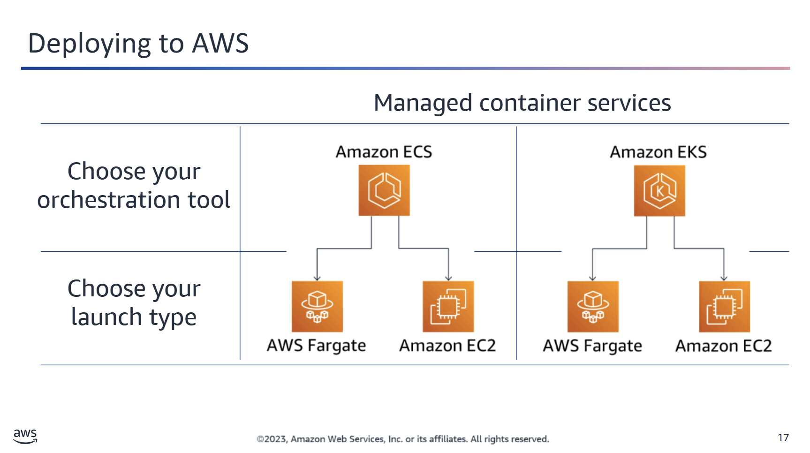

### 🧭 Deploying Managed Container Solutions on AWS

Deploying your managed container solutions on AWS involves selecting:

- An **orchestration tool**  
- A **launch type**

---

### 🧱 Orchestration Tools

- **Amazon ECS (Elastic Container Service)**  
  A fully managed container orchestration service that provides a **secure**, **reliable**, and **scalable** way to run containerized applications on AWS.

- **Amazon EKS (Elastic Kubernetes Service)**  
  A fully managed **Kubernetes** service that offers the same **security**, **reliability**, and **scalability**—but uses the Kubernetes ecosystem for container orchestration.

---

Choose ECS if you want tight AWS integration and simplicity.  
Choose EKS if you prefer the Kubernetes ecosystem with AWS managing the complexity.

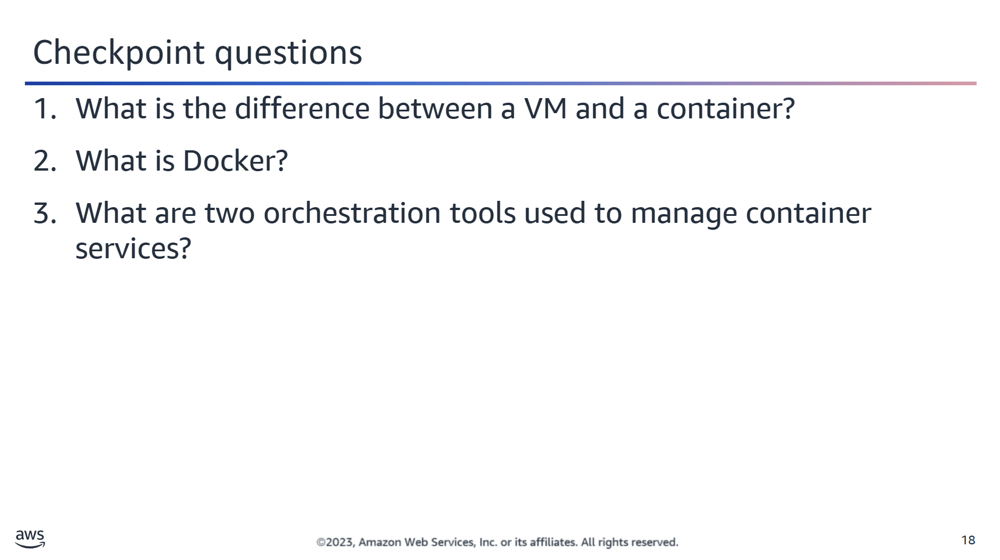

<strong>1. What is the difference between a VM and a container?</strong>

A VM virtualizes hardware, and a container is a virtualized OS. Containers are smaller and do not contain an entire OS.  
Instead, containers share a virtualized OS, and they run as resource-isolated processes, which helps ensure quick, reliable, and consistent deployments.

<strong>2. What is Docker?</strong>

Docker is a software platform that packages software (such as applications) into units that are called containers.

<strong>3. What are two orchestration tools used to manage container services?</strong>

Amazon ECS and Amazon EKS

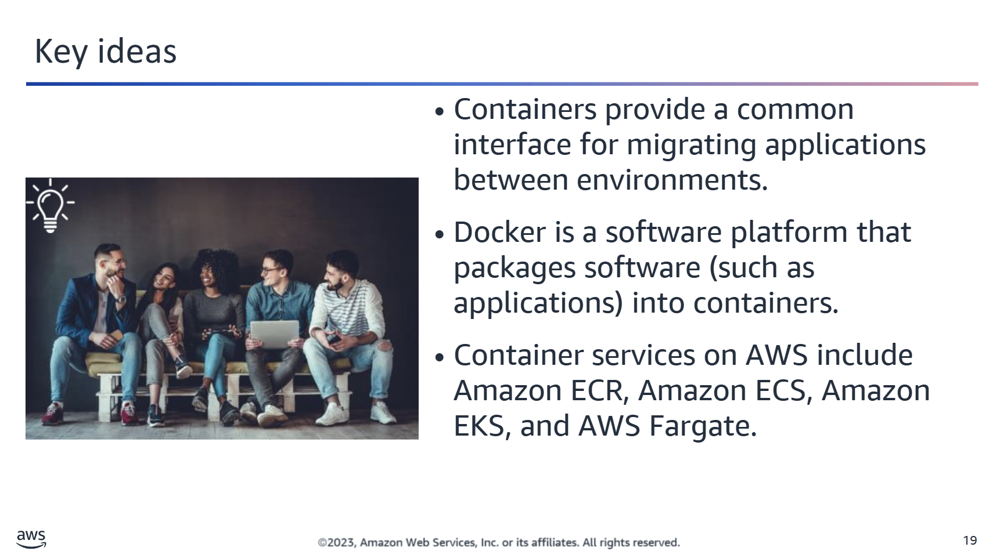
