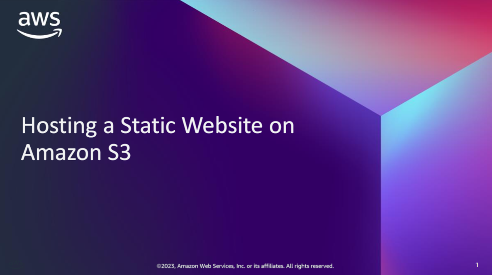
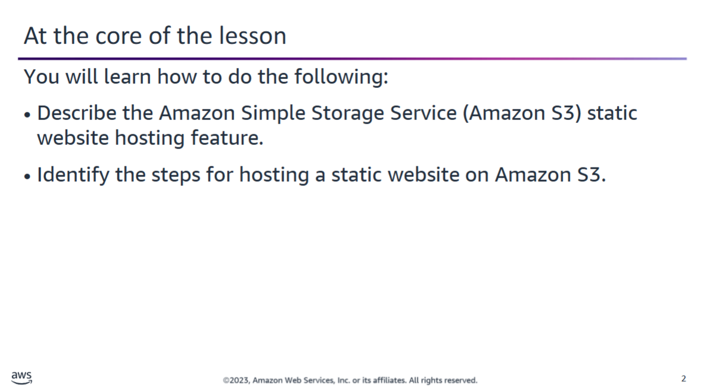
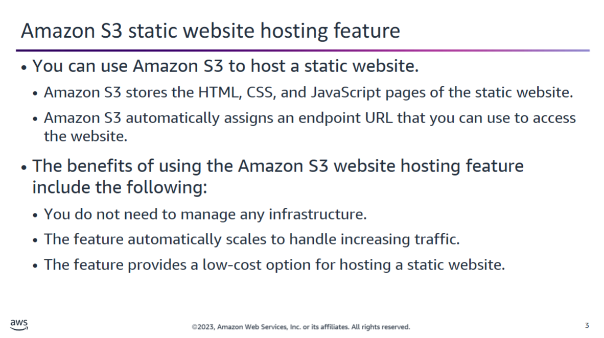
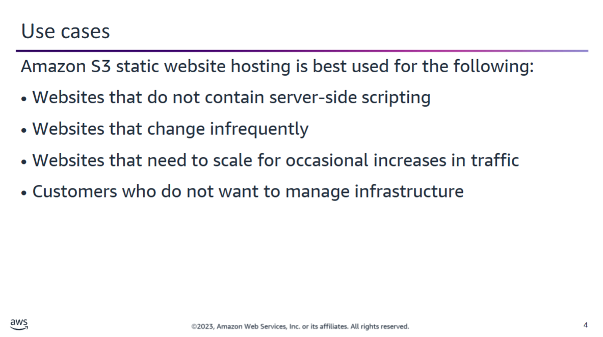
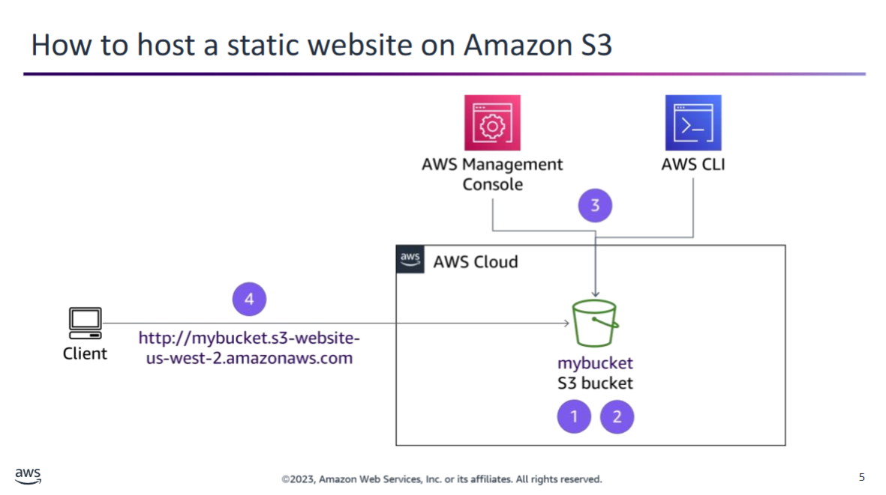
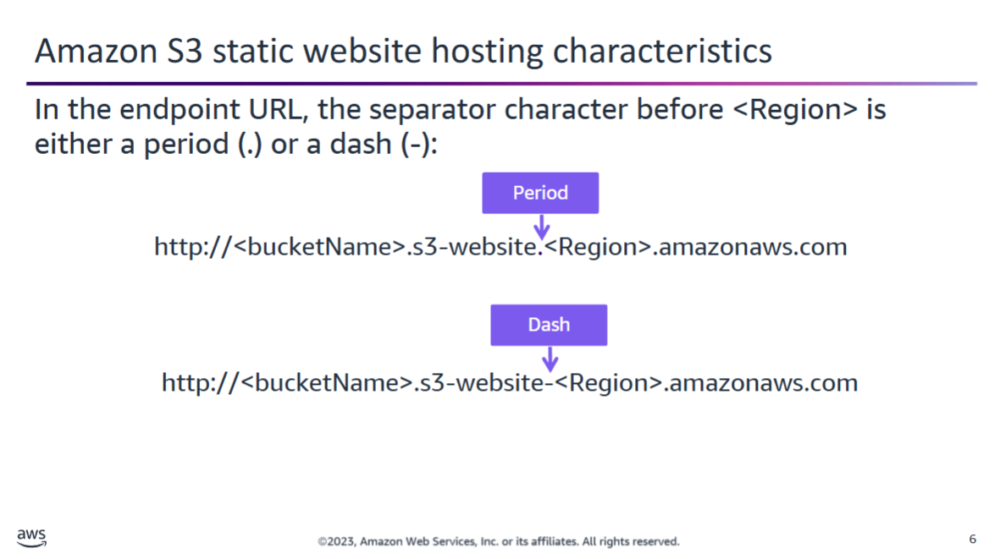
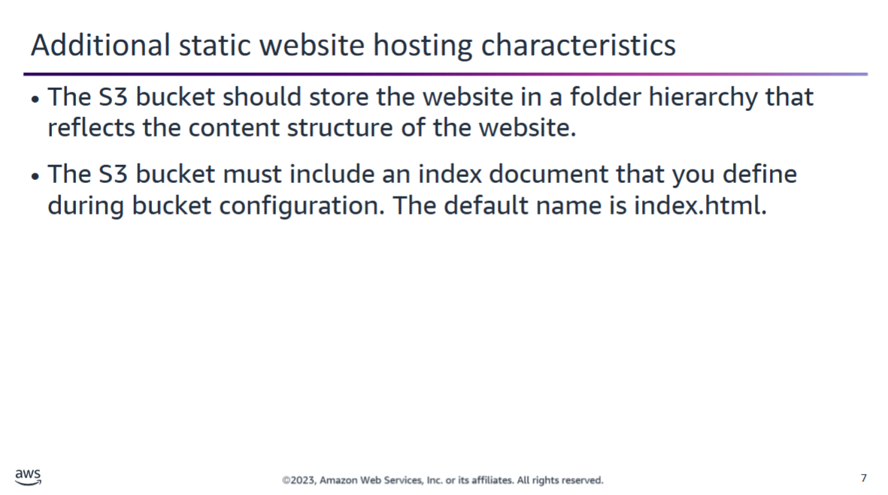
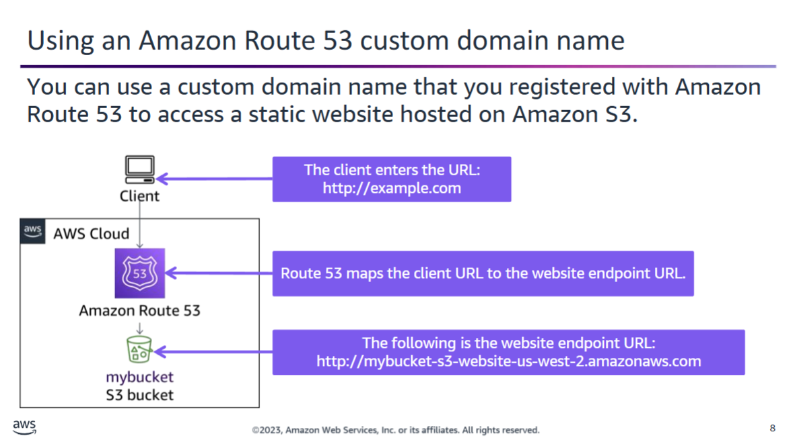
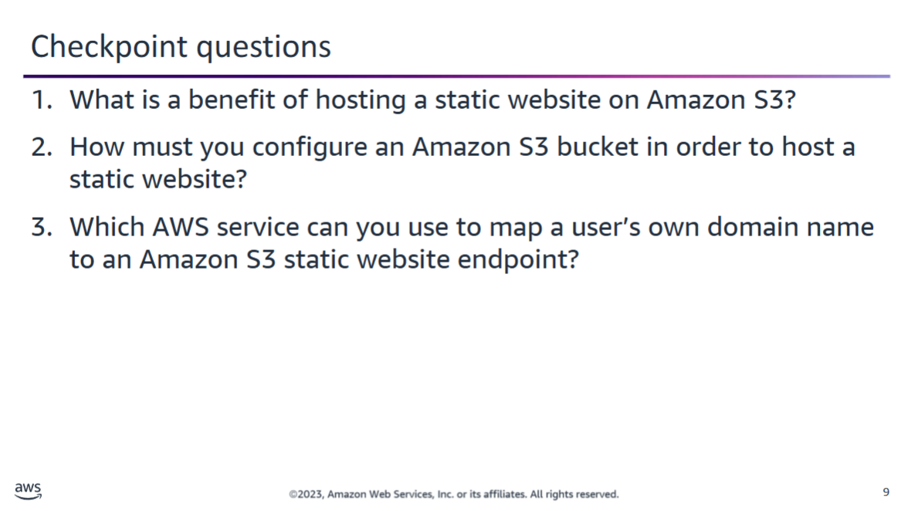

Recall that **Amazon Simple Storage Service (Amazon S3)** provides **object storage** and has many practical uses. One of its key uses is **hosting a static website**.

### Static Website Hosting with Amazon S3

- **Static websites** are built using client-side technologies like **HTML**, **CSS**, and **JavaScript**.
- **Dynamic websites** rely on **server-side processing** (e.g., PHP, JSP, ASP.NET).

### Benefits of Using Amazon S3 for Static Websites

- **No need for runtime infrastructure** – avoids the complexity and cost of managing servers.
- **Low-cost and low-maintenance** solution.
- **Highly reliable and scalable** – suitable for serving static content to a wide audience without manual intervention.



Amazon S3 can host a website that has client-side scripts because such a website is considered static.

One limitation of Amazon S3 is that it can serve only HTTP requests to a website. If you need to support HTTPS, you can use Amazon CloudFront to serve the static website hosted on Amazon S3. 



### Hosting a Static Website on Amazon S3

To host a static website on Amazon S3, follow these steps:

1. **Create an S3 bucket**  
   - This bucket will store your website content.  
   - Example: `mybucket`

2. **Configure the bucket for website hosting**  
   - Enable **static website hosting** in the bucket properties.  
   - Set **index** and **error** document names.  
   - Configure **bucket policy** to allow **public read access** to your content.

3. **Upload your website files**  
   - Use the **AWS Management Console** or **AWS CLI** to upload HTML, CSS, JavaScript, and image files.

4. **Access the website**  
   - Amazon S3 assigns a website **endpoint URL**.  
   - The URL format is:  
     `http://<bucket-name>.s3-website-<AWS-region>.amazonaws.com`  
   - Example:  
     `http://mybucket.s3-website-us-west-2.amazonaws.com`



### Amazon S3 Static Website Endpoint URL Formats

When you host a static website on Amazon S3, AWS assigns an **endpoint URL** based on the bucket name and Region. The format of this URL can vary slightly depending on the **AWS Region** in which the bucket is created.

#### Key Points:
- The URL always contains:
  - The **bucket name**
  - The **Region name**
- The **separator** before the Region name can be either:
  - A **dash (-)**
  - A **period (.)**

#### Examples:

- **US West (Oregon)** Region  
  Separator: **dash** (`-`)  
  URL format:  
  `http://mybucket.s3-website-us-west-2.amazonaws.com`

- **Europe (Frankfurt)** Region  
  Separator: **period** (`.`)  
  URL format:  
  `http://mybucket.s3-website.eu-central-1.amazonaws.com`



### Organizing Web Content in Amazon S3 for Static Website Hosting

When hosting a static website on Amazon S3:

- **Store web content** using a **folder hierarchy** that reflects the structure of your website.
  - This makes it easier to manage and maintain your content.
  - Example folder structure:
    ```
    / (root)
    ├── index.html
    ├── about/
    │   └── index.html
    ├── css/
    │   └── styles.css
    └── js/
        └── app.js
    ```

- **Enable website hosting** in the S3 bucket settings.
  - You must specify the **index document** (e.g., `index.html`).
  - This file acts as the **default page**:
    - When a user accesses the **root URL**, S3 returns `/index.html`.
    - When a user accesses a subdirectory (e.g., `/about/`), S3 returns `/about/index.html` (if it exists).

✅ Be sure to upload your **index document** to the appropriate folder level so it can be served correctly by Amazon S3.



### Using a Custom Domain with an Amazon S3 Static Website

Instead of accessing a static website via the default Amazon S3 endpoint URL, you can use your **own custom domain** by integrating **Amazon Route 53**:

#### Example Scenario:
- Website content is stored in an S3 bucket named `mybucket`.
- Default endpoint URL: `http://mybucket.s3-website-us-west-2.amazonaws.com`
- Desired custom domain: `example.com`

#### Steps to Map Your Domain:

1. **Create or use an existing hosted zone** for `example.com` in Amazon Route 53.
2. **Create an alias record** in Route 53:
   - **Record type**: `A – IPv4 address`
   - **Name**: `example.com`
   - **Alias**: Yes
   - **Alias target**: Select the S3 website endpoint from the list
3. **Ensure the S3 bucket is named exactly** `example.com` and is configured for static website hosting.

🔁 After propagation, visitors can access the website at `http://example.com`, and Route 53 will route the traffic to the appropriate S3 bucket.



<details>
  <summary>1. What is a benefit of hosting a static website on Amazon S3?</summary>
  <ul>
    <li>You do not need to manage any infrastructure.</li>
    <li>Amazon S3 automatically scales to handle increasing traffic.</li>
    <li>Amazon S3 provides a low-cost option for hosting a static website.</li>
  </ul>
</details>

<details>
  <summary>2. How must you configure an Amazon S3 bucket in order to host a static website?</summary>
  <p>You must configure the S3 bucket to enable website hosting and grant public read permissions to the bucket’s content.</p>
</details>

<details>
  <summary>3. Which AWS service can you use to map a user’s own domain name to an Amazon S3 static website endpoint?</summary>
  <p>Amazon Route 53</p>
</details>


