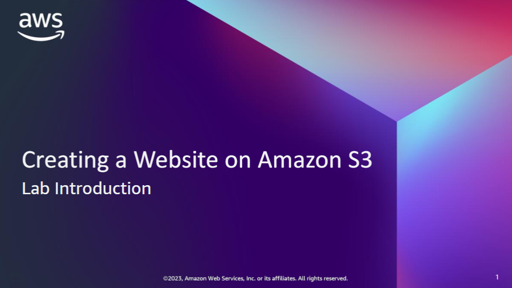

This lesson describes the business scenario and identifies the tasks that you will perform in the Creating a Website on Amazon S3 lab.

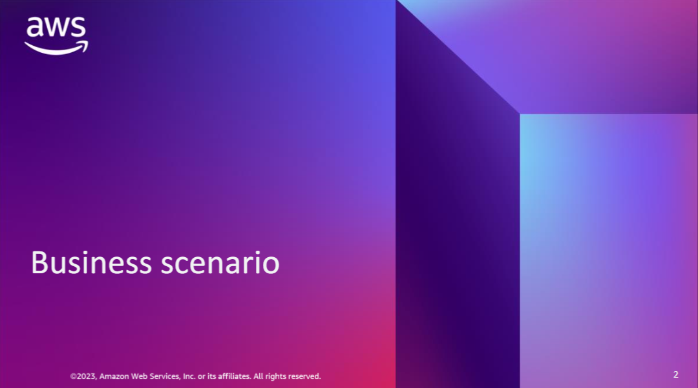

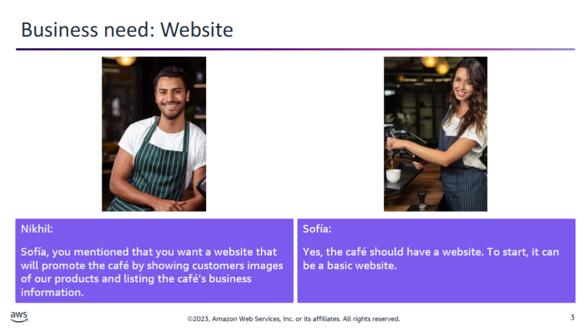

Sofía mentions to Nikhil that she would like the café to have a website that will:

- Showcase the café visually through images
- Provide customers with:
  - The location of the store
  - The business hours
  - The café’s telephone number

For now, the website should be **static**, but there is potential for it to grow into a **dynamic** website in the future — for example, to allow customers to place orders online.

Nikhil responds by saying that he has an idea of how to **create and host a basic website**.

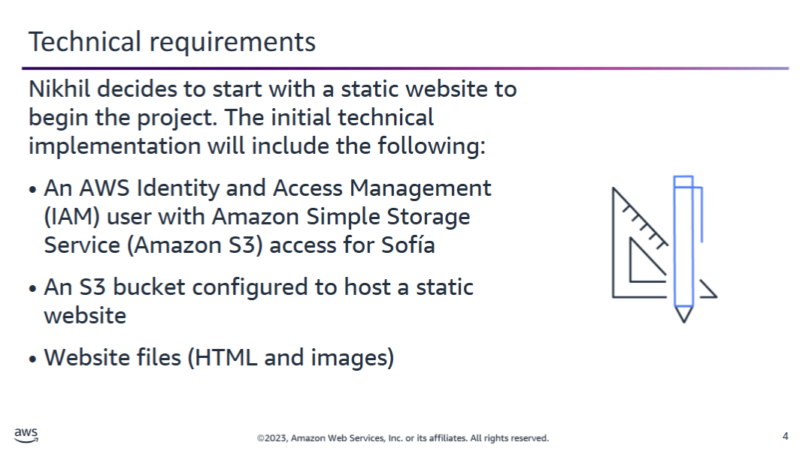

Nikhil decides that the **static website** should be hosted on **Amazon Simple Storage Service (Amazon S3)** and explains the technical requirements to Sofía:

1. **Create an AWS Identity and Access Management (IAM) user** for Sofía.
2. **Grant the IAM user access to Amazon S3**.
3. **Create an S3 bucket** and configure it to **host a static website**.
4. **Upload the website files** to the S3 bucket.

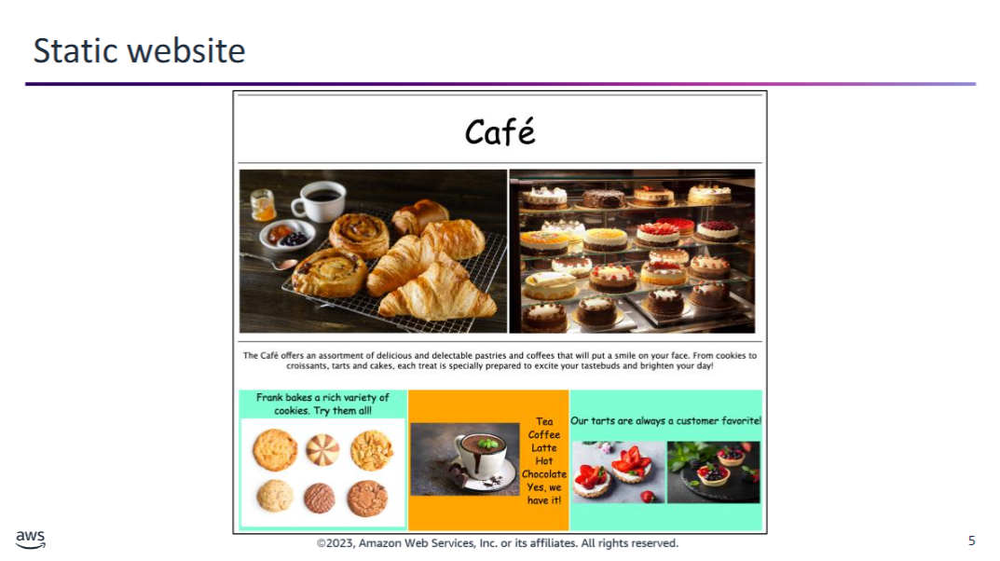

Nikhil creates the static website and hosts it on Amazon S3. He then opens it in a browser and shows it to Sofía. This slide shows a portion of the website’s single page.

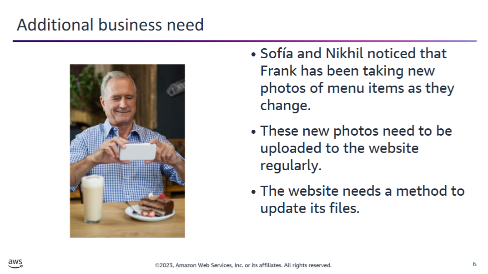

The pictures of menu items on the basic website regularly change as the menu varies. Once Frank takes the photographs of the new items, they need to be uploaded to the website.

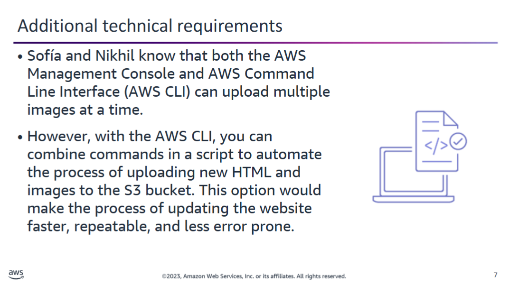

You can use the **AWS Command Line Interface (AWS CLI)** to:

- **Upload multiple images** at the same time.
- Use **AWS CLI commands in scripts** to automate administrative tasks programmatically.

**Nikhil** decides to **create a script** that uses the AWS CLI to **automate the upload of files** to the website’s **S3 bucket**.

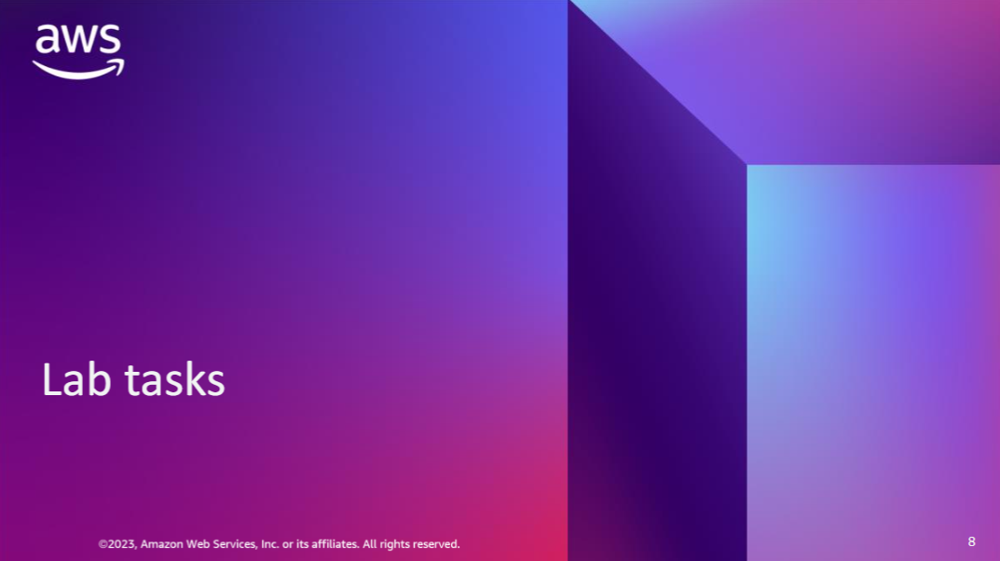

After you complete this lab, clients will be able to access the website that you deployed to Amazon S3.

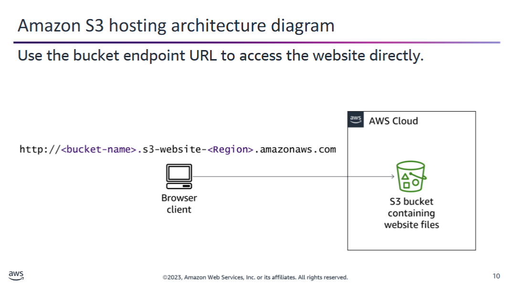

In this lab, the **static café website** is hosted on **Amazon S3**.

After you:

1. **Create the S3 bucket**
2. **Properly configure it** for website hosting

A **client browser** can access the website **directly** by using the assigned **Amazon S3 endpoint URL**.

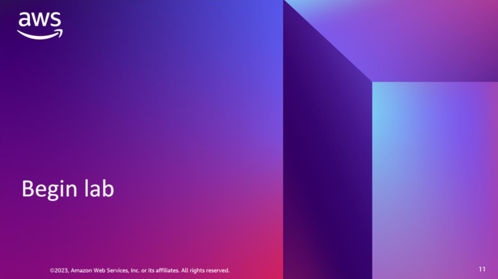

You can now begin the lab. Ask your instructor for help if you need it.

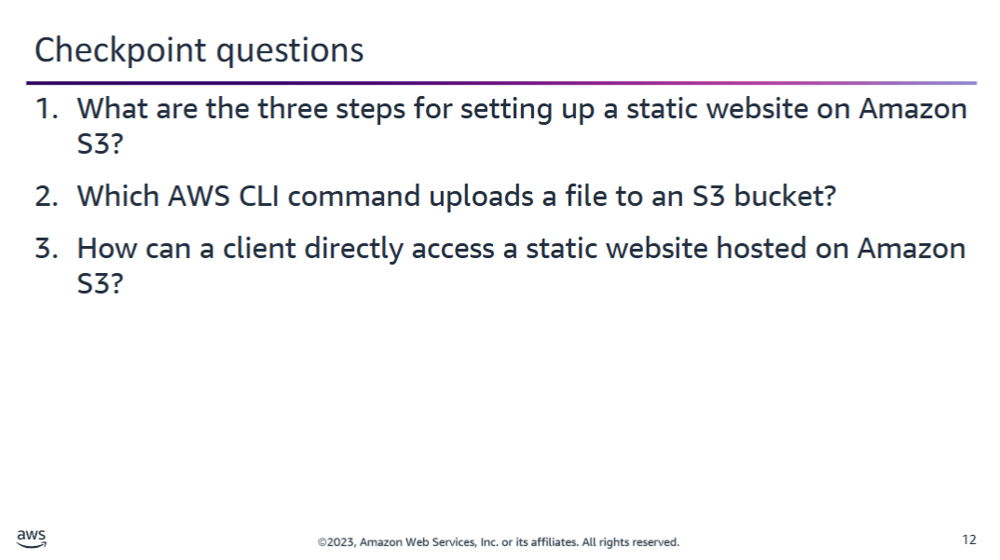

  
Checkpoint Fragen – Amazon S3 Static Website Hosting

  **1. What are the three steps for setting up a static website on Amazon S3?**  
  First, create an IAM user with access to Amazon S3.  
  Then, create an S3 bucket and configure it to host a static website.  
  Finally, upload the website files to the bucket.

  **2. Which AWS CLI command uploads a file to an S3 bucket?**  
  `aws s3 cp`

  **3. How can a client directly access a static website hosted on Amazon S3?**  
  The client uses the website endpoint URL that Amazon S3 assigns to the bucket.

