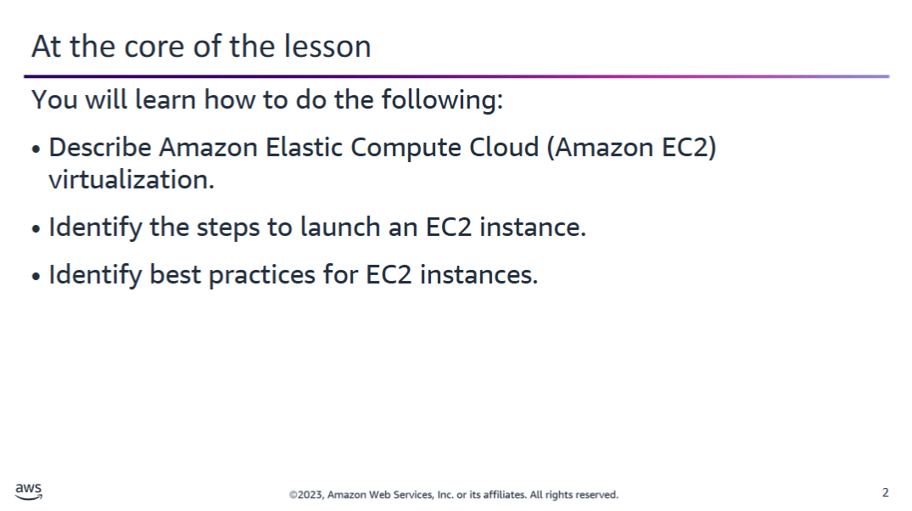

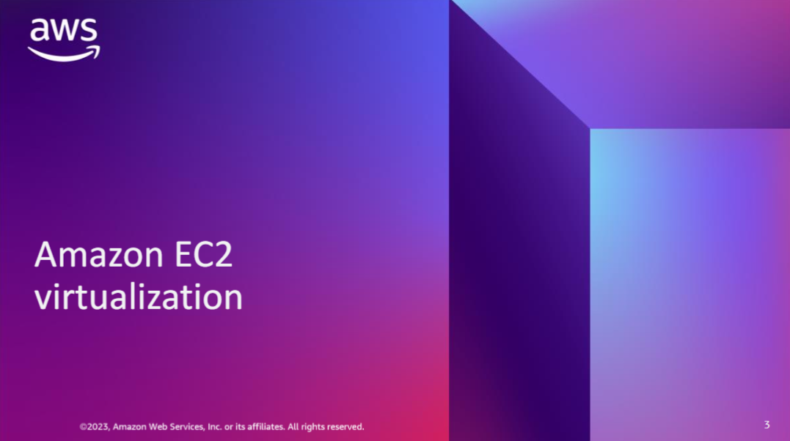

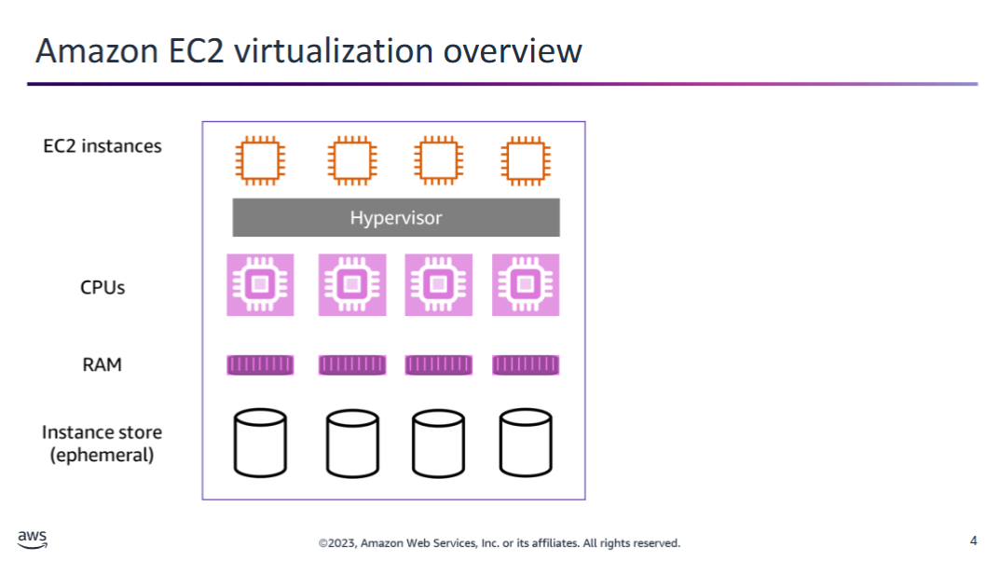

## Amazon EC2 Instances

EC2 instances run as **virtual machines** on host computers that are located in AWS Availability Zones.

Each virtual machine:

- runs an operating system (OS), such as:
  - Amazon Linux
  - Microsoft Windows
- can run applications, including enterprise applications that span multiple virtual machines

### Hypervisor Layer

The virtual machines run on top of a **hypervisor** layer maintained by AWS.  
The hypervisor is the **operating platform layer** that provides EC2 instances with access to the actual hardware.

This hardware includes:

- processors (vCPUs)
- memory (RAM)
- storage

Each EC2 instance receives:

- a specific number of virtual CPUs (vCPUs)
- a defined amount of RAM

### Instance Store (Ephemeral Storage)

Some EC2 instances use an **instance store**, also known as **ephemeral storage**.

- It is **physically attached** to the host computer.
- Provides **temporary block-level storage** for use with an instance.
- **Data persists only** during the lifetime of the instance.

#### Data Persistence Rules

- ✅ If an instance **reboots**: data **persists**
- ❌ If an instance **stops or terminates**: data is **lost and cannot be recovered**

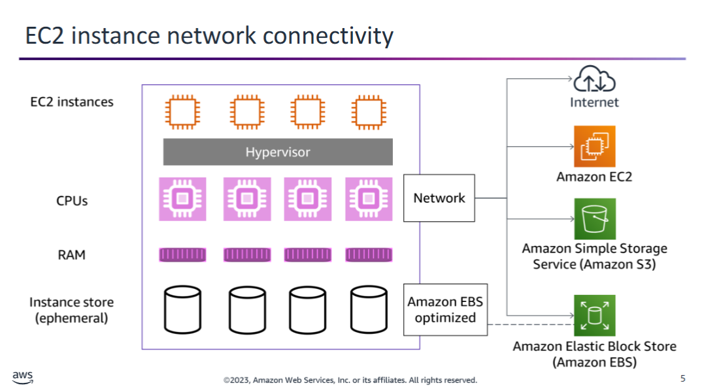

## EC2 Instance Networking and Storage

EC2 instances can **connect to other resources over a network**.

### Amazon EBS vs. Instance Store

Many EC2 instances use **Amazon Elastic Block Store (Amazon EBS)** instead of an instance store for:

- Boot disk
- Additional storage needs

You attach an **EBS volume** to an instance via a **network connection**.

#### Amazon EBS Benefits

- Provides **persistent block storage volumes**
- **Data persists**, even when the instance is in a **stopped state**

### EBS-Optimized Instances

Amazon EBS-optimized instances:

- Minimize **I/O contention** between EBS and other traffic
- Provide **better performance**

> **I/O contention** occurs when virtual machines compete for limited network bandwidth.

### Other Network Connections

EC2 instances can also connect to:

- The **internet**
- Other **EC2 instances**
- **Amazon S3** (Simple Storage Service)

You can **configure network access** to:

- Match your specific needs
- **Balance** accessibility and **security**

Different **instance types** offer different levels of **network performance**.

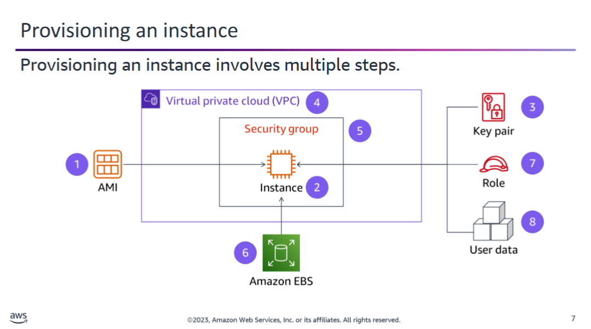

## EC2 Instance Provisioning: Main Steps and Components

This diagram illustrates the **main steps and components** for provisioning an EC2 instance.

> ⚠️ The listed components are **not exhaustive**, but they represent the **most important items** needed to launch a **secure** instance.

### Step-by-Step Overview

1. **Choose an Amazon Machine Image (AMI)**  
   - An **AMI** is the template Amazon EC2 uses to launch an instance.  
   - AWS provides default AMIs.  
   - Third-party AMIs are available in the **AWS Marketplace**.  
   - You can also **create your own AMI** from an existing EC2 instance.

2. **Select an Instance Type**  
   - EC2 offers various **instance types**, optimized for different use cases.  
   - These vary by **CPU**, **memory**, **storage**, and **networking capacity**.

3. **Specify a Key Pair (for SSH/RDP Access)**  
   - Needed if you want to connect using **SSH** (Linux) or **RDP** (Windows).  
   - A **key pair** is a set of credentials (public and private key).  
   - Proves your identity when connecting to the instance.

4. **Configure Network Placement and Addressing**  
   - Choose between **EC2-Classic** (legacy) or a **Virtual Private Cloud (VPC)**.  
   - Decide whether to assign:
     - a **public IP address**
     - a **DNS name**

5. **Assign a Security Group**  
   - A **security group** acts as a **virtual firewall**.  
   - Defines **allowed network traffic** and **open ports** (e.g., 22 for SSH, 80 for HTTP).

6. **Choose Storage Options**  
   - Select boot storage:  
     - **Ephemeral storage**
     - **Amazon EBS volume**  
   - You can also attach **additional block storage volumes**.

7. **Attach an IAM Role (if needed)**  
   - Required if your instance needs to make **API calls to AWS services**.  
   - Attach an **IAM role** via an **instance profile**.

8. **Specify User Data (Optional)**  
   - User data enables **automated setup** (e.g., script execution) at instance launch.  
   - Useful for **automating installations and configurations**.

---

You will learn about these configuration options in more detail in the upcoming sections.

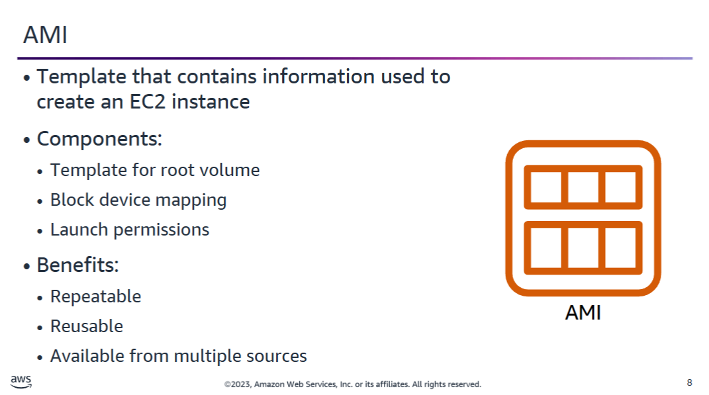

## Amazon Machine Images (AMI)

An **Amazon Machine Image (AMI)** provides the information required to **launch an EC2 instance**.

### What Does an AMI Include?

- A **template for the root volume** (includes:
  - Operating system (OS)
  - Optional: application server
  - Optional: other applications)
- A **block device mapping**, which specifies:
  - Default **EBS volumes**
  - Any **instance store volumes** to attach
- **Launch permissions**, which control:
  - Which AWS accounts can use the AMI
  - Optionally: public access to the AMI

### Usage Scenarios

- You **must specify a source AMI** when launching any instance.
- You can **launch multiple instances** from a single AMI to create uniform configurations.
- You can also **use different AMIs** to launch instances with different setups.

### Creating Custom AMIs

You can create a new AMI **from an existing EC2 instance** at any time.

Example workflow:

1. Launch 3 instances from the **same AMI**.
2. Modify each instance individually (e.g. install software, change settings).
3. Capture each modified instance as a **new AMI**.

➡️ Result: 3 new AMIs, each reflecting the custom changes made to its instance.

### Sources for AMIs

You can use:

- AMIs **provided by AWS**
- AMIs created by the **user community**
- AMIs from the **AWS Marketplace**
- Your own **custom-built AMIs**

### Further Reading

📖 [Amazon Machine Images (AMI) – AWS Documentation](https://docs.aws.amazon.com/AWSEC2/latest/UserGuide/AMIs.html)

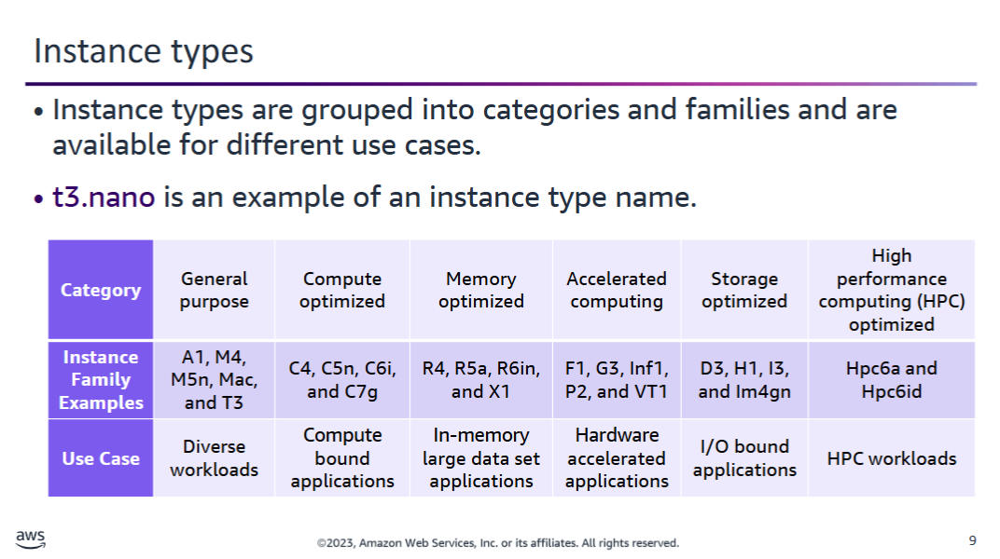

## EC2 Instance Types

An **instance type** defines a specific combination of:

- **CPU**
- **Memory**
- **Storage**
- **Networking capacity**

### Instance Type Variants

There are many instance types available, offering flexibility to match your application's needs:

- **General purpose**: Balanced compute, memory, and networking
- **Compute optimized**: Extra CPU (processing power)
- **Memory optimized**: Extra RAM
- **Storage optimized**: High storage throughput
- **Network optimized**: High network performance

### Categories and Families

- Instance types are grouped by **categories** and **families**
- Choose the most **cost-effective** instance type that supports your **workload requirements**

> ⚠️ The reference table in the slide shows **examples**, not a complete list of all available families.

### Understanding Instance Type Names

An instance type name includes:

- **Family name**
- **Generation number**
- **Size**
- (Optional) Additional properties

Example: `t3.nano`

- `"t"` → Family name
- `"3"` → Generation number
- `"nano"` → Instance size

### Example: `t3.nano`

Launching a `t3.nano` instance provides:

- **2 vCPUs**
- **0.5 GiB of memory**
- **Up to 5 Gbps network performance**
- **Amazon EBS boot volume**

### Further Reading

📖 [Amazon EC2 Instance Types – AWS Documentation](https://aws.amazon.com/ec2/instance-types/)

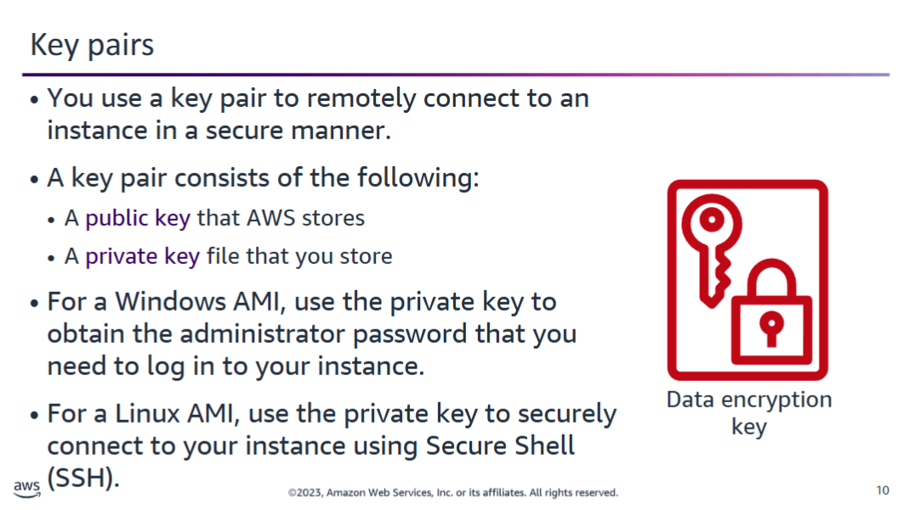

## EC2 Key Pairs and Secure Login

Amazon EC2 uses **public key cryptography** to encrypt and decrypt login information.

### How It Works

- A **public key** is used to **encrypt** data (e.g., a password).
- A **private key** is used by the recipient to **decrypt** the data.
- The two keys together are called a **key pair**.

---

### Key Pair Usage

A **key pair is required** to log in to your EC2 instance.

- It must be **registered** in the **SSH settings** of the OS you're connecting to.
- You **specify the key pair name** when launching the instance.

You can either:

- **Create a new key pair** during the launch process and download it
- **Use an existing key pair** that you already have access to

AWS automatically configures the instance to accept the specified key pair when it is launched.

---

### Connecting to Your Instance

- After the instance has booted, use the **private key** to connect.
- On **Linux instances**:
  - SSH login typically **does not require a password**
  - Login is performed using the **private key**
  - This behavior can be changed using **custom AMIs**
- On **Windows instances**:
  - Use the **key pair** to **decrypt the administrator password**
  - Login via **Remote Desktop Protocol (RDP)**

---

### Further Reading

📖 [Amazon EC2 Key Pairs and Linux Instances – AWS Documentation](https://docs.aws.amazon.com/AWSEC2/latest/UserGuide/ec2-key-pairs.html)

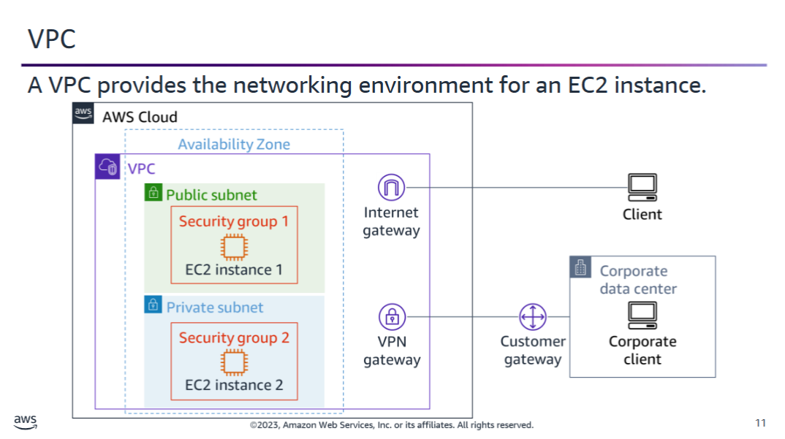

## VPC and Related Components

When you launch an EC2 instance, it is placed in a **network environment**—typically within a **Virtual Private Cloud (VPC)**.

### Amazon VPC Overview

- A **VPC** is a logically isolated **virtual network** in the AWS Cloud.
- It allows you to launch AWS resources, such as **EC2 instances**, in a way that resembles a **traditional on-premises network**.

### Subnets

- Within a VPC, you define one or more **subnets**.
- A **subnet** is a **logical network segment** within the VPC.
- Each subnet exists in a **single Availability Zone**.

---

### Internet Gateway

- An **internet gateway** enables **communication between instances** in your VPC and the **internet**.
- Properties:
  - **Horizontally scaled**
  - **Redundant**
  - **Highly available**

---

### Virtual Private Gateway (VPN Support)

- An optional component for **VPN connections**.
- Sits on the **Amazon side** of the VPN connection.
- You must:
  - Create the **virtual private gateway**
  - Attach it to the desired **VPC**
- On the **customer side**, there is a **customer gateway**, which can be:
  - A physical device
  - A software application

> 🔍 Note: The diagram typically shows **only one VPN setup example**.

---

### Security Groups

- Act as **instance-level firewalls**
- Define **inbound and outbound rules**
- Each **instance** can be assigned to **one or more security groups**
- **Security groups do not act at the subnet level**

Default behavior:

- If no security group is specified at launch, the instance is assigned to the **default security group** for the VPC.

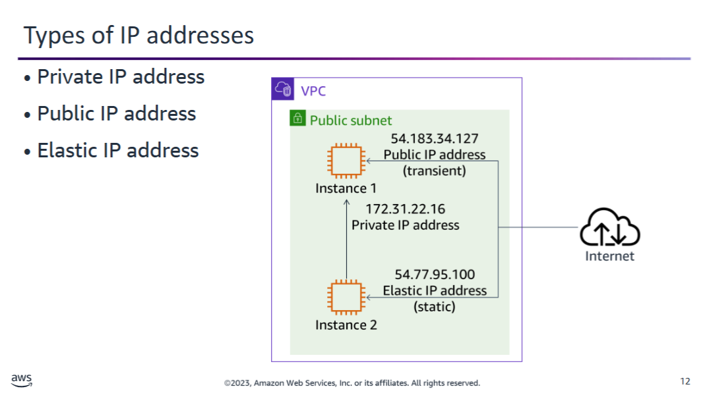

## Types of IP addresses

When you create a new EC2 instance in a **VPC** (including the default VPC), you must consider:

> ❓ **Should users outside your private network have access to the instance?**

---

### Private IP Address

- **Always assigned** to each instance at launch
- Allocated from the **subnet's private IP address pool**
- Used for **internal communication** between EC2 instances in the same VPC

---

### Public IP Address (Dynamic)

- **Optionally assigned** to an EC2 instance
- Allocated from AWS's **public IP address pool**
- Used for **internet access**
- **Behavior**:
  - On **stop/start**: the instance receives a **new public IP address**
  - On **reboot**: the **same public IP address** is retained

---

### Elastic IP Address (Static)

- A **public IP address** allocated from AWS's pool
- **Manually provisioned** and assigned to an instance
- **Static** – remains the same until you release or reassign it
- Can be **reassigned** to another instance at any time

---

### Example Scenario

The diagram illustrates two EC2 instances in a **public subnet** of a VPC:

- **Instance 1**
  - Public IP: `54.183.34.127`
  - Accessed by: Internet client (via public IP)
- **Instance 2**
  - Elastic IP: `54.77.95.100`
  - Accessed by: Internet client (via Elastic IP)
- **Internal communication**
  - Instance 2 accesses Instance 1 via **private IP**: `172.31.22.16`

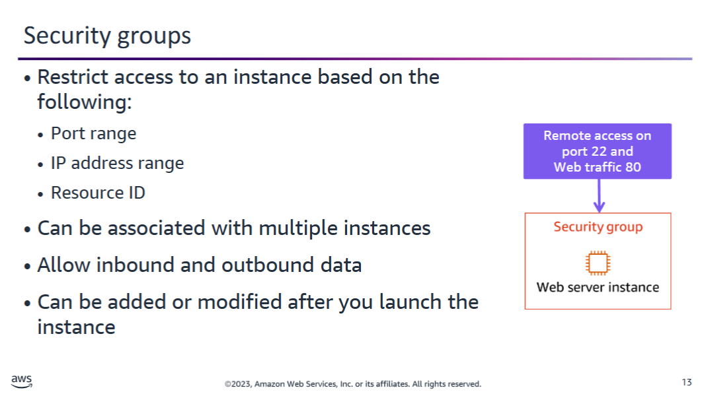

## Security Groups

Each EC2 instance **must have at least one security group** associated with it.

A **security group** is essentially a **stateful firewall** that surrounds one or more EC2 instances to control **inbound and outbound network traffic**.

---

### What Is a Stateful Firewall?

A **stateful firewall**:

- Monitors the **entire state of active network connections**
- Tracks requests and automatically allows response traffic
- Remembers **which traffic was allowed** in either direction

---

### Supported Protocols

Security groups can control traffic for:

- **ICMP** (Internet Control Message Protocol)
- **TCP** (Transmission Control Protocol)
- **UDP** (User Datagram Protocol)

> 🔒 Security groups are applied **per instance**, **not** at the network’s entry point.

---

### Source IP Restrictions

You can restrict traffic based on **source IP addresses**:

- `0.0.0.0/0` → Allows traffic from **any IP**
- Specific IP address (e.g. `203.0.113.0/32`)
- **CIDR ranges** (e.g. `192.168.1.0/24`)
- **Other security groups** within the AWS Cloud

---

### Default Behavior

- When you create a **new security group**:
  - **All outbound traffic is allowed**
  - **No inbound traffic** is allowed by default

---

### Multiple Security Groups

You can:

- **Assign multiple security groups** to a single instance
- **Reuse a single security group** across **multiple instances**

#### Example:

- `admin-sg`: allows **TCP port 22** (SSH access)
- `db-sg`: allows **TCP port 3306** (MySQL access)

➡️ You can assign **both** `admin-sg` and `db-sg` to the **same instance**.

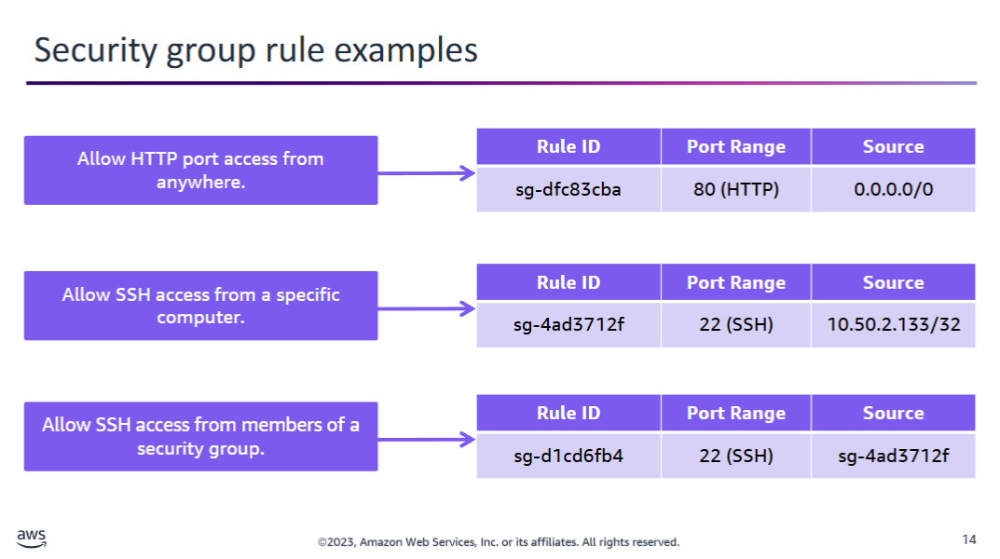

## Security Group Examples

You define **what kind of traffic is allowed** by creating **security group rules**.

Each rule specifies:

- **Protocol**
- **Port number**
- **Source** (e.g. IP range, another security group)

---

### Example Rules

#### 1. Public HTTP Access (Port 80)

- **Source**: `0.0.0.0/0`
- **Port**: `80` (HTTP)

✅ This allows **any computer from the internet** to access the instance on **port 80**.  
🔎 Use case: **Web server**

```text
Allows public web access:
Source: 0.0.0.0/0 → Port: 80 (HTTP)
````

---

#### 2. Restricted SSH Access by CIDR

* **Source**: `10.50.2.133/32` (a specific IP)
* **Port**: `22` (SSH)

✅ Only a **specific network location** (e.g., your office or VPC subnet) can connect via **SSH**.

```text
Allows SSH only from a specific IP:
Source: 10.50.2.133/32 → Port: 22 (SSH)
```

---

#### 3. Inter-instance Access via Security Groups

* **Allowed Security Group**: `sg-4ad3712f`
* **Target Security Group**: `sg-d1cd6fb4`
* **Protocol**: SSH (Port 22)

✅ Only instances in **`sg-4ad3712f`** can access instances in **`sg-d1cd6fb4`** via **SSH**.
🔒 Useful when setting up a **bastion host** or tightly controlled internal access.

```text
Instances in sg-4ad3712f → can SSH to → Instances in sg-d1cd6fb4
```

> 🔐 This setup allows for internal communication between trusted instances only.

---

### Summary

Security group rules can:

* Allow **public access** to services like web servers
* Restrict access based on **IP or CIDR ranges**
* Control **inter-instance traffic** based on **security group membership**

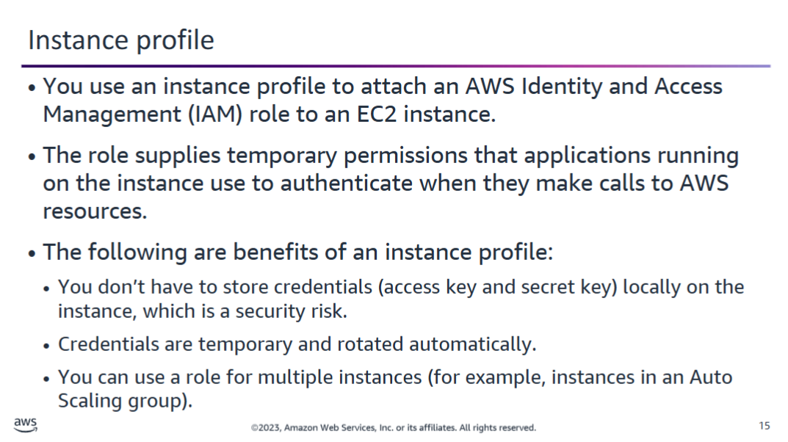

## Instance Profiles

In some cases, you may want to **grant specific access rights** to:

- Applications running on an **EC2 instance**
- **Users** connected to an EC2 instance

---

### What Is an Instance Profile?

An **instance profile** is a **container** for an **IAM role**.

- An IAM role can have **one or more IAM policies**
- These policies grant **temporary access** to AWS account resources
- The instance profile is **attached to the EC2 instance**

---

### Why Use Instance Profiles?

✅ **Benefits:**

- Grant EC2-based applications **access to AWS services** securely
- **Avoid hardcoding credentials** on the instance
- Aligns with **security best practices**

❌ **Never store** access keys (`AWS_ACCESS_KEY_ID` and `AWS_SECRET_ACCESS_KEY`) permanently on instances.  
Doing so poses a **security risk** if the instance is ever compromised.

---

### Use Case Example

If an EC2 instance needs to:

- Read data from an **S3 bucket**
- Write logs to **CloudWatch**
- Query **DynamoDB**

➡️ You can **attach an instance profile** with a role that has **least-privilege access policies** to enable those actions—**without** storing credentials.

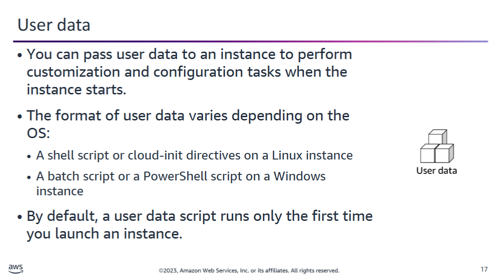

## Automating Instance Setup with User Data

When launching an EC2 instance, you can optionally specify a **user data** parameter to automate configuration tasks.

---

### What Is User Data?

**User data** is a script that runs automatically on the instance during its **boot process**.

- Useful for **initializing or configuring** the instance
- Eliminates the need to **manually log in** to perform setup tasks

---

### Script Formats by OS

- **Linux instances**:
  - Shell scripts (`#!/bin/bash`)
  - `cloud-init` directives
- **Windows instances**:
  - Batch scripts
  - PowerShell scripts

---

### Execution Mechanism

- On **Linux**: handled by the `cloud-init` service
- On **Windows Server 2016+**: handled by the `EC2Launch` service

---

### Default Behavior

- User data scripts run **once** during the **initial boot** cycle
- You can **override this behavior** to make the script run:
  - On **every reboot**
  - On **every instance start** (after being stopped)

---

### Use Cases

- Install software packages
- Set up configuration files
- Start services
- Fetch additional data or assets from S3

> 💡 Automating with user data improves **consistency**, **repeatability**, and **efficiency** in deployment workflows.

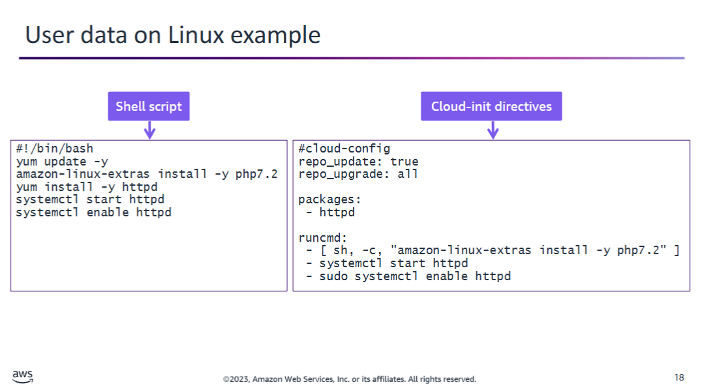

## User Data on Linux Example

On **Linux EC2 instances**, user data can take one of two forms:

- A **shell script** (`#!/bin/bash`)
- A **cloud-init** directive (in **YAML** format)

> 📌 Both formats can perform the **same configuration tasks**, but cloud-init is more declarative and structured.

---

### Example Tasks Performed

Both the shell script and cloud-init version in this example will:

1. **Update** the distribution's software packages
2. **Install** the `php` package
3. **Install** the `httpd` (Apache web server) service
4. **Start** the `httpd` service
5. **Enable** `httpd` to start automatically on instance boot

---

### 🧾 Shell Script Example (User Data)

```bash
#!/bin/bash
yum update -y
yum install -y php
yum install -y httpd
systemctl start httpd
systemctl enable httpd
```

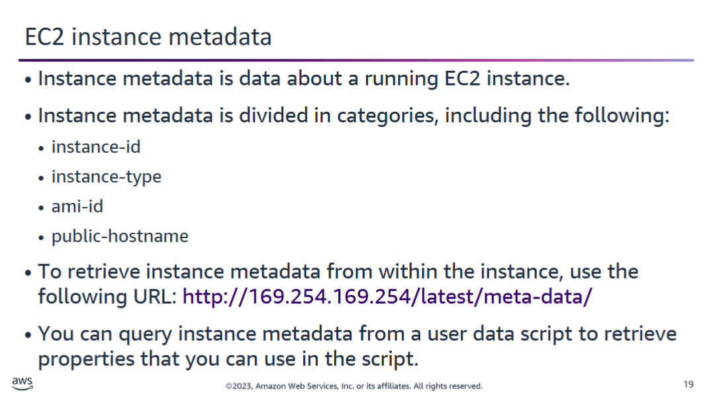

## EC2 Instance Metadata

**Instance metadata** provides useful information about the instance from **within the instance itself**.

---

### Common Metadata Categories

- `instance-id`: The **ID** of the instance
- `instance-type`: The **type** of instance (e.g., `t3.micro`)
- `ami-id`: The **AMI ID** used to launch the instance
- `public-hostname`: The instance’s **public DNS (IPv4) hostname**, if assigned

---

### How to Retrieve Metadata (Linux CLI)

To retrieve metadata from **within the instance**, use the following `curl` command:

```bash
curl http://169.254.169.254/latest/meta-data/
````

> 🧠 This special IP address `169.254.169.254` is reserved for **instance metadata access** in AWS.

---

### Use Cases

* Script-based configuration or auditing
* Retrieving dynamic values (e.g. public IP or hostname)
* Debugging or verifying launch settings

```

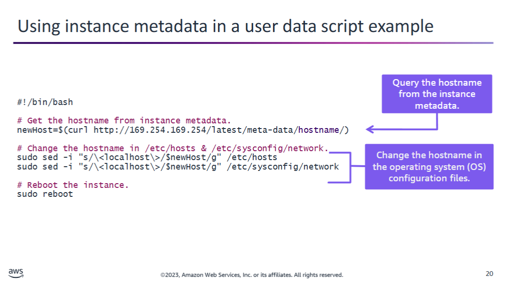

## Using Instance Metadata in User Data Scripts

You can use **EC2 instance metadata** within **user data scripts** to reference values that are only known **at launch time** — such as the instance’s **hostname**.

---

### Why Use Metadata in User Data?

- Dynamically **configure the OS** based on instance properties
- Customize files or services without hardcoding values
- Example use: replacing `localhost` with the instance’s real hostname

---

### Example: Replace “localhost” with the Actual Hostname

```bash
#!/bin/bash

# Retrieve the hostname from instance metadata
newHost=$(curl -s http://169.254.169.254/latest/meta-data/hostname)

# Replace "localhost" with the actual hostname in system files
sed -i "s/localhost/$newHost/g" /etc/hosts
sed -i "s/localhost/$newHost/g" /etc/sysconfig/network

# Reboot to apply the changes
reboot
```

---

### What This Script Does

1. **Queries** instance metadata for the `hostname`
2. **Replaces** all occurrences of `"localhost"` with the actual hostname in:

   * `/etc/hosts`
   * `/etc/sysconfig/network`
3. **Reboots** the instance to ensure the changes are applied

---

### Further Reading

📖 [EC2 Instance Metadata and User Data – AWS Documentation](https://docs.aws.amazon.com/AWSEC2/latest/UserGuide/ec2-instance-metadata.html)


## Viewing User Data on a Running EC2 Instance

If you want to see the **user data** that was passed to an instance at launch time, you can retrieve it from **within the instance**.

### How to Access User Data

Use the following special metadata URL from a command line **inside the instance**:

```bash
curl http://169.254.169.254/latest/user-data
```

> 📍 This returns the raw **user data script or directives** provided during instance launch.

### Use Case

- Useful for **debugging or verification**
- Helps confirm what **initial configuration** was applied to the instance

### Reminder

- This only works **from within the instance**
- It works **only if user data was provided** at launch time

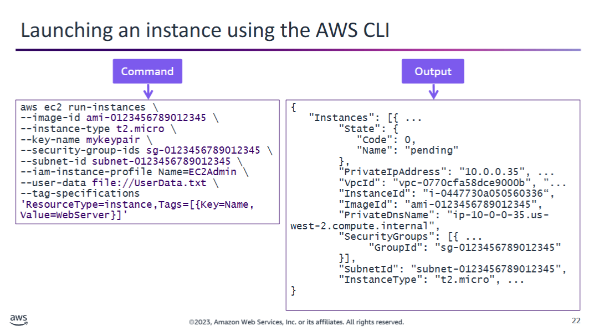

## Launching an EC2 Instance via AWS CLI

This example shows how to use the **AWS Command Line Interface (AWS CLI)** to launch an EC2 instance.

Notice the various parameters passed to the command—most of them were covered in previous sections.

### Example: `run-instances` Command

```bash
aws ec2 run-instances \
  --image-id ami-0abcdef1234567890 \
  --count 1 \
  --instance-type t3.micro \
  --key-name my-key-pair \
  --security-group-ids sg-0123456789abcdef0 \
  --subnet-id subnet-6e7f829e \
  --tag-specifications 'ResourceType=instance,Tags=[{Key=Name,Value=MyInstance}]'
```

### Notes

- `--image-id`: ID of the AMI to use
- `--count`: number of instances to launch
- `--instance-type`: type of instance (e.g., `t3.micro`)
- `--key-name`: name of the key pair
- `--security-group-ids`: one or more security group IDs
- `--subnet-id`: ID of the subnet within your VPC
- `--tag-specifications`: apply **tags** to the instance using key-value pairs

### Further Reading

📖 [AWS CLI Command Reference – `run-instances`](https://awscli.amazonaws.com/v2/documentation/api/latest/reference/ec2/run-instances.html)

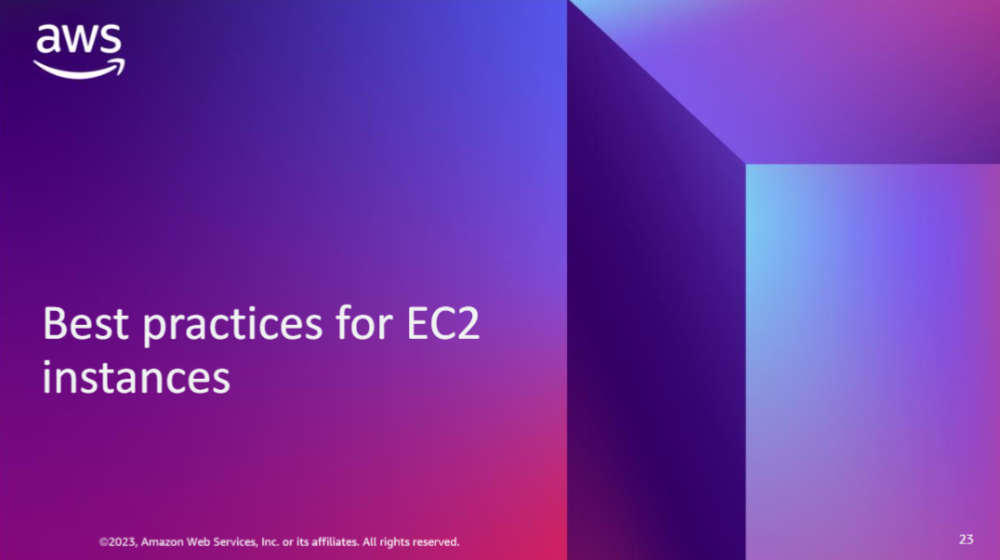

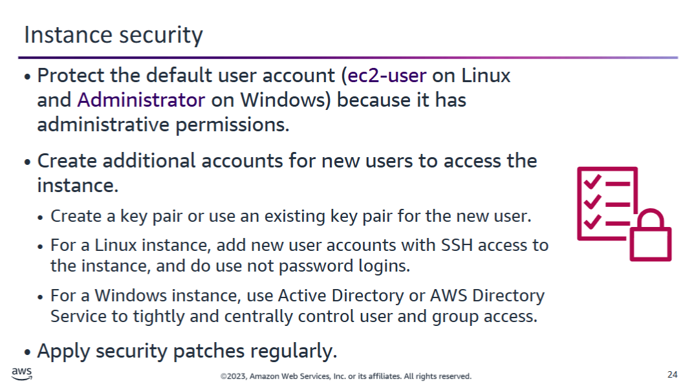

## EC2 Access Security Best Practices

The default `ec2-user` (Linux) or the default **administrator username and password** (Windows) are only initial steps for securing your instance.

---

### Define Instance-Level Access Strategy

You are responsible for:

- Defining **how access is granted and revoked**
- Maintaining access control as **users join or leave** your organization
- Following the best practice of using **separate user accounts** for each individual

---

### Creating and Using Key Pairs

You can:

- Create a key pair using **Amazon EC2**
- Use a third-party tool like `ssh-keygen` to generate a key pair and **import the public key** into EC2

```bash
# Generate a new SSH key pair for a user
ssh-keygen -t rsa -b 4096 -C "username@example.com"
```

---

### Secure Access Protocols

#### For Linux Instances:

- Use **SSH** for access
- **Avoid passwords** — they are vulnerable to brute-force attacks
- Always use **encrypted key-based authentication**

#### For Windows Instances:

- Use **AWS Directory Service**
- Manage access based on **existing Windows users and groups**

---

### Regular Maintenance

- Always **apply OS updates and security patches**
- Set up automated update tools or regular manual checks
- Staying current protects your instance from known vulnerabilities

> 🔐 Strong access control and ongoing maintenance are essential parts of a secure EC2 environment.

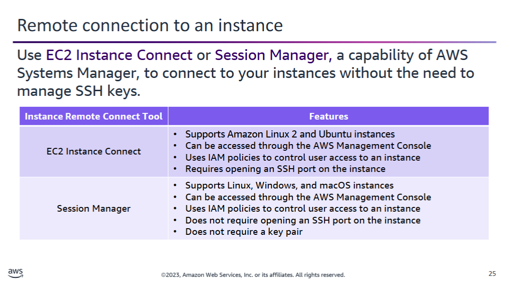

## Recommended Methods for Connecting to EC2 Instances

The recommended methods to **remotely connect** to EC2 instances are:

- **EC2 Instance Connect**
- **Session Manager** (via AWS Systems Manager)

---

### Benefits of Using These Tools

- Directly accessible through the **AWS Management Console**
- Use a **browser-based shell** — no need to install SSH or RDP clients
- **No need to manage SSH keys**
- All connections are **logged to AWS CloudTrail** for auditing

---

### EC2 Instance Connect

- Provides **SSH access** to:
  - **Amazon Linux 2**
  - **Ubuntu** instances
- Access methods:
  - **AWS Management Console**
  - **EC2 Instance Connect CLI**
  - **Standard SSH clients**
- **Access control** via **IAM policies**
- **Connection requests are logged** to CloudTrail

---

### Session Manager (via AWS Systems Manager)

- Connect to **Linux**, **Windows**, or **macOS** instances
- Accessible via:
  - **AWS Management Console**
  - **AWS CLI**
- Key features:
  - No need to open **inbound ports**
  - No need to maintain **bastion hosts**
  - No need to manage **SSH keys**
  - **Fully auditable** via CloudTrail logs

> 🔐 Both tools offer **secure, simplified, and auditable** ways to manage EC2 instances remotely.

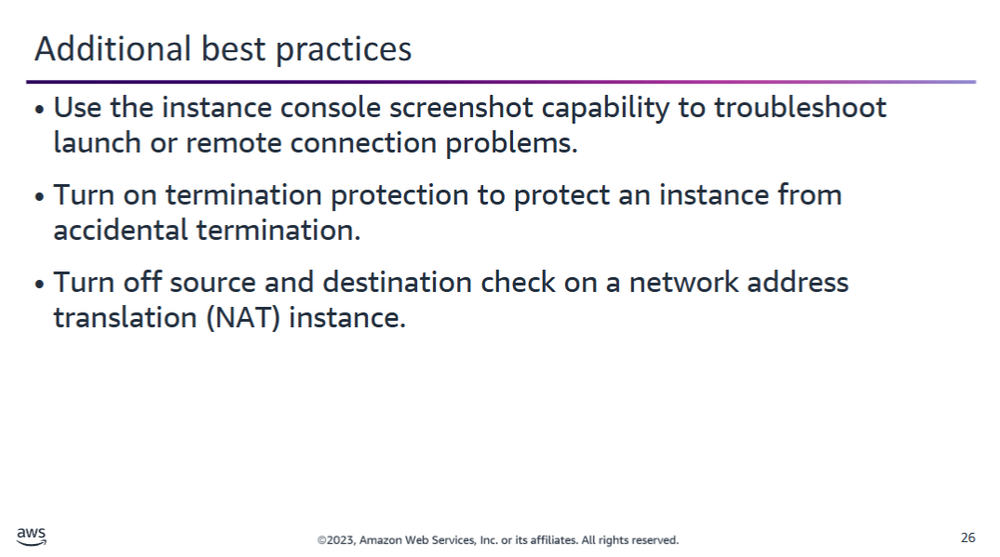

## Additional best practices

AWS provides several built-in capabilities to monitor, protect, and manage EC2 instances more effectively.

---

### Instance Console Screenshot

- You can **generate a screen capture** of the instance console:
  - While the instance is **running**
  - Or **after it has crashed**
- Accessible via the **AWS Management Console**
- The screenshot is generated in **`.jpg` format**
- Can be **downloaded locally**
- Useful for troubleshooting unreachable instances

---

### Termination Protection

- Prevents **accidental termination** of an EC2 instance
- Requires **termination protection to be turned off** before instance termination is allowed
- Recommended for **critical or long-running workloads**

```bash
# Example: Enable termination protection via CLI
aws ec2 modify-instance-attribute --instance-id i-0123456789abcdef0 --no-disable-api-termination
```

---

### Source/Destination Checks

- **Enabled by default** for all EC2 instances
  - The instance must be the **source or destination** of any traffic it sends or receives
- For **NAT instances**, this check must be **disabled**
  - NAT instances handle traffic **on behalf of other resources**

```bash
# Example: Disable source/destination check for a NAT instance
aws ec2 modify-instance-attribute --instance-id i-0123456789abcdef0 --no-source-dest-check
```

> 🧠 Disabling source/dest check is necessary for instances acting as routers, firewalls, or NAT devices.

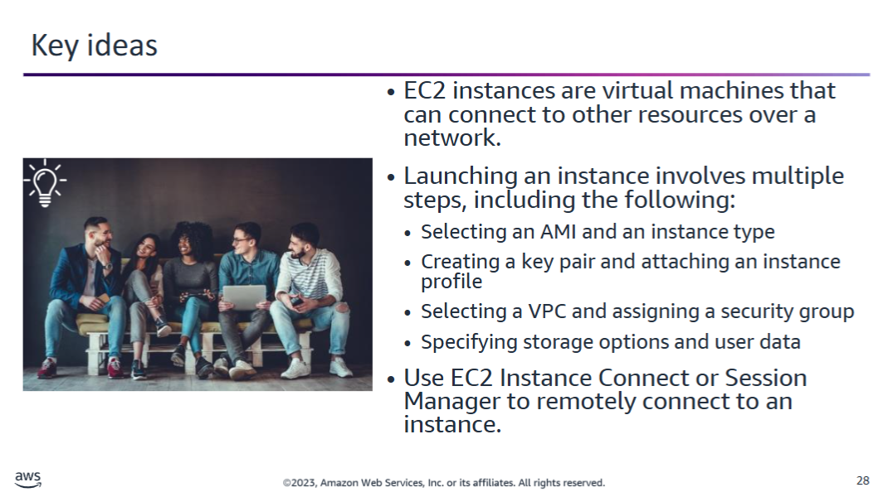
