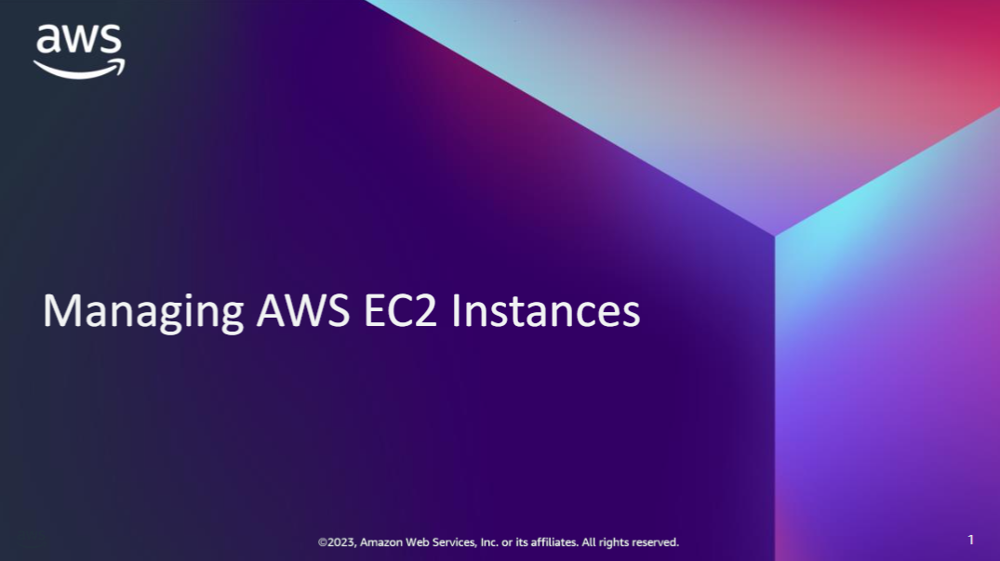

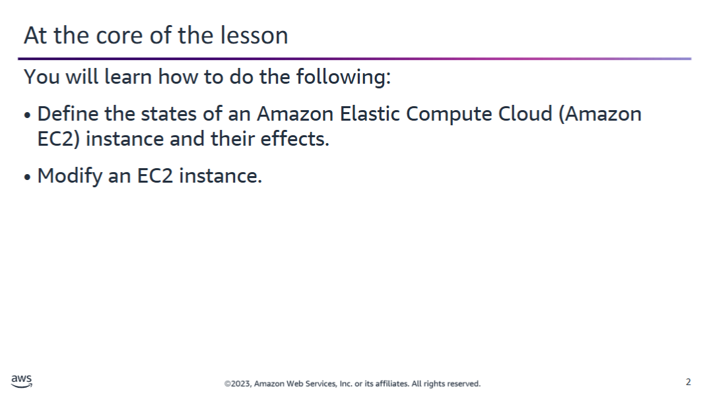

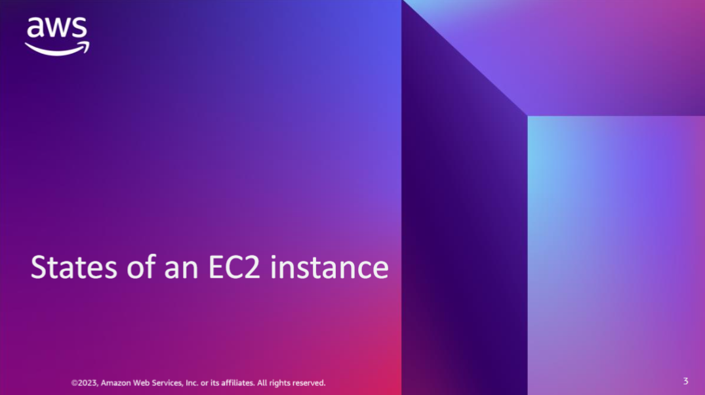

## States of EC2 Instances

This diagram shows the **lifecycle of an EC2 instance**.  
The **arrows** represent actions you can take, and the **boxes** show the resulting instance state.

An EC2 instance can be in one of the following states:

### Pending

- Occurs when:
  - An instance is first launched from an Amazon Machine Image (AMI)
  - A previously stopped instance is started
- The instance is **booted** and **deployed** to a host computer
- The **instance type** determines the hardware of the host

### Running

- The instance is fully **booted and ready**
- You can **connect** to the instance over the internet

### Rebooting

- Instance enters this state temporarily after a **reboot action**
- Best practice: reboot via **EC2 console**, **AWS CLI**, or **SDKs**
- Instance remains on the **same physical host**
- Maintains the **same public DNS** and **public IP**
- **Instance store volumes** retain data

### Shutting-down

- An **intermediate state** between **running** and **terminated**
- Triggered by a **terminate action**

### Terminated

- Final state after a **terminate action**
- Instance is:
  - **No longer accessible**
  - **Not recoverable**
  - Still **visible** in the EC2 Console for a short time

### Stopping

- Applies to instances backed by **Amazon Elastic Block Store (EBS)**
- Entered before reaching the **stopped** state

### Stopped

- The instance is **shut down**, but not **terminated**
- Characteristics:
  - **Not billed** for instance usage
  - You can **modify attributes** (e.g. instance type)
- Starting the instance:
  - Returns it to the **pending** state
  - May place it on a **new host**
- You can also **terminate** the instance from this state

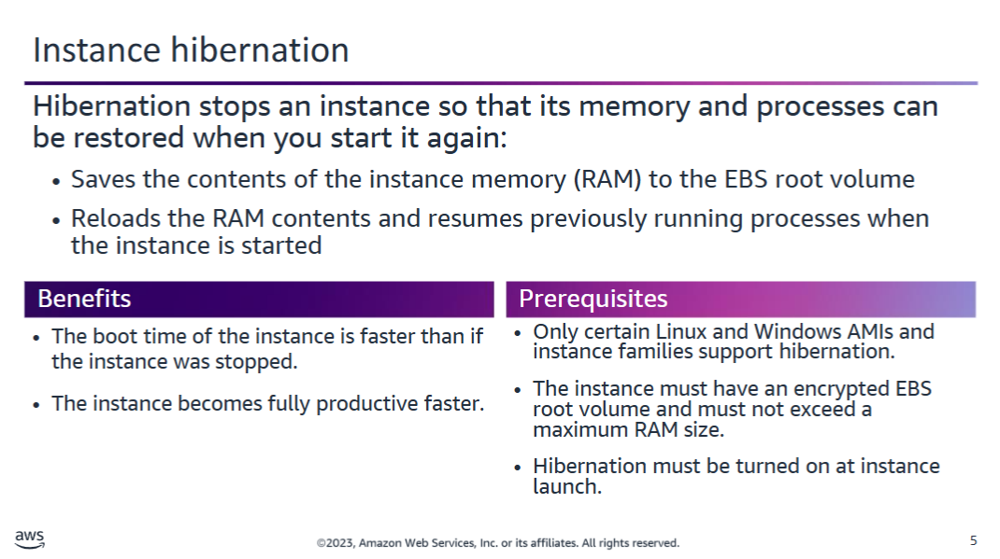

## EC2 Instance Hibernation

Some EC2 instances backed by **Amazon EBS** support **hibernation**.

### What Happens During Hibernation?

When you hibernate an instance:

- The guest OS **saves the RAM contents** to the **EBS root volume**
- On restart:
  - The **EBS root volume** is restored to its previous state
  - The **RAM contents** are reloaded
  - **Previously running processes** are resumed
  - **Attached data volumes** are reattached
  - The instance retains its **instance ID**

### Use Case

Hibernation is ideal when:

- You need to **restart quickly**
- The instance takes a **long time to warm up** after stop/start

---

### Hibernation Requirements and Limitations

- Available for **On-Demand Instances**
- Supported only on **certain Linux and Windows AMIs**
- Supported only on **certain instance types**
- **EBS root volume must be encrypted**
- **Maximum RAM size**:
  - **150 GB** for Linux
  - **16 GB** for Windows
- **Must be enabled at instance launch**  
  ❌ Cannot enable hibernation on an already launched instance

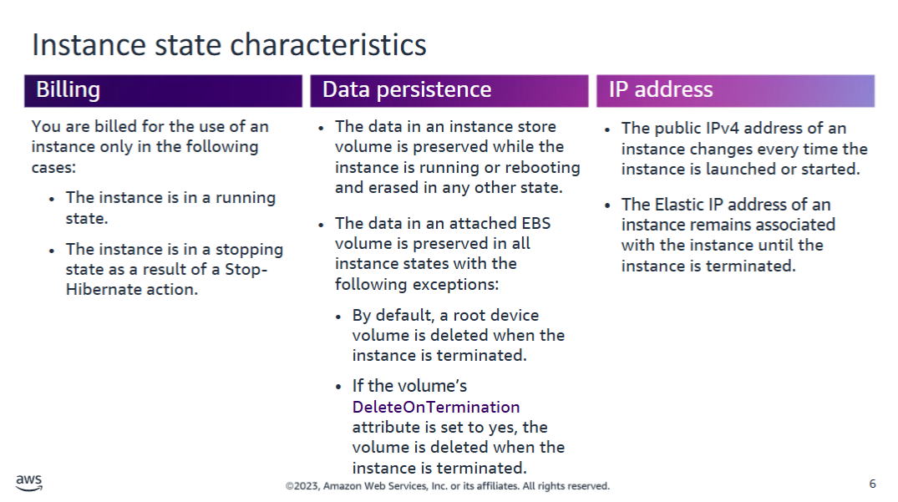

## Instance State characteritics

This section summarizes important behaviors and effects associated with **EC2 instance states** and their impact on instance components.

### Hibernation Behavior

- When you **hibernate an instance**, AWS **continues to charge** for usage **while the instance is preparing to hibernate**
- Useful to be aware of for cost management

---

### Storage Behavior

- **Instance store volumes**:
  - Data is **temporary**
  - Lost if the instance is **stopped**, **terminated**, or **fails**
- **EBS volumes**:
  - Data is **persistent**
  - Survives **stops**, **hibernation**, and **restarts**

> ⚠️ It's important to place critical data on **EBS volumes** to avoid **accidental data loss**

---

### IP Address Behavior

- Each time an instance is **started or launched**:
  - It receives a **new public IPv4 address** (unless you use an Elastic IP)
- **Elastic IP addresses**:
  - Remain **associated** with the instance
  - Persist until the instance is **terminated**

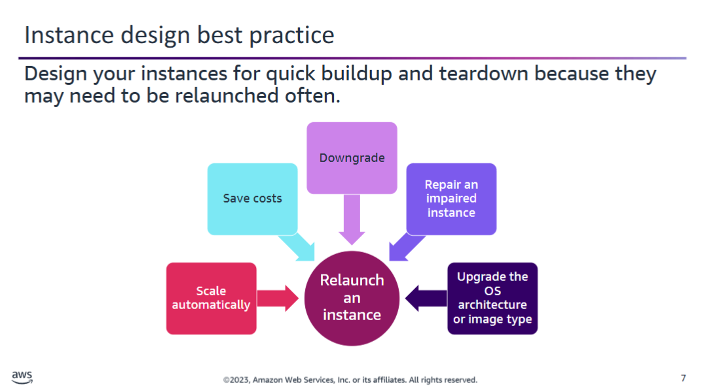

## Instance design best practice

It is a **best practice** to treat EC2 instances as **ephemeral resources** — resources that can be **created, destroyed, and recreated quickly**.

If you are new to cloud computing, this idea may seem unfamiliar. However, embracing this mindset brings flexibility and resilience.

---

### Common Scenarios for Rebuilding Instances

#### • Automatic Scaling

- Systems may need to **launch new instances automatically** in response to demand
- No human intervention required

#### • Cost Savings

- You might **shut down unused instances** to save money
- Still retain the ability to **quickly recreate them** when needed  
  (e.g. **batch processing** workloads)

#### • Downgrading

- You may downgrade an instance to reduce costs:
  - From **dedicated hardware** to **shared tenancy**
  - Or reduce size (e.g. from `t2.xlarge` to `t2.large`)

#### • Repairing Impaired Instances

- **Underlying hardware may fail**
- Relaunching the instance will place it on **healthy infrastructure**

#### • Upgrading

- Some upgrades require launching a new instance:
  - OS version changes
  - New AMI types or architectures

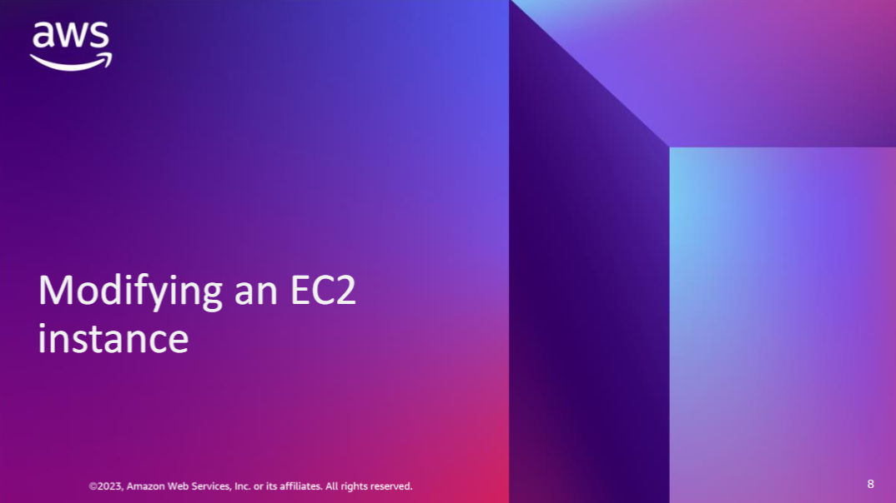

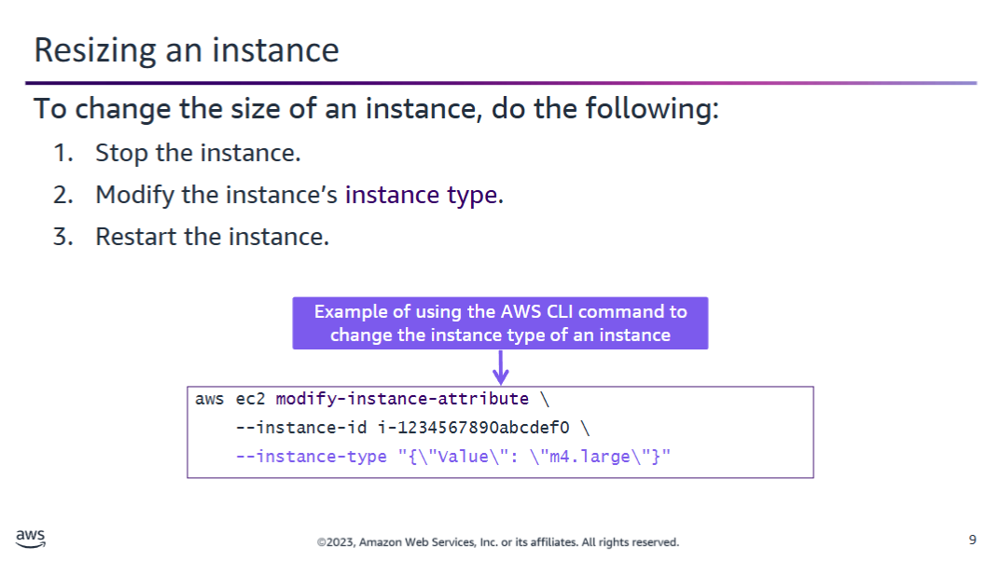

## Resizing EC2 Instance

As your application needs change, you may find that your current EC2 instance type is **not optimal**.

---

### Common Scenarios

#### Overused Instance

- The instance is **too small** for your workload
- Symptoms:
  - High **CPU usage** (near 100%)
  - Running out of **memory**

#### Underused Instance

- The instance is **too large** for your workload
- Symptoms:
  - Low CPU and memory usage
  - Wasted cost for unused capacity

---

### Solution: Change the Instance Type

You can **change the instance type** to better match your needs.  
For example:

- From `t2.micro` → `t2.large`

> ⚠️ The **new instance type must support the same architecture**  
> (e.g., 64-bit → 64-bit)

---

### Requirements for Changing Instance Type

- The instance must use an **EBS root volume**
- The new instance type must be **compatible** with the current instance configuration
- You must **stop the instance** before changing its type

If the above conditions aren't met, you must **launch a new instance** instead.

---

### Example: AWS CLI – Change Instance Type

```bash
aws ec2 modify-instance-attribute \
  --instance-id i-0123456789abcdef0 \
  --instance-type "{\"Value\": \"m4.large\"}"
```

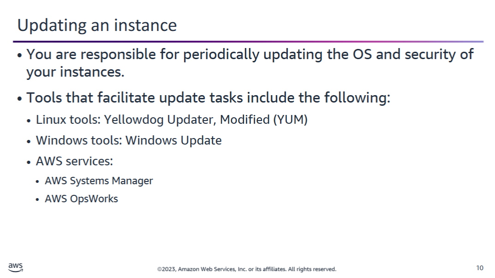

## Keeping EC2 Instances Up to Date

> ⚠️ Remember: **You own your EC2 instances** — it's your responsibility to keep them updated.

Even though many instances are short-lived, some may run for **weeks or months**, such as:

- Development and test environments
- Long-lived **database servers**
- Any workload requiring **stability over time**

In these situations, it's recommended to **frequently apply OS and security updates**.

---

### Tools for Updating Instances

#### • YUM (Linux)

- **YUM** is an RPM-based package manager for Linux
- AWS maintains a **YUM repository** for **Amazon Linux**
- You can:
  - Install **all available updates**:
    ```bash
    sudo yum update -y
    ```
  - Install **specific packages**:
    ```bash
    sudo yum update httpd
    ```

#### • Microsoft Windows Update

- Can install updates **automatically**
- You can disable auto-updates and **install manually** for better control
- Useful for **testing updates** before applying them in production

#### • AWS Systems Manager & AWS OpsWorks

- Provide centralized management for:
  - **Automated updates**
  - **Patch baselines**
  - **Scheduled maintenance**
- Suitable for managing **multiple EC2 instances** across environments

---

> ✅ Keeping your instances current reduces **security risks** and ensures **system compatibility**

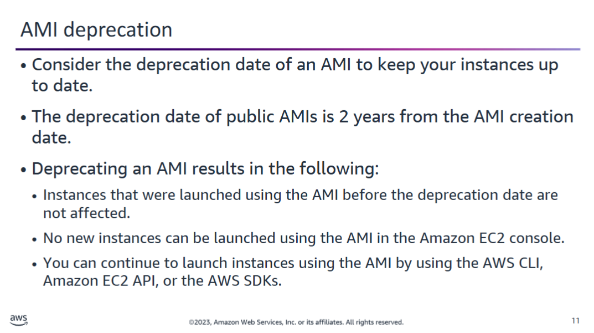

## AWS AMI Updates and Deprecation

AWS regularly updates **public AMIs** to provide a **stable** and **secure** environment for running applications on Amazon EC2.

---

### Update Policy

- **Linux AMIs**:
  - Regularly updated to include the **latest components** of pre-installed packages

- **Windows AMIs**:
  - Updated and fully patched within **5 business days** after Microsoft releases a patch

---

### AMI Deprecation

When an AMI becomes outdated, AWS **deprecates** it.

- The **default deprecation date** for a public AMI is:
  - **2 years** after its **creation date**
- Once deprecated:
  - The AMI is **no longer visible** in the AWS Management Console
  - You **can still access** it using:
    - AWS CLI
    - EC2 API
    - AWS SDK

---

### Using Deprecated AMIs

- If an instance was launched **before deprecation**, it can still:
  - Be **used**
  - Be **stopped**, **started**, and **rebooted**
- You can still **retrieve the AMI ID** via CLI/API and use it to **launch new instances**

> 🧠 Tip: Always review the **age and patch status** of an AMI before using it in production

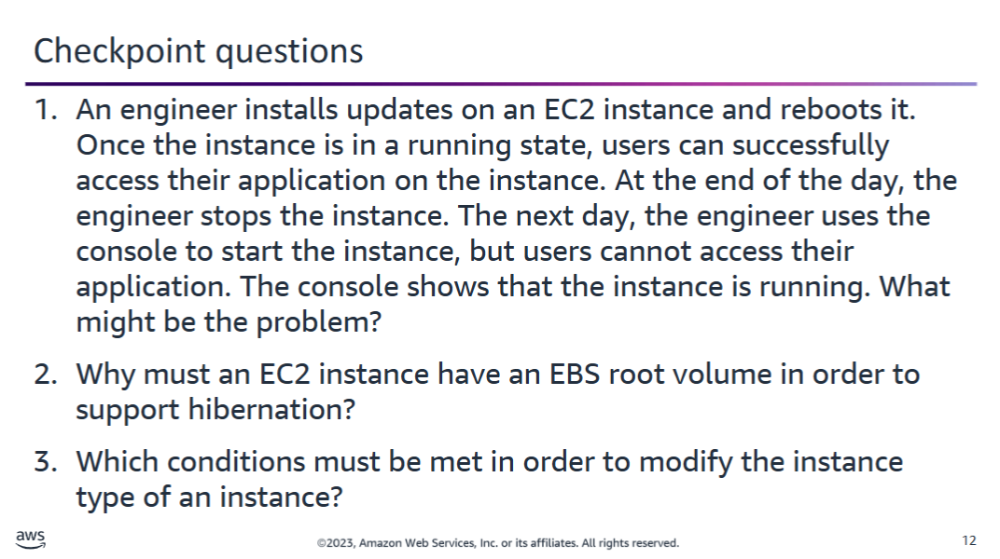

## Knowledge Check

<details>
<summary><strong>1. Why can't users access an EC2 application after restarting a previously stopped instance?</strong></summary>

When the engineer **rebooted** the instance, it retained its **public IP address**.

However, when the instance was **stopped**, the public IP was **released**.

➡️ The next day, upon starting the instance again, it received a **new public IP address**.

If users are trying to access the instance using the **old IP address**, they will not be able to connect.

</details>

---

<details>
<summary><strong>2. Why must an EC2 instance have an EBS root volume to support hibernation?</strong></summary>

**EBS volumes** are **persistent across shutdowns**, which is essential for hibernation.

- When hibernating:
  - The instance’s **RAM contents** are saved to the **EBS root volume**
- Upon restarting:
  - The RAM is **restored** from the EBS volume
  - The instance resumes as if the shutdown **did not occur**

</details>

---

<details>
<summary><strong>3. What are the requirements to modify an instance type?</strong></summary>

To change an EC2 instance's type, the following conditions must be met:

- ✅ The root device must be an **EBS volume**
- ✅ The new instance type must be **compatible** with the current architecture  
  (e.g., 64-bit to 64-bit)
- ✅ The instance must be **stopped** before the type can be modified

</details>

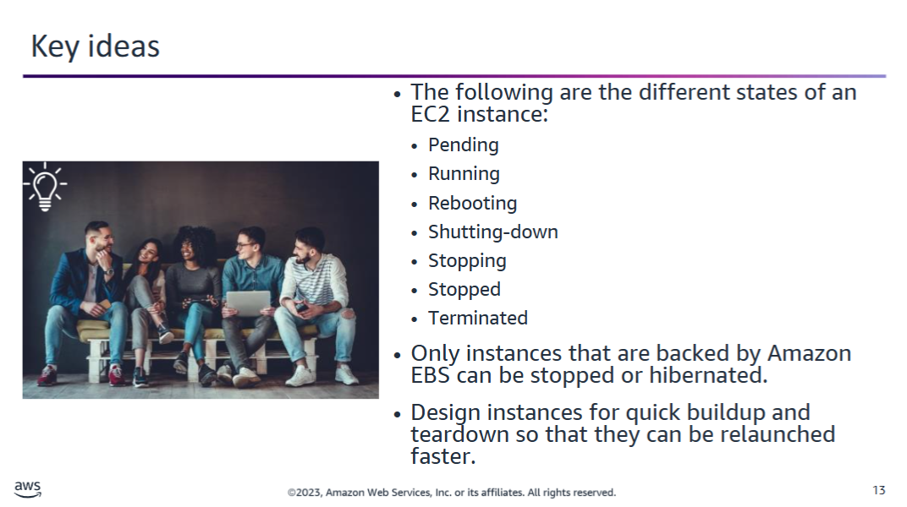
