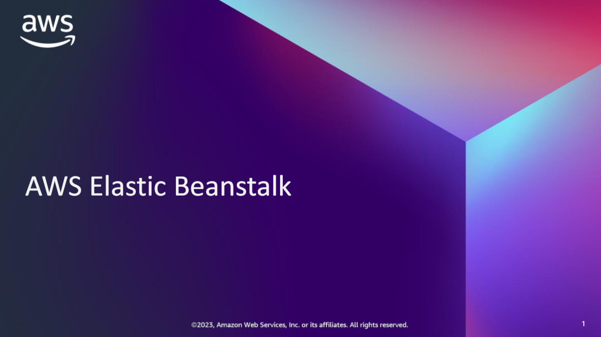
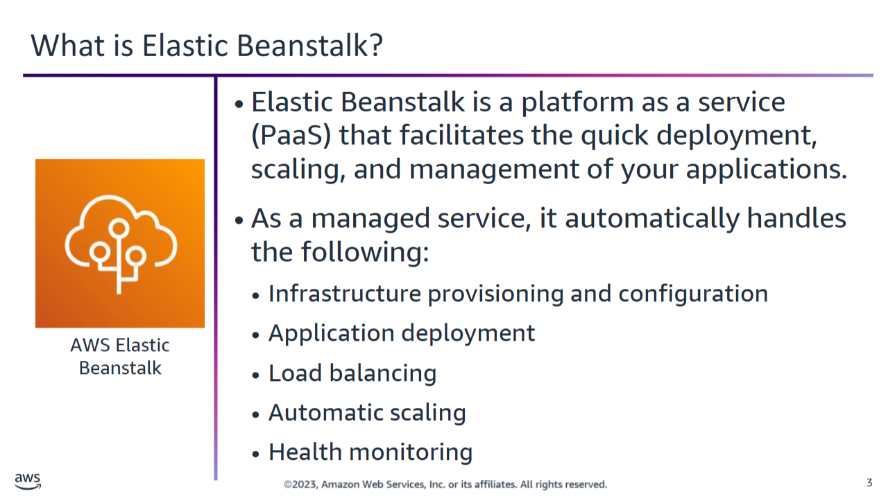
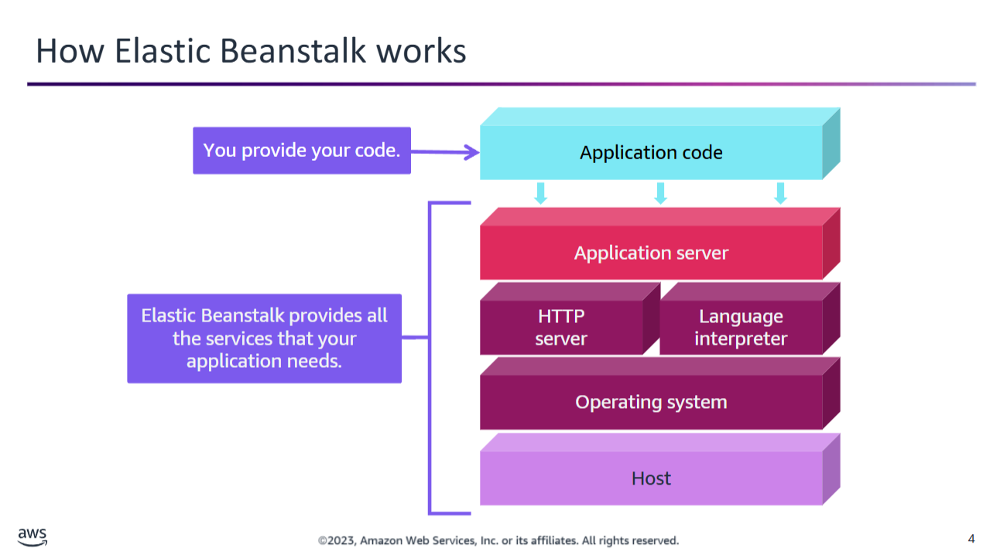
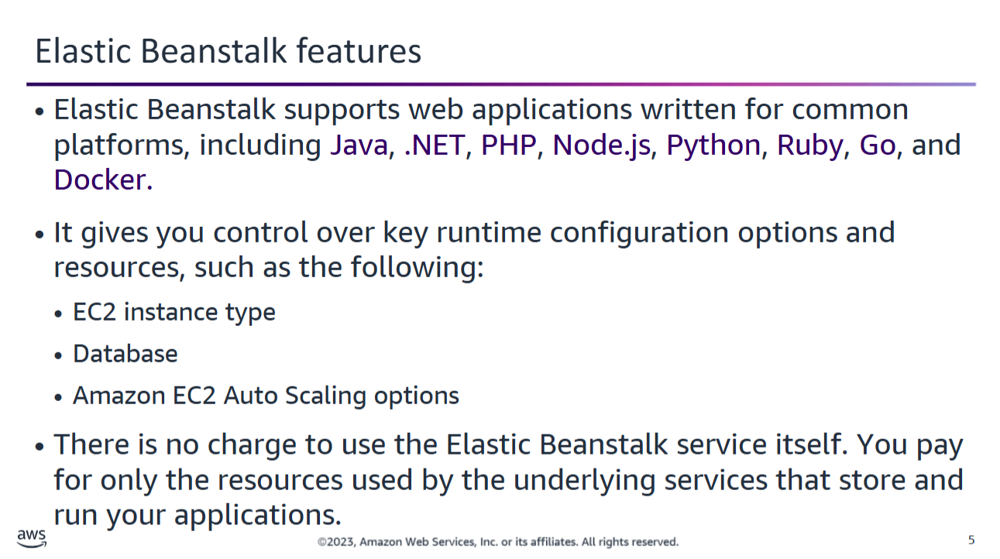
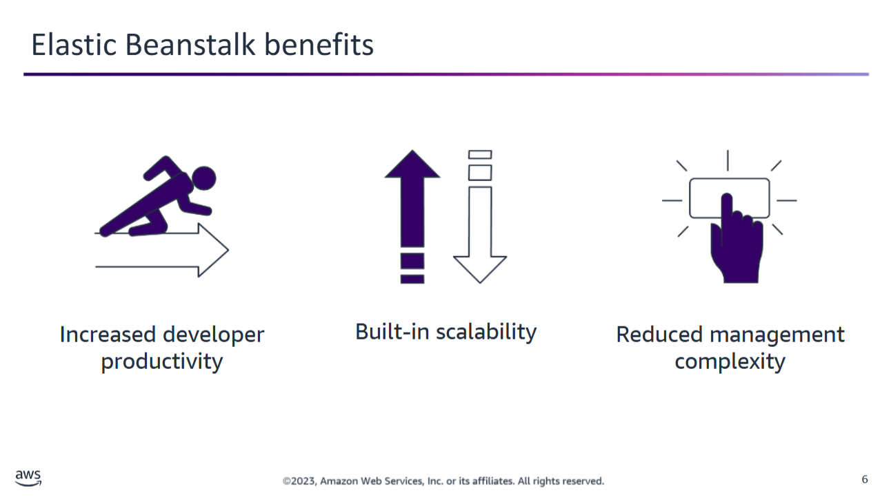
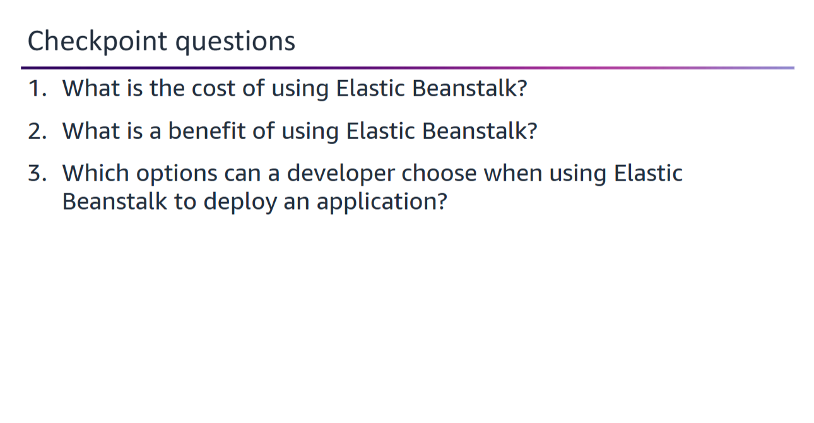
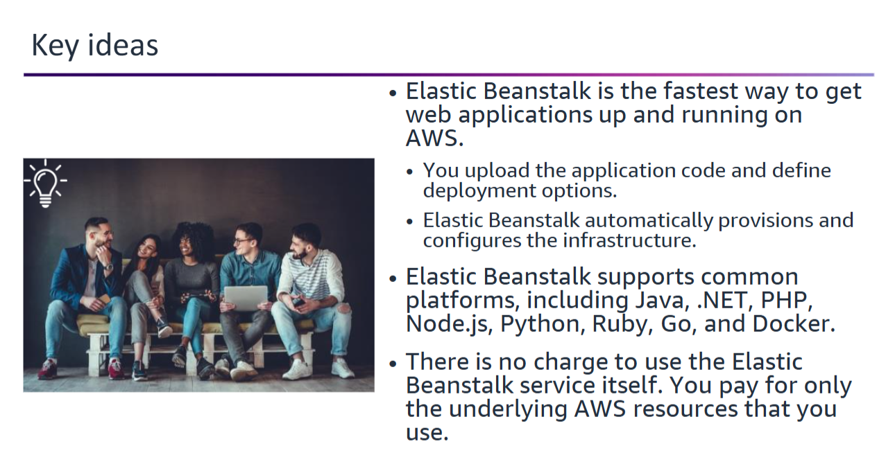

You will learn how to describe AWS Elastic Beanstalk and its features.

## AWS Elastic Beanstalk

AWS **Elastic Beanstalk** allows you to quickly deploy and manage applications in the **AWS Cloud** without needing to understand or manage the underlying infrastructure.

### How It Works

- You **upload your application**
- Elastic Beanstalk automatically handles:
  - **Capacity provisioning**
  - **Load balancing**
  - **Auto scaling**
  - **Application health monitoring**

### Underlying AWS Services

Elastic Beanstalk uses trusted AWS services to create the environment that runs your application:

- **Amazon EC2** – compute capacity
- **Amazon RDS** – relational database
- **Elastic Load Balancing (ELB)** – traffic distribution
- **Amazon EC2 Auto Scaling** – dynamic scaling
- **Amazon S3** – application storage
- **Amazon SNS** – notifications and alerts

## How Elastic Beanstalk works

To use **Elastic Beanstalk**, you:

1. **Upload your application code**
2. Provide **application configuration information**

Elastic Beanstalk then:

- **Launches an environment**
- **Creates and configures AWS resources** such as:
  - **EC2 instances**
  - **HTTP servers**
  - **Application servers**

Elastic Beanstalk environments run on:

- **Amazon Linux AMI**
- **Windows Server AMI**

---

### Deployment Options

You can deploy your code using:

- The **AWS Management Console**
- The **AWS CLI (Command Line Interface)**
- An **IDE** such as:
  - **Visual Studio**
  - **Eclipse**

---

### Post-Launch Management

Once your environment is launched:

- You can **manage the environment**
- You can **deploy new application versions**
- You retain **full control** over the underlying AWS resources
- You may **access and modify** these resources at any time

## Elastic Beanstalk features

Elastic Beanstalk provides support for various **platforms**, including:

### Supported Technologies

- **Programming languages**:
  - Go
  - Java
  - Node.js
  - PHP
  - Python
  - Ruby

- **Web servers**:
  - Apache HTTP Server
  - Nginx
  - Microsoft IIS (Internet Information Services)

- **Application servers**:
  - Tomcat
  - Passenger
  - Puma

- **Containers**:
  - Docker

---

### Customization and Control

Elastic Beanstalk **automatically builds your runtime environment**, but you still retain control over key settings:

- Choose **instance types**
- Choose a **database**
- Configure **auto scaling**
- Adjust **load balancer** options
- Access **server log files**

---

### Pricing

- There is **no additional charge** for using Elastic Beanstalk itself
- You only **pay for the AWS resources** used by your application:
  - EC2 instances
  - S3 buckets
  - Other provisioned services

> 💡 You only pay for **what you use**, as you use it.

## Elastic Beanstalk benefits

Elastic Beanstalk enables you to focus on **developing your application**, rather than on infrastructure and deployment tasks.

### Focus on Code, Not Infrastructure

With Elastic Beanstalk:

- You don’t need to manually:
  - Provision servers
  - Set up load balancing
  - Manage scaling
  - Configure firewalls or networks
- You simply **upload your code**, and Elastic Beanstalk handles the rest

> ⚡ It’s the **fastest way to get web applications running** on AWS.

---

### Easy Application Updates

- To update your application after deployment:
  - Just **upload the new version** of your code
- No need to rebuild or manually reconfigure your environment

---

### Automatic Scaling and Cost Efficiency

- Elastic Beanstalk environments are designed to:
  - **Handle traffic peaks**
  - **Minimize costs** when demand is low
- Uses **Amazon EC2 Auto Scaling** with adjustable settings
  - Example: Trigger scaling actions based on **CPU utilization**

---

### Reduced Management Complexity

Elastic Beanstalk:

- Provisions and operates the **infrastructure**
- Manages the **application stack or platform**
  - Keeps it updated with the **latest patches and updates**

---

### Full Control When You Need It

- You always retain **full control** over the underlying AWS resources
- If desired, you can take over some or all aspects of infrastructure management
  - Elastic Beanstalk provides built-in **management capabilities** for seamless transition

  
<strong>1. What is the cost of using Elastic Beanstalk?</strong>

There is no cost to use Elastic Beanstalk. You pay for only the underlying services that you use.

  
<strong>2. What is a benefit of using Elastic Beanstalk?</strong>

Benefits of using Elastic Beanstalk include:

- Increased developer productivity  
- Built-in scalability  
- Reduced management complexity

  
<strong>3. Which options can a developer choose when using Elastic Beanstalk to deploy an application?</strong>

When deploying an application with Elastic Beanstalk, a developer can control:

- Instance type  
- Database  
- Amazon EC2 Auto Scaling options  
- Load balancer options

