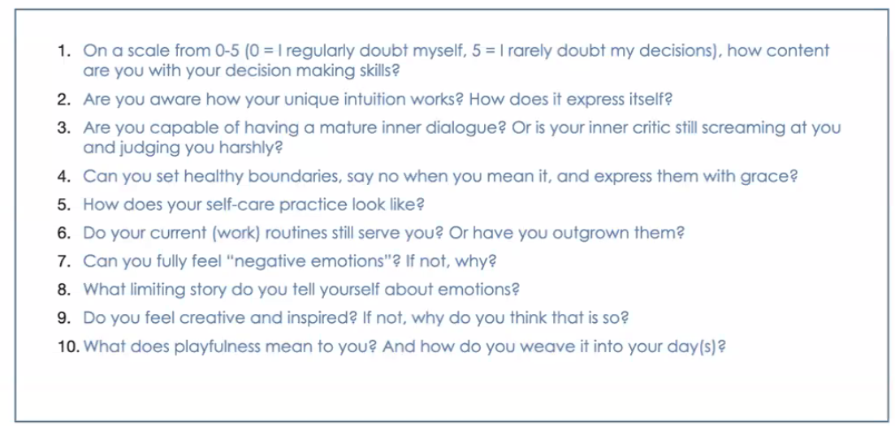

## Soft Skill Course

### Hopes & Fears

Hopes: Learn something new, overcome imposter syndrome.

Fears: Being awkward and not enough for this position.

1. I guess something between 0-2, depends on the situation.
2. It is a feeling straight out of the guts.
3. I would say 1 out of 4 inner dialouges are somehow mature, the rest is definitely screaming/judging at me.
4. I do have a helper syndrome, which sucks with situations saying no. also i have a patience of an angel

Wednesday Evening, question yourself the following questions:
what was good today ?
what was i happy about ?
what did i miss ?
who or what did i get to know today ?
what i am grateful for ?
