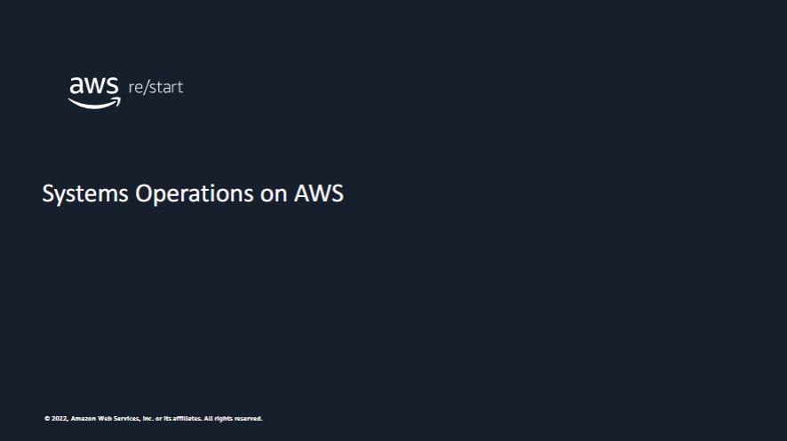
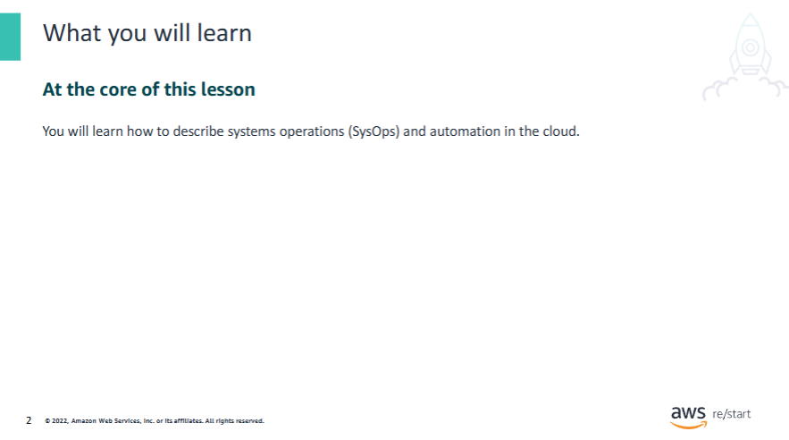
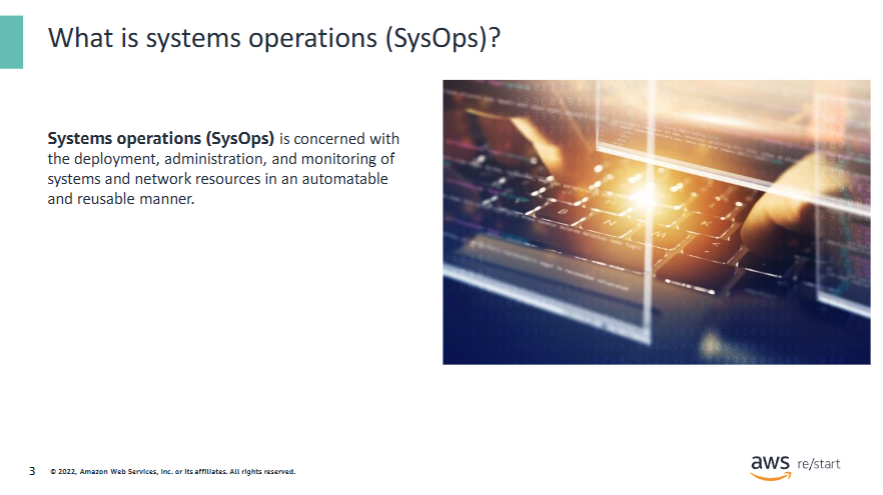
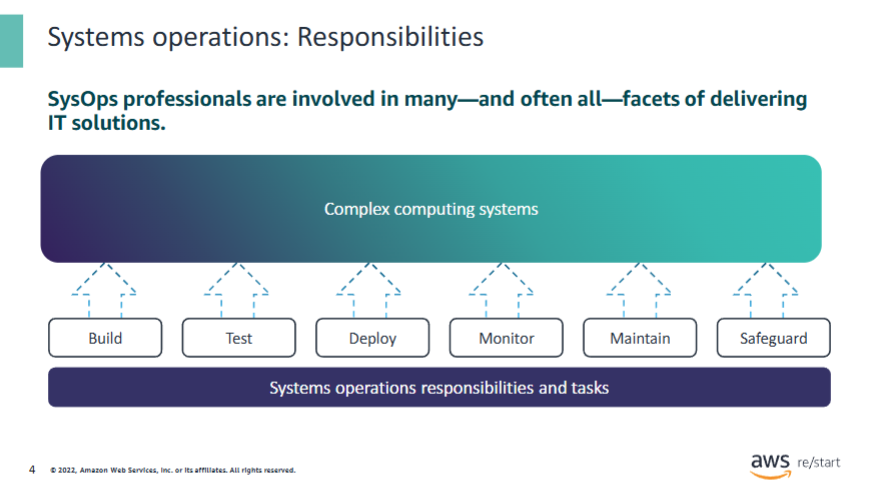
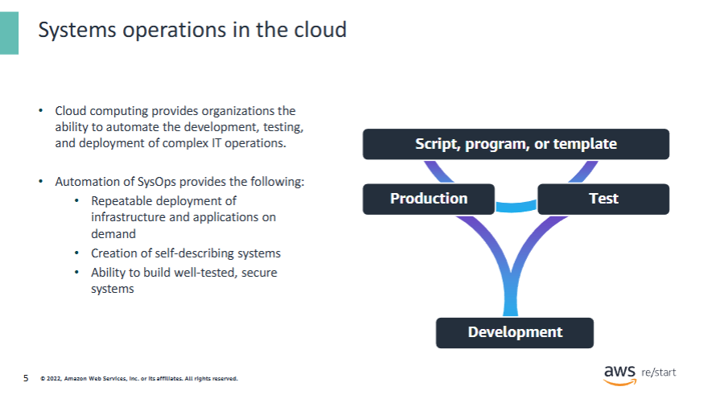
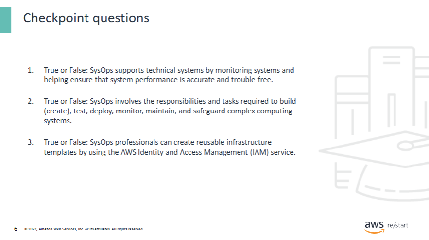
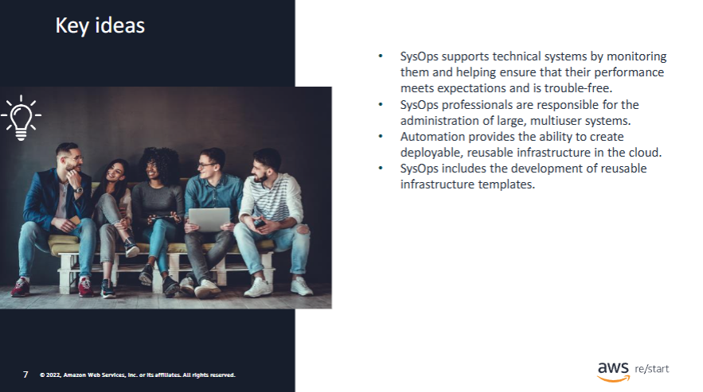

Welcome to the lesson titled Systems Operations on Amazon Web Services (AWS).

This lesson provides an introduction to systems operations (SysOps). It describes the overall responsibilities of a SysOps professional and highlights the importance of automation in the cloud.

## What is systems operations (SysOps)

**SysOps** contains critical tasks that keep many companies running today.  
SysOps supports technical systems by **monitoring** them and helping ensure that their **performance meets expectations** and is **trouble-free**.

SysOps typically requires understanding a system's **entire environment**.

---

### Benefits of SysOps include the following:

- Ability to **configure and manage thousands of servers and devices** in a repeatable way  
- **Reduction in errors** by replacing manual processes with automated ones  
- **Real-time visibility** into the state of the infrastructure through monitoring

## Systems operations: Responsibilities

**SysOps** involves the responsibilities and tasks required to:

- **Build** (create)
- **Test**
- **Deploy**
- **Monitor**
- **Maintain**
- **Safeguard**

...complex computing systems.

---

### Examples of SysOps tasks include:

- **Build**: Create separate environments for development, test, and production  
- **Test**: Test backup and disaster recovery procedures  
- **Deploy**: Deploy applications and workloads into their runtime environment  
- **Monitor**: Monitor the health and performance of infrastructure resources  
- **Maintain**: Apply patches and upgrades in a consistent and regular manner  
- **Safeguard**: Apply and enforce security measures in all the infrastructure layers

---

SysOps professionals typically use **automation** due to the **large size of the infrastructure**.

**SysOps** involves the responsibilities and tasks required to:

- **Build** (create)
- **Test**
- **Deploy**
- **Monitor**
- **Maintain**
- **Safeguard**

...complex computing systems.

---

### Examples of SysOps tasks include:

- **Build**: Create separate environments for development, test, and production  
- **Test**: Test backup and disaster recovery procedures  
- **Deploy**: Deploy applications and workloads into their runtime environment  
- **Monitor**: Monitor the health and performance of infrastructure resources  
- **Maintain**: Apply patches and upgrades in a consistent and regular manner  
- **Safeguard**: Apply and enforce security measures in all the infrastructure layers

---

SysOps professionals typically use **automation** due to the **large size of the infrastructure**.

## Systems operations in the cloud

Consider the concept of **automation**, which plays a vital role in **SysOps**.

Instead of manually building components of a complex computing infrastructure,  
you can define these components **declaratively or programmatically** and use **automated methods** to create them.

---

### Automation can be achieved using:

- A **Linux shell script**
- A **Python** or **Ruby** application
- A **C#** application
- A **template format**, such as those used in the **AWS CloudFormation** service

---

The **cloud** facilitates the automation of SysOps tasks.

- For example, in the **cloud**, you can provision computing resources **within minutes** using a fully automated script.
- In contrast, an **on-premises environment** could require **days** and **manual intervention** (e.g., waiting for new hardware).

For more information, see:  
**[Getting started with AWS CloudFormation](https://docs.aws.amazon.com/AWSCloudFormation/latest/UserGuide/GettingStarted.html)**

## Checkpoint Questions

1. True or False: SysOps supports technical systems by monitoring systems and helping ensure that system performance is accurate and trouble-free.

✅ **True**

2. True or False: SysOps involves the responsibilities and tasks required to build (create), test, deploy, monitor, maintain, and safeguard complex computing systems.

✅ **True**

3. True or False: SysOps professionals can create reusable infrastructure templates by using the AWS Identity and Access Management (IAM) service.

❌ **False** – SysOps professionals use **AWS CloudFormation** to create these templates.

## Key ideas

### Key takeaways from this lesson:

- **SysOps** supports technical systems by monitoring them and helping ensure that their **performance meets expectations** and is **trouble-free**.

- SysOps professionals are responsible for the **administration of large, multiuser systems**.

- **Automation** provides the ability to create **deployable, reusable infrastructure** in the cloud.

- SysOps includes the **development of reusable infrastructure templates**.
