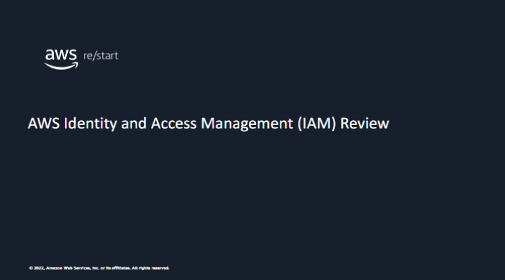

Welcome to lesson titled AWS Identity and Access Management (IAM) Review.

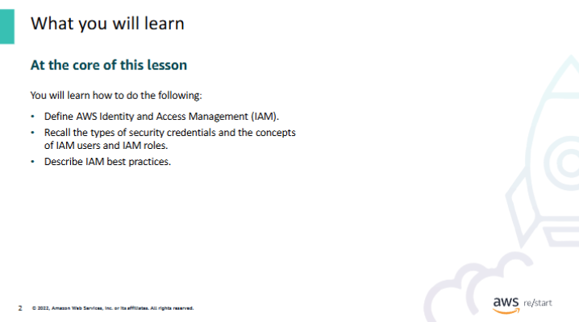

At the end of this lesson, you will be able to:

- Define AWS Identity and Access Management (IAM).
- Recall the types of security credentials and the concepts of IAM users and IAM roles.
- Describe IAM best practices.

## IAM

Now, you’ll review IAM, which you discussed earlier.

### Review of IAM

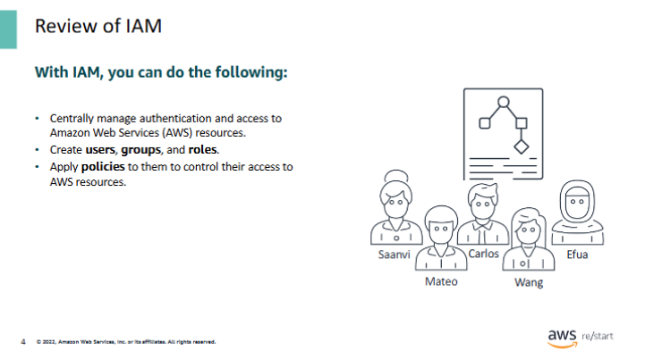

AWS Identity and Access Management (IAM) is a service that helps securely control access to AWS resources. With IAM, you can manage:

- **Who** can access specific AWS services
- **What actions** those users or systems are allowed to perform

#### Example
You can define who is allowed to terminate Amazon EC2 instances or access specific services.

---

#### IAM Core Functions

#### 🔐 Authentication
- Determines **who** can access AWS resources.
- IAM can authenticate users, applications, or AWS services.

#### ✅ Authorization
- Determines **what** authenticated users or systems are **allowed to do** with AWS resources.
- Controls actions like launching, managing, or deleting resources.

---

#### Key Benefits of IAM

- Centralized access management across all AWS services
- No need to share passwords or access keys manually
- Easily grant, restrict, or revoke user permissions over time
- Enables secure application and service access

---

#### Key Concept: **Principal**

A *principal* is a **person or application** that makes a request for an action or operation on an AWS resource.

---

#### Cost

IAM is a **free feature** included with every AWS account.

### Access to AWS services

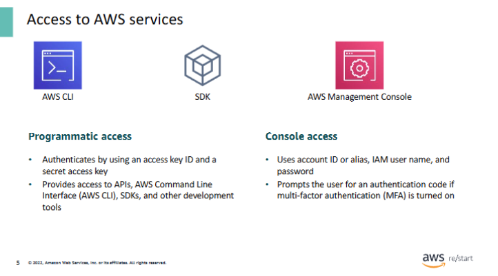

#### Providing Access to AWS

To provide **programmatic access**, create:

- An **access key ID**
- A **secret access key**

With these credentials, the user can access:

- AWS Command Line Interface (AWS CLI)
- AWS APIs (directly or via the AWS SDK)

---

To provide **AWS Management Console access**, assign:

- A **user name**
- A **password**

The AWS Management Console offers a web-based interface for managing AWS resources.

---

#### 🔐 Multi-Factor Authentication (MFA)

For added security, AWS recommends enabling **multi-factor authentication (MFA)** for IAM user accounts.

When MFA is enabled, the user will be prompted to enter an additional **authentication code** after providing their user name and password.

## Security credentials, IAM users, and IAM roles

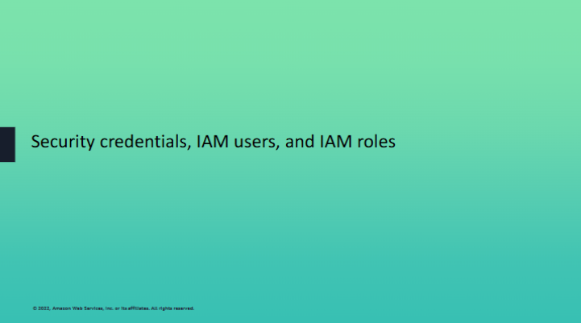

Next, you dive deeper into IAM.

### Types of security credentials

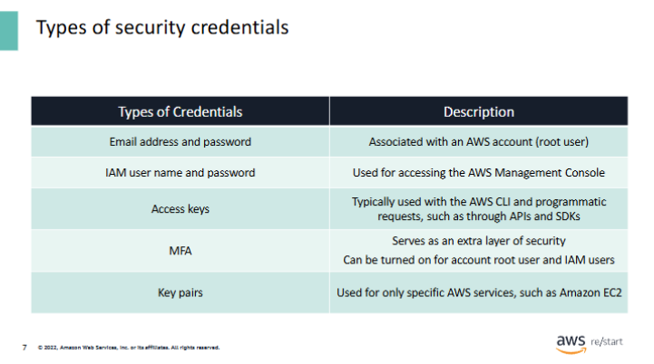

This table summarizes the different types of **security credentials**.

Each AWS account has an assigned **root user** through the user account.  
The account root user has an assigned **email address** for purposes of **account recovery** and **communication**.

However, **AWS recommends not using the root user** for everyday tasks, even administrative ones.  
Instead, follow this best practice:

- Use the **root user only** to create an **IAM user** first.
- Then, **securely lock away** the root user credentials.
- Use the root credentials **only** when performing essential account and service management tasks that **cannot be done otherwise**.

---

As mentioned previously:

- The **IAM user name and password** credentials are used to access the **AWS Management Console** (also called *the console*).
- **Access keys** can be used for **programmatic access** when they are generated for a user.

---

For **added security**, AWS recommends:

- Applying **Multi-Factor Authentication (MFA)** on:
  - The **root user**
  - All defined **IAM users**

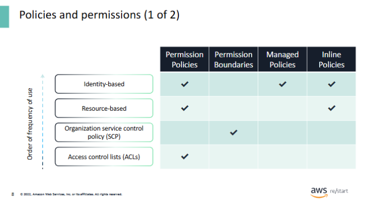

### Policy Types in AWS

**Policy types** indicate the kind of **permissions** that are defined for users or resources.  
The following are the **four policy types**, listed in order of popular usage:

---

1. **Identity-based policies**

- Allow a user to attach **managed** and **inline policies** to **IAM identities**, such as users or groups.
- Can also be attached to **IAM roles**.
- Identity-based policies are defined and stored as **JSON documents**.

---

2. **Resource-based policies**

- Allow a user to attach **inline policies to AWS resources**.
- Common examples:
  - **Amazon S3 bucket policies**
  - **IAM role trust policies**
- These are also stored as **JSON documents**.

**Resource-level permissions:**

- Available for **some AWS services** (not all)
- Provide **granular access control** to specific resources (e.g., specific EC2 instances or EBS volumes)

**Limitations:**

- Not all actions can be applied at the resource level.
  - Example:  
    - Actions like `Start`, `Stop`, `Reboot`, and `Terminate` can be used on **specific EC2 instances**.
    - Actions like `RunInstances` apply to **EC2 as a whole** (since instance ID is unknown before creation).

---

3. **Service Control Policies (SCPs)** – used with **AWS Organizations**

- Apply **permission boundaries** to:
  - AWS Organizations
  - Organizational Units (OUs)
  - Individual accounts
- Also use the **JSON** format.

---

4. **Access Control Lists (ACLs)**

- Control which **principals** (users or resources) can access a resource.
- Similar to resource-based policies.
- ✅ **Only policy type that does NOT use JSON format**

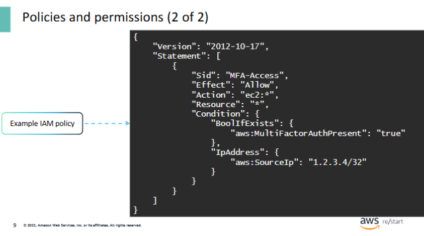

Remember that the **policy evaluation logic** involves the following steps:

1. **Authenticate** the principal that made the request.
2. **Process the request context** to determine which policies apply.
3. **Evaluate the applicable policies** in order, based on policy type.
4. **Determine whether the request is allowed**.

---

**Important Note:**

- The **evaluation order of policies** has **no effect on the final outcome**.
- If a user has an **explicit `DENY`** in one of their policies, it will **override any `ALLOW`**.

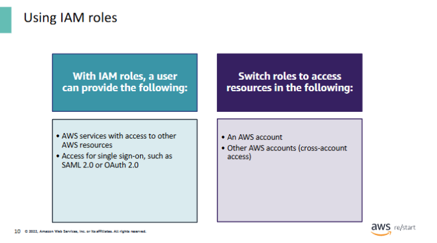

### Ways to Use an IAM Role

There are three ways to use a role in AWS:

- **Interactively** in the **IAM section** of the AWS Management Console  
- **Programmatically** with the **AWS CLI**  
- Through the **AWS SDKs** (via API calls)

---

#### Role Assumption by Applications or Services

An application or a service (such as **Amazon EC2**) can **assume a role**.  
It does this by requesting **temporary security credentials** for a role, which are then used to make **programmatic requests** to AWS.

---

#### IAM Roles and Single Sign-On (SSO)

IAM roles also support **single sign-on (SSO)** solutions.  
For example:

- An IAM administrator could configure **SAML 2.0 federation** instead of creating IAM users manually in AWS.
- With an **identity provider (IdP)**, user identities are managed **outside AWS**.
- These external identities can be granted **permissions** to access AWS resources.

---

#### Further Reading

- 📘 [IAM roles](https://docs.aws.amazon.com/IAM/latest/UserGuide/id_roles.html)  
- 🔍 [How IAM roles differ from resource-based policies](https://docs.aws.amazon.com/IAM/latest/UserGuide/id_roles_compare-resource-policies.html)  
- 🔐 [Policies and permissions in IAM](https://docs.aws.amazon.com/IAM/latest/UserGuide/access_policies.html)

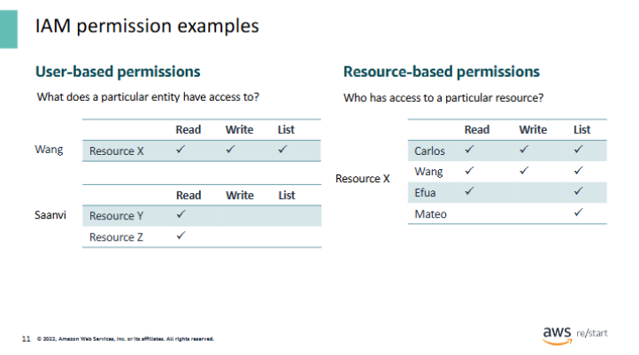

### IAM Permissions examples

A **role defines permissions** to resources.  
When the role is **assigned to a user**, the user gains the permissions defined in the role.  
Roles are used to grant **identity-based (user-based)** permissions.

---

#### 👤 User-based permissions (example):

- **User Xiulan** is assigned a role that provides:
  - ✅ Read
  - ✅ Write
  - ✅ List  
  ... access to **Resource X**

- **User Saanvi** is assigned a role that provides:
  - ✅ Read  
  ... access to **Resource Y** and **Resource Z**

---

#### 📦 Resource-based permissions (example):

Instead of assigning permissions to users, **permissions are attached directly to the resource**.

For **Resource X**, access is granted to the following users:

| User    | Read | Write | List |
|---------|------|-------|------|
| Carlos  | ✅   | ✅    | ✅   |
| Wang    | ✅   | ✅    | ✅   |
| Efua    | ✅   | ❌    | ✅   |
| Mateo   | ❌   | ❌    | ✅   |

This defines **who can access** the resource and **what actions** they are allowed to perform.

## IAM best practices

Next, you will learn about IAM best practices.

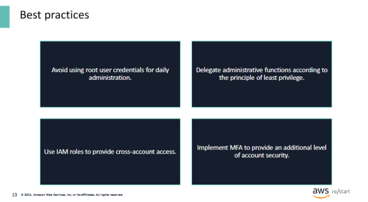

### Best Practices for IAM

1. **Avoid using the root user for daily administration**  
   - When setting up a new AWS account, create at least **one IAM user**.  
   - Grant that user permissions to perform **daily tasks** instead of using root credentials.

2. **Delegate using the principle of least privilege**  
   - Grant users access to **only the services and actions they need**.  
   - You can always expand permissions later if necessary.

3. **Use IAM roles for cross-account access**  
   - Roles are ideal for **granting temporary access** across AWS accounts.

4. **Follow additional IAM security best practices**  
   - Configure **strong password policies**  
   - Turn on **Multi-Factor Authentication (MFA)** for privileged users  
   - **Rotate credentials** regularly

5. **MFA is highly recommended**  
   - Adds an **extra layer of security** to your accounts and roles.

📘 Learn more:  
[Security best practices in IAM (AWS Docs)](https://docs.aws.amazon.com/IAM/latest/UserGuide/best-practices.html)

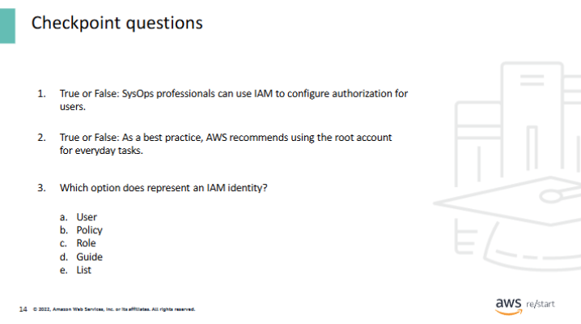

1. True or False: IAM can be used to configure authorization for users.

✅ **True**

2. True or False: As a best practice, AWS recommends using the root account for everyday tasks.

❌ **False** – AWS recommends **not** using the root account for everyday tasks.

3. Which option does not represent an IAM identity?

❌ **Policy** – A **policy** defines permissions but is **not** an IAM identity.

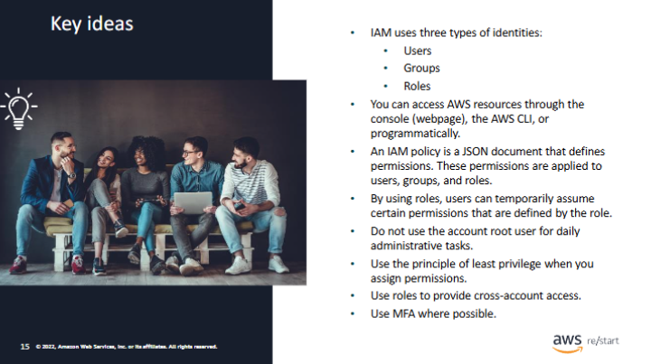

### Key Takeaways from this Lesson

- **IAM uses three types of identities:**
  - **Users**
  - **Groups**
  - **Roles**

- You can access AWS resources through:
  - The **Console** (web interface)
  - The **AWS CLI**
  - **Programmatic access** (e.g., via SDKs or API calls)

- An **IAM policy** is a **JSON document** that defines permissions.
  - These permissions are applied to **users**, **groups**, and **roles**.

- By using **roles**, users can **temporarily assume** certain permissions defined by the role.

- ⚠️ **Do not use the root user** for daily administrative tasks.

- ✅ Apply the **principle of least privilege** when assigning permissions.

- 🔁 Use **roles** to provide **cross-account access**.

- 🔐 Use **Multi-Factor Authentication (MFA)** wherever possible.
