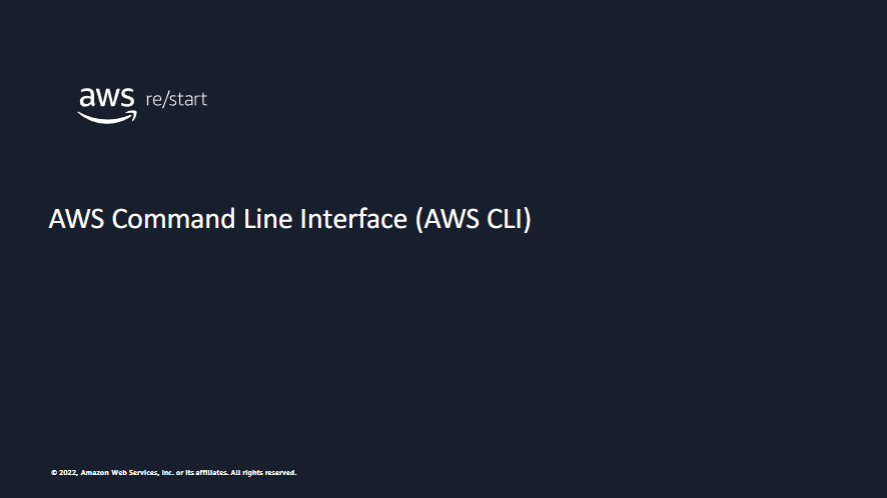

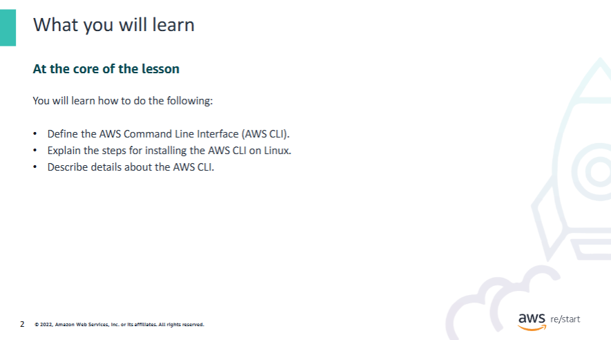

### Ways to Access AWS Services


All access options are built on a common, **REST-like API**, which serves as the foundation of AWS.  
There are **three main ways** to interact with AWS services:

---

#### 1. AWS Management Console

- Provides a **graphical user interface** (GUI) for most AWS products and services  
- Best for users who prefer **point-and-click navigation**
- Note: Newly launched features might **initially lack full functionality** in the console

---

#### 2. AWS Command Line Interface (CLI)

- Provides a **suite of utilities** for managing AWS resources via terminal
- Available on **Linux**, **macOS**, and **Windows**
- Useful for **automation, scripting**, and working at scale

---

#### 3. AWS Software Development Kits (SDKs)

- SDKs are programming libraries provided by AWS
- Available for **popular languages**, including:
  - **Python**
  - **Ruby**
  - **.NET**
  - **Java**
- Enable developers to:
  - Integrate AWS with existing applications
  - Deploy and monitor systems **entirely through code**

---

### Benefits of Using CLI and SDKs

- Provide **flexibility** and **customization**
- Allow users to:
  - Create **custom tools** tailored to their business
  - Automate workflows (e.g. launching EC2 instances)
  - Enforce usage of specific **Amazon Machine Images (AMIs)**
  - Apply **standard tags** to resources upon creation

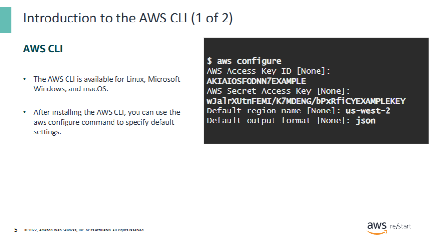

Here is a review of some basic information about the AWS CLI.

The **AWS CLI** is available for use on **Linux**, **Microsoft Windows**, and **macOS** platforms.  
It can also be installed on **EC2 instances** running Linux and Microsoft Windows, and it comes **installed by default** on **Amazon Linux** instances.

After installing the AWS CLI, you can use the `aws configure` command to set some default settings for all AWS CLI commands.

The main default settings are:

- **Access key ID**
- **Secret access key**

These values are associated with the **AWS Identity and Access Management (IAM)** account that you use to access AWS resources.

You can also specify a **default Region** for all commands.

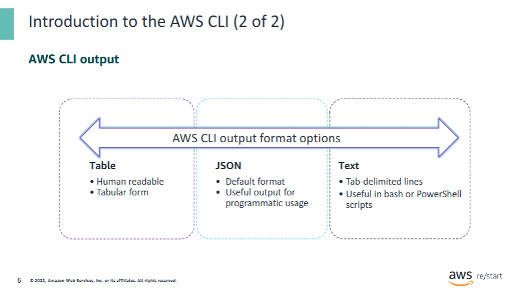

The default output data format is a **JavaScript Object Notation (JSON)** document,  
which is best used in situations where the output will be handled **programmatically**.

**JSON** is a standard for data formatting and interchange on the internet  
that can be both **read by humans** and **parsed by machines**.

Nearly all major programming languages and frameworks provide ways to convert JSON responses  
into objects or associative arrays.

---

However, the **AWS CLI** also supports two other output formats:

#### ASCII-formatted table

- This is the **most readable format** for humans.
- Data is displayed in a **tabular layout** with human-friendly representations.

To specify this output format in a **Linux instance**, run:

```bash
export AWS_DEFAULT_OUTPUT="table"
```

---

#### Tab-delimited text

- Displays data as **tab-delimited lines**
- Works well with **Unix text processing tools** and **PowerShell scripts**

To specify this format in a **Linux instance**, run:

```bash
export AWS_DEFAULT_OUTPUT="text"
```

---

📘 **For more information**, see:  
[Controlling Command Output from the AWS CLI](https://docs.aws.amazon.com/cli/latest/userguide/cli-usage-output.html)


### To install the AWS CLI (Linux), use the following steps:

1. **Use the `curl` command**  
   - The `-o` option specifies the file name for the downloaded package.  
   - The following command downloads the AWS CLI and saves it as `awscliv2.zip` in the current directory:

   ```bash
   curl "https://awscli.amazonaws.com/awscli-exe-linux-x86_64.zip" -o "awscliv2.zip"
   ```

2. **Extract the installer package**  
   - Use the `unzip` command to extract the contents of the zip file:

   ```bash
   unzip awscliv2.zip
   ```

   - By default, the files will be extracted to a directory named `aws` under the current directory.
   - You can use the built-in `unzip` package or an equivalent program.

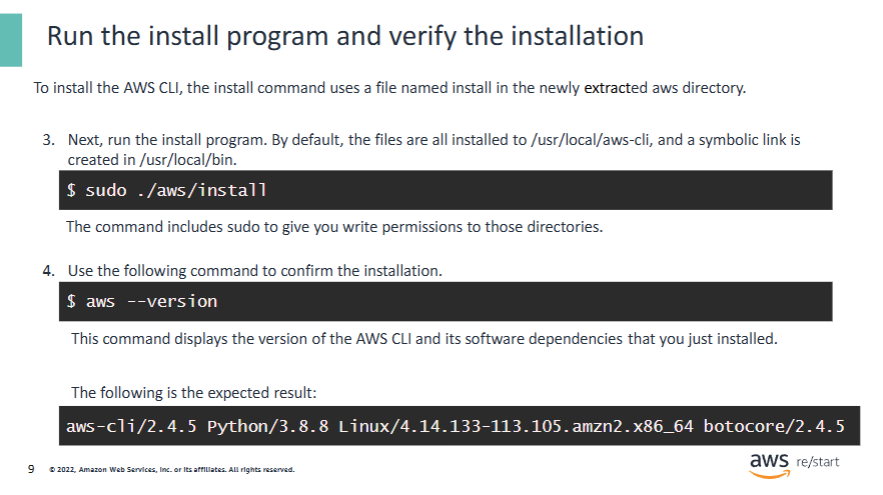

3. **Run the installer**

   Use the following command to install the AWS CLI:

   ```bash
   sudo ./aws/install
   ```

---

4. **Verify the installation**

   Run the following command to confirm that the AWS CLI has been installed successfully:

   ```bash
   aws --version
   ```

---

📘 **For more information** about troubleshooting and installation steps, see:  
[Installing or Updating the Latest Version of the AWS CLI](https://docs.aws.amazon.com/cli/latest/userguide/getting-started-install.html)


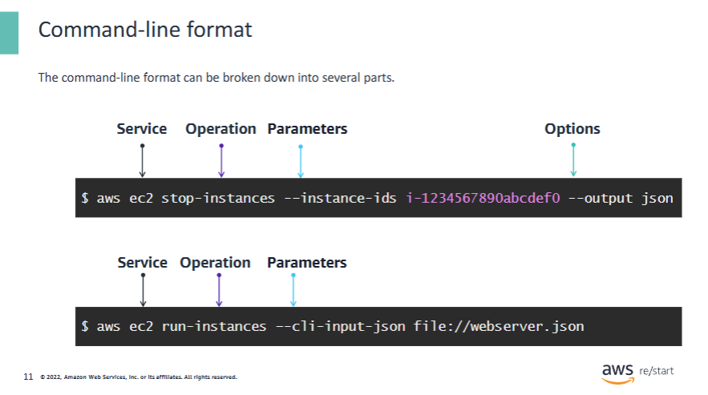

### AWS CLI Command Line Format

The command line format can be broken down into several parts:

---

1. **Invoke the AWS CLI program**

   Use the `aws` command to start any AWS CLI operation:

   ```bash
   aws
   ```

---

2. **Specify the top-level service**

   Example: To interact with **Amazon EC2**, include `ec2`:

   ```bash
   aws ec2
   ```

   📘 For a full list of supported services, see the AWS CLI Command Reference:  
   [https://awscli.amazonaws.com/v2/documentation/api/latest/reference/index.html](https://awscli.amazonaws.com/v2/documentation/api/latest/reference/index.html)

---

3. **Specify the operation to be performed**

   The operation is specific to the service. Examples include:

   - `stop-instances`
   - `run-instances`

   Example:

   ```bash
   aws ec2 run-instances
   ```

   → Requests creation of a new EC2 instance.

---

4. **Specify the parameters**

   Parameters define the **input details** for the operation.

   - Required or optional, depending on the operation
   - Parameter names are preceded by two dashes `--`

   Example:

   ```bash
   aws ec2 stop-instances --instance-ids i-1234567890abcdef0
   ```

   Alternatively, you can provide all parameters in a **JSON file**:

   ```bash
   aws ec2 run-instances --cli-input-json file://config.json
   ```

---

5. **Specify options**

   Options control **how the output is displayed**, among other things.

   Example:

   ```bash
   aws ec2 stop-instances --instance-ids i-1234567890abcdef0 --output table
   ```

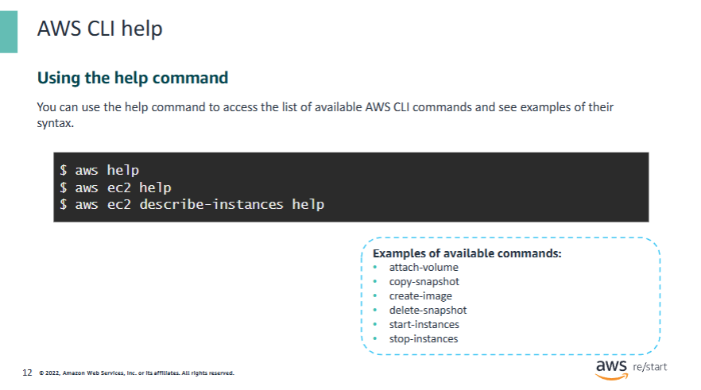

### Using the `help` Command in AWS CLI

You can use the `help` command to access the list of available AWS CLI commands  
and see examples of their syntax.

#### Example:

```bash
aws ec2 help
```

---

**Name:** `ec2`  
**Description:**  
Amazon Elastic Compute Cloud (Amazon EC2) provides secure and resizable computing capacity in the AWS Cloud.  
Using Amazon EC2 eliminates the need to invest in hardware up front, so you can develop and deploy applications faster.

---

**Available Commands:**

- `attach-volume`
- `copy-snapshot`
- `create-image`
- `delete-snapshot`
- `start-instances`
- `stop-instances`

---

📘 **For more information on the help command**, see:  
[Getting Help with the AWS CLI](https://docs.aws.amazon.com/cli/latest/userguide/cli-usage-help.html)

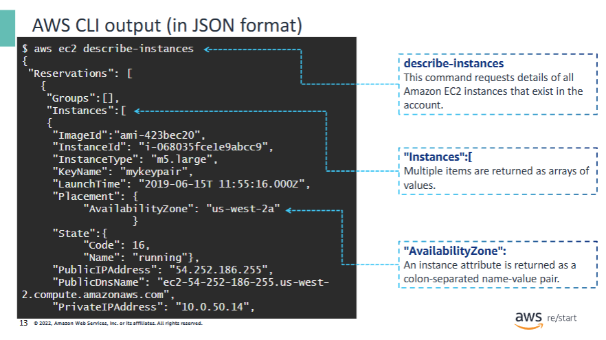

### Understanding `aws ec2 describe-instances`

The first line shows an AWS CLI command that was just run:

```bash
aws ec2 describe-instances
```

The rest of the output consists of the **result** of the command.

---

### Output Structure

- The results are returned as an **array of reservations**.
- Each **reservation** contains an array of one or more **instances**.
- Both **reservations** and **instances** use **JSON array syntax**.

---

### Instance Properties

- Each instance is described using **name-value pairs**:
  - Enclosed in **quotation marks**
  - Separated by **colons**

These properties can include:

- Public **DNS name**
- **Instance state**
- And many others

---

📘 **For more information**, see the AWS CLI Command Reference:  
[describe-instances – AWS CLI Command](https://awscli.amazonaws.com/v2/documentation/api/latest/reference/ec2/describe-instances.html)

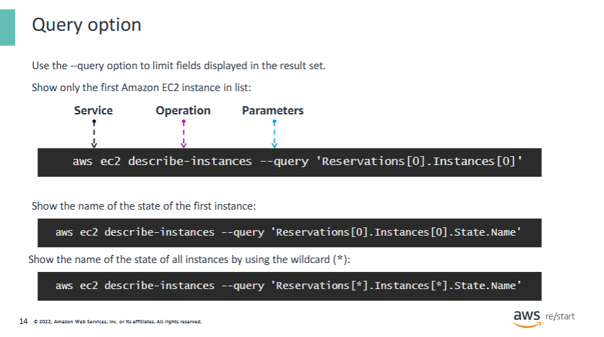

### Filtering AWS CLI Output with `--query`

The `--query` option can optionally be included in most AWS CLI commands  
to **limit the results** that are returned.

- ❗ Results are **filtered on the client side**.
- Queries should follow the **JMESPath** syntax.

📘 Learn more:  
[JMESPath Specification](https://jmespath.org/specification.html)

---

### How Queries Work

- Queries define the **subsection of the JSON response** you want to see.
- You specify the path starting from the **top-most element**.
- **Array elements** are referenced using **zero-based indexing**.

---

### Examples

#### ✅ First Instance of First Reservation

```bash
--query "Reservations[0].Instances[0]"
```

This says:  
👉 “For the **first reservation**, return the **first instance**.”

#### ✅ Specific Attribute of First Instance

```bash
--query "Reservations[0].Instances[0].State.Name"
```

Returns only the **current state** (e.g., `running`) of the first instance.

#### ✅ All Instance States Across All Reservations

```bash
--query "Reservations[*].Instances[*].State.Name"
```

- `[*]` is a **wildcard** for array elements.
- This returns the **state** of **all instances**, across **all reservations**.

You can use `[*]` anywhere in a path to apply the query to **all items in an array**.

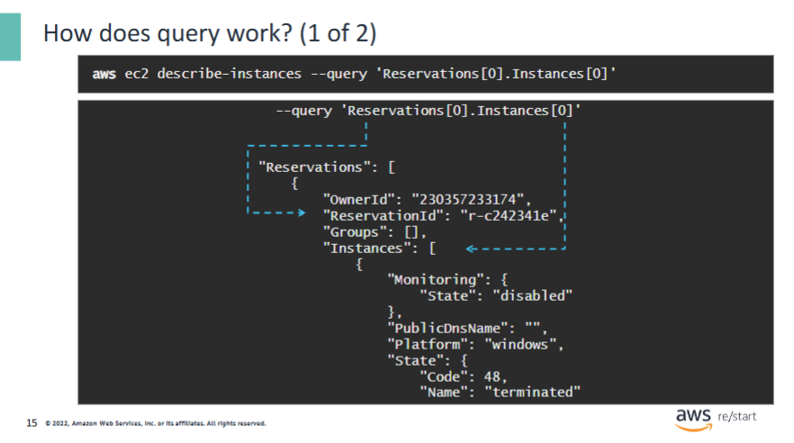

### Example Use of the `--query` Option

The `--query` option limits **what is displayed** from the returned results.

---

#### Example:

```bash
aws ec2 describe-instances --query "Reservations[0].Instances[0]"
```

Explanation:

- `Reservations[0]` → Returns **only the first reservation**
- `Instances[0]` → Returns **only the first EC2 instance** in that reservation

This is useful for **quick access** to a specific instance's details without displaying the full output.

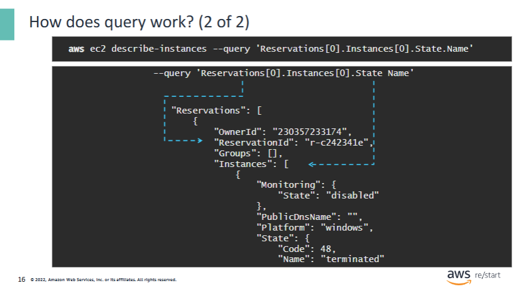

### Specific Query Example: Filtering for Instance State

In this example, the query is **more specific** than in the previous one.

#### Command:

```bash
aws ec2 describe-instances --query "Reservations[0].Instances[0].State.Name"
```

#### Explanation:

- Returns **only** the value of the **state name** of:
  - The **first instance**
  - In the **first reservation**

---

#### Example Output:

```text
"terminated"
```

---

### Why Use `--query`?

When querying a **large collection of instances**, the `--query` option is especially useful to:

- **Narrow down** results
- Identify instances based on **specific characteristics** (e.g. instance state, tags, AMIs, etc.)

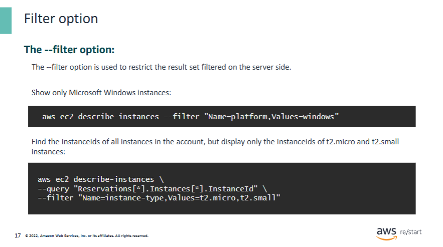

### Using the `--filter` Option

The `--filter` option is used to **restrict the result set on the server side**  
(before it is returned to the client).

---

### Example 1: Filter for Windows Server Instances

```bash
aws ec2 describe-instances --filters "Name=platform,Values=windows"
```

- This returns **only EC2 instances** that are running **Windows Server**.

---

### Example 2: Combining `--filter` and `--query`

```bash
aws ec2 describe-instances \
  --filters "Name=instance-type,Values=t2.micro,t2.small" \
  --query "Reservations[*].Instances[*].InstanceId"
```

- `--filter`: Limits results to **t2.micro** and **t2.small** instances.
- `--query`: Extracts and displays **only the InstanceIds** from the result set.

---

✅ Use `--filter` for **precise server-side filtering**, and combine with `--query` for **client-side result formatting**.

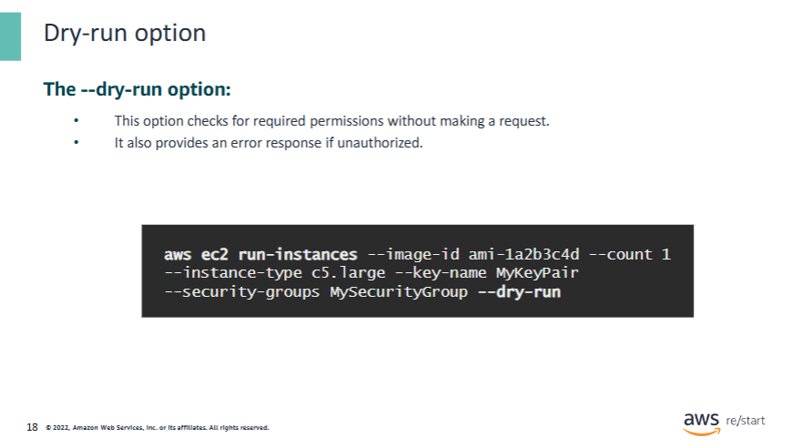

### Using the `--dry-run` Option

The `--dry-run` option is used for **testing purposes**.  
It checks whether you have the **required permissions** to perform an operation **without actually executing it**.

---

### Behavior

- If the operation **is authorized**, the CLI returns:

```text
An error occurred (DryRunOperation) when calling the <operationName> operation:
Request would have succeeded, but DryRun flag is set.
```

- If the operation **is not authorized**, the CLI returns:

```text
An error occurred (UnauthorizedOperation) when calling the <operationName> operation:
You are not authorized to perform this operation.
```

---

✅ Use `--dry-run` to safely verify permission setups **before running real changes**.

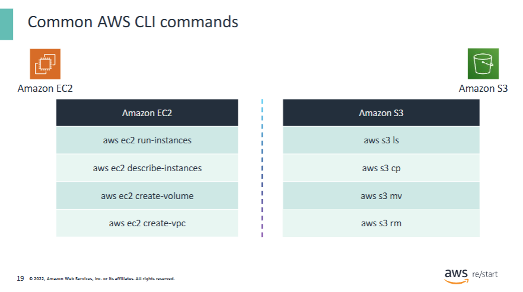

### Common AWS CLI Commands

This is a short list of commonly used AWS CLI commands  
for two of the most popular AWS services: **Amazon EC2** and **Amazon S3**.

---

### 📦 Amazon EC2 Commands

These commands also cover actions related to **Amazon VPC** and **Amazon EBS**.

- `aws ec2 run-instances`  
  → Launches the specified number of instances from an AMI.

- `aws ec2 describe-instances`  
  → Describes any EC2 instances that exist in the account.

- `aws ec2 create-volume`  
  → Creates an **EBS volume** that can be attached to an instance in the same Availability Zone.

- `aws ec2 create-vpc`  
  → Creates a **VPC** using the specified CIDR block.

---

### ☁️ Amazon S3 Commands

- `aws s3 ls`  
  → Lists S3 objects and common prefixes under a prefix, or all S3 buckets.  
  → If a bucket is specified, it lists the contents of that bucket.

- `aws s3 cp`  
  → Copies a file **to**, **from**, or **between** S3 locations.  
  → Use it to:
    - Copy local files to S3
    - Copy files from S3 to local machine
    - Copy files between S3 buckets

- `aws s3 mv`  
  → Moves a file or object **locally** or **within S3**.

- `aws s3 rm`  
  → Deletes an **S3 object**.

---

✅ These basic commands are a great starting point for working with AWS via the CLI.

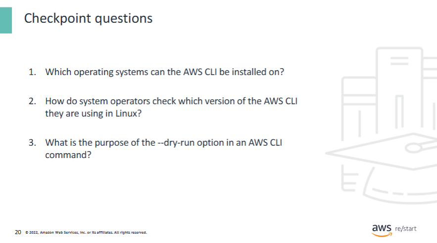

<details>
<summary>1. Which operating systems can the AWS CLI be installed on?</summary>
✅ **Linux**, **macOS**, and **Windows**
</details>

<details>
<summary>2. How do system operators check which version of the AWS CLI they are using in Linux?</summary>
🖥️ Use the following command:

```bash
aws --version
```
</details>

<details>
<summary>3. What is the purpose of the <code>--dry-run</code> option in an AWS CLI command?</summary>
🧪 The `--dry-run` option is used for **testing purposes**.  
It checks whether the required **permissions** for the action are present **without executing** the request.
</details>

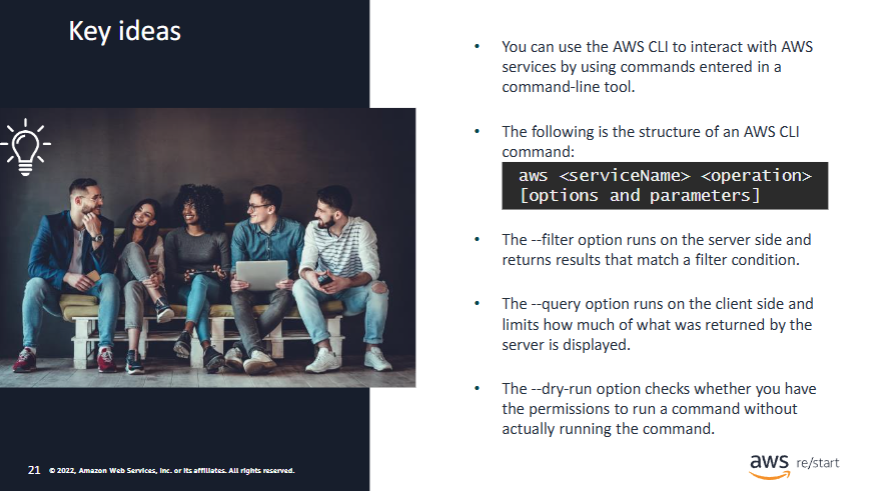
