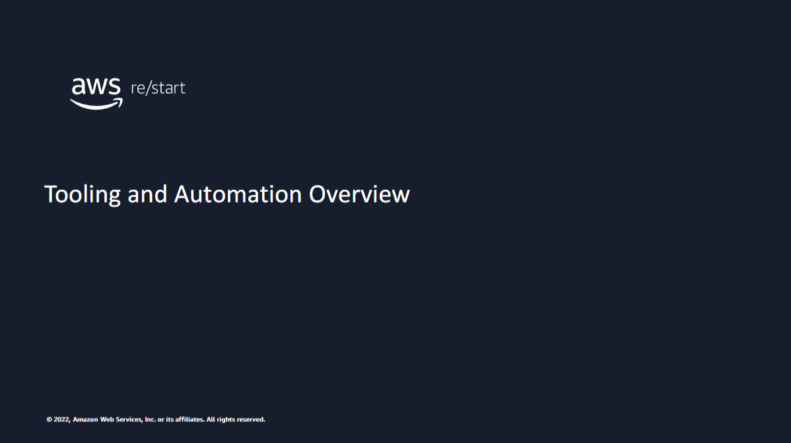
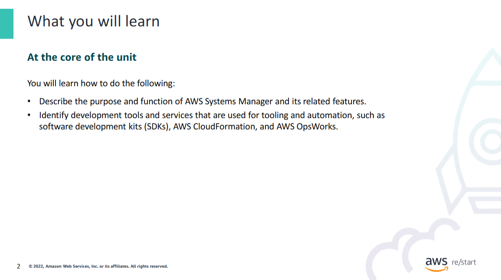
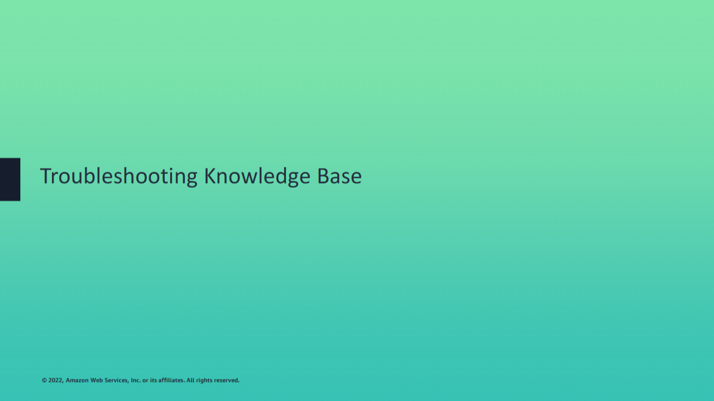
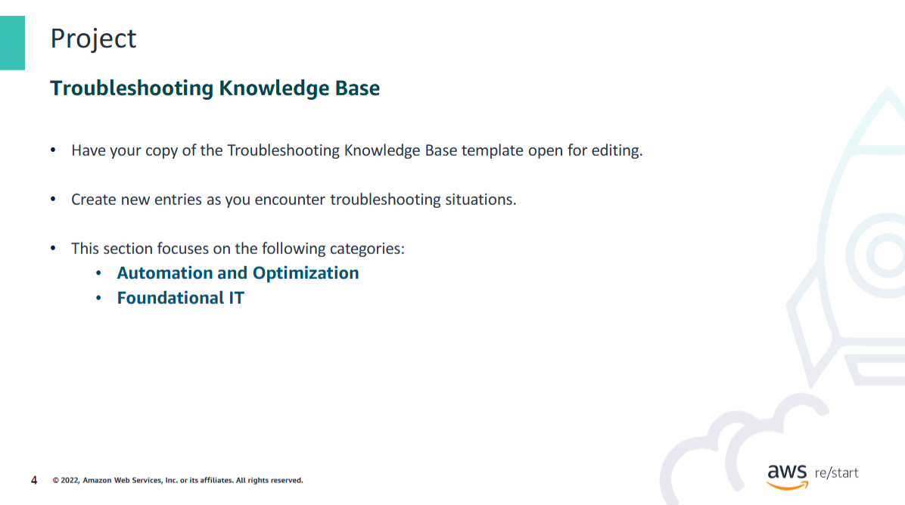

Be ready to create some entries in your Troubleshooting Knowledge Base document based on the Tooling and Automation topics.

For these topics, add entries in the Automation and Optimization category of your knowledge base. You can also create entries in the Foundational IT category for other general issues that you troubleshoot.
