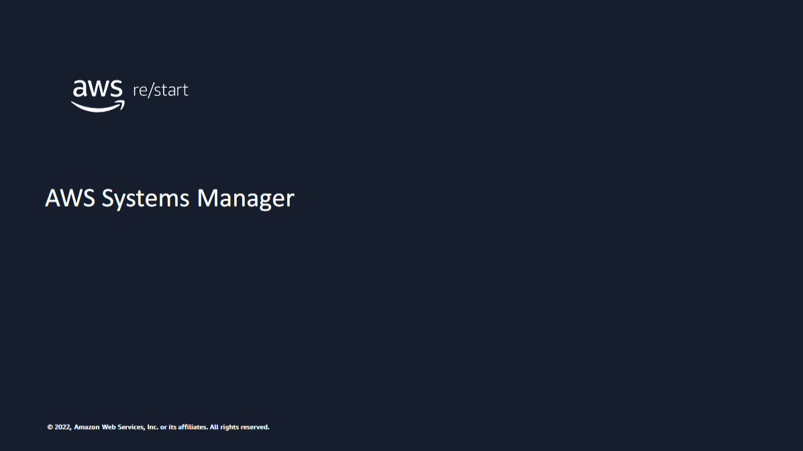

Welcome to AWS Systems Manager.

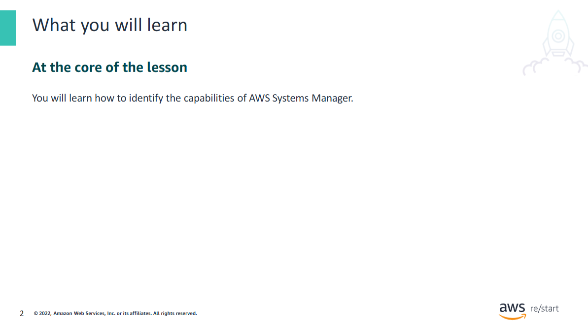

At the end of this lesson, you will be able to identify the capabilities of AWS Systems Manager.


## AWS Systems Manager Overview

**Systems Manager** is a management service that helps users perform and automate various **administration tasks**, including:

- Collecting software inventory  
- Configuring **Microsoft Windows** and **Linux** operating systems  
- Applying **OS patches**  
- Creating **system images**

---

### Key Features

- Automates the **configuration and management** of systems both:
  - **On premises**
  - In the **AWS Cloud**

- Users can:
  - Select the **instances** they want to manage
  - Define the **management tasks** they want to perform

---

### Benefits for SysOps Specialists

Systems Manager provides many **capabilities and benefits** that are especially useful for **Systems Operations (SysOps)** professionals, helping them streamline routine operations and automate complex tasks.

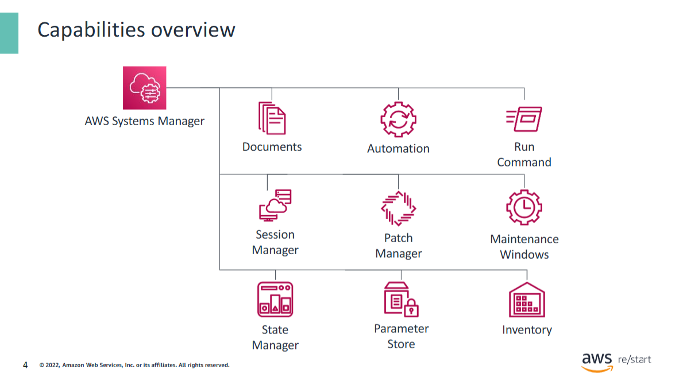

This slide shows the core capabilities of Systems Manager. You will learn more details about them in the subsequent slides.

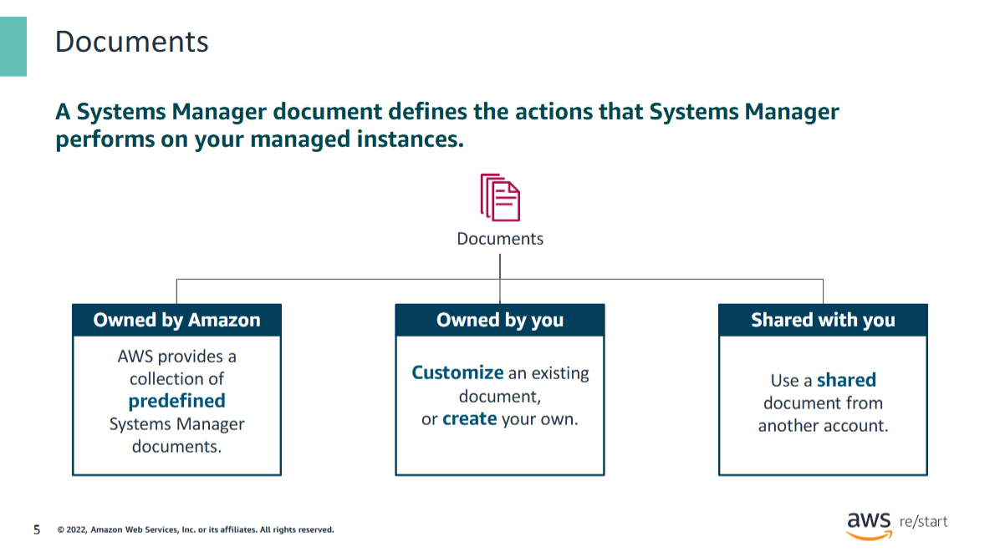

Documents are a core capability of many Systems Manager features. They define the steps and parameters of the actions that you want to perform on instances. Systems Manager document (SSM document) types include Command documents, which are used by State Manager and Run Command, and Automation runbooks, which are used by Systems Manager Automation.

Documents can be authored in JSON or YAML. You can use apredefined Systems Manager document, create your own custom document, or use a shared document.

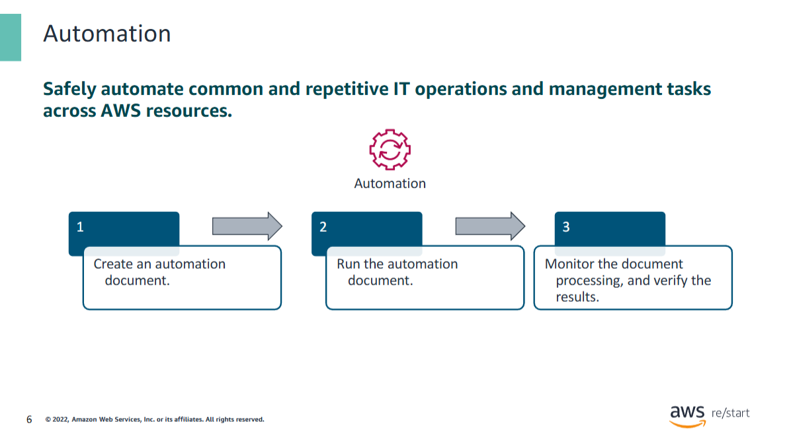

## AWS Systems Manager – Automation Capability

The **Automation** capability in **AWS Systems Manager** allows you to define common IT tasks  
as a collection of **steps in an SSM document**.

These steps can then be run across an entire collection of AWS resources.

---

### Use Cases

Examples of tasks you can automate:

- Remediating **unreachable instances**
- Creating **golden AMIs**
- Patching **instances**

Custom automations can also be authored in **JSON**.

> 🔁 You can use **Amazon EventBridge** to automatically trigger Systems Manager automations.

---

### Suggested Development & Testing Approach

1. **Create an automation document**  
   Or use an existing **template** with steps and parameters that Systems Manager can run sequentially.

2. **Run the automation document**  
   Depending on the requested actions, Systems Manager can automatically:

   - Launch an instance  
   - Take a snapshot  
   - Tag an instance  
   - Delete old images  
   - Terminate an EC2 instance

3. **Monitor the automation workflow**  
   - Use the **AWS Management Console** or other tools.
   - After completion, **validate the results**.

   Example:  
   Launch a **test instance** from an AMI that was updated by the automation to confirm expected characteristics.

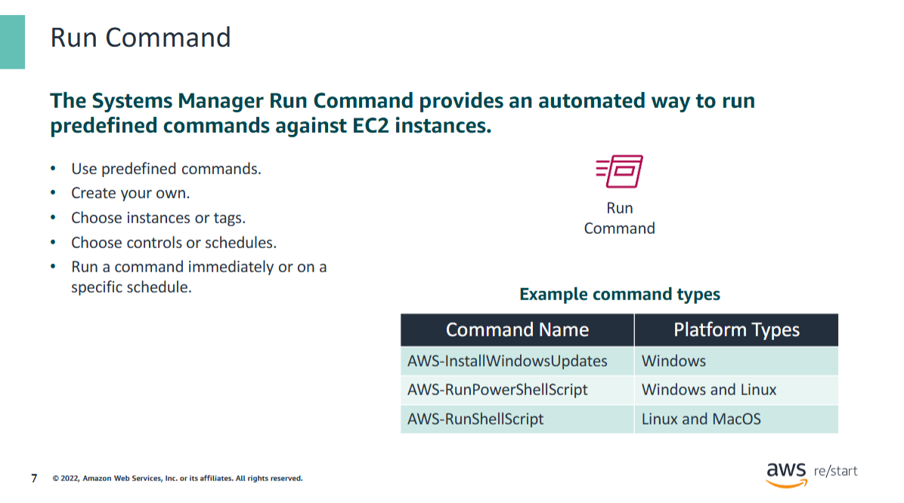

## AWS Systems Manager – Run Command

**Run Command** allows you to automate **common administrative tasks** and perform  
**configuration changes at scale** across multiple instances.

---

### Key Features

- Use **predefined Command documents** or **create your own**
- Select target instances **manually** or **by tag**
- Set **safety controls** to define how many instances can be affected
- Run commands **immediately** or based on a **schedule**

---

### Benefits

✅ Reduces management overhead:  
You can manage instances **without**:

- Setting up **bastion hosts**
- Managing **SSH keys** and **certificates**

✅ Access from multiple interfaces:

- **AWS Management Console**
- **AWS CLI**
- **AWS Tools for Windows PowerShell**
- **AWS SDKs**

---

### Example Predefined Commands

| Command                      | Description                                                                 | Supported OS        |
|-----------------------------|-----------------------------------------------------------------------------|---------------------|
| `AWS-InstallWindowsUpdates` | Scans for or installs missing updates on a Windows instance (optionally reboots) | Windows             |
| `AWS-RunPowerShellScript`   | Runs a PowerShell script                                                     | Windows, Linux      |
| `AWS-RunShellScript`        | Runs a shell script                                                          | Linux, macOS        |

---

Run Command is ideal for **secure, remote administration** of EC2 instances without the need for direct access.

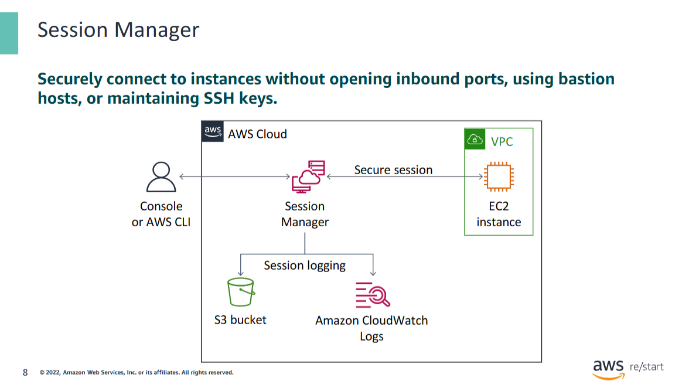

With the Session Manager capability in Systems Manager, you can manage your EC2 instances through an interactive browser-based shell in the AWS Management Console. You can use also use the AWS CLI or SSH to start a session.

Session Manager provides secure and auditable instance management without the need to open inbound ports in the security groups, maintain bastion host instances in Amazon EC2 subnets, or manage SSH keys.

Session Manager also helps you comply with corporate policies that require controlled access to instances, strict security practices, and auditable logs that contain instance access details.

When you can connect to a Linux or Windows EC2 instance, Session Manager tracks each user who started a session on each instance. You can audit which user accessed an instance and when they accessed the instance using AWS CloudTrail. You can also configure Session Manager to log every command performed on an instance to Amazon Simple Storage Service (Amazon S3) or Amazon CloudWatch Logs.

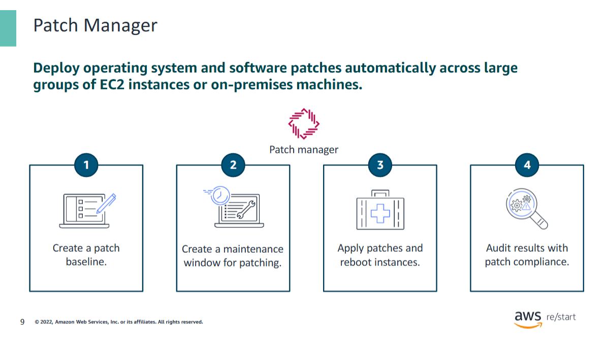

## AWS Systems Manager – Patch Manager

Patching servers and instances manually can lead to various challenges:

#### Common Challenges

- ⏳ Time-consuming process across **multiple EC2 instances** or **on-premises machines**
- 🔁 **Repetitive** and error-prone tasks
- ⚠️ Risk of **downtime** due to errors
- 📋 **Compliance** and audit requirements

---

### Automating Patching with Patch Manager

You can use **Patch Manager** to automate the patching process by following these steps:

1. **Create a patch baseline**  
   - Define rules that automatically **approve or reject** released patches.

2. **Define a maintenance window**  
   - Schedule when patches should be applied.
   - Group instances together for targeted patching.

3. **Apply patches during the maintenance window**  
   - Patches are deployed and each instance in the patch group is **rebooted** if required.

4. **Review results and compliance reports**  
   - Check the **patch status** and ensure that instances are compliant with the defined baseline.

---

✅ Patch Manager helps you **standardize**, **automate**, and **secure** your patching workflows across AWS and hybrid environments.

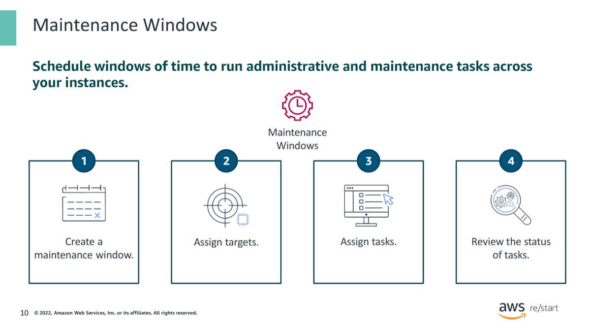

## AWS Systems Manager – Maintenance Windows

**Maintenance Windows** let you define a schedule for performing  
**potentially disruptive actions** on your instances.

These actions may include:

- Patching an **operating system**
- Updating **drivers**
- Installing **software or patches**

✅ Scheduled actions are run **automatically**  
✅ You can configure:

- Limits on **simultaneous task runs**
- Allowable **error rates**

---

### Steps to Implement a Maintenance Window

1. **Create a maintenance window**  
   - Set basic options: **name**, **schedule**, and **duration**

2. **Assign targets**  
   - Specify which **resources** (instances or groups) will be updated

3. **Assign tasks**  
   Types of tasks include:
   - Commands via **Run Command**
   - **Systems Manager Automation** workflows
   - **AWS Step Functions** workflows
   - **AWS Lambda** functions

4. **Review task status**  
   - After execution, monitor and **validate task outcomes**

---

🕒 Maintenance Windows ensure that system updates occur in a **controlled**, **scheduled**, and **auditable** manner.

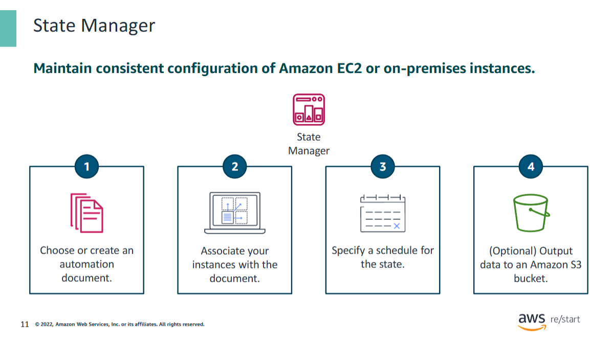

## AWS Systems Manager – State Manager

**State Manager** is a **secure** and **scalable** configuration management service  
that automates the process of keeping your **EC2** and **hybrid infrastructure**  
in a desired, defined state.

---

### Benefits

- ✅ Prevents **configuration drift**
- ✅ Monitors the **status** of an instance's intended configuration
- ✅ Ensures **consistency** across environments

---

### How State Manager Works

1. **Choose or create an SSM document**  
   - Defines the actions that State Manager will perform on managed instances  
   - Describes the **desired state** (e.g., install software, apply settings)

2. **Associate instances with the document**  
   - Targets can be **individual instances** or **groups**  
   - Association defines which instances are affected

3. **Define a schedule**  
   - Set how often the configured state should be **reapplied**

4. **Optional: Store output in S3**  
   - When creating the association, choose to write command output to an **Amazon S3 bucket**  
   - Useful for auditing and monitoring results

---

🛠️ Use State Manager to ensure your systems always maintain a **compliant and intended configuration**.

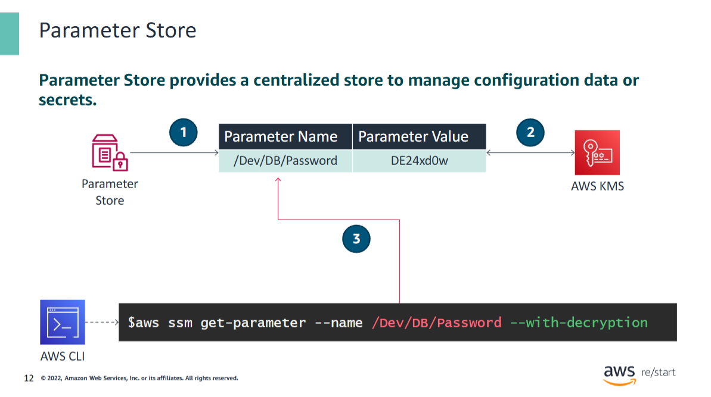

## AWS Systems Manager – Parameter Store

**Parameter Store** provides secure, hierarchical storage for:

- 🛠️ **Configuration data management**
- 🔐 **Secrets management**

It stores data as **name-value pairs** and supports both:

- **Plain text** values
- **Encrypted** values (via **AWS Key Management Service – KMS**)

---

### Common Use Cases

You can store and reference values such as:

- Passwords
- Database connection strings
- AMI IDs

These parameters can be referenced in:

- Scripts
- CLI commands
- SSM documents
- Configuration & automation workflows

---

### Example Workflow

1. **Create a parameter**

   - Name: `/Dev/DB/Password`  
   - Purpose: Store a **database password** for the **Dev** environment  
   - Data type: **SecureString** (sensitive, encrypted)

2. **Encryption**

   - Parameter Store uses **AWS KMS** to **encrypt** the value (e.g., `DE24xd0w`)

3. **Retrieve the parameter using AWS CLI**

   ```bash
   aws ssm get-parameter \
     --name "/Dev/DB/Password" \
     --with-decryption
   ```

   - The `--with-decryption` flag returns the **decrypted value** of the secure parameter.

---

✅ Use Parameter Store to securely manage sensitive configuration data across environments.

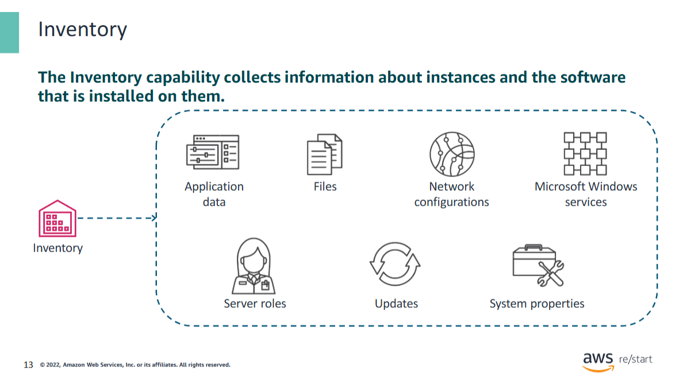

## AWS Systems Manager – Inventory

The **Inventory** capability in Systems Manager enables you to **collect metadata**  
about your EC2 instances and the **software installed** on them.

---

### Examples of Collected Data

- 📦 **Application data**
- 📁 **Files**
- 🌐 **Network configurations**
- ⚙️ **Windows services**
- 🖥️ **Server roles**
- 🔄 **Updates**
- 🧾 **System properties**

---

### Benefits of Using Inventory

- 🔍 **Comprehensive insight** into system configurations  
- 🧰 Manage **application assets** and software versions  
- 🔐 Monitor **file integrity**
- 🧾 Track **license usage**
- 📦 Discover applications **not installed** via traditional installers
- ✅ No need to log in to each instance individually

---

💡 Inventory simplifies **compliance**, **auditing**, and **asset management** across your cloud and hybrid infrastructure.

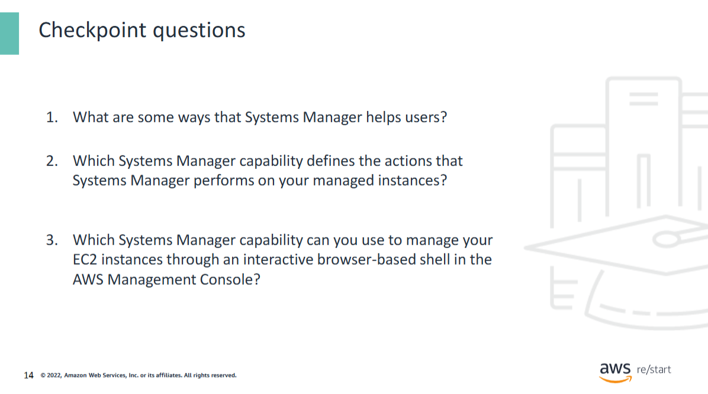

<details>
<summary>1. What are some ways that Systems Manager helps users?</summary>

Systems Manager helps users perform and automate administration tasks, including the following:

- Collect software inventory  
- Configure operating systems  
- Apply OS patches  
- Create system images

</details>

<details>
<summary>2. Which Systems Manager capability defines the actions that Systems Manager performs on your managed instances?</summary>

**Documents**  
</details>

<details>
<summary>3. Which Systems Manager capability can you use to manage your EC2 instances through an interactive browser-based shell in the AWS Management Console?</summary>

**Session Manager**  
</details>

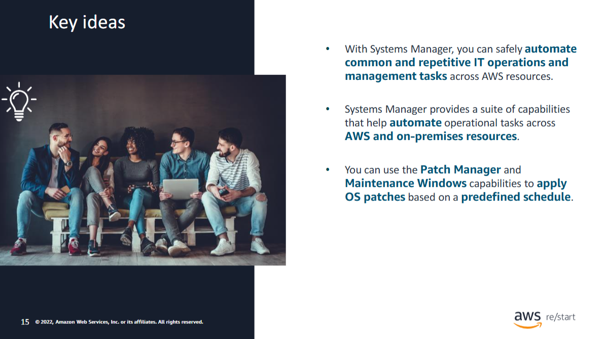

### Lesson Summary – Key Takeaways

- ✅ With **Systems Manager**, you can safely **automate common and repetitive IT operations**  
  and management tasks across AWS resources.

- 🧰 Systems Manager provides a **suite of capabilities** that help automate  
  **operational tasks** across both **AWS** and **on-premises** resources.

- 🛠️ You can use **Patch Manager** and **Maintenance Windows** to  
  **apply OS patches** based on a **predefined schedule**.
