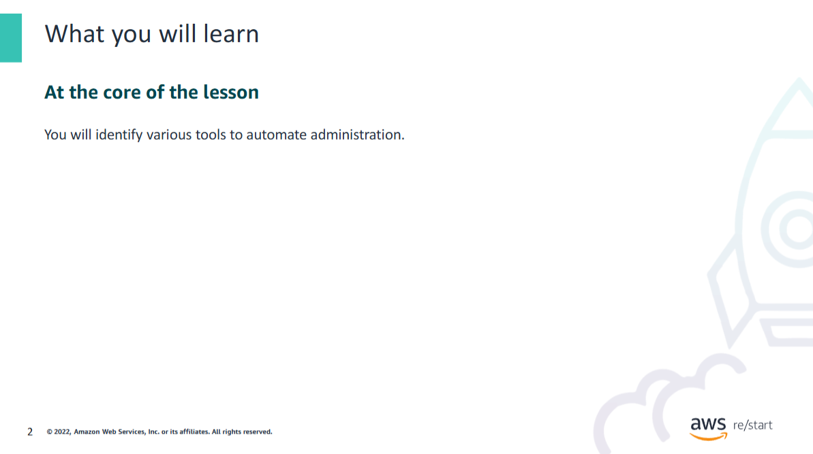
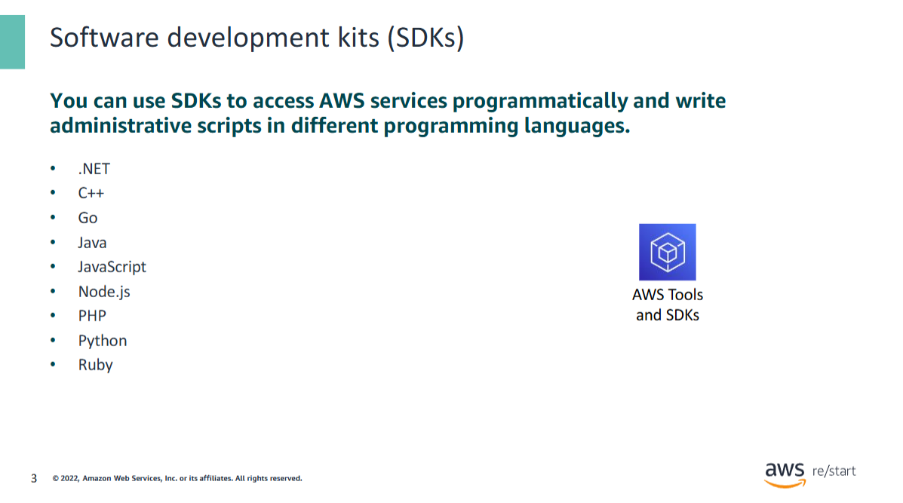
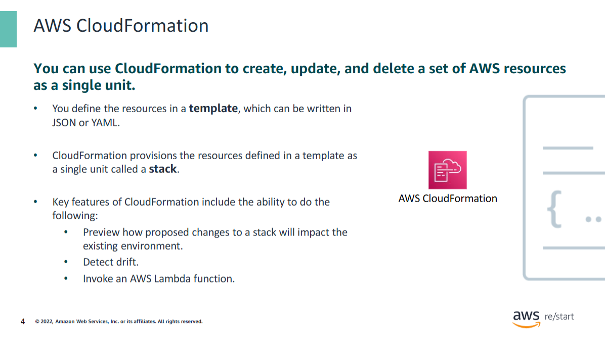
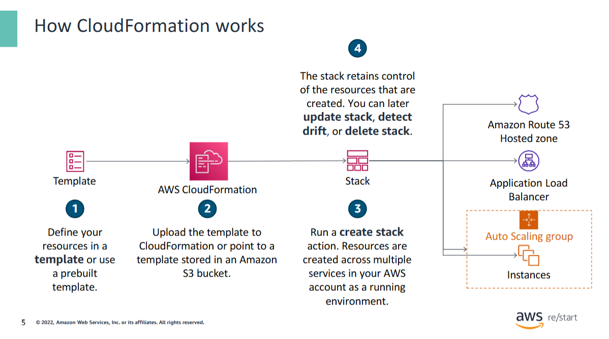
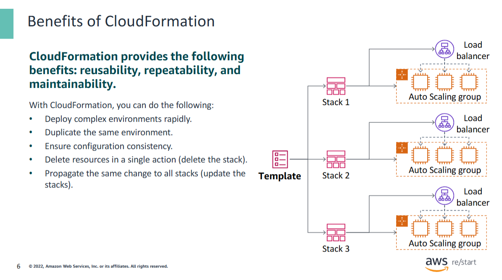
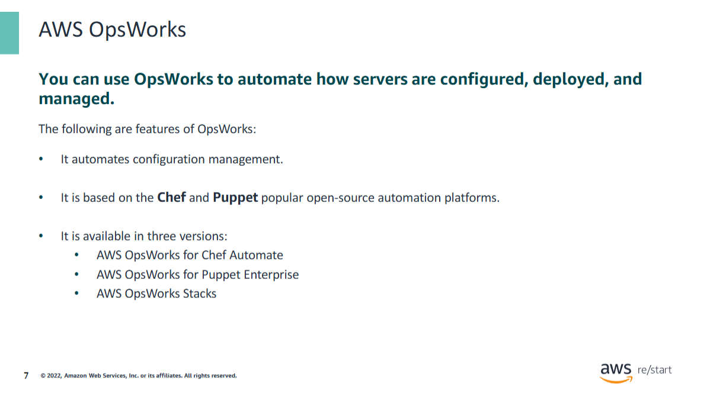
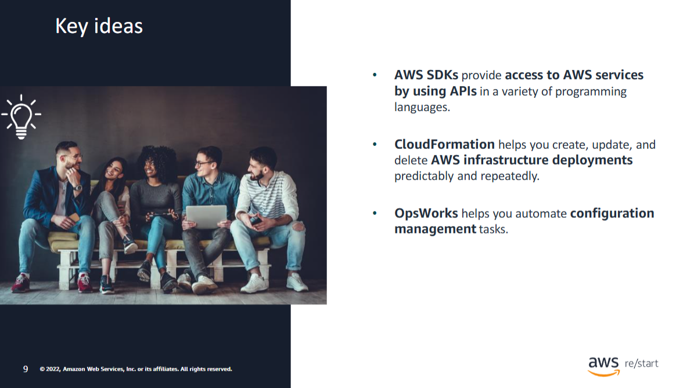

Welcome to Administration Tools.

In this lesson, you will learn about various automation tools.

## AWS Software development kits (SDKs)

The concept of **Infrastructure as Code (IaC)** is fundamental to **cloud computing** and  
sets it apart from traditional IT environments.

AWS provides:

- **Software Development Kits (SDKs)**  
- **Application Programming Interfaces (APIs)**  

These tools allow you to **manage AWS resources programmatically** using an IaC approach.

### Key Points

- AWS SDKs are **language-specific** and contain APIs for each supported language.
- Developers and administrators can use SDKs and APIs to:
  - Integrate AWS service functionality into their applications
  - Avoid writing low-level code from scratch
- AWS SDKs offer:
  - Extensive documentation
  - Getting started guides
  - Developer guides
  - API references
  - Community forums and developer blogs

### Supported Languages

In addition to widely used languages, AWS SDKs are also available for:

- Kotlin
- Rust
- Swift

📚 **Learn more**: [Tools to Build on AWS](https://aws.amazon.com/developer/tools/)

### AWS CloudFormation

**AWS CloudFormation** is a tool that enables you to **create, update, or delete entire AWS infrastructure deployments** predictably and repeatedly.

#### Infrastructure as Code

- You can model your entire infrastructure in a **single text file** written in **JSON** or **YAML**.
- This **template** defines all the required AWS resources for a **stack**.

#### What is a Stack?

A **CloudFormation stack** is a **collection of AWS resources** that can be managed as a **single unit**.  
You can:
- Create
- Update
- Delete  
entire sets of resources via stack operations.

**Examples of stack resources include:**
- Amazon EC2 instances
- Amazon RDS instances
- Virtual Private Clouds (VPCs)
- Many other AWS services

#### Previewing Changes

CloudFormation enables you to:
- **Preview** how proposed changes will affect existing resources.
- Check if changes would **delete** or **replace** critical components.
- Apply only the changes you explicitly approve.

#### Drift Detection

CloudFormation also provides **drift detection**:

- It checks if the **actual configuration** of a stack’s resources differs from its **expected configuration** (as defined in the template).
- A **resource is considered "drifted"** if:
  - Any of its properties have changed,
  - A property was removed,
  - Or the resource was deleted.
- A **stack is drifted** if **one or more** of its resources have drifted.
- Supported resources return **detailed drift status** when checked.

#### Custom Extensions with AWS Lambda

CloudFormation supports **custom provisioning logic** using **AWS Lambda**:

- You can build **custom extensions** to a stack template.
- Example: Write a Lambda function to look up the **latest AMI ID** and inject it into the stack.
- The Lambda function is invoked during stack creation to perform **custom tasks**.

📌 This allows you to **extend CloudFormation’s capabilities** beyond the default supported resources.

### How AWS CloudFormation Works

This diagram illustrates the **workflow of AWS CloudFormation**:

---

#### 1. Define Resources in a Template

You begin by defining the **AWS resources** you want to create in a **CloudFormation template**.  
Example resources:
- EC2 instances  
- Application Load Balancer  
- Auto Scaling group  
- Amazon Route 53 hosted zone  

You can:
- Create the template **from scratch**  
- Use a **prebuilt** or **sample** template  

---

#### 2. Upload the Template

Upload the template:
- Directly into **CloudFormation**
- Or store it on **Amazon S3** and provide CloudFormation with the S3 URL

---

#### 3. Run `Create Stack`

Initiate the **Create Stack** action:

- CloudFormation reads the template.
- It **provisions** and **configures** the defined resources in your AWS account.
- All resources are created within a **single Region** under one **stack**.

---

#### 4. Monitor and Manage the Stack

- **Monitor the stack creation progress** in the AWS Console or CLI.
- Once complete, all defined **resources exist in your account**.
- The **stack object remains** and serves as a **handle** to manage those resources.

You can now:
- **Update the stack** to add or modify resources  
- **Delete the stack** to automatically delete all associated resources  

---

📌 CloudFormation enables predictable and repeatable infrastructure deployment, all managed through a single stack.

### Benefits of AWS CloudFormation and Infrastructure as Code (IaC)

AWS CloudFormation enables **Infrastructure as Code (IaC)**, which provides several key benefits:

---

#### ✅ Reusability, Repeatability, and Maintainability

- You can define infrastructure once in a **template** and **reuse** it for multiple environments.
- **Repeat deployments** of complex infrastructure become reliable and consistent.
- Infrastructure becomes **easier to maintain and update** across different environments.

---

#### ⚙️ Rapid Deployment of Complex Environments

- A **single template** can create **multiple stacks** (e.g., for development, testing, production).
- Stacks are created **rapidly**, often in **minutes**.
- Each stack has **identical configuration**, reducing risk and inconsistencies.

> 💡 Example:
> - **Stack 2** = Test Environment  
> - **Stack 3** = Production Environment  
>  
> If tests perform well in Stack 2, there's a high confidence they'll perform well in Stack 3, because both stacks are based on the same template.

---

#### 🔄 Easy Updates and Rollouts

- When a change is needed:
  - Update the **template** once.
  - Use it to **update all stacks**.
- This process ensures consistent updates across environments.

---

#### 🧹 Simplified Cleanup and Cost Control

- When you no longer need an environment (e.g., a test stack):
  - Simply **delete the stack**.
  - CloudFormation automatically deletes all associated resources.
- This prevents **unnecessary costs** from unused resources.

---

📌 **Summary:**  
CloudFormation gives you **control, speed, and confidence** when deploying and managing AWS infrastructure, while also keeping it consistent and cost-effective.

### AWS OpsWorks – Configuration Management in the Cloud

**AWS OpsWorks** is a **configuration management service** that provides managed instances of **Chef** and **Puppet**. These are automation platforms that allow you to use **code** to configure, deploy, and manage servers.

---

#### 🛠 What You Can Do With OpsWorks

With OpsWorks, you can:
- Automate **server configuration** and deployment
- Manage environments across **EC2 instances** or **on-premises infrastructure**
- Define infrastructure setups as **code**, similar to how you manage application source code

---

#### 🚀 OpsWorks Offerings

1. **AWS OpsWorks for Chef Automate**
   - Provides a **fully managed Chef Automate server**
   - Supports automation of:
     - Software and OS configurations
     - Continuous compliance
     - Package installations
     - Database setups

2. **AWS OpsWorks for Puppet Enterprise**
   - Provides a **managed Puppet Enterprise server**
   - Includes orchestration and provisioning tools
   - Enables you to:
     - Define server configurations as code
     - Maintain and version configurations

3. **AWS OpsWorks Stacks**
   - Chef-based service
   - Helps configure and operate **applications of all sizes**
   - Supports stack-based infrastructure design and deployment

---

🔗 **More info:** [AWS OpsWorks Documentation](https://aws.amazon.com/opsworks/)

1. Which AWS tool can a developer use to write an automated script in Python to access an AWS service?

AWS SDK for Python

2. In which CloudFormation component would an administrator define the AWS infrastructure resources that they want to provision?

Template

3. Which AWS service provides managed instances of Chef and Puppet?

OpsWorks

