After completing this module, you should be able to do the following:

- **Express the value of technology**
- **Define basic computing terms**

## Your digital world

### Your last online experience

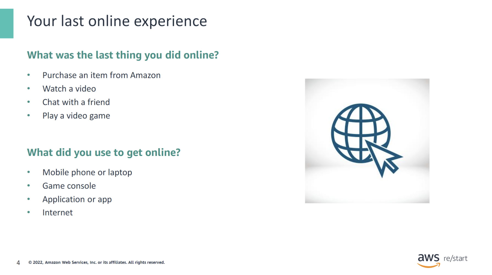

Think about the last thing that you did online. Perhaps it was to purchase an item from Amazon, play an online game, or chat with a friend.

How did you do it? Today, you can use many different types of devices to perform these activities, including smartphones, desktop computers, and game consoles. You also use applications, or apps, and of course, the internet.

### Technology in your life

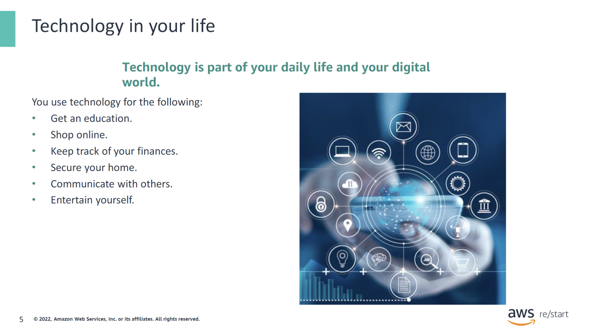

Today, you can use technology to extend your activities beyond physical, geographical, and time limits. You live in a digital world, and technology plays an integral role in your life.

### Building blocks of the digital world

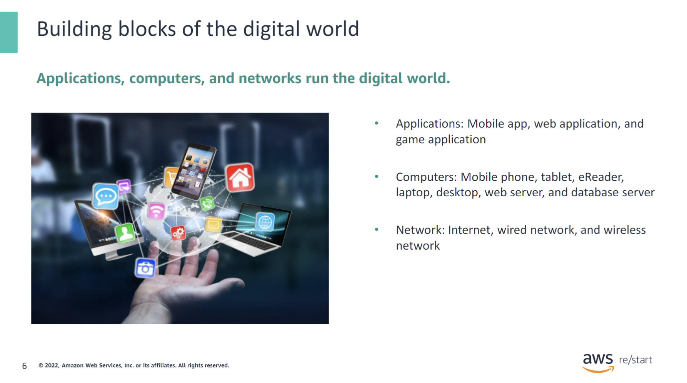

Applications, computers, and networks are at the heart of the technology that runs the digital world. Devices such as smartphones, tablets, and e-readers are essentially computers.

In the next section, you will learn the definition of some of these key computing terms.

## Basic computing terminology

### Computer application

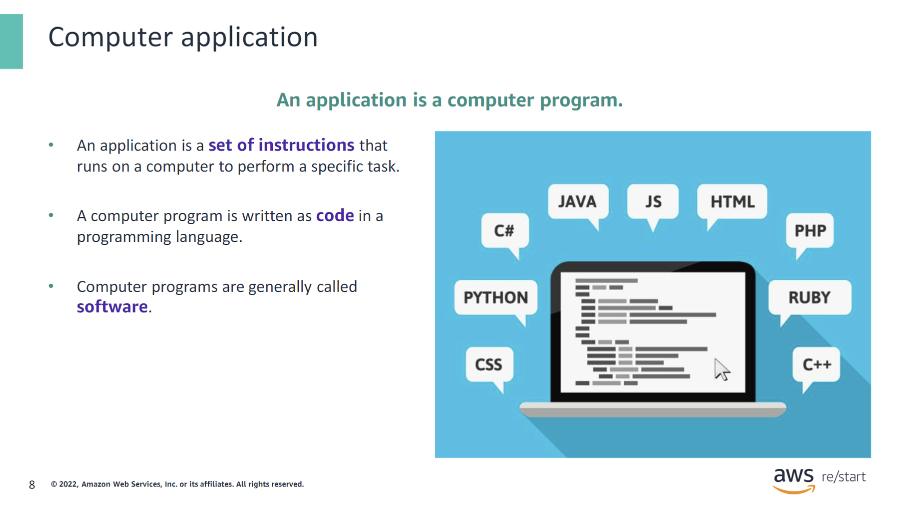

An application is a computer program. It is a set of instructions that runs on a computer to perform a specific function.

Programs can be written in many different programming languages, such as Java, Python, and C++.

The term softwareis synonymous with computer programs.

### Types of applications

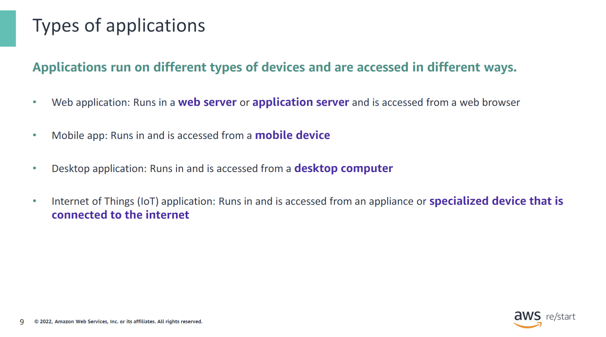

Many different types of applications exist. They can be differentiated based on what type of device they run on and how they are accessed. The following list contains some examples of different types of applications:

- **Web application**: Anything that can be accessed through a web browser, such as Mozilla Firefox (for example, amazon.com)
- **Mobile application**: Amazon Shopping Mobile App and your bank’s mobile banking app
- **Desktop application**: Word processors, web browsers, games, video editing software, and programming tools
- **Internet of Things (IoT) application**: Applications on a smartwatch or inside a smart refrigerator, and a global positioning system (GPS) navigation application in a car

### Components inside a computer

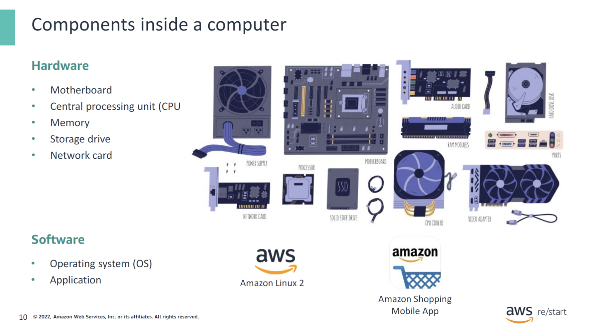

A computer contains hardware and software. Hardware refers to a computer’s physical components, such as its central processing unit (CPU), memory, and storage drive. Software is the collection of applications and programs that are installed on the computer. For example, software includes an operating system (OS) such as Amazon Linux, and an application such as the Amazon Shopping Mobile App.

The following are the main hardware components inside a computer:

- **CPU**
- **Memory**
- **Storage drive**
- **Network card**

The following are the main software components:

- **OS**
- **Applications**

You will learn more about each of these components in the next slides.

### Motherboard

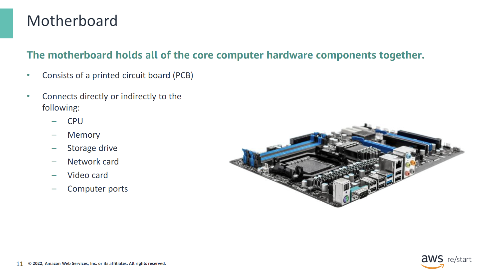

Also called the system board, the motherboard holds together all the computer’s hardware pieces: random access memory (RAM), CPU, hard drive, network, and video cards.

### Central processing unit (CPU)

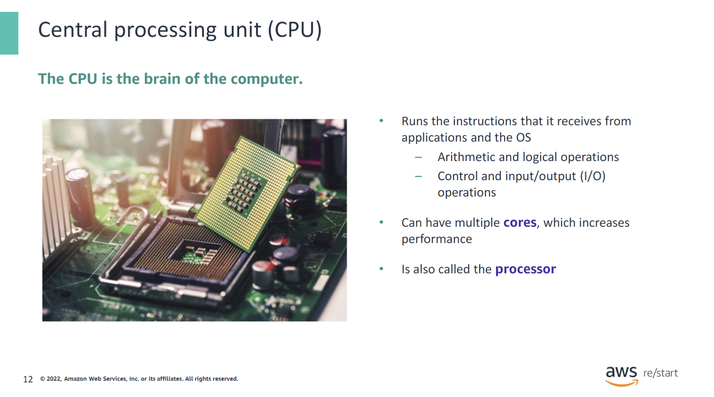

The CPU is the electronic circuitry in a computer that carries out the instructions of a computer program. It performs the basic arithmetic, logical, control, and input/output (I/O) operations that the instructions specify.

A CPU with multiple cores increases performance. For example, a dual-core CPU has two cores, which act as two separate CPUs. With this arrangement, the OS can run two separate applications at the same time and, therefore, speed up the system.

### Memory (RAM)

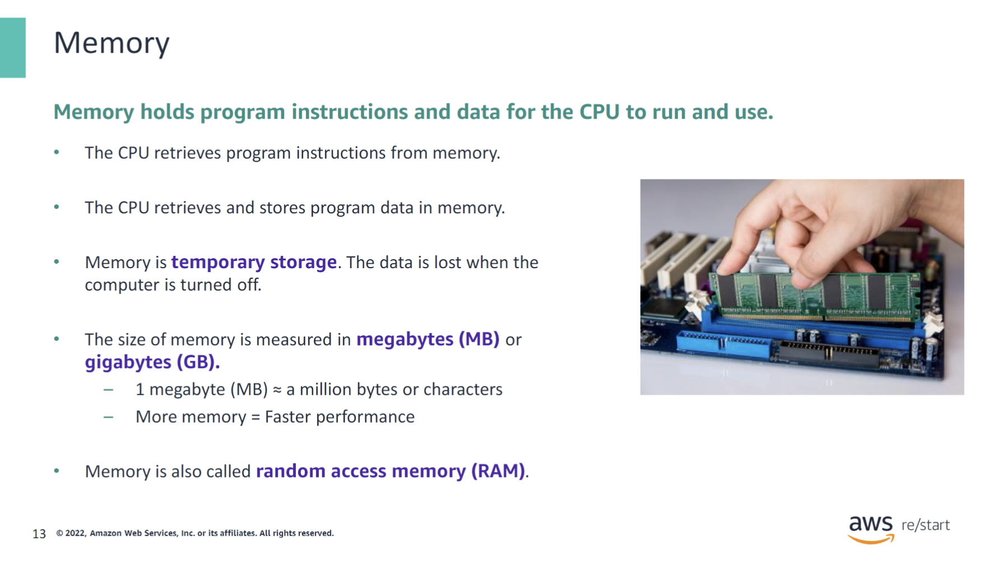

Memory, also called RAM, is the hardware component that stores the OS, application programs, and data in current use. By using memory, the CPU can access these resources quickly.

The basic unit of measurement for memory is bytes, where a byte represents the amount of memory needed to store a character (8 bits). Because memory sizes in computers today are large, they are typically measured in units of megabytes (MB) or gigabytes (GB). A MB is approximately 1 million bytes, and a GB is approximately 1 billion bytes.

With more memory, the OS can load more applications into memory at once or keep all of an application’s data in memory at one time. The result is improved system performance.

### Storage drive

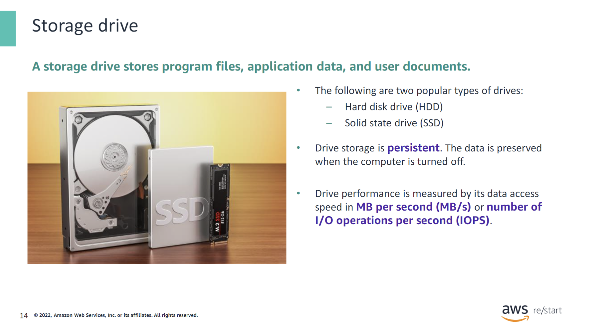

Storage drives are used to store and retrieve digital data, such as documents, programs, application preferences, and more.

Hard disk drives (HDDs) are the traditional and most popular type of storage drives. They use a mechanical system of spinning magnetic disks to store data and provide an inexpensive storage solution.

Solid state drives (SSDs) are now gaining more popularity. They have no mechanical parts, and they use flash-based memory (integrated circuits) to store data. As a result, they are significantly faster, but more expensive, than hard disk drives.

The performance of a storage drive is typically measured by data access speed in MB per second (MB/s) or I/O operations per second (IOPS).

### Computer Network

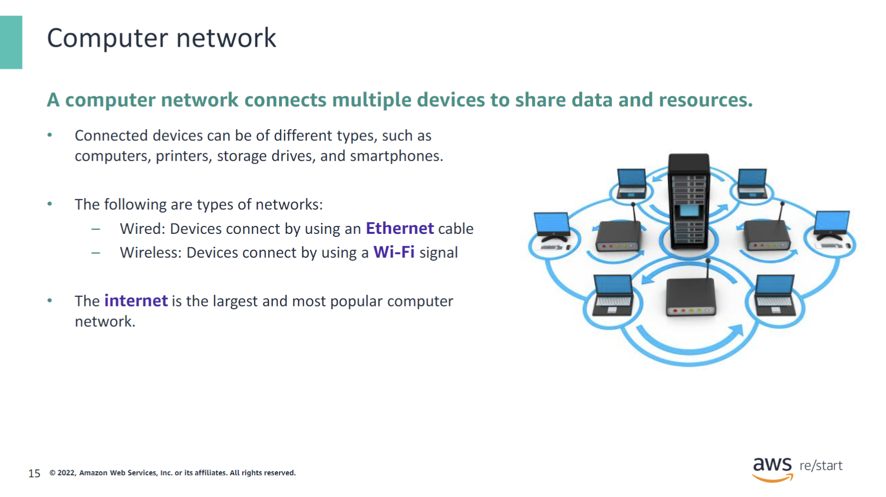

An application that runs on a given computer might interact with other applications that run on different computers to access information and complete its function. For example, mobile apps often communicate with other applications that run on a web server to get data. These different computers can use a computer network to connect and communicate with each other.

In a wired network, computers use wires, typically Ethernet cables, to connect to a router. In a wireless network, computers connect to a routerby using the router’s Wi-Fi signal. You will learn more about routers later in the course.

### Network interface card

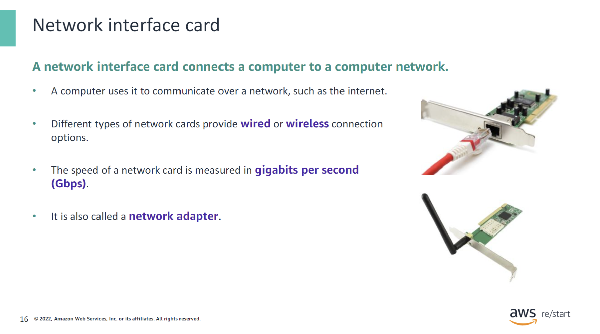

A network interface card, also called a network adapter, connects a computer to a computer network. It uses a cable that is connected to a hub or switch.

A wired network card uses an Ethernet cable to connect a computer to the network. A wireless network card uses a Wi-Fi signal instead.

A network card’s performance is measured by its transmission speed in gigabits per second (Gbps).

### Operating Service

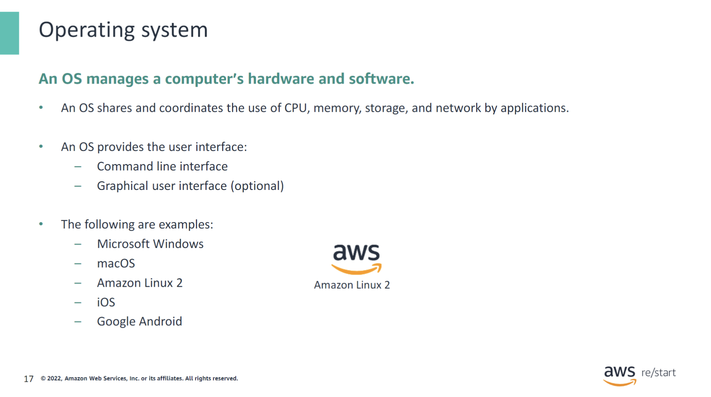

An OS manages a computer’s hardware and software. You also use it to interact with your computer.

Some applications work only on specific operating systems.

## Key Takeaways

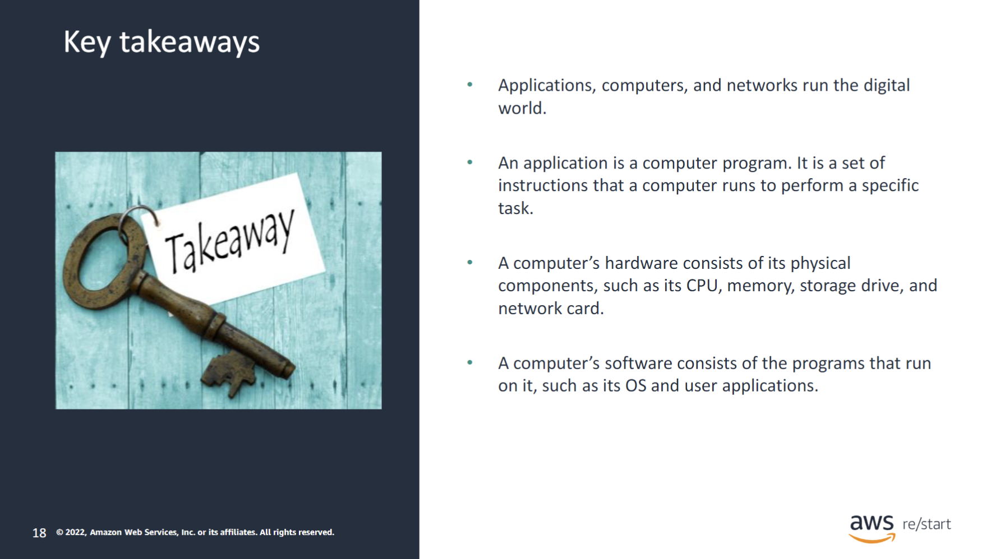
:::tip[Recap]
This module includes the following key takeaways:

- Applications, computers, and networks run the digital world.
- An application is a computer program. It is a set of instructions that a computer runs to perform a specific task.
- A computer’s hardware consists of its physical components, such as its CPU, memory, storage drive, and network card.
- A computer’s software consists of the programs that run on it, such as its OS and user applications.

:::