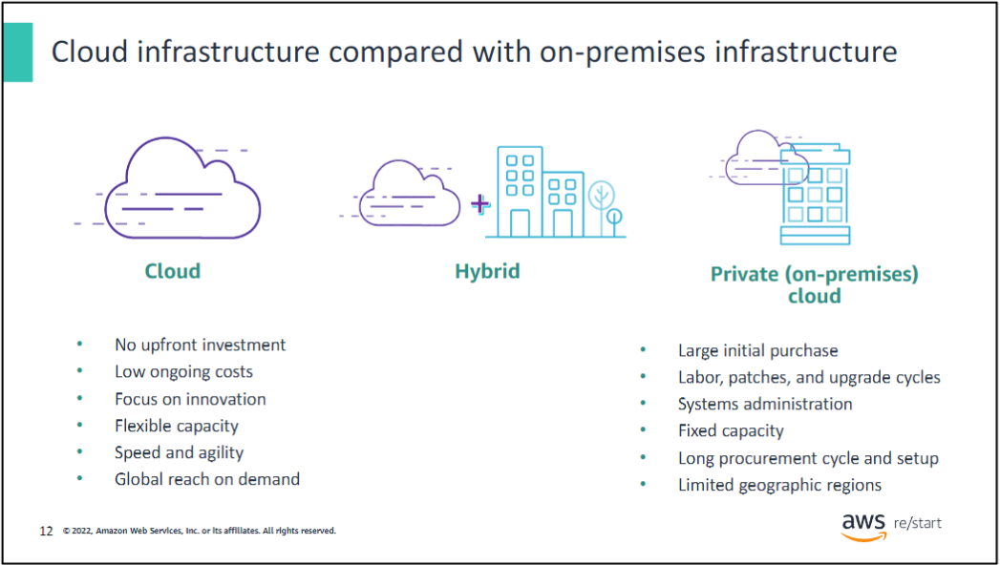
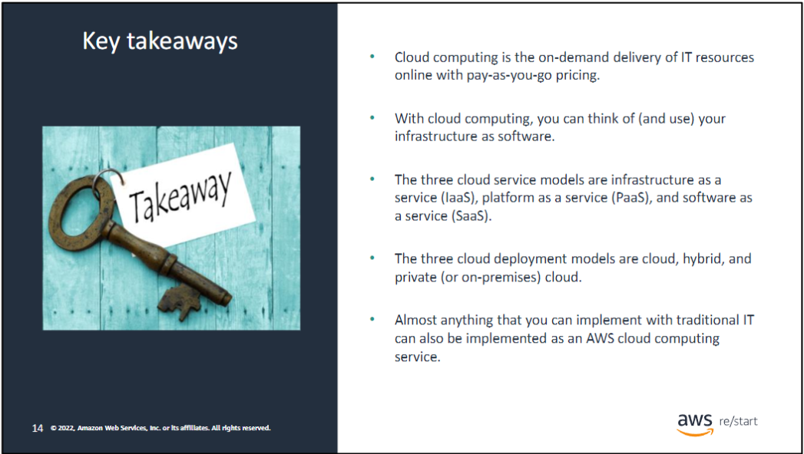
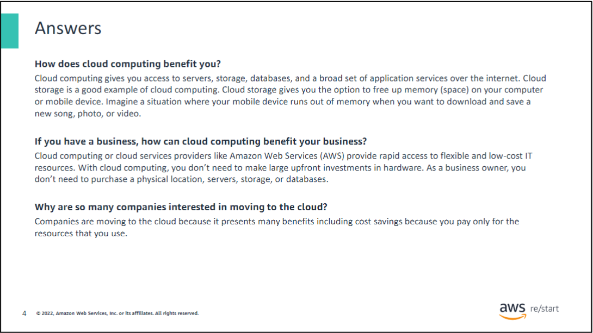
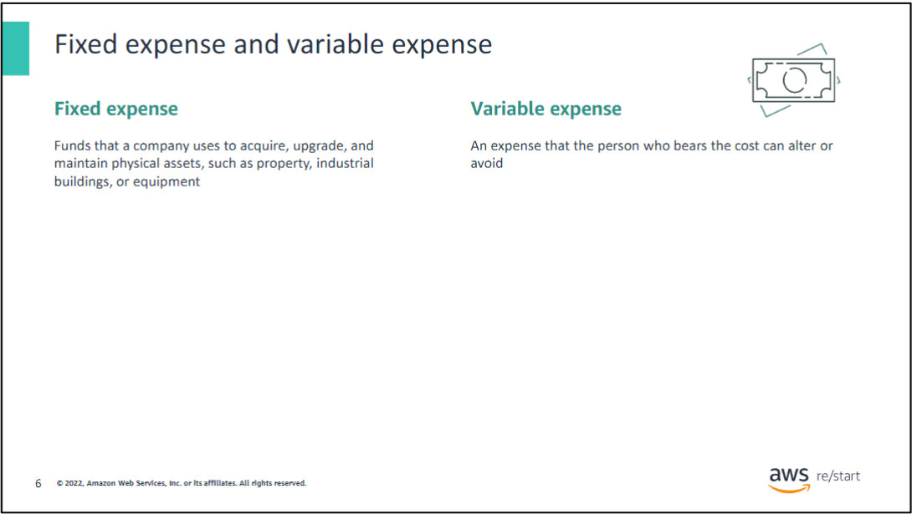
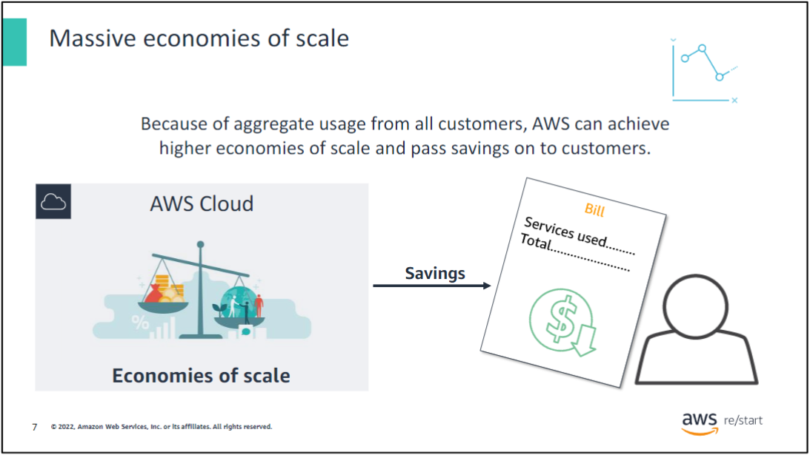
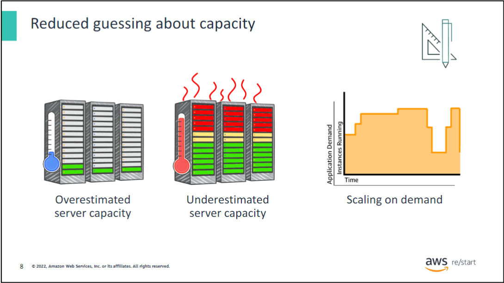
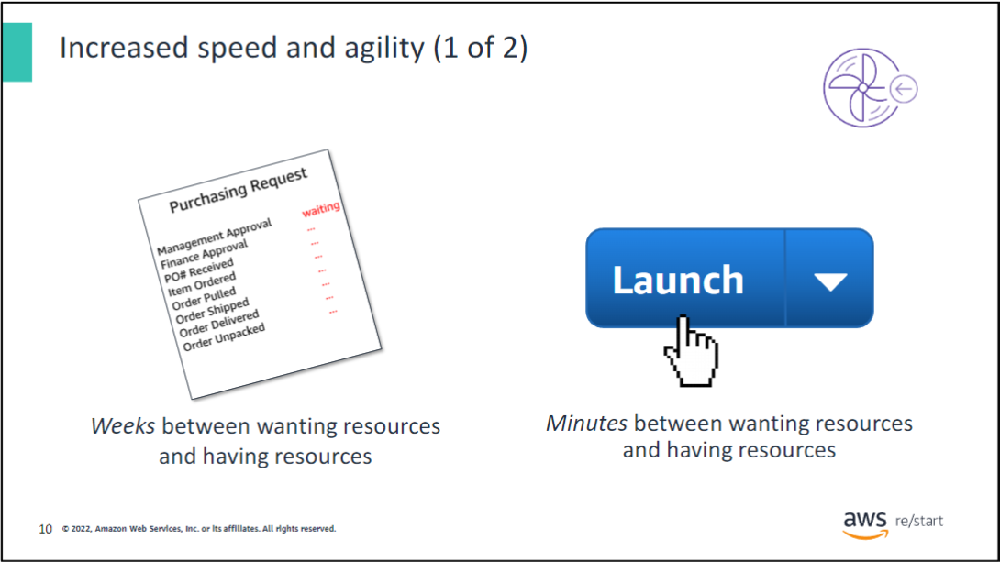
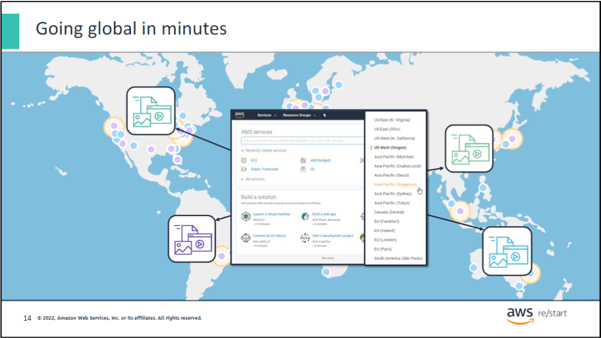

## Development Team Roles

### Product Manager

- Defines product vision and strategy
- Prioritizes features and requirements
- Collaborates with stakeholders and development teams
- Manages product lifecycle

### Analyst

- Gathers and interprets data
- Identifies business needs and solutions
- Creates reports and presentations
- Supports decision-making processes

### Quality Assurance

- Develops and executes test plans
- Identifies and reports software bugs
- Ensures product meets quality standards
- Collaborates with developers to resolve issues

### Developer

- Writes and maintains software code
- Designs and implements new features
- Debugs and fixes software issues
- Collaborates with other team members

### Database Admin

- Manages and maintains databases
- Ensures data security and integrity
- Optimizes database performance
- Implements backup and recovery strategies

## What is Cloud Computing ?

### Definition

Cloud computing is the delivery of computing services over the internet, including storage, processing power, databases, networking, analytics, and software.

### Deployment Models

### 1. On-Premises

- Infrastructure managed in-house
- Full control but higher costs and maintenance

### 2. Cloud

- All services hosted by third-party provider
- Scalable and cost-effective, but less control

### 3. Hybrid Cloud

- Combination of on-premises and cloud
- Balances control and flexibility

### Comparison

| Aspect | On-Premises | Cloud | Hybrid Cloud |
|--------|-------------|-------|--------------|
| Control | High | Low | Medium |
| Scalability | Limited | High | High |
| Initial Cost | High | Low | Medium |
| Maintenance | In-house | Provider | Shared |
| Security | Full control | Shared | Customizable |

### Key Takeaways

### Cloud Computing Overview

- Cloud computing is the on-demand delivery of IT resources through the internet with pay-as-you-go pricing.

- With cloud computing, you can think of (and use) your infrastructure as software.

- The three cloud service models are:
  - IaaS (Infrastructure as a Service)
  - PaaS (Platform as a Service)
  - SaaS (Software as a Service)

- The three cloud deployment models are:
  - Cloud
  - Hybrid
  - Private (or on-premises) cloud

- Almost anything that you can implement with traditional IT can also be implemented as an AWS cloud computing service.

## Advantages of Cloud Computing

### Cost Efficiency

- Pay-as-you-go pricing model
- Reduced capital expenditure on hardware and infrastructure
- Lower IT operational costs

### Scalability

- Easily scale resources up or down based on demand
- Accommodate growth without significant upfront investment

### Flexibility and Mobility

- Access data and applications from anywhere with internet connection
- Supports remote work and collaboration

### Automatic Updates

- Cloud providers handle system maintenance and updates
- Always access to the latest software versions

### Disaster Recovery

- Built-in data backup and recovery solutions
- Improved business continuity

### Enhanced Collaboration

- Real-time file sharing and synchronization
- Easier team coordination across different locations

### Competitive Edge

- Access to enterprise-grade technology for businesses of all sizes
- Faster deployment of new services and applications

### Environmentally Friendly

- Reduced carbon footprint through shared resources
- More energy-efficient than individual data centers

### Improved Security

- Professional security measures and expertise
- Regular security updates and patches

### Innovation

- Access to latest technologies like AI and machine learning
- Ability to quickly test and implement new ideas

### Fixed vs. variable costs

### Massive Economies of Scale

#### Introduction

Amazon Web Services (AWS) leverages massive economies of scale to provide cloud computing services at a level that individual companies typically cannot match on their own.

#### What are Economies of Scale?

Economies of scale refer to the cost advantages that businesses obtain due to their scale of operation. The larger the scale, the more cost-effective the operation becomes.

#### How AWS Achieves Massive Economies of Scale

1. **Global Infrastructure**: AWS operates data centers worldwide, allowing for bulk purchasing and efficient resource allocation.

2. **High Utilization**: AWS serves millions of customers, ensuring high utilization of resources.

3. **Continuous Innovation**: Constant improvements in hardware and software efficiency.

4. **Diverse Customer Base**: Aggregating demand across various industries and use cases.

#### Benefits for AWS Customers

1. **Lower Costs**:
   - Reduced prices for cloud services
   - Pay-as-you-go model eliminates upfront capital expenses

2. **Access to Cutting-Edge Technology**:
   - Latest hardware and software without direct investment

3. **Scalability**:
   - Ability to rapidly scale up or down without additional infrastructure costs

4. **Global Reach**:
   - Easy deployment across multiple geographic regions

5. **Reliability and Redundancy**:
   - High-availability infrastructure at a fraction of the cost of building it independently

6. **Focus on Core Business**:
   - Reduced need for in-house IT infrastructure management

7. **Continuous Improvement**:
   - Regular updates and new services without additional cost

8. **Environmental Benefits**:
   - More energy-efficient than multiple smaller data centers

### Agility and Efficiency

#### Key Points

1. **Rapid Resource Provisioning**
   - IT resources available instantly
   - Reduced provisioning time from weeks to minutes

2. **Enhanced Organizational Agility**
   - Faster response to changing needs
   - Quicker implementation of new ideas

3. **Cost-Effective Experimentation**
   - Lower costs for testing and development
   - Reduced financial barriers to innovation

4. **Time Savings**
   - Dramatically shortened development cycles
   - More time for core business activities

AWS Cloud significantly accelerates resource deployment, enhancing organizational flexibility while reducing costs and time associated with experimentation and development.

### Focus on Core Business Value

#### Key Benefits

1. **Reduced Infrastructure Costs**
   - Eliminate expenses of running and maintaining data centers
   - Shift from capital expenditure to operational expenditure

2. **Time Optimization**
   - Decrease time spent on infrastructure management
   - Increase focus on strategic business projects

3. **Enhanced Business Differentiation**
   - Prioritize projects that set your business apart
   - Allocate resources to innovation and customer-centric initiatives

4. **Improved Customer Focus**
   - Shift attention from hardware concerns to customer needs
   - Increase time and resources for customer-facing activities

AWS Cloud allows businesses to offload infrastructure management, enabling them to concentrate on core competencies, innovation, and customer satisfaction, ultimately driving business growth and competitiveness.

### Global Deployment Made Easy

#### Key Advantages

1. **Rapid Global Expansion**
   - Deploy applications worldwide in minutes
   - Utilize multiple AWS Regions with ease

2. **Improved User Experience**
   - Reduce latency for global customers
   - Enhance overall application performance

3. **Cost-Effective Scaling**
   - Expand internationally without significant investment
   - Minimize expenses associated with global infrastructure

4. **Simplified Management**
   - Control global deployments from a single interface
   - Streamline international operations

AWS Cloud enables businesses to quickly and cost-effectively expand their global presence, improving service quality for international customers while simplifying management of worldwide infrastructure.

### Summary: Advantages of Cloud Computing

The six main advantages of cloud computing are:

1. **Trade fixed expense for variable expense**
   - Pay only for what you use, when you use it

2. **Benefit from massive economies of scale**
   - Leverage AWS's ability to achieve higher economies of scale

3. **Reduce guessing about capacity**
   - Eliminate the need to predict infrastructure capacity needs

4. **Increase speed and agility**
   - Access new resources quickly, accelerating development and deployment

5. **Stop spending money on running and maintaining data centers**
   - Focus on your core business instead of infrastructure management

6. **Go global in minutes**
   - Deploy applications worldwide quickly and easily

These advantages highlight how cloud computing can transform IT infrastructure and business operations.