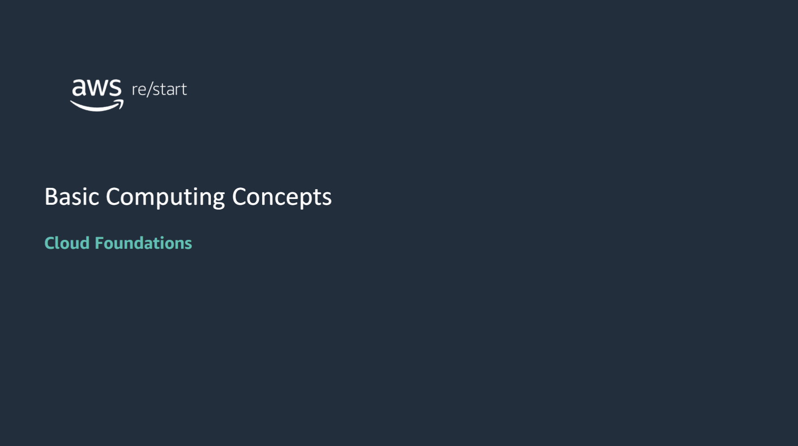

After completing this module, you should be able to do the following:

- Describe servers and data centers.
- Discuss computing technology that enables cloud computing.
- Describe how software is developed.

## Server and Data Centers

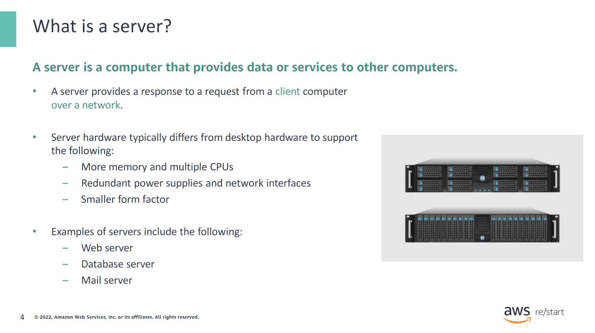

A server is a computer that provides resources or services to other computers over a network. The many different types of servers include the following:

- **A web server** is used by web applications to serve Hypertext Markup Language (HTML) pages to a requesting client.
- **A database server** hosts database software that applications use to store and retrieve data.
- **A mail server** is used to send and receive email from and to clients.

### Client & Server example: Web application

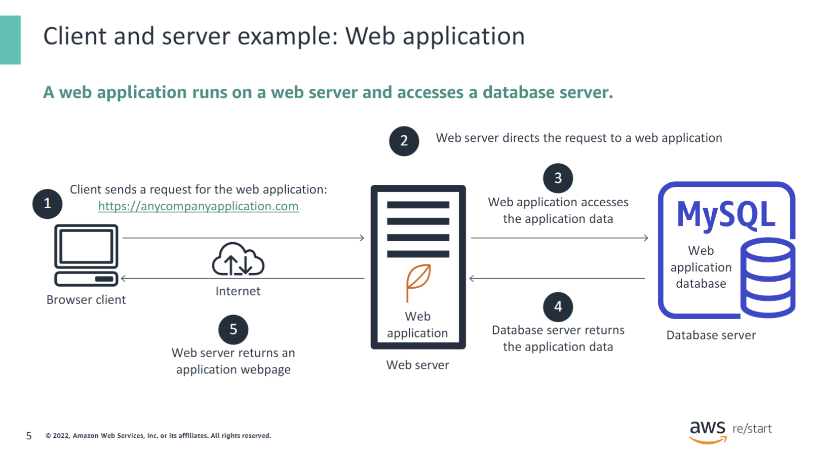

Running a web application is an example use case for servers. A web application is typically deployed to a web server, which is responsible for directing client requests to it. A web application usually stores its application data on a database server. The database server runs a special type of software that’s called a database management system (DBMS). The DBMS controls the organization, security, and access of the data. Examples of a DBMS are MySQL, an open-source relational database management system; and Oracle, a relational DBMS that Oracle Corporation owns and offers.

The following list shows the flow of information in the example:

1. The user opens a browser on a client machine and enters the address of the web application’s homepage. This address is called its home Uniform Resource Locator (URL) (for example, https://anycompanywebapp.com).
2. The web server receives the client request and directs it to the appropriate web application.
3. The web application sends a request to the database server to access its application data.
4. The database server returns the requested data to the web application.
5. The web application builds the response webpage and passes it to the web server, which returns the page to the client browser.

### Where does a Server resides

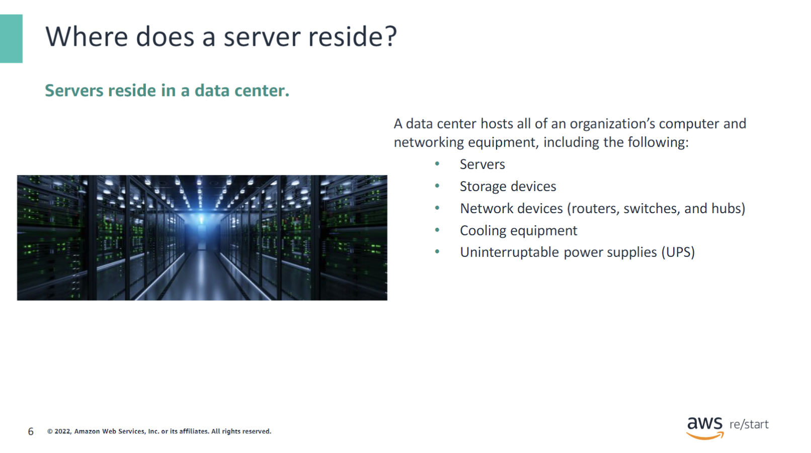

Servers reside in a data center. A data center is a physical location that is used to host computer systems and associated components such as networks, storage devices, and power supplies. Data centers are designed to be secure and to provide an ideal climate for the contained equipment to operate. They must protect the equipment from many types of failures and accidents, including power losses and fire.

### Who owns the Data Center

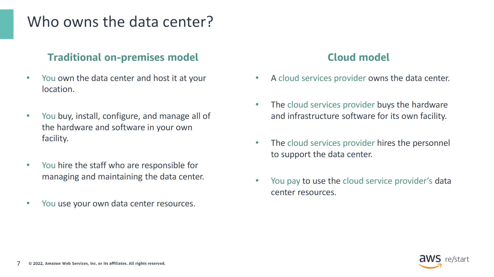

Traditionally, organizations owned their data centers. The equipment was on premises at a location that the company owned. If you follow this model, you are the one who buys, installs, configures, and manages all the hardware and software in your own facility. You are responsible for installation, maintenance, and numerous other costs. You also must hire the staff who are responsible for the maintenance of the hardware, software, and the facility itself.

The cloud model provides another option: a cloud services provider buys the hardware and infrastructure software in their own facility. They manage and maintain it with their own personnel. You bring your application or workload to run on their servers and pay for the services that they offer. Later, you will learn the advantages of the cloud model as compared with the on-premises model.

## Virtual Machines

### What is a Virtual Machine

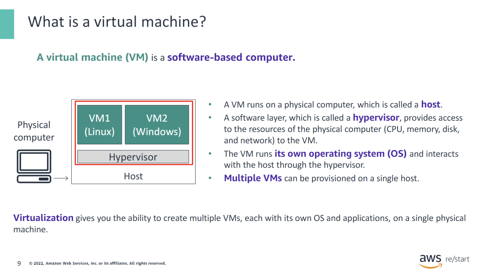

A virtual machine (VM) is a computer that is emulated through software. It is virtual because it is not a physical computer. Instead, specialized software, which is called virtualization software, runs inside a physical computer to provide the computing capabilities of a VM. In other words, a VM is a software-based computer that runs inside a physical computer.

The physical computer where a VM runs is called a host. The VM provides computing capabilities by accessing the physical resources of the host through a software layer, which is called a hypervisor. The hypervisor shares the host’s physical resources—such as its CPU, memory, disk drives, and networking capabilities—among the VMs that run on the host.

A VM can run its own operating system, and multiple VMs can run on a single host. With virtualization, you can separate your operating system and applications from the computer’s hardware. Use cases for VMs include virtual desktops, multiple operating support, and cloud computing.

### Benefits of VMs

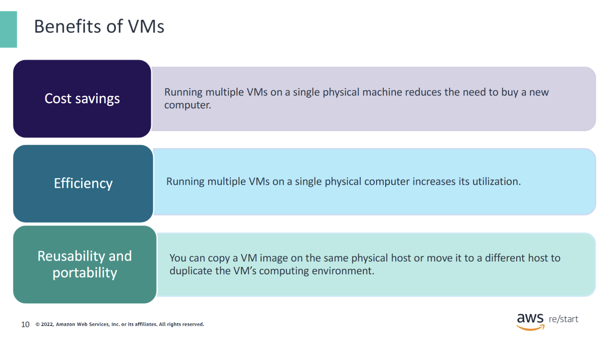

The following are the benefits of using VMs:

- **Cost savings** – For example, you don’t need to buy a new machine if you want to run a different operating system (OS) on your existing machine. You create a VM with the new OS and run it on your machine with virtualization software.
- **Efficiency** – You can run multiple VMs on a single physical computer to handle different types of workloads and increase its utilization. You can use VMs to reduce computing resource waste due to underused servers.
- **Reusability and portability** – A virtual machine image defines all of the configuration, software, and applications that are installed in a VM. You can duplicate a VM image on one or more physical hosts without creating a new VM from scratch. This duplication promotes reusability and portability. For example, creating multiple copies of the same VM to respond to incoming requests can improve your applications’ performance when the number of requests increases. You can also copy a VM image to a different host for backup purposes.

### VMs in the Cloud

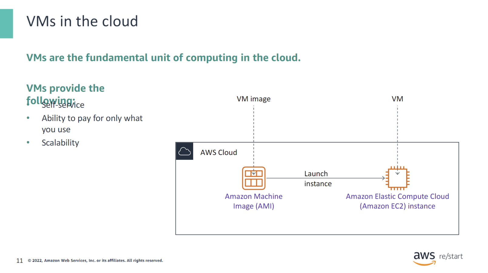

VMs facilitate computing in the cloud. In the AWS Cloud, the core service that offers computing capabilities is Amazon Elastic Compute Cloud (Amazon EC2). You can use Amazon EC2 to provision virtual servers, and you can completely control the computing resources of those servers. You can obtain and start new server instances in minutes. From a cost perspective, you pay only for the capacity that you use. In addition, you can quickly scale capacity both up and down as your computing requirements change.

## Software Development Life Cycle

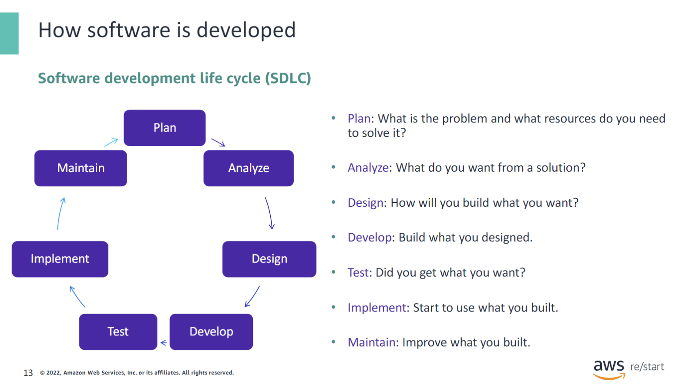

The software development life cycle (SDLC) is a process that is used to produce software in a disciplined and organized way. When it is used correctly, it usually results in high-quality software that meets the customer’s requirements. At a high level, the purpose of each phase can be described by the following questions and actions:

- **Plan** – What is the problem, and what resources do you need to solve it?
- **Analyze** – What do you want from a solution?
- **Design** – How will you build what you want?
- **Develop** – Build what you have designed.
- **Test** – Did you get what you want?
- **Implement** – Start to use what you built.
- **Maintain** – Improve what you built.

The SDLC is repeated over the lifetime of an application. It is used to create, update, fix, and maintain the application.

### Plan

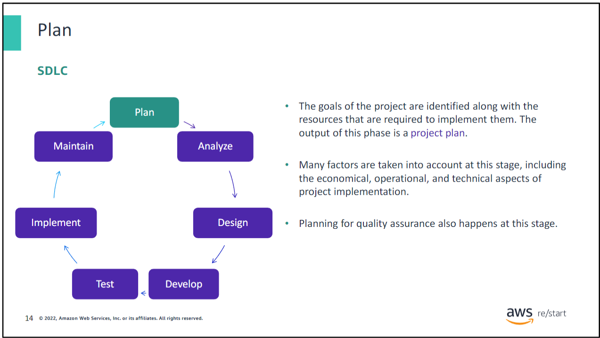

In this organizational phase, a plan is formulated to identify the goals of the project and the resources that are required to implement them. Many factors, such as costs, human resources, and tools, are considered and defined. The output of the plan phase is a project plan.

### Analyze

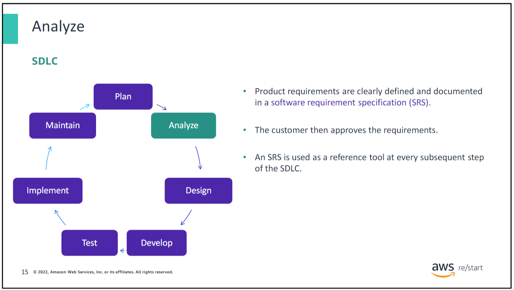

The analyze phase focuses on gathering the requirements for the application from the user and documenting them in a software requirement specification (SRS) document.

### Design

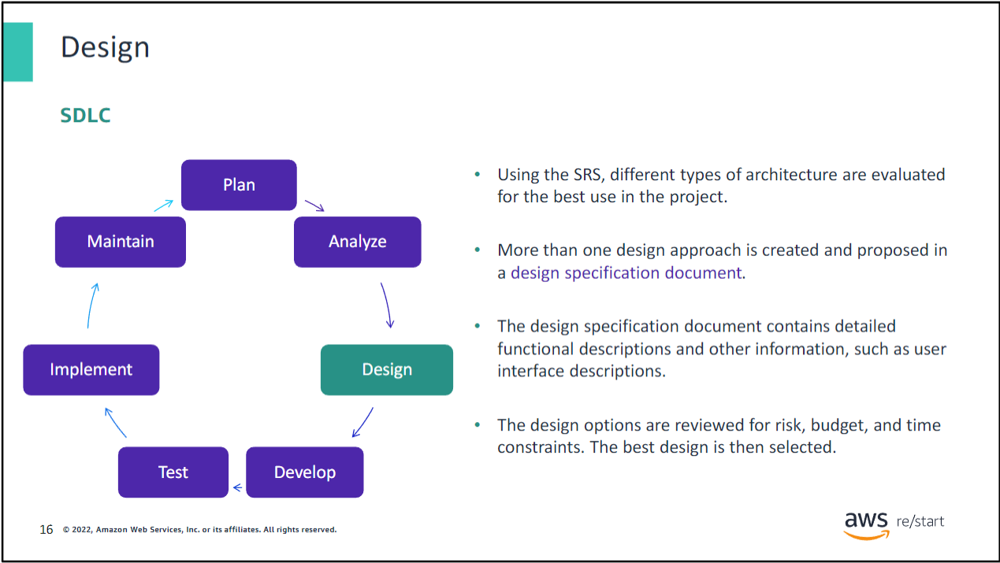

In the design phase, user requirements are translated into a technical design. The output of the design phase is a design specification document.

### Development

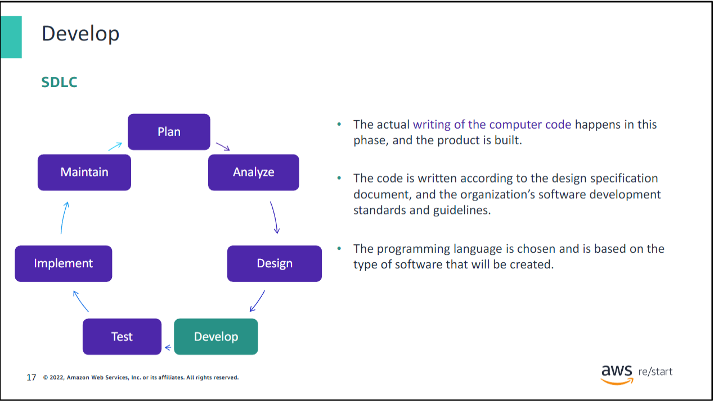

During the develop phase, the code for the application is written according to the organization’s software development standards and guidelines. The programming language that is used is chosen based on what best suits the application.

### Testing

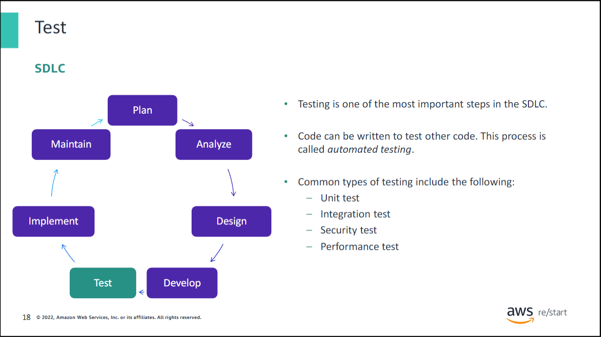

The purpose of the test phase is to validate that the application components function as intended. This phase is also used to uncover and correct defects before the application is released to users. Most defects, also called bugs, should be discovered and fixed during this phase. It is important to correct them in this phase because they are usually more expensive to fix when they are found in later phases. The many types of testing include the following:

- **Unit testing** tests individual application components at the program level. The programmer usually does this test.
- **Integration testing** tests the combination of multiple application components to verify that they work together correctly.
- **Security testing** tests to see whether the application is vulnerable from internal or external threats.
- **Performance testing** tests to see whether the application meets its expected performance requirements.

### Implementation

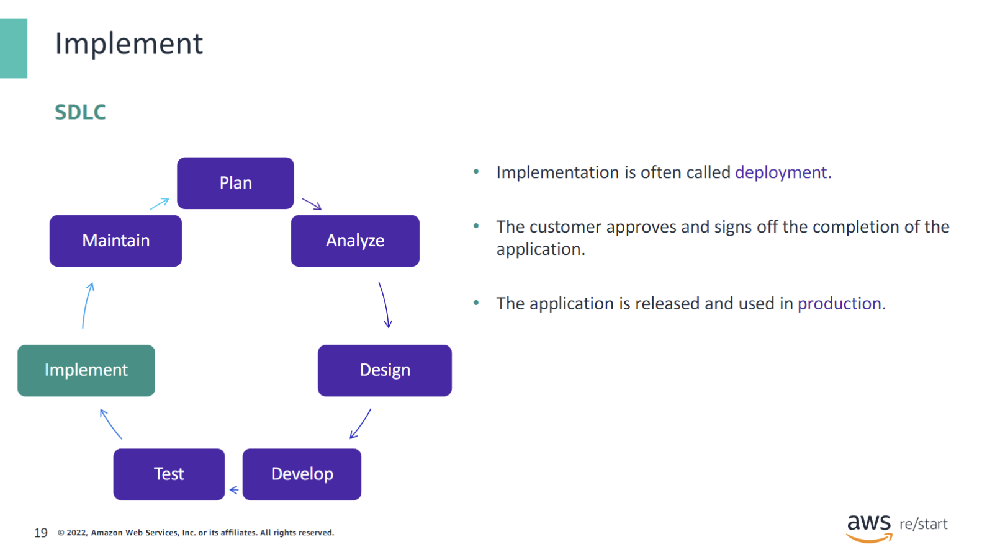

In the implement phase, the finished application is deployed to a final environment, or the production environment, where users can start to use it.

### Maintenance

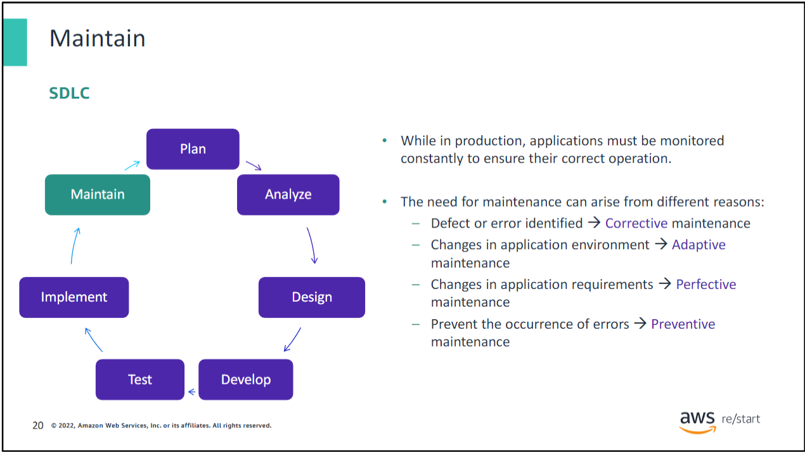

As soon as the application is in production, it must be monitored and maintained. The following are the four general types of application maintenance:

- **Corrective maintenance** is used to fix a problem that occurs and for which a solution is identified.
- **Adaptive maintenance** is required when something in the application’s runtime environment is going to change. For example, an upgrade is planned for the database software that the application uses.
- **Perfective maintenance** occurs when new or revised functionality is identified for the application. For example, the user requests a change in the user interface.
- **Preventive maintenance** consists of changes that are made to avoid potential issues in the future. For example, code is redesigned or restructured for easier maintenance.

## Key Takeaways

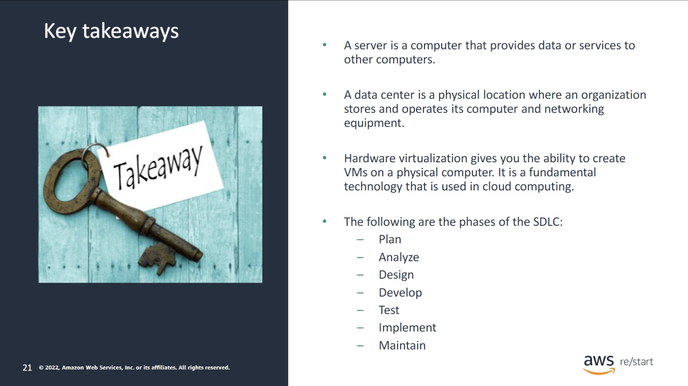
:::tip[Recap]
The following are some key takeaways from this module:

- A **server** is a computer that provides data or services to other computers.
- A **data center** is a physical location where an organization stores and operates its computer and networking equipment.
- **Hardware virtualization** gives you the ability to create VMs on a physical computer. It is a fundamental technology that is used in cloud computing.
- The following are the phases of the **SDLC**:
  - **Plan**
  - **Analyze**
  - **Design**
  - **Develop**
  - **Test**
  - **Implement**
  - **Maintain**

:::
