## What is AWS

AWS, or Amazon Web Services, is a comprehensive and widely adopted cloud computing platform offered by Amazon. It provides a range of cloud services, including computing power, storage solutions, and databases, along with tools for machine learning, analytics, and IoT. AWS allows businesses to access these resources on-demand and scale them as needed, without the upfront cost and complexity of managing physical infrastructure. It's known for its reliability, flexibility, and extensive global network, making it a popular choice for organizations of all sizes looking to innovate and grow in the digital age.

### Web services

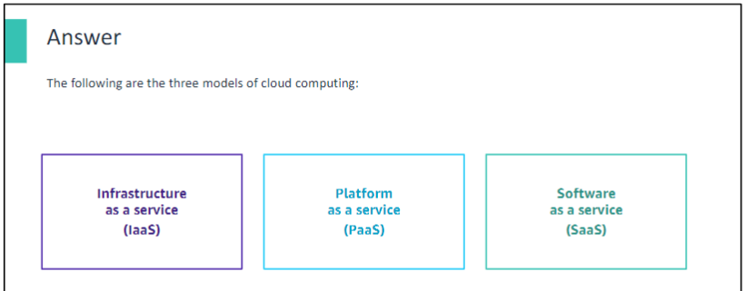

AWS offers three different models of cloud services: infrastructure as a service (IaaS), platform as a service (PaaS), and software as a service (SaaS). All of these services are on the AWS Cloud.

With **IaaS**, you manage the server, which can be physical or virtual, and the operating system (Microsoft Windows or Linux). In general, the data center provider has no access to your server. Basic building blocks for cloud IT include the following:

- Networking features
- Compute
- Data storage space

With **PaaS**, someone else manages the underlying hardware and operating systems. Thus, you can run applications without managing underlying infrastructure (patching, updates, maintenance, hardware, and operating systems). PaaS also provides a framework for developers that they can build on to create customized applications.

With **SaaS**, you manage your files, and the service provider manages all data centers, servers, networks, storage, maintenance, and patching. Your concern is only the software and how you want to use it. You are provided with a complete product that the service provider runs and manages. Facebook and Dropbox are examples of SaaS. You manage your Facebook contacts and Dropbox files, and the service providers manage the systems.

#### Comparison: On-premises and AWS infrastructure

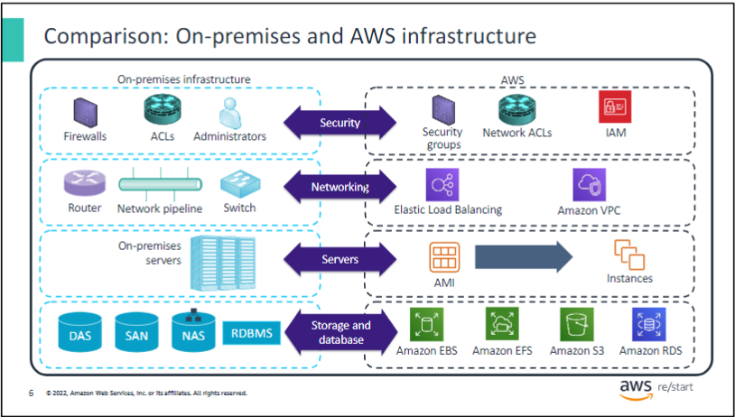

Many AWS services have analogs in the traditional IT space and terminology. This side-by-side comparison shows how AWS products and services relate to a traditional infrastructure. Almost everything that you might want to do with a traditional data center is available with AWS.

#### What are web services

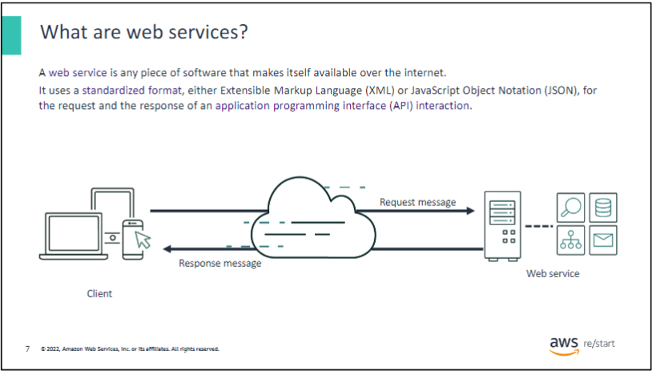

A web service is any piece of software that makes itself available over the internet or on private (intranet) networks. A web service uses a standardized format for the request and the response of an application programming interface (API) interaction. For example, formats such as Extensible Markup Language (XML) or JavaScript Object Notation (JSON) can be used. It’s not tied to any one operating system (OS) or programming language. A web service is self-describing through an interface definition file and is discoverable.

### AWS services

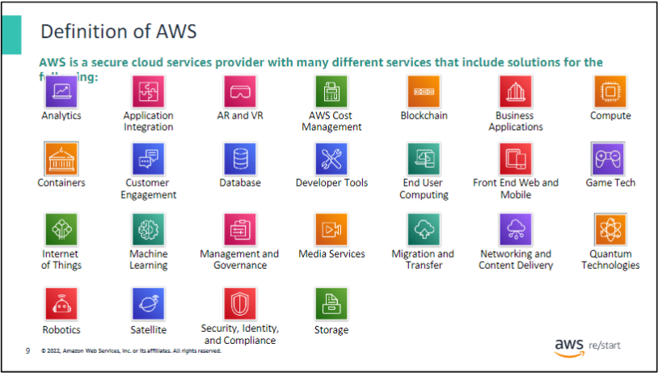

AWS is a secure cloud services provider with many services to help businesses scale and grow. These products are delivered over the internet. As a result, you have on-demand access to the compute, storage, network, database, and other IT resources that you might need for your projects. You also have the tools to manage them.

AWS services are in different categories, and each category contains one or more services. You can select the services that you want from these different categories to build your solutions.

#### Easy solution example

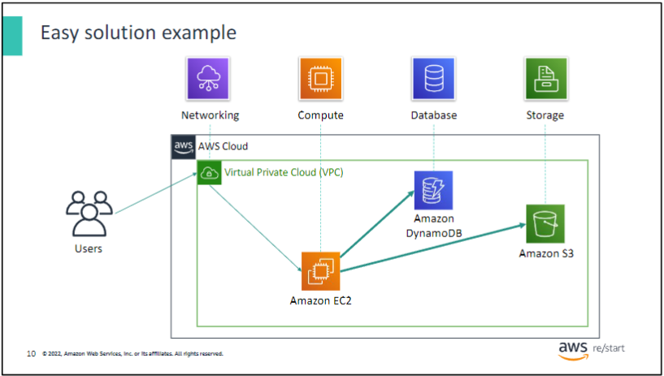

For example, suppose that you’re building a database application. Your customers might send data to your **Amazon Elastic Compute Cloud (Amazon EC2)** instances, which is a service in the Compute category. These EC2 servers batch the data in 1-minute increments. They add an object per customer to **Amazon Simple Storage Service (Amazon S3)**, the AWS storage service that you chose to use. You can then use a nonrelational database—such as **Amazon DynamoDB**—to power your application. You can use it to build an index to find all the objects from a given customer that were collected over a certain time period. You might decide to run these services inside **Amazon Virtual Private Cloud (Amazon VPC)**, which is a service in the networking category.

This example illustrates that you can select web services from different categories and use them together to build a solution. (In this case, the solution is a database application.) However, the solutions that you build can also be quite complex.

#### Choosing a service

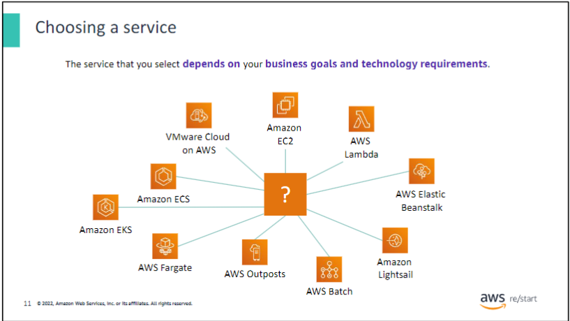

The service that you choose to use will depend on your business goals and technology requirements. In the previous example, the solution used **Amazon EC2** as the compute service. However, Amazon EC2 is only one of many compute services that AWS offers. The following list contains some other AWS Compute offerings that you might choose to use for the example use cases:

- **Amazon EC2** at [https://aws.amazon.com/ec2/](https://aws.amazon.com/ec2/)
  - You want complete control over your AWS computing resources.
  
- **AWS Lambda** at [https://aws.amazon.com/lambda/](https://aws.amazon.com/lambda/)
  - You want to run your code and not manage or provision servers.
  
- **AWS Elastic Beanstalk** at [https://aws.amazon.com/elasticbeanstalk/](https://aws.amazon.com/elasticbeanstalk/)
  - You want a service that deploys, manages, and scales your web applications for you.
  
- **Amazon Lightsail** at [https://aws.amazon.com/lightsail/](https://aws.amazon.com/lightsail/)
  - You need a lightweight cloud platform for an easy web application.
  
- **AWS Batch** at [https://aws.amazon.com/batch/](https://aws.amazon.com/batch/)
  - You must run hundreds of thousands of batch workloads.
  
- **AWS Outposts** at [https://aws.amazon.com/outposts/](https://aws.amazon.com/outposts/)
  - You want to run AWS infrastructure in your on-premises data center.
  
- **Amazon Elastic Container Service (Amazon ECS)** at [https://aws.amazon.com/ecs/](https://aws.amazon.com/ecs/), **Amazon Elastic Kubernetes Service (Amazon EKS)** at [https://aws.amazon.com/eks/](https://aws.amazon.com/eks/), or **AWS Fargate** at [https://aws.amazon.com/fargate/](https://aws.amazon.com/fargate/)
  - You want to implement a containers or microservices architecture.
  
- **VMware Cloud on AWS** at [https://aws.amazon.com/vmware/](https://aws.amazon.com/vmware/)
  - You have an on-premises server virtualization platform that you want to migrate to AWS.

Similarly, you can choose from various services in the other categories, and the number of offerings continues to grow.

#### Commonly used services

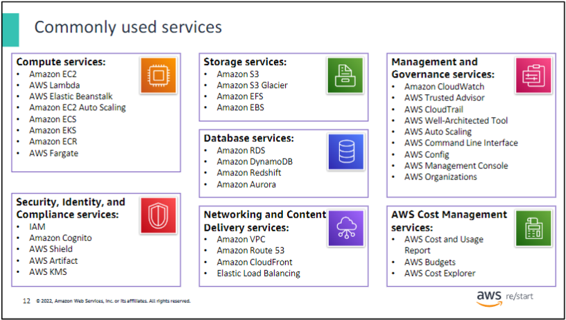

The array of AWS services can be intimidating as you start your journey into the cloud. This course focuseson some of the more common services in specified categories. The service categories include Compute; Storage; Database; Networking and Content Delivery; Security, Identity, and Compliance; Management and Governance; and AWS cost management.

#### Three ways to interact with AWS

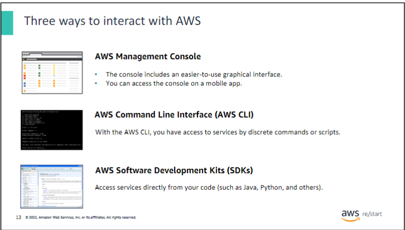

You might wonder how to access the broad array of services that AWS offers. You can create and manage resources on the AWS Cloud in three ways:

- **AWS Management Console**
  - The console provides a rich graphical interface to a majority of the features that AWS offers. Occasionally, new features might not have all of their capabilities included in the console when the feature initially launches. For mobile access, you can use the [AWS Console Mobile App](https://aws.amazon.com/console/mobile/) to quickly view AWS resources anytime from anywhere.
  
- **AWS Command Line Interface (AWS CLI)**
  - The AWS CLI provides a suite of utilities that can be launched from a command script in Linux, macOS, or Microsoft Windows.
  - Learn more about AWS CLI at [AWS CLI User Guide](https://docs.aws.amazon.com/cli/latest/userguide/cli-chap-welcome.html).
  
- **AWS Software Development Kits (SDKs)**
  - AWS provides packages that permit access to AWS in various popular programming languages. These packages facilitate the use of AWS in your existing applications and enable you to create applications that deploy and monitor complex systems entirely through code.
  - Explore more about [Tools to Build on AWS](https://aws.amazon.com/tools/).

For more detailed information on specific AWS services, you can visit their respective documentation pages:

- [Amazon API Gateway](https://docs.aws.amazon.com/apigateway/latest/developerguide/welcome.html)

These tools and interfaces offer flexibility and control in managing your AWS resources according to your development and operational needs.

#### AWS Cloud Adaption Framework

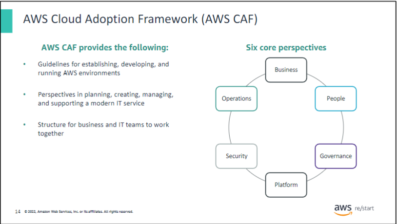

Each organization’s cloud adoption journey is unique. However, for any organization to successfully migrate its IT portfolio to the cloud, three elements—people, process, and technology—must be in alignment. The **AWS Cloud Adoption Framework (AWS CAF)** helps organizations develop efficient and effective plans for their cloud adoption journey.

The guidance and best practices from the framework help you build a comprehensive approach to cloud computing across your organization and throughout your IT lifecycle. These guidelines assist each unit in your organization to update skills, adapt existing processes, and introduce new processes. This way, you can take maximum advantage of the services that cloud computing provides.

The AWS CAF breaks down the complex process of planning a move to the cloud into manageable pieces called **perspectives**. Perspectives represent essential areas of focus that span people, processes, and technology. In general:

- The **business**, **people**, and **governance perspectives** focus on business capabilities.
- The **platform**, **security**, and **operations perspectives** focus on technical capabilities.

For more information about the AWS CAF, see [An Overview of the AWS Cloud Adoption Framework](http://d0.awsstatic.com/whitepapers/aws_cloud_adoption_framework.pdf).

### AWS Documentation

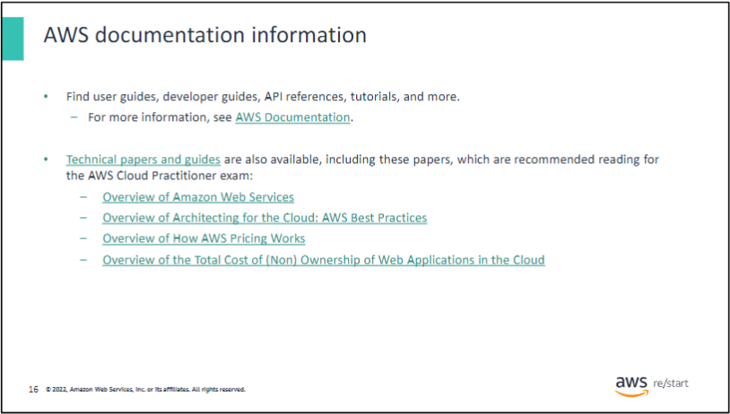

AWS provides extensive and detailed documentation for each AWS service. Guides and application programming interface (API) references are organized by service category. AWS also offers general resources and tutorials that can be accessed from the AWS documentation pages. General resources include:

- Case studies
- A–Z glossary of AWS terms
- Technical papers
- FAQs
- Information about AWS Training and Certification
- And more

Each SDK and toolkit also has its own documentation, such as the **AWS Command Line Interface (AWS CLI)**, the **AWS SDK for Python (Boto)**, and many others.

AWS technical papers and guides can be filtered by product, category, or industry so that you can find the information that’s most relevant to your needs.

## AWS Pricing Model <-REDIT>

Three fundamental drivers of cost with AWS:

| Compute | Storage | Data transfer |
|---------|---------|---------------|
| - Calculated either by the hour or the second | - Charged typically per GB | - Outbound is aggregated and charged |
| - Varies by instance type | | - Inbound has no charge (with some exceptions) |
| | | - Charged typically per GB |

AWS has three fundamental drivers of cost: compute, storage, and outbound data transfer. These characteristics vary somewhat depending on the AWS offering and pricing model that you choose.In most cases,you won’t becharged for inbound data transfer or for data transfer between other AWS services in the same AWS Region. Some exceptions exist,so be sure to verify data transfer rates before you begin to use the AWS service.Outbound data transfer is aggregated across servicesand then charged at the outbound data transfer rate. This charge appears on the monthly statement as AWS Data Transfer Out.

### AWS Pricing Philosophy

AWS pricing is based on a consistent philosophy, despite the growing number and types of services offered:

- Pay for what you use at the end of each month
- Start or stop using a product at any time
- No long-term contracts required

#### Utility-Style Pricing Model

AWS offers a range of cloud computing services with a utility-style pricing model:

1. **Pay for what you use**
2. **Pay less when you reserve**
3. **Pay less when you use more**
4. **Pay even less as AWS grows**

These core pricing concepts reflect AWS's commitment to flexible, cost-effective cloud services.

For more detailed information about AWS pricing, refer to the [How AWS Pricing Works](https://d0.awsstatic.com/whitepapers/aws_pricing_overview.pdf) guide.

Unless you build data centers for a living, you might have spent too much time and money building them. With AWS, you pay only for the services that you consume with no large upfront expenses. You can lower variable costs. Thus, you no longer need to dedicate valuable resources to building costly infrastructure, including purchasing servers, software licenses, or leasing facilities. Quickly adapt to changing business needs and redirect your focus on innovation and invention. Pay only for what you use and for as long as you need it. All AWS services are available on demand, require no long-term contracts, and have no complex licensing dependencies.

### Pay less when you reserve

For services like Amazon Elastic Compute Cloud (Amazon EC2) and Amazon Relational Database Service (Amazon RDS), AWS offers reserved capacity options:

#### Reserved Instances Types

1. **All Upfront Reserved Instance (AURI)**
2. **Partial Upfront Reserved Instance (PURI)**
3. **No Upfront Payments Reserved Instance (NURI)**

#### Discount Structure

- Larger upfront payments result in greater discounts
- All upfront payment offers the largest discount
- Partial upfront provides lower discounts but requires less initial investment
- No upfront option offers the smallest discount but preserves capital for other projects

#### Benefits of Reserved Capacity

- Minimize risks
- More predictable budget management
- Compliance with policies requiring longer-term commitments

Reserved Instances can lead to significant savings compared to equivalent on-demand capacity, offering flexibility in how you allocate your cloud computing budget.

### Pay less by using more

#### Tiered Pricing

- As usage increases, you can realize significant savings
- Services like Amazon S3 use tiered pricing
  - Pay less per GB with higher usage

#### Data Transfer Pricing

- Inbound data transfer is free of charge

#### Storage Options

- Multiple storage services available
- Lower costs based on specific needs

#### Benefits of Increased Usage

- Economies of scale
- Increased adoption with controlled costs

#### Flexible Service Options

- AWS offers services to address evolving business needs
- Storage services portfolio example:
  - Options to lower pricing based on:
    1. Frequency of data access
    2. Required retrieval performance

#### Optimizing Savings

- Choose the right combination of storage solutions to:
  - Reduce costs
  - Preserve performance
  - Maintain security
  - Ensure durability

As your AWS usage grows, you can take advantage of volume-based discounts and diverse service options to optimize costs while meeting your specific business requirements.

### Pay less as AWS grows

#### AWS Continuous Improvements

AWS consistently focuses on:

- Reducing data center hardware costs
- Improving operational efficiencies
- Lowering power consumption
- Decreasing overall cost of doing business

#### Economies of Scale

- Optimizations lead to substantial economies of scale
- Savings are passed back to customers through lower pricing

#### Pricing History

- Since 2006, AWS has lowered pricing more than 75 times
- Continues to reduce prices

#### Technology Upgrades

- Future, higher-performing resources replace current ones
- No extra charge for these upgrades

AWS's commitment to efficiency and scale benefits customers through consistent price reductions and improved technology at no additional cost.

### Custom pricing

AWS realizes that every customer has different needs. If none of the AWS pricing models work for your project, custom pricing is available for high-volume projects with unique requirements.

### AWS Free Tier

#### Overview

- Designed to help new AWS customers get started in the cloud
- Available for up to 1 year for new customers
- Applies to certain services and options

#### Free Tier Offerings

For new AWS customers, the free tier includes:

1. **Amazon EC2**
   - One free T2 micro instance for a year

2. **Other Free Services**
   - Amazon S3
   - Amazon EBS
   - Elastic Load Balancing
   - AWS data transfer

3. **Additional AWS Services**
   - Various other services also included in the free tier

The AWS Free Tier provides an opportunity for new users to explore and learn about AWS services without initial costs.

### Services with no charge

AWS also offers a variety of services and features for no additional charge. This slide includes some of them:

- **Amazon Virtual Private Cloud (Amazon VPC)** – You can provision a logically isolated section of the AWS Cloud where you can launch AWS resources in a virtual network that you define.
- **AWS Identity and Access Management (IAM)** – You can use this service to control your users’ access to AWS services and resources.
- **Consolidated Billing** – You can use this billing feature in the AWS Organizations service to consolidate payment for multiple AWS accounts. Consolidated Billing provides the following:
  - One bill for multiple accounts
  - The ability to track each account’s charges
  - The opportunity to decrease charges because of volume pricing discounts from combined usage
  - The ability to consolidate all of your accounts by using Consolidated Billing and get tiered benefits
- **AWS Elastic Beanstalk** – With this service, you can quickly deploy and manage applications in the AWS Cloud.
- **AWS CloudFormation** – Developers and systems administrators can use this service to create a collection of related AWS resources and provision them in an orderly and predictable fashion.
- **Amazon EC2 Auto Scaling** – This service automatically adds or removes resources according to conditions that you define. The resources that you are using increase seamlessly during demand spikes to maintain performance and decrease automatically during demand lulls to minimize costs.
- **AWS OpsWorks** – You can use this application management service to deploy and operate applications of all shapes and sizes.

Though these services do not incur any charge, other charges might be associated with other AWS services that are used with these services. For example, when you automatically scale additional EC2 instances, you will be charged for those instances.

### AWS Pricing Calculator

The AWS Pricing Calculator can help you estimate a monthly AWS bill. Using this tool, you can add, modify, and remove services from your bill. It will recalculate the estimated monthly charges automatically. The calculator incorporates a wide array of pricing calculations across all services in all Regions. It also shows a breakdown of features for each service in each Region. The AWS Pricing Calculator is a tool that helps you with the following:

- Estimate AWS monthly services costs.
- Identify opportunities for cost reduction.
- Use templates to model solutions to compare services and deployment models.

The calculator also shows common customer samples and usage. For example, you can choose Disaster Recovery and Backup or Web Application to access sample data and uses for each service. For more information about the AWS Pricing Calculator and to start using it, see the [AWS Pricing Calculator website](https://calculator.aws/#/).

### Total cost of ownership

Many businesses choose between an on-premises (traditional) and a cloud infrastructure. The difference between these two options is how they are deployed.

On-premises infrastructure is installed on a company’s computers and servers. Several fixed costs are associated with traditional infrastructure, including facilities, hardware, licenses, and maintenance staff. Scaling up can be expensive and time-consuming. Scaling down does not reduce fixed costs.

Cloud infrastructure is purchased from a service provider. Customers pay for what they use. Costs are easy to estimate.

It is difficult to compare an on-premises IT delivery model with the AWS Cloud. The two infrastructures are so different that they use other terms:

- An on-premises IT discussion is based on fixed costs, long planning cycles, and multiple components to buy, build, manage, and refresh over time.
- AWS involves a discussion about flexibility, agility, and consumption-based costs.

How can you identify the best option?

You can use the total cost of ownership (TCO) to compare on-premises and cloud solutions and identify the best option. TCO is a financial estimate that helps buyers and owners determine the direct and indirect costs of a product or system. It includes the cost of a service and associated expenses.

For example, suppose that you run a specific workload in an on-premises facility. You want to run the same workload in the cloud. You can use TCO to compare the costs of running the workload on a cloud infrastructure against running it on an on-premises (or colocation) infrastructure. You can then use the comparison for budgeting purposes or to build a business case for the optimal deployment solution.

| **TCO Considerations**      |                                  |                             |                               |
|-----------------------------|----------------------------------|-----------------------------|-------------------------------|
| **Server costs**            | Hardware: Server, rack chassis, power distribution units, top-of-rack switches (and maintenance) | Software: Operating system (OS), virtualization licenses (and maintenance) | Facilities cost: Space, Power, Cooling |
| **Storage costs**           | Hardware: Storage disks, storage area network or fiber channel switches | Storage administration costs | Facilities cost: Space, Power, Cooling |
| **Network costs**           | Network hardware: Local area network switches, load balancer bandwidth costs | Network administration costs | Facilities cost: Space, Power, Cooling |
| **IT labor costs**          | Server administration costs      |                             |                               |

When you compare an on-premises solution and a cloud solution, it’s essential to assess the actual costs of both options. With the cloud, most costs are upfront and can be calculated. Cloud providers give transparent pricing based on different usage metrics such as RAM, storage, and bandwidth. Pricing is frequently fixed per unit of time. After you understand how pricing works, you can calculate costs based on several different usage estimates.

With on-premises technology, in-house costs of running a server include the following:

- Direct costs, such as power, floor space, storage, and IT operations to manage those resources
- Indirect costs, such as network and storage infrastructure

The diagram is an abbreviated list that demonstrates the type of costs involved in data center maintenance. It doesn’t include every cost item. Depending on the solution, software costs can also include database, management, and middle-tier fees. Facilities costs can consist of upgrades, maintenance, building security, and taxes. IT labor costs can include security and application administration costs.

Some of the costs that are associated with data center management include the following:

- Server costs for both hardware and software, and facilities expenses for equipment
- Storage costs for hardware, administration, and facilities
- Network costs, which include costs for hardware, administration, and facilities
- IT labor costs that are required to administer the solution

### Key Takeaways

In summary, though the number and types of services that AWS offers have increased, the AWS philosophy on pricing has not changed. At the end of each month, you pay only for what you use, and you can start or stop using a product at any time. No long-term contracts are required. The best way to estimate costs is to examine the fundamental characteristics for each AWS service and estimate your usage for each characteristic. Then, map that usage to the prices that are posted on the website.

The service pricing strategy offers the flexibility to choose the services that you need for each project and to pay for only what you use. You can use the AWS Pricing Calculator to get AWS service cost estimates and evaluate the total of an AWS solution, respectively.

Some AWS services and features, including the following, don’t incur charges:

- Amazon VPC
- AWS Elastic Beanstalk
- AWS CloudFormation
- IAM
- Amazon EC2 Auto Scaling
- AWS OpsWorks
- Consolidated Billing

Though the services themselves don’t incur charges, the resources that they provision are not free. Additionally, you are not charged for inbound data or data transfer between services in the same Region, but outbound data transfer costs are tiered.

For more information about pricing, see the following links:

- [AWS Pricing](https://aws.amazon.com/pricing/)
- [AWS Pricing Overview](https://d0.awsstatic.com/whitepapers/aws_pricing_overview.pdf)

## AWS Infrastructure

### Global Infrastructure

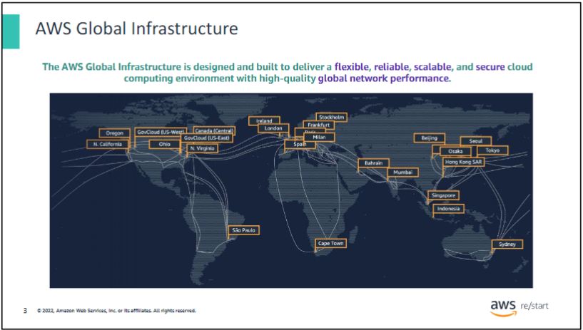

The diagram illustrates the 24 current AWS Regions along with Regions that are expected to become available soon (as of August 2020). For more detailed information about the current AWS Regions, you can refer to the [Global Infrastructure page](https://aws.amazon.com/about-aws/global-infrastructure/?p=ngi&loc=0).

#### AWS Global Infrastructure elements

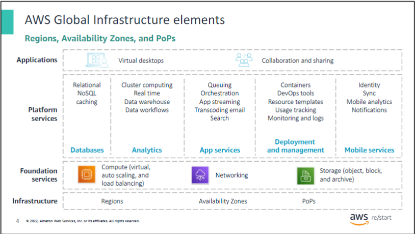

As discussed earlier, AWS provides a broad set of services, such as compute, storage options, networking, and databases. They are delivered as an on-demand utility that is available in seconds with pay-as-you-go pricing. All these services reside on the AWS Global Infrastructure.

The AWS Global Infrastructure consists of three elements:

- **Regions**
- **Availability Zones**
- **Points of Presence (PoPs)**

Next, you will take an in-depth look at the AWS Global Infrastructure and learn more about these elements.

#### AWS Global Infrastructure (cont.)

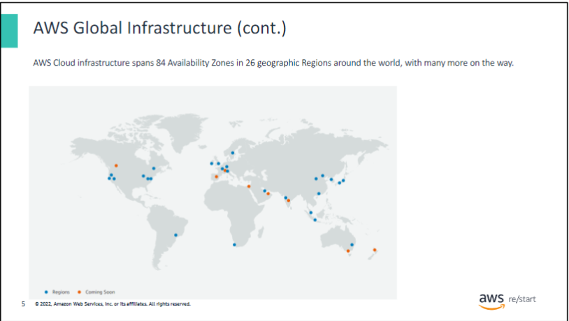

AWS offers:

- 7 Regions in North America
- 1 Region in South America
- 6 Regions in Europe
- 1 Region in the Middle East
- 1 Region in Africa
- 10 Regions in the Asia Pacific

Within each Region, there is one or more Availability Zone. AWS Regions provide benefits such as security, availability, performance, a large global footprint, scalability, and flexibility.

For more detailed information, see [Regions and Availability Zones](https://aws.amazon.com/about-aws/global-infrastructure/regions_az/?p=ngi&loc=2).

### AWS Data Centers

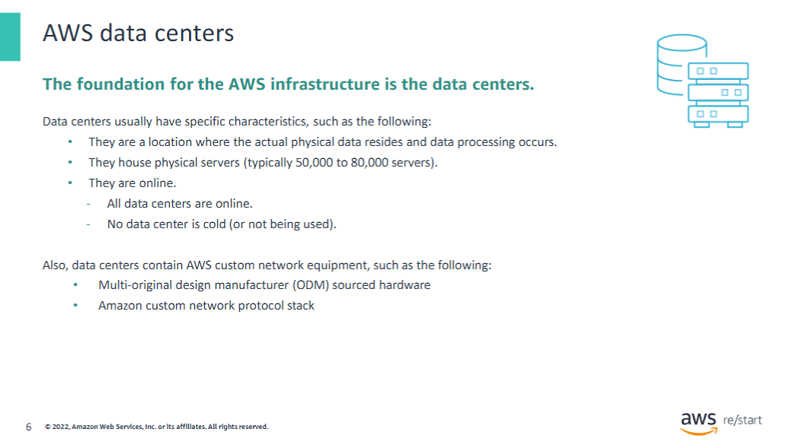

The foundation for the AWS infrastructure is its data centers. A data center is where the physical data resides and where data processing occurs. AWS data centers are clustered in various global Regions. These data centers are designed with security and reliability in mind:

- Each location undergoes careful evaluation to mitigate environmental risks.
- Data centers are redundantly designed to anticipate and tolerate failures while maintaining service levels.
- Critical system components are backed up across multiple isolated locations known as Availability Zones to ensure availability.
- AWS continuously monitors service usage to deploy infrastructure and support availability commitments.
- Data center locations are not disclosed and access is strictly restricted.
- Automated processes reroute customer data traffic in case of failures to maintain service continuity.

A single AWS data center typically houses between 50,000 to 80,000 physical servers. All data centers are operational and serve customers actively.

AWS uses custom network equipment sourced from multiple Original Design Manufacturers (ODMs). ODMs design and manufacture products based on specifications from AWS, which then rebrands them for sale.

For more detailed information about AWS data center security, visit the [AWS Data Centers page](https://aws.amazon.com/compliance/data-center/).

### AWS Availability Zones

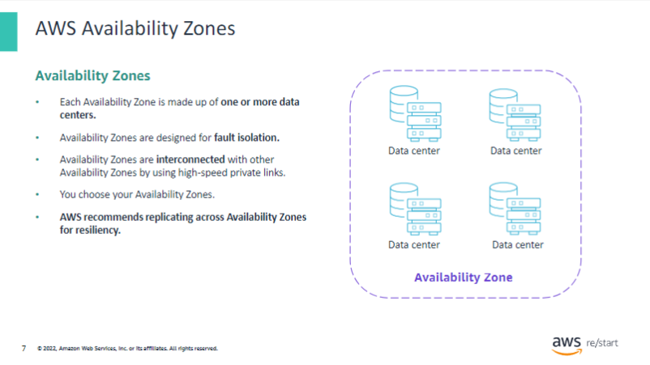

**Availability Zones** consist of one or more discrete data centers designed for fault isolation. Each Availability Zone has redundant power, networking, and connectivity resources housed in separate facilities. They are interconnected with other Availability Zones using high-speed private links. Some Availability Zones can include up to six data centers, but no data center can belong to more than one Availability Zone.

Each Availability Zone is an independent failure zone, physically separated within a typical metropolitan Region. They are situated in lower-risk flood plains with specific flood-zone categorization varying by Region. Additionally, each Availability Zone has its own uninterruptible power supply and onsite backup generation facilities. They are fed by different grids from independent utilities to minimize single points of failure. All Availability Zones are redundantly connected to multiple tier-1 transit providers, ensuring reliable connectivity.

Availability Zones within a Region are linked through low-latency connections. As an AWS customer, you are responsible for choosing the Availability Zones where your systems will operate. AWS recommends distributing systems across multiple Availability Zones for resilience. This approach helps ensure that your applications can withstand temporary or prolonged failures of an Availability Zone, such as during a disaster scenario.

Designing applications to span across multiple Availability Zones enhances their resilience against various failure scenarios, including natural disasters or system failures.

### AWS Regions

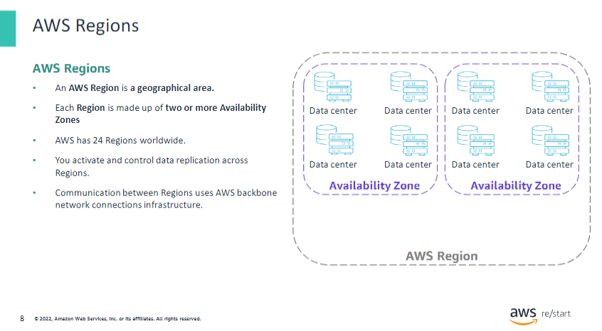

The AWS Cloud infrastructure revolves around **Regions** and **Availability Zones**. An AWS Region is a physical geographical location worldwide where AWS has multiple Availability Zones. Regions are isolated from each other to achieve fault tolerance and stability. Resources in one Region are not automatically replicated to others. As of August 2020, AWS had 24 Regions globally, each containing two or more Availability Zones.

When you store data in a specific Region, it remains within that Region and is not replicated outside of it by AWS. You are responsible for replicating data across Regions if needed for your business requirements. AWS provides information about the country and, where applicable, the state where each Region is located. It is crucial to select the appropriate Region based on compliance and network latency considerations.

For example, if you're using cloud computing services, you can deploy your application in multiple Regions. For instance, you could deploy one application in a Region near your headquarters, like San Diego on the US West Coast, and another in a Region on the US East Coast, say Virginia, to better serve your customer base there. Deploying in multiple Regions reduces latency and increases organizational agility with minimal cost and setup time.

Some AWS Regions, such as AWS GovCloud (US), have restricted access and are specifically designed to meet the regulatory and compliance requirements of US government agencies and customers.

For more information on AWS Regions and their capabilities, visit the [AWS Global Infrastructure page](https://aws.amazon.com/about-aws/global-infrastructure/).

#### Select a Region

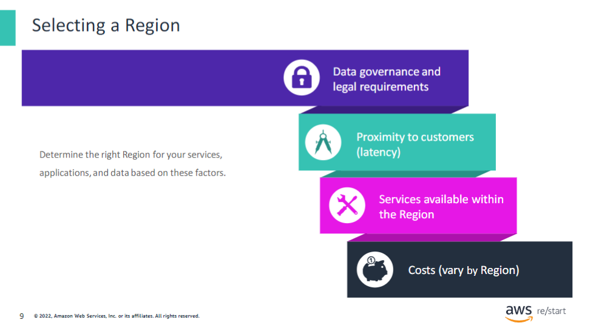

When selecting the optimal AWS Region(s) for storing data and using AWS services, several factors should be considered:

- **Data Governance and Legal Requirements:**
  Local laws may require data to be stored within specific geographical boundaries. For instance, regulations like the EU Data Protection Directive may restrict where certain content or services can be offered.

- **Latency Considerations:**
  Ideally, applications and data should be hosted in a Region closest to the users and systems accessing them to minimize latency. Tools like CloudPing can help test latency between your location and all AWS Regions. For more information, visit the [CloudPing website](https://www.cloudping.info/).

- **Service Availability:**
  Not all AWS services are available in every Region. Check the [AWS Regional Services page](https://aws.amazon.com/about-aws/global-infrastructure/regional-product-services/) for details on service availability across Regions.

- **Cost Variations:**
  Costs for running services can vary between Regions. For example, the hourly cost of running a t3.medium Amazon EC2 On-Demand Linux Instance in one Region may differ from another. Check the current pricing details on the AWS website.

In summary, when choosing an AWS Region, consider factors such as service availability, location, latency optimization, and regulatory compliance. This approach helps optimize performance, reduce costs, and ensure compliance with legal requirements.

### Points of presence

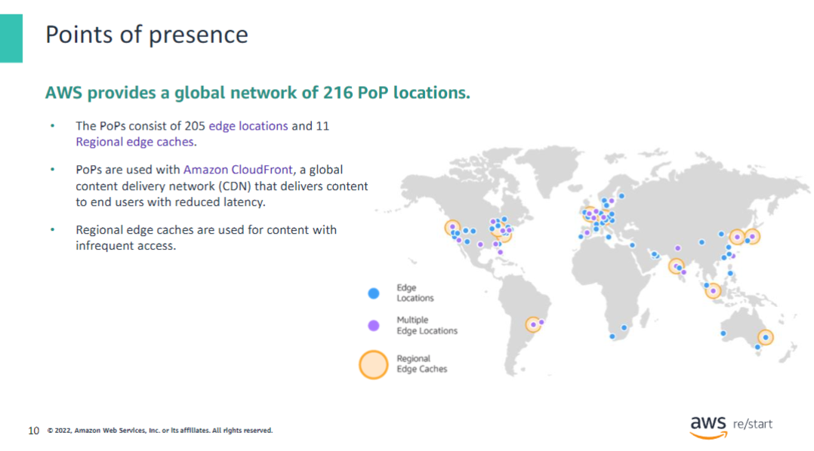

A **PoP** (Point of Presence) is where end users access AWS services, primarily through Amazon CloudFront or Amazon Route 53. As of August 2020, the global AWS infrastructure included 216 PoPs, comprising 205 edge locations and 11 Regional edge caches located in major cities worldwide. These PoPs handle requests for CloudFront and Route 53 services.

- **Amazon CloudFront** is a content delivery network (CDN) that distributes content to end users to reduce latency.
- **Amazon Route 53** is a Domain Name System (DNS) service that routes requests to the nearest edge location automatically.

**Regional edge caches**, integrated with CloudFront by default, store less frequently accessed content that isn't kept in edge locations. They provide an alternative to fetching content from the origin server.

For more detailed information about the AWS Global Infrastructure, visit the [Global Infrastructure page](https://aws.amazon.com/about-aws/global-infrastructure/?p=ngi&loc=0).

### AWS infratsructure features

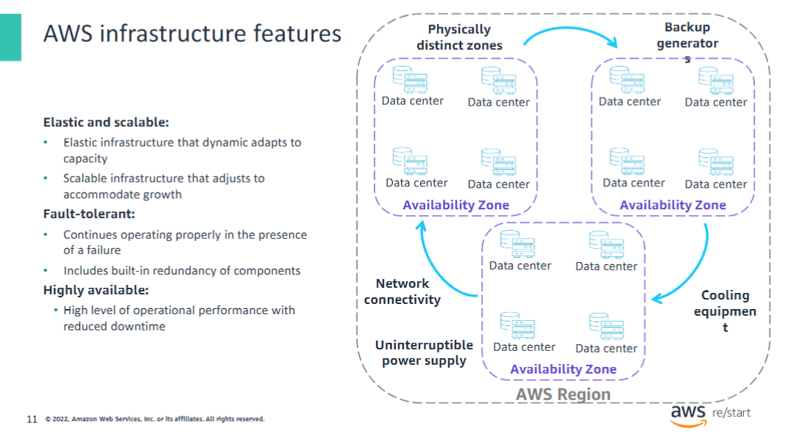

The AWS Global infrastructure is centered around **Regions** and **Availability Zones**. AWS Regions consist of multiple physically separated and isolated **Availability Zones**. Each AWS Region contains two or more Availability Zones, which are individual data centers or collections of data centers. Availability Zones are interconnected with low-latency, high-throughput, and highly redundant networking infrastructure. They are physically distinct and equipped with uninterruptible power supplies, cooling systems, backup generators, and robust security measures to ensure continuous operations.

Key features of this infrastructure include:

- **Elasticity and Scalability:** Resources can dynamically scale up or down based on demand, allowing the infrastructure to rapidly adjust to accommodate workload changes.
  
- **Fault Tolerance:** Built-in redundancy ensures that operations can continue even in the event of a component failure.
  
- **High Availability with Minimal Downtime:** The infrastructure is designed to operate with minimal to no human intervention, providing high availability and minimizing downtime.

This infrastructure design enables AWS to offer reliable and resilient cloud services that can meet varying customer requirements across different Regions worldwide.

### Key takeaways

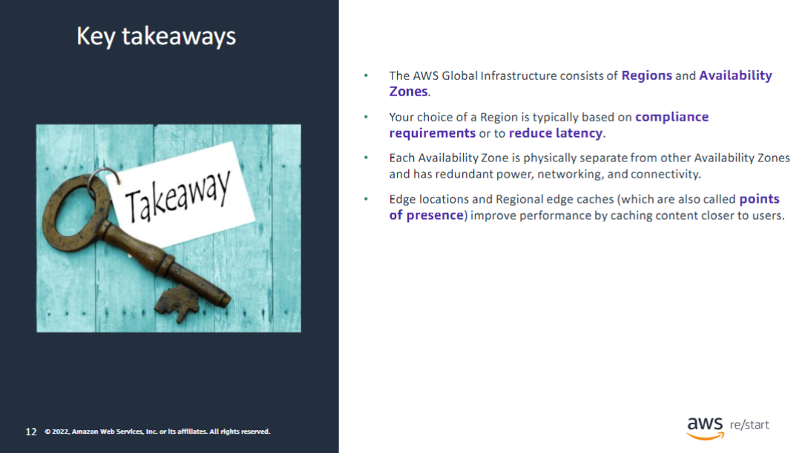

This module includes the following key takeaways:

- The AWS Global Infrastructure consists of **Regions** and **Availability Zones**.
- Your choice of a Region is typically based on compliance requirements or to reduce latency.
- Each **Availability Zone** is physically separate from other Availability Zones and has redundant power, networking, and connectivity.
- **Edge locations** and **Regional edge caches** (also called points of presence) improve performance by caching content closer to users.
