## AWS Availability Zones

### Introduction

Availability Zones (AZs) are a key component of Amazon Web Services (AWS) infrastructure, designed to provide high availability and fault tolerance for cloud resources.

### Definition

An Availability Zone is a physically separate data center within an AWS Region, equipped with independent power, cooling, and networking.

### Key Features

- **Isolation**: Each AZ is isolated from others to prevent failures from spreading.
- **Low-Latency Connectivity**: AZs within a region are connected via high-speed, low-latency networking.
- **Redundancy**: Multiple AZs allow for redundant deployments of resources.

### Benefits

1. **High Availability**: Distribute applications across multiple AZs to ensure continuous operation.
2. **Fault Tolerance**: Protect against single points of failure by replicating resources across AZs.
3. **Scalability**: Easily scale resources across different AZs as needed.

### Best Practices

- Deploy critical applications across at least two AZs.
- Use AWS services that automatically leverage multiple AZs.
- Design applications to be AZ-aware for optimal performance and reliability.

### Relation to Regions

- Each AWS Region contains multiple AZs (typically 3 or more).
- AZs in a region work together to provide a robust and resilient infrastructure.

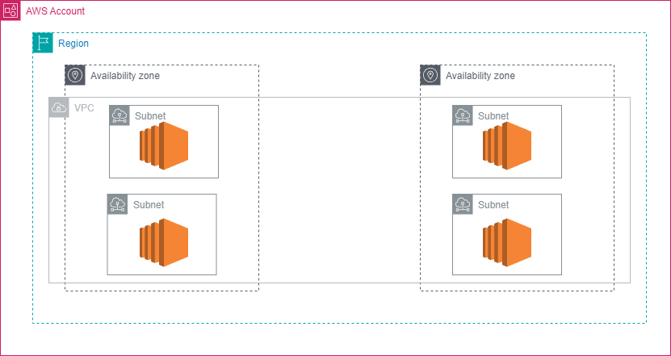

## AWS Pricing Model

Three fundamental drivers of cost with AWS:

| Compute | Storage | Data transfer |
|---------|---------|---------------|
| - Calculated either by the hour or the second | - Charged typically per GB | - Outbound is aggregated and charged |
| - Varies by instance type | | - Inbound has no charge (with some exceptions) |
| | | - Charged typically per GB |

AWS has three fundamental drivers of cost: compute, storage, and outbound data transfer. These characteristics vary somewhat depending on the AWS offering and pricing model that you choose.In most cases,you won’t becharged for inbound data transfer or for data transfer between other AWS services in the same AWS Region. Some exceptions exist,so be sure to verify data transfer rates before you begin to use the AWS service.Outbound data transfer is aggregated across servicesand then charged at the outbound data transfer rate. This charge appears on the monthly statement as AWS Data Transfer Out.

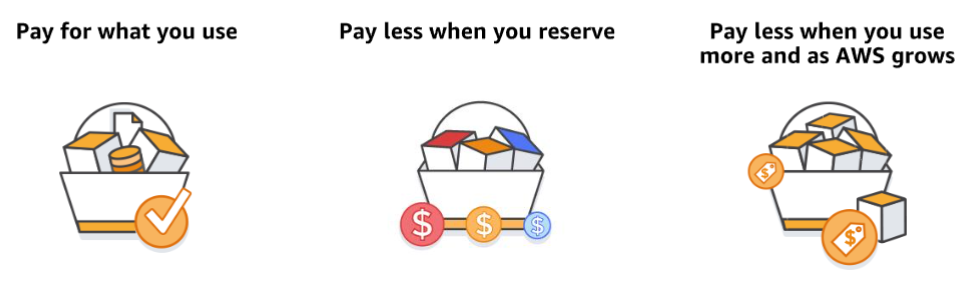

### AWS Pricing Philosophy

AWS pricing is based on a consistent philosophy, despite the growing number and types of services offered:

- Pay for what you use at the end of each month
- Start or stop using a product at any time
- No long-term contracts required

#### Utility-Style Pricing Model

AWS offers a range of cloud computing services with a utility-style pricing model:

1. **Pay for what you use**
2. **Pay less when you reserve**
3. **Pay less when you use more**
4. **Pay even less as AWS grows**

These core pricing concepts reflect AWS's commitment to flexible, cost-effective cloud services.

For more detailed information about AWS pricing, refer to the [How AWS Pricing Works](https://d0.awsstatic.com/whitepapers/aws_pricing_overview.pdf) guide.

Unless you build data centers for a living, you might have spent too much time and money building them. With AWS, you pay only for the services that you consume with no large upfront expenses. You can lower variable costs. Thus, you no longer need to dedicate valuable resources to building costly infrastructure, including purchasing servers, software licenses, or leasing facilities. Quickly adapt to changing business needs and redirect your focus on innovation and invention. Pay only for what you use and for as long as you need it. All AWS services are available on demand, require no long-term contracts, and have no complex licensing dependencies.

### Pay less when you reserve

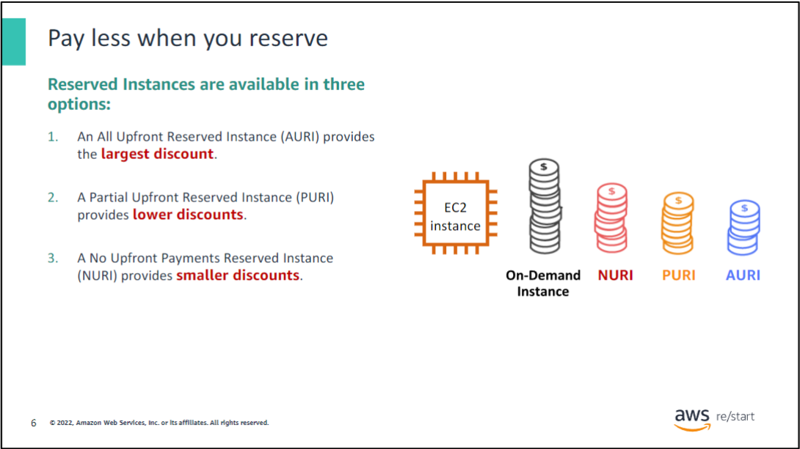

For services like Amazon Elastic Compute Cloud (Amazon EC2) and Amazon Relational Database Service (Amazon RDS), AWS offers reserved capacity options:

#### Reserved Instances Types

1. **All Upfront Reserved Instance (AURI)**
2. **Partial Upfront Reserved Instance (PURI)**
3. **No Upfront Payments Reserved Instance (NURI)**

#### Discount Structure

- Larger upfront payments result in greater discounts
- All upfront payment offers the largest discount
- Partial upfront provides lower discounts but requires less initial investment
- No upfront option offers the smallest discount but preserves capital for other projects

#### Benefits of Reserved Capacity

- Minimize risks
- More predictable budget management
- Compliance with policies requiring longer-term commitments

Reserved Instances can lead to significant savings compared to equivalent on-demand capacity, offering flexibility in how you allocate your cloud computing budget.

### Pay less by using more

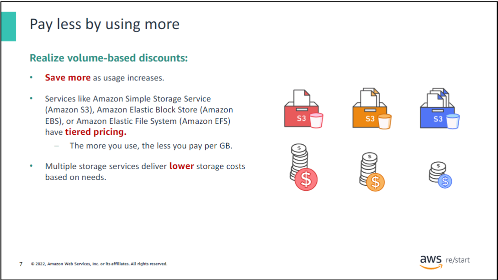

#### Tiered Pricing

- As usage increases, you can realize significant savings
- Services like Amazon S3 use tiered pricing
  - Pay less per GB with higher usage

#### Data Transfer Pricing

- Inbound data transfer is free of charge

#### Storage Options

- Multiple storage services available
- Lower costs based on specific needs

#### Benefits of Increased Usage

- Economies of scale
- Increased adoption with controlled costs

#### Flexible Service Options

- AWS offers services to address evolving business needs
- Storage services portfolio example:
  - Options to lower pricing based on:
    1. Frequency of data access
    2. Required retrieval performance

#### Optimizing Savings

- Choose the right combination of storage solutions to:
  - Reduce costs
  - Preserve performance
  - Maintain security
  - Ensure durability

As your AWS usage grows, you can take advantage of volume-based discounts and diverse service options to optimize costs while meeting your specific business requirements.

### Pay less as AWS grows

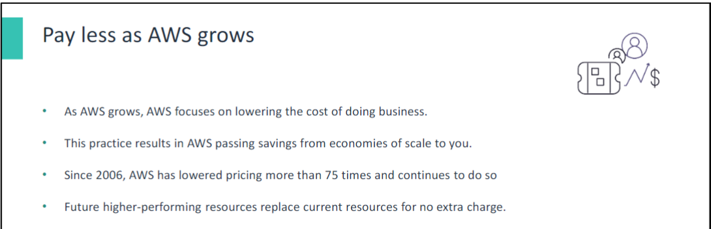

#### AWS Continuous Improvements

AWS consistently focuses on:

- Reducing data center hardware costs
- Improving operational efficiencies
- Lowering power consumption
- Decreasing overall cost of doing business

#### Economies of Scale

- Optimizations lead to substantial economies of scale
- Savings are passed back to customers through lower pricing

#### Pricing History

- Since 2006, AWS has lowered pricing more than 75 times
- Continues to reduce prices

#### Technology Upgrades

- Future, higher-performing resources replace current ones
- No extra charge for these upgrades

AWS's commitment to efficiency and scale benefits customers through consistent price reductions and improved technology at no additional cost.

### Custom pricing

AWS realizes that every customer has different needs. If none of the AWS pricing models work for your project, custom pricing is available for high-volume projects with unique requirements.

### AWS Free Tier

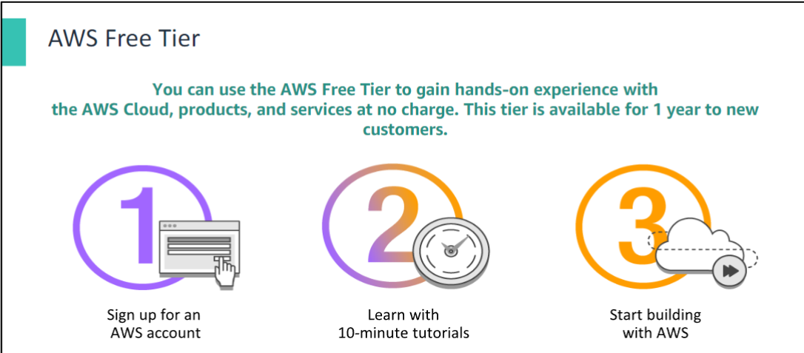

#### Overview

- Designed to help new AWS customers get started in the cloud
- Available for up to 1 year for new customers
- Applies to certain services and options

#### Free Tier Offerings

For new AWS customers, the free tier includes:

1. **Amazon EC2**
   - One free T2 micro instance for a year

2. **Other Free Services**
   - Amazon S3
   - Amazon EBS
   - Elastic Load Balancing
   - AWS data transfer

3. **Additional AWS Services**
   - Various other services also included in the free tier

The AWS Free Tier provides an opportunity for new users to explore and learn about AWS services without initial costs.

### Services with no charge

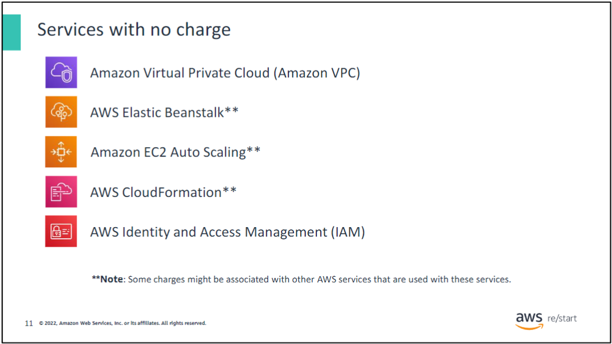

AWS also offers a variety of services and features for no additional charge. This slide includes some of them:

- **Amazon Virtual Private Cloud (Amazon VPC)** – You can provision a logically isolated section of the AWS Cloud where you can launch AWS resources in a virtual network that you define.
- **AWS Identity and Access Management (IAM)** – You can use this service to control your users’ access to AWS services and resources.
- **Consolidated Billing** – You can use this billing feature in the AWS Organizations service to consolidate payment for multiple AWS accounts. Consolidated Billing provides the following:
  - One bill for multiple accounts
  - The ability to track each account’s charges
  - The opportunity to decrease charges because of volume pricing discounts from combined usage
  - The ability to consolidate all of your accounts by using Consolidated Billing and get tiered benefits
- **AWS Elastic Beanstalk** – With this service, you can quickly deploy and manage applications in the AWS Cloud.
- **AWS CloudFormation** – Developers and systems administrators can use this service to create a collection of related AWS resources and provision them in an orderly and predictable fashion.
- **Amazon EC2 Auto Scaling** – This service automatically adds or removes resources according to conditions that you define. The resources that you are using increase seamlessly during demand spikes to maintain performance and decrease automatically during demand lulls to minimize costs.
- **AWS OpsWorks** – You can use this application management service to deploy and operate applications of all shapes and sizes.

Though these services do not incur any charge, other charges might be associated with other AWS services that are used with these services. For example, when you automatically scale additional EC2 instances, you will be charged for those instances.

### AWS Pricing Calculator

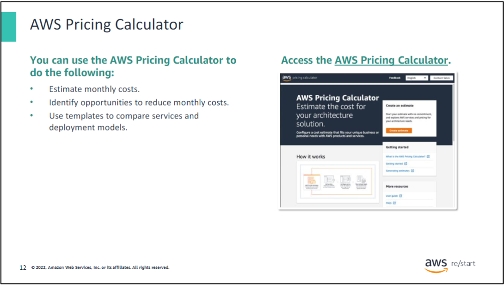

The AWS Pricing Calculator can help you estimate a monthly AWS bill. Using this tool, you can add, modify, and remove services from your bill. It will recalculate the estimated monthly charges automatically. The calculator incorporates a wide array of pricing calculations across all services in all Regions. It also shows a breakdown of features for each service in each Region. The AWS Pricing Calculator is a tool that helps you with the following:

- Estimate AWS monthly services costs.
- Identify opportunities for cost reduction.
- Use templates to model solutions to compare services and deployment models.

The calculator also shows common customer samples and usage. For example, you can choose Disaster Recovery and Backup or Web Application to access sample data and uses for each service. For more information about the AWS Pricing Calculator and to start using it, see the [AWS Pricing Calculator website](https://calculator.aws/#/).

### Total cost of ownership

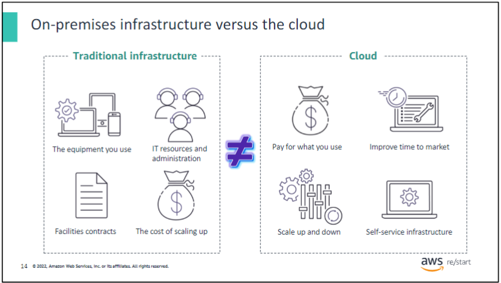

Many businesses choose between an on-premises (traditional) and a cloud infrastructure. The difference between these two options is how they are deployed.

On-premises infrastructure is installed on a company’s computers and servers. Several fixed costs are associated with traditional infrastructure, including facilities, hardware, licenses, and maintenance staff. Scaling up can be expensive and time-consuming. Scaling down does not reduce fixed costs.

Cloud infrastructure is purchased from a service provider. Customers pay for what they use. Costs are easy to estimate.

It is difficult to compare an on-premises IT delivery model with the AWS Cloud. The two infrastructures are so different that they use other terms:

- An on-premises IT discussion is based on fixed costs, long planning cycles, and multiple components to buy, build, manage, and refresh over time.
- AWS involves a discussion about flexibility, agility, and consumption-based costs.

How can you identify the best option?

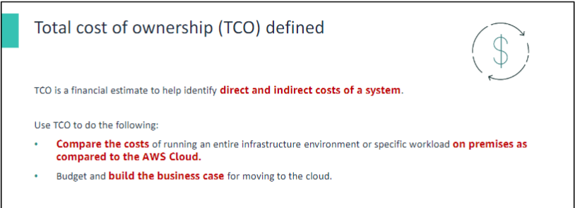

You can use the total cost of ownership (TCO) to compare on-premises and cloud solutions and identify the best option. TCO is a financial estimate that helps buyers and owners determine the direct and indirect costs of a product or system. It includes the cost of a service and associated expenses.

For example, suppose that you run a specific workload in an on-premises facility. You want to run the same workload in the cloud. You can use TCO to compare the costs of running the workload on a cloud infrastructure against running it on an on-premises (or colocation) infrastructure. You can then use the comparison for budgeting purposes or to build a business case for the optimal deployment solution.

| **TCO Considerations**      |                                  |                             |                               |
|-----------------------------|----------------------------------|-----------------------------|-------------------------------|
| **Server costs**            | Hardware: Server, rack chassis, power distribution units, top-of-rack switches (and maintenance) | Software: Operating system (OS), virtualization licenses (and maintenance) | Facilities cost: Space, Power, Cooling |
| **Storage costs**           | Hardware: Storage disks, storage area network or fiber channel switches | Storage administration costs | Facilities cost: Space, Power, Cooling |
| **Network costs**           | Network hardware: Local area network switches, load balancer bandwidth costs | Network administration costs | Facilities cost: Space, Power, Cooling |
| **IT labor costs**          | Server administration costs      |                             |                               |

When you compare an on-premises solution and a cloud solution, it’s essential to assess the actual costs of both options. With the cloud, most costs are upfront and can be calculated. Cloud providers give transparent pricing based on different usage metrics such as RAM, storage, and bandwidth. Pricing is frequently fixed per unit of time. After you understand how pricing works, you can calculate costs based on several different usage estimates.

With on-premises technology, in-house costs of running a server include the following:

- Direct costs, such as power, floor space, storage, and IT operations to manage those resources
- Indirect costs, such as network and storage infrastructure

The diagram is an abbreviated list that demonstrates the type of costs involved in data center maintenance. It doesn’t include every cost item. Depending on the solution, software costs can also include database, management, and middle-tier fees. Facilities costs can consist of upgrades, maintenance, building security, and taxes. IT labor costs can include security and application administration costs.

Some of the costs that are associated with data center management include the following:

- Server costs for both hardware and software, and facilities expenses for equipment
- Storage costs for hardware, administration, and facilities
- Network costs, which include costs for hardware, administration, and facilities
- IT labor costs that are required to administer the solution

### Key Takeaways

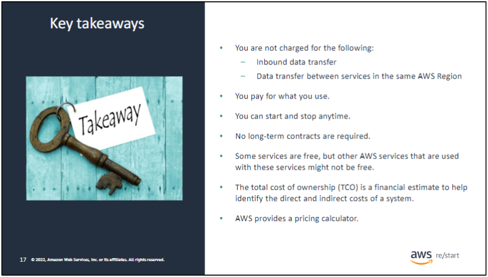

In summary, though the number and types of services that AWS offers have increased, the AWS philosophy on pricing has not changed. At the end of each month, you pay only for what you use, and you can start or stop using a product at any time. No long-term contracts are required. The best way to estimate costs is to examine the fundamental characteristics for each AWS service and estimate your usage for each characteristic. Then, map that usage to the prices that are posted on the website.

The service pricing strategy offers the flexibility to choose the services that you need for each project and to pay for only what you use. You can use the AWS Pricing Calculator to get AWS service cost estimates and evaluate the total of an AWS solution, respectively.

Some AWS services and features, including the following, don’t incur charges:

- Amazon VPC
- AWS Elastic Beanstalk
- AWS CloudFormation
- IAM
- Amazon EC2 Auto Scaling
- AWS OpsWorks
- Consolidated Billing

Though the services themselves don’t incur charges, the resources that they provision are not free. Additionally, you are not charged for inbound data or data transfer between services in the same Region, but outbound data transfer costs are tiered.

For more information about pricing, see the following links:

- [AWS Pricing](https://aws.amazon.com/pricing/)
- [AWS Pricing Overview](https://d0.awsstatic.com/whitepapers/aws_pricing_overview.pdf)
