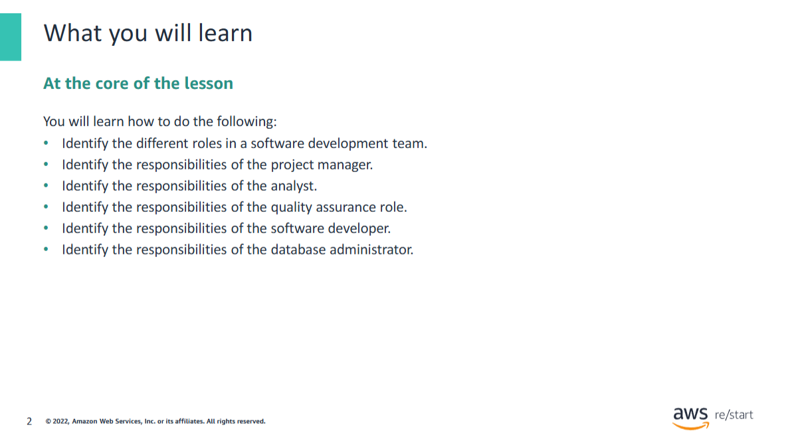
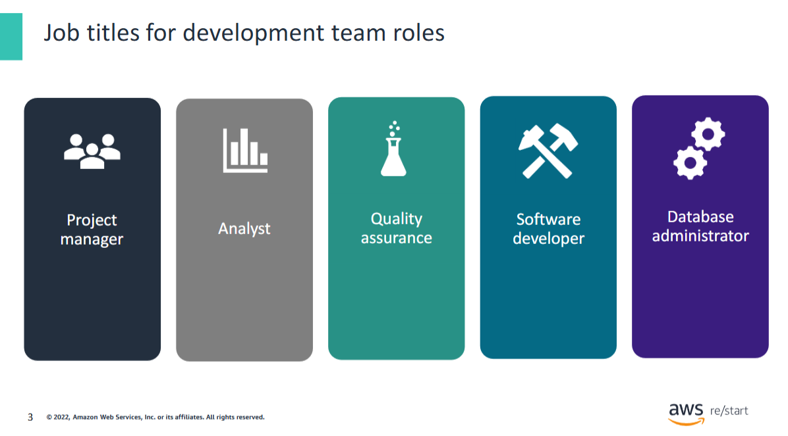
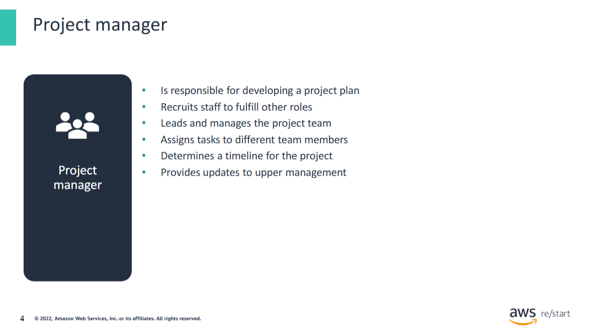
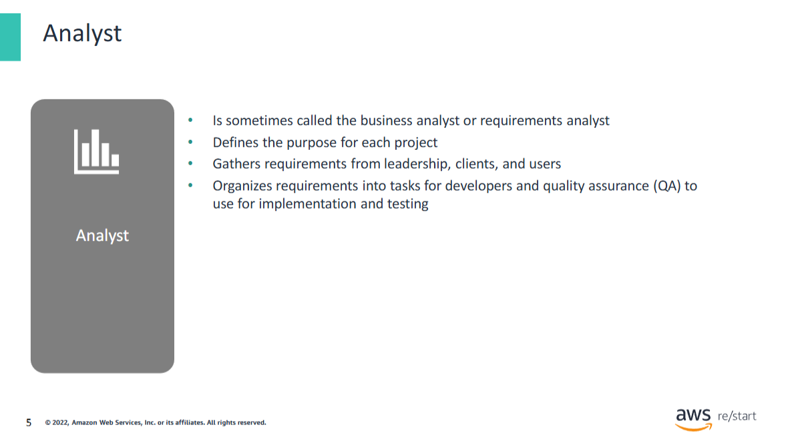
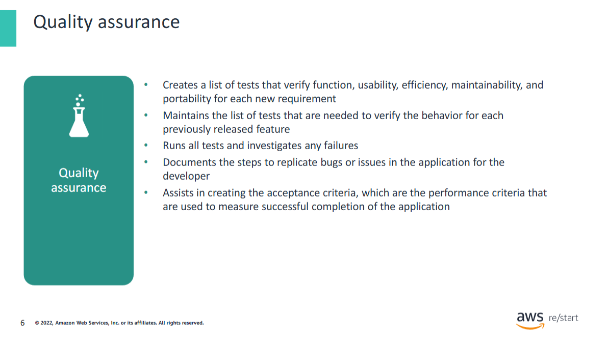
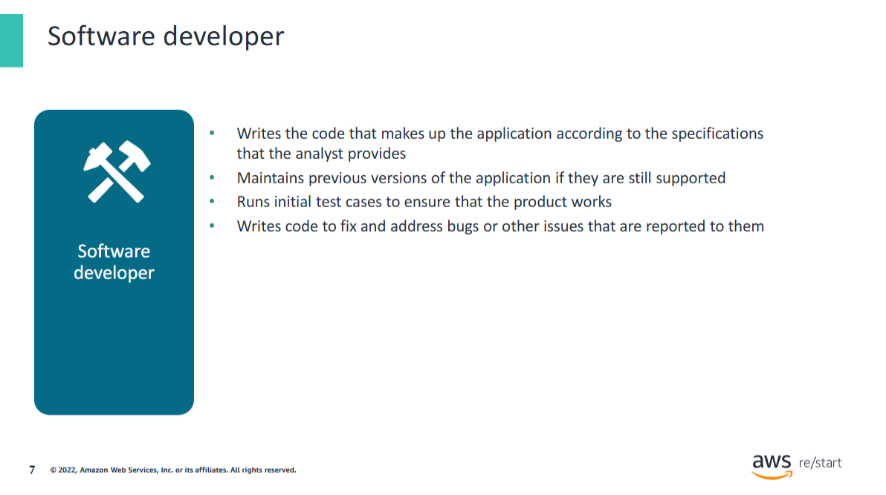
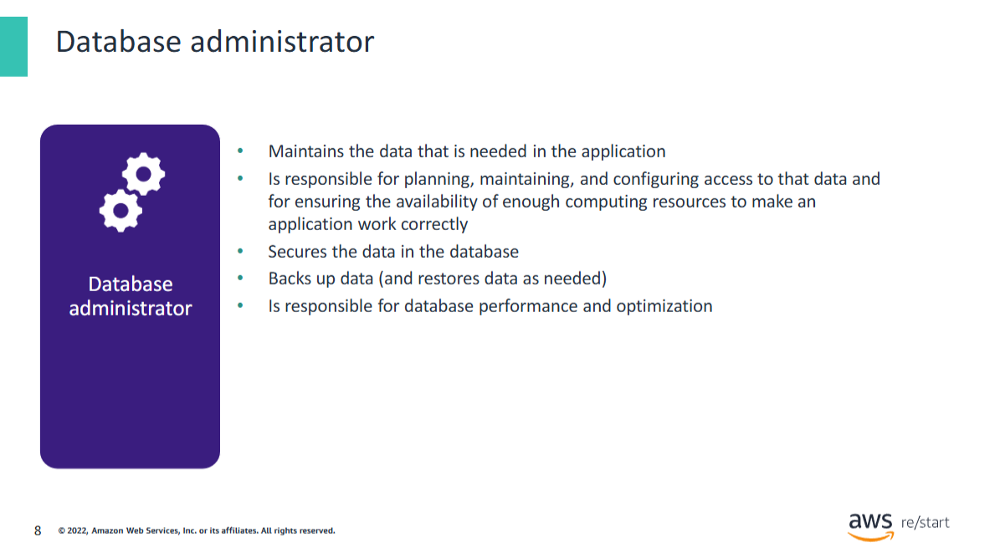
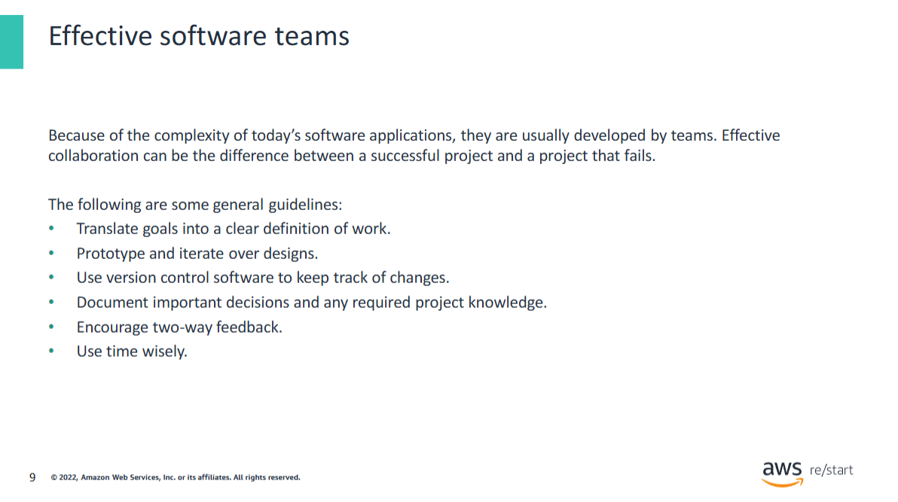
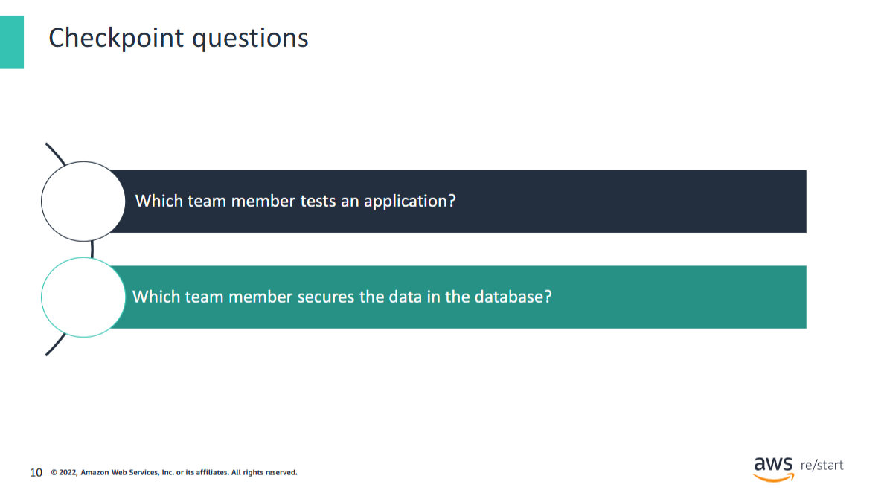
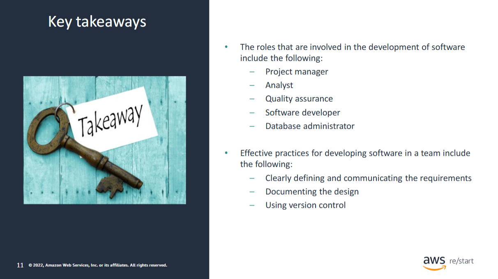

You will learn how to do the following:

- Identify the different roles in a software development team.
- Identify the responsibilities of the project manager.
- Identify the responsibilities of the analyst.
- Identify the responsibilities of the quality assurance role.
- Identify the responsibilities of the software developer.
- Identify the responsibilities of the database administrator.

## Job titles for development team roles

To complete the software development lifecycle (SDLC) in a successful and timely manner, development often takes place in teams. All team members have specialized roles that are designed to collaborate with each other. Many teams are self-contained, where the team has enough technical expertise to accomplish the SDLC without relying on outside support.

## Project Manager

## Analyst

## Quality assurance

## Software developer

## Database administrator

## Effective software teams

## Checkpoint questions

1. Which team member tests an application?-Quality assurance team members run all tests and investigate any failures.
    - The Software developer runs all initial test cases to ensure that the product works.
2. Which team member secures the data in the database?
   - The database administrator ensures the security of the data in the database.

## Key takeaways

:::tip[Recap]
The following are some key takeaways from this module:

Roles Involved in Software Development
- Project Manager
- Analyst
- Quality Assurance
- Software Developer
- Database Administrator

Effective Practices for Team-Based Software Development
- Clearly defining and communicating the requirements
- Documenting the design
- Using version control  

:::