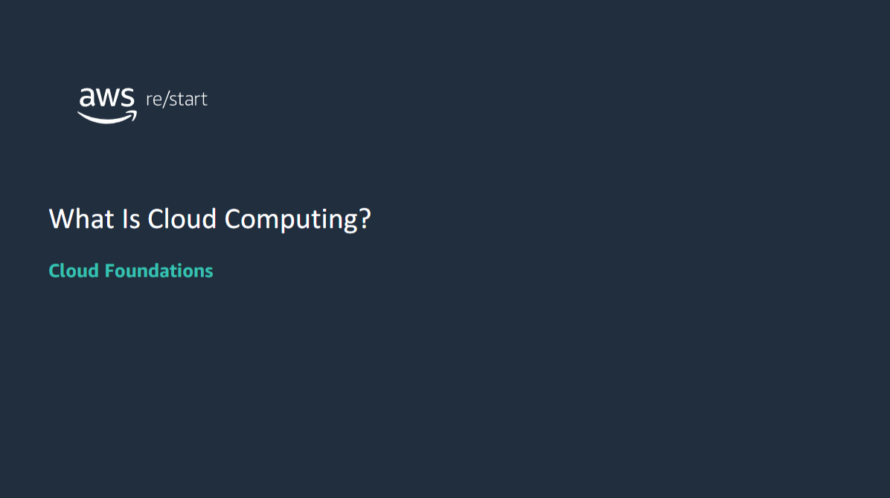

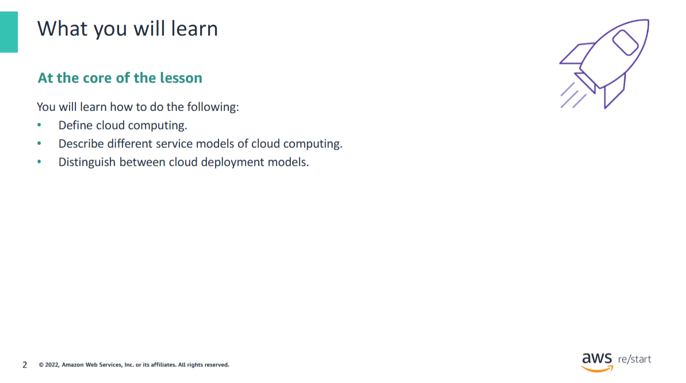

After completing this module, you should be able to do the following:
- Define cloud computing.•Describe different service models of cloud computing.
- Distinguish between cloud deployment models.

## Understanding cloud computing

What does cloud computing mean to you? 
Take a moment to provide a quick sentence about what you understand cloud computing to be. 
No answers are wrong.

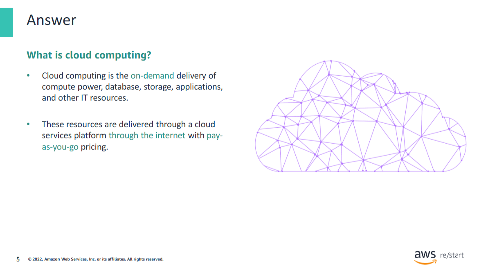

Cloud computing is the on-demand delivery of compute power, database, storage, applications, and other IT resources. These resources are delivered through a cloud services platform via the internet with pay-as-you-go pricing.

### Basic Definition
In its most basic definition, the cloud is a computer that is located somewhere else, accessed through the internet, and used in some way.  
"Web services" is another name for what people call the cloud.

### How the Cloud Works
The cloud comprises server computers in large data centers located in various places around the world.  
When you use a cloud service like **Amazon Web Services (AWS)**, you use computers that **AWS owns**.

These computers contain various technology features and services, which are like **building blocks** that you can use to assemble solutions. These solutions help users meet their business goals and technology requirements.

### Benefits of Cloud Computing
With cloud computing, organizations can:
- Consume on-demand computing and storage resources
- Avoid the need to build, operate, and improve infrastructure on their own

### Learn More
For more information, see:  
[What is cloud computing? – AWS](https://aws.amazon.com/what-is-cloud-computing/)

## Traditional computing model
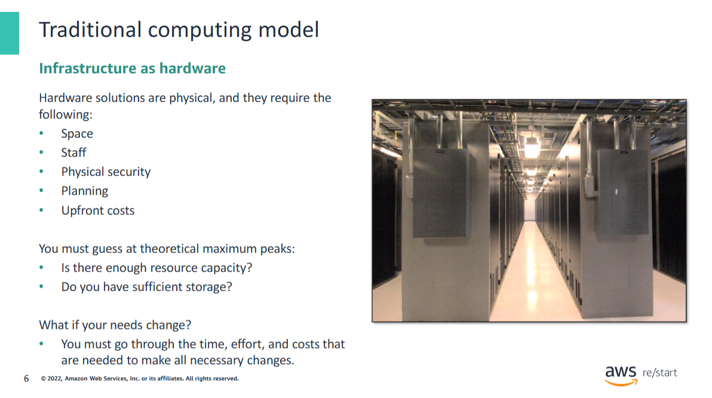

In the traditional computing model, infrastructure is thought of as hardware. Managing hardware takes time and resources that you could be using to improve your architecture and your application. Hardware solutions are physical. They require space, staff, physical security, planning, and upfront costs. In addition, you must provide capacity that is based on guessing theoretical maximum peaks. Sometimes, you might not meet your projected maximum peaks, or you might exceed them. In such cases, you would be paying for expensive resources that are idle, or you would have insufficient capacity to meet your needs.

What if your needs change? You must go through the time, effort, and cost that is needed to handle these changes.

For example, suppose that you want to provision a new website. You must buy the hardware, rack and stack it, put it in a data center, and then manage it or have someone else manage it. This approach is expensive. Rack and stack describes the process of installing the physical hardware onto the rack.

## Cloud computing model
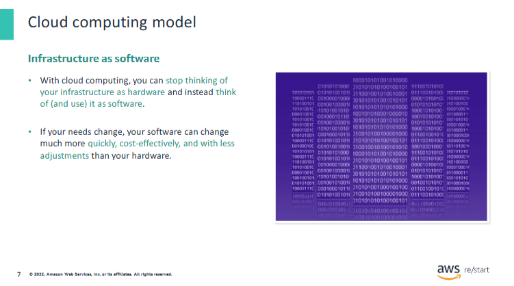

With cloud computing, you can stop thinking of your infrastructure as hardware and instead think of it (and use it) as software. Accessing and using your infrastructure as software offers a number of benefits—flexibility, in particular. If your needs change, your software can change more quickly, cost-effectively and with less adjustments than your hardware.

Cloud computing addresses some of the issues in the traditional computing model. One of the most prohibitive aspects of traditional computing is the significant upfront investment of acquiring, provisioning, and maintaining on-premises infrastructure. With cloud computing, your businesses can run with a new solution in place quickly and with low upfront costs. Then, you can elastically scale up and down in an automated way so that you pay for only what you use.

With cloud computing, you can also select the services that best match your needs. It gives you flexibility with a wide range of choices and the ability to change your configuration when you want. All of these services are provided on a secured infrastructure.

With AWS, you don’t need to anticipate your hardware needs ahead of time and then order, install, and set it up at your data center. You also don’t need to undergo a long procurement cycle. With a few clicks, you can provision exactly what you need, and it is available to you in a few minutes. You can provision and terminate resources as necessary on AWS instead of paying for hardware when you are not using it. You can treat resources as temporary and disposable, free from the inflexibility and constraints of a fixed and finite IT infrastructure.

By harnessing the power of AWS, you can be more agile and efficient with change management, testing, reliability, and capacity planning.

## Cloud service models
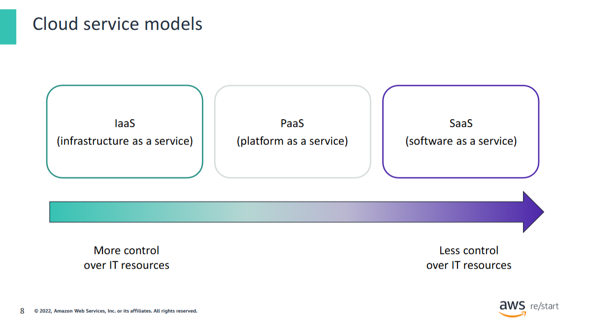

Cloud services fall into one of three primary categories, which are based mainly on how much control and responsibility you have over the service’s configuration.

With **Infrastructure as a Service (IaaS)**, you manage the server, which can be physical or virtual, and the operating system (**Microsoft Windows** or **Linux**). In general, the data center provider has no access to your server.

With **Platform as a Service (PaaS)**, someone else manages the underlying hardware and operating systems. With this option, you can run applications without managing underlying infrastructure (for example, patching, updates, maintenance, hardware, and operating systems). **PaaS** also provides a framework for developers that they can build on to create customized applications.

With **Software as a Service (SaaS)**, you manage your files while the service provider manages all data centers, servers, networks, storage, maintenance, and patching. You handle only the software and how you want to use it. You are provided with a complete product that the service provider runs and manages. **Facebook** and **Dropbox** are examples of **SaaS**. You manage your Facebook contacts and Dropbox files, and the service providers manage the systems.

## Cloud service models: Who manages what?
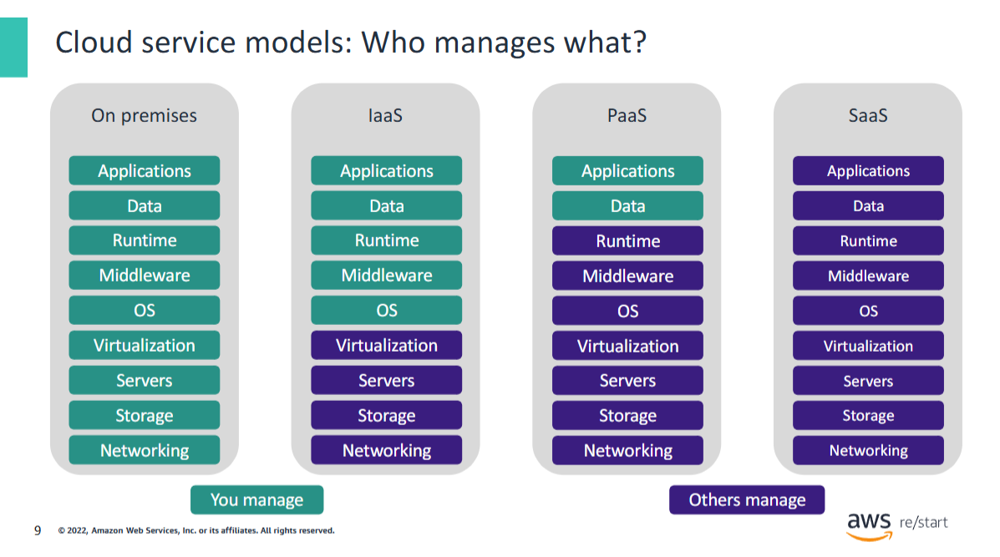

This slide shows the different hardware and software components that are required to run an application. It illustrates how you progressively manage fewer components as you go from the traditional on-premises computing service model to the SaaS model.

## Cloud computing deployment models
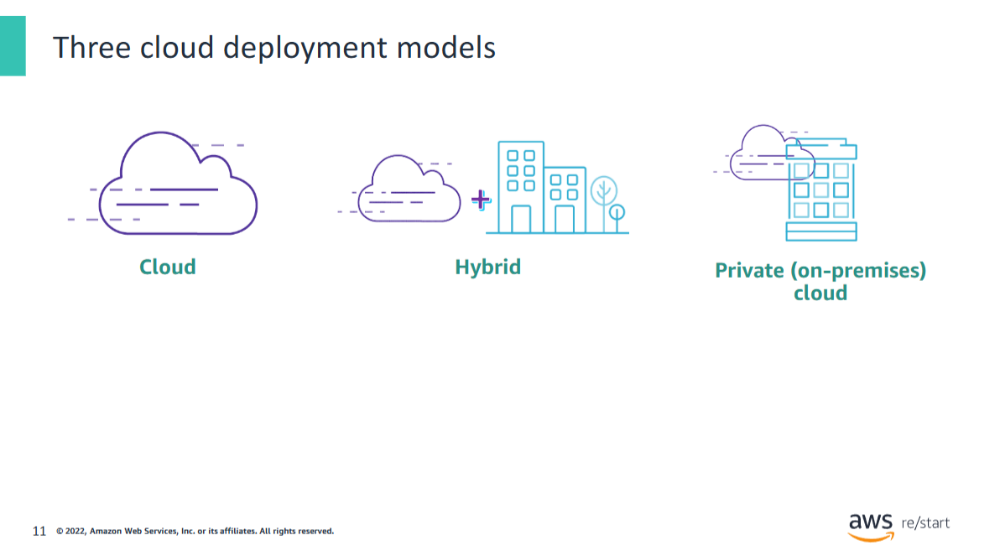

The three main cloud computing deployment models represent the cloud environments where you can deploy your applications.

**Cloud** (or **all-in cloud**) is a cloud-based application that is fully deployed in the cloud. All parts of the application run in the cloud. Applications in the cloud were either created in the cloud or migrated from an existing infrastructure. Cloud-based applications can be built on low-level infrastructure pieces (for example, networking, compute, or storage). They can also use higher-level services that provide abstraction from the management, architecting, and scaling requirements of core infrastructure.

A **hybrid deployment** is a way to connect infrastructure and applications between cloud-based resources and existing resources that are not in the cloud. The most common method of hybrid deployment is between the cloud and existing on-premises infrastructure. **On-premises infrastructure** is located in the physical confines of an enterprise, often in the company's data center. A hybrid deployment model is used to extend an organization's infrastructure into the cloud while it connects cloud resources to an internal system.

For more information about how AWS can help you with a hybrid deployment, see [Hybrid Cloud with AWS](https://aws.amazon.com/hybrid/).

When you run a cloud infrastructure from your own data center, it is called a **private** or **on-premises cloud**. Although this kind of deployment lacks many of the benefits of cloud computing, it does provide dedicated resources. It’s a popular choice for organizations that must meet certain compliance standards. In most cases, this deployment model is the same as legacy IT infrastructure, but it uses application management and virtualization to increase resource utilization.

## Cloud infrastructure compared with on-premises infrastructure
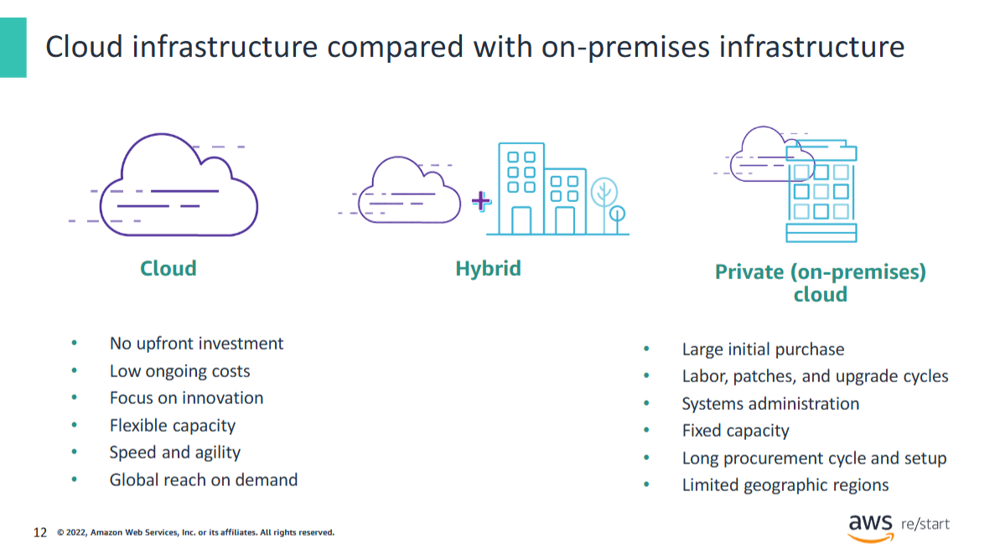

The following information summarizes this module:

With the **cloud solution**, you have no upfront investment. Thus, you can avoid the large upfront costs that are needed for an on-premises solution. You have immediate access to resources. You don’t need to procure, install, and configure hardware in a physical location that has appropriate facilities, such as cooling and power. Instead, cabling, racks, servers, and storage are provided for you remotely. You choose what to order and pay for the resources that you need, which are available almost immediately.

**Cloud computing** helps you reduce ongoing IT costs in multiple ways. **AWS** continually lowers prices due to massive economies of scale and continual improvements. Multiple pricing options also help you optimize costs based on your unique workloads. You pay for only what you use on a variable, monthly basis. **On-premises solutions** typically require upgrades on 1-year, 3-year, or 5-year cycles.

Cloud computing can also provide you with **managed IT resources** on demand at a fraction of the cost of traditional infrastructure. This cost savings empowers organizations to shift resources toward innovative new projects that grow their business by focusing on applications, not operations.

It is a complex process to predict how customers will adopt your new application, which makes it difficult to estimate your infrastructure capacity needs. **Flexible capacity** means that your resources are dynamic. You can quickly provision resources as demand goes up and remove the resources that you don’t need as demand declines.

Cloud computing’s **speed and agility** make it possible for you to respond to changing market conditions. With AWS, you can provision resources as needed. This **self-service environment** changes how you develop and deploy applications, which means that your team can experiment more quickly and more frequently.

The amount of time that it takes to get a server procured, delivered, and running becomes expensive in a traditional infrastructure.

With **on-premises infrastructure**, it is difficult to deliver great performance to a distributed user base. The initial purchase is large. It is also labor-intensive, and it includes patches, upgrade cycles, and systems administration with fixed capacity. Long procurement cycles and setup cause companies to focus on one geographic region to save costs and time.

Without geographical limitations, you can deploy your application in any **AWS Region** around the world with lower latency and at minimal cost.

## What can you do in the cloud?
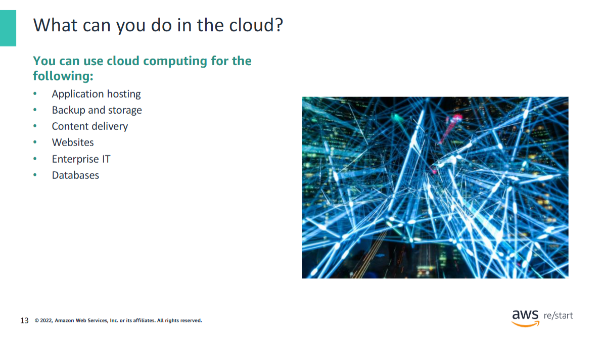

You can use a **cloud computing platform** for the following:

- **Application hosting** for an on-demand infrastructure that hosts internal or SaaS applications
- **Backup and storage** capability to store data and build dependable backup solutions
- **Content delivery** to distribute content worldwide with high data transfer speeds
- **Hosting static and dynamic websites**
- **Enterprise IT** to host internal-facing or external-facing IT applications in the AWS Cloud
- **Various scalable database solutions** from hosted enterprise database software to non-relational database solutions  

## Key takeaways
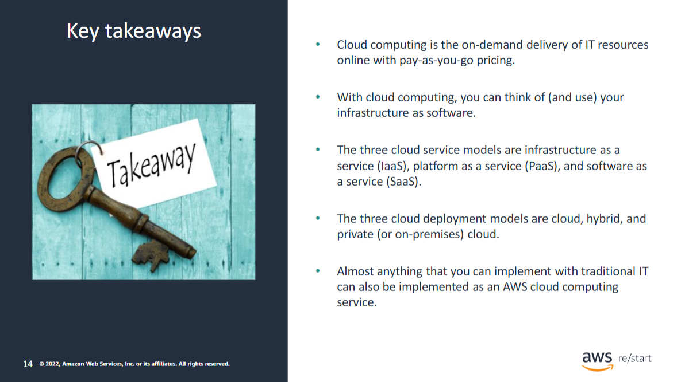

This module includes the following key takeaways:

- **Cloud computing** is the on-demand delivery of IT resources through the internet with pay-as-you-go pricing.
- With cloud computing, you can think of (and use) your infrastructure as **software**.
- The three **cloud service models** are **IaaS**, **PaaS**, and **SaaS**.
- The three **cloud deployment models** are **cloud**, **hybrid**, and **private** (or **on-premises**) cloud.
- Almost anything that you can implement with **traditional IT** can also be implemented as an **AWS cloud computing service**.  
