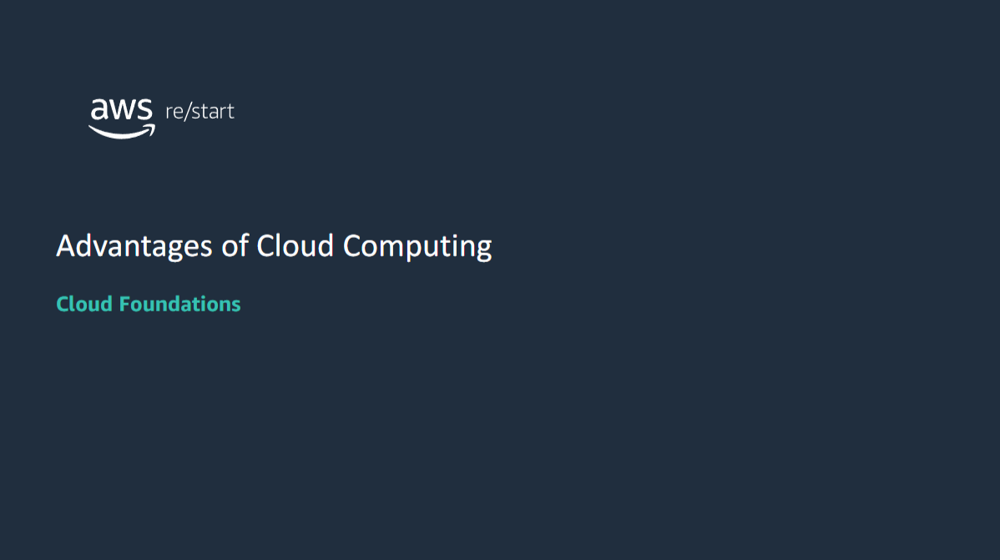

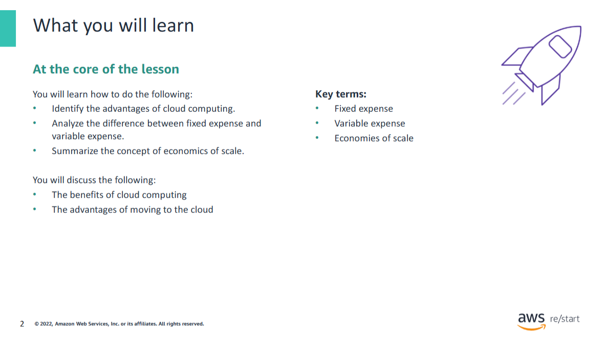

## Questions
Review the following questions, and share them with a peer:

- **How does cloud computing benefit you?**
- **If you have a business, how can cloud computing benefit your business?**
- **Why are so many companies interested in moving to the cloud?**

## Answers

**How does cloud computing benefit you?**  
Cloud computing gives you access to servers, storage, databases, and a broad set of application services over the internet. Cloud storage is a good example of cloud computing. Cloud storage gives you the option to free up memory (space) on your computer or mobile device. Imagine a situation where your mobile device runs out of memory when you want to download and save a new song, photo, or video.

**If you have a business, how can cloud computing benefit your business?**  
Cloud computing or cloud services providers like Amazon Web Services (AWS) provide rapid access to flexible and low-cost IT resources. With cloud computing, you don't need to make large upfront investments in hardware. As a business owner, you don't need to purchase a physical location, servers, storage, or databases.

**Why are so many companies interested in moving to the cloud?**  
Companies are moving to the cloud because it presents many benefits including cost savings because you pay only for the resources that you use.

## Trading fixed expense for variable expense
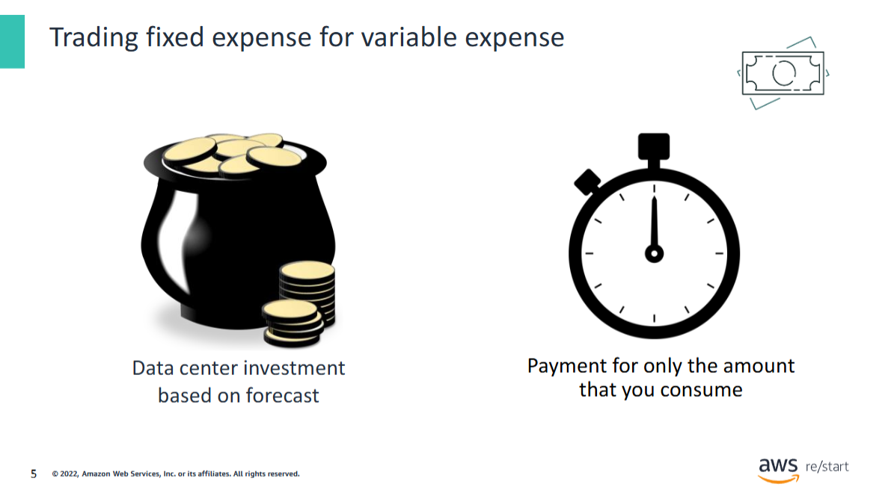

**Advantage 1: You can trade fixed expense for variable expense.**  
You don’t need to invest in data centers and servers before you know how you will use them. Instead, you can pay only when you use computing resources, and pay for how much you use.

For more information, see the [Overview of Amazon Web Services whitepaper](https://docs.aws.amazon.com/whitepapers/latest/aws-overview/aws-overview.pdf).

## Fixed expense and variable expense
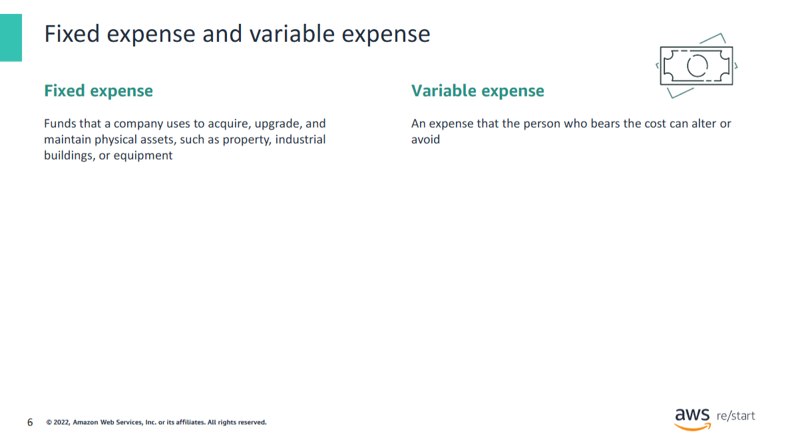

A **fixed expense** consists of funds that a company uses to acquire, upgrade, and maintain physical assets such as property, industrial buildings, or equipment. A **variable expense** is an expense that the person who bears the cost can alter or avoid.

Recall the earlier data center example where you racked and stacked the hardware, and then you needed to manage all the resources. You must pay for everything in the data center whether or not you use it.

By using the **cloud**, businesses don’t need to invest money into data centers and servers. They can pay for only what they use, and they pay only when they use these resources (which is also known as **pay as you go**).

Businesses save money on technology. They can adapt to new applications with as much space as they need in minutes instead of weeks or days. **Maintenance is reduced** so that the business can focus on its **core goals**.

## Massive economies of scale
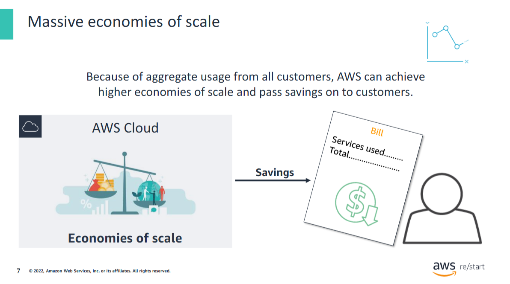

Advantage 2: You can benefit from massive economies of scale.

By using cloud computing, you can achieve a lower variable cost than you can get on your own. Because usage from hundreds of thousands of customers is aggregated in the cloud, providers such as AWS can achieve higher economies of scale. These economies translate into lower, pay-as-you-go prices.

## Reduced guessing about capacity
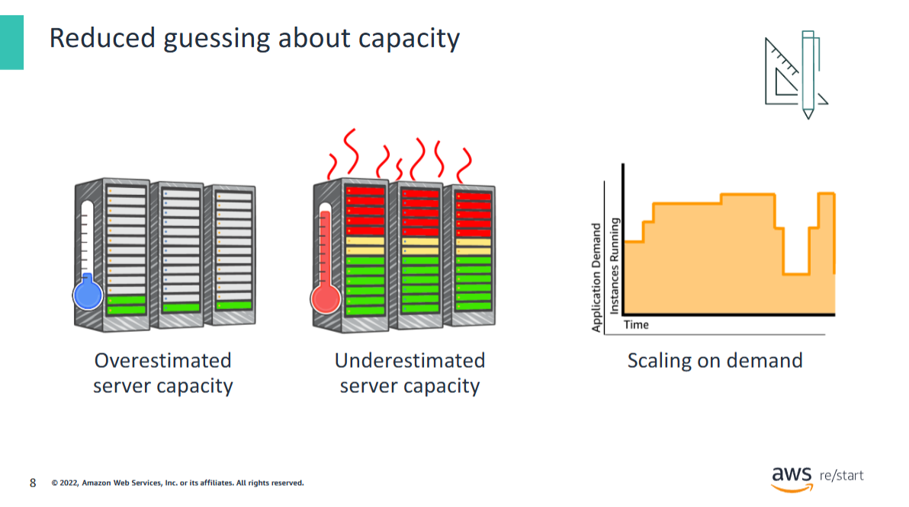

Advantage 3: Reduce guessing about capacity.

You can reduce guessing about your infrastructure capacity needs. When you make a capacity decision before you deploy an application, you often have either expensive idle resources or insufficient capacity. Cloud computing reduces these problems. You can access as many or as few resources as you need, and you can scale up and down as required with only a few minutes’ notice.

## Guessing about capacity
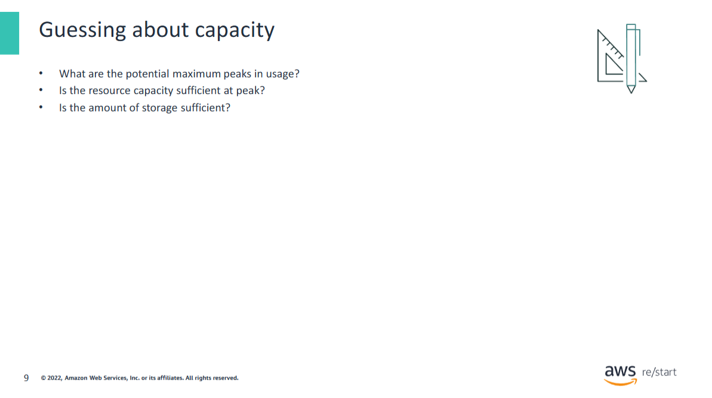

Before cloud computing, you needed to guess how many resources would be required to accommodate maximum usage peaks. That method also assumed that you could accurately predict the usage peaks and whether the resource capacity and amount of storage would be sufficient. When you guess, you are likely to buy either too much or too little. If you buy too much, you waste money. If you buy too little, you have downtime.

## Increased speed and agility
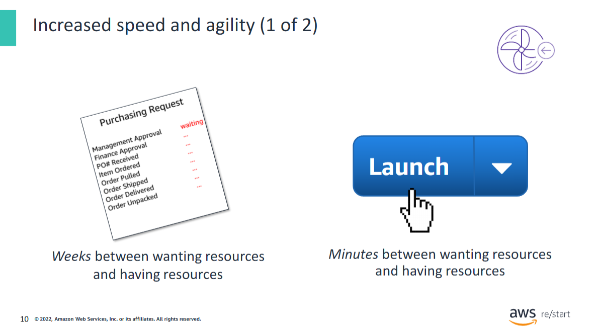

Advantage 4: Increase your speed and agility.

In a cloud computing environment, new IT resources are only a click away. Thus, you reduce the time that it takes to make those resources available to your developers from weeks to minutes. The result is a dramatic increase in agility for the organization. The cost and time that you need to experiment and develop aremuch lower.

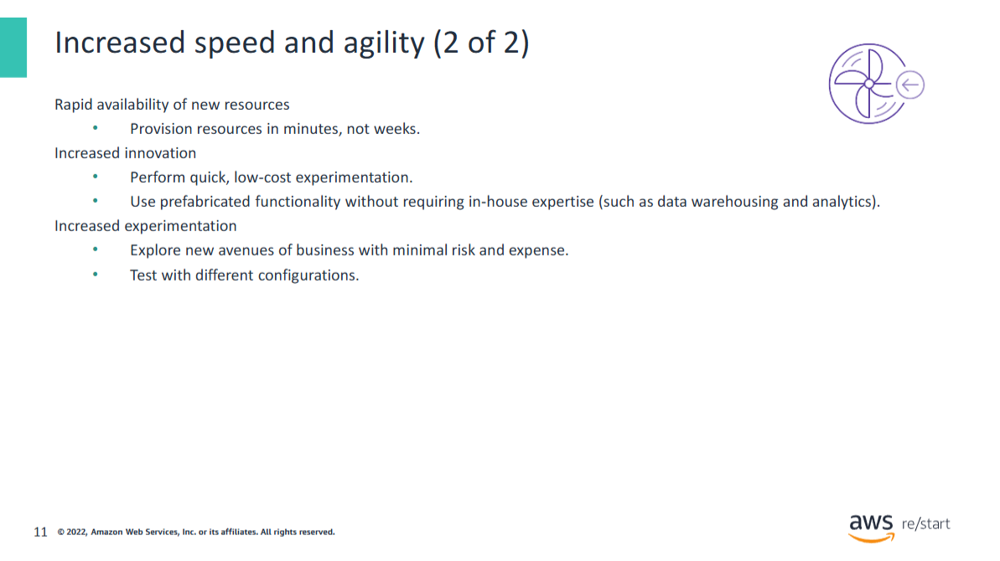

Cloud services provide **global reach** and the **rapid availability of new resources**. You can quickly change or scale your technology in **minutes**, not weeks.

**Organizational agility** is a core differentiator in today’s rapidly changing business environment. For organizations to succeed in a constantly changing world, they must improve their ability to **change and adapt**.

You can safely **experiment with new ideas** and encourage **innovation at a low cost**. You can use **prefabricated functionality** without requiring in-house expertise, such as **data warehousing** and **analytics**.

You might even find success with ideas that weren’t feasible in the past because of **hardware or budget constraints**. You can explore new avenues of business with minimal risk and expense, and you can **test with different configurations**.

## No more expenses for running and maintaining data centers
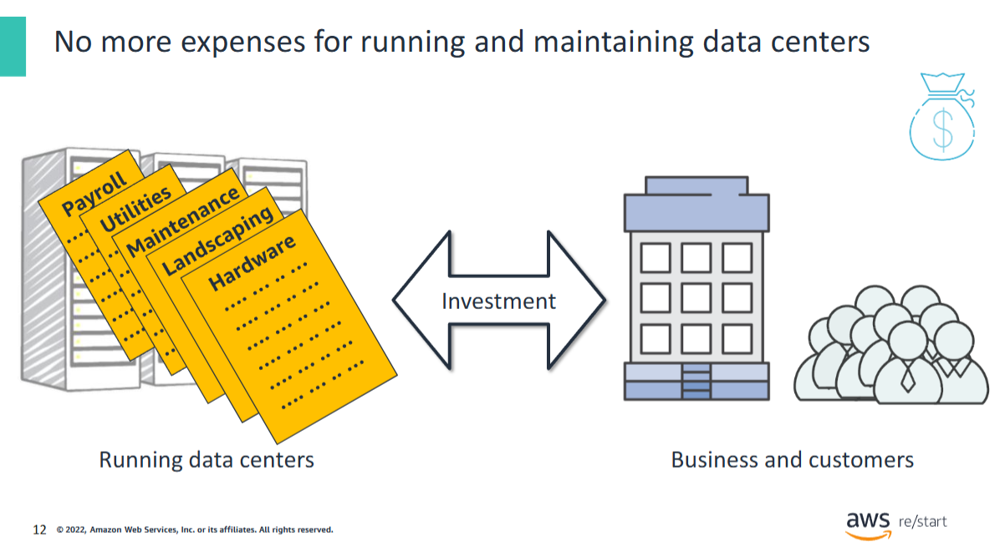

Advantage 5: Stop spending money on running and maintaining data centers.

Running and maintaining data centers is expensive and time consuming. Focus on projects that differentiate your business instead of focusing on the infrastructure. With cloud computing, you can focus on your customers instead of focusing on the tasks of racking, stacking, and powering servers.

## No more expenses for data centers
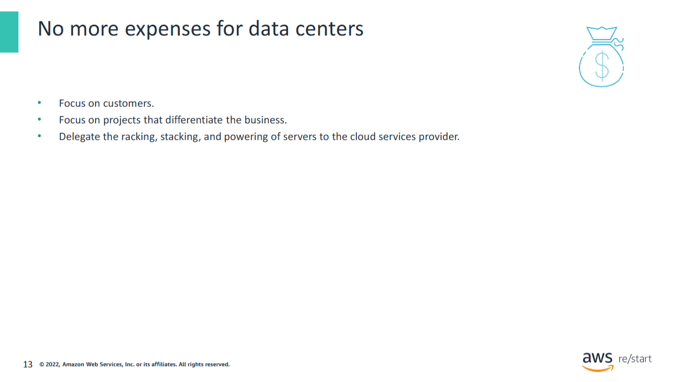

Cloud computing frees you to focus on your customers and your core business—what you are good at—instead of focusing on managing infrastructure.

## Going global in minutes
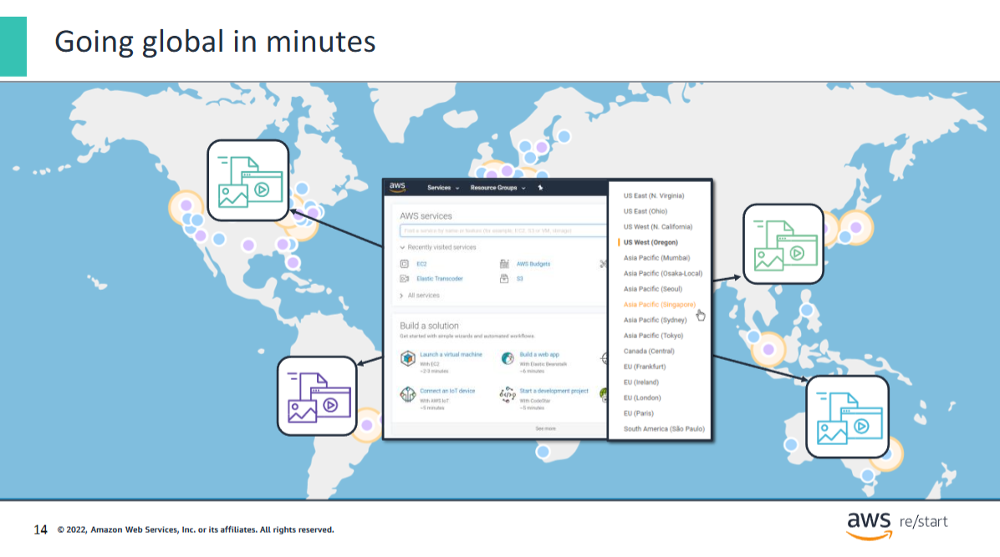

**Advantage 6: Go global in minutes.**  
You can deploy your application in multiple AWS Regions around the world with a few clicks. As a result, you can provide a lower latency and better experience for your customers and at minimal cost.

For more information about specific locations, see the [Global Infrastructure page](https://aws.amazon.com/about-aws/global-infrastructure/).

## Research activity
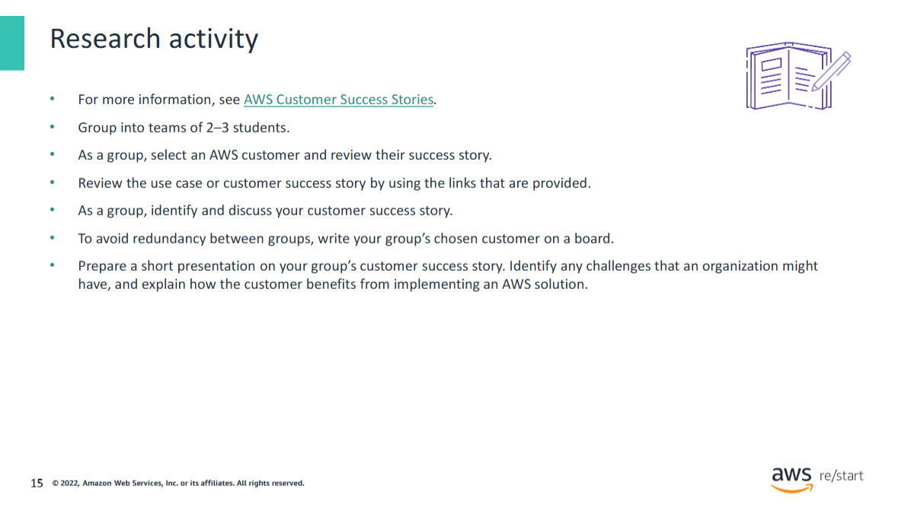

## Overview of the Activity

In this group activity, you prepare a short presentation on a company that moved to AWS.

For more information about AWS customer success stories, see:  
[https://aws.amazon.com/solutions/case-studies/](https://aws.amazon.com/solutions/case-studies/)

#### Task

Choose a business, read a customer story, and prepare a short presentation.  
Include the following in your presentation:
- Who is the customer?
- What was their reason for moving to AWS?
- How did the move to AWS benefit their organization?

#### Directions

- Group into teams of **2–3 students**.
- As a group, **select an AWS customer** and review their success story.
- Review the use case or customer success story by using the links that are provided.
- Identify and discuss your **customer success story** as a group.
- To avoid redundancy between groups, **write your group’s chosen customer on a board**.
- **Prepare a presentation** on your group’s customer success story.
    - Identify any **challenges** that the organization might have had.
    - Explain how the customer **benefited from implementing an AWS solution**.

## Key takeaways
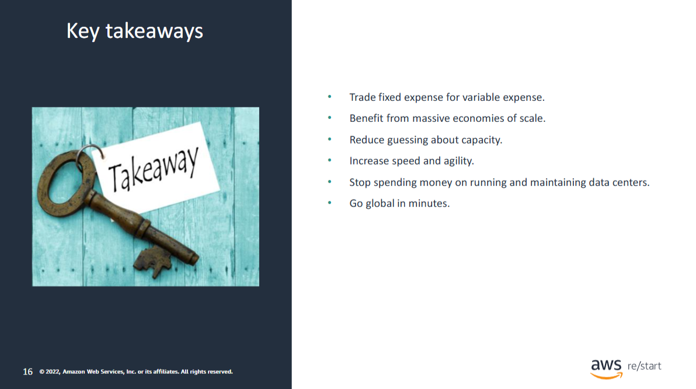

The key takeaways from this module are the **six advantages of cloud computing**:

- **Trade fixed expense for variable expense**
- **Benefit from massive economies of scale**
- **Reduce guessing about capacity**
- **Increase speed and agility**
- **Stop spending money on running and maintaining data centers**
- **Go global in minutes**