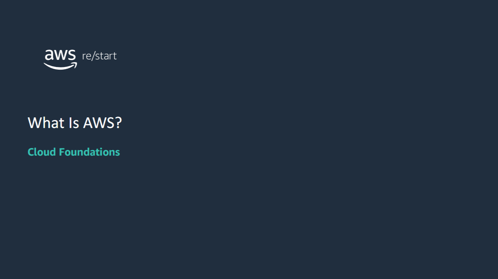

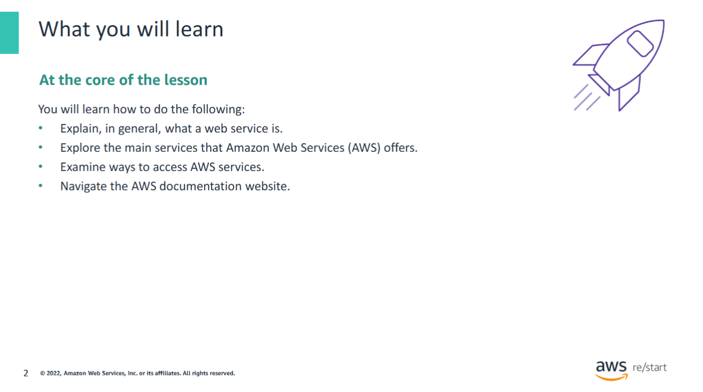

## Web services

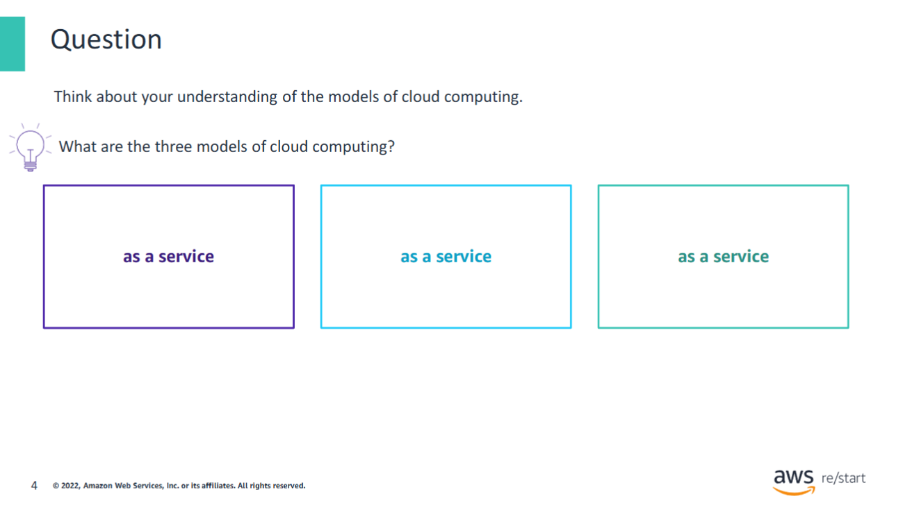

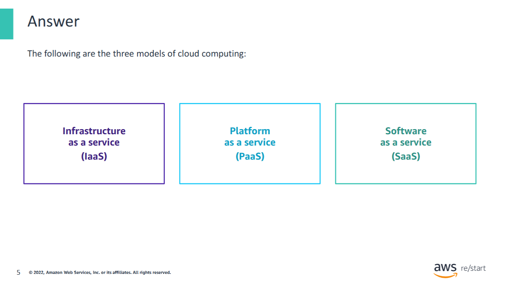

AWS offers three different models of cloud services: **Infrastructure as a Service (IaaS)**, **Platform as a Service (PaaS)**, and **Software as a Service (SaaS)**. All of these services are on the **AWS Cloud**.

With **IaaS**, you manage the server, which can be physical or virtual, and the operating system (**Microsoft Windows** or **Linux**). In general, the data center provider has no access to your server.

Basic building blocks for cloud IT include the following:
- **Networking features**
- **Compute**
- **Data storage space**

With **PaaS**, someone else manages the underlying hardware and operating systems. Thus, you can run applications without managing underlying infrastructure (patching, updates, maintenance, hardware, and operating systems). **PaaS** also provides a framework for developers that they can build on to create customized applications.

With SaaS, you manage your files, and the service provider manages all data centers, servers, networks, storage, maintenance, and patching. Your concern is only the software and how you want to use it. You are provided with a complete product that the service provider runs and manages. Facebook and Dropbox are examples of SaaS. You manage your Facebook contacts and Dropbox files, and the service providers manage the systems.

## Comparison: On-premises and AWS infrastructure
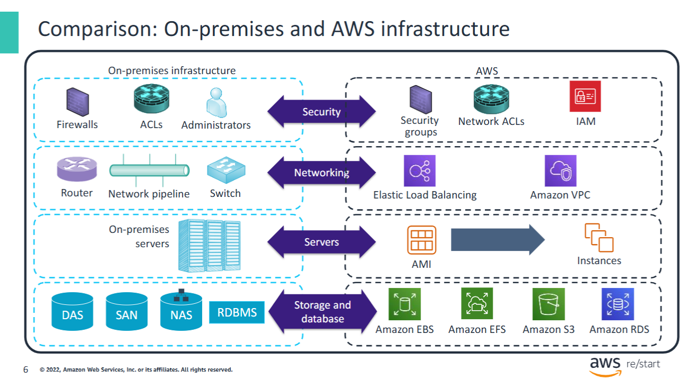

Many AWS services have analogs in the traditional IT space and terminology. This side-by-side comparison shows how AWS products and services relate to a traditional infrastructure. Almost everything that you might want to do with a traditional data center is available with AWS.

**Legend:**
- **Access control lists (ACLs)**
- **Amazon Elastic Block Store (Amazon EBS)**
- **Amazon Elastic File Store (Amazon EFS)**
- **Amazon Machine Image (AMI)**
- **Amazon Relational Database Service (Amazon RDS)**
- **Amazon Simple Storage Service (Amazon S3)**
- **Amazon Virtual Private Cloud (Amazon VPC)**
- **AWS Identity and Access Management (IAM)**
- **Direct-attached storage (DAS)**
- **Network access control lists (network ACLs)**
- **Network-attached storage (NAS)**
- **Relational database management system (RDBMS)**
- **Storage area network (SAN)**

## What are web services?
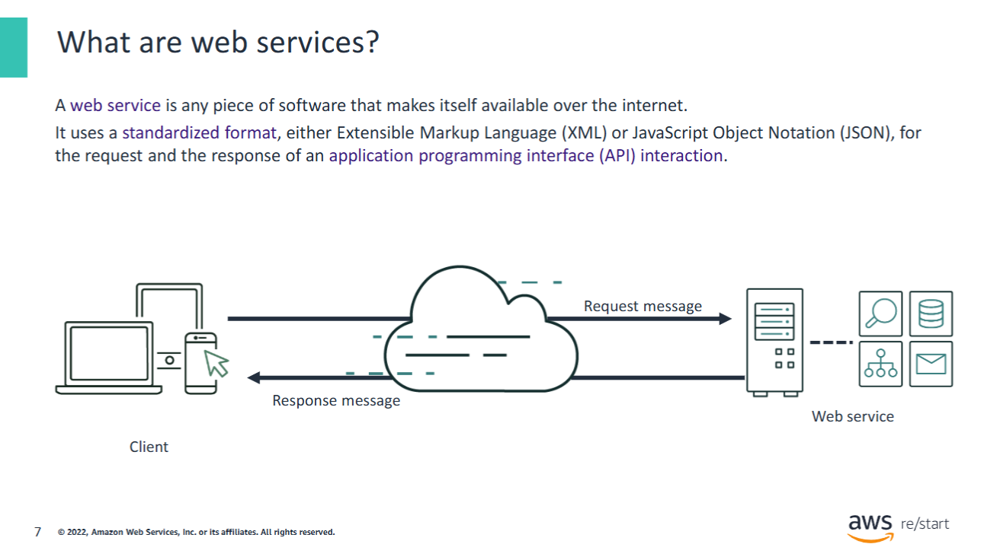

A **web service** is any piece of software that makes itself available over the internet or on private (intranet) networks.

A web service uses a **standardized format** for the request and the response of an **application programming interface (API)** interaction. For example, formats such as:
- **Extensible Markup Language (XML)**
- **JavaScript Object Notation (JSON)**

It’s not tied to any one **operating system (OS)** or **programming language**.

A web service is:
- **Self-describing** through an interface definition file
- **Discoverable**

## Definition of AWS
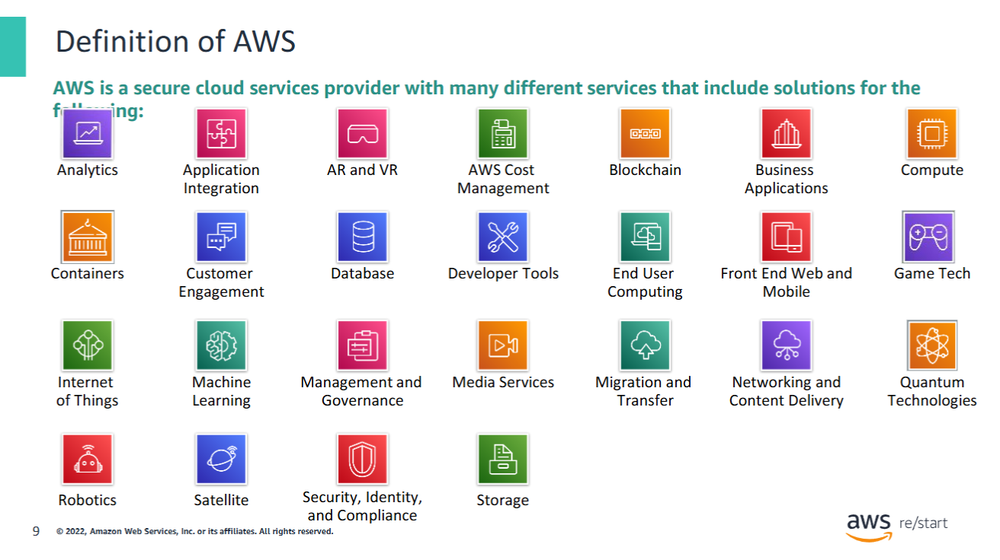

AWS is a **secure cloud services provider** with many services to help businesses **scale and grow**. These products are delivered over the internet. As a result, you have **on-demand access** to the compute, storage, network, database, and other IT resources that you might need for your projects. You also have the tools to manage them.

AWS services are in different **categories**, and each category contains one or more services. You can select the services that you want from these different categories to **build your solutions**.

**Legend:**
- **Augmented reality (AR)**
- **Virtual reality (VR)**

## Easy solution example
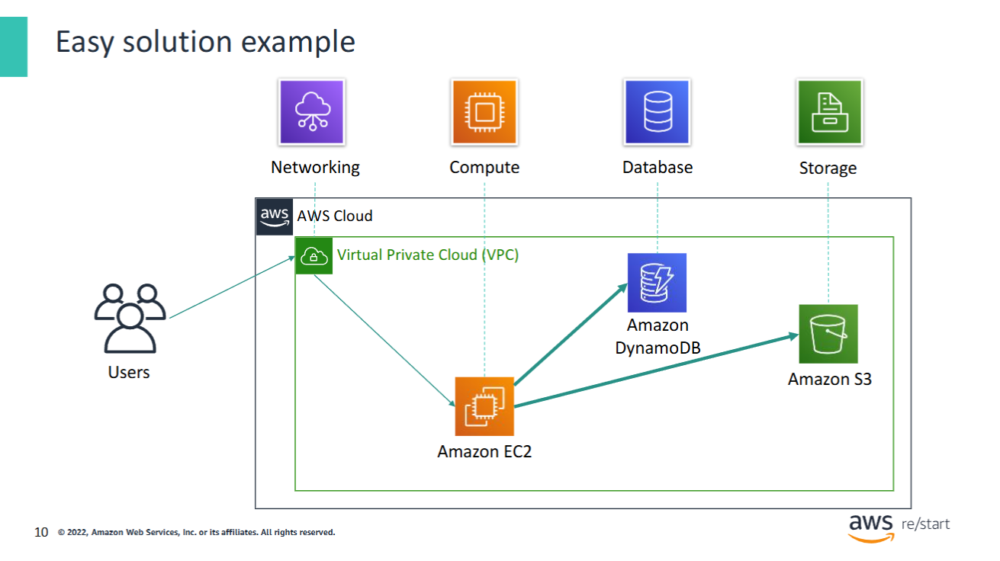

For example, suppose that you’re building a **database application**.

Your customers might send data to your **Amazon Elastic Compute Cloud (Amazon EC2)** instances, which is a service in the **Compute** category. These **EC2** servers batch the data in 1-minute increments. They add an object per customer to **Amazon Simple Storage Service (Amazon S3)**, the **AWS storage service** that you chose to use.

You can then use a **nonrelational database**—such as **Amazon DynamoDB**—to power your application. You can use it to build an **index** to find all the objects from a given customer that were collected over a certain time period.

You might decide to run these services inside **Amazon Virtual Private Cloud (Amazon VPC)**, which is a service in the **Networking** category.

This example illustrates that you can select **web services from different categories** and use them together to build a solution.  
(In this case, the solution is a **database application**.) However, the solutions that you build can also be quite **complex**.

## Choosing a service
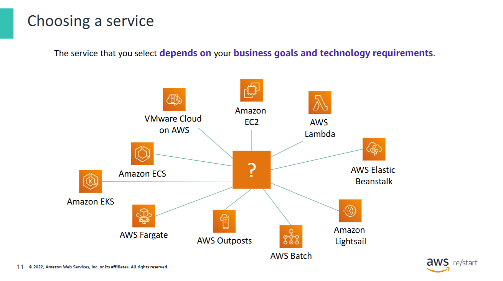

The service that you choose to use will depend on your **business goals** and **technology requirements**.

In the previous example, the solution used **Amazon EC2** as the compute service. However, Amazon EC2 is only one of many **compute services** that AWS offers.

The following list contains some other **AWS Compute offerings** that you might choose to use for the example use cases:

- **[Amazon EC2](https://aws.amazon.com/ec2/)**  
  You want complete control over your AWS computing resources.

- **[AWS Lambda](https://aws.amazon.com/lambda/)**  
  You want to run your code and not manage or provision servers.

- **[AWS Elastic Beanstalk](https://aws.amazon.com/elasticbeanstalk/)**  
  You want a service that deploys, manages, and scales your web applications for you.

- **[Amazon Lightsail](https://aws.amazon.com/lightsail/)**  
  You need a lightweight cloud platform for an easy web application.

- **[AWS Batch](https://aws.amazon.com/batch/)**  
  You must run hundreds of thousands of batch workloads.

- **[AWS Outposts](https://aws.amazon.com/outposts/)**  
  You want to run AWS infrastructure in your on-premises data center.

- **[Amazon Elastic Container Service (Amazon ECS)](https://aws.amazon.com/ecs/)**,  
  **[Amazon Elastic Kubernetes Service (Amazon EKS)](https://aws.amazon.com/eks/)**, or  
  **[AWS Fargate](https://aws.amazon.com/fargate/)**  
  You want to implement a containers or microservices architecture.

- **[VMware Cloud on AWS](https://aws.amazon.com/vmware/)**  
  You have an on-premises server virtualization platform that you want to migrate to AWS.

Similarly, you can choose from various services in the other categories, and the number of offerings continues to grow.

## Commonly used services
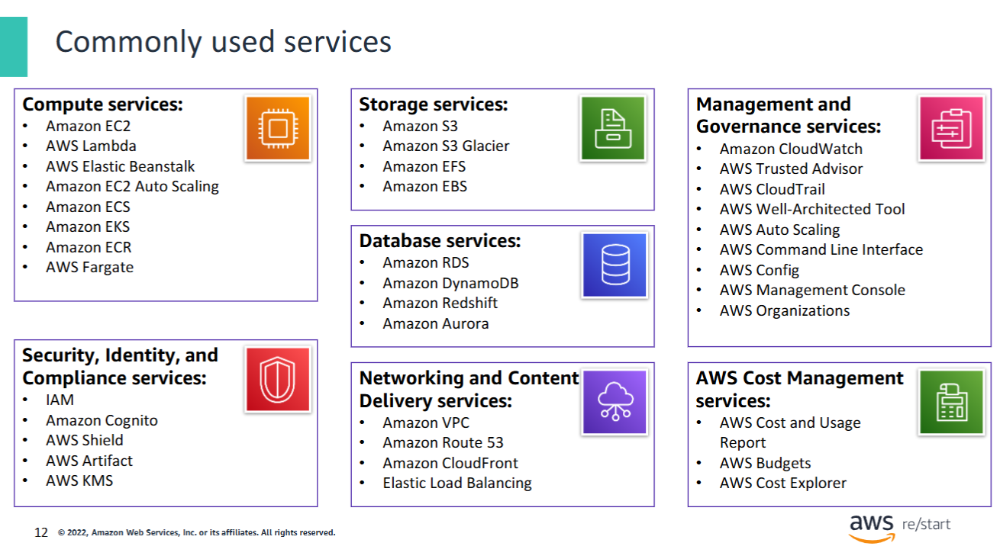

The array of **AWS services** can be intimidating as you start your journey into the cloud. This course focuses on some of the more **common services** in specified categories.

The **service categories** include:
- **Compute**
- **Storage**
- **Database**
- **Networking and Content Delivery**
- **Security, Identity, and Compliance**
- **Management and Governance**
- **AWS Cost Management**

**Legend:**
- **Amazon Elastic Block Store (Amazon EBS)**
- **Amazon Elastic Compute Cloud (Amazon EC2)**
- **Amazon Elastic Container Registry (Amazon ECR)**
- **Amazon Elastic Container Service (Amazon ECS)**
- **Amazon Elastic File System (Amazon EFS)**
- **Amazon Elastic Kubernetes Service (Amazon EKS)**
- **Amazon Relational Database Service (Amazon RDS)**
- **Amazon Simple Storage Service (Amazon S3)**
- **Amazon Simple Storage Service Glacier**
- **Amazon Virtual Private Cloud (Amazon VPC)**
- **AWS Identity and Access Management (IAM)**
- **AWS Key Management Service (AWS KMS)**

## Three ways to interact with AWS
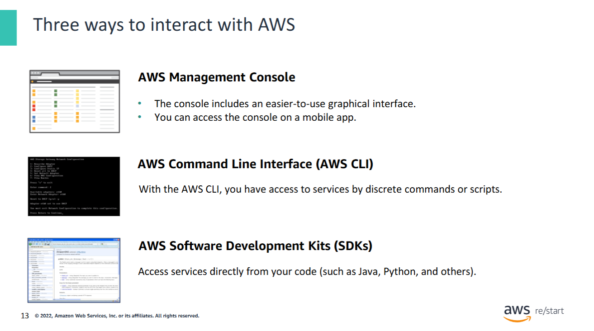

You might wonder how to access the broad array of services that AWS offers. You can create and manage resources on the **AWS Cloud** in three ways:

- **AWS Management Console**  
  The console provides a rich graphical interface to a majority of the features that AWS offers. (Occasionally, new features might not have all of their capabilities included in the console when the feature initially launches.)  
  For mobile access, you can use the **AWS Console Mobile App** to quickly view AWS resources anytime from anywhere.

- **AWS Command Line Interface (AWS CLI)**  
  The AWS CLI provides a suite of utilities that can be launched from a command script in **Linux**, **macOS**, or **Microsoft Windows**.

- **AWS Software Development Kits (SDKs)**  
  AWS provides packages that permit access to AWS in various popular programming languages. These packages facilitate the use of AWS in your existing applications.  
  You can also use them to create applications that deploy and monitor complex systems entirely through code.

**For more information, see the following links:**
- [AWS Console Mobile Application](https://aws.amazon.com/console/mobile/)
- [AWS CLI](https://docs.aws.amazon.com/cli/latest/userguide/cli-chap-welcome.html)
- [Tools to Build on AWS](https://aws.amazon.com/tools/)
- [Amazon API Gateway](https://docs.aws.amazon.com/apigateway/latest/developerguide/welcome.html)

## AWS Cloud Adoption Framework (AWS CAF)
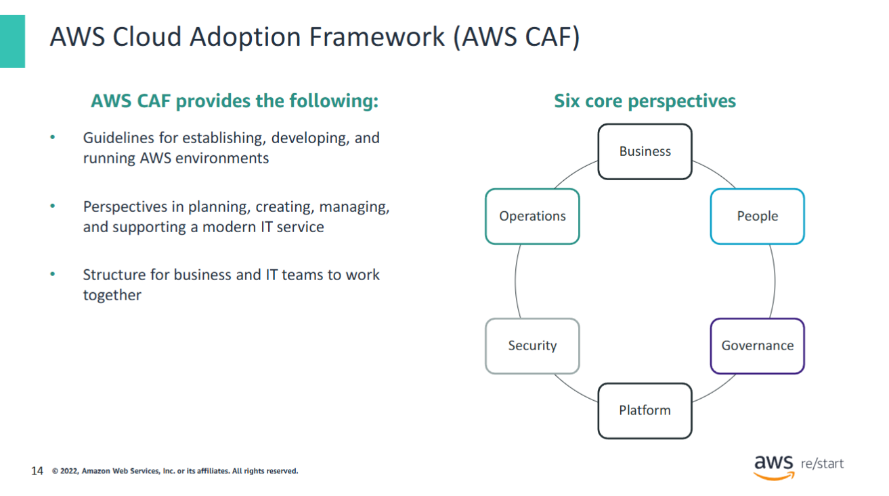

Each organization’s cloud adoption journey is unique. However, for any organization to successfully migrate its IT portfolio to the cloud, three elements—**people**, **process**, and **technology**—must be in alignment.

The **AWS Cloud Adoption Framework (AWS CAF)** helps organizations develop efficient and effective plans for their cloud adoption journey.

The guidance and best practices from the framework help you build a **comprehensive approach to cloud computing** across your organization and throughout your IT lifecycle. These guidelines help each unit in your organization update skills, adapt existing processes, and introduce new processes. In this way, you can take maximum advantage of the services that cloud computing provides.

The **AWS CAF** breaks down the complex process of planning a move to the cloud into manageable pieces that are called **perspectives**.  
**Perspectives** represent essential areas of focus that span people, processes, and technology.

- The **business**, **people**, and **governance** perspectives focus on **business capabilities**.
- The **platform**, **security**, and **operations** perspectives focus on **technical capabilities**.

For more information about the AWS CAF, see  
[An Overview of the AWS Cloud Adoption Framework (PDF)](http://d0.awsstatic.com/whitepapers/aws_cloud_adoption_framework.pdf)

## AWS documentation
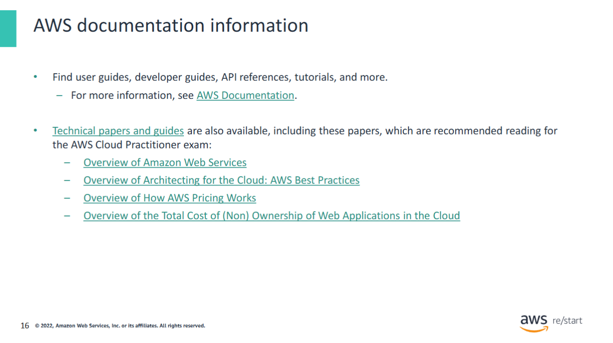

AWS provides **extensive and detailed documentation** for each AWS service. Guides and **application programming interface (API)** references are organized by service category.

AWS also offers **general resources and tutorials** that can be accessed from the AWS documentation pages. General resources include:
- **Case studies**
- An **A–Z glossary** of AWS terms
- **Technical papers**
- **FAQs**
- Information about **AWS Training and Certification**
- And more

Also, each **SDK and toolkit** has documentation, including:
- The **AWS Command Line Interface (AWS CLI)**
- The **AWS SDK for Python (Boto)**
- And many others

**AWS technical papers and guides** can be filtered by product, category, or industry so that you can find the information that’s most relevant to your needs.

## Key Takeaways
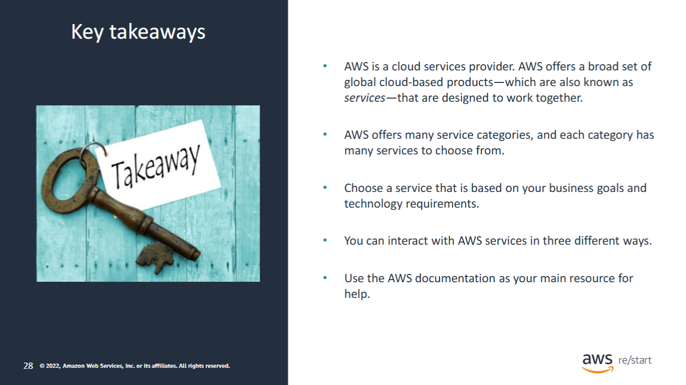

- **AWS is a cloud services provider.**  
  AWS offers a broad set of global cloud-based products—which are called **services**—that are designed to work together.

- **Many categories of AWS services** are available, and each category has many services to choose from.

- **Choose a service** based on your **business goals** and **technology requirements**.

- **You can interact with AWS services in three different ways.**

- **Use the AWS documentation** as your main resource for help.
