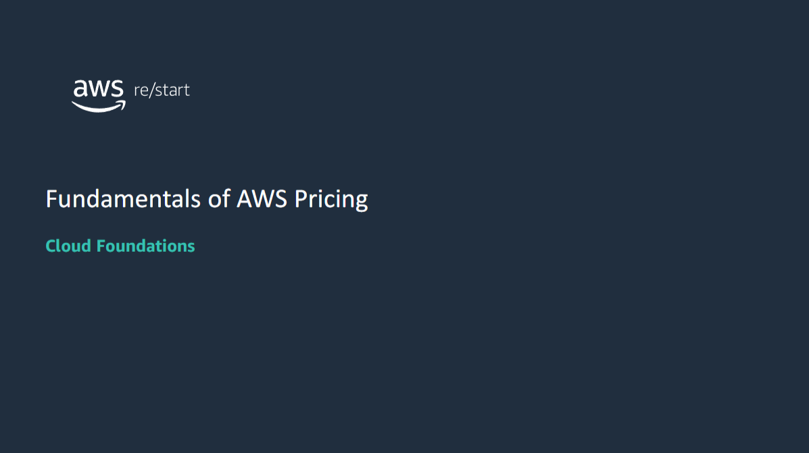

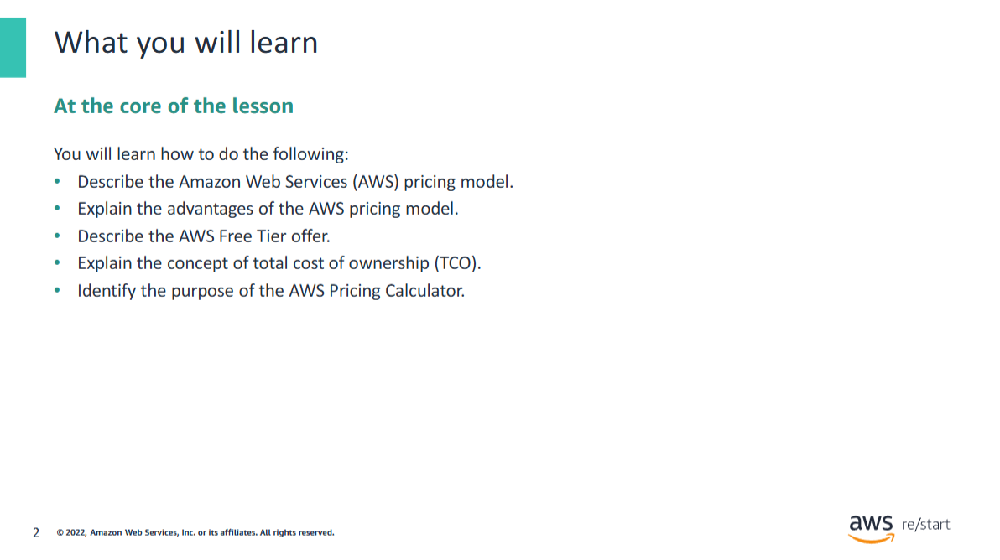

## AWS pricing model
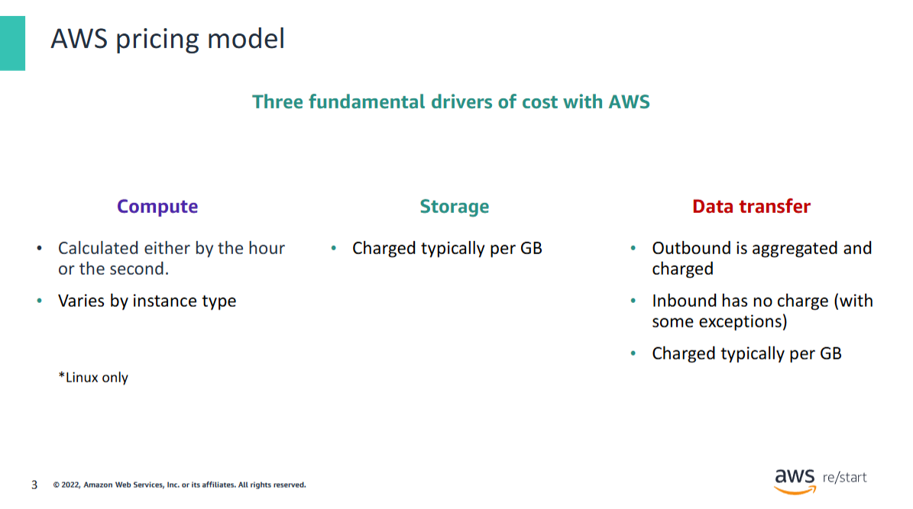

AWS has **three fundamental drivers of cost**:
- **Compute**
- **Storage**
- **Outbound data transfer**

These characteristics vary somewhat depending on the **AWS offering** and **pricing model** that you choose.

In most cases, you won’t be charged for:
- **Inbound data transfer**
- **Data transfer between other AWS services in the same AWS Region**

> ⚠️ Some exceptions exist, so be sure to **verify data transfer rates** before you begin to use the AWS service.

**Outbound data transfer** is aggregated across services and then charged at the **outbound data transfer rate**.  
This charge appears on the monthly statement as **AWS Data Transfer Out**.

## How do you pay for AWS?
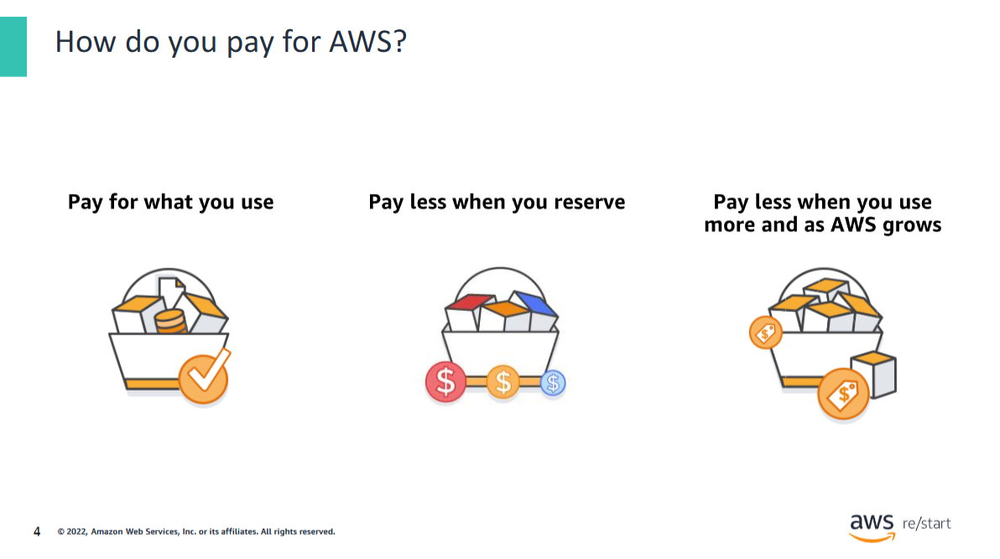

This philosophy is what underlies **AWS pricing**. Although the number and types of services that AWS offers have increased dramatically, the **philosophy on pricing has not changed**.

At the end of each month, you **pay for what you use**. You can start or stop using a product at any time. **No long-term contracts are required.**

AWS offers a range of **cloud computing services**. For each service, you pay for **exactly the amount of resources** that you actually need.  
This **utility-style pricing model** includes:

- **Pay for what you use**
- **Pay less when you reserve**
- **Pay less when you use more**
- **Pay even less as AWS grows**

You now take a closer look at these core concepts of pricing.

For more information about AWS pricing, see:  
[How AWS Pricing Works (PDF)](https://d0.awsstatic.com/whitepapers/aws_pricing_overview.pdf)

## Pay for what you use
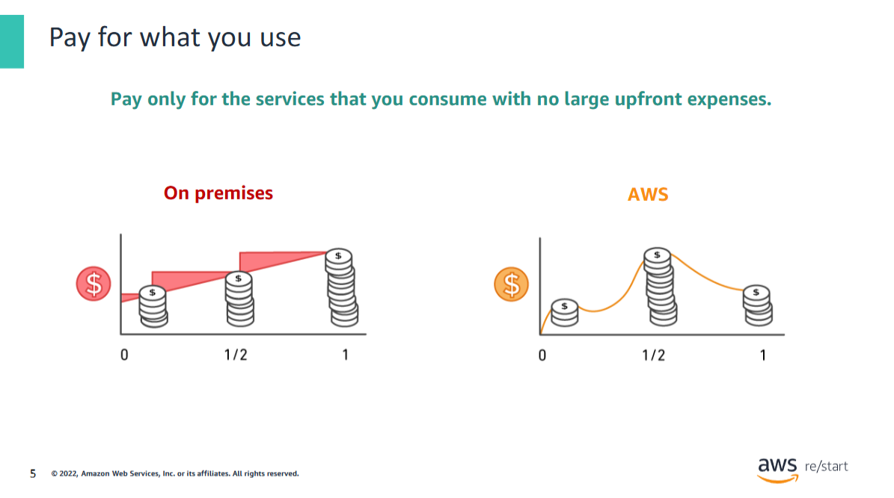

Unless you build data centers for a living, you might have spent too much time and money building them.

With **AWS**, you **pay only for the services that you consume** with **no large upfront expenses**. You can **lower variable costs**.  
Thus, you no longer need to dedicate valuable resources to building costly infrastructure, including:
- Purchasing servers
- Buying software licenses
- Leasing facilities

Quickly **adapt to changing business needs** and redirect your focus on **innovation and invention**.

- **Pay only for what you use**
- **Pay only for as long as you need it**

All AWS services are:
- **Available on demand**
- **Require no long-term contracts**
- **Have no complex licensing dependencies**

## Pay less when you reserve
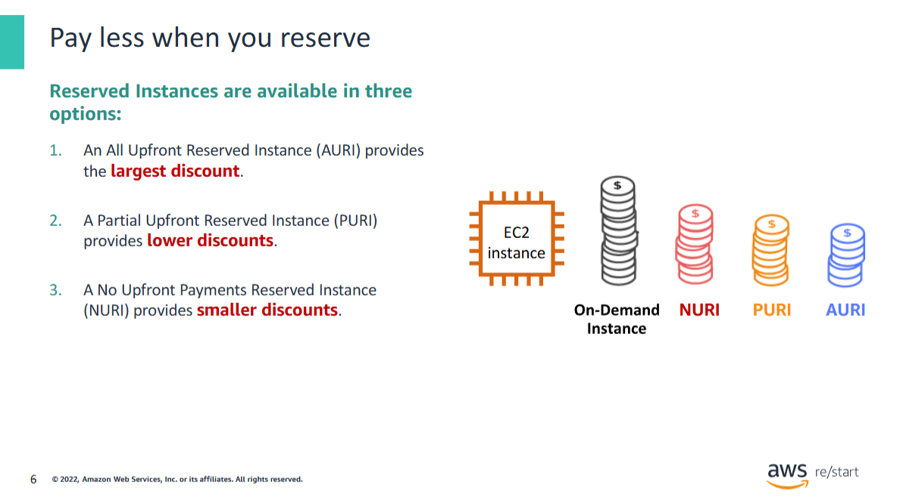

For certain services like **Amazon Elastic Compute Cloud (Amazon EC2)** and **Amazon Relational Database Service (Amazon RDS)**, you can invest in **reserved capacity**.

With **Reserved Instances**, you can **save significantly** over equivalent on-demand capacity. Reserved Instances are available in three options:

- **All Upfront Reserved Instance (AURI)**
- **Partial Upfront Reserved Instance (PURI)**
- **No Upfront Payments Reserved Instance (NURI)**

When you buy Reserved Instances, you receive a greater discount when you make a larger **upfront payment**.

- To **maximize your savings**, you can pay **all upfront** and receive the **largest discount**.
- **PURIs** offer **lower discounts**, but allow you to spend **less upfront**.
- **NURIs** let you spend **nothing upfront** and receive a **smaller discount**, allowing you to keep capital available for other projects.

By using **reserved capacity**, your organization can:
- **Minimize risks**
- **More predictably manage budgets**
- **Comply with policies** that require longer-term commitments

## Pay less by using more
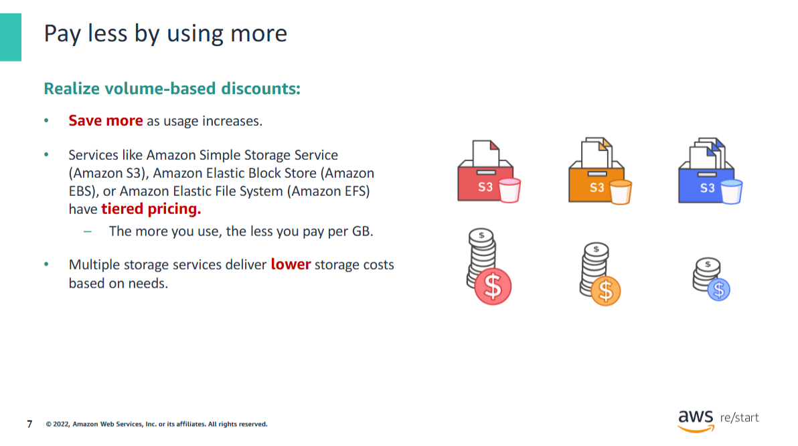

With **AWS**, you can get **volume-based discounts** and realize important savings as your usage increases.

For services like **Amazon Simple Storage Service (Amazon S3)**, **pricing is tiered**, which means that you **pay less per GB** when you use more.  
In addition:
- **Data transfer in** doesn’t incur charges.
- Multiple storage services deliver **lower storage costs** based on your needs.

Thus, as your **AWS usage needs increase**, you benefit from the **economies of scale** so that you can increase adoption and keep costs under control.

As your organization evolves, AWS also gives you **options to acquire services** that help you address your business needs.

For example, the **AWS storage services portfolio** offers options to help you **lower pricing**.  
These options are based on:
- How **frequently** you access data
- The **performance** you need to retrieve it

To optimize your savings, you can choose the **right combination of storage solutions** that help you:
- **Reduce costs**
- While preserving **performance**, **security**, and **durability**

## Pay less as AWS grows
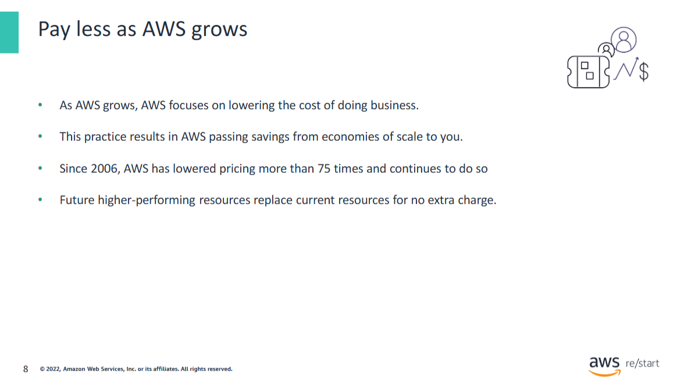

AWS constantly focuses on:

- **Reducing data center hardware costs**
- **Improving operational efficiencies**
- **Lowering power consumption**
- Generally **lowering the cost of doing business**

These optimizations and the substantial and growing **economies of scale** of AWS result in passing savings back to you as **lower pricing**.

Since **2006**, AWS has **lowered pricing more than 75 times**—and continues to do so.

Another benefit of AWS growth is that **future, higher-performing resources** replace current ones **for no extra charge**.

## Custom pricing
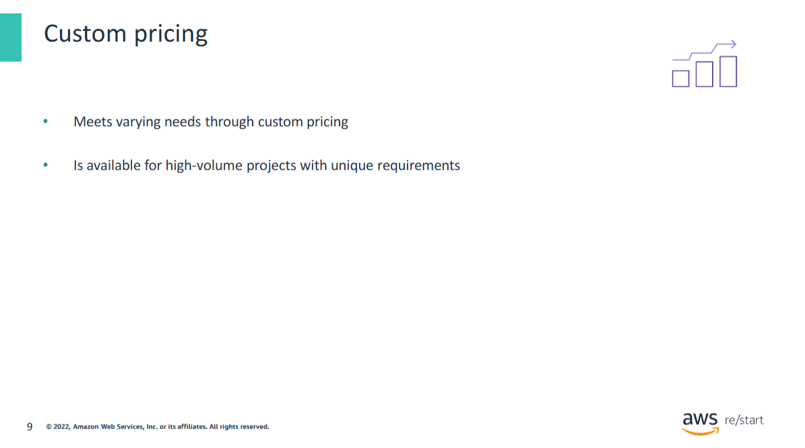

AWS realizes that every customer has different needs. If none of the AWS pricing models work for your project, custom pricing is available for high-volume projects with unique requirements.

## AWS Free Tier
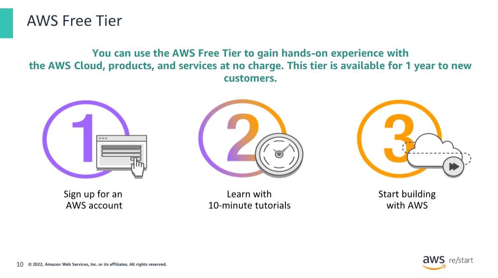

To help **new AWS customers** get started in the cloud, AWS offers a **free usage tier** (the **AWS Free Tier**) for new customers for up to **1 year**.

The **AWS Free Tier** applies to certain services and options.  
If you are a new AWS customer, you can:

- Run a **free Amazon Elastic Compute Cloud (Amazon EC2) T2 micro instance** for a year
- Use a free usage tier for:
    - **Amazon S3**
    - **Amazon EBS**
    - **Elastic Load Balancing**
    - **AWS data transfer**
    - And other **AWS services**

For more information, see the  
[AWS Free Tier website](https://aws.amazon.com/free/?all-free-tier.sort-by=item.additionalFields.SortRank&all-free-tier.sort-order=asc&awsf.Free%20Tier%20Types=*all&awsf.Free%20Tier%20Categories=*all)

## Services with no charge
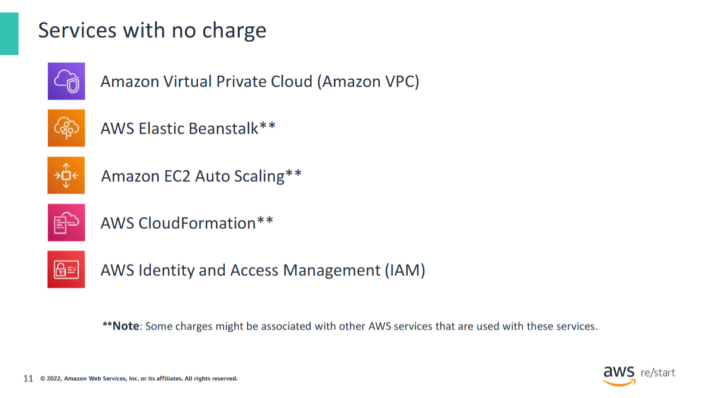

AWS also offers a variety of **services and features for no additional charge**. This slide includes some of them:

- **Amazon Virtual Private Cloud (Amazon VPC)**  
  You can provision a logically isolated section of the AWS Cloud where you can launch AWS resources in a virtual network that you define.

- **AWS Identity and Access Management (IAM)**  
  You can use this service to control your users’ access to AWS services and resources.

- **Consolidated Billing**  
  You can use this billing feature in the **AWS Organizations** service to consolidate payment for multiple AWS accounts.  
  Consolidated Billing provides the following:
  - One bill for multiple accounts
  - The ability to track each account’s charges
  - The opportunity to decrease charges because of volume pricing discounts from combined usage
  - The ability to consolidate all of your accounts and get tiered benefits

- **AWS Elastic Beanstalk**  
  With this service, you can quickly deploy and manage applications in the AWS Cloud.

- **AWS CloudFormation**  
  Developers and systems administrators can use this service to create a collection of related AWS resources and provision them in an orderly and predictable fashion.

- **Amazon EC2 Auto Scaling**  
  This service automatically adds or removes resources according to conditions that you define.  
  The resources that you are using increase seamlessly during demand spikes to maintain performance and decrease automatically during demand lulls to minimize costs.

- **AWS OpsWorks**  
  You can use this application management service to deploy and operate applications of all shapes and sizes.

> ⚠️ Though these services do not incur any charge, **other charges might be associated with AWS services** used alongside them.  
> For example, when you automatically scale additional EC2 instances, you will be **charged for those instances**.

## AWS Pricing Calculator
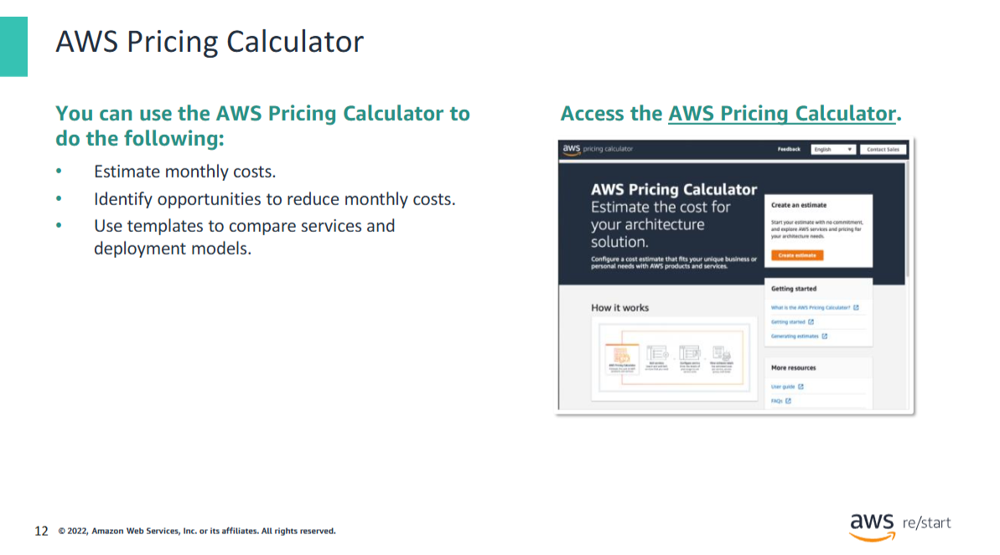

The **AWS Pricing Calculator** can help you **estimate a monthly AWS bill**.  
Using this tool, you can add, modify, and remove services from your bill. It will **recalculate the estimated monthly charges automatically**.

The calculator incorporates a wide array of **pricing calculations** across all services in all Regions.  
It also shows a **breakdown of features** for each service in each Region.

The **AWS Pricing Calculator** is a tool that helps you with the following:

- **Estimate AWS monthly services costs**
- **Identify opportunities for cost reduction**
- **Use templates to model solutions** to compare services and deployment models

The calculator also shows **common customer samples and usage**.  
For example, you can choose:
- **Disaster Recovery and Backup**
- **Web Application**

...to access sample data and uses for each service.

For more information and to start using the calculator, see the  
[AWS Pricing Calculator website](https://calculator.aws/#/)

## Total cost of ownership
### On-premises infrastructure versus the cloud
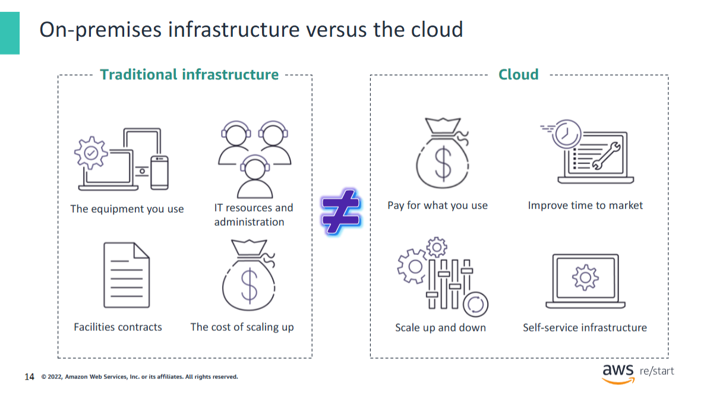

Many businesses choose between an **on-premises (traditional)** and a **cloud infrastructure**.  
The difference between these two options is **how they are deployed**.

#### On-Premises Infrastructure

- Installed on a company’s computers and servers
- Involves several **fixed costs**, including:
  - Facilities
  - Hardware
  - Licenses
  - Maintenance staff
- **Scaling up** can be expensive and time-consuming
- **Scaling down** does not reduce fixed costs

#### Cloud Infrastructure

- Purchased from a **service provider**
- Customers **pay for what they use**
- **Costs are easy to estimate**

---

It is difficult to compare an **on-premises IT delivery model** with the **AWS Cloud**, because the two infrastructures are fundamentally different.

#### Key Differences

- **On-premises IT**:
  - Focus on **fixed costs**
  - **Long planning cycles**
  - **Multiple components** to buy, build, manage, and refresh over time

- **AWS Cloud**:
  - Focus on **flexibility**, **agility**
  - **Consumption-based costs**

---

#### How can you identify the best option?
> Consider your business goals, required flexibility, available resources, and long-term scalability needs.

### Total cost of ownership (TCO) defined
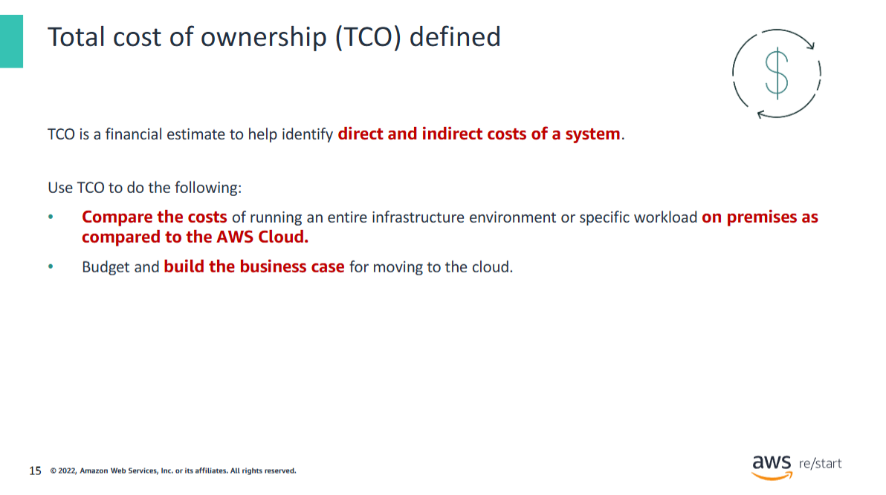

You can use the **Total Cost of Ownership (TCO)** to compare **on-premises** and **cloud solutions** and identify the best option.

**TCO** is a financial estimate that helps buyers and owners determine the **direct and indirect costs** of a product or system.  
It includes both the **cost of a service** and associated **expenses**.

### Example Use Case

Suppose that you run a specific **workload in an on-premises facility** and want to run the **same workload in the cloud**.  
You can use **TCO** to compare:

- The costs of running the workload on a **cloud infrastructure**
- Versus running it on an **on-premises (or colocation) infrastructure**

You can then use this **comparison** for:
- **Budgeting purposes**
- Building a **business case** for the optimal deployment solution

### TCO considerations
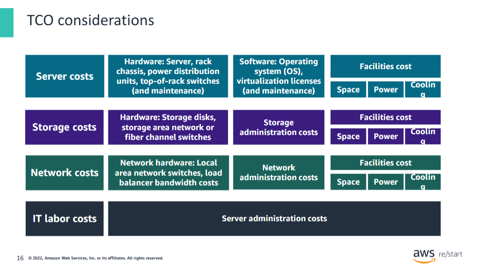

When you compare an **on-premises solution** and a **cloud solution**, it’s essential to assess the **actual costs** of both options.

#### Cloud Cost Considerations

With the **cloud**, most costs are **upfront and can be calculated**.  
Cloud providers offer **transparent pricing** based on different usage metrics such as:
- **RAM**
- **Storage**
- **Bandwidth**

Pricing is frequently **fixed per unit of time**.

After you understand how pricing works, you can **calculate costs** based on several different **usage estimates**.

---

#### On-Premises Technology Costs

With on-premises technology, **in-house costs** of running a server include:

##### Direct Costs:
- Power
- Floor space
- Storage
- IT operations to manage those resources

##### Indirect Costs:
- Network infrastructure
- Storage infrastructure

> 📝 The diagram referenced is an abbreviated list that demonstrates the **types of costs** involved in **data center maintenance**.  
> It doesn’t include every cost item.

Additional costs may include:

- **Software costs**, such as:
  - Database fees
  - Management tools
  - Middle-tier software

- **Facilities costs**, such as:
  - Upgrades
  - Maintenance
  - Building security
  - Taxes

- **IT labor costs**, such as:
  - Security
  - Application administration

---

#### Common Data Center Cost Categories

Some of the **costs associated with data center management** include:

- **Server costs** for hardware and software, and **facilities expenses** for equipment
- **Storage costs** for hardware, administration, and facilities
- **Network costs**, including hardware, administration, and facilities
- **IT labor costs** required to administer the solution

## Key takeaways
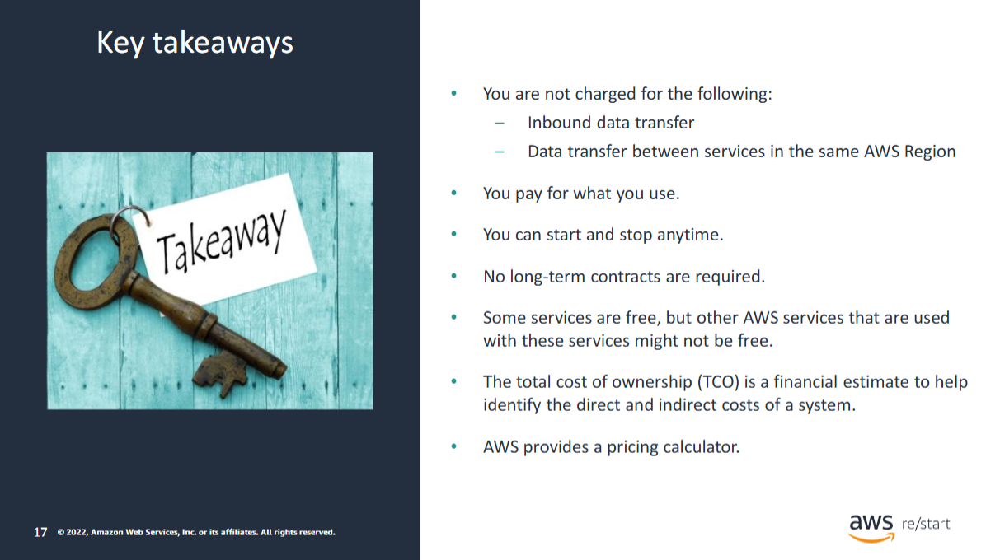

#### Summary

Though the **number and types of services** that AWS offers have increased, the **AWS philosophy on pricing** has **not changed**.

At the end of each month:
- You **pay only for what you use**
- You can **start or stop** using a product **at any time**
- **No long-term contracts** are required

#### Estimating Costs

The best way to estimate costs is to:
1. Examine the **fundamental characteristics** for each AWS service
2. Estimate your **usage** for each characteristic
3. Map that usage to the **prices posted on the website**

The **service pricing strategy** offers flexibility to:
- Choose the **services** that you need for each project
- Pay **only for what you use**

You can use the **[AWS Pricing Calculator](https://calculator.aws/#/)** to:
- Get AWS service **cost estimates**
- Evaluate the **total cost** of an AWS solution

---

#### AWS Services That Don’t Incur Charges

Some **AWS services and features** do not incur charges:

- **Amazon VPC**
- **AWS Elastic Beanstalk**
- **AWS CloudFormation**
- **IAM**
- **Amazon EC2 Auto Scaling**
- **AWS OpsWorks**
- **Consolidated Billing**

> ⚠️ Though these services themselves are free, the **resources they provision are not free**.

Additionally:
- You are **not charged for inbound data**
- You are **not charged for data transfer between services in the same Region**
- **Outbound data transfer** costs are **tiered**

---

#### Further Information

- [AWS Pricing](https://aws.amazon.com/pricing/)
- [AWS Pricing Overview (PDF)](https://d0.awsstatic.com/whitepapers/aws_pricing_overview.pdf)
