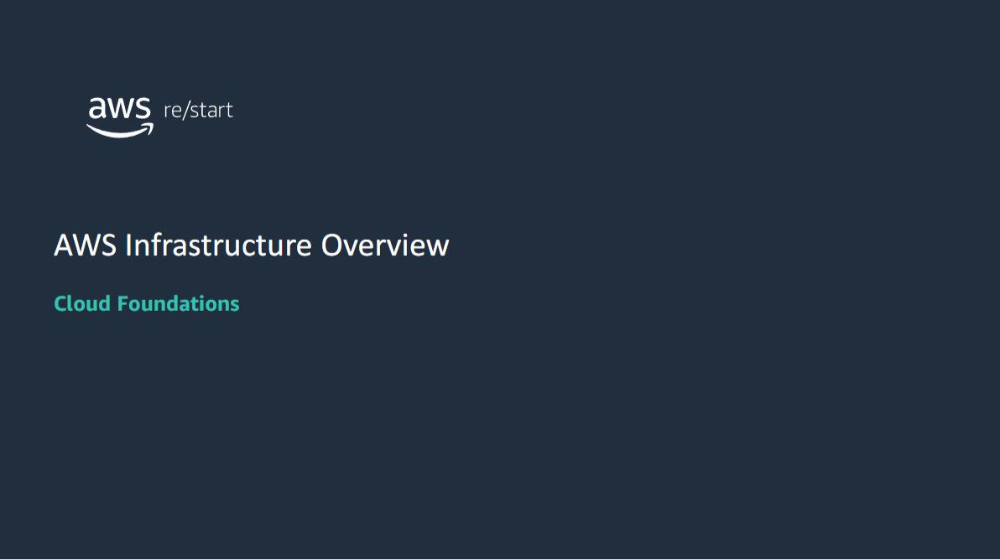

## Module Overview

In this module, you will review the **AWS Global Infrastructure** and its features.  
You will also learn how to identify the difference between:

- **Amazon Web Services (AWS) Regions**
- **Availability Zones**
- **Points of presence (PoPs)**

## AWS Global Infrastructure
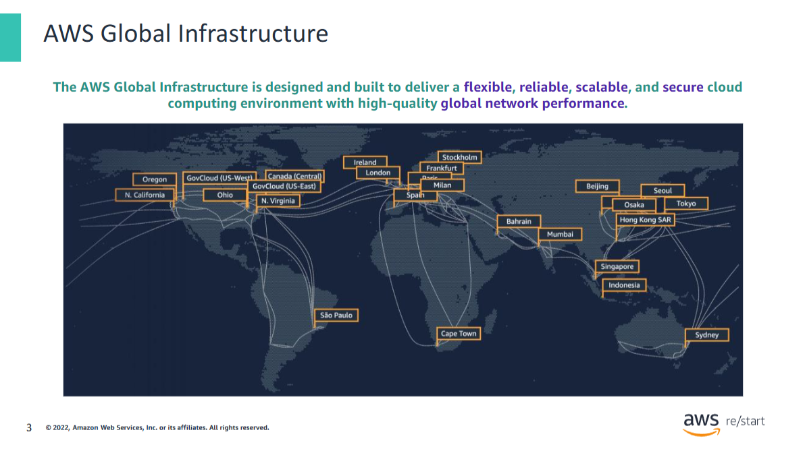

The diagram shows the **24 current AWS Regions** in addition to a few Regions that will become available soon (as of August 2020).

To learn more about the current AWS Regions, refer to the  
[Global Infrastructure page](https://aws.amazon.com/about-aws/global-infrastructure/?p=ngi&loc=0).

## AWS Global Infrastructure elements
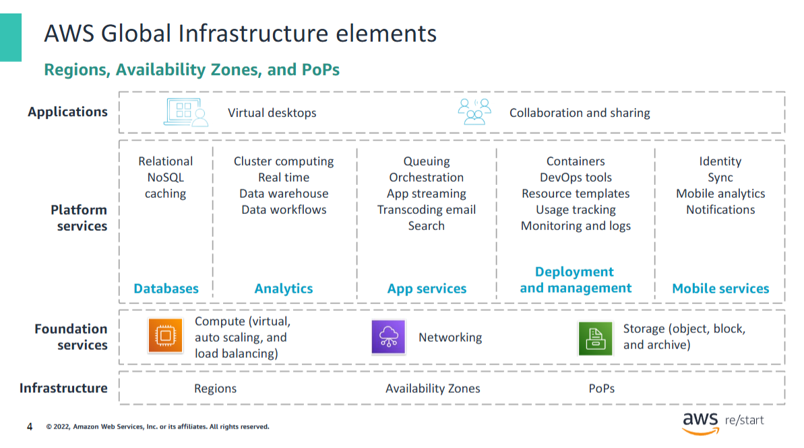

As discussed earlier, AWS provides a broad set of services, such as **compute**, **storage options**, **networking**, and **databases**.  
They are delivered as an **on-demand utility** that is available in seconds with **pay-as-you-go pricing**.

All these services reside on the **AWS Global Infrastructure**.

The **AWS Global Infrastructure** consists of three elements:
- **Regions**
- **Availability Zones**
- **Points of presence (PoPs)**

Next, you will take an in-depth look at the AWS Global Infrastructure and learn about these elements.

## AWS Global Infrastructure (cont.)
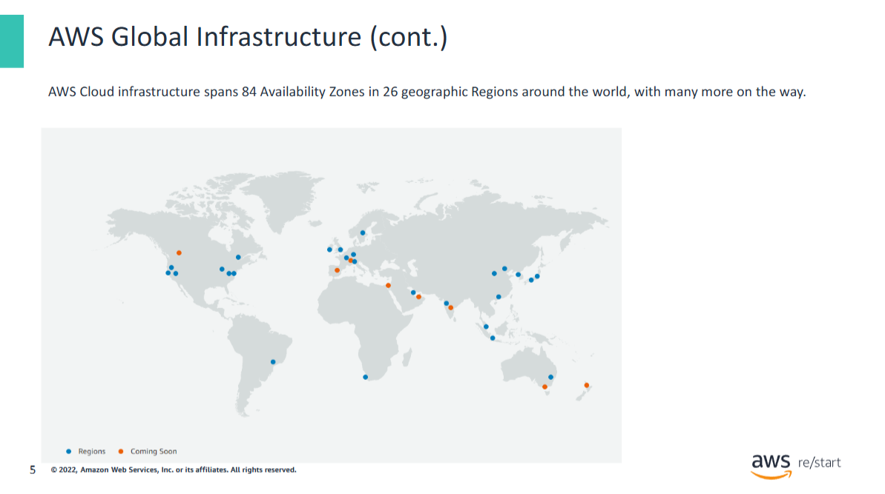

AWS offers:

- **7 Regions in North America**
- **1 Region in South America**
- **6 Regions in Europe**
- **1 Region in the Middle East**
- **1 Region in Africa**
- **10 Regions in the Asia Pacific**

Within each Region, there is **one or more Availability Zone**.

### Benefits of the AWS Global Infrastructure include:
- **Security**
- **Availability**
- **Performance**
- **A large global footprint**
- **Scalability**
- **Flexibility**

For more information, see:  
[Regions and Availability Zones](https://aws.amazon.com/about-aws/global-infrastructure/regions_az/?p=ngi&loc=2)

## AWS data centers
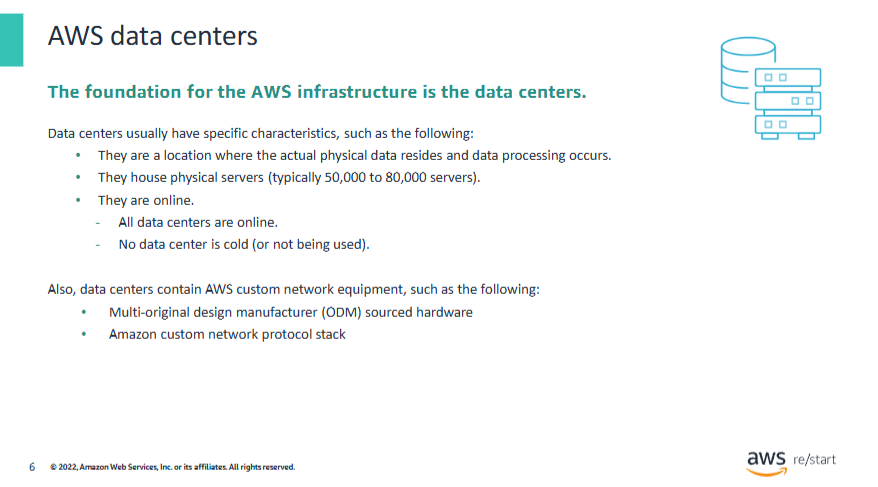

The foundation for the **AWS infrastructure** is the **data centers**.  
A **data center** is a location where the actual physical data resides and data processing occurs.

AWS data centers are built in **clusters in various global Regions**.

### AWS Data Center Design Considerations

- Each location is **carefully evaluated** to mitigate environmental risk.
- Data centers have a **redundant design** that anticipates and tolerates failure while maintaining service levels.
- To help ensure **availability**, critical system components are backed up across multiple **isolated locations** known as **Availability Zones**.
- To help ensure **capacity**, AWS continuously **monitors service usage** to deploy infrastructure that supports availability commitments and requirements.
- **Data center locations are not disclosed**, and **all access to them is restricted**.
- In case of failure, **automated processes** move customer data traffic away from the affected area.

A single data center typically houses **50,000 to 80,000 physical servers**.  
All AWS data centers are **online and serving customers** — no data center is cold.

AWS uses **custom, multi-ODM sourced network equipment**.  
An **original design manufacturer (ODM)** designs and manufactures products based on specifications from a second company.  
The second company then **rebrands the products for sale**.

For more information about AWS data center security, see the  
[AWS Data Centers page](https://aws.amazon.com/compliance/data-center/)

## AWS Availability Zones
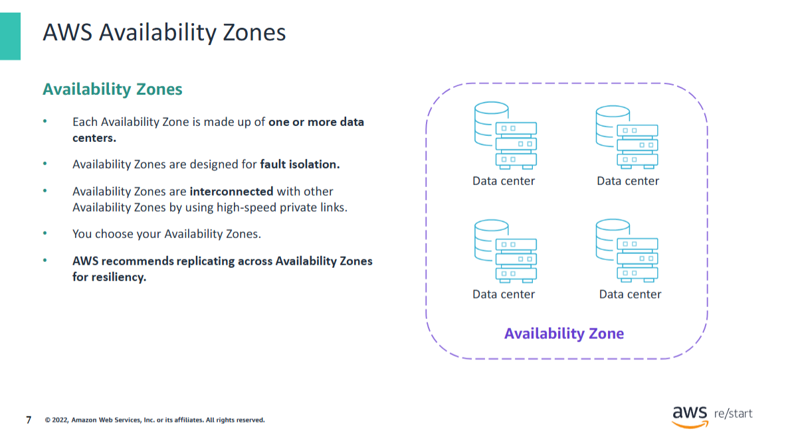

## Availability Zones

**Availability Zones** consist of one or more **discrete data centers** that are designed for **fault isolation**.  
They each have **redundant power, networking, and connectivity resources** housed in **separate facilities**.  
They are interconnected with other Availability Zones using **high-speed private links**.

- Some Availability Zones have as many as **six data centers**.
- **No data center** can be part of **two Availability Zones**.

### Fault Isolation & Physical Separation

Each Availability Zone is designed as an **independent failure zone** and is:
- **Physically separated** within a typical metropolitan Region
- Located in **lower-risk flood plains** with specific flood-zone categorization that varies by Region
- Equipped with:
    - **Discrete, uninterruptible power supply**
    - **Onsite backup generation facilities**
    - **Power feeds from different grids** supplied by **independent utilities**
- **Redundantly connected** to multiple **tier-1 transit providers**
- Connected through **low-latency links** within a Region

---

### Availability Zone Design & Best Practices

You are responsible for selecting the **Availability Zones** where your **systems will reside**.

- **Systems can span** across multiple Availability Zones.
- AWS **recommends replicating across Availability Zones** for **resiliency**.
- You should **design your systems to survive**:
    - Temporary failure
    - Prolonged failure
    - Natural disasters
    - System-level failures

Distributing applications across **multiple Availability Zones** helps them remain **resilient** in most failure situations.

## AWS Regions
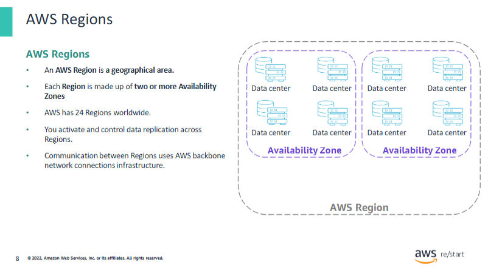

### AWS Regions and Availability Zones

The **AWS Cloud infrastructure** is built around **Regions** and **Availability Zones**.

An **AWS Region** is a **physical geographical location** in the world where AWS has **multiple Availability Zones**.

#### Key Characteristics of Regions

- To achieve **fault tolerance** and **stability**, Regions are **isolated** from each other.
- **Resources in one Region are not automatically replicated** to other Regions.
- Each AWS Region contains **two or more Availability Zones**.
- As of **August 2020**, AWS had **24 Regions worldwide**.

> When you store data in a specific Region, it’s **not replicated outside that Region**.  
> AWS **never moves your data out** of the Region that you put it in.

It is your **responsibility** to replicate data **across Regions** if your business needs require it.

AWS provides information about:
- The **country** and
- (Where applicable) the **state** where each Region resides

You are responsible for selecting the **Region to store data in**, based on:
- **Compliance requirements**
- **Network latency**

---

#### Multi-Region Deployment Example

If you are using cloud computing services, you can **deploy your application in multiple Regions**.

For instance:
- You can deploy in a Region nearest to your **headquarters** (e.g., **San Diego**, US West)
- You can also deploy in a Region near your **largest customer base** (e.g., **Virginia**, US East)

With just a **few clicks**, you can deploy in the **US East Region** to:
- Provide a better experience for customers located there
- **Reduce latency**
- **Increase agility** for your organization
- Achieve this in **minutes** with **minimal cost**

---

#### Special Case: Restricted Regions

Some Regions have **restricted access**.

For example:
- The **isolated AWS GovCloud (US) Region** is designed for **US government agencies and customers**
- It supports the move of **sensitive workloads** into the cloud
- It addresses **specific regulatory and compliance requirements**

### Selecting a Region
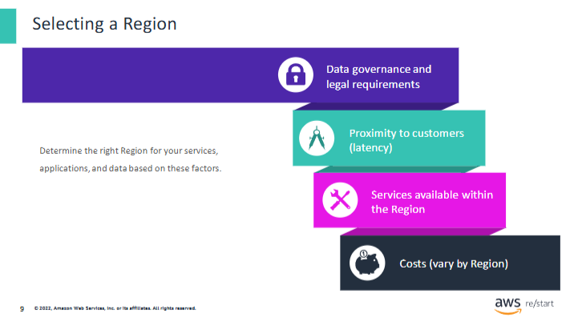

You should consider a few factors when selecting the **optimal Region** where you store data and use AWS services.

#### Key Considerations

- **Data governance and legal requirements**  
  Local laws might require that certain information be kept within **specific geographical boundaries**.  
  These laws can restrict the **Regions** where you can offer content or services.

  > **Example**: The **European Union (EU) Data Protection Directive**

- **Latency**  
  All else being equal, it is generally desirable to run your applications and store your data in a Region that is as **close as possible to the users and systems** that will access them.  
  This helps **reduce latency**.

  - You can use [**CloudPing**](https://www.cloudping.info/) to test latency between your location and AWS Regions.

- **Service availability**  
  Not all AWS services are available in every Region.  
  To check what is available, see the  
  [AWS Regional Services page](https://aws.amazon.com/about-aws/global-infrastructure/regional-product-services/)

- **Cost differences**  
  There is some variation in the **cost of running services** between Regions.

  > For example:  
  The per-hour cost to run a **t3.medium Amazon EC2 On-Demand Linux Instance** in the **US East (Ohio)** Region  
  might differ from the cost of running the same instance in the **Asia Pacific (Tokyo)** Region.

---

#### Summary

When selecting a Region, consider:

- Which Region offers the **services** that you need
- Where the Region is **physically located**
- **Latency** optimization
- **Cost** optimization
- **Regulatory and legal compliance** requirements

### Points of presence
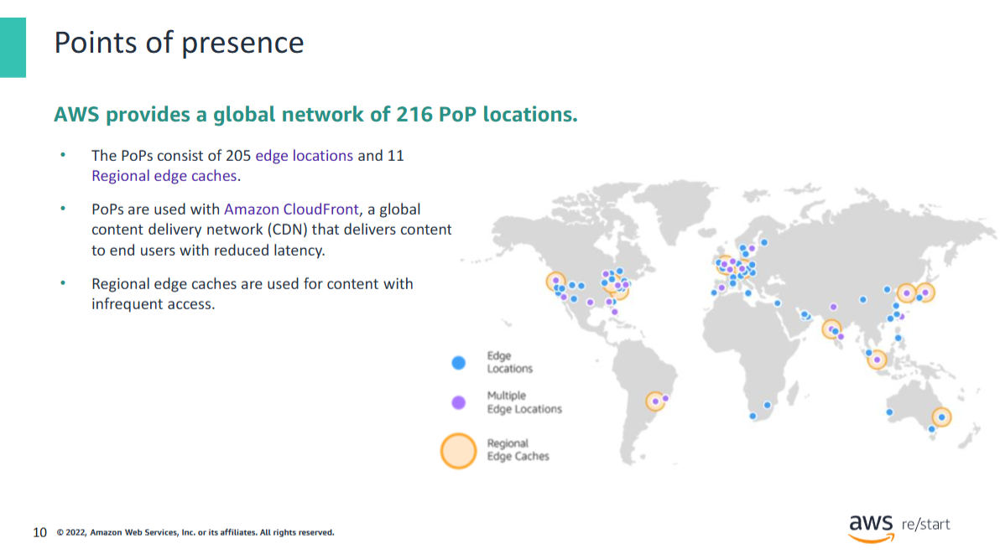

A **PoP** is where **end users access AWS services** through either the **Amazon CloudFront** or **Amazon Route 53** services.

As of **August 2020**, the global AWS infrastructure contained:

- **216 PoPs**, consisting of:
  - **205 edge locations**
  - **11 Regional edge caches**
- Located in **major cities around the world**

These PoPs serve requests for:
- **Amazon CloudFront**
- **Amazon Route 53**

---

#### AWS Services at PoPs

- **Amazon CloudFront**  
  A **Content Delivery Network (CDN)** used to **distribute content to end users** and **reduce latency**.

- **Amazon Route 53**  
  A **Domain Name System (DNS)** service.

Requests to either of these services are **automatically routed to the nearest edge location**.

---

#### Regional Edge Caches

- Used **by default with CloudFront**
- Store content that is **not accessed frequently enough** to remain in an edge location
- Act as an **intermediary cache** before content is fetched from the **origin server**

---

For more information about AWS Global Infrastructure, see the  
[Global Infrastructure page](https://aws.amazon.com/about-aws/global-infrastructure/?p=ngi&loc=0)

## AWS infrastructure features 
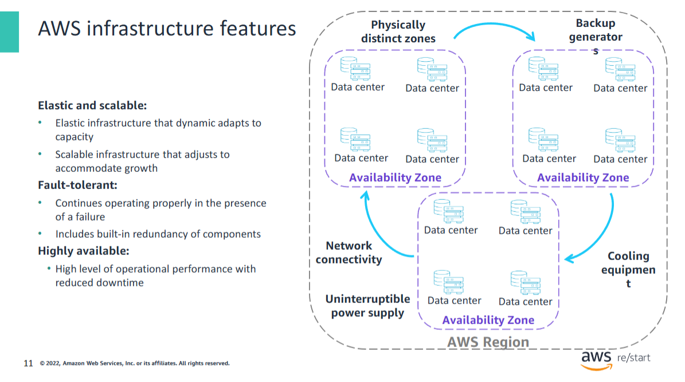

The **AWS Global Infrastructure** is built around **Regions** and **Availability Zones**.

- **AWS Regions** provide multiple **physically separated**, isolated **Availability Zones**.
- An **AWS Region** contains **two or more Availability Zones**.
- An **Availability Zone** is a **data center** or **collection of data centers**.
- Availability Zones are connected with:
  - **Low-latency**
  - **High-throughput**
  - **Highly redundant networking**
- Availability Zones are **physically distinct**. Each one includes:
  - **Uninterruptible power supplies (UPS)**
  - **Cooling equipment**
  - **Backup generators**
  - **Security systems**

---

#### Key Features of AWS Infrastructure

- **Elastic and scalable**  
  Resources can dynamically adjust to increases or decreases in capacity requirements.  
  The infrastructure can rapidly adjust to accommodate **growth**.

- **Fault tolerant**  
  Built-in component **redundancy** allows continued operation **despite failures**.

- **Minimal human intervention**  
  Designed for **high availability** with **minimal downtime**, requiring **little to no manual effort**.

## Key takeaways
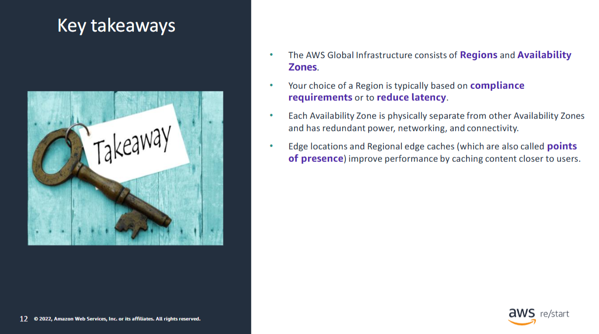

- The **AWS Global Infrastructure** consists of **Regions** and **Availability Zones**.

- Your choice of a **Region** is typically based on:
  - **Compliance requirements**, or
  - To **reduce latency**

- Each **Availability Zone** is **physically separate** from other Availability Zones and includes:
  - **Redundant power**
  - **Redundant networking**
  - **Redundant connectivity**

- **Edge locations** and **Regional edge caches** (also called **points of presence / PoPs**) improve performance by:
  - **Caching content closer to users**