## Service Categories

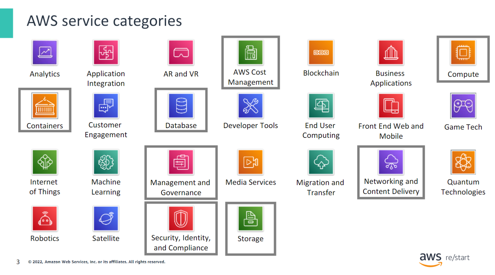

AWS offers a broad set of cloud-based services across various product or service categories. Each category consists of one or more services. This course won't introduce every service. Instead, it focuses on the most widely used services, providing a good introduction to the AWS Cloud. The course also emphasizes services likely to be covered in the AWS Certified Cloud Practitioner exam.

This slide highlights the following categories that will be discussed:

- **AWS Cost Management**
- **Compute**
- **Containers**
- **Database**
- **Management and Governance**
- **Networking and Content Delivery**
- **Security, Identity, and Compliance**
- **Storage**

For more information about AWS offerings, visit the [AWS Cloud Products page](https://aws.amazon.com/products). All AWS offerings are organized into service categories. For example, in the **Compute** category, Amazon Elastic Compute Cloud (Amazon EC2) is the first service listed. The Compute category also includes other products and services.

If you choose Amazon EC2, the Amazon EC2 page will open, providing a detailed description of the product and listing its benefits. Explore the different service groups to understand the categories and services within them.

Now that you know how to locate information about different services, this module will discuss the highlighted service categories in the next slides.

## Storage Service Categories

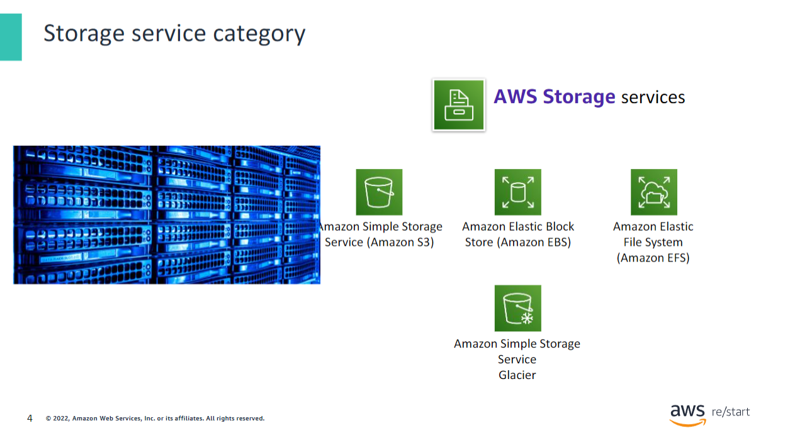

AWS Storage services include the following and many others:

- **Amazon Simple Storage Service (Amazon S3):** An object storage service that offers scalability, data availability, security, and performance. It can store and protect any amount of data for websites, mobile apps, backups, restores, archives, enterprise applications, IoT devices, and big data analytics.

- **Amazon Elastic Block Store (Amazon EBS):** High-performance block storage designed for use with Amazon EC2 for both throughput-intensive and transaction-intensive workloads. It supports relational and non-relational databases, enterprise applications, containerized applications, big data analytics engines, file systems, and media workflows.

- **Amazon Elastic File System (Amazon EFS):** A scalable, fully managed elastic Network File System (NFS) file system for AWS Cloud services and on-premises resources. It scales on demand to petabytes, growing and shrinking automatically as you add and remove files, reducing the need to provision and manage capacity to accommodate growth.

- **Amazon Simple Storage Service Glacier:** A secure, durable, and low-cost Amazon S3 cloud storage class for data archiving and long-term backup. It is designed to deliver 11 nines (99.999999999 percent) of durability and provides comprehensive security and compliance capabilities to meet stringent regulatory requirements.

## Compute Service Categories

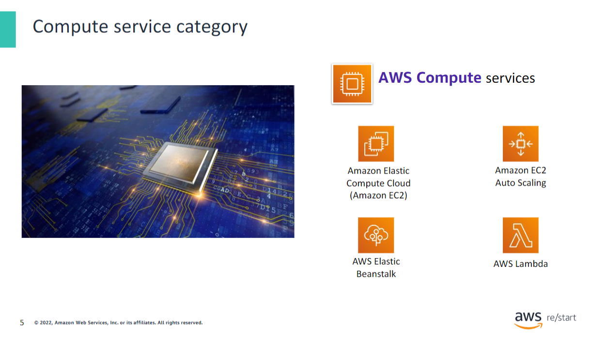

AWS Compute services include the following and many others:

- **Amazon Elastic Compute Cloud (Amazon EC2):** Provides resizable compute capacity as virtual machines in the cloud.
  
- **Amazon EC2 Auto Scaling:** Allows you to automatically add or remove EC2 instances based on conditions that you define.
  
- **AWS Elastic Beanstalk:** A service for deploying and scaling web applications and services. It deploys them on familiar servers such as Apache HTTP Server and Microsoft Internet Information Services (IIS).
  
- **AWS Lambda:** Enables you to run code without provisioning or managing servers. You pay only for the compute time you consume, so you won’t be charged when your code isn’t running.

## Containers Service Category

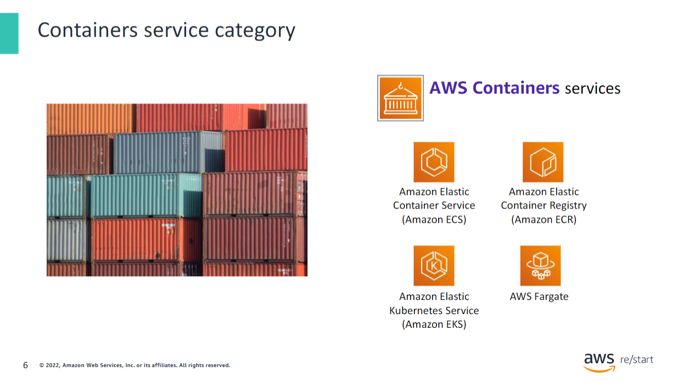

AWS Containers services include the following and many others:

- **Amazon Elastic Container Service (Amazon ECS):** A highly scalable, high-performance container orchestration service that supports Docker containers.
  
- **Amazon Elastic Container Registry (Amazon ECR):** A fully managed Docker container registry that facilitates storing, managing, and deploying Docker container images.
  
- **Amazon Elastic Kubernetes Service (Amazon EKS):** Facilitates deploying, managing, and scaling containerized applications that use Kubernetes on AWS.
  
- **AWS Fargate:** A compute engine for Amazon ECS that allows you to run containers without managing servers or clusters.

## Database Service Category

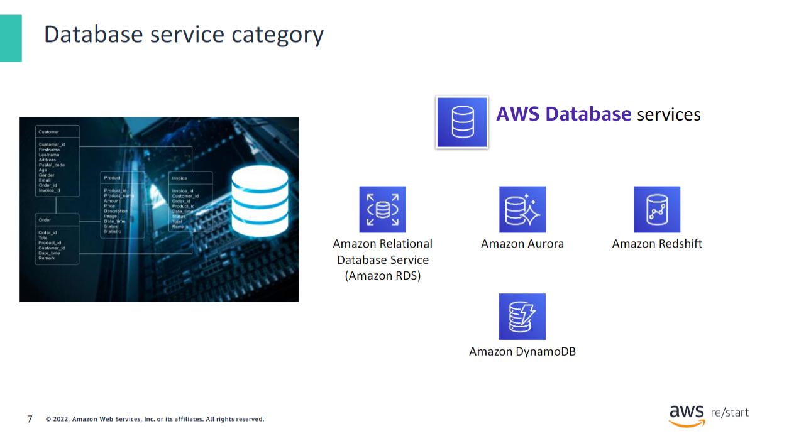

AWS Database services include the following and many others:

- **Amazon Relational Database Service (Amazon RDS):** Facilitates setting up, operating, and scaling a relational database in the cloud. It provides resizable capacity while automating time-consuming administration tasks, such as hardware provisioning, database setup, patching, and backups.
  
- **Amazon Aurora:** A relational database compatible with MySQL and PostgreSQL. It is up to five times faster than standard MySQL databases and three times faster than standard PostgreSQL databases.
  
- **Amazon Redshift:** Allows you to run analytic queries against petabytes of data stored locally in Amazon Redshift. You can also run queries directly against exabytes of data stored in Amazon S3. Amazon Redshift delivers fast performance at any scale.
  
- **Amazon DynamoDB:** A key-value and document database that delivers single-digit millisecond performance at any scale with built-in security, backup and restore, and in-memory caching.

## Network and Content Delivery Service Category

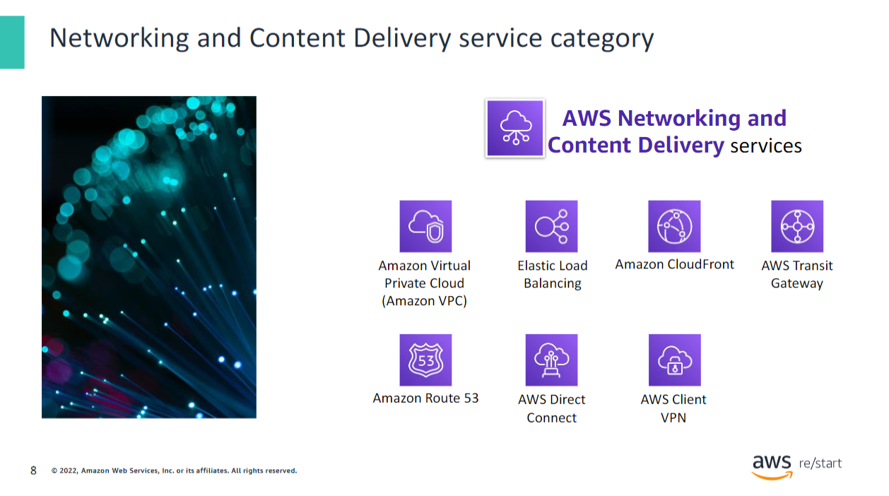

AWS Networking and Content Delivery services include the following and many others:

- **Amazon Virtual Private Cloud (Amazon VPC):** Gives you the ability to provision logically isolated sections of the AWS Cloud.
  
- **Elastic Load Balancing:** Automatically distributes incoming application traffic across multiple targets, such as Amazon EC2 instances, containers, IP addresses, and Lambda functions.
  
- **Amazon CloudFront:** A fast content delivery network (CDN) service that securely delivers data, videos, applications, and application programming interfaces (APIs) to customers globally. It has low latency and high transfer speeds.
  
- **AWS Transit Gateway:** A service that customers can use to connect their virtual private clouds (VPCs) and their on-premises networks to a single gateway.
  
- **Amazon Route 53:** A scalable, cloud Domain Name System (DNS) web service designed to give you a reliable way to route end users to internet applications. Route 53 translates names (like www.example.com) into the numeric IP addresses (like 192.0.2.1) that computers use to connect to each other.
  
- **AWS Direct Connect:** Provides a way to establish a dedicated private network connection from your data center or office to AWS. Using AWS Direct Connect can reduce network costs and increase bandwidth throughput.
  
- **AWS Client VPN:** Provides a secure private tunnel from your network or device to the AWS global network.

## Security, Identity, and Compliance Services Category

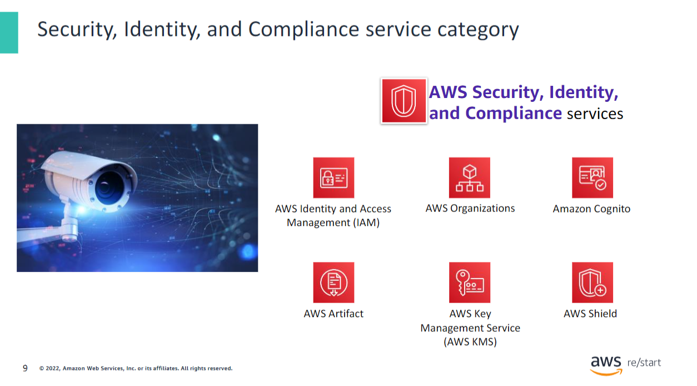

AWS Security, Identity, and Compliance services include the following and many others:

- **AWS Identity and Access Management (IAM):** Gives you the ability to manage access to AWS services and resources securely. By using IAM, you can create and manage AWS users and groups. You can use IAM permissions to allow and deny user and group access to AWS resources.
  
- **AWS Organizations:** Permits you to restrict what services and actions are allowed in your accounts.
  
- **Amazon Cognito:** Gives you the ability to add user sign-up, sign-in, and access control to your web and mobile apps.
  
- **AWS Artifact:** Provides on-demand access to AWS security and compliance reports and select online agreements.
  
- **AWS Key Management Service (AWS KMS):** Provides the ability to create and manage keys. You can use AWS KMS to control the use of encryption across a wide range of AWS services and in your applications.
  
- **AWS Shield:** A managed distributed denial of service (DDoS) protection service that safeguards applications running on AWS.

## AWS Cost Management Service Category

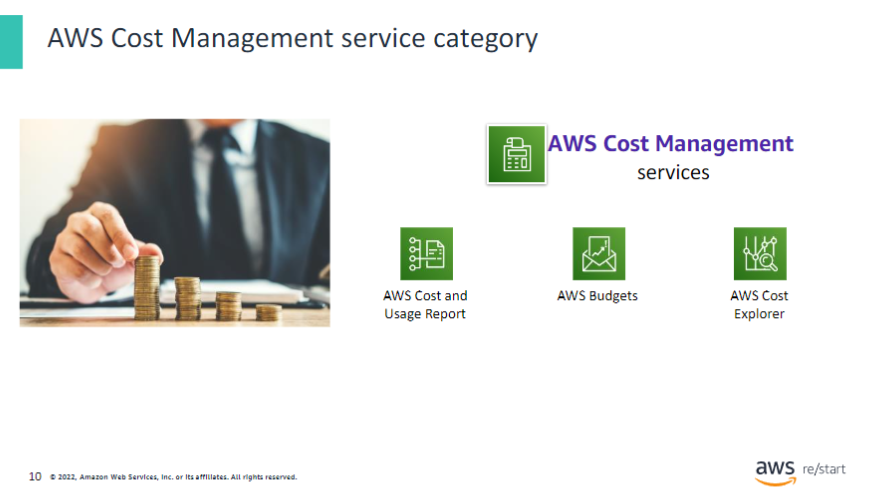

AWS Cost Management services include the following and others:

- **AWS Cost and Usage Report:** Contains the most comprehensive set of AWS cost and usage data available. It includes additional metadata about AWS services, pricing, and reservations.
  
- **AWS Budgets:** Provides the ability to set custom budgets that alert you when your costs or usage exceeds (or will likely exceed) your budgeted amount.
  
- **AWS Cost Explorer:** Has an easy-to-use interface that you can use to visualize, understand, and manage your AWS costs and usage over time.

## Management and Governance Service Category

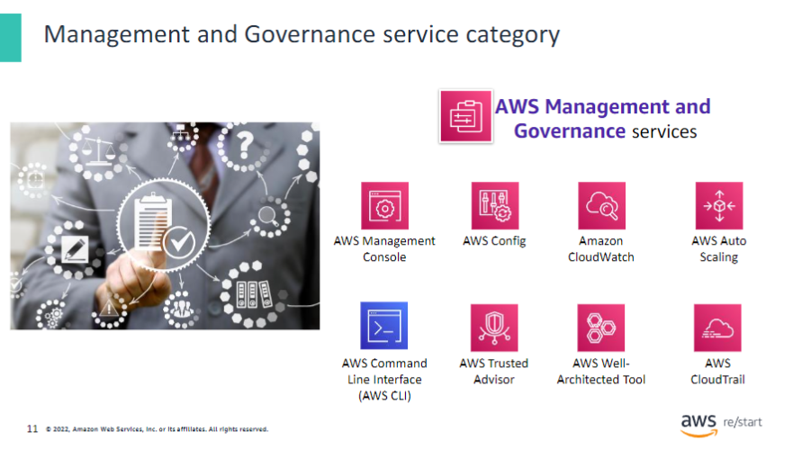

AWS Management and Governance services include the following and others:

- **AWS Management Console:** Provides a web-based user interface for accessing your AWS account.
  
- **AWS Config:** Provides a service that helps you track resource inventory and changes.
  
- **Amazon CloudWatch:** Gives you the ability to monitor resources and applications.
  
- **AWS Auto Scaling:** Provides features that you can use to scale multiple resources to meet demand.
  
- **AWS Command Line Interface (AWS CLI):** Provides a unified tool to manage AWS services.
  
- **AWS Trusted Advisor:** Helps you optimize performance and security.
  
- **AWS Well-Architected Tool:** Provides help in reviewing and improving your workloads.
  
- **AWS CloudTrail:** Tracks user activity and API usage.

## Hands-on Activity: AWS Management Console clicktrough

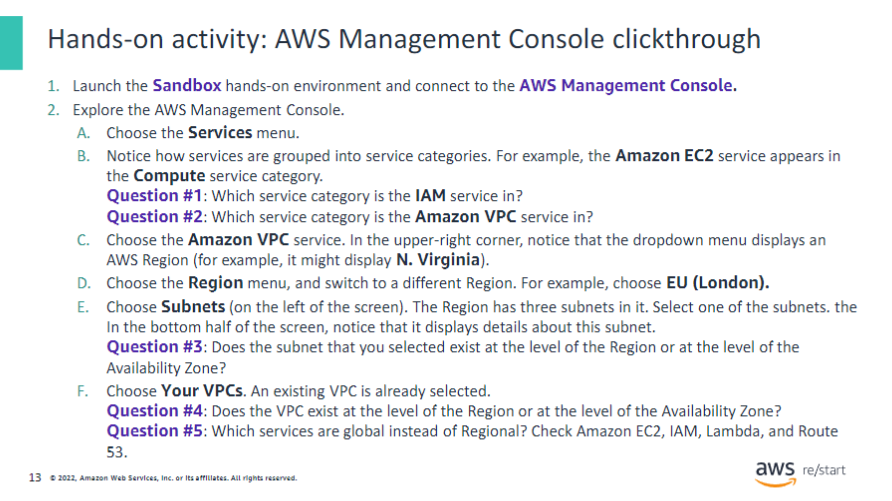

The purpose of this activity is to expose you to the AWS Management Console. You will gain experience navigating between AWS service consoles (such as the Amazon VPC console and the Amazon EC2 console). You will also practice navigating to services in different service categories. Finally, the console will help you distinguish whether a given service or service resource is global or Regional.

Follow the instructions on the slide. After most or all students have completed the steps, the educator will review the questions and answers with the whole class.

  
Answers

  
  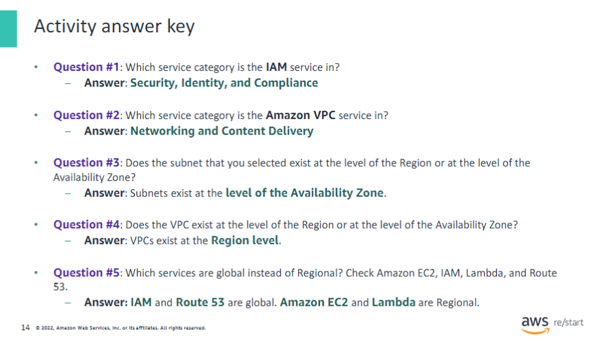

## Key Takeaways

:::tip[Recap]
This module includes the following key takeaways:

- AWS offers a broad set of cloud-based services that span multiple categories, including the Compute, Networking, and Storage categories.
- The AWS Management Console provides a web interface that you can use to access and manage your AWS Cloud resources.

:::
