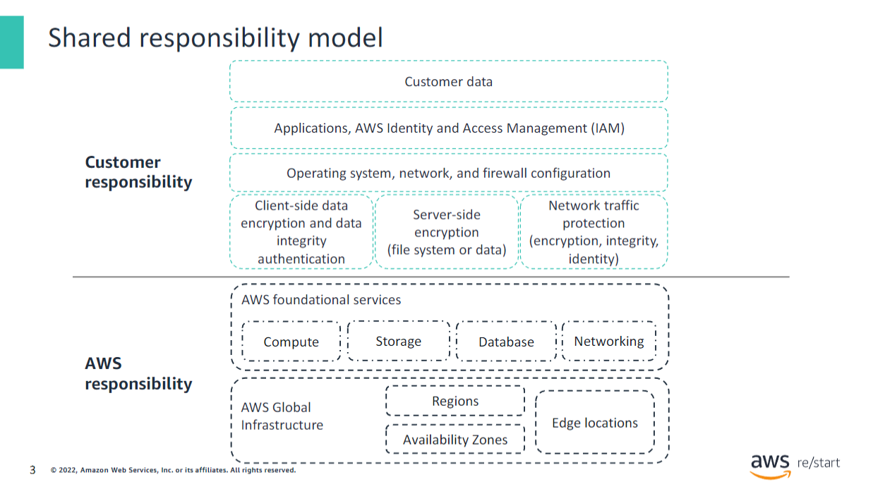
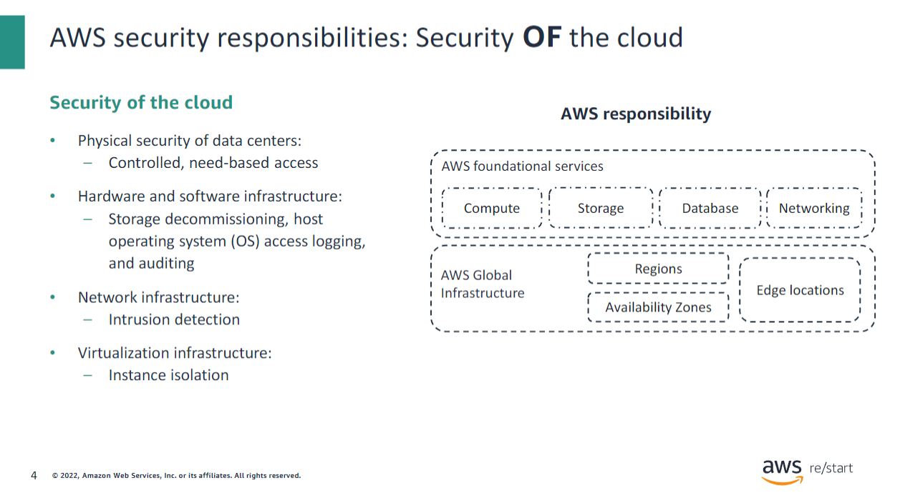
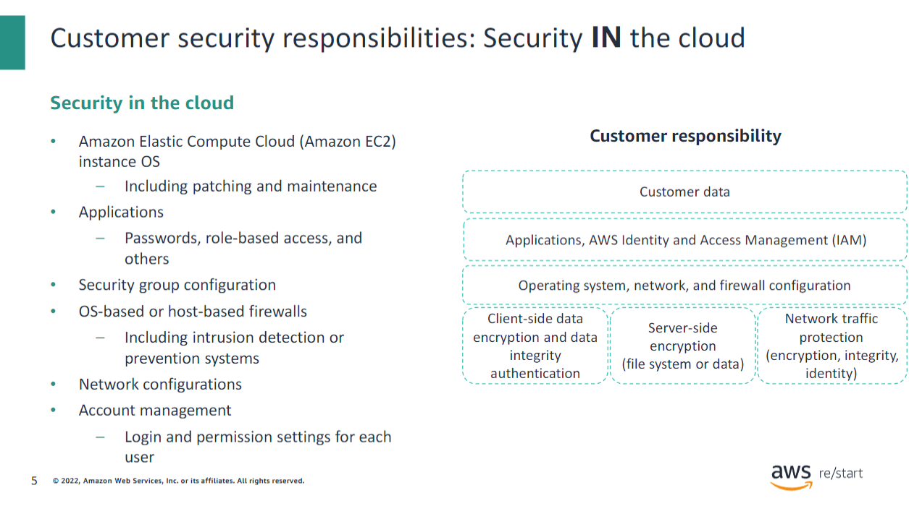
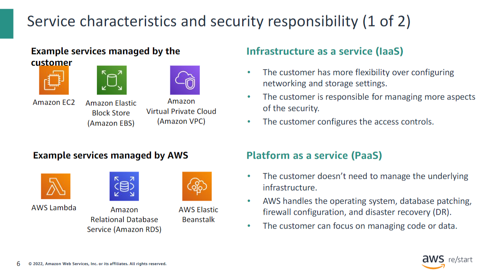
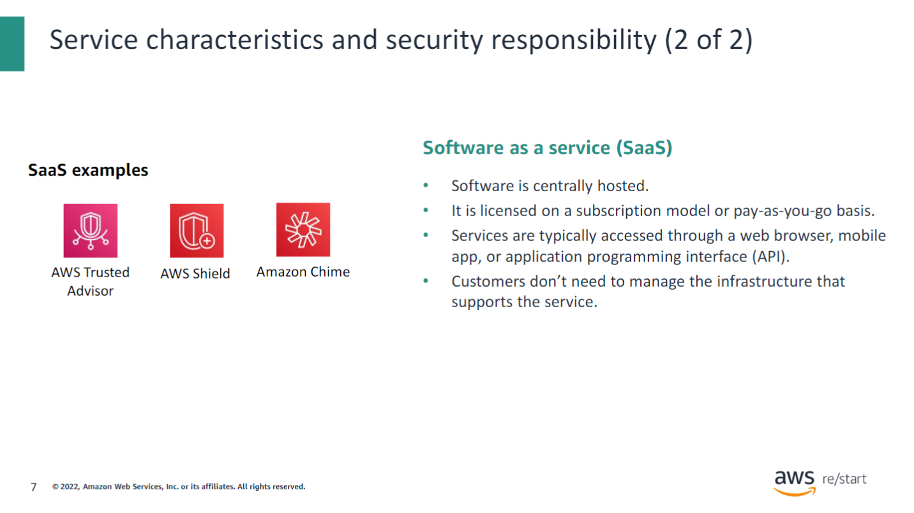
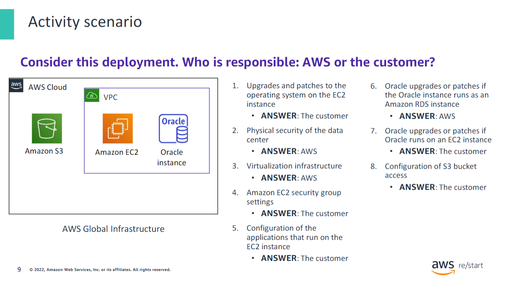
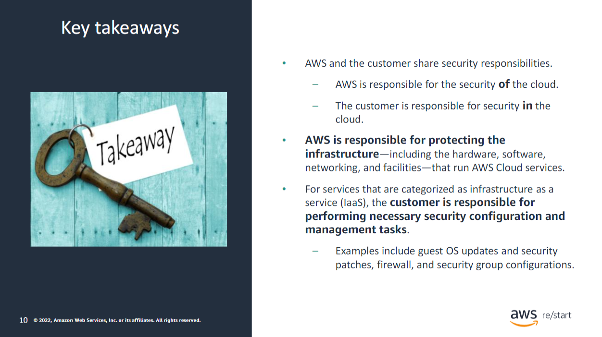

Security is the highest priority at AWS. AWS delivers a scalable cloud computing environment that is designed for high availability and dependability. At the same time, AWS provides the tools that you can use to run a wide range of applications. Helping to protect the confidentiality, integrity, and availability of your systems and data is critical to AWS, and so is maintaining customer trust and confidence.

This module provides an introduction to the AWS approach to security. You will learn about controls in the AWS environment and some products and features that AWS offers so that customers can meet their security objectives. AWS provides the same approach to security that companies have been using for decades. AWS also offers customers the flexibility and low cost of cloud computing. It’s not inherently inconsistent to provide on-demand infrastructure while also providing the security isolation that companies expect in their existing, privately owned environments.

After the customer starts using AWS, they share the responsibility of securing the customer’s data in the AWS Cloud. Thus, AWS security becomes a shared responsibility. This concept is known as the shared responsibility model. Next, you will learn who is responsible for which aspects of security in the shared responsibility model.

## AWS Security Responsibilities: Security of the Cloud

AWS is responsible for security of the cloud, but what does that mean? Under the shared responsibility model, AWS operates, manages, and controls the components. These components range from the host operating system and virtualization layer down to the physical security of the facilities where the services operate. Thus, AWS is responsible for protecting the global infrastructure that runs all of the services that are offered in the AWS Cloud. This infrastructure covers AWS Regions, Availability Zones, and edge locations.

AWS handles the security of the physical infrastructure that hosts your resources. This infrastructure includes the following:

- Physical security of data centers with controlled, need-based access, located in nondescript facilities. The physical security includes 24/7 security guards, two-factor authentication, access logging and review, video surveillance, and disk degaussing and destruction.
- Hardware infrastructure, which includes servers, storage devices, and other appliances that AWS services rely on.
- Software infrastructure that hosts operating systems, service applications, and virtualization software.
- Network infrastructure, which includes routers, switches, load balancers, firewalls, and cabling. This facet of security includes nearly continuous network monitoring at external boundaries, secure access points, and redundant infrastructure with intrusion detection.
- Virtualization infrastructure, including instance isolation. Protecting this infrastructure is the number one priority for AWS.

You cannot visit AWS data centers or offices to experience this protection firsthand. However, Amazon provides several reports from third-party auditors who have verified AWS compliance with various computer security standards and regulations.

## Customer Security Responsibilities: Security in the Cloud

Though AWS secures and maintains the cloud infrastructure, customers are responsible for security of everything that they put in the cloud. The customer is responsible for what they implement by using AWS and for the applications that connect to AWS. The security steps that a customer must take depend on the services that they use and the complexity of their system.

These steps include:

- Selecting the instance OS
- Securing the application
- Configuring security groups and firewalls
- Managing the network configuration and user accounts

When customers use AWS services, they maintain complete control over their content. Customers are responsible for managing critical content security requirements, including:

- Which content they choose to store on AWS
- Which AWS services are used with the content
- Which country that content is stored in
- The format and structure of that content and whether it is masked, anonymized, or encrypted
- Who has access to that content and how those access rights are granted, managed, and revoked

Customers retain control of the security that they choose to protect their data, environment, applications, AWS Identity and Access Management (IAM) settings, and operating systems. Thus, the shared responsibility model changes depending on the AWS services that the customer decides to implement.

## Service Characteristics and Security Responsibility

### Infrastructure as a Service (IaaS)

Infrastructure as a Service (IaaS) refers to services that provide basic building blocks for cloud IT. These building blocks typically include network configuration, computers (virtual or on dedicated hardware), and data storage space. Cloud services that can be characterized as IaaS provide the customer with the highest level of flexibility and management control over IT resources. IaaS services are the most similar to existing on-premises computing resources that many IT departments are familiar with.

AWS services—such as Amazon EC2—can be categorized as IaaS. Thus, the customer must perform all necessary security configuration and management tasks. Customers who deploy EC2 instances are responsible for managing the guest OS (including updates and security patches) and any application software installed on the instances. In addition, customers are responsible for configuring the security groups that AWS provides.

### Platform as a Service (PaaS)

Platform as a Service (PaaS) refers to services that reduce the customer’s need to manage the underlying infrastructure (hardware, OS, and other resources). By using PaaS services, customers can focus on deploying and managing applications. Customers don’t need to worry about resource procurement, capacity planning, software maintenance, or patching.

AWS services such as AWS Lambda and Amazon RDS can be categorized as PaaS because AWS operates the infrastructure layer, the operating system, and platforms. Customers only need to access the endpoints to store and retrieve data. With PaaS services, customers are responsible for managing their data, classifying their assets, and applying the appropriate permissions. However, these services act more like managed services, with AWS handling a larger portion of the security requirements. For these services, AWS handles basic security tasks, such as OS and database patching, firewall configuration, and disaster recovery (DR).

### Software as a Service (SaaS)

Software as a Service (SaaS) comprises services that provide centrally hosted software typically accessible through a web browser, mobile app, or application programming interface (API). The licensing model for SaaS offerings is generally subscription or pay as you go. With SaaS offerings, customers don’t need to manage the infrastructure that supports the service. Some AWS services—such as AWS Trusted Advisor, AWS Shield, and Amazon Chime—could be categorized as SaaS offerings if you consider their characteristics.

### AWS Trusted Advisor

AWS Trusted Advisor is an online tool that analyzes your AWS environment. It provides real-time guidance and recommendations to help you provision your resources by following AWS best practices. The Trusted Advisor service is offered as part of your AWS Support plan. Some of the Trusted Advisor features are free to all accounts. However, Business Support and Enterprise Support customers have access to the full set of Trusted Advisor checks and recommendations.

### AWS Shield

AWS Shield is a managed distributed denial of service (DDoS) protection service that safeguards applications running on AWS. It provides always-on detection and automatic inline mitigations that minimize application downtime and latency. Thus, customers don’t need to engage AWS Support to benefit from DDoS protection. AWS Shield Advanced is available to all customers. However, to contact the DDoS Response Team, customers must have either Enterprise Support or Business Support from AWS Support.

### Amazon Chime

Amazon Chime is a communications service that allows users to meet, chat, and place business calls inside and outside their organization using a single application. It operates on a pay-as-you-go model with no upfront fees, commitments, or long-term contracts.

## Activity Scenario

Consider the case where a customer uses the AWS services and resources that are shown here. Who is responsible for maintaining security: AWS or the customer?

The customer uses Amazon Simple Storage Service (Amazon S3) to store data. The customer configured a virtual private cloud (VPC) with Amazon Virtual Private Cloud (Amazon VPC). The EC2 instance and the Oracle database instance that they created both run in the VPC.

In this example, the customer must manage the guest OS that runs on the EC2 instance. Over time, the guest OS will need to be upgraded and have security patches applied. Additionally, the customer must maintain any application software or utilities that they installed on the EC2 instance. The customer is responsible for configuring the AWS firewall (or security group) that is applied to the EC2 instance. The customer is also responsible for the VPC configurations that specify the network conditions under which the EC2 instance runs. These tasks are the same security tasks that IT staff would perform, no matter where their servers are located.

The Oracle instance in this example provides an interesting case study in terms of AWS or customer responsibility. If the database runs on an EC2 instance, then it is the customer's responsibility to apply Oracle software upgrades and patches. However, if the database runs as an Amazon RDS instance, then it is the responsibility of AWS to apply Oracle software upgrades and patches. Because Amazon RDS is a managed database offering, AWS handles time-consuming database administration tasks, including provisioning, backups, software patching, monitoring, and hardware scaling.

## Key Takeaways

:::tip[Recap]
This module includes the following key takeaways:

- AWS and the customer share security responsibilities.
- AWS is responsible for the security of the cloud.
- The customer is responsible for security in the cloud.
- AWS is responsible for protecting the infrastructure—including hardware, software, networking, and facilities—that run AWS Cloud services.
- For services that are categorized as infrastructure as a service (IaaS), the customer is responsible for performing necessary security configuration and management tasks.
- Examples include guest OS updates and security patches, firewall, and security group configurations.

:::
