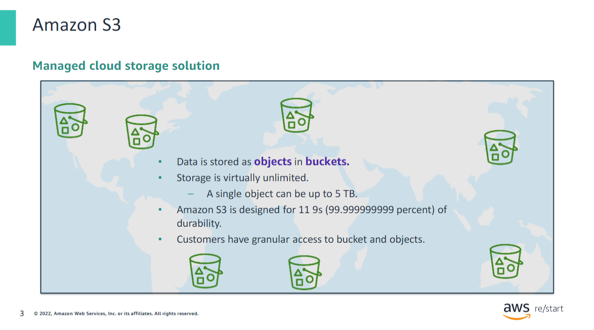
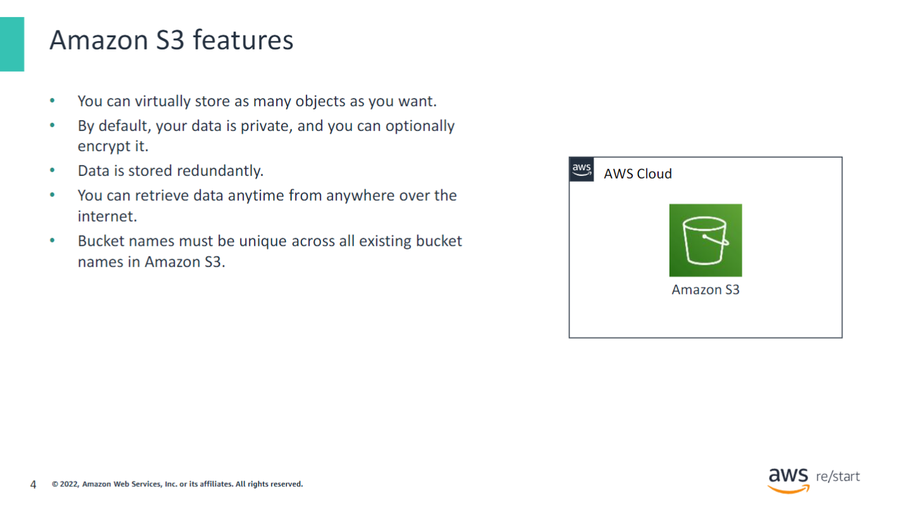
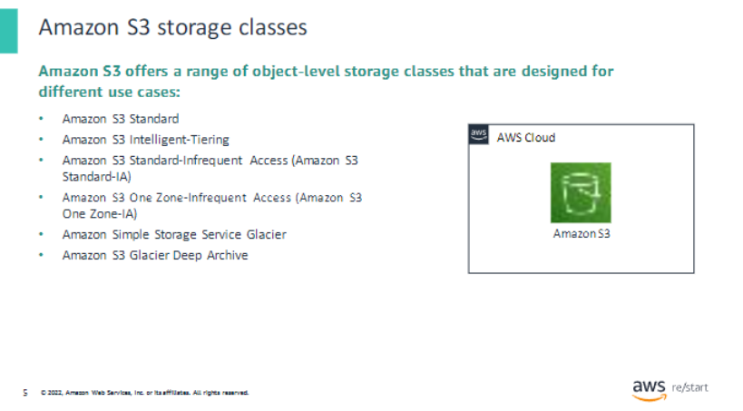
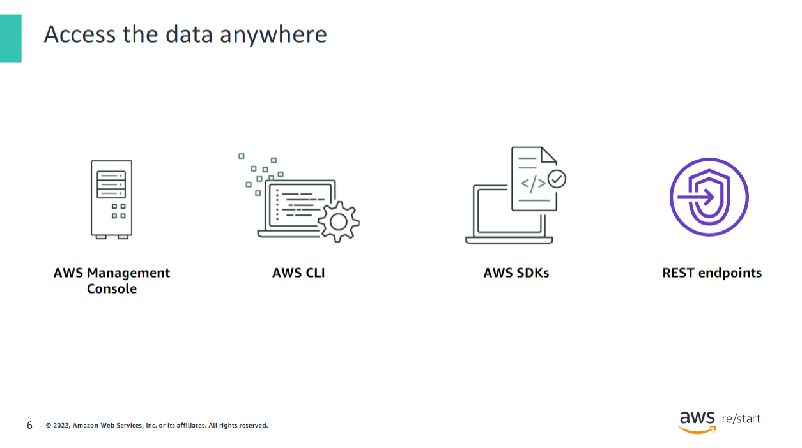
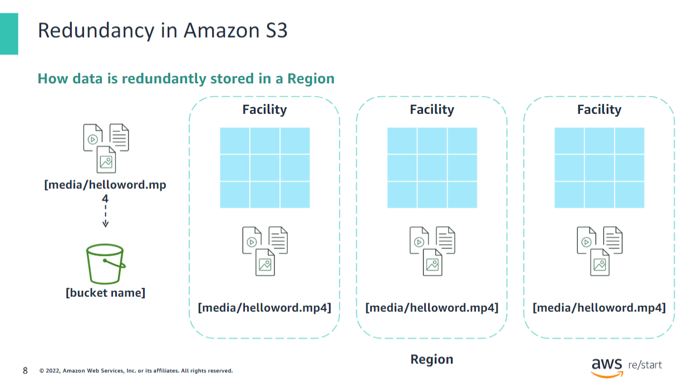
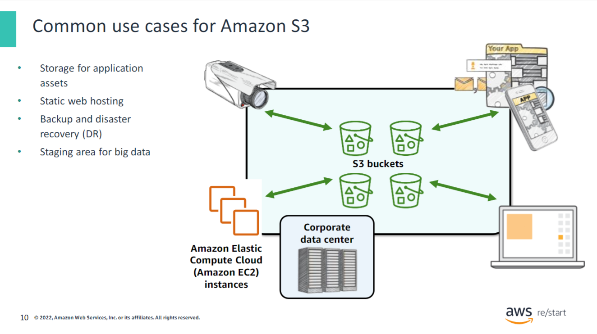
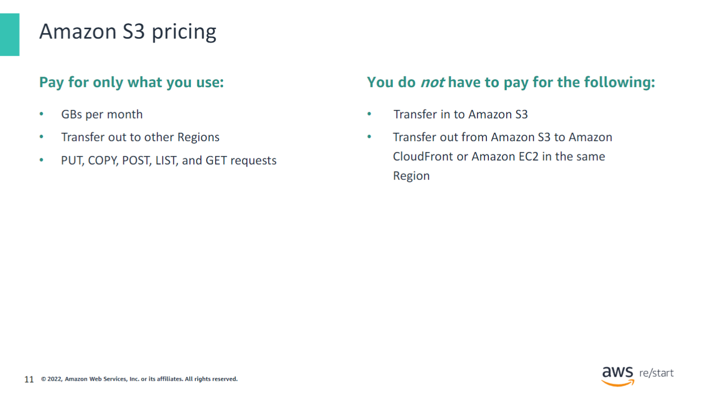
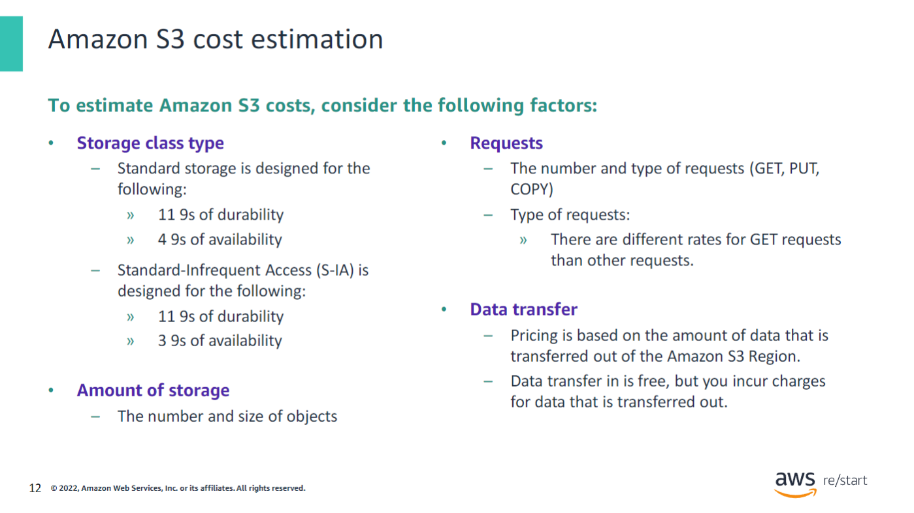
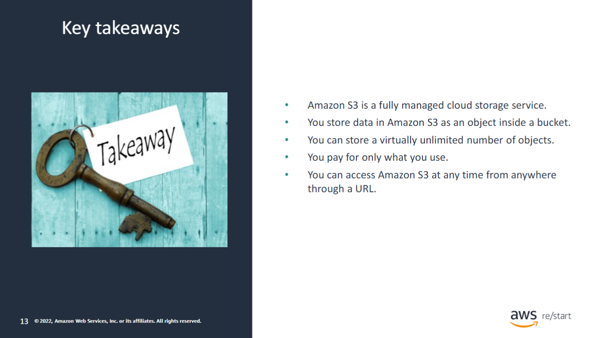

## Managed Cloud Storage Solution

Amazon S3 is a managed cloud storage solution that you can use to store data as objects in a bucket. Objects can be almost any data file, such as documents, images, or videos. When you add objects to a bucket, you must give them a unique name, which is called an object key. Amazon S3 is object-level storage. If you want to change a part of a file, you must make the change and then re-upload the entire modified file.

Buckets are logical containers for objects. You can have one or more buckets in your account. For each bucket, you can control access regarding who can create, delete, and list objects in the bucket. You can view access logs for the bucket and its objects, and you can choose the geographical region where Amazon S3 stores the bucket and its contents.

To upload your data, create a bucket in one of the AWS Regions, and then upload any number of objects to the bucket. You can virtually store as many objects as you want within a bucket, and you can write, read, and delete objects in your bucket. A single object can be up to 5 terabytes (TB) in size.

Amazon S3 is designed to scale seamlessly and provide over 11 9s (99.999999999 percent) of durability. The data that you store in Amazon S3 is not associated with any particular server, and you don’t need to manage any infrastructure yourself.

## S3 Features

The following are some key features of Amazon S3:

- Amazon S3 holds trillions of objects and regularly peaks at millions of requests per second.
- By default, none of your data is shared publicly. You can also encrypt your data in transit and choose to turn on server-side encryption on your objects.
- By default, data in Amazon S3 is stored redundantly across multiple facilities and multiple devices in each facility.
- Amazon S3 also provides low-latency access to the data over the internet by Hypertext Transfer Protocol (HTTP) or Secure HTTP (HTTPS), so you can retrieve data anytime from anywhere.
- Bucket names are universal and must be unique across all existing bucket names in Amazon S3.

## S3 Storage Classes

Amazon S3 offers a range of object-level storage classes that are designed for different use cases. These classes include the following:

- **Amazon S3 Standard** – Amazon S3 Standard is designed to provide high-durability, high-availability, and high-performance object storage for frequently accessed data. Because it delivers low latency and high throughput, Amazon S3 Standard is appropriate for many use cases. These use cases include cloud applications, dynamic websites, content distribution, mobile and gaming applications, and big data analytics.

- **Amazon S3 Intelligent-Tiering** – The Amazon S3 Intelligent-Tiering storage class is designed to optimize costs. It automatically moves data to the most cost-effective access tier without affecting performance or operational overhead. For a small monthly monitoring and automation fee per object, Amazon S3 monitors access patterns of the objects in Amazon S3 Intelligent-Tiering. It then moves the objects that haven’t been accessed for 30 consecutive days to the Infrequent Access tier. If an object in the Infrequent Access tier is accessed, it is automatically moved back to the Frequent Access tier. The Amazon S3 Intelligent-Tiering storage class doesn’t charge retrieval fees when you use it. Also, it doesn’t charge additional fees when objects are moved between access tiers. It works well for long-lived data with access patterns that are unknown or unpredictable.

- **Amazon S3 Standard-Infrequent Access (Amazon S3 Standard-IA)** – The Amazon S3 Standard-IA storage class is used for data that is accessed less frequently but requires rapid access when needed. Amazon S3 Standard-IA is designed to provide the high durability, high throughput, and low latency of Amazon S3 Standard. With these benefits, it also offers a low per-GB storage price and per-GB retrieval fee. This combination of low cost and high performance makes Amazon S3 Standard-IA a good choice for long-term storage and backups. Thus, it also works well as a data store for disaster recovery (DR) files.

- **Amazon S3 One Zone-Infrequent Access (Amazon S3 One Zone-IA)** – Amazon S3 One Zone-IA is for data that is accessed less frequently but requires rapid access when needed. Unlike other Amazon S3 storage classes, which store data in at least three Availability Zones, Amazon S3 One Zone-IA stores data in one Availability Zone. It costs less than Amazon S3 Standard-IA. Amazon S3 One Zone-IA works well for customers who want a lower-cost option for infrequently accessed data, but don’t require the availability and resilience of Amazon S3 Standard or Amazon S3 Standard-IA. It is a good choice for storing secondary backup copies of on-premises data or easily re-creatable data. You can also use it as cost-effective storage for data that is replicated from another AWS Region by using Amazon S3 Cross-Region Replication.

- **Amazon Simple Storage Service Glacier** – Amazon S3 Glacier is a secure, durable, and low-cost storage class for data archiving. You can reliably store virtually any amount of data at costs that are competitive with or cheaper than on-premises solutions. To keep costs low but suitable for varying needs, Amazon S3 Glacier provides three retrieval options that range from a few minutes to hours. You can upload objects directly to Amazon S3 Glacier.

- **Amazon S3 Glacier Deep Archive** – Amazon S3 Glacier Deep Archive is the lowest-cost storage class for Amazon S3. It supports long-term retention and digital preservation for data that might be accessed once or twice in a year. It is designed for customers, particularly in highly regulated industries, such as financial services, healthcare, and public sectors. These customers typically retain datasets for 7–10 years (or more) to meet regulatory compliance requirements. Amazon S3 Glacier Deep Archive is a cost-effective and easy-to-manage alternative to magnetic tape systems, whether these tape systems are on-premises libraries or off-premises services. All objects that are stored in Amazon S3 Glacier Deep Archive are replicated and stored across at least three geographically dispersed Availability Zones. These objects can be restored within 12 hours.

For more information, see Amazon S3 storage classes at [https://docs.aws.amazon.com/AmazonS3/latest/userguide/storage-class-intro.html](https://docs.aws.amazon.com/AmazonS3/latest/userguide/storage-class-intro.html).

## Access Data everywhere

You can access Amazon S3 through the AWS Management Console, AWS Command Line Interface (AWS CLI), or AWS Software Development Kits (SDKs). Additionally, you can access the data in your bucket directly by using REST-based endpoints, which support Hypertext Transfer Protocol (HTTP) or Secure HTTP (HTTPS) access.

## S3 Bucket and Object URL Structure

In this example, Amazon S3 was used to create a bucket in the Tokyo Region, which is identified in AWS by its Region code: ap-northeast-1. The example shows how the URL for a bucket is structured. The Region code is first, followed by amazonaws.com, and then followed by the bucket name.

Amazon S3 refers to files as objects. As soon as you have a bucket, you can store virtually any number of objects inside it. An object consists of data and any metadata that describes that file. To store an object in Amazon S3, you upload the file that you want to store into a bucket. When you upload a file, you can set permissions (and metadata) on the data. In this example, the object Preview2.mp4 is stored inside the bucket. The URL for the file includes the object name at the end.

## Redundancy in S3

When you create a bucket in Amazon S3, it is associated with a specific AWS Region. Whenever you store data in the bucket, it is redundantly stored across multiple AWS facilities in your selected Region. Amazon S3 is designed to durably store your data even if two AWS facilities experience concurrent data loss.

## Seamless Scaling

Amazon S3 automatically manages the storage behind your bucket even when your data grows. Because of this system, you can get started immediately and have your data storage grow with your application needs. Amazon S3 also scales to handle a high volume of requests. You don’t need to provision the storage or throughput, and youare billed for only what you use.

## Common use cases for AWS S3

The flexibility to store a virtually unlimited amount of data—and to access that data from anywhere—makes Amazon S3 suitable for various scenarios, including the following:

- **Application Data Storage**: S3 buckets provide a shared location for storing objects that any instances of your application can access. These instances might include applications on Amazon Elastic Compute Cloud (Amazon EC2) or even traditional servers. This feature can be useful for user-generated media files, server logs, or other files that your application must store in a common location. Also, because the content can be fetched directly over the web, your application doesn’t need to serve that content. Clients can directly fetch the data themselves from Amazon S3.

- **Static Web Hosting**: S3 buckets can serve your website’s static content, including Hypertext Markup Language (HTML), Cascading Style Sheets (CSS), JavaScript, and other files.

- **Backups**: The high durability of Amazon S3 makes it a good candidate to store backups of your data. For even greater availability and disaster recovery capability, Amazon S3 can be configured to support cross-Region replication. Data put into an S3 bucket in one Region can be automatically replicated to another Amazon S3 Region.

- **Big Data Analysis**: You might have data that you plan to analyze using various big data tools. The scalable storage and performance of Amazon S3 make it a good candidate for the staging or long-term storage of this data. Its straightforward integration with other AWS services and applications enhances its utility.

## S3 Pricing

With Amazon S3, specific costs might vary, depending on the Region and the specific requests that are made. You pay for only what you use, including:

- **GBs per month**
- **Transfer out of other Regions**
- **PUT, COPY, POST, LIST, and GET requests**

As a general rule, you pay for only transfers that cross the boundary of your Region. You don’t pay for transfers into Amazon S3 or for transfers out from Amazon S3 to Amazon CloudFront edge locations in that same Region.

## S3 Cost Estimation

When you estimate the costs of Amazon S3, you must consider the following factors:

- **Storage class type**
  - **Standard storage** is designed to provide 11 9s of durability and four 9s of availability.
  - **Standard – Infrequent Access (S-IA)** can reduce your costs by storing less frequently accessed data at slightly lower levels of redundancy than Amazon S3 Standard Storage. S-IA is designed to provide the same 11 9s of durability as Amazon S3, with three 9s of availability in a given year. It is important to note that each class has different rates.

- **Amount of storage**
  - You should also consider the number and size of objects that are stored in your S3 buckets and the type of storage.

- **Requests**
  - Consider the number and type of requests. GET requests incur charges at different rates than other requests, such as PUT and COPY requests.
  - A **GET request** retrieves an object from Amazon S3. You must have READ access to use this operation.
  - A **PUT request** adds an object to a bucket. You must have WRITE permissions on a bucket to add an object to it.
  - A **COPY request** creates a copy of an object that is already stored in Amazon S3. A COPY operation is the same as performing a GET and then a PUT.

- **Data transfer**
  - Consider the amount of data that is transferred out of the Amazon S3 Region.
  - Remember that data transfer in is free, but you will be charged for data transfer out.

## Key Takeaways

This module includes the following key takeaways:

- Amazon S3 is a fully managed cloud storage service.
- You store data in Amazon S3 as an object inside a bucket.
- You can store a virtually unlimited number of objects.
- You pay for only what you use.
- You can access Amazon S3 at any time from anywhere through a URL.

For more information about Amazon S3, see [AWS Amazon S3](https://aws.amazon.com/s3/).
