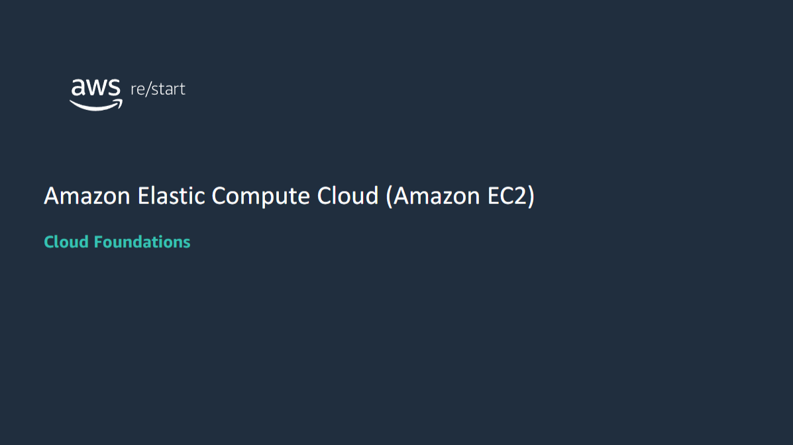
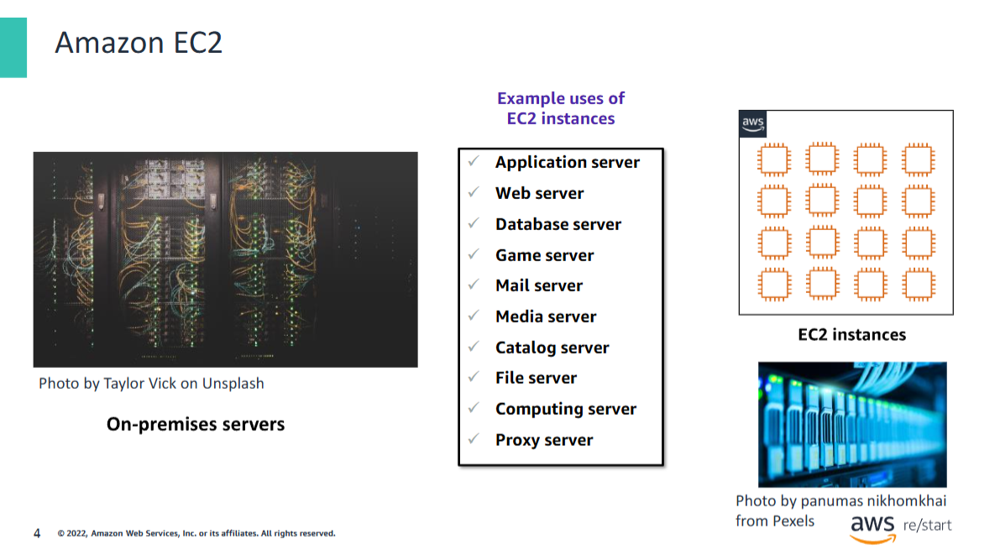
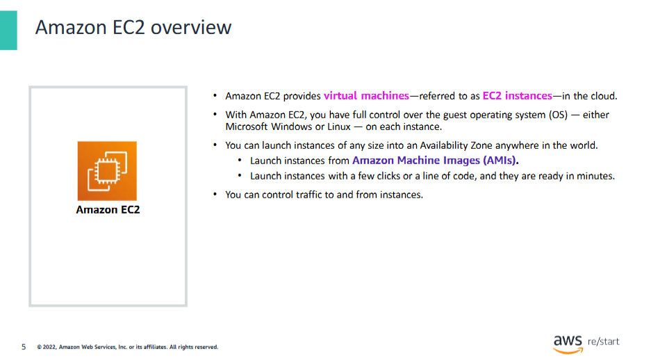

## Introduction to AWS Core Services – Compute

**Amazon Web Services (AWS)** provides multiple services to build a solution.  
Some of these services provide the **foundation to all solutions**, also known as the **core services**.

This module provides insight into the offerings of each **service category** and begins with the first group: **Compute**.

---

### What You'll Learn

- An **overview of Compute services**
- A closer look at **Amazon Elastic Compute Cloud (Amazon EC2)**

Whether you're building **mobile apps** or running **massive clusters** to sequence the human genome,  
**building and running your business starts with compute**.

---

### AWS Compute Services

AWS has a **broad catalog of Compute services**, offering:

- **Application services**
- **Flexible virtual servers**
- **Serverless computing**

## AWS runtime compute choices

AWS offers several **compute options** to meet different needs.  
When choosing a service for a workload, it’s important to understand the **available compute models**.

The key **runtime compute choices** can be grouped into **four categories** of cloud computing models:

- **Virtual Machines (VMs)**
- **Containers**
- **Platform as a Service (PaaS)**
- **Serverless**

In addition, AWS offers **specialized solutions** to address specific compute use cases.

---

#### Virtual Machines (VMs)

AWS provides two core services in this category:

- **Amazon EC2**: Secure and resizable **virtual servers in the cloud**
- **Amazon Lightsail**: Virtual private servers to run workloads in a **cost-effective** way

---

#### Containers

- **Amazon Elastic Container Service (Amazon ECS)**:  
  Run **Docker container applications** on AWS

---

#### Platform as a Service (PaaS)

- **AWS Elastic Beanstalk**:  
  Run **web applications and services** developed in:
    - Java
    - .NET
    - PHP
    - Node.js
    - Python
    - Ruby
    - Go
    - Docker

---

#### Serverless

- **AWS Lambda**:  
  Run code in:
    - Java, Go, PowerShell, Node.js, C#, Python, Ruby  
      No server management required.

- **AWS Fargate**:  
  A **serverless compute platform for containers**

---

#### Specialized Solutions

- **AWS Outposts**:  
  Run AWS infrastructure and services **on premises**

- **AWS Batch**:  
  Run **batch jobs at any scale**

---

#### Choosing the Right Compute Model

When selecting a runtime:

- **VMs and Containers**:
    - Offer **more control** over infrastructure
    - Allow for **greater customization**

- **PaaS and Serverless**:
    - Let you focus on the **application**, not the infrastructure
    - Support **quick deployment**

- **Specialized solutions**:
    - Designed for **specific workloads**
    - Fully managed by AWS
    - Ideal for **hybrid cloud** and **batch processing**

## Amazon EC2

### Running On-Premises vs. Using Amazon EC2

Running **on-premises servers** is an **expensive undertaking**:

- **Hardware must be procured**, often based on **project plans** rather than actual usage.
- **Data centers** are expensive to:
  - Build
  - Staff
  - Maintain
- Organizations must **permanently provision** hardware to handle **traffic spikes** and **peak workloads**.
- After deployment, **server capacity might remain unused** or **idle** for significant portions of time — leading to **waste**.

---

### Amazon EC2: A Cloud-Based Alternative

**Amazon EC2** provides **virtual machines** to host the same kinds of applications typically run on traditional on-premises servers.

#### Key Benefits:
- **Secure**
- **Resizable compute capacity**
- **Hosted in the cloud**

**EC2 instances** support a wide variety of workloads. Common uses include:

- **Application servers**
- **Web servers**
- **Database servers**
- **Game servers**
- **Mail servers**
- **Media servers**
- **Catalog servers**
- **File servers**
- **Computing servers**
- **Proxy servers**

## Amazon EC2 overview

The **EC2** in **Amazon EC2** stands for **Elastic Compute Cloud**:

- **Elastic**  
  Refers to the fact that you can automatically **increase or decrease the number of servers** to support an application.  
  You can also **scale the size of existing servers** up or down.

- **Compute**  
  Refers to the **primary purpose** of running servers: to **host applications** or **process data**.  
  These actions require compute resources, including:
  - **Processing power** (CPU)
  - **Memory** (RAM)

- **Cloud**  
  Refers to the fact that **EC2 instances are hosted in the cloud**.  
  Amazon EC2 provides **virtual machines** in the cloud.

---

### Operating System Support and Control

Amazon EC2 gives you **full administrative control** over the **operating system (OS)** running on the instance.  
You can run both **Microsoft Windows** and **Linux-based** OSs.

#### Supported Server OSs include:

- Windows 2008, 2012, 2016, 2019
- Red Hat
- SUSE
- Ubuntu
- Amazon Linux

> An OS that runs on a **virtual machine** is often called a **guest OS**,  
> in contrast to the **host OS**, which is installed directly on the physical server.

---

### Launching EC2 Instances

With **Amazon EC2**, you can:

- Launch **any number of instances**
- Choose **any size**
- Deploy to **any Availability Zone worldwide**
- All within **minutes**

Instances are launched from **Amazon Machine Images (AMIs)** —  
virtual machine **templates** that define the OS and software configuration.

> This module will discuss **AMIs** in more detail later.

You can **control traffic to and from instances** using **security groups**.

And because your servers run in the **AWS Cloud**, you can build solutions that use **multiple AWS services** together.