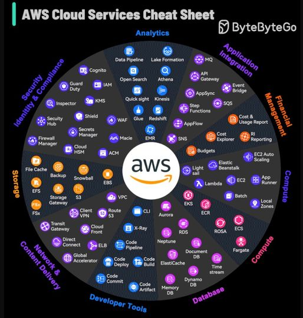

## Introduction Round

We interviewed each other and presented the interviewed person. 9 participents in total. Most of us are tech savvy. 

## Course Schedule 

Went thru all the weeks and syllabus of this course. [Course Overview Schedule](https://awsrestart.instructure.com/courses/3103/modules/items/2048062)

# AWS Services Overview

This is just a brief overview of all the available services. We will cover the main services in this course. Here is an overview about the main categories.

## AWS Cloud Cheat Sheet

### 1. Compute
- **EC2** (Elastic Compute Cloud)
- **Lambda** (Serverless functions)
- **ECS** (Elastic Container Service)

### 2. Storage
- **S3** (Simple Storage Service)
- **EBS** (Elastic Block Store)
- **Glacier** (Long-term archival)

### 3. Database
- **RDS** (Relational Database Service)
- **DynamoDB** (NoSQL database)
- **Aurora** (MySQL and PostgreSQL-compatible)

### 4. Networking
- **VPC** (Virtual Private Cloud)
- **Route 53** (DNS service)
- **CloudFront** (Content Delivery Network)

### 5. Security and Identity
- **IAM** (Identity and Access Management)
- **KMS** (Key Management Service)
- **WAF** (Web Application Firewall)

### 6. Management and Monitoring
- **CloudWatch** (Monitoring and observability)
- **CloudFormation** (Infrastructure as Code)
- **AWS Config** (Resource inventory and configuration history)

### 7. Analytics
- **Redshift** (Data warehousing)
- **EMR** (Elastic MapReduce for big data processing)
- **Athena** (Serverless query service)

### 8. Machine Learning
- **SageMaker** (Build, train, and deploy ML models)
- **Rekognition** (Image and video analysis)
- **Comprehend** (Natural language processing)

### 9. Application Integration
- **SQS** (Simple Queue Service)
- **SNS** (Simple Notification Service)
- **Step Functions** (Serverless workflow service)